# 解读计算机视觉模型

> 原文：<https://blog.paperspace.com/interpreting-computer-vision-models/>

计算机视觉作为一个领域可以追溯到 20 世纪 60 年代末，当时它起源于模仿人类视觉系统的雄心勃勃的目标。然而，在经历了漫长的人工智能冬天之后，这个领域最近在 2012 年成为了焦点，当时 AlexNet 赢得了第一届 ImageNet 挑战赛。AlexNet 在 GPU 上使用深度 CNN 对 ImageNet 中的数百万张图像以及数千个标签进行分类，前 5 名的错误率为 15.3%。

你们中的一些人可能想知道:CNN 是什么？

我简单给你解释一下。

卷积神经网络或 CNN 中神经元之间的连接模式受到动物视觉皮层组织的启发。皮层中的单个神经元只在视野中被称为感受野的有限区域内对刺激做出反应。类似地，CNN 有内核(一个具有共享权重的 *n* x *n* 矩阵)，它沿着输入图像滑动以捕捉空间信息，而这是[多层感知器](https://en.wikipedia.org/wiki/Multilayer_perceptron)所做不到的。

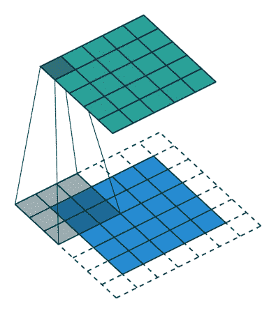

[Source](https://theano-pymc.readthedocs.io/en/latest/tutorial/conv_arithmetic.html)

对于高分辨率图像，拥有完全连接的节点网络在计算上是不可行的。此外，神经元的完全连接对于固有地包含空间局部输入模式的图像是浪费的。我们可以从图案中推断出更精细的细节，并节省成本。

## CNN 的兴起和可解释性案例

CNN 在减小网络规模的同时，还增加了参考局部性，这对于图像数据非常重要。因此，CNN 被广泛用于计算机视觉任务。

*   例如，在自动驾驶汽车中，它们被用于从检测和分类道路上的物体到从人行道分割道路的一切事情。
*   在医疗保健领域，它们被用于 x 光、核磁共振成像和 CT 扫描来检测疾病。
*   它们还用于制造和生产线，以检测有缺陷的产品。

这些只是众多用例中的少数几个，但它们正确地传达了这些系统与我们的日常生活是如何交织在一起的。但是，尽管它们很常见，但如果没有深度学习和人工智能领域的知识，对它们的解释可能会很困难。因此，能够解释这些“黑箱”的预测变得极其重要。在这篇博客中，我们将探索解读这些网络预测的技术。

我将把口译技巧大致分为两类:

### 基于遮挡或扰动的技术

这些方法处理部分图像以生成解释。这到底是怎么回事？我将用两个库来解释它。

1.  **石灰图像讲解器:**

本地可解释模型不可知解释(或 LIME)是一个支持几乎所有数据形式的本地解释的库。这些解释是模型不可知的(独立于所使用的模型)，并且试图只解释个别的预测而不是整个模型(局部的)。石灰处理图像的方式可以分解为以下步骤:

*   **获得图像的随机扰动:**在时间上，图像的变化是通过将图像分割成“超像素”并关闭或打开它们而产生的。这些超像素相互连接，可以通过将每个像素替换为灰色来关闭。对于每个图像，我们有一组扰动图像。
*   **预测扰动图像的类别**:对于每个扰动图像，使用我们试图解释的原始模型来预测类别。
*   **计算扰动的重要性**:使用余弦相似度等距离度量来评估每个扰动与原始图像的不同程度。原始图像也是所有超像素开启时的扰动。
*   **训练一个可解释的代理模型**:代理模型是一个线性模型，就像逻辑回归一样，本质上是可解释的。该模型接受原始模型的输入和输出，并试图逼近原始模型。初始权重是我们在上一步中计算的权重。模型拟合后，与图像中每个超像素相关的权重或系数告诉我们该超像素对预测类别有多重要。

我们现在将使用预训练的 Inception-V3 模型来对猫和老鼠图像进行预测。

```py
from keras.applications import inception_v3 as inc_net
from keras.preprocessing import image
from keras.applications.imagenet_utils import decode_predictions
from skimage.io import imread
import matplotlib.pyplot as plt
import lime
from lime import lime_image

def load_img(path):
    img = image.load_img(path, target_size=(224, 224))
    img = image.img_to_array(img)
    img = np.expand_dims(img, axis=0)
    return img

def predict_class(img):
    img = inc_net.preprocess_input(img)
    img = np.vstack([img])
    return inet_model.predict(img)

inet_model = inc_net.InceptionV3()

img = load_img('cat-and-mouse.jpg')
preds = predict_class(img)
plt.figure(figsize=(3,3))
plt.imshow(img[0] / 2 + 0.5)
for x in decode_predictions(preds)[0]:
    print(x) 
```

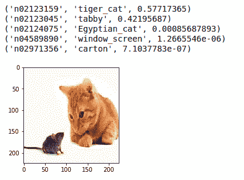

Top 5 predicted labels for the image

接下来，我们将使用石灰来解释这些预测。

```py
# instantiate lime image explainer and get the explaination 
explainer = lime_image.LimeImageExplainer()
explanation = explainer.explain_instance(img[0], inet_model.predict, top_labels=5, hide_color=0, num_samples=1000)

# plot interpretation
temp, mask = explanation.get_image_and_mask(282, positive_only=False, num_features=100, hide_rest=False)
plt.figure(figsize=(3,3))
plt.imshow(skimage.segmentation.mark_boundaries(temp / 2 + 0.5, mask)) 
```

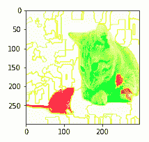

绿色超像素对预测标签即虎猫有积极的贡献。而红色超像素负贡献。

即使有些红色超像素躺在猫身上。该模型在学习图像中的基本概念方面做得很好，颜色反映了这一点。

Lime 对图像的实现与其对表格数据的[实现非常相似。但是我们改变超像素，而不是干扰单个像素。由于我们之前讨论过的位置引用，一个类中有多个像素。](https://blog.paperspace.com/interpretable-machine-learning/)

2. **SHAP 分区解说**:

另一个流行的解释库是 SHAP。它使用来自[博弈论](https://en.wikipedia.org/wiki/Game_theory)的概念来产生解释。考虑一个由一群人合作进行的游戏。每个玩家都对游戏有所贡献，有些玩家可能比其他人贡献更多，有些玩家可能贡献更少。将有一个最终的分配，每个玩家的贡献总和将决定游戏的结果。

我们想知道每个参与者对整体合作有多重要，以及他们能期望什么样的回报。为了更具体地说明手头的任务，每个超像素对图像整体预测类别的贡献有多重要。

Shapley 值提供了一个可能的答案。

让我们试着用 SHAP 来解读同一个猫和老鼠的形象。这里我们将使用一个 Resnet50 来代替一个初始模型。

```py
from tensorflow.keras.applications.resnet50 import ResNet50, preprocess_input
import shap
import json 

# load pretrained model
model = ResNet50(weights='imagenet')
def predict(x):
    tmp = x.copy()
    preprocess_input(tmp)
    return model(tmp)

# get imagenet class names
url = "https://s3.amazonaws.com/deep-learning-models/image-models/imagenet_class_index.json"
with open(shap.datasets.cache(url)) as file:
    class_names = [v[1] for v in json.load(file).values()]

# define a masker that is used to mask out partitions of the input image.
masker = shap.maskers.Image("inpaint_telea", img.shape[1:])

# create an explainer with model and image masker
explainer = shap.Explainer(f, masker, output_names=class_names,algorithm='partition')

# here we explain the same image and use 1000 evaluations of Resnet50 to get the shap values 
shap_values = explainer(img, max_evals=1000, batch_size=50, outputs=shap.Explanation.argsort.flip[:4])

shap.image_plot(shap_values) 
```

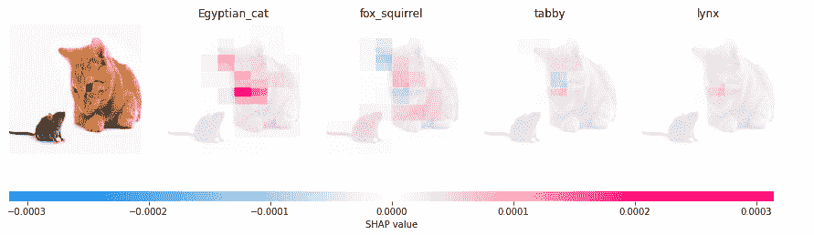

第一个被预测的种类是埃及猫，接下来是狐松鼠、虎斑猫和猞猁。猫面部的超像素对预测有积极的贡献。该模型在鼻子或胡须区域放置了很大的重量。

在 SHAP 中使用分区解释器的一个优点是，它不会做出一个潜在的假设，即这里的特征(或超像素)独立于其他特征而存在。这是一个很大的(错误的)假设，是由很多解释模型做出的。

我们现在来看看下一类的解释技巧。

### 基于梯度的技术

这些方法计算预测相对于输入图像的梯度。简而言之，他们发现像素的变化是否会改变预测。如果您要更改像素的颜色值，预测的类概率将会上升(正梯度)或下降(负梯度)。梯度的大小告诉我们扰动的重要性。

我们将看看一些使用梯度进行解释的技术:

#### 1.Grad-CAM

梯度加权类激活图或 Grad-CAM 使用流入最终卷积层的类的梯度来产生热图，该热图突出显示了用于预测类的图像中的重要区域。该热图随后被放大并叠加在输入图像上以获得可视化效果。获取热图的步骤如下:

1.  我们通过网络前向传播图像以获得预测，以及全连接层之前的最后一个卷积层的激活。
2.  然后，我们计算顶部预测类相对于最后一个卷积层的激活的梯度。
3.  然后，我们通过类别的梯度对每个特征图像素进行加权。这给了我们全局汇集梯度。
4.  我们计算特征图的平均值，该平均值通过梯度对每个像素进行加权。这是通过将在最后一张地图中获得的特征地图中的每个通道乘以最后一层的输出来实现的。这告诉我们通道对于输出类有多重要。然后，我们对所有通道求和，以获得该类的热图激活。
5.  然后，我们将像素归一化到 0 和 1 之间，这样就很容易可视化了。

```py
import tensorflow as tf
import keras
import matplotlib.cm as cm
from IPython.display import Image

def make_gradcam_heatmap(img_array, model, LAST_CONV_LAYER_NAME, pred_index=None):
    # Step 1
    grad_model = tf.keras.models.Model(
        [model.inputs], [model.get_layer(LAST_CONV_LAYER_NAME).output, model.output]
    )

    with tf.GradientTape() as tape:
        last_conv_layer_output, preds = grad_model(img_array)
        if pred_index is None:
            pred_index = tf.argmax(preds[0])
        class_channel = preds[:, pred_index]

    # Step 2
    grads = tape.gradient(class_channel, last_conv_layer_output)

    # Step 3
    pooled_grads = tf.reduce_mean(grads, axis=(0, 1, 2))

    # Step 4
    last_conv_layer_output = last_conv_layer_output[0]
    heatmap = last_conv_layer_output @ pooled_grads[..., tf.newaxis]
    heatmap = tf.squeeze(heatmap)

    # Step 5
    heatmap = tf.maximum(heatmap, 0) / tf.math.reduce_max(heatmap)
    return heatmap.numpy() 
```

我们使用与上面例子中相同的 ResNet50 模型。我们还有一个助手功能，可以将热图叠加在原始图像上并显示出来。

```py
def save_and_display_gradcam(img_path, heatmap, alpha=0.4):
    # Load the original image
    img = keras.preprocessing.image.load_img(img_path)
    img = keras.preprocessing.image.img_to_array(img)

    # Rescale heatmap to a range 0-255
    heatmap = np.uint8(255 * heatmap)

    # Use jet colormap to colorize heatmap
    jet = cm.get_cmap("jet")

    # Use RGB values of the colormap
    jet_colors = jet(np.arange(256))[:, :3]
    jet_heatmap = jet_colors[heatmap]

    # Create an image with RGB colorized heatmap
    jet_heatmap = keras.preprocessing.image.array_to_img(jet_heatmap)
    jet_heatmap = jet_heatmap.resize((img.shape[1], img.shape[0]))
    jet_heatmap = keras.preprocessing.image.img_to_array(jet_heatmap)

    # Superimpose the heatmap on original image
    superimposed_img = jet_heatmap * alpha + img
    superimposed_img = keras.preprocessing.image.array_to_img(superimposed_img)
    # Display the image
    plt.figure(figsize=(8,4))
    plt.axis("off")
    plt.imshow(superimposed_img) 
```

厌倦了猫和老鼠的形象？这次我们将使用新的图像。

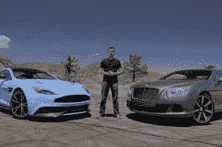

让我们看看这个图像的顶级类。

```py
# Prepare image
img_array = preprocess_input(load_img('cars.jpg',224))
# Print the top 2 predicted classes
preds = model.predict(img_array)
print("Predicted:", decode_predictions(preds, top=2)[0]) 
```

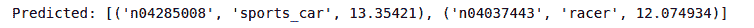

该模型将汽车分类为跑车，并将站在它们之间的人分类为赛车手。让我们想象一下最后一个卷积层的激活。

```py
heatmap = make_gradcam_heatmap(img_array, model, 'conv5_block3_out', pred_index=class_names.index("sports_car"))
save_and_display_gradcam('cars.jpg', heatmap) 
```

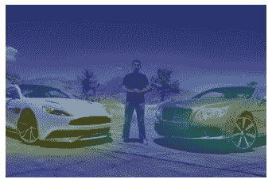

似乎第`conv5_block3_out`层的神经元被汽车的前部激活了。我们可以确信模型学习了这个类的正确特征。

现在，让我们为“racer”类设想一下。

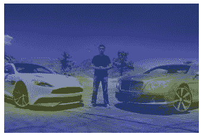

这一次，汽车仍然使用汽车像素来将该图像分类为“赛车”，而不是赋予代表男人的像素重要性。这不符合我们的预期，也许模型使用图像中的全局上下文来预测类。例如，一个不站在跑车旁边的人会被称为赛车手吗？

那要由你自己去发现；)

#### 2.制导摄像机

由于 Grad CAM 使用最后一个卷积层来生成热图，因此定位非常粗略。由于最后一个图层的分辨率比输入图像的分辨率要粗糙得多，因此在将热点图叠加到图像上之前，会对其进行升级。

我们使用引导反向传播来获得高分辨率的定位。我们针对输入图像的像素来计算损失梯度，而不是针对最后一个卷积层的激活来计算损失梯度。然而，这样做可能会产生噪声图像，因此我们在反向传播中使用 ReLu(换句话说，我们剪切所有小于 0 的值)。

```py
@tf.custom_gradient
def guided_relu(x):
    # guided version of relu which allows only postive gradients in backpropogation
    def grad(dy):
        return tf.cast(dy > 0, "float32") * tf.cast(x > 0, "float32") * dy

    return tf.nn.relu(x), grad

class GuidedBackprop:
    def __init__(self, model):
        self.model = model
        self.gb_model = self.build_guided_model()

    def build_guided_model(self):
        # build a guided version of the model by replacing ReLU with guided ReLU in all layers
        gb_model = tf.keras.Model(
            self.model.inputs, self.model.output
        )
        layers = [
            layer for layer in gb_model.layers[1:] if hasattr(layer, "activation")
        ]
        for layer in layers:
            if layer.activation == tf.keras.activations.relu:
                layer.activation = guided_relu
        return gb_model

    def guided_backprop(self, image: np.ndarray, class_index: int):
        # convert to one hot representation to match our softmax activation in the model definition
        expected_output = tf.one_hot([class_index] * image.shape[0], NUM_CLASSES)
        # define the loss
        with tf.GradientTape() as tape:
            inputs = tf.cast(image, tf.float32)
            tape.watch(inputs)
            outputs = self.gb_model(inputs)
            loss = tf.keras.losses.categorical_crossentropy(
                expected_output, outputs
            )
        # get the gradient of the loss with respect to the input image
        grads = tape.gradient(loss, inputs)[0]
        return grads 
```

让我们看看上面看到的跑车示例的显著性图。我们将使用相同的 ResNet50 型号。

```py
gb = GuidedBackprop(model)
NUM_CLASSES = 1000
saliency_map = gb.guided_backprop(img_array, class_index=class_names.index("sports_car")).numpy()

# Normalize with mean 0 and std 1
saliency_map -= saliency_map.mean()
saliency_map /= saliency_map.std() + tf.keras.backend.epsilon()
# Change mean to 0.5 and std to 0.25
saliency_map *= 0.25
saliency_map += 0.5
# Clip values between 0 and 1
saliency_map = np.clip(saliency_map, 0, 1)
# Change values between 0 and 255
saliency_map *= (2 ** 8) - 1
saliency_map = saliency_map.astype(np.uint8)

plt.axis('off')
plt.imshow(saliency_map) 
```

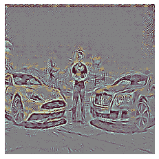

即使我们通过引导反向传播创建的显著图具有更高的分辨率，它也不是类别区分的，即定位不能区分类别。那是我们用摄像机的地方。Grad-CAM 热图使用双线性插值进行上采样，然后两个图按元素相乘。

```py
gb = GuidedBackprop(model)

# Guided grad_cam is just guided backpropogation with feature importance coming from grad-cam
saliency_map = gb.guided_backprop(img_array, class_index=class_names.index("sports_car")).numpy()
gradcam = cv2.resize(heatmap, (224, 224))
gradcam =
np.clip(gradcam, 0, np.max(gradcam)) / np.max(gradcam)
guided_gradcam = saliency_map * np.repeat(gradcam[..., np.newaxis], 3, axis=2)

# Normalize
guided_gradcam -= guided_gradcam.mean()
guided_gradcam /= guided_gradcam.std() + tf.keras.backend.epsilon()
guided_gradcam *= 0.25
guided_gradcam += 0.5
guided_gradcam = np.clip(guided_gradcam, 0, 1)
guided_gradcam *= (2 ** 8) - 1
guided_gradcam = guided_gradcam.astype(np.uint8)

plt.axis('off')
plt.imshow(guided_gradcam) 
```

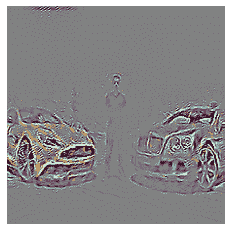

Grad-CAM 就像一个镜头，聚焦于通过引导反向传播获得的像素属性图的特定部分。这里，对于“跑车”类，主要是与汽车相关的像素被突出显示。

```py
gb = GuidedBackprop(model)

# Guided grad_cam is just guided backpropogation with feature importance coming from grad-cam
saliency_map = gb.guided_backprop(img_array, class_index=class_names.index("racer")).numpy()
gradcam = cv2.resize(heatmap, (224, 224))
gradcam = np.clip(gradcam, 0, np.max(gradcam)) / np.max(gradcam)
guided_gradcam = saliency_map * np.repeat(gradcam[..., np.newaxis], 3, axis=2)

# Normalize
guided_gradcam -= guided_gradcam.mean()
guided_gradcam /= guided_gradcam.std() + tf.keras.backend.epsilon()
guided_gradcam *= 0.25
guided_gradcam += 0.5
guided_gradcam = np.clip(guided_gradcam, 0, 1)
guided_gradcam *= (2 ** 8) - 1
guided_gradcam = guided_gradcam.astype(np.uint8)

plt.axis('off')
plt.imshow(guided_gradcam) 
```

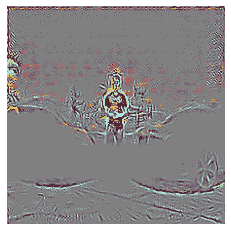

正如你所看到的，制导 Grad CAM 在定位“赛车”类的像素方面比 Grad CAM 做得更好。

#### 3.预期梯度

接下来是预期梯度。它们结合了三个不同的概念:其中一个你已经在 SHAP 价值观中听说过。除了 SHAP 值，他们还使用综合梯度。积分梯度值与 SHAP 值略有不同，需要一个参考值进行积分。为了使它们接近 SHAP 值，在预期梯度中，我们将积分重新表述为[期望值](https://en.wikipedia.org/wiki/Expected_value)，并将该期望值与从背景数据集中采样的参考值相结合。这导致单一组合的梯度期望，其向属性值收敛，该属性值相加给出期望的模型输出和当前输出之间的差异。

它使用的最后一个概念是局部平滑。在期望值计算过程中，它会将正态分布噪声与标准偏差(指定为参数)相加。这有助于创建更平滑的特征属性，从而更好地捕捉图像的相关区域。

这次我们将使用 VGG16，因为我们已经可视化了来自输入图像和最后一个卷积层的梯度，我们将可视化来自中间层(第 7 层)的梯度。

```py
from keras.applications.vgg16 import VGG16
from keras.applications.vgg16 import preprocess_input, decode_predictions
import tensorflow.compat.v1.keras.backend as K
import tensorflow as tf
tf.compat.v1.disable_eager_execution()

# load pre-trained model and choose two images to explain
model = VGG16(weights='imagenet', include_top=True)
X,y = shap.datasets.imagenet50()
to_explain = load_img('cars.jpg',224)

# load the ImageNet class names
url = "https://s3.amazonaws.com/deep-learning-models/image-models/imagenet_class_index.json"
fname = shap.datasets.cache(url)
with open(fname) as f:
    class_names = json.load(f)

# explain how the input to the 7th layer of the model explains the top two classes
def map2layer(x, layer):
    feed_dict = dict(zip([model.layers[0].input], [preprocess_input(x.copy())]))
    return K.get_session().run(model.layers[layer].input, feed_dict)

e = shap.GradientExplainer((model.layers[7].input, model.layers[-1].output), map2layer(preprocess_input(X.copy()), 7) ,local_smoothing=100)
shap_values,indexes = e.shap_values(map2layer(to_explain, 7), ranked_outputs=3, nsamples=100)

# get the names for the classes
index_names = np.vectorize(lambda x: class_names[str(x)][1])(indexes)

# plot the explanations
shap.image_plot(shap_values, to_explain, index_names) 
```

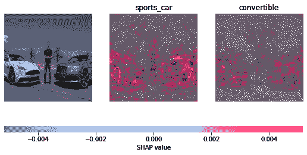

模型预测的第一个标签是跑车。模型的第 7 层关注用红色突出显示的像素。

### 结论

我们研究了各种可视化 CNN 的技术。这里需要注意的是，当模型提供的解释与我们的预期不符时，可能有两个原因。要么模型没有正确学习，要么模型学习了比人类能够感知的更复杂的关系。

在[渐变笔记本](https://console.paperspace.com)上尝试一下，在笔记本创建的“高级选项”中创建一个 TensorFlow 运行时笔记本，并将以下内容作为您的“工作区 URL”:【https://github.com/gradient-ai/interpretable-ml-keras】T2

### 参考

*   [https://shap . readthedocs . io/en/latest/generated/shap . explainers . partition . html](https://shap.readthedocs.io/en/latest/generated/shap.explainers.Partition.html)
*   [https://shap . readthedocs . io/en/stable/example _ notebooks/image _ examples/image _ classification/Explain resnet 50 使用分区 explainer.html](https://shap.readthedocs.io/en/stable/example_notebooks/image_examples/image_classification/Explain%20ResNet50%20using%20the%20Partition%20explainer.html)
*   [https://towards data science . com/interpretable-machine-learning-for-image-class ification-with-lime-ea 947 e 82 ca 13](https://towardsdatascience.com/interpretable-machine-learning-for-image-classification-with-lime-ea947e82ca13)
*   [https://towards data science . com/interpreting-CNN-models-a 11 B1 f 720097](https://towardsdatascience.com/interpreting-cnn-models-a11b1f720097)
*   [https://shap-lrjball . readthedocs . io/en/latest/example _ notebooks/gradient _ explainer/讲解 ImageNet.html 上 VGG16 的一个中间层](https://shap-lrjball.readthedocs.io/en/latest/example_notebooks/gradient_explainer/Explain%20an%20Intermediate%20Layer%20of%20VGG16%20on%20ImageNet.html)