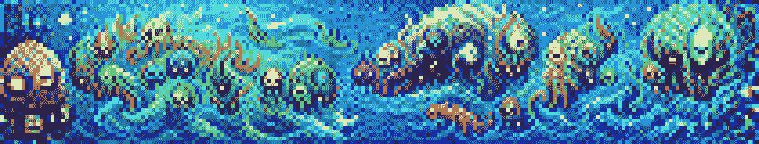
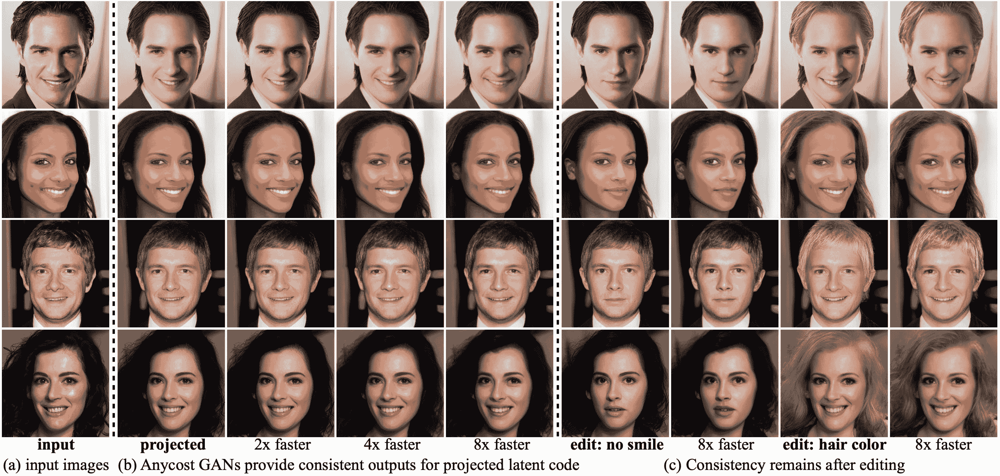

# Paperspace 赞助了一个以 GANs 为主题的拥抱脸社区冲刺

> 原文：<https://blog.paperspace.com/hugging-face-community-sprint-gan/>

我们最喜欢的话题之一是 GANs 或生成性对抗网络。近年来，GAN 的实现已经激增，其结果是用简单的指令集来生成像素艺术、印象派绘画以及介于两者之间的一切。最近几个月，我们发表了关于 [JoJoGAN](https://blog.paperspace.com/one-shot-face-stylization-with-jojogan/) 、 [GFP-GAN](https://blog.paperspace.com/restoring-old-photos-using-gfp-gan/) 、 [VQGAN-CLIP](https://blog.paperspace.com/how-i-made-this-articles-cover-photo-with-vqgan-clip/) 、 [Wasserstein GANs](https://blog.paperspace.com/wgans/) 、[超分辨率 GANs](https://blog.paperspace.com/super-resolution-generative-adversarial-networks/) 和 [DCGANs](https://blog.paperspace.com/face-generation-with-dcgans/) 的文章，仅举几例。

这就是为什么我们如此兴奋地宣布，我们将与我们的朋友合作，在本月以 GAN 为重点的社区冲刺拥抱脸提供免费的计算资源。

请继续阅读，了解如何加入这一有趣的活动。

## 介绍

Paperspace 和 Hugging Face 合作为即将到来的 [HugGAN 社区冲刺](https://discuss.huggingface.co/t/open-to-the-community-huggan-sprint/16302)的参与者提供免费计算资源。

参与者将有两周的时间使用 Paperspace compute 和拥抱面部工具来训练和展示 GANs。

## 日期

**开球**:2022 年 4 月 4 日
**投稿**:2022 年 4 月 4 日-4 月 15 日
**奖品公布**:2022 年 4 月 22 日

## 如何参与

*   点击查看活动信息页面
*   填写[这张](https://docs.google.com/forms/d/e/1FAIpQLSd_mpK4dYu1V-ejeTzoiIsTiMSVlZ0kYQCEoBmoa0vH-bNuag/viewform)表格
*   创建[拥抱面部中枢](https://huggingface.co/join)账户并加入[拥抱](https://huggingface.co/organizations/huggan/share/bekBYwkjyeJOAlxpcYRKgjLaRcrnIOeuge)组织
*   加入[不和谐频道](https://discord.gg/H3bUrDPTfS)

## 建议

需要一些 GANs 合作的想法吗？我们掩护你！这里有五个尚未在拥抱脸空间上出现的 GAN 库:

Pixray - [Source](https://github.com/pixray/pixray)

*   [Pixray](https://github.com/pixray/pixray) :一种图像生成方法，用于创建高度精细的像素和绘画图像和艺术品。Pixray 使用 CLIP 将文本提示转化为独特的生成作品。
*   [Transeditor](https://github.com/billyxyb/transeditor) :这款基于变形金刚的双空间 GAN 允许高度可控的面部调制，如变换姿势或改变发型。
*   :这款场景生成 GAN 可以生成无限数量的复杂而独特的场景，如风景或城市景观。

Anycost-GAN - [Source](https://github.com/mit-han-lab/anycost-gan)

*   [Anycost-GAN](https://github.com/mit-han-lab/anycost-gan) :一种用于面部图像编辑的 GAN 方法，可以通过修改通道和再分辨率配置设置在各种计算成本上运行。
*   [StyleMapGAN:](https://github.com/naver-ai/StyleMapGAN) 这种 GAN 利用潜在的空间维度对面部图像进行精细的细节编辑。