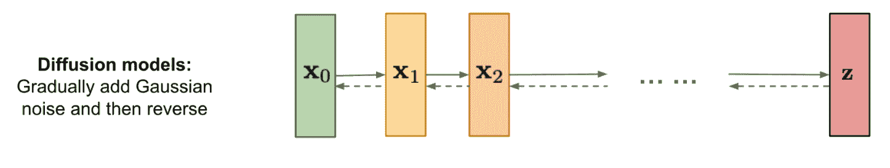
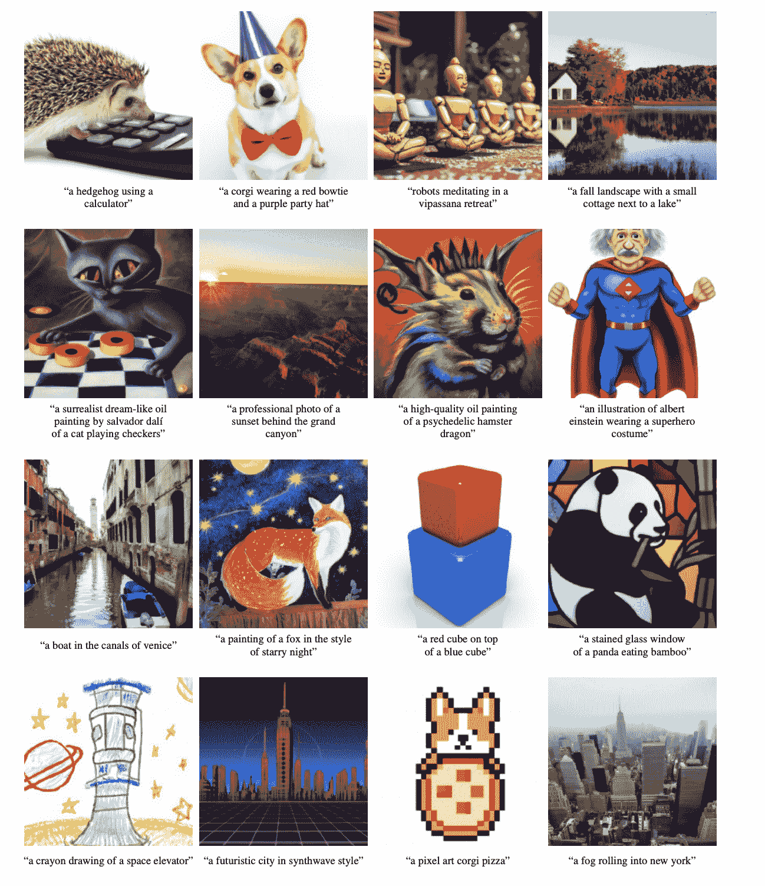
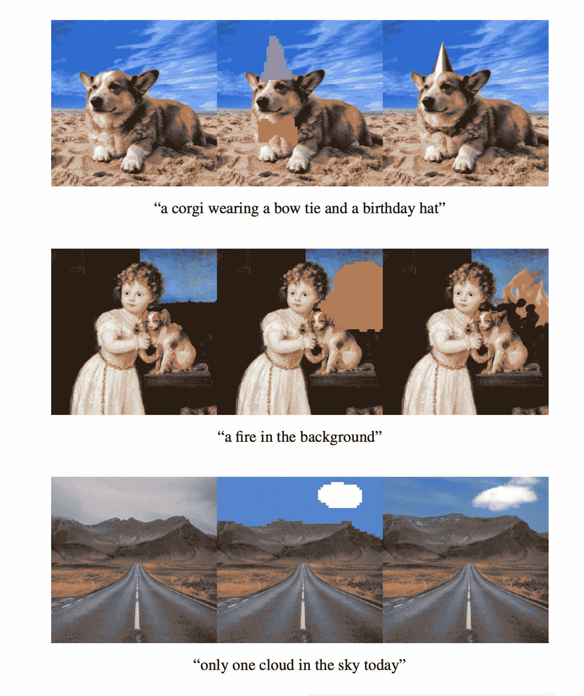
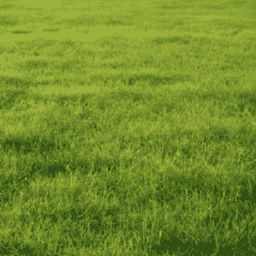
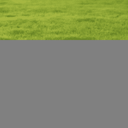
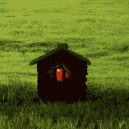

# 使用 OpenAI 的 GLIDE 从文本提示生成和编辑照片级真实感图像

> 原文：<https://blog.paperspace.com/glide-image-generation/>

今年早些时候，我们展示了 [PixRay 项目的 PixelDrawer](https://blog.paperspace.com/how-i-made-this-articles-cover-photo-with-vqgan-clip/) ,展示了我们如何在只有文本提示的情况下，生成一个精确到所提供描述的独特而有创意的作品。PixRay 还可以用于创建丰富多彩和细节丰富的艺术，尽管有点卡通和超现实主义。这是恐怖谷的问题:这些模型生成的图像在意义上与文本提示是准确的，但它们通常不像现实。

因此，目标是生成如此逼真的作品，以至于它们可以愚弄人工智能和人类演员，这是一个有趣的挑战，而准确和普遍地做到这一点以满足随机文本提示的潜在范围甚至更困难。解释一个字符串的含义，并把它转换成图像，这是一项连人类都难以完成的任务。这在很大程度上是为什么文本到视觉模型像[剪辑](https://github.com/openai/CLIP)往往会在这个主题的研究中如此频繁地出现。

在本文中，我们将研究 OpenAI 的 [GLIDE](https://github.com/openai/glide-text2im) ，这是许多令人兴奋的项目之一，旨在使用文本导向扩散模型生成和编辑照片级真实感图像。我们将首先分解 GLIDE 的基于扩散模型的框架如何在引擎盖下运行，然后通过代码演示在渐变笔记本上运行 GLIDE。

[https://www.youtube.com/embed/o8tfaOVBOew?feature=oembed](https://www.youtube.com/embed/o8tfaOVBOew?feature=oembed)

# 滑音

## 体系结构

GLIDE 架构可以归结为三个部分:一个烧蚀扩散模型(ADM ),用于生成 64 x 64 的图像；一个文本模型(transformer ),通过文本提示影响图像的生成；以及一个上采样模型，用于将较小的 64 x 64 图像转换为更易于理解的 256 x 256 像素。前两个组件相互作用，以指导图像生成过程准确地反映文本提示，而后者是使我们生成的图像更容易理解所必需的。

GLIDE 项目的根源在于[2021 年发布的另一篇论文](https://arxiv.org/pdf/2105.05233.pdf)，该论文表明，在图像样本质量方面，ADM 方法可以胜过同时代流行的最先进的生成模型。GLIDE 作者为 ADM 使用了与 Dhariwal 和 Nichol 相同的 ImageNet 64 × 64 模型，但选择将模型宽度增加到 512 通道。这为 ImageNet 模型产生了大约 23 亿个参数。然而，与 Dhariwal 和 Nichol 不同的是，GLIDE 团队希望能够更直接地影响图像生成过程，因此他们将视觉模型与注意力激活转换器配对。

通过处理文本输入提示，GLIDE 能够对图像生成过程的输出进行某种程度的控制。这是通过在足够大的数据集(与在 [DALL-E](https://arxiv.org/abs/2102.12092) 项目中使用的相同)上训练 transformer 模型来完成的，该数据集由图像及其相应的标题组成。为了以文本为条件，文本首先被编码成一个由 *K 个*标记组成的序列。然后，这些令牌被输入到一个转换器模型中。变压器的输出有两种用途。首先，最终的令牌嵌入被用来代替 ADM 模型的类嵌入。第二，令牌嵌入的最后一层——特征向量序列——被分别投影到 ADM 模型中每个注意力层的维度，并连接到每个注意力层的注意力上下文。在实践中，这允许 ADM 模型使用其学习到的对输入单词及其相关图像的理解，以独特且逼真的方式从相似文本标记的新颖组合中生成图像。这个文本编码转换器使用 24 个宽度为 2048 的残差块，大约有 12 亿个参数。

最后，上采样器扩散模型也具有大约 15 亿个参数，并且与基本模型的不同之处在于其文本编码器更小，具有 1024 和 384 个基本通道的宽度。顾名思义，这个模型有助于扩大样本的规模，以提高机器和人类参与者的可解释性。

### 扩散模型



[Source](https://lilianweng.github.io/posts/2021-07-11-diffusion-models/)

GLIDE 利用自己的 ADM 实现(ADM-G 代表“guided”)来执行图像生成。ADM-G 可以被认为是扩散 U-net 模型的一种改进。

扩散 U 网模型明显不同于更流行的基于 VAE、GAN 和变压器的图像合成技术。他们创建了扩散步骤的马尔可夫链，将随机噪声逐步引入数据，然后他们学习逆转扩散过程，并仅从噪声中重建所需的数据样本。

它分两个阶段工作:向前扩散和向后扩散。给定来自样本实际分布的数据点，前向扩散过程在预定义的一组步骤中向样本添加少量噪声。随着步长变大并接近无穷大，样本将失去其所有可区分的特征，并且序列将开始模仿各向同性高斯曲线。在反向扩散过程中，扩散模型顺序地学习反转添加的噪声对图像的影响，并通过试图逼近原始输入样本分布来引导生成的图像朝向其原始形式。一个完美的模型将能够从一个真正的高斯噪声输入和一个提示中做到这一点。

ADM-G 与上述过程的不同之处在于，模型(CLIP 或专用转换器)使用输入的文本提示标记来影响反向扩散步骤。

### 剪辑与无分类器的指导

作为 GLIDE 图像合成器开发的一部分，研究人员试图创建一种新颖、改进的方法来影响生成过程。通常，“首先在有噪声的图像上训练分类器，并且在扩散采样过程中，来自分类器的梯度用于将样本导向标签”([源](https://arxiv.org/pdf/2112.10741.pdf))。这就是通常使用 CLIP 之类的模型的地方。CLIP 从自然语言监督中学习视觉概念，并可以将这些学习到的概念传授给图像合成过程。然而，代价是使用裁剪在计算上是昂贵的。同时，[何&萨利曼(2021)](https://openreview.net/pdf?id=qw8AKxfYbI) 展示了不使用分类器进行引导的先例。他们证明了可比较的图像质量可以通过“在有标签和无标签的扩散模型的预测之间进行插值”来实现(“T4”来源)。这被称为无分类器制导。

```py
# Create a classifier-free guidance sampling function
def model_fn(x_t, ts, **kwargs):
    half = x_t[: len(x_t) // 2]
    combined = th.cat([half, half], dim=0)
    model_out = model(combined, ts, **kwargs)
    eps, rest = model_out[:, :3], model_out[:, 3:]
    cond_eps, uncond_eps = th.split(eps, len(eps) // 2, dim=0)
    half_eps = uncond_eps + guidance_scale * (cond_eps - uncond_eps)
    eps = th.cat([half_eps, half_eps], dim=0)
    return th.cat([eps, rest], dim=1)
```

根据这些发现，GLIDE 的分类器自由导航作为一个梯度函数，其行为类似于模型(见上面的代码)。这是`p_sample_loop`(训练)函数的一个参数，可用于强制扩散模型使用其对输入的学习理解来影响图像生成程序。

总的来说，GLIDE 的作者发现无分类器指导比使用 CLIP 更有效。这有两个原因。首先，单个模型可以使用它自己的知识来指导合成，而不是必须通过解释单独的分类模型来这样做。第二，当以难以用分类器预测的信息(例如文本)为条件时，它简化了指导。因此，当进行人工质量测试时，与没有引导或使用剪辑生成的图像相比，使用无分类器引导生成的图像通常被描述为质量更高，对字幕更准确。

作者还推测，公开可用的剪辑模型没有在充分噪声的数据上训练，并且在采样期间遇到的噪声中间图像对他们来说是不分布的。这可能会导致两种方法在感知能力上的一些差异。

可以用`clip_guided.ipynb`和`text2im.ipynb`笔记本自己测试一下他们的能力！

## 能力



[Source](https://arxiv.org/pdf/2112.10741.pdf)

### 图象生成

GLIDE 最流行和最常见的用例无疑是它在图像合成方面的潜力。虽然这些图像很小，并且在动物/人的形状上滑行很困难，但是一次成像的潜力几乎是无限的。它不仅可以生成动物、名人、风景、建筑等更多的图像，而且还可以以不同的艺术风格或逼真的方式来实现。正如你从上面的例子中所看到的，论文的作者认为 GLIDE 能够理解各种各样的文本输入并将其转化为图像格式。



[Source](https://arxiv.org/pdf/2112.10741.pdf)

### 修补

可以说，GLIDE 更有趣的应用是它的自动照片修复。GLIDE 能够接受现有的图像作为输入，在需要编辑的区域使用文本提示对其进行处理，并可以轻松地对图像中的这些区域进行添加。为了获得更好的结果，GLIDE 需要与编辑模型结合使用，比如 [SDEdit](https://github.com/ermongroup/SDEdit) 。将来，利用这种能力的应用程序可能是创建无代码图像编辑方法的关键。

# 代码演示

为了您的方便，我们已经创建了一个包含演示笔记本的 GLIDE repo 的[分支，这些演示笔记本已经过优化，可以在 Gradient 上运行，请务必查看它们！您还可以直接从 Gradient 访问和派生演示笔记本。回购的笔记本目录中有三个笔记本，每个笔记本专注于不同的任务。对于图像生成的无分类器指导:使用`text2im.ipynb`，对于剪辑指导:使用`clip_guided.ipynb`，对于修复现有照片:使用`inpaint.ipynb`。](https://github.com/gradient-ai/glide-text2im/)

一旦你设置好了一切，让我们从进入`inpaint.ipynb`文件开始。这是一个笔记本，你可以用它来输入你自己的图像，然后由修复模型进行编辑。我们将在这个演示中演练修复笔记本，因为它可以说是本文中展示的 ADM-G 的最新颖的用途。其他的笔记本不会在这篇博文中讨论，但是应该很容易理解，因为它们和这篇博文中讨论的笔记本有很高的相似度。

让我们开始吧。

```py
!pip install git+https://github.com/gradient-ai/glide-text2im
```

确保运行第一个单元。这将把 Github repo 安装为 Python 包，供我们在演示中使用。如果你在 Gradient 上，确保你在安装中使用 gradient-ai Github fork 来运行代码。

```py
from PIL import Image
from IPython.display import display
import torch as th

from glide_text2im.download import load_checkpoint
from glide_text2im.model_creation import (
    create_model_and_diffusion,
    model_and_diffusion_defaults,
    model_and_diffusion_defaults_upsampler
)
```

这是我们的进口货。您刚刚安装的 glide_text2im 库已经为我们创建模型和开始使用提供了很多有用的功能。

```py
# This notebook supports both CPU and GPU.
# On CPU, generating one sample may take on the order of 20 minutes.
# On a GPU, it should be under a minute.

has_cuda = th.cuda.is_available()
device = th.device('cpu' if not has_cuda else 'cuda')
```

运行此单元以确保 PyTorch 在培训过程中使用了您的 GPU。

```py
# Create base model.
options = model_and_diffusion_defaults()
options['inpaint'] = True
options['use_fp16'] = has_cuda
options['timestep_respacing'] = '100' # use 100 diffusion steps for fast sampling
model, diffusion = create_model_and_diffusion(**options)
model.eval()
if has_cuda:
    model.convert_to_fp16()
model.to(device)
model.load_state_dict(load_checkpoint('base-inpaint', device))
print('total base parameters', sum(x.numel() for x in model.parameters()))
```

在这里，我们正在加载修复基础模型，它将执行修复。首先，我们使用提供的函数`model_and_diffusion_defaults()`为基本模型创建配置设置。接下来，`create_model_and_diffusion()`使用这些参数创建要使用的 ImageNet 和扩散模型。`model.eval()`然后将模型置于评估模式，这样我们就可以使用它进行推理，而`model.to(device)`确保模型的操作将由 GPU 执行。最后，`model.load_state_dict()`加载 OpenAI 为基线修复模型提供的检查点。

```py
# Create upsampler model.
options_up = model_and_diffusion_defaults_upsampler()
options_up['inpaint'] = True
options_up['use_fp16'] = has_cuda
options_up['timestep_respacing'] = 'fast27' # use 27 diffusion steps for very fast sampling
model_up, diffusion_up = create_model_and_diffusion(**options_up)
model_up.eval()
if has_cuda:
    model_up.convert_to_fp16()
model_up.to(device)
model_up.load_state_dict(load_checkpoint('upsample-inpaint', device))
print('total upsampler parameters', sum(x.numel() for x in model_up.parameters()))
```

与上面类似，我们现在需要加载上采样模型。该模型将获取基本模型生成的样本，并将其上采样到 256 x 256。我们使用“fast27”作为时间步长，从样本中快速生成放大的照片。就像基线一样，我们使用参数来创建上采样模型和上采样扩散模型，将上采样模型设置为评估模式，然后将修补上采样模型的检查点加载到我们的`model_up`变量。



这是我们将在演示中使用的示例“grass.png”。这个图像将被你输入的任何提示所覆盖。我们的样本输入将是“着火的小房子”，但是您可以随意更改。您也可以上传您自己的图像，并通过改变下面所示的`source_image_256`和`source_image_64`变量赋值函数中的路径来测试它们。

```py
# Sampling parameters
prompt = "a small house on fire"
batch_size = 1
guidance_scale = 5.0

# Tune this parameter to control the sharpness of 256x256 images.
# A value of 1.0 is sharper, but sometimes results in grainy artifacts.
upsample_temp = 0.997

# Source image we are inpainting
source_image_256 = read_image('grass.png', size=256)
source_image_64 = read_image('grass.png', size=64)

# The mask should always be a boolean 64x64 mask, and then we
# can upsample it for the second stage.
source_mask_64 = th.ones_like(source_image_64)[:, :1]
source_mask_64[:, :, 20:] = 0
source_mask_256 = F.interpolate(source_mask_64, (256, 256), mode='nearest')

# Visualize the image we are inpainting
# show_images(source_image_256 * source_mask_256)
```

此单元格包含设置 GLIDE 图像生成的最后步骤。在这里，我们建立我们的`prompt`、`batch_size`和`guidance_scale`参数。值得注意的是，`prompt`决定了修补者将试图从图像中添加或移除什么，而`guidance_scale`影响了分类器自由引导将如何强烈地试图作用于图像。最后，我们生成我们的源掩码。这些用于识别照片中要修补的区域。



grass.png with the mask

在`inpaint.ipynb`中，我们还需要加载一个 64 x 64 和 256 x 256 的样本图像。然后，我们可以使用 64 x 64 版本来创建我们的蒙版，以确定在两种尺寸的图像中我们的样本中需要修复的区域。

```py
##############################
# Sample from the base model #
##############################

# Create the text tokens to feed to the model.
tokens = model.tokenizer.encode(prompt)
tokens, mask = model.tokenizer.padded_tokens_and_mask(
    tokens, options['text_ctx']
)

# Create the classifier-free guidance tokens (empty)
full_batch_size = batch_size * 2
uncond_tokens, uncond_mask = model.tokenizer.padded_tokens_and_mask(
    [], options['text_ctx']
)

# Pack the tokens together into model kwargs.
model_kwargs = dict(
    tokens=th.tensor(
        [tokens] * batch_size + [uncond_tokens] * batch_size, device=device
    ),
    mask=th.tensor(
        [mask] * batch_size + [uncond_mask] * batch_size,
        dtype=th.bool,
        device=device,
    ),

    # Masked inpainting image
    inpaint_image=(source_image_64 * source_mask_64).repeat(full_batch_size, 1, 1, 1).to(device),
    inpaint_mask=source_mask_64.repeat(full_batch_size, 1, 1, 1).to(device),
)

# Create an classifier-free guidance sampling function
def model_fn(x_t, ts, **kwargs):
    half = x_t[: len(x_t) // 2]
    combined = th.cat([half, half], dim=0)
    model_out = model(combined, ts, **kwargs)
    eps, rest = model_out[:, :3], model_out[:, 3:]
    cond_eps, uncond_eps = th.split(eps, len(eps) // 2, dim=0)
    half_eps = uncond_eps + guidance_scale * (cond_eps - uncond_eps)
    eps = th.cat([half_eps, half_eps], dim=0)
    return th.cat([eps, rest], dim=1)

def denoised_fn(x_start):
    # Force the model to have the exact right x_start predictions
    # for the part of the image which is known.
    return (
        x_start * (1 - model_kwargs['inpaint_mask'])
        + model_kwargs['inpaint_image'] * model_kwargs['inpaint_mask']
    )

# Sample from the base model.
model.del_cache()
samples = diffusion.p_sample_loop(
    model_fn,
    (full_batch_size, 3, options["image_size"], options["image_size"]),
    device=device,
    clip_denoised=True,
    progress=False,
    model_kwargs=model_kwargs,
    cond_fn=None,
    denoised_fn=denoised_fn,
)[:batch_size]
model.del_cache()

# Show the output
show_images(samples)
```

现在设置已经完成，这个单元格包含了创建 64 x 64 修复图像所需的所有内容。首先，我们创建文本标记，从提示输入到模型中，并使用`batch_size`为我们的模型生成条件文本标记和掩码。接下来，我们创建一个空的标记序列，作为无分类器的引导文本标记和相应的掩码。然后，我们在`model_kwargs`字典中连接两组标记和遮罩，以及我们的修补图像及其对应的图像遮罩。然后使用`model_kwargs`，连同图像的输入张量和我们输入的步数，创建`model_fn`。`model_fn`用于通过从扩散模型采样来执行修复，以生成图像，但是在每个采样步骤之后，用来自背景的噪声版本的样本来替换图像的已知区域。这是通过对模型进行微调以擦除训练样本的随机区域，并将剩余部分输入到具有掩蔽通道的模型中作为附加条件信息来实现的([源](https://arxiv.org/pdf/2112.10741.pdf))。在实践中，生成器学习将文本提示标记所建议的信息添加到图像的屏蔽部分。

一旦这个单元完成运行，它将输出一个 64 x 64 生成的图像，其中包含在您的提示中指定的修复更改。然后，上采样模型使用该图像来创建我们最终的 256 x 256 图像。

```py
##############################
# Upsample the 64x64 samples #
##############################

tokens = model_up.tokenizer.encode(prompt)
tokens, mask = model_up.tokenizer.padded_tokens_and_mask(
    tokens, options_up['text_ctx']
)

# Create the model conditioning dict.
model_kwargs = dict(
    # Low-res image to upsample.
    low_res=((samples+1)*127.5).round()/127.5 - 1,

    # Text tokens
    tokens=th.tensor(
        [tokens] * batch_size, device=device
    ),
    mask=th.tensor(
        [mask] * batch_size,
        dtype=th.bool,
        device=device,
    ),

    # Masked inpainting image.
    inpaint_image=(source_image_256 * source_mask_256).repeat(batch_size, 1, 1, 1).to(device),
    inpaint_mask=source_mask_256.repeat(batch_size, 1, 1, 1).to(device),
)

def denoised_fn(x_start):
    # Force the model to have the exact right x_start predictions
    # for the part of the image which is known.
    return (
        x_start * (1 - model_kwargs['inpaint_mask'])
        + model_kwargs['inpaint_image'] * model_kwargs['inpaint_mask']
    )

# Sample from the base model.
model_up.del_cache()
up_shape = (batch_size, 3, options_up["image_size"], options_up["image_size"])
up_samples = diffusion_up.p_sample_loop(
    model_up,
    up_shape,
    noise=th.randn(up_shape, device=device) * upsample_temp,
    device=device,
    clip_denoised=True,
    progress=False,
    model_kwargs=model_kwargs,
    cond_fn=None,
    denoised_fn=denoised_fn,
)[:batch_size]
model_up.del_cache()

# Show the output
show_images(up_samples)
```

最后，现在我们已经生成了我们的初始图像，是时候使用我们的扩散上采样器来获得 256 x 256 的图像了。首先，我们使用`model_up`重新分配令牌和掩码。然后我们打包代表我们生成的图像的`samples`变量；令牌和面具，修复图像，和修复面具一起作为我们的`model_kwargs`。然后，我们使用我们的`diffusion_up`模型对“快速”27 步的图像(现在在 kwargs 中存储为`low_res`)进行上采样。



在渐变笔记本上运行所有这些步骤后，我们能够生成这个 256 x 256 的修复。正如你所看到的，它成功地抓住了提示的精神(“着火的小房子”)，通过添加一个透过窗户闪耀的火焰的小屋外观部分。它似乎还确定了原始样本是朝着地面倾斜的。模型被训练的 COCO 数据集可能没有这样角度的房屋图像。为了补救这一点，增加了一块更平的草地，供小屋站立。

如你所见，GLIDE 并不是没有问题。虽然它可以创建逼真的图像，但可以制作的图像种类有限。在我们的测试中，我们发现 GLIDE 在处理真人图像时有些吃力。GLIDE 尤其难以处理人脸，它经常在修复任务中变形和扭曲人脸，而不是做出建议的改变。其他问题包括在真实图像中偶尔出现的伪像。最后，仅对于 256 x 256 的图像，运行模型的成本相对较高。有理由认为，如果我们进一步上采样或使用昂贵的 CLIP 来指导这一过程，这一数字只会呈指数级增长。

# 结束语

现在我们已经完成了整个过程，您应该了解了 GLIDE 的基本工作原理，了解了它在图像生成和图像内编辑方面的能力范围，并且现在可以在渐变笔记本上实现它了。我们鼓励你尝试一下这个教程，看看你能从这个整洁的模型中得到什么有趣的图像。

这是一个关于文本引导图像生成的非正式系列的一部分。如果艺术和图像生成是一个感兴趣的主题，请务必查看实现 [PixRay 的 CLIPit-PixelDraw](https://blog.paperspace.com/how-i-made-this-articles-cover-photo-with-vqgan-clip/) next 的演练。