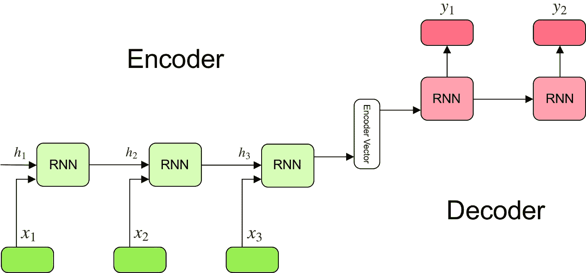
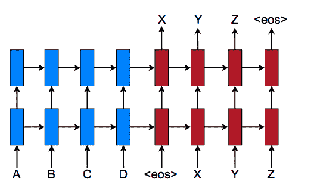
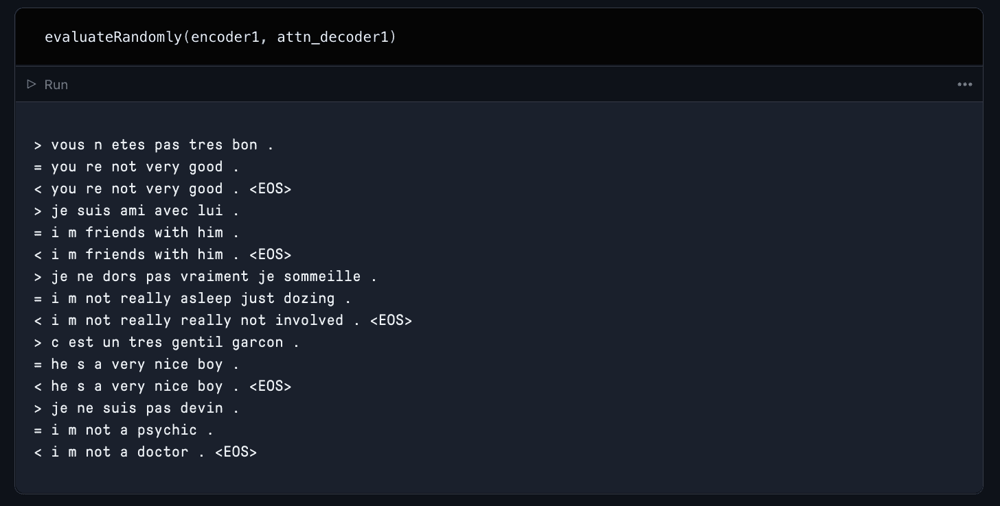

# py torch seq 2 seq 翻译器简介

> 原文：<https://blog.paperspace.com/seq2seq-translator-pytorch/>

神经机器翻译是使用深度学习来生成从一种语言到另一种语言的文本的准确翻译的实践。这意味着训练一个深度神经网络来预测一个单词序列作为正确翻译的可能性。

这种技术的用途几乎是无限的。今天，我们有翻译人员能够对用其他语言编写的整个网页进行几乎即时且相对准确的翻译。我们可以将相机对准一段文本，并使用增强现实来用翻译代替文本。我们甚至可以动态地将现场演讲翻译成其他语言的文本。这种能力在很大程度上实现了技术全球化，如果没有序列到序列神经机器翻译的概念，这是不可能的。

谷歌的研究人员在 2014 年推出了第一个 Seq2Seq(序列到序列)翻译器。他们的发明从根本上改变了翻译领域，像谷歌翻译这样的热门服务已经发展到了巨大的准确性和可访问性水平，以满足互联网的需求。

在这篇博文中，我们将分解 Seq2Seq 翻译的理论和设计。然后，我们将从头开始浏览 Seq2Seq 翻译的官方 PyTorch 指南的增强版本，其中我们将首先改进原始框架，然后演示如何使其适应新的数据集。

# Seq2Seq 译者:他们是如何工作的？

对于深度学习，Seq2Seq 翻译器以相对简单的方式工作。这类模型的目标是将固定长度的字符串输入映射到固定长度的成对字符串输出，其中这两个长度可以不同。如果输入语言中的一个字符串有 8 个单词，而目标语言中的同一个句子有 4 个单词，那么高质量的翻译者应该推断出这一点，并缩短输出的句子长度。

## 设计理论:



[Source](https://towardsdatascience.com/understanding-encoder-decoder-sequence-to-sequence-model-679e04af4346)

Seq2Seq 翻译器通常共享一个公共框架。任何 Seq2Seq 转换器的三个主要组件是编码器和解码器网络以及它们之间的中间矢量编码。这些网络通常是递归神经网络(RNN)，但它们通常是由更专业的门控递归单元(GRU)和长短期记忆(LSTM)组成的。这是为了限制潜在的消失梯度影响平移。

编码器网络是一系列这些 RNN 单元。它使用这些来对编码器向量的输入中的元素进行顺序编码，最终的隐藏状态被写入中间向量。

许多 NMT 模型利用注意力的概念来改进这种上下文编码。注意是通过一组权重迫使解码器关注编码器输出的某些部分的做法。这些注意力权重乘以编码器输出向量。这产生了组合矢量编码，其将增强解码器理解其正在生成的输出的上下文的能力，并因此改进其预测。计算这些注意力权重是通过前馈注意力层完成的，前馈注意力层使用解码器输入和隐藏状态作为输入。

编码器向量包含来自编码器的输入的数字表示。如果一切顺利，它会从最初的输入句子中捕获所有信息。然后，这个编码向量充当解码器网络的初始隐藏状态。

解码器网络本质上与编码器相反。它将编码的矢量中间体作为隐藏状态，并顺序生成翻译。输出中的每个元素通知解码器对下一个元素的预测。

## 实际上:



[Source](https://towardsdatascience.com/attention-based-neural-machine-translation-b5d129742e2c)

实际上，一个 NMT 将接受一种语言的输入字符串，并创建一个表示句子中每个元素(单词)的嵌入序列。编码器中的 RNN 单元将先前的隐藏状态和原始输入嵌入的单个元素作为输入，并且每一步可以通过访问前一步的隐藏状态来通知预测的元素，从而顺序地改进前一步。值得一提的是，除了对句子进行编码之外，句子结束标记表示也作为一个元素包含在序列中。这种句尾标记有助于翻译者知道翻译语言中的哪些单词将触发解码器退出解码并输出翻译的句子。

最终的隐藏状态嵌入被编码在中间编码器矢量中。编码捕获尽可能多的关于输入句子的信息，以便于解码器将它们解码成翻译。这可以通过被用作解码器网络的初始隐藏状态来实现。

使用来自编码器向量的信息，解码器中的每个递归单元接受来自前一个单元的隐藏状态，并产生输出以及它自己的隐藏状态。隐藏状态通知解码器对序列进行预测，对于每个顺序预测，解码器使用来自前一个隐藏状态的信息预测序列的下一个实例。因此，最终输出是翻译句子中每个元素的逐步预测的最终结果。由于句尾标签，这个句子的长度与输入句子的长度无关，它告诉解码器何时停止向句子添加术语。

在下一节中，我们将展示如何使用定制函数和 PyTorch 实现每个步骤。

# 实现 Seq2Seq 转换器

PyTorch 网站上有一个关于从头开始创建 Seq2Seq 翻译器的精彩教程。下一节将修改那里的大部分代码，因此在开始实现这些更新之前，浏览一下他们的教程笔记本可能是值得的。

我们将以两种方式扩展本教程:添加一个全新的数据集，并进行调整以优化翻译功能。首先，我们将展示如何获取和准备 WMT2014 英法翻译数据集，以便在渐变笔记本中与 Seq2Seq 模型一起使用。由于大部分代码与 PyTorch 教程中的相同，我们将只关注**编码器网络**、**注意力解码器网络**和**训练代码**。

## 准备数据

### 获取和准备 WMT2014 Europarl v7 英语-法语数据集

WMT2014 Europarl v7 英法文数据集收集了欧洲议会内部的发言，并被翻译成多种不同的语言。你可以在 https://www.statmt.org/europarl/免费参观。

要将数据集放到 Gradient 上，只需进入终端并运行

```py
wget https://www.statmt.org/europarl/v7/fr-en.tgz
tar -xf fre-en.tgz
```

您还需要下载 Torch 提供的教程数据集。

```py
wget https://download.pytorch.org/tutorial/data.zip
unzip data.zip
```

一旦你有了数据集，我们可以使用来自机器学习大师的[杰森·布朗利创建的一些代码来快速准备和组合它们用于我们的 NMT。这个代码在笔记本里`data_processing.ipynb`:](https://machinelearningmastery.com/prepare-french-english-dataset-machine-translation/)

```py
# load doc into memory
def load_doc(filename):
	# open the file as read only
	file = open(filename, mode='rt', encoding='utf-8')
	# read all text
	text = file.read()
	# close the file
	file.close()
	return text

# split a loaded document into sentences
def to_sentences(doc):
	return doc.strip().split('\n')

# clean a list of lines
def clean_lines(lines):
	cleaned = list()
	# prepare regex for char filtering
	re_print = re.compile('[^%s]' % re.escape(string.printable))
	# prepare translation table for removing punctuation
	table = str.maketrans('', '', string.punctuation)
	for line in lines:
		# normalize unicode characters
		line = normalize('NFD', line).encode('ascii', 'ignore')
		line = line.decode('UTF-8')
		# tokenize on white space
		line = line.split()
		# convert to lower case
		line = [word.lower() for word in line]
		# remove punctuation from each token
		line = [word.translate(table) for word in line]
		# remove non-printable chars form each token
		line = [re_print.sub('', w) for w in line]
		# remove tokens with numbers in them
		line = [word for word in line if word.isalpha()]
		# store as string
		cleaned.append(' '.join(line))
	return cleaned

# save a list of clean sentences to file
def save_clean_sentences(sentences, filename):
	dump(sentences, open(filename, 'wb'))
	print('Saved: %s' % filename)

# load English data
filename = 'europarl-v7.fr-en.en'
doc = load_doc(filename)
sentences = to_sentences(doc)
sentences = clean_lines(sentences)
save_clean_sentences(sentences, 'english.pkl')
# spot check
for i in range(10):
	print(sentences[i])

# load French data
filename = 'europarl-v7.fr-en.fr'
doc = load_doc(filename)
sentences = to_sentences(doc)
sentences = clean_lines(sentences)
save_clean_sentences(sentences, 'french.pkl')
# spot check
for i in range(1):
	print(sentences[i])
```

这将获取我们的 WMT2014 数据集，并清除其中的任何标点符号、大写字母、不可打印的字符以及包含数字的标记。然后它将这些文件分开放供以后使用。

```py
with open('french.pkl', 'rb') as f:
    fr_voc = pickle.load(f)

with open('english.pkl', 'rb') as f:
    eng_voc = pickle.load(f)

data = pd.DataFrame(zip(eng_voc, fr_voc), columns = ['English', 'French'])
data
```

我们可以使用`pickle.load()`来加载现在保存的文件，然后我们可以使用方便的 Pandas DataFrame 来合并这两个文件。

### 结合我们的两个数据集

为了给翻译人员创建一个更完整的数据集，让我们将现有的两个数据集结合起来。

```py
data2 = pd.read_csv('eng-fra.txt', '\t', names = ['English', 'French']) 
```

我们需要从规范的 PyTorch 教程中加载原始数据集。有了这两个数据帧，我们现在可以将它们连接起来，并以 PyTorch 示例数据集使用的原始格式保存它们。

```py
data = pd.concat([data,data2], ignore_index= True, axis = 0)

data.to_csv('eng-fra.txt')
```

现在，我们的数据集可以应用于我们的代码，就像规范的 PyTorch 教程！但首先，让我们看看准备数据集的步骤，看看我们可以做出哪些改进。打开笔记本`seq2seq_translation_combo.ipynb`并运行第一个单元格，以确保 matplotlib inline 正在工作并且导入已经完成。

```py
from __future__ import unicode_literals, print_function, division
from io import open
import unicodedata
import string
import re
import random

import torch
import torch.nn as nn
from torch import optim
import torch.nn.functional as F

import torchtext
from torchtext.data import get_tokenizer

device = torch.device("cuda" if torch.cuda.is_available() else "cpu")
```

### 数据集准备辅助函数

```py
SOS_token = 0
EOS_token = 1

class Lang:
    def __init__(self, name):
        self.name = name
        self.word2index = {}
        self.word2count = {}
        self.index2word = {0: "SOS", 1: "EOS"}
        self.n_words = 2  # Count SOS and EOS

    def addSentence(self, sentence):
        for word in sentence.split(' '):
            self.addWord(word)

    def addWord(self, word):
        if word not in self.word2index:
            self.word2index[word] = self.n_words
            self.word2count[word] = 1
            self.index2word[self.n_words] = word
            self.n_words += 1
        else:
            self.word2count[word] += 1
```

为了给翻译者处理数据集，我们可以使用这个 Lang 类为我们的 language 类提供有用的功能，比如`word2index`、`index2word`和`word2count`。下一个像元也将包含用于清理原始数据集的有用函数。

```py
def readLangs(lang1, lang2, reverse=False):
    print("Reading lines...")

    # Read the file and split into lines
    lines = open('%s-%s2.txt' % (lang1, lang2), encoding='utf-8').\
        read().strip().split('\n')
    # Split every line into pairs and normalize
    pairs = [[normalizeString(s) for s in l.split('\t')] for l in lines]

    # Reverse pairs, make Lang instances
    if reverse:
        pairs = [list(reversed(p)) for p in pairs]
        input_lang = Lang(lang2)
        output_lang = Lang(lang1)
    else:
        input_lang = Lang(lang1)
        output_lang = Lang(lang2)

    return input_lang, output_lang, pairs
```

接下来，readLangs 函数接收我们的 csv 来创建`input_lang`、`output_lang`，并配对我们将用来准备数据集的变量。这个函数使用助手函数来清理文本并规范化字符串。

```py
MAX_LENGTH = 12

eng_prefixes = [
    "i am ", "i m ",
    "he is", "he s ",
    "she is", "she s ",
    "you are", "you re ",
    "we are", "we re ",
    "they are", "they re ", "I don t", "Do you", "I want", "Are you", "I have", "I think",
       "I can t", "I was", "He is", "I m not", "This is", "I just", "I didn t",
       "I am", "I thought", "I know", "Tom is", "I had", "Did you", "Have you",
       "Can you", "He was", "You don t", "I d like", "It was", "You should",
       "Would you", "I like", "It is", "She is", "You can t", "He has",
       "What do", "If you", "I need", "No one", "You are", "You have",
       "I feel", "I really", "Why don t", "I hope", "I will", "We have",
       "You re not", "You re very", "She was", "I love", "You must", "I can"]
eng_prefixes = (map(lambda x: x.lower(), eng_prefixes))
eng_prefixes = set(eng_prefixes)

def filterPair(p):
    return len(p[0].split(' ')) < MAX_LENGTH and \
        len(p[1].split(' ')) < MAX_LENGTH and \
        p[1].startswith(eng_prefixes)

def filterPairs(pairs):
    return [pair for pair in pairs if filterPair(pair)]
eng_prefixes
```

在 Torch 教程的另一个变化中，我扩展了英语前缀列表，以包括现在合并的数据集最常见的起始前缀。我还将`max_length`延长到了 12，以创建一组更健壮的数据点，但是这可能会引入更多的混杂因素。尝试将`max_length`降低回 10，看看性能如何变化。

```py
def prepareData(lang1, lang2,reverse = False):
    input_lang, output_lang, pairs = readLangs(lang1, lang2, reverse)
    print("Read %s sentence pairs" % len(pairs))
    pairs = filterPairs(pairs)
    print("Trimmed to %s sentence pairs" % len(pairs))
    print("Counting words...")
    for pair in pairs:
        input_lang.addSentence(pair[0])
        output_lang.addSentence(pair[1])
    print("Counted words:")
    print(input_lang.name, input_lang.n_words)
    print(output_lang.name, output_lang.n_words)
    return input_lang, output_lang, pairs

input_lang, output_lang, pairs = prepareData('eng', 'fra', True)
print(random.choice(pairs))
```

最后，prepareData 函数将所有的辅助函数放在一起，筛选并最终确定 NMT 培训的语言对。现在我们的数据集已经准备好了，让我们直接进入翻译器本身的代码。

## 翻译

### 编码器

```py
class EncoderRNN(nn.Module):
    def __init__(self, input_size, hidden_size):
        super(EncoderRNN, self).__init__()
        self.hidden_size = hidden_size

        self.embedding = nn.Embedding(input_size, hidden_size)
        self.gru = nn.GRU(hidden_size, hidden_size)

    def forward(self, input, hidden):
        embedded = self.embedding(input).view(1, 1, -1)
        output = embedded
        output, hidden = self.gru(output, hidden)
        return output, hidden

    def initHidden(self):
        return torch.zeros(1, 1, self.hidden_size, device=device)
```

我们使用的编码器与本教程基本相同，可能是我们在本文中要剖析的最简单的代码。我们可以从 forward 函数中看到，对于每个输入元素，编码器如何输出一个输出向量和一个隐藏状态。然后返回隐藏状态，因此可以在接下来的步骤中与输出一起使用。

### 注意力解码器

```py
class AttnDecoderRNN(nn.Module):
    def __init__(self, hidden_size, output_size, dropout_p=0.1, max_length=MAX_LENGTH):
        super(AttnDecoderRNN, self).__init__()
        self.hidden_size = hidden_size
        self.output_size = output_size
        self.dropout_p = dropout_p
        self.max_length = max_length

        self.embedding = nn.Embedding(self.output_size, self.hidden_size)
        self.attn = nn.Linear(self.hidden_size * 2, self.max_length)
        self.attn_combine = nn.Linear(self.hidden_size * 2, self.hidden_size)
        self.dropout = nn.Dropout(self.dropout_p)
        self.gru = nn.GRU(self.hidden_size, self.hidden_size)
        self.out = nn.Linear(self.hidden_size, self.output_size)

    def forward(self, input, hidden, encoder_outputs):
        embedded = self.embedding(input).view(1, 1, -1)
        embedded = self.dropout(embedded)

        attn_weights = F.softmax(
            self.attn(torch.cat((embedded[0], hidden[0]), 1)), dim=1)
        attn_applied = torch.bmm(attn_weights.unsqueeze(0),
                                 encoder_outputs.unsqueeze(0))

        output = torch.cat((embedded[0], attn_applied[0]), 1)
        output = self.attn_combine(output).unsqueeze(0)

        output = F.relu(output)
        output, hidden = self.gru(output, hidden)

        output = F.log_softmax(self.out(output[0]), dim=1)
        return output, hidden, attn_weights

    def initHidden(self):
        return torch.zeros(1, 1, self.hidden_size, device=device)
```

由于我们在示例中使用了注意力，让我们看看如何在解码器中实现它。显而易见，编码器和解码器网络之间存在一些关键差异，远远不止是它们行为的简单反转。

首先，init()函数有另外两个参数:`max_length`和`dropout_p`。`max_length`是一个句子所能容纳的最大元素数量。我们这样设置是因为两个配对数据集中句子长度的差异很大。`dropout_p`用于帮助调节和防止神经元的共同适应。

第二，我们有注意力层本身。在每一步，注意层接收注意输入、解码器状态和所有编码器状态。它用这个来计算注意力分数。对于每个编码器状态，attention 计算其与该解码器状态的“相关性”。它应用注意函数，该函数接收一个解码器状态和一个编码器状态，并返回标量值。注意力分数用于计算注意力权重。这些权重是通过将`softmax`应用于注意力分数而创建的概率分布。最后，它将注意力输出计算为编码器状态与注意力权重的加权和。 [(1)](https://lena-voita.github.io/nlp_course/seq2seq_and_attention.html#attention_intro)

这些额外的参数和注意机制使得解码器需要少得多的训练和全部信息来理解序列中所有单词的关系。

### 培养

```py
teacher_forcing_ratio = 0.5

def train(input_tensor, target_tensor, encoder, decoder, encoder_optimizer, decoder_optimizer, criterion, max_length=MAX_LENGTH):
    encoder_hidden = encoder.initHidden()

    encoder_optimizer.zero_grad()
    decoder_optimizer.zero_grad()

    input_length = input_tensor.size(0)
    target_length = target_tensor.size(0)

    encoder_outputs = torch.zeros(max_length, encoder.hidden_size, device=device)

    loss = 0

    for ei in range(input_length):
        encoder_output, encoder_hidden = encoder(
            input_tensor[ei], encoder_hidden)
        encoder_outputs[ei] = encoder_output[0, 0]

    decoder_input = torch.tensor([[SOS_token]], device=device)

    decoder_hidden = encoder_hidden

    use_teacher_forcing = True if random.random() < teacher_forcing_ratio else False

    if use_teacher_forcing:
        # Teacher forcing: Feed the target as the next input
        for di in range(target_length):
            decoder_output, decoder_hidden, decoder_attention = decoder(
                decoder_input, decoder_hidden, encoder_outputs)
            loss += criterion(decoder_output, target_tensor[di])
            decoder_input = target_tensor[di]  # Teacher forcing

    else:
        # Without teacher forcing: use its own predictions as the next input
        for di in range(target_length):
            decoder_output, decoder_hidden, decoder_attention = decoder(
                decoder_input, decoder_hidden, encoder_outputs)
            topv, topi = decoder_output.topk(1)
            decoder_input = topi.squeeze().detach()  # detach from history as input

            loss += criterion(decoder_output, target_tensor[di])
            if decoder_input.item() == EOS_token:
                break

    loss.backward()

    encoder_optimizer.step()
    decoder_optimizer.step()

    return loss.item() / target_length
```

我们使用的训练函数接受几个参数。`input_tensor`和`target_tensor`分别是句子对的第 0 和第 1 个索引。编码器是上述的编码器。解码器是上述注意力解码器。我们正在将编码器和解码器优化器从随机梯度下降切换到 Adagrad，因为我们发现使用 Adagrad 时，翻译具有更低的损失。最后，我们使用交叉熵损失作为我们的标准，而不是教程中使用的神经网络。NLLLoss()。

还要看老师逼比。该值设置为 0.5，用于帮助提高模型的功效。在. 5 处，它随机确定是否将目标作为下一个输入提供给解码器或者使用解码器自己的预测。这可以帮助平移更快地收敛，但也可能导致不稳定。例如，过度使用教师强制可能会创建一个输出具有准确语法但与输入没有翻译关系的模型。

```py
def trainIters(encoder, decoder, n_iters, print_every=1000, plot_every=100):
    start = time.time()
    plot_losses = []
    print_loss_total = 0  # Reset every print_every
    plot_loss_total = 0  # Reset every plot_every

    encoder_optimizer = optim.Adagrad(encoder.parameters())
    decoder_optimizer = optim.Adagrad(decoder.parameters())
    training_pairs = [tensorsFromPair(random.choice(pairs))
                      for i in range(n_iters)]
    criterion = nn.CrossEntropyLoss()

    for iter in range(1, n_iters + 1):
        training_pair = training_pairs[iter - 1]
        input_tensor = training_pair[0]
        target_tensor = training_pair[1]

        loss = train(input_tensor, target_tensor, encoder,
                     decoder, encoder_optimizer, decoder_optimizer, criterion)
        print_loss_total += loss
        plot_loss_total += loss

        if iter % print_every == 0:
            print_loss_avg = print_loss_total / print_every
            print_loss_total = 0
            print('%s (%d %d%%) %.4f' % (timeSince(start, iter / n_iters),
                                         iter, iter / n_iters * 100, print_loss_avg))

        if iter % plot_every == 0:
            plot_loss_avg = plot_loss_total / plot_every
            plot_losses.append(plot_loss_avg)
            plot_loss_total = 0

    showPlot(plot_losses)
```

TrainIters 实际上实现了培训过程。对于预设的迭代次数，它将计算损失。该函数继续保存损失值，以便在训练完成后可以有效地绘制它们。

要更深入地了解这个翻译器的代码，请务必查看包含所有这些信息的 Gradient 笔记本演示以及 Github 页面。

# 翻译

```py
hidden_size = 256
encoder = EncoderRNN(input_lang.n_words, hidden_size).to(device)
attn_decoder = AttnDecoderRNN(hidden_size, output_lang.n_words, dropout_p=0.1).to(device)

trainIters(encoder1, attn_decoder1, 75000, print_every=5000)
```

现在我们已经设置了我们的翻译器，我们需要做的就是实例化我们的编码器和注意力解码器模型用于训练并执行 trainIters 函数。确保在训练单元之前运行笔记本中的所有单元，以启用辅助功能。

我们将使用 256 的隐藏大小，并确保您的设备设置为`device(type='cuda')`。这将确保 RNN 使用 GPU 训练。



当您运行此单元时，您的模型将训练 75，000 次迭代。培训完成后，使用提供的评估功能来评估您的新翻译模型的质量性能。这里有一个例子，说明我们为演示而训练的模型如何在随机抽样的翻译上表现。

# 结束语

现在，您应该能够获取任何适当的翻译数据集，并将其插入到这个翻译器代码中。我推荐从其他的 WMT 欧帕尔配对开始，但是有无限的选择。一定要在 Gradient 上运行，以获得强大的 GPU！

如果您克隆 Github repo 或将其用作 Gradient 中的工作区 URL，您可以访问包含本文代码的笔记本。有三本笔记本。数据处理是你首先要进入并运行的笔记本。然后是本文中用于在 Europarl 法语-英语数据集上实现 Seq2Seq 翻译的代码，