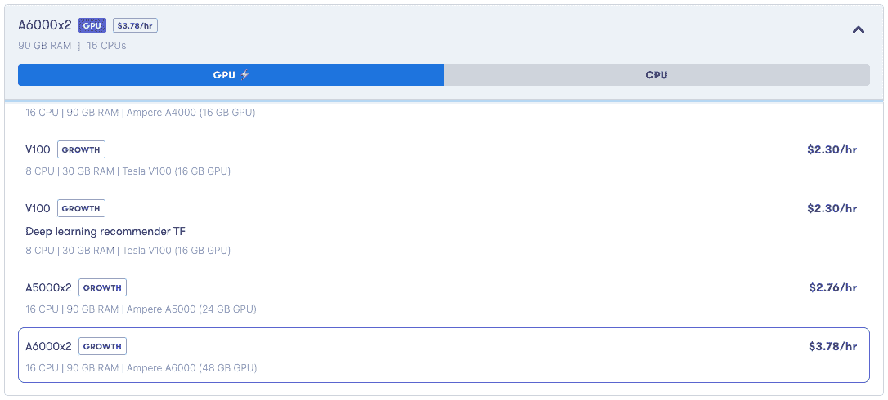

# GPT-NeoX:梯度多 GPU 上的 200 亿参数 NLP 模型

> 原文：<https://blog.paperspace.com/gpt-neox-20-multi-gpu/>


GPT-NeoX's logo, from EleutherAI's [project page](https://www.eleuther.ai/projects/gpt-neox)

[GPT-NeoX](https://blog.eleuther.ai/announcing-20b/) 是来自 [EleutherAI](https://www.eleuther.ai/) 的最新自然语言处理(NLP)模型，于 2022 年 2 月发布。它是迄今为止最大的开源 NLP 模型，包含 200 亿个参数。

在这里，我们展示了 Gradient 的多 GPU 能力允许这个模型用于文本生成和模型评估，而不需要用户首先进行设置。

## 什么是 GPT-奈奥斯？

GPT-NeoX，或者更具体地说，GPT-NeoX-20B，是过去几年中发布的一系列越来越大的 NLP 模型的一部分。这是在发现模型越大，这种模型的性能越好之后。因此，研究小组受到激励，不断突破界限。

不幸的是，生产最大模型的很多能力存在于大型科技公司的研究团队中。因此，除了通过 API 或 app 来使用已经训练好的模型之外，这些模型仍然是闭源的，并且不可用于一般社区。

这促使 EleutherAI 和其他人发布了他们自己的一系列大型 NLP 模型的开源版本，以便更广泛的社区可以使用它们进行研究。GPT-NeoX-20B 是其中最新的一个，在 96 个 A100 GPUs 上训练。

## 梯度上的 GPT-NeoX-20B

> 总参数:20，556，201，984

该模型可在 [EleutherAI 的 GitHub 库](https://github.com/EleutherAI/gpt-neox)上获得。虽然回购表现良好且易于访问，但单独来看，这需要用户有一个能够运行模型的 GPU 设置。特别是在编写的时候，它需要至少 2 个 GPU 才能运行。这不仅仅是指总内存，还包括数值。除了设置 GPU 和 CUDA 等常见任务之外，这还会在硬件和软件方面向用户引入多 GPU 设置要求。，来运行机器学习工作负载。

Gradient 消除了 GPU 设置开销，允许用户直接使用 repo 并运行模型。



Setting up a multi-GPU machine on Gradient: Click the one you want and ... that's it

设置模型在坡度上运行: **(1)**

*   注册一个允许访问多 GPU 机器的订阅。目前这是[增长水平](https://www.paperspace.com/pricing)或更高。
*   使用 A6000x2 机器(2 个 Nvidia Ampere A6000 GPUs)创建一个新项目和笔记本
*   在笔记本的*高级选项*下，设置容器为`nvcr.io/nvidia/pytorch:21.10-py3`。
*   还将工作区 URL 设置为 EleutherAI repo: [`https://github.com/EleutherAI/gpt-neox`](https://github.com/EleutherAI/gpt-neox) 。这会将该回购安装到您的笔记本中，以便您可以立即访问它。
*   在笔记本中打开一个终端窗口，安装其依赖项:`pip install -r requirements/requirements.txt`
*   然后下载模型: **(2)**

`wget --cut-dirs=5 -nH -r --no-parent --reject "index.html*" [https://mystic.the-eye.eu/public/AI/models/GPT-NeoX-20B/slim_weights/](https://mystic.the-eye.eu/public/AI/models/GPT-NeoX-20B/slim_weights/) -P 20B_checkpoints`

*   这会将它放在当前目录的目录`20B_checkpoints/`中。你也可以把它放在你笔记本的持久`/storage`目录中，或者把它做成一个渐变数据集(见我们的[数据](https://docs.paperspace.com/gradient/data/)文档)。 **(3)**
*   编辑`configs/20B.yml` YAML 文件，将其`"pipe-parallel-size": 4`设置从 4 改为 1，因为我们使用的是 2 个 GPU 而不是 8 个。
*   如果您的`20B_checkpoints/`目录不在您当前的目录中，编辑同一个 YAML 文件中的`vocab-file`、`save`和`load`设置以指向它的位置。

既然模型已经准备好运行，我们将继续让它生成一些文本，然后评估它的性能。

***(1)** 这些说明假设你知道使用渐变的基本知识。如果你不太熟悉渐变，那么[文档](https://docs.paperspace.com/gradient/)中的笔记本教程是一个很好的起点。*

***(2)** 型号大:39GB。将来，我们可能会将其添加到梯度公共数据集，使其比外部站点的通用`wget`更容易访问。*

***(3)** 梯度数据集是文件的通用版本化集合，因此它们可以包括诸如 NLP 模型检查点的文件。*

## 文本生成

展示模型运行的一个简单方法是让它生成一些文本。您可以通过无条件生成来运行它，或者提供一个包含文本提示的文件，然后模型从该文件中提供一个延续。

对于无条件生成，运行

`./deepy.py generate.py ./configs/20B.yml`

第一次运行大约需要半个小时，因为必须加载 39GB 大小的模型。默认输出放入`samples.txt`。

如果您在脚本运行时运行`nvidia-smi`，您可以看到它在 2 个 GPU 上占用了大约 40GB 的总 GPU RAM，如 repo 中所述。当脚本完成时，它很好地将 GPU 清除回零内存使用。

当我们运行它时，生成的文本是(减去 JSON 格式):

```py
Q:

How to get the value of a variable in a function in a different file?

I have a file called "main.py" and a file called "functions.py".
In "main.py" I have:
import functions

def main():
     print(functions)
```

对于条件生成，您可以运行，

`./deepy.py generate.py ./configs/20B.yml -i prompt.txt -o sample_outputs.txt`

我们的输入在`prompt.txt`中，这次我们把输出放在`sample_outputs.txt`中。

当我们使用三个提示运行它时:

```py
Paperspace Gradient is
The second prompt is
This is the last line
```

```py
Paperspace Gradient is a new type of gradient that is based on the paper-folding technique. It is a gradient that is created by folding a piece of paper into a specific shape. The shape is then cut out and used as a gradient.

The gradient is created by folding a piece of paper into a specific shape. The 
```

```py
The second prompt is to enter the name of the file you want to create.

The third prompt is to enter the name of the file you want to create.

The fourth prompt is to enter the name of the file you want to create.

The fifth prompt is to enter the name of the file you want to
```

和

```py
This is the last line of the file.

A:

You can use the following regex:
^.*?\
(.*?)\
(.*?)\
(.*?)\
(.*?)\
(.*?)\
(.*?)\
(.*?)\
(.*?)\
(
```

第一个看起来还可以，尽管后两个可能需要一些工作。这可能是因为输入是相当不寻常的文本或者引用了带有“Gradient”的专有名词。如上所述，输出长度受限于用户提供的或默认的字符数，这就是它被截断的原因。

因为提示可以是任意的文本，并且模型具有代码生成和文本等功能，所以它的使用范围几乎是无限的。

## 模型评估

除了生成的文本有多好的定性外观之外，模型生成的内容也可以进行定量评估。有很多方法可以做到这一点。

使用回购协议中的一个简单示例，我们可以运行

`./deepy.py evaluate.py ./configs/20B.yml --eval_tasks lambada piqa`

这告诉它使用与上面相同的预训练模型，即`20B.yml`中描述的 GPT-NeoX-20B，在数据集`lambada`和`piqa`上运行评估任务。`lambada`数据由`evaluate.py`脚本下载。

***注意:**在我们的设置中似乎出现了一个错误，其中 [lm_eval](https://www.eleuther.ai/projects/lm-eval/) `lambada.py`中的参数似乎与`best_download` Python 模块相反，导致输出文件被命名为其校验和值，然后找不到。不清楚这是回购中的错误还是库版本不匹配，但我们通过直接获取数据来解决这个问题:`wget [http://eaidata.bmk.sh/data/lambada_test.jsonl](http://eaidata.bmk.sh/data/lambada_test.jsonl) -O data/lambada/lambada_test.jsonl`，然后重新运行 evaluate。(而且没错是 [JSONL](https://jsonlines.org/) ，不是 JSON。)*

不幸的是，回购协议和白皮书没有明确提到什么是`lambada`和`piqa`，但可以推测它们对应于之前在 EleutherAI 的[博客](https://blog.eleuther.ai/)和其他地方提到的 LAMBADA 和 PIQA 文本数据集。它们是包含训练和测试部分的文本数据集，因此适合于评估 NLP 模型。

当我们运行评估时，它给出了结果(再次减去一些格式):

```py
'lambada':

'acc': 0.7209392586842616
'acc_stderr': 0.006249003708978234
'ppl': 3.6717612629980607
'ppl_stderr': 0.07590817388828183

'piqa':

'acc': 0.7742110990206746
'acc_norm': 0.780739934711643
'acc_norm_stderr': 0.009653357463605301
'acc_stderr': 0.009754980670917316
```

这意味着它得到了 72.09 +/- 0.62%和 77.4 +/- 0.98%的精度，这与[原始白皮书](http://eaidata.bmk.sh/data/GPT_NeoX_20B.pdf)中的值一致。所以我们的结果看起来是合理的。

## 未来的工作

到目前为止，明显缺失的部分是模型微调训练。

虽然文本生成和模型评估是从 NLP 中获得价值的关键功能，但对于给定的业务问题或其他项目，获得最大价值的正常方法是采用提供的预训练模型，然后对其执行微调训练，以根据您的特定任务或领域定制模型。

这需要带来自己的额外相关训练数据，并对模型进行几个时期的训练，以使其在期望的领域中表现良好。

例如，在 EleutherAI repo 中，他们提供了一系列微调数据集，默认为几年前众所周知的争议中的安然电子邮件数据。与一般的训练模型相比，对此模型进行微调将提高其在生成新的安然式电子邮件方面的性能。也许你的项目不需要更好的安然电子邮件，但是如果你提供你所需要的数据，这个想法就很清楚了。

用于微调训练的数据通常比用于从头开始训练的原始文本小得多。这里，最初提供的 GPT-NeoX-20B 是在 800GB 的[堆](https://pile.eleuther.ai/)文本数据集上训练的，但微调数据集可以是几十 MB，只要示例是高质量的。

然而，报告指出，与我们上面看到的需要大约 40G GPU RAM 的文本生成和模型评估相比，总内存需要“明显更多的训练”。在 Forefront Technologies 的这篇博客文章之后，我们预计它可以在 8 个 A100 GPUs 的设置上工作，但这里我们将这一点推迟到未来的博客文章中。

回购协议还指出，他们使用[权重&偏差](https://wandb.ai)来跟踪他们的模型训练。在[最近在我们的博客上发布了](https://blog.paperspace.com/weights-biases-with-gradient/)之后，我们也计划展示这一点。

## 结论

我们已经展示了迄今为止发布的最大的开源自然语言处理(NLP)模型 GPT-NeoX-20B:

*   在 Gradient 上运行，不需要用户自己设置任何 GPU 基础架构
*   是否满足了至少有 2 个 GPU(多 GPU)和 40GB+总 GPU RAM 的要求
*   成功生成外观合理的文本
*   达到预期的精度(模型评估)
*   任何 Gradient 用户都可以运行 Growth 订阅或更高版本

由于这是 Gradient 的通用笔记本+工作流+部署数据科学+ MLOps 功能的一部分，因此用户可以以任何方式扩展运行该模型的项目。

在未来的帖子中，我们计划在比这里使用的 2 个更多的 GPU 上进行微调训练，并通过 Weights & Biases 监控训练。

### 后续步骤

*   [报名梯度](https://console.paperspace.com/signup)试用 GPT-NeoX-20B
*   在 [EleutherAI 的 GitHub 知识库](https://github.com/EleutherAI/gpt-neox)上阅读更多信息
*   查看他们最初的[白皮书](http://eaidata.bmk.sh/data/GPT_NeoX_20B.pdf)