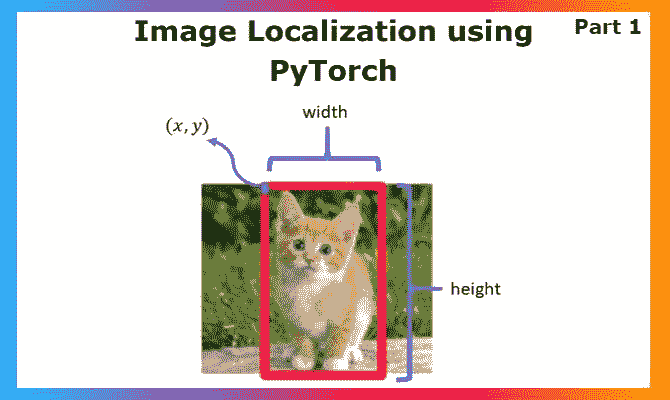
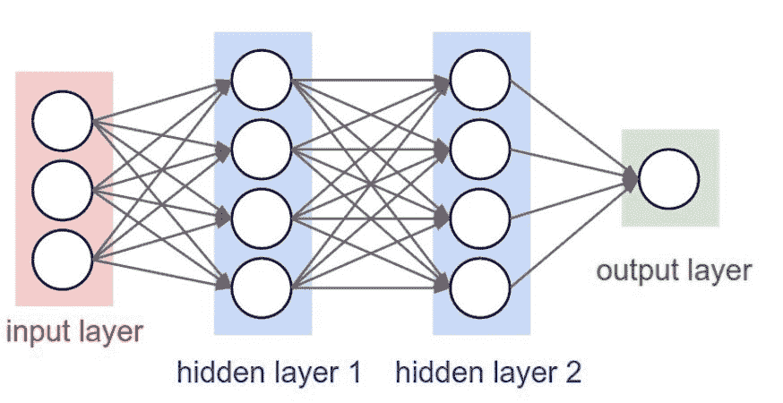
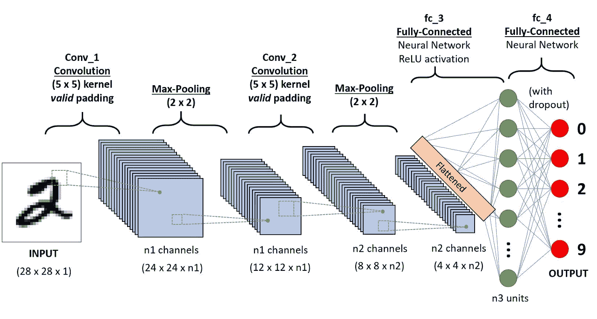

# 使用 PyTorch 进行对象定位，第 1 部分

> 原文：<https://blog.paperspace.com/object-localization-using-pytorch-1/>



随着图像分类模型的流行，深度学习领域引起了人们的注意，剩下的就是历史了。今天，我们仅仅从一个单一的图像输入就能产生未来的技术。GAN 模型生成图像，图像分割模型精确标记区域，对象检测模型检测正在发生的一切，就像通过普通的闭路电视摄像机识别繁忙街道上的人一样。这些成就真正为进一步的研究铺平了道路，也为随着可解释人工智能的到来，基本建模实践进入医学领域等严肃领域铺平了道路。图像定位对我来说是一个有趣的应用，因为它正好介于图像分类和对象检测之间。每当一个项目需要在检测到的类别上获得边界框时，人们经常会跳到对象检测和 YOLO，这很好，但在我看来，如果你只是进行分类和定位单个类别，那就太过了。让我们深入研究图像本地化:概念、PyTorch 中的实现和可能性。

## 图像分类

图像分类是基本的深度学习问题之一，使用卷积神经网络以及基于它们构建的架构 ResNet、SqueezeNet 等来解决。随着时间的推移，在很大程度上改进了此类模型的性能。根据项目的不同，并不总是需要构建一个超过 250MB 的大型模型来提供 95%以上的验证准确性。有时候在开发过程中，比如像 [Lens Studio](https://lensstudio.snapchat.com/) 这样的移动平台，重要的是在尺寸和计算方面得到一个更小的模型，具有合理的准确性，并且推理时间非常短。在这个更小的模型空间中，我们有像 MobileNet、SqueezeNet 等模型。

架构和用例的多样性导致了分类的改进和对象的本地化。模型不仅可以将图像分类为 x 或 y，还可以使用强大的边界框在图像中定位 x 或 y，这种想法成倍地增加了可以围绕它构建的用例。定位的方法非常类似于图像分类，所以如果你不熟悉 CNN，可能很难理解。在深入本地化领域之前，让我们先探讨一下它们。

### 卷积神经网络

如果你是神经网络的新手，请读一下这个。

假设你理解深度学习模型如何在基本的全连接层模型上工作，随着参数的不断增加和大规模全连接层的增加，它们的计算量会变得很大。



[Source: Building A Deep Learning Model](https://cs231n.github.io/neural-networks-1/) 

在这里，如果你看上面的图像，集中在红色和第一个蓝色层，它们之间的计算将采取(不准确，只是为了说明)3*4 操作。现在，即使对于 CPU 来说，这也是相当轻量级的。但是当我们处理图像时，让我们取一个典型的 64X64 大小的图像。图像大小为 64x64，每个有 3 个通道。每幅图像的 RGB 通道总共有 12，288 个像素。现在，这听起来很大，但当你想到用与上面完全连接的层相同的方式处理图像时，计算量会变得更大。当你将 12288 个神经元中的每一个与下一层的其他神经元相乘时，从计算的角度来看这是非常昂贵的，成本会急剧上升。

为了补救这一点，我们可以使用 CNN:它以一种计算量更轻的方式来完成许多更重的模型架构的任务，同时提供更好的准确性。在卷积神经网络中，我们在张量上进行计算，核在通道上，并不断减少张量的大小，同时增加通道的数量，其中每个通道都有助于学习一些独特的东西，直到我们最终将通道堆栈展平为完全连接的层，如下所示。这是对 CNN 的一个简单的解释，你必须深入这个架构才能掌握它的每一个方面。



[Source: Comprehensive guide to CNN](https://towardsdatascience.com/a-comprehensive-guide-to-convolutional-neural-networks-the-eli5-way-3bd2b1164a53)

在进行物体定位之前，先关注上面的红点层。这作为图像分类问题的最后一层，结果是具有最大值的神经元的索引。那就是预测的类索引。在对象定位中，我们将不只有一个输出，而是两个不同的输出，一个是类，另一个是具有 4 个边界框坐标值的回归输出。

## 目标定位

与目标检测模型相比，定位的迷人之处在于它的简单性。毫无疑问，对象检测模型处理更大的问题，并且必须对某些架构中的初始区域选择层所建议的所有区域进行分类。尽管如此，我们可以像回归问题一样预测坐标的想法还是很有趣的。因此，我们的通用架构(类似于图像分类模型)将具有额外的 1 个回归输出(具有 4 个坐标),并行训练以获得坐标。

### 本地化数据集

对于对象定位，我们不仅需要图像和标签，还需要包含对象的边界框的坐标。我们必须使用图像注释/对象标记工具来准备这样的数据集，而 XML 是用于存储每个图像的坐标值的流行文件格式。

一个比较流行的对象标记工具是微软的开源对象标记工具，VOTT。它是轻量级和简单的，这使得它非常适合本地化问题。[这是项目和文档的链接](https://github.com/microsoft/VoTT)。

不一定非要将数据存储为 XML，您可以选择任何您能轻松处理的文件类型来读取数据，但是 XML 非常有用。我们的输入将是图像，它的标签，以及对应于我们正在标记的坐标的四个值。对于这个项目，我提取了流行的[狗与猫数据集](https://www.kaggle.com/c/dogs-vs-cats/data)的一部分，并使用 VOTT 和生成的 XML 文件创建了边界框。我们将详细讨论如何利用 python 和一些库来读取这些 XML 文件以获得相应图像的输入坐标。

## PyTorch 实现

像往常一样，我们从导入库开始，包括 pandas、CSV 和 XML，这将帮助我们处理输入。

```py
import numpy as np

from sklearn.model_selection import train_test_split

import matplotlib.pyplot as plt
import cv2
import random
import os

from PIL import Image

import pandas as pd
from xml.dom import minidom
import csv
```

您可以从[这里](https://drive.google.com/file/d/1RVoLlMGx_qqxclsnUgWSoYn8t2McaFJK/view?usp=sharing)下载用于演示该对象本地化实现的数据集。为您的个人项目实现时，更改数据集并用更多图像和注释填充它，以获得可靠的模型性能。因为我必须为演示创建边界框，所以我将样本保持在最少。

首先，我们将解压数据集开始。上面给出了数据集链接。

```py
!unzip localization_dataset.zip
```

让我们在读取和处理输入之前分析 XML 文件。理解这种结构将有助于您理解在遇到新的 XML 时如何阅读它。

```py
<annotation verified="yes">
    <folder>Annotation</folder>
    <filename>cat.0.jpg</filename>
    <path>Cat-PascalVOC-export/Annotations/cat.0.jpg</path>
    <source>
        <database>Unknown</database>
    </source>
    <size>
        <width>256</width>
        <height>256</height>
        <depth>3</depth>
    </size>
    <segmented>0</segmented>
    <object>
    <name>cat</name>
    <pose>Unspecified</pose>
    <truncated>0</truncated>
    <difficult>0</difficult>
    <bndbox>
        <xmin>55.35820533192091</xmin>
        <ymin>10.992090947210452</ymin>
        <xmax>197.38757944915255</xmax>
        <ymax>171.24521098163842</ymax>
    </bndbox>
</object>
</annotation> 
```

接下来，让我们开始阅读和处理图像和注释。我们将使用 XML minidom 来读取 XML 文件。

```py
def extract_xml_contents(annot_directory, image_dir):

        file = minidom.parse(annot_directory)

        # Get the height and width for our image
        height, width = cv2.imread(image_dir).shape[:2]

        # Get the bounding box co-ordinates 
        xmin = file.getElementsByTagName('xmin')
        x1 = float(xmin[0].firstChild.data)

        ymin = file.getElementsByTagName('ymin')
        y1 = float(ymin[0].firstChild.data)

        xmax = file.getElementsByTagName('xmax')
        x2 = float(xmax[0].firstChild.data)

        ymax = file.getElementsByTagName('ymax')
        y2 = float(ymax[0].firstChild.data)

        class_name = file.getElementsByTagName('name')

        if class_name[0].firstChild.data == "cat":
          class_num = 0
        else:
          class_num = 1

        files = file.getElementsByTagName('filename')
        filename = files[0].firstChild.data

        # Return the extracted attributes
        return filename,  width, height, class_num, x1,y1,x2,y2
```

让我们创建一个 num_to_labels 字典来从预测中检索标签。

```py
num_to_labels= {0:'cat',1:'dog'}
```

一旦我们获得了所有这些数据，我们就可以将其存储为一个 CSV 文件，这样我们就不必为每次训练读取 XML 文件。我们将使用 Pandas 数据帧来存储数据，稍后我们将把它保存为 CSV。

```py
# Function to convert XML files to CSV
def xml_to_csv():

  # List containing all our attributes regarding each image
  xml_list = []

  # We loop our each class and its labels one by one to preprocess and augment 
  image_dir = 'dataset/images'
  annot_dir = 'dataset/annot'

  # Get each file in the image and annotation directory
  mat_files = os.listdir(annot_dir)
  img_files = os.listdir(image_dir)

  # Loop over each of the image and its label
  for mat, image_file in zip(mat_files, img_files):

      # Full mat path
      mat_path = os.path.join(annot_dir, mat)

      # Full path Image
      img_path = os.path.join(image_dir, image_file)

      # Get Attributes for each image 
      value = extract_xml_contents(mat_path, img_path)

      # Append the attributes to the mat_list
      xml_list.append(value)

  # Columns for Pandas DataFrame
  column_name = ['filename', 'width', 'height', 'class_num', 'xmin', 'ymin', 
                 'xmax', 'ymax']

  # Create the DataFrame from mat_list
  xml_df = pd.DataFrame(xml_list, columns=column_name)

  # Return the dataframe
  return xml_df

# The Classes we will use for our training
classes_list = sorted(['cat',  'dog'])

# Run the function to convert all the xml files to a Pandas DataFrame
labels_df = xml_to_csv()

# Saving the Pandas DataFrame as CSV File
labels_df.to_csv(('dataset.csv'), index=None)
```

现在我们已经在 CSV 中获得了数据，让我们加载相应的图像和标签来构建数据加载器。我们将对图像进行预处理，包括归一化像素。这里需要注意的一点是我们如何存储坐标。我们将该值存储为一个 0 到 1 的范围值，方法是将它除以图像大小(这里是 256)，以便模型输出可以在以后缩放到任何图像(我们将在可视化部分看到这一点)。

```py
def preprocess_dataset():
  # Lists that will contain the whole dataset
  labels = []
  boxes = []
  img_list = []

  h = 256
  w = 256
  image_dir = 'dataset/images'

  with open('dataset.csv') as csvfile:
      rows = csv.reader(csvfile)
      columns = next(iter(rows))
      for row in rows:
        labels.append(int(row[3]))
        #Scaling Coordinates to the range of [0,1] by dividing the coordinate with image size, 256 here.
        arr = [float(row[4])/256,  
               float(row[5])/256,
               float(row[6])/256,
               float(row[7])/256]
        boxes.append(arr)
        img_path = row[0]
        # Read the image
        img  = cv2.imread(os.path.join(image_dir,img_path))

        # Resize all images to a fix size
        image = cv2.resize(img, (256, 256))

        # # Convert the image from BGR to RGB as NasNetMobile was trained on RGB images
        image = cv2.cvtColor(image, cv2.COLOR_BGR2RGB)

        # Normalize the image by dividing it by 255.0 
        image = image.astype("float") / 255.0

        # Append it to the list of images
        img_list.append(image)

  return labels, boxes, img_list
```

现在这个函数已经准备好了，让我们调用它并加载输入数据。作为数据预处理的最后一步，我们将混洗数据。

```py
# All images will resized to 300, 300 
image_size = 256

# Get Augmented images and bounding boxes
labels, boxes, img_list = preprocess_dataset()

# Now we need to shuffle the data, so zip all lists and shuffle
combined_list = list(zip(img_list, boxes, labels))
random.shuffle(combined_list)

# Extract back the contents of each list
img_list, boxes, labels = zip(*combined_list)
```

到目前为止，我们已经完成了数据预处理，包括从 XML 文件中读取数据注释，现在我们准备在 PyTorch 和模型架构设计中构建定制的数据加载器。实现将在本文的下一部分继续，我们将详细讨论上述方法来完成实现。感谢阅读:)