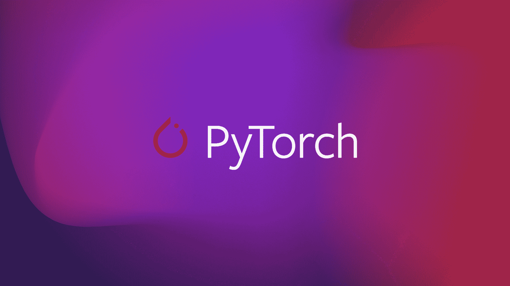
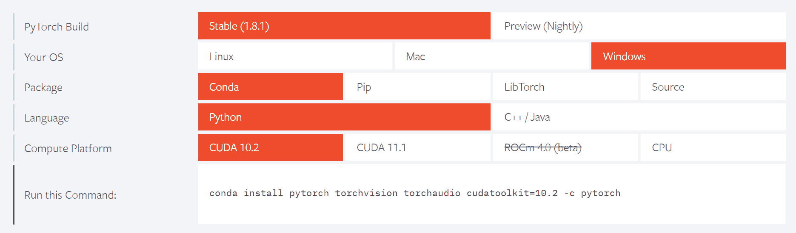
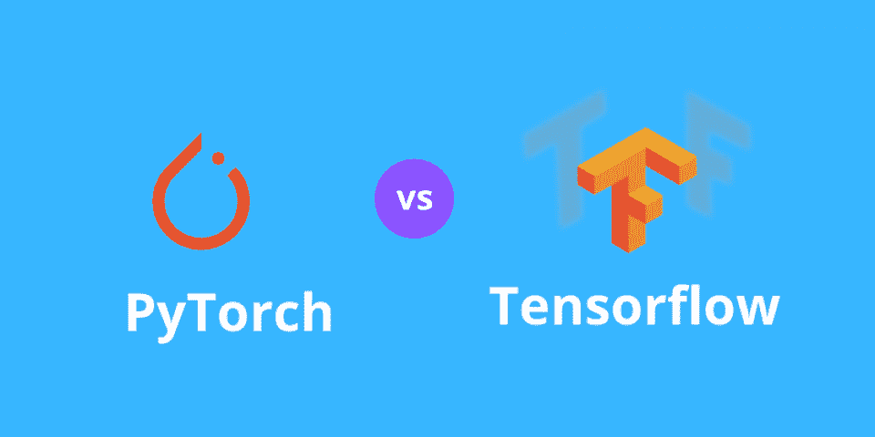

# PyTorch 终极指南

> 原文：<https://blog.paperspace.com/ultimate-guide-to-pytorch/>



[Image Source](https://engineering.fb.com/wp-content/uploads/2018/09/PyTorch_Blog-Post_Hero.png)

随着人工神经网络领域技术进步的兴起，已经有几个用于解决和计算现代深度学习任务的库。在我之前的文章中，我已经详细介绍了其他一些深度学习框架，如 TensorFlow 和 Keras。建议不熟悉这个主题的观众为 TensorFlow 提供以下[链接](https://blog.paperspace.com/absolute-guide-to-tensorflow/)，为 Keras 提供这个特定的[链接](https://blog.paperspace.com/the-absolute-guide-to-keras/)。在本文中，我们将介绍 PyTorch 中另一个引人注目的深度学习框架，它也被广泛用于执行各种复杂的任务。

PyTorch 自 2016 年 9 月发布以来，由于其编码原型的 Pythonic 风格以及在某些情况下相对更简单的编码方法，一直与 TensorFlow 进行激烈的竞争。我们将在本文中讨论的概念的目录在右边提供。首先，我们将通过一个基本的介绍来习惯 PyTorch。然后我们将着手在虚拟环境中安装 PyTorch 框架，用于构建深度学习项目。我们将理解张量的概念，以及用户可以使用 PyTorch 提供的各种功能进行计算的许多可能的操作。一旦我们对张量运算有了基本的了解，我们将讨论构建 PyTorch 模型的所有基本步骤和必要性。最后简单讨论一下 TensorFlow 和 PyTorch 的区别。

## PyTorch 简介:

PyTorch 是深度学习的最佳选择之一，它是一个开源的深度学习框架，由脸书的人工智能研究实验室(FAIR)首次推出和开发。torch 环境库开发的主要目的是构建高效的模型，为特定的任务提供最佳的结果和解决方案。PyTorch 库的应用从机器学习应用扩展到自然语言处理和计算机视觉任务。除了这些用例之外，它们还被用在许多软件结构中。一些例子包括优步的 Pyro，特斯拉自动驾驶仪，拥抱脸变形金刚，PyTorch 闪电和催化剂。

PyTorch 的主要功能是通过使用张量来支持基本的 numpy 运算，这些张量可以用于图形处理单元(GPU)的复杂运算。PyTorch 能够利用张量轻松执行复杂的任务和计算，这要归功于它对 GPU 的支持，这是 PyTorch 的重要特征之一。我们将在本文的后面部分更详细地讨论这些张量运算。除了能够更快地计算运算之外，它还利用了一个自动微分系统，允许其用户以极其简化的方式直接计算神经网络的反向传播值。由于一些流行的 PyTorch 函数，用户不需要进行任何手动计算，而是使用给定的函数来相应地计算所需的导数。

虽然 PyTorch 在像 C++这样的语言中受支持，但是 PyTorch 的主要目的是为用户提供一个坚实的基础和对 Python 编程语言的全面支持。用 PyTorch 编写的大部分代码都可以无缝集成到 Python 中。PyTorch 也与大多数 Python 库结合得很好，比如 numpy。由于大部分代码都是 Python 化的，对于有 Python 经验的新手来说，学习 PyTorch 变得更加容易。它还允许用户更有效地进行调试，从而提高开发人员的工作效率。如前所述，它也有图形支持，因为 CUDA 是 PyTorch 库的编写语言之一。最后，PyTorch 还受到众多云平台的支持，用于类似 TensorFlow 的模型开发和部署。有了 PyTorch 的这个基本介绍，我们就可以继续安装这个深度学习框架的主要步骤了。

* * *

## PyTorch 的安装程序:


[Image Source](https://upload.wikimedia.org/wikipedia/commons/9/96/Pytorch_logo.png)

我建议第一步从下载 Anaconda 开发环境开始。Anaconda 是一个发行版，它支持大量的库、编程语言和大量对初学者和专家有用的资料。它适用于所有操作系统平台，如 Windows、macOS 和 Linux。该软件被广泛认为是数据科学爱好者必须拥有的最佳工具之一，以实现任何特定任务的最佳和最理想的结果。您可以从以下[链接](https://www.anaconda.com/products/individual)下载适合您桌面的最新版本。

一旦下载并安装了 Anaconda 发行版，就可以相应地选择编辑器。您的主要选择是 PyCharm、Microsoft Visual Studio Code、Sublime Text、Jupyter Notebooks 以及许多其他软件。出于本文的目的，我建议坚持使用 Jupyter 笔记本。确保您已经完成了 Anaconda 发行版的所有设置。一旦一切准备就绪，请确保使用您喜欢的名称创建一个虚拟环境。这个虚拟环境将包含我们将安装的所有未来安装。下一步是访问 PyTorch 官方网站，根据您的系统设置构建。请跟随此[链接](https://pytorch.org/)到达网站。



[Image Source](https://pytorch.org/)

到达网站后，根据您的要求设置自定义设置。上图是最适合我的电脑的设置示例。还相应地提供了用于安装 PyTorch 的适当的 Anaconda 命令。激活您的虚拟环境，并在命令提示符下复制粘贴给定的代码。需要注意的是，如果您的系统上没有 GPU，那么请选择 CPU 选项在您的系统上安装 PyTorch。但是，强烈建议您使用 GPU 来加快 PyTorch 模型的计算速度。

下面是我在我的虚拟环境中的命令提示符(或 windows shell)中输入的命令，以安装 PyTorch 深度学习框架。

```py
conda install pytorch torchvision torchaudio cudatoolkit=10.2 -c pytorch 
```

如果您在安装过程中遇到问题，请访问 Stack Overflow 或 GitHub。其中一个对我有用的命令如下:

```py
conda install pytorch torchvision torchaudio cudatoolkit=11.1 -c pytorch -c conda-forge 
```

一旦您能够在您的系统上成功安装 PyTorch GPU 或 CPU 版本，请在您的命令提示符、windows shell 或您选择使用的任何其他工具中检查相同版本的可用性(这可能包括您选择的任何集成开发环境，如 Visual Studio 或 Gradient)。激活您工作的虚拟环境，并输入以下命令。首先，我们将进入 Python 控制台并尝试导入 torch 来检查安装过程中是否没有错误，最后，检查下载的 PyTorch 版本。

```py
(torchy) C:\Users\Admin>python
Python 3.9.5 (default, May 18 2021, 14:42:02) [MSC v.1916 64 bit (AMD64)] :: Anaconda, Inc. on win32
Type "help", "copyright", "credits" or "license" for more information.
>>> import torch
>>> torch .__version__
'1.8.1' 
```

一旦您能够无任何错误地运行以下命令(有时警告是好的，只需研究并尝试修复它们)，我们就可以开始构建许多 PyTorch 项目了。

* * *

## 详细了解 PyTorch 张量:

在本节中，我们将描述和研究 PyTorch 入门所需的所有细节。张量在 PyTorch 中的表现和在 TensorFlow 中的表现差不多。在文章的这一部分，我们将学习如何初始化张量，相应地转换它们，执行数学计算，并研究一些其他的基本操作。

### 1.张量的初始化

学习深度学习的第一个重要步骤是理解张量的过程。张量基本上是 n 维数组，并且是描述与向量空间相关的代数对象集之间的多线性关系的对象。在本节中，我们将了解如何在 PyTorch 中初始化张量，以便进行进一步的操作。

为了开始张量的初始化和任何其他类型的操作，我们将导入 torch 模块并快速验证版本。

```py
# Importing PyTorch and checking its version

import torch
torch.__version__
```

**输出:**

```py
'1.8.1' 
```

让我们看看初始化张量的几种方法。在下面的代码块中，我们可以查看一个变量' *a* '，它存储一个数字列表，而'*a _【T3]'存储一个包含相同数字的数值数组。在第一种方法中，我们可以使用 from_array()函数将 numpy 数组转换为 PyTorch 张量。要将一个列表转换成 PyTorch 张量，过程非常简单，只需使用 tensor()函数完成以下操作。代码和结果如下所示。*

```py
import numpy as np

a = [1,2,3]
a_ = np.array(a)
print(a_)

# Method-1
b = torch.from_numpy(a_)
print(b)

# Method-2
c = torch.tensor(a)
print(c.dtype)
print(c)
```

**输出:**

```py
[1 2 3]
tensor([1, 2, 3], dtype=torch.int32)
torch.int64
tensor([1, 2, 3]) 
```

在接下来的几个代码块中，我们将了解 PyTorch 的一些重要方面。首先，设备变量通常用于设置 PyTorch 的计算环境。如果你有 CUDA 的 GPU 支持，所有的操作都会在 GPU 上执行，否则默认为 CPU。您还可以为张量分配一些基本属性，并相应地检查它们，如下面的代码块所示。

```py
# Some must know parameters for tensor() function

device = torch.device('cuda' if torch.cuda.is_available() else cpu)

d = torch.tensor([1,2,3], dtype = torch.float32, 
                 device = device, requires_grad = True)

print(d.shape)
print(d.dtype)
print(d.device)
print(d.requires_grad)
```

**输出:**

```py
torch.Size([3])
torch.float32
cuda:0
True 
```

在初始化张量时，你最常执行的三个主要赋值操作是给它们赋值一个特定形状的 0、1 或随机数。初始化张量的应用程序对于管理和声明权重很有用。

```py
torch.zeros(3, 4, dtype=torch.float64)
torch.ones(4, 2, dtype=torch.float64)
torch.rand(3, 3, dtype=torch.float64)
```

**输出:**

```py
tensor([[0., 0., 0., 0.],
        [0., 0., 0., 0.],
        [0., 0., 0., 0.]], dtype=torch.float64)

tensor([[1., 1.],
        [1., 1.],
        [1., 1.],
        [1., 1.]], dtype=torch.float64)

tensor([[0.3741, 0.7208, 0.4353],
        [0.7368, 0.9386, 0.9840],
        [0.2983, 0.7320, 0.6277]], dtype=torch.float64) 
```

还有许多其他方法可以用 eye、linspace、arrange 等函数初始化张量。您可以随意探索这些选项，并了解如何在 PyTorch 项目中准确地利用这些初始化技术来获得高效的结果。此外，理解某个特定函数何时比其他函数更有用也变得更加重要。随着我们开始从事更多的项目，这个主题将在以后的文章中讨论。

### 2.张量转换

在这一节中，我们将看一些张量转换操作，你可以在 PyTorch 张量的帮助下执行。一些基本的张量转换包括各种数据类型，如布尔、短、长、半和双精度。代码及其各自的输出如下所示。

```py
a = torch.tensor([0, 1, 2, 3])

# boolean values
print(a.bool())

# Integer type values
print(a.short()) # int16
print(a.long()) # int64

# float type values
print(a.half()) # float16
print(a.double()) # float64
```

**输出:**

```py
tensor([False,  True,  True,  True])
tensor([0, 1, 2, 3], dtype=torch.int16)
tensor([0, 1, 2, 3])
tensor([0., 1., 2., 3.], dtype=torch.float16)
tensor([0., 1., 2., 3.], dtype=torch.float64) 
```

另一个简单的转换操作，正如在前面 tensors 部分的初始化中所讨论的，是将 list 转换为 tensor，将 numpy 数组转换为 tensor，反之亦然。下面的应用程序如下面的代码块所示。

```py
# Conversion from numpy array to tensor and vice-versa

import numpy as np

a = [1,2,3]
a_ = np.array(a)
print(a_)

# Numpy to Tensor
b = torch.from_numpy(a_)
print(b)

# Tensor to Numpy
c = b.numpy()
print(c)
```

**输出:**

```py
[1 2 3]
tensor([1, 2, 3], dtype=torch.int32)
[1 2 3] 
```

### 3.张量数学运算

因为张量基本上是 n 维数组，所以我们可以用它们进行许多有用的计算。这些操作包括类似于那些可以在 numpy 数组上执行的数学计算，例如张量的加、减、乘等等。让我们相应地研究一下这些方面，看看如何用 PyTorch 实现它们。

### 张量的加法:

使用 PyTorch，您可以通过三种不同的方式执行加法操作。首先，用适当的值初始化张量变量，并将数据类型设置为 float。有三种方法可以把这些张量相加。在第一种方法中，您可以借助加号“+”直接添加它们。使用第二种方法，您可以使用 torch 库中的 add 函数来执行分配的张量的添加。

您可以通过添加一个与定义的数组形状相同的空变量来扩展这个步骤，并将输出存储在下面的变量中。最后，你还可以进行加法运算，计算整个张量矩阵中所有元素的和。

```py
a = torch.tensor([1, 2, 3], dtype=torch.float)
b = torch.tensor([7, 8, 9], dtype=torch.float)

# Method-1
print(a + b)

# Method-2
print(torch.add(a, b))

# Method-3
c = torch.zeros(3)
c = torch.add(a, b, out=c)
print(c)

# Cumulative Sum
print(torch.add(a, b).sum())
```

**输出:**

```py
tensor([ 8., 10., 12.])
tensor([ 8., 10., 12.])
tensor([ 8., 10., 12.])
tensor(30.) 
```

### 张量减法:

类似于加法运算，可以进行张量的减法运算。您可以通过元素的顺序或中间顺序找到它们的适当差异。如果你只想知道变量的绝对值，绝对函数就派上用场了。代码和输出如下所示。

```py
a = torch.tensor([1, 2, 3], dtype=torch.float)
b = torch.tensor([7, 8, 9], dtype=torch.float)

# Method-1
print(a + b)

# Method-2
print(torch.subtract(b, a))

# Method-3 (Variation)
c = torch.zeros(3)
c = torch.subtract(a, b, out=c)
print(c)

# Cumulative Sum of differences
torch.subtract(a, b).sum()

#Absolute cumulative Sum of differences
torch.abs(torch.subtract(a, b).sum())
```

**输出:**

```py
tensor([ 8., 10., 12.])
tensor([6., 6., 6.])
tensor([-6., -6., -6.])
tensor(-18.)
tensor(18) 
```

### 张量的乘法:

张量乘法是你能执行的最重要的运算之一。使用声明变量之间的“*”符号或使用 mul()函数，该操作是可计算的。也可以用 PyTorch 张量计算点乘。这个过程可以如下进行。

```py
a = torch.tensor([1, 2, 3], dtype=torch.float)
b = torch.tensor([7, 8, 9], dtype=torch.float)

# Method-1
print(a * b)

# Method-2
print(a.mul(b))

# Calculating the dot product
print(a.dot(b))
```

**输出:**

```py
tensor([ 7., 16., 27.])
tensor([ 7., 16., 27.])
tensor(50.) 
```

另一个需要记住的关键计算是 PyTorch 张量执行矩阵乘法的能力。它们可以按如下方式计算。

```py
# Matrix multiplication 
# a shape of (m * n) and (n * p) will return a shape of (m * p)

a = torch.tensor([[1, 4, 2],[1, 5, 5]], dtype=torch.float)
b = torch.tensor([[5, 7],[8, 6],[9, 11]], dtype=torch.float)

# 3 ways of performing matrix multiplication

print("Method-1: \n", torch.matmul(a, b))
print("\nMethod-2: \n", torch.mm(a, b))
print("\nMethod-3: \n", a@b)
```

**输出:**

```py
Method-1: 
 tensor([[55., 53.],
        [90., 92.]])

Method-2: 
 tensor([[55., 53.],
        [90., 92.]])

Method-3: 
 tensor([[55., 53.],
        [90., 92.]]) 
```

### 张量的划分:

您也可以使用“/”符号或 PyTorch 中的 true_divide 函数来执行除法运算。下面的代码和输出显示了如何相应地计算它们。

```py
a = torch.tensor([1, 2, 3], dtype=torch.float)
b = torch.tensor([7, 8, 9], dtype=torch.float)

# Method-1
print(a / b)

# Method-2
c = torch.true_divide(a, b)
print(c)

# Variation
c = torch.true_divide(b, a)
print(c)
```

**输出:**

```py
tensor([0.1429, 0.2500, 0.3333])
tensor([0.1429, 0.2500, 0.3333])
tensor([7., 4., 3.]) 
```

用户必须考虑的其他数学运算是就地运算、取幂、变量之间的简单比较以及其他对特定用例有用的类似数学运算。请随意探索各种可能的选择。

### 4.其他基本张量运算

可以在张量上执行的一些其他操作包括索引相应的标签和从给定的起点到相应的终点分割数组的操作。这些计算如下进行。

```py
a = torch.tensor(np.arange(0,10).reshape(2,5))
print(a)

# Indexing of tensors
print(a[0])
print(a[0][0])

# Tensor slicing
print(a[:, 0:2])
```

**输出:**

```py
tensor([[0, 1, 2, 3, 4],
        [5, 6, 7, 8, 9]], dtype=torch.int32)
tensor([0, 1, 2, 3, 4], dtype=torch.int32)
tensor(0, dtype=torch.int32)
tensor([[0, 1],
        [5, 6]], dtype=torch.int32) 
```

使用 PyTorch tensors，您可以完成更多工作。如果你有兴趣了解更多，我强烈建议你自己从他们的官方网站查看更多信息。

* * *

## 构建 PyTorch 模型的步骤:

在文章的这一部分，我们将讨论如何借助 PyTorch 深度学习框架构建一个典型的模型架构。使用 PyTorch 构建任何模型的过程中涉及的基本步骤是导入基本库、分析问题的类型、相应地构建模型以解决特定任务、针对一定数量的时期训练模型以实现高精度和低损失，以及最后评估保存的模型。让我们来看看构建这些模型过程中三个最重要步骤的代码片段。

### 导入库:

创建 PyTorch 模型的一个更重要的步骤是导入合适的库，在这些库的帮助下，我们可以成功地构建我们想要完成的模型。当我们查看关于如何在 PyTorch 的帮助下构建高级项目的后续文章时，我们将理解这些导入的具体细节。

```py
# Importing all the essential libraries

import torch
import torchvision
import torch.nn as nn
import torch.nn.functional as F
from torch.utils.data import DataLoader
import numpy as np
import matplotlib.pyplot as plt
```

一旦导入了完成特定任务所需的基本库，下一步就是相应地定义特定问题的所有需求。一旦指定了所需任务的所有基本参数，就可以成功地完成构建模型和训练所创建的模型的过程。

### 模型的构建:

PyTorch 使用 Pythonic 式的编码方式。这对于学习他们的技术非常有帮助，因为借助这种深度学习框架，理解构建我们的深度学习模型的内在过程是多么简单。为了构建模型，您可以以类的形式定义您想要的模型，然后使用您定义的函数中的函数来创建要执行的所有基本操作。下面提供的代码片段是如何利用 PyTorch 编程构建简单神经网络架构的最佳示例之一。

```py
# Constructing the model

class neural_network(nn.Module):
    def __init__(self, input_size, num_classes):
        super(neural_network, self).__init__()
        self.fc1 = nn.Linear(in_features=input_size, out_features=50)
        self.fc2 = nn.Linear(in_features=50, out_features=num_classes)

    def forward(self, x):
        x = self.fc1(x)
        x = F.relu(x)
        x = self.fc2(x)
        return x
```

已定义类中的 *init* 块可以拥有超级继承，以允许父类的所有重要元素都可以被访问。然后我们可以继续定义几个深度学习隐藏层，用 PyTorch 的 *nn* 库构建。一旦您在该类的 *init* 部分定义了基本需求，您就可以继续前进到 forward 函数来构建主要模型。通过利用先前定义的隐藏层(或卷积层或任何其他层)，您可以继续构建模型的最终结构，并相应地返回它。

### 训练模型:

完成模型构建的最后一步是训练模型。下面是一个示例代码，它涵盖了针对特定数量的时期运行模型的过程。涉及的主要步骤是设置主要参数，运行前向传播，最后使用最后三个内置命令来完成反向传播过程。

```py
# Train the network

for epoch in range(epochs):
    for batch, (data, target) in enumerate(train_loader):
        # Obtaining the cuda parameters
        data = data.to(device=device)
        target = target.to(device=device)

        # Reshaping to suit our model
        data = data.reshape(data.shape[0], -1)

        # Forward propogation
        score = model(data)
        loss = criterion(score, target)

        # Backward propagation
        optimizer.zero_grad()
        loss.backward()
        optimizer.step()
```

一旦培训过程完成，您可以评估您的模型的性能，一旦您认为它适合特定的任务，我们可以部署这些模型来执行特定的任务。在未来与 PyTorch 相关的文章中，我们将查看更多具体的示例，并涵盖构建我们的模型的详细方法，以使用这一令人惊叹的深度学习框架解决众多任务。现在让我们看一下 TensorFlow 和 PyTorch 之间的简单比较。

* * *

## TensorFlow 和 PyTorch 的区别:



[Image Source](https://hackr.io/blog/pytorch-vs-tensorflow/thumbnail/large)

在我们结束这篇文章之前，对 TensorFlow 和 PyTorch 进行一个快速的比较，以了解它们的相似之处和不同之处，这将会很有意思。这两个库都是非常棒的深度学习框架，多年来已经成功地积累了巨大的人气。它们相互之间提供了激烈的竞争，并且有一些相似的工作模式，因为在这两种情况下，我们都与张量打交道来完成各种各样的任务。

然而，这两个流行的框架之间仍然有很多不同之处。PyTorch 使用更具 Pythonic 风格的编码，更适合新开发人员或希望适应学习深度学习神经网络的人。由于一些复杂和不直观的代码结构，对于旨在开发深度学习模型的新程序员来说，TensorFlow 有时会非常复杂。

PyTorch 的主要好处之一是计算的动态状态，而 TensorFlow 将状态用于计算图形。PyTorch 由于其动态和快速的训练方法而与研究项目高度兼容。然而，它主要缺乏在部门在执行可视化领域。张量板是大多数可视化过程的首选方法。要了解更多关于 PyTorch 和 TensorFlow 的分析，我建议从下面的[链接](https://builtin.com/data-science/pytorch-vs-tensorflow)查看这篇文章。

* * *

## 结论:


Photo by [redcharlie](https://unsplash.com/@redcharlie?utm_source=ghost&utm_medium=referral&utm_campaign=api-credit) / [Unsplash](https://unsplash.com/?utm_source=ghost&utm_medium=referral&utm_campaign=api-credit)

PyTorch 是现代深度学习中最好的深度学习框架之一。它广泛用于开发解决各种应用的神经网络，是 TensorFlow 的一个很好的替代方案。它有许多有益的特性，例如支持动态计算图和允许数据并行，这意味着它可以相应地在众多 CPU 或 GPU 之间分配和划分工作。它也是一个非常简单的库，允许用户访问更好的调试功能、更高的透明度以及更高效地轻松编码的能力。

在本文中，我们讨论了与 PyTorch 基础知识相关的大部分主题。我们简要讨论了 PyTorch 深度学习框架为什么对大多数深度学习计算如此有效以及它越来越受欢迎的主要方面。首先，我们研究了 PyTorch 的安装过程。然后，我们用 PyTorch 理解了张量的大部分基本运算，包括张量转换，数学运算，以及其他基本的张量运算。然后，我们讨论了构建 PyTorch 模型的步骤。最后，我们总结了 TensorFlow 和 PyTorch 之间的差异。

在以后的文章中，我们将使用 PyTorch 从头开始开发更多的项目。在那之前，继续学习和编写新的东西吧！