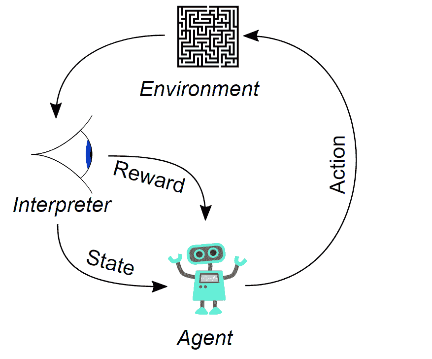
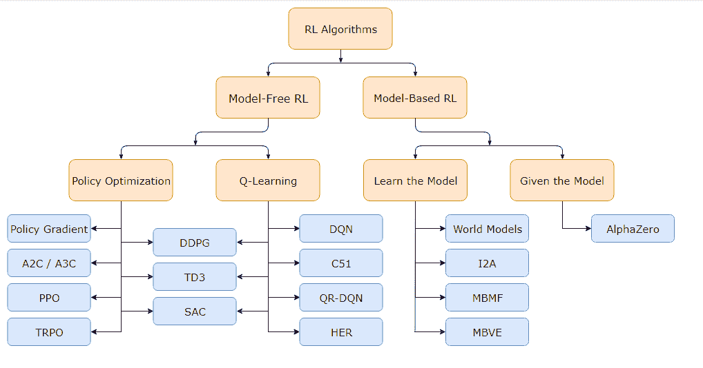
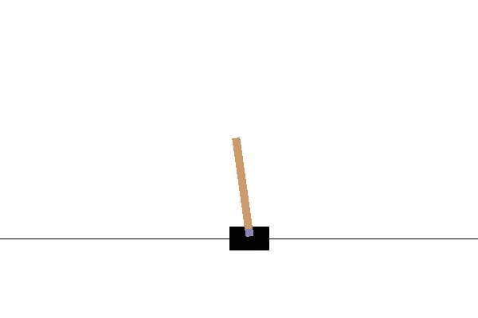

# 强化学习入门

> 原文：<https://blog.paperspace.com/getting-started-with-reinforcement-learning/>


Photo by [Visual Stories || Micheile](https://unsplash.com/@micheile?utm_source=ghost&utm_medium=referral&utm_campaign=api-credit) / [Unsplash](https://unsplash.com/?utm_source=ghost&utm_medium=referral&utm_campaign=api-credit)

人工智能(AI)是现代史上最具革命性的发展之一。曾经被认为不可能由计算机完成的任务现在可以由人工智能轻松完成，在某些情况下，甚至在某项特定任务上超过人类。随着技术的快速进步和大量数据的可用性，我们有可能开发出 AI 模型和算法来解决各种问题。人工智能是一个庞大的研究领域，由多个分支和子集组成。这些概念包括机器学习、深度学习、自然语言处理、计算机视觉、数学，以及本文关注的主题强化学习。

我们将看一个 2 部分的系列，在第一部分我们将获得对强化学习的直观理解，而在下一部分我们将构建几个关于强化学习的项目。对于本文，我们将在简要介绍这个研究领域之后理解强化学习的主要方面。然后，我们将讨论一些算法和策略，在强化学习的帮助下，我们可以利用它们来完成任务。最后，我们将开发一个具有深度强化学习的基础入门项目，以确保我们完美掌握所有的要点。

### 目录:

1.  强化学习简介
2.  理解强化学习的概念
3.  众多强化学习算法的讨论
4.  深度强化学习入门项目
    1。大车杆子项目介绍
    2。安装和获取所需的库
    3。激活测试环境
    4。创建我们的深度学习模型
    5。构建我们的 RL 代理
    6。保存和重新加载 RL 代理
5.  结论

## 强化学习简介:

人类通常倾向于从经验中学习他们的能力、限制和他们可以执行的行动类型。婴儿在成长过程中，开始学习走路。通常，这个过程似乎很自然，因为大多数人类是从慢慢爬行到站立，最后以婴儿的脚步行走。但是，在最终适应整个行走模拟过程之前，婴儿在学习阶段往往会摔倒很多。这种从失败中不断尝试的学习方法对于人类来说是一种常见的做法。然而，在人工智能领域也存在一个类似的研究分支，它处理被称为强化学习的方法。

在这个研究领域中，我们利用强化学习算法来训练期望的模型，以便从它们以前的错误中学习。一旦模型对它们的工作过程有了直观的理解，它们的结果就会相应地慢慢改善。近年来，人们提出了几种从失败中学习的算法，以应对众多任务，包括自动驾驶人工智能汽车、工业自动化、机器人模拟、征服游戏等等。由于这些强化算法对现实世界中的实际应用的影响，它们的效用在现代继续快速增长。在文章的下一部分，让我们习惯强化学习中的各种概念。

* * *

## 理解强化学习的概念:



[Image Source](https://commons.wikimedia.org/wiki/File:Reinforcement_learning_diagram.svg)

强化学习是我们可以训练模型学习的最独特的技术之一，因为它利用试凑法来达到预期的结果。构成强化学习核心构成的五个主要概念是主体、行动、环境、观察和奖励。让我们分别理解这些单独的元素，以及它们在强化学习项目中的意义。

代理是强化学习模型中最重要的组成部分，因为它代表了在环境中运行的核心组成部分，在该环境中，它遵循由特定操作任务和指定策略的原则所支配的一组规则。给予代理的规则允许它决定处理特定问题所需的路径。

另一方面，我们有一个代理可以操作和执行指定任务的环境。对于我们所有的强化学习项目，我们将利用 OpenAI gym，其中有几个预先构建的环境，允许研究人员自由利用和试验众多的强化学习模型和算法。我们将在下一篇文章中学习更多关于 OpenAI gym 的知识，但是让我们学习一些我们需要知道的基本功能。

在 OpenAI 健身房中，我们将利用的一些主要功能如下:

1.  **env . reset()**–重置整个环境，获得观察的初始值。
2.  **env . render()**–渲染显示工作设置可视化的环境。
3.  **env . step()**–继续对选定的环境进行操作。
4.  **env . Close()**–关闭环境的特定渲染帧。

动作是代理在相应环境中可以执行的操作。最好用几个例子来理解这个概念。如果你正在尝试编程一个机器人手臂模拟来举起和放下一个物体，那么有两个动作可以执行，即向上和向下运动。另一方面，如果您试图教授一个复杂的问题，如在跳棋、井字游戏或国际象棋等游戏中训练强化学习模型，模型可以考虑的每一个部分都有几种组合和计算。在我们将在本文后面部分讨论的例子中，我们有两个 cart 杆的动作，即左和右。我们将在接下来的章节中进一步理解这个概念。

最后，我们有观察空间或状态和奖励的概念。状态表示正在执行的任务的当前位置。这些状态包括相对于所执行任务的环境，您的座席当前所处的操作类型和位置。状态 s 是对世界状态的完整描述。没有任何关于世界的信息是对国家隐藏的。观察值 o 是状态的部分描述，它可能省略信息。奖励是在正确解释当前问题后奖励给模型的加分。对于代理在相关环境中执行的每个正确动作，代理被奖励一个奖励点或“奖赏”代理遵循的学习原则取决于用户实施的强化学习算法和策略的类型。在本文的下一部分，我们将尝试对一些强化学习算法有一个总体的了解。

* * *

## 众多强化学习算法的讨论；



[Image Source](https://spinningup.openai.com/en/latest/spinningup/rl_intro2.html)

强化学习算法是一种方法，在这种方法中，代理获得反馈以在环境中执行期望的动作，从而获得奖励并完成任务。有大量不同类型的强化学习算法，根据你选择询问的专家类型，答案可能会有所不同。我们将关注上面显示的图像表示，并讨论一些我们需要了解的更有用的算法。我还建议看看本文中没有提到的其他算法。

强化学习算法的两个主要分类包括无模型强化学习和基于模型的强化学习。两者之间需要注意的关键区别是，在无模型 RL 中，我们利用当前状态值来进行未来预测，而基于模型的 RL 方法也考虑未来状态来进行各自的预测。诸如推车杆问题的问题可以利用诸如 PPO 或 DQN 算法的无模型方法，而诸如象棋或 shogi 的问题将利用基于模型的方法来预测最佳可能结果。

在无模型强化学习中，我们主要使用两种主要技术来解决许多任务，即基于策略优化的方法和 Q 学习方法。首先，我们将讨论策略优化技术，它利用性能目标，并相应地调整和优化其值以适应策略。在近似策略优化(PPO)方法中，通过最大化替代目标函数，更新间接地最大化性能，替代目标函数给出了性能目标由于更新而改变多少的保守估计。

另一方面，我们有演员-评论家(A2C)强化学习算法，这是另一种无模型方法，执行梯度上升以直接最大化性能。在无模型方法中，Q-learning 是另一种更流行的技术，用于解决各种强化学习项目，如井字游戏。这种技术利用[贝尔曼方程](https://spinningup.openai.com/en/latest/spinningup/rl_intro.html#bellman-equations)和非策略方法来更新值，而不管训练的阶段。深度 Q 网络(DQN)算法是由 Deep Mind 提出的主要算法，也是解决众多问题的流行 Q 学习算法之一。

另一方面，对于基于模型的强化学习方法，我们有 [Alpha Zero](https://arxiv.org/abs/1712.01815) 。Alpha Zero 是强化学习算法所拥有的力量的最流行的例子之一。如果你是一个狂热的国际象棋爱好者，你很有可能会遇到术语国际象棋引擎和 Alpha Zero。拥有强化学习模型的主要优点是它允许代理提前计划。因此，像 Alpha Zero 这样的程序能够在获得高质量结果的同时，攻克诸如 shogi 和 chess 这样的复杂问题。它还能够通过从自我游戏中学习的白板强化学习，在围棋游戏中实现超人的表现。

对于您的特定模型，您还可以选择几个策略来操作。这些策略规定了如何构建您的模型，以及它们将如何在您创建的环境中进行交互和操作。我们将在下一篇文章中使用的稳定基线模块支持三种主要策略，即 MLP 策略、CNN 策略和多输入策略。我们将在下一篇文章中了解更多关于稳定基线 3 的内容。现在，我们将注意到，策略是代理将用来执行特定动作的计划或策略，充当代理状态和环境的功能。请随意探索关于这个主题的更多信息，并查看以下[链接](https://www.baeldung.com/cs/ml-policy-reinforcement-learning)以获得更详细的解释。

* * *

## 深度强化学习入门项目:



[Image Source](https://gym.openai.com/envs/CartPole-v1/)

在本文的这一部分，我们将重点构建一个深度强化学习项目。我们将为这个特殊的深度强化学习项目进行一个手推车杆模拟。对于那些不熟悉推车杆子游戏的人，我会推荐你去一些在线网站，在那里你可以尝试自己玩这个游戏。我在下面的游戏中可以尝试的一个这样的网站就是 Flux 网站上的这个[链接](https://fluxml.ai/experiments/cartPole/)。

推车杆问题基本上是一个模拟棒或杆(称为杆)，通过一个未驱动的关节连接到在无摩擦平面上移动的推车。这个游戏取决于你在推车上平衡这根杆子的能力。您可以使用左箭头键和右箭头键来平衡柱子的位置，柱子最初是直立的。玩家设法保持柱子直立的每一个动作都加 1 分。万一杆子塌到十五度以下的角度，游戏就结束了，根据计算的结果来评定你的总成绩。

我们将尝试借助深度强化学习来实现解决上述问题的解决方案。为了解决这个任务，我们将利用 OpenAI gym 来构建强化学习模型的环境。我们将在下一篇文章中更多地讨论这个工具，我们将在更好的库的帮助下更详细地讨论这个项目和另一个项目。构建这种深度强化学习模型的下一对要求是利用深度学习框架。

对于本文，我们将利用 TensorFlow 和 Keras 深度学习框架来实现预期的结果。请注意，我们将在下一篇文章中使用 PyTorch 环境，在这里我们将构建几个具有强化学习的项目。我在之前的文章中已经涵盖了与这些深度学习框架相关的所有概念。如果您还没有查阅它们或需要这些概念的简介，请查看以下内容-“[*tensor flow*](https://blog.paperspace.com/absolute-guide-to-tensorflow/)绝对指南”、“Keras 绝对指南”、“PyTorch 最终指南”我也强烈推荐通过这个[链接](https://www.youtube.com/c/NicholasRenotte/videos)查看下面的 YouTube 频道。大部分灵感和代码都参考了上述渠道和本 [GitHub](https://github.com/nicknochnack) 页面。现在让我们开始深度强化学习项目。

### 安装和获取所需的库:

构建深度强化学习项目的主要要求是利用环境来测试我们的特定项目，并利用深度学习框架来构建模型以解决适当的任务。我们还需要一个强化学习代理，它将利用我们期望的算法和策略，结合所有讨论过的元素来解决任务。除了 TensorFlow 和 Keras 深度学习框架之外，您需要安装的主要要求是 OpenAI gym 库和 Keras 强化学习库。确保您在安装了 TensorFlow 和 Keras 最新版本的虚拟环境中工作。在激活的同一个虚拟环境中，运行以下命令来满足该项目的所有必要要求。

```py
pip install gym
pip install keras-rl2 
```

要了解这两个特定库的更多信息，我建议查看它们的官方文档，其中传达了大部分重要信息。我们还将在下一篇文章中更详细地查看 OpenAI gym 库，在那里我们将构建几个带有强化学习的项目。然而，你可以查看这个[链接](https://gym.openai.com/docs/)来了解更多关于 OpenAI 健身房的信息，以及这个[网站](https://keras-rl.readthedocs.io/en/latest/)来了解更多关于 Keras 强化学习的信息。

### 激活测试环境:

在我们项目的下一步，我们将构建合适的环境来测试 cart pole 问题。让我们导入几个基本的库，我们将在本文的这一部分使用它们。OpenAI gym 是为了创建和开发我们的测试环境而导入的，而 random 库将帮助我们输入一个随机数 0 或 1，用于 cart pole 的横向移动。

```py
import gym 
import random
```

一旦我们导入了所需的库，让我们继续创建用于创建和测试强化学习模型的环境。在 make 函数的帮助下，我们将创建 CartPole-v0 环境。我们现在将解释状态，这是可能的观察数量，也解释可能的动作数量。注意，有四种状态，即小车的位置、小车的速度、小车的角度和角速度。动作的数量包括两个，即车杆的向左和向右运动。

```py
env = gym.make('CartPole-v0')
states = env.observation_space.shape[0]
actions = env.action_space.n
actions
```

在下一个代码块中，我们将在总共十集的环境中测试该模型，以查看它在没有任何训练的情况下如何执行。我们将实现左或右的随机点击，随机选择 0 和 1。对于每一步，我们都会计算分数。每向右移动一步，就会得到分数，而如果车杆未能保持直立 15 度角，游戏结束，并显示每集结束时计算的最终分数。检查下面的代码块以理解以下实现的过程。

```py
episodes = 10
for episode in range(1, episodes+1):
    state = env.reset()
    done = False
    score = 0 

    while not done:
        env.render()
        action = random.choice([0,1])
        n_state, reward, done, info = env.step(action)
        score+=reward
    print('Episode:{} Score:{}'.format(episode, score))
```

在接下来的部分中，我们将继续构建深度学习模型和适当的强化学习代理来处理这个项目。我们的目标是每集至少得 200 分。

### 创建我们的深度学习模型:

现在让我们着手构建一个简单的深度学习架构，我们将利用它来构建模型。第一步是导入该过程的所有必要需求。我们将导入一个序列模型，以及一个完全连接结构的密集层和一个展平层。我们还将利用 Adam 优化器。我建议尝试不同的方法和途径来测试哪种模型最适合你的培训模型。

```py
import numpy as np
from tensorflow.keras.models import Sequential
from tensorflow.keras.layers import Dense, Flatten
from tensorflow.keras.optimizers import Adam
```

下一步是创建一个函数，我们将在其中构建模型架构。我们将构建一个顺序模型，并将其展平到四个状态，从这四个状态开始，我们将通过两个完全连接层的隐藏节点，这些层具有 TensorFlow 和 Keras 的密集层。在最后一层，我们将利用线性激活函数并解释两种可能的输出，即左键或右键单击。一旦我们的模型被构建，我们将继续进行下一步来构建 RL 代理。

```py
def build_model(states, actions):
    model = Sequential()
    model.add(Flatten(input_shape=(1,states)))
    model.add(Dense(24, activation='relu'))
    model.add(Dense(24, activation='relu'))
    model.add(Dense(actions, activation='linear'))
    return model
```

### 构建我们的 RL 代理:

在构建我们的 RL 代理来处理这个项目之前，我们将导入这个任务所需的所有库。我们将利用 DQN 代理，你可以从[这里](https://keras-rl.readthedocs.io/en/latest/agents/dqn/)检查，也利用波尔兹曼 Q 策略与顺序存储器。所有必需的导入如下面的代码片段所示。

```py
from rl.agents import DQNAgent
from rl.policy import BoltzmannQPolicy
from rl.memory import SequentialMemory
```

在下一个代码块中，我们将构建一个用于构建 RL 代理的函数，类似于我们的模型构造。我们将定义基本参数，如策略、内存和处理问题的代理。下面的代码块说明了如何构造所需的函数。

```py
def build_agent(model, actions):
    policy = BoltzmannQPolicy()
    memory = SequentialMemory(limit=50000, window_length=1)
    dqn = DQNAgent(model=model, memory=memory, policy=policy, 
                  nb_actions=actions, nb_steps_warmup=10, target_model_update=1e-2)
    return dqn
```

我们现在可以调用之前定义的模型函数，如下所示。

```py
model = build_model(states, actions)
model.summary()
```

```py
Model: "sequential_1"
_________________________________________________________________
Layer (type)                 Output Shape              Param #   
=================================================================
flatten_1 (Flatten)          (None, 4)                 0         
_________________________________________________________________
dense_3 (Dense)              (None, 24)                120       
_________________________________________________________________
dense_4 (Dense)              (None, 24)                600       
_________________________________________________________________
dense_5 (Dense)              (None, 2)                 50        
=================================================================
Total params: 770
Trainable params: 770
Non-trainable params: 0
_________________________________________________________________ 
```

### 注意:

```py
AttributeError: 'Sequential' object has no attribute '_compile_time_distribution_strategy' 
```

如果要避免上述文本框中显示的以下错误，请确保模型始终在 Keras RL 导入后构建。否则，可能会出现顺序内存混合的情况，从而导致显示上述错误消息，并且您无法继续运行程序以获得预期的结果。

类似于调用我们的模型架构，我们也将使用各自的深度学习模型来构建所需的代理。一旦我们完成了用该模型构建我们的代理的过程，我们就可以继续编译和训练深度强化学习模型，并测试该模型的性能。

```py
dqn = build_agent(model, actions)
dqn.compile(Adam(lr=1e-3), metrics=['mae'])
dqn.fit(env, nb_steps=50000, visualize=False, verbose=1)
```

一旦训练过程完成，我们就可以加载每集的分数，并测试该模型的性能。我们应该能达到每集至少 200 分。

```py
scores = dqn.test(env, nb_episodes=100, visualize=False)
print(np.mean(scores.history['episode_reward']))
```

您还可以通过深度强化学习模型可视化您的结果，以检查 cart pole 的性能。

```py
_ = dqn.test(env, nb_episodes=15, visualize=True)
```

### 保存和重新加载 RL 代理:

我们将查看的最后一部分是经过训练的深度强化学习模型的权重的保存和重新加载。以 h5 或 h5f 格式保存与 TensorFlow 模型相似的权重，如下所示。

```py
dqn.save_weights('dqn_weights.h5f', overwrite=True)
```

如果您正在重新加载项目，并希望检查性能，这是非常简单的。重新加载健身房环境、模型结构、可能的动作和状态，最后编译模型。遵循下面的代码块表示来完成这个任务。

```py
env = gym.make('CartPole-v0')
actions = env.action_space.n
states = env.observation_space.shape[0]
model = build_model(states, actions)
dqn = build_agent(model, actions)
dqn.compile(Adam(lr=1e-3), metrics=['mae'])
```

最后一步是为我们的训练模型加载保存的权重。该步骤如下所示执行。

```py
dqn.load_weights('dqn_weights.h5f')
```

现在，您可以继续测试加载的训练模型，并直观地检查性能。

```py
_ = dqn.test(env, nb_episodes=5, visualize=True)
```

建议尝试代理、策略和模型架构的多种组合，看看您的项目如何相应地变化。在接下来的文章中，我们将查看构建 cart pole 项目的另一种方法，并了解如何使用强化学习解决自动驾驶汽车项目。

* * *

## 结论:


Photo by [Element5 Digital](https://unsplash.com/@element5digital?utm_source=ghost&utm_medium=referral&utm_campaign=api-credit) / [Unsplash](https://unsplash.com/?utm_source=ghost&utm_medium=referral&utm_campaign=api-credit)

在强化学习的帮助下，我们可以构建各种各样的项目，其中 RL 代理学习如何适应特定的场景。在强化学习的所有概念的知识的帮助下，人们可以很容易地构建一个算法来完成像推车杆子问题这样的任务。强化学习算法在成败中学习，在成功中不断更新。这种实现方法在未来的许多应用中具有非常高的范围，值得学习。

在本文中，我们简要介绍了强化学习。我们理解了与这个主题相关的一些重要的概念。我们还简要地看了一些算法和策略，我们可以利用它们来构建许多项目和解决与强化学习相关的任务。最后，我们在 OpenAI gym 环境、TensorFlow 和 Keras 深度学习框架以及 Keras-RL 库的帮助下构建了一个深度强化学习项目。我建议尝试不同的变化，并检查模型的性能。我们将在下一篇文章中学习更多解决 RL 项目的方法。

在接下来的文章中，我们将看几个我们可以用强化学习构建的项目，让我们探索我们可以用机器学习领域完成的不同类型任务的无限可能性。在那之前，继续做新的独特的项目吧！