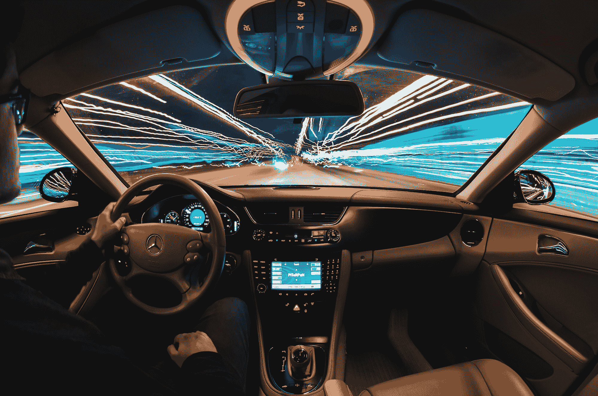
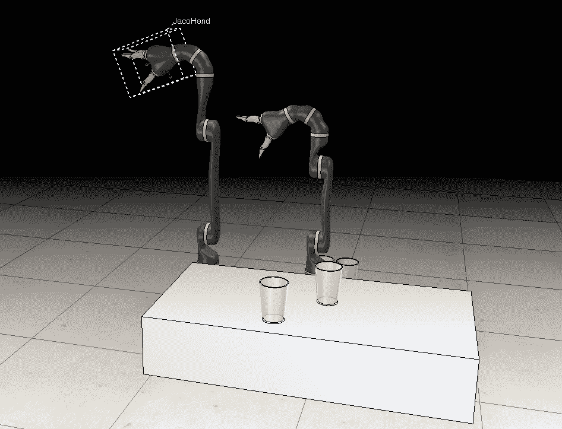
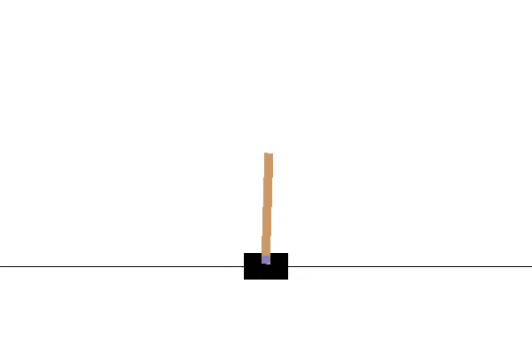
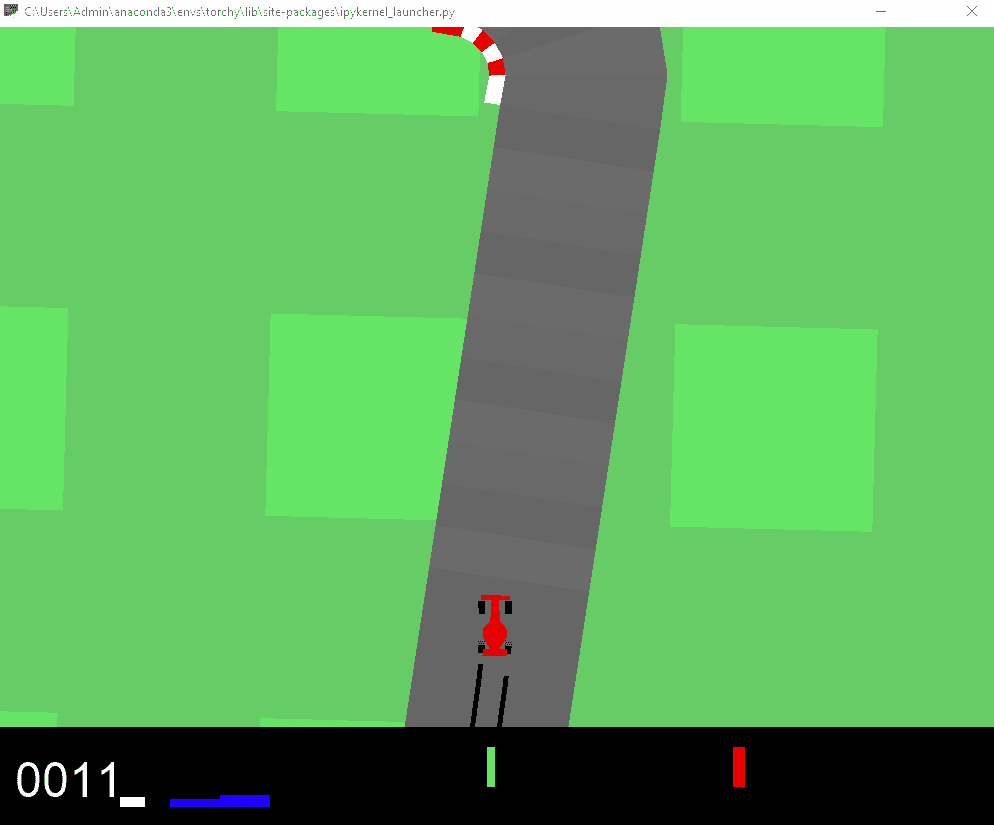
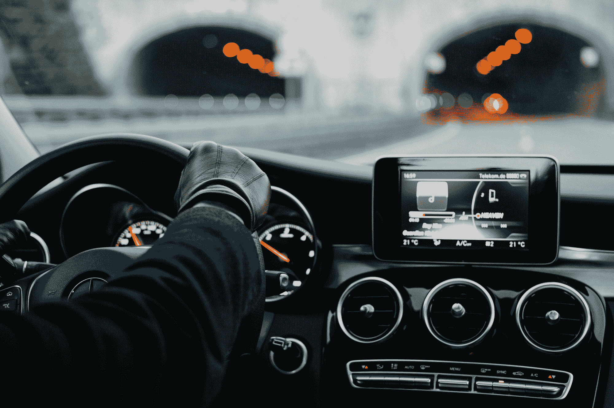

# 强化学习项目

> 原文：<https://blog.paperspace.com/projects-with-reinforcement-learning/>



Photo by [Samuele Errico Piccarini](https://unsplash.com/@samuele_piccarini?utm_source=ghost&utm_medium=referral&utm_campaign=api-credit) / [Unsplash](https://unsplash.com/?utm_source=ghost&utm_medium=referral&utm_campaign=api-credit)

在强化系列文章的第二部分中，我们将进一步了解实现强化学习算法和策略的许多方法，以获得可能的最佳结果。如果您还没有，我强烈建议您查看一下，因为我们已经介绍了理解与这些强化学习方法相关的理论知识所需的一些基本知识。我们已经介绍了初级强化学习的概念，理解了一些有用的算法和策略，最后，实现了一个简单的深度强化学习项目。在本文中，我们的目标是进一步扩展这方面的知识。

在本文中，我们将了解与项目结构的实现相关的完整细节，主要是众多概念，如 OpenAI gym，其他必要的安装要求，如 PyTorch 和稳定基线，以及其他基本要求。我们还将查看在执行这些项目的过程中可能遇到的潜在错误修复。然后我们将继续进行两个项目的工作，即 cart pole 项目和自动驾驶汽车。我们将在 PyTorch 虚拟环境中使用不同的方法来解决 cart pole 项目，并学习如何构建一个经过训练的模型来处理具有强化学习的自动驾驶问题。查看目录，进一步理解我们将在下一篇文章中处理的众多主题和概念。

### 目录:

1.  介绍
2.  项目结构入门
    1。了解 OpenAI 健身房和
    2。安装程序
    3。修复潜在的错误
3.  用强化学习开发一个撑杆跳项目
    1。导入基本库
    2。创造环境
    3。训练一个 RL 算法
    4。保存和加载模型
    5。评估和测试模型
4.  用强化学习开发自动驾驶汽车项目
    1。导入基本库
    2。测试环境
    3。训练模型
    4。拯救训练有素的模特
    5。评估和测试模型
5.  结论

## 简介:



Screenshot by Author

从机器人模拟到在游戏中训练 AI 机器人，再到构建高级象棋引擎，强化学习在所有这些巨大的应用中都有用处。上面显示的图包括我在不同类型的机器人模拟和项目中使用的一个软件的截图。在将这些模型部署到工业规模之前，对其进行检查和测试是至关重要的。因此，我们可以利用 OpenAI gym 环境来构建我们的强化算法，以便在有效测试特定项目的同时有效地训练模型。我们的目标是帮助机器人(或有意义的特定对象)高精度地执行复杂的任务。

一旦您在特定环境中成功地测试了您的开发模型，您就可以部署机器人模型及其各自经过训练的强化学习模型。除了工业机器人应用，这些强化学习模型也用于分析和监控交易数据、商业智能和其他类似的实践。在本文中，我们的主要焦点将是在主要两个程序上学习和训练这些 RL 模型，即，手推车杆游戏和自动驾驶自动驾驶汽车模拟。在我们直接进入这些精彩的项目之前，让我们探索一下 OpenAI gym 环境以及它们的其他基本需求和依赖性。

* * *

## 项目结构入门:

假设观众已经阅读了上一篇关于开始强化学习的文章的开始部分，那么你应该对我们构建深度学习模型所需的依赖类型有一个简单的想法。我们将利用 OpenAI 健身房来创建必要的环境，在那里我们可以训练我们的强化学习模型。我们将在虚拟环境中使用 PyTorch 安装，而不是以前的 TensorFlow 和 Keras 支持。因此，我建议查看《[*PyTorch*](https://blog.paperspace.com/ultimate-guide-to-pytorch/)终极指南》，以熟悉 py torch 深度学习框架。最后，我们将利用 Stable-Baselines3 开发工具包，它是实现强化学习算法和策略的可靠方法。

稳定基线 3 的灵感来自最初由 OpenAI 开发的原始基线版本。它是 PyTorch 中强化学习算法的一组可靠实现。它是[稳定基线](https://github.com/hill-a/stable-baselines)的下一个主要版本。为了进一步研究这个神奇的强化学习库，我建议查看下面的[文档](https://stable-baselines3.readthedocs.io/en/master/guide/quickstart.html)入门指南。下面的库安装起来很简单。确保您的虚拟环境中安装了 PyTorch，然后继续运行以下命令。

```py
pip install stable-baselines3[extra] 
```

OpenAI gym 是探索各种强化学习算法的最佳工具包之一。由于其众多环境的大集合，对其类型没有预先假设的环境为用户提供了对不同类型的问题进行实验的基础平台。它高度兼容任何数值计算库和深度学习框架，如 TensorFlow、PyTorch 或 Theano。稳定基线 3 为用户提供了一套改进的算法和策略，以高度简化的方式训练强化学习模型。他们帮助研究团体容易地复制、提炼和识别新的想法。

第二个自动驾驶项目需要的另一个主要安装是特定平台(Windows、Mac 或 Linux)的 SWIG 安装。从这个[网站](http://www.swig.org/Doc1.3/Windows.html)下载 swig 包，并确保将路径添加到您的环境变量中。简化的包装器和接口生成器(SWIG)是最好的开源工具之一，它允许你把用 C 或 C++代码编写的计算机脚本包装成其他脚本语言。一旦下载完成，并且您已经安装了它，关闭命令提示符并重新打开它进行任何额外的安装。我下载安装的版本是 swigwin-4.0.2 和 swigwin-3.0.12。请核实并检查哪个版本最适合您，以及是否有任何未来的更新。

运行第二个项目需要的另外两个最终安装是 2D 盒子。盒子-2D 环境是在 OpenAI 健身房进行自驾实验的必备环境。另一个主要的安装是 Pyglet 库，它对游戏开发非常有用。在包含所有其他依赖项的虚拟环境中运行下面提到的命令，您应该能够相应地下载这两个需求。如果您像我一样在安装过程中遇到错误，请查看下面的堆栈溢出[网站](https://stackoverflow.com/questions/51811263/problems-pip-installing-box2d)以获得解决方案。最好下载、安装各种版本的 SWIG，并将其添加到环境变量中，以避免此类问题。

```py
!pip install gym[box2d] pyglet==1.3.2 
```

* * *

## 用强化学习开发推车杆项目:



[Image Source](https://gym.openai.com/envs/CartPole-v1/)

我们已经在上一篇强化学习入门文章中讨论了 cart pole 项目。作为一个快速回顾，让我们理解这个任务如何工作的内在细节。推车杆项目基本定义如下-

> 一根杆子通过一个非驱动关节连接到一辆小车上，小车沿着一条无摩擦的轨道移动。通过对推车施加+1 或-1 的力来控制该系统。钟摆开始直立，目标是防止它翻倒。杆保持直立的每个时间步长提供+1 的奖励。当柱子偏离垂直方向超过 15 度，或者手推车偏离中心超过 2.4 个单位时，该集结束。
> -[来源](https://gym.openai.com/envs/CartPole-v1/)

在这个项目中，我们的目标是利用强化学习模型在接下来的项目中取得良好的结果，这样手推车的杆子可以长时间保持平衡，并且该模型能够在测试该模型的每集中获得至少 200 分。让我们通过理解所有的基本概念并相应地开发我们的强化学习模型来开始这个项目。

### 导入基本库:

在第一步中，我们将导入一些访问环境所需的基本库，并为 cart pole 项目开发所需的强化学习模型。我们将在这个实验中使用 PPO 算法。[近似策略优化](https://arxiv.org/abs/1707.06347)算法结合了 A2C(拥有多个工作者)和 TRPO(使用信任区域来改进参与者)的思想。观众可以相应地选择各自的算法。下一次导入有助于根据需要包装环境，而评估策略将帮助我们分析所需的指标。

```py
import gym 
from stable_baselines3 import PPO
from stable_baselines3.common.vec_env import DummyVecEnv
from stable_baselines3.common.evaluation import evaluate_policy
import os
```

### 创造环境:

下一步，我们将继续使用 OpenAI 健身房支持系统创建我们的训练环境。在这一步中，我们将测试 cart pole 的工作机制，并在没有任何模型训练的情况下相应地评估分数，以了解它的表现如何。前一篇文章中也提到了这一步，我建议查看一下，以便更好地理解所达到的低分数。

```py
environment_name = "CartPole-v0"
env = gym.make(environment_name)

episodes = 5

for episode in range(1, episodes+1):
    state = env.reset()
    done = False
    score = 0 

    while not done:
        env.render()
        action = env.action_space.sample()
        n_state, reward, done, info = env.step(action)
        score+=reward
    print('Episode:{} Score:{}'.format(episode, score))

env.close()
```

### 训练 RL 算法:

在这一步中，我们将选择首选的强化学习算法和策略来完成这项任务。对于本文中的任务和项目，我们将利用近似策略优化强化学习算法。请随意试验由稳定基线 3 库提供的不同类型的算法和策略。其他一些选项包括 A2C、DQN、SAC 和其他类似的算法。

在我们开始训练我们的强化学习模型之前，我们将专注于添加和创建一些必要的回调，包括用于查看各自日志的 Tensorboard 回调。对于这一步，我们需要创建适当的目录来存储 tensorboard 生成的日志。使用 Python 代码或直接在各自的平台中创建文件夹。一旦创建了这些文件夹，我们就可以加入日志和模型的路径。

```py
training_log_path = os.path.join(log_path, 'PPO_3')
!tensorboard --logdir={training_log_path}
```

在下一步中，一旦达到我们要求的阈值，我们将利用一些其他回调来停止火车。我们还将为经过训练的模型以及它们生成的日志定义保存路径和日志路径。为了训练模型，我们将使用 MLP 策略定义 PPO 算法，并定义张量板路径。然后，我们将使用定义的回调对模型进行总计 20000 个时间步长的训练。我们的目标是在每一集的推车杆子问题上取得至少 200 分。最后，用下面提供的代码片段训练模型。

```py
from stable_baselines3.common.callbacks import EvalCallback, StopTrainingOnRewardThreshold
import os

save_path = os.path.join('Training', 'Saved Models')
log_path = os.path.join('Training', 'Logs')

env = gym.make(environment_name)
env = DummyVecEnv([lambda: env])

stop_callback = StopTrainingOnRewardThreshold(reward_threshold=190, verbose=1)
eval_callback = EvalCallback(env, 
                             callback_on_new_best=stop_callback, 
                             eval_freq=10000, 
                             best_model_save_path=save_path, 
                             verbose=1)

model = PPO('MlpPolicy', env, verbose = 1, tensorboard_log=log_path)

model.learn(total_timesteps=20000, callback=eval_callback)
```

现在，您可以继续直接评估模型，或者继续保存模型以加载并在以后重用它。您可以执行以下操作，如下所示。我们将在接下来的小节中更详细地讨论这几个步骤。

```py
model_path = os.path.join('Training', 'Saved Models', 'best_model')
model = PPO.load(model_path, env=env)

evaluate_policy(model, env, n_eval_episodes=10, render=True)
env.close()
```

请注意，您还可以使用不同的算法，并针对您正在处理的特定项目相应地更改策略。我建议试验和尝试各种组合，看看模型收敛得有多快，以及哪个模型更适合特定的问题。

### 保存和加载模型:

如前所述，我们可以创建保存路径，一旦训练完成，我们将在该路径中保存已训练的模型。这个操作可以用 model.save()函数来执行。然而，因为我们已经为下面的操作使用了回调，所以我们不必担心这一步。然而，下面的代码显示了保存您想要的模型的另一种方法。

```py
PPO_path = os.path.join('Training', 'Saved Models', 'PPO_model')
model.save(PPO_path)
```

如果您想要加载相同的模型，那么您可以使用下面显示的代码。

```py
model = PPO.load('Training/Saved Models/PPO_model', env=env)
```

### 评估和测试模型:

在这个项目的最后一部分，我们将评估和测试训练好的模型。以下代码显示了如何评估总共十集的特定策略。

```py
from stable_baselines3.common.evaluation import evaluate_policy
evaluate_policy(model, env, n_eval_episodes=10, render=True)
env.close()
```

最后，我们需要测试和评估我们训练好的模型的性能。对于这一步，我们将利用评估策略并测试总共十集的模型。渲染环境，并在渲染的环境上测试模型。理想情况下，训练好的模型应该能够在我们运行训练好的模型的每个间隔(情节)中获得 200 分。评估完成后，我们可以继续关闭测试环境。

```py
obs = env.reset()
while True:
    action, _states = model.predict(obs)
    obs, rewards, done, info = env.step(action)
    env.render()
    if done: 
        print('info', info)
        break

 env.close()
```

如果您想要测试已训练的模型并运行已保存的模型，下面提供了以下内容的完整代码。我们基本上是导入所有需要的库，为 cart pole 问题创建体育馆环境，加载训练好的模型，并执行评估来检查我们在训练好的模型上取得的结果。

```py
import gym 
from stable_baselines3 import PPO
from stable_baselines3.common.vec_env import DummyVecEnv
from stable_baselines3.common.evaluation import evaluate_policy
import os

environment_name = "CartPole-v0"
env = gym.make(environment_name)

model = PPO.load('Training/Saved Models/PPO_model')

obs = env.reset()
while True:
    action, _states = model.predict(obs)
    obs, rewards, done, info = env.step(action)
    env.render()
    if done: 
        print('info', info)
        break

env.close()
```

完成后，让我们继续本文的下一部分。我们现在将为自动驾驶汽车项目构建一个强化学习模型。

* * *

## 用强化学习开发自动驾驶汽车项目:



Screenshot by Author on a partially trained model

在本文的第二个项目中，我们将了解如何为自动驾驶汽车开发强化学习模型。正如我们从上面的图像中看到的，我们可以训练我们的强化学习模型，以实现赛车在赛道上的每一个时刻都获得理想的分数。然而，当赛车偏离轨道时，我们会否定它的一些进步。利用这条学习曲线，我们可以相应地训练汽车，以达到所需的结果，并确保汽车沿着正确的轨道行驶，而不会跑偏。请注意，当我们在这个项目中工作时，会有几种情况，赛车偏离了轨道，并持续烧毁。这通常是好的，即使它可能会持续几秒钟。

### 导入基本库:

在导入基本库之前，请确保您已经阅读了本文前面的项目结构入门一节。确保您已经安装了 box-2D、Pyglet、SWIG 和项目的其他必要需求。一旦成功安装了所有的依赖项，我们将继续调用库来完成这个任务。OpenAI gym 创建我们的环境，稳定的基线来导入我们的策略，向量化环境，并评估策略。查看下面的代码片段，了解程序。

```py
import gym 
from stable_baselines3 import PPO
from stable_baselines3.common.vec_env import VecFrameStack
from stable_baselines3.common.evaluation import evaluate_policy
import os
gym.logger.set_level(40)
```

### 测试环境:

奖励是每帧-0.1，每个被访问的轨迹块+1000/N，其中 N 是轨迹中被访问的块的总数。比如你完成了 732 帧，你的奖励就是 1000 - 0.1*732 = 926.8 分。当代理人持续获得 900+点时，游戏被认为已解决。但是，每集生成的轨迹完全是随机的。为了达到最佳效果，我们将需要训练强化学习模型相当长的时间，这取决于您拥有的系统组件的类型。因此，为了达到这项任务的最佳效果，耐心是必需的，因为在训练过程中你将会面临几次汽车烧毁。

在接下来的代码片段中，我们将测试自动驾驶汽车所需的环境。类似于我们如何测试 cart pole 实验，我们将为自动驾驶汽车问题构建测试环境。我们将使用 OpenAI gym 构建环境，并继续渲染环境以评估默认汽车的分数和性能。我们会注意到汽车不能如预期的那样运行，我们的任务是使用强化学习来提高它的整体性能。

```py
environment_name = "CarRacing-v0"

env = gym.make(environment_name)

episodes = 5
for episode in range(1, episodes+1):
    state = env.reset()
    done = False
    score = 0 

    while not done:
        env.render()
        action = env.action_space.sample()
        n_state, reward, done, info = env.step(action)
        score+=reward
    print('Episode:{} Score:{}'.format(episode, score))

env.close()
```

### 样本输出:

```py
Track generation: 1207..1513 -> 306-tiles track
Episode:1 Score:-34.426229508197295
Track generation: 1180..1479 -> 299-tiles track
Episode:2 Score:-36.2416107382556
Track generation: 1170..1467 -> 297-tiles track
Episode:3 Score:-32.43243243243292
Track generation: 1012..1269 -> 257-tiles track
Episode:4 Score:-25.781250000000323
Track generation: 1181..1482 -> 301-tiles track
Episode:5 Score:-33.333333333333876 
```

如果您想了解关于环境的更多信息，可以查看如下操作示例。

```py
env.action_space.sample()
```

和观察空间如下。

```py
env.observation_space.sample()
```

完整详细标注的源代码也是 OpenAI 针对自动驾驶汽车问题提供的。在这个[链接](https://github.com/openai/gym/blob/master/gym/envs/box2d/car_racing.py)的帮助下，查看者可以访问源代码。

### 训练模型:

在下一步中，我们将训练近似策略优化强化学习算法，以解决我们在前面几节中定义的自动驾驶汽车的任务。第一步是确保您已经创建了一个包含 logs 文件夹的培训目录。您可以使用 *os.makedirs* 命令来执行此操作，或者直接在平台中创建新目录。我们将指定这些日志的路径来存储*张量板*的评估结果。然后，我们将继续使用 CNN 策略创建 PPO 算法，并为总共 20000 个步骤训练该模型。如果您的计算资源系统允许您在期望的时间内训练更多的时间步长，建议相应地延长时间步长。训练的越多，对模型的学习和适应越好。下面的代码块说明了如何运行下面的代码。

```py
log_path = os.path.join('Training', 'Logs')
model = PPO("CnnPolicy", env, verbose=1, tensorboard_log=log_path)
model.learn(total_timesteps=20000)
```

### 保存已训练的模型:

一旦您完成了模型的训练，强烈建议您相应地保存这些模型。为保存的模型创建目录，您将在其中存储您已经成功训练的模型。这种模型的保存不仅允许您重用模型，还允许您在需要时为更多的时期重建和重新训练模型。这一步很有帮助，尤其是在以下场景中，您将需要多个时间步长来完善模型，以始终获得 900+的分数。下面是保存训练模型的代码片段。

```py
ppo_path = os.path.join('Training', 'Saved Models', 'PPO_Driving_model')
model.save(ppo_path)
```

### 评估和测试模型:

一旦我们训练并保存了强化学习模型，我们将继续评估策略并进行相应的测试。下面是评估训练模型的代码片段。

```py
evaluate_policy(model, env, n_eval_episodes=10, render=True)
env.close()
```

在下一个代码块中，我们将通过测试来验证定型模型的性能。我们将在模型上使用 predict 函数来同时处理渲染环境上的动作。检查下面用于分析模型的代码。

```py
obs = env.reset()
while True:
    action, _states = model.predict(obs)
    obs, rewards, dones, info = env.step(action)
    env.render()

env.close()
```

如果您只想在不同的笔记本或 python 文件中运行已保存的已训练模型，则可以在训练完成后使用下面的代码片段。类似于前面的导入，导入我们在这个任务中需要的所有基本库。然后，我们将使用 OpenAI gym 创建赛车环境，加载我们之前训练的近似策略优化(PPO)模型，并相应地评估该模型。评估过程完成后，我们可以关闭环境。

```py
import gym 
from stable_baselines3 import PPO
from stable_baselines3.common.vec_env import VecFrameStack
from stable_baselines3.common.evaluation import evaluate_policy
import os
gym.logger.set_level(40)

environment_name = "CarRacing-v0"
env = gym.make(environment_name)

model = PPO.load('Training/Saved Models/PPO_Driving_model_2')

evaluate_policy(model, env, n_eval_episodes=10, render=True)
env.close()
```

注意，为了使训练模型具有更好的性能，建议运行大量时间步长的 RL 模型，以便训练模型可以适应多种情况，并在每次执行评估时获得高分。随着时间步长的降低，很容易遇到大量的汽车烧毁，这是完全没有问题的。确保您在每个培训间隔都保存模型，然后在有时间和资源时继续重新培训。请随意尝试各种不同的项目，尝试不同的实验来加深对强化学习的理解。

* * *

## 结论:



Photo by [Hannes Egler](https://unsplash.com/@egla?utm_source=ghost&utm_medium=referral&utm_campaign=api-credit) / [Unsplash](https://unsplash.com/?utm_source=ghost&utm_medium=referral&utm_campaign=api-credit)

有了这两篇关于强化学习的文章，我们可以用各种 RL 算法和策略执行几乎任何类型的项目。OpenAI gym 环境有更多的环境，如 Atari 游戏、机器人模拟等等，这个领域的研究人员和爱好者可以探索和了解更多。我会鼓励去看看其他与我们可以通过强化学习开发的各种可能性相关的东西和项目。我建议重新访问 OpenAI gym 和 stable-baselines3 库，以获得关于这些主题的更多信息，并尝试更多的实验。我也强烈推荐看看下面的 [YouTube](https://www.youtube.com/c/NicholasRenotte/videos) 频道，它深入地介绍了强化学习。

在本文中，我们简要介绍了强化学习的一些有用的应用。然后我们理解了 OpenAI gym 的重要性和 PyTorch 环境中第三版稳定基线的效用。我们还研究了完成本博客中提到的项目所需的其他一些主要设备，如 SWIG、box-2D 和 Pyglet。然后，我们继续构建 cart pole 项目，类似于上一篇文章中介绍的项目。然而，我们注意到一种不同的实现方法，使用 PyTorch 代替 TensorFlow。最后，我们解决了如何用强化学习训练自动驾驶汽车的问题。

在以后的文章中，我们将使用 transformers 和 BERT 进行一些自然语言处理项目。我们也将理解自动编码器的概念和从零开始构建神经网络。在那之前，继续探索强化学习的世界，以及你可以用它构建的众多令人惊叹的项目！