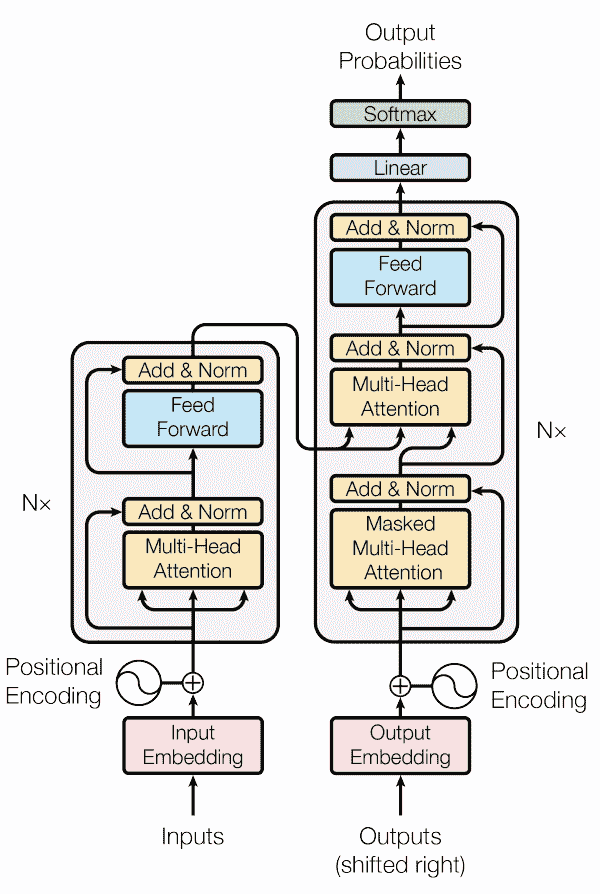
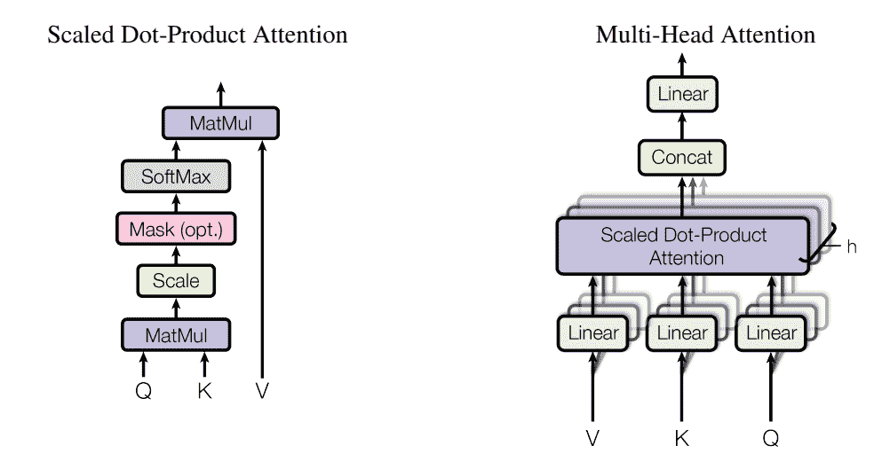
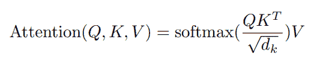
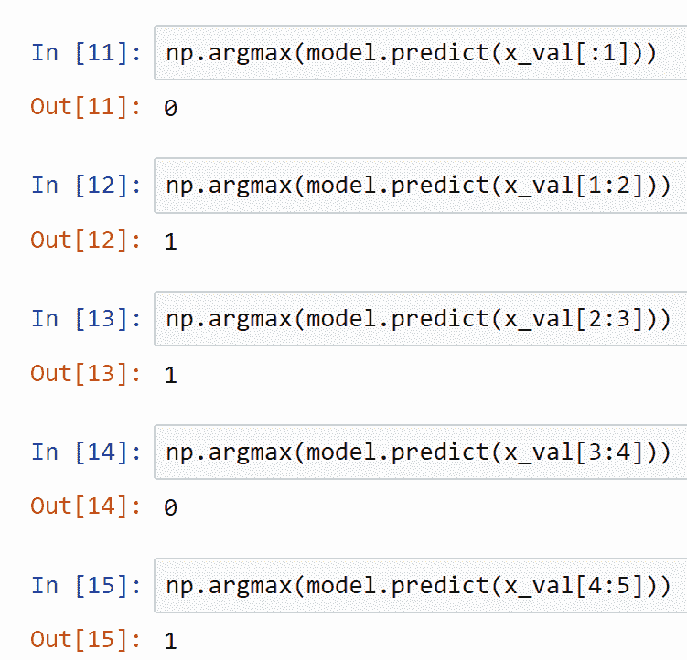

# 文本分类转换器

> 原文：<https://blog.paperspace.com/transformers-text-classification/>

人类表达情感或感觉的一种常见方式是通过目前存在的多种语言形式的语音。从出生开始，我们就开始慢慢适应和学习久而久之语言。对人类来说，学习、交谈和用任何他们感到舒服的语言写作似乎不是一件非常复杂的任务。然而，当我们处理复杂语言翻译的机器或训练它们理解特定句子的语义时，事情可能会变得非常棘手，因为它们无法理解字符或潜台词等细节。

处理这些与机器学习语言相关的任务的大型研究领域是自然语言处理(NLP)。由于机器翻译、文本分类、语音到文本转换等技术的升级，这一研究领域的受欢迎程度在过去几年中有了极大的提高。在本文中，我们将探索变压器的关键深度学习概念及其在处理自然语言处理相关任务中的强大能力。我们主要关注文本分类。

我们将构建一个 transformer 项目，该项目将尝试以评论的形式学习输入句子的含义，并相应地将它们分类为正面或负面评论。我们将研究两种方法来构建这样一个项目。在第一种方法中，我们将从头开始构建整个架构，在第二种方法中，我们将使用 TensorFlow-Hub 开发相同的项目。Paperspace 上的渐变平台是实施以下项目的绝佳选择。查看目录，探索您感兴趣的主题。

## 文本分类介绍:

购买者或顾客在购买产品前经常做的一件直观的事情是查看评论，并分析特定产品的接受程度。对于人类来说，阅读某些评论并获得对所写句子的语义理解是很容易的。由于人类认识到他们已经适应特定语言的知识，他们能够大多理解隐藏的意图、讽刺或言语概念的其他关键方面，以感知句子或评论的真实含义。人类可以用他们的直觉来帮助解释，但是直觉的概念在机器中是不存在的。机器智能发现很难破译特定句子的真实意图和含义，因为在试图理解非二进制形式的东西时固有的复杂性。

这就是机器学习和深度学习算法发挥作用的地方。文本分类可以被描述为将文本类型分类到特定类别的机器学习技术。这些类别取决于他们执行的任务类型。一些例子包括情感分析、主题标记、垃圾邮件检测和意图检测。

自然界中可用的大部分数据都是非结构化的。因此，找到一种可靠地管理这些数据集的方法，同时制定一个理想的结构来分析这些问题变得至关重要。在本文中，我们将探讨变形金刚的概念来解决文本分类的任务。让我们从理解 transformer 架构开始。

* * *

## 了解变压器架构:



[Image Source](https://arxiv.org/pdf/1706.03762.pdf)

发表在题为“ [*注意力是你所需要的全部*](https://arxiv.org/pdf/1706.03762.pdf) 的研究论文中的变形金刚架构是深度学习和自然语言处理领域最有影响力的论文之一。上面的图像表示可能看起来很复杂，因为设计中有很多基本结构。然而，代码的解析要简单得多。通过将每个组件分解成单独的实体，理解变压器设计中涉及的所有核心实体变得非常容易。关于注意力的理论概念的更详细的解释，我推荐从下面的[链接](https://blog.paperspace.com/nlp-machine-translation-with-keras/)查看我以前的一篇文章，这篇文章涉及了使用序列对序列模型的机器翻译过程。

首先，让我们讨论上图中变压器架构的左侧。它由编码器架构和位置编码、输入、输入嵌入以及包含一些神经网络组件的模块组成。我们将该模块称为变压器模块，这是理解变压器工作程序的一个重要方面。

箭头表示将在变压器架构中进行的直接和跳过连接。多头注意力模块将接收三个输入，即值、键和查询。接下来的三个模块非常简单，因为我们执行加法和归一化操作，将它通过前馈网络，并重新调整加法和归一化操作。



[Image Source](https://arxiv.org/pdf/1706.03762.pdf)

我们将稍微详细地讨论多头注意力的概念，因为变压器网络的其他组件非常容易理解。向量、关键字和查询形式的嵌入输入通过线性层传递。假设嵌入具有 64 个维度，并且我们对每一层使用四次分裂。然后，通过的每一层将有四个 16 维数据块嵌入其中。

这些数据通过缩放的点积注意力传递，它利用了一个类似于上图中提到的模型。此外，下面的公式表示模型的清晰性能，其中点注意力等于查询、关键字转置的乘积的 Softmax 除以缩放因子(在这种情况下是嵌入大小的平方根)和向量的乘积。最后，连接结果以检索与嵌入相同的大小，然后通过线性层传递。



最后，变压器网络的右侧由解码器架构组成，它与之前讨论的编码器有一些相似之处。它们有几个转换模块，其中一个具有屏蔽的多头注意力，以确保每个连续的输出只知道前一个输入，而没有任何其他过多的信息。图中的 Nx 表示可以有几个编码器或解码器模块栈来计算特定任务的概念。对于我们的项目，我们将利用 transformer 块的一个更简单的变体来实现文本分类的预期结果。

* * *

## 使用 TensorFlow 和 Keras 从头开始开发变压器模型:

在本节中，我们将构建 transformer 体系结构来解决文本分类问题，并获得理想的结果。两个主要要求是深度学习框架 TensorFlow 和 Keras 的知识。如果你不熟悉这些，我推荐你查看 TensorFlow 的[链接](https://blog.paperspace.com/absolute-guide-to-tensorflow/)和 Keras 的[链接](https://blog.paperspace.com/the-absolute-guide-to-keras/)。

我们将利用 TensorFlow 中可用的 IMDB 数据集来执行文本分类项目，其中我们将需要相应地对正面或负面评论进行分类。该结构所用代码的主要参考来源之一是官方 Keras 文档[网站](https://keras.io/examples/nlp/text_classification_with_transformer/)。Paperspace 上的渐变平台是开始此类项目的一个很好的方式。让我们开始做这个项目吧！

### 导入基本库:

第一步，我们将用 Transformers 导入文本分类项目所需的所有基本库。如前所述，TensorFlow 和 Keras 是这个项目的基本要求，因为它们将是我们深度学习框架的主要选择。我们还将导入构建 transformer 架构所需的所有层。参考上一节来了解这个 transformer 项目所需的所有层。我还导入了 numpy 和警告库，以忽略用户在加载 IMDB 数据集时可能遇到的任何反对警告。

```py
import tensorflow as tf
from tensorflow import keras
from tensorflow.keras.layers import MultiHeadAttention, LayerNormalization, Dropout, Layer
from tensorflow.keras.layers import Embedding, Input, GlobalAveragePooling1D, Dense
from tensorflow.keras.datasets import imdb
from tensorflow.keras.models import Sequential, Model
import numpy as np
import warnings
warnings.filterwarnings("ignore", category=np.VisibleDeprecationWarning)
```

### 创建变压器块和位置嵌入:

我们现在将继续构建 transformer 块，它遵循与本文前一节中讨论的类似的构建。虽然我将利用 TensorFlow/Keras 深度学习框架中可用的多头注意力层，但您可以修改代码并构建自己的自定义多头层，以进一步控制和访问所涉及的众多参数。

在 transformer 模块的第一个功能中，我们将初始化所需的参数，即注意层、批量标准化和丢弃层以及前馈网络。在 transformer 块的调用函数中，我们将相应地定义层，如在 transformer 块的架构概述部分中所讨论的。

```py
class TransformerBlock(Layer):
    def __init__(self, embed_dim, num_heads, ff_dim, rate=0.1):
        super(TransformerBlock, self).__init__()
        self.att = MultiHeadAttention(num_heads=num_heads, key_dim=embed_dim)
        self.ffn = Sequential(
            [Dense(ff_dim, activation="relu"), 
             Dense(embed_dim),]
        )
        self.layernorm1 = LayerNormalization(epsilon=1e-6)
        self.layernorm2 = LayerNormalization(epsilon=1e-6)
        self.dropout1 = Dropout(rate)
        self.dropout2 = Dropout(rate)

    def call(self, inputs, training):
        attn_output = self.att(inputs, inputs)
        attn_output = self.dropout1(attn_output, training=training)
        out1 = self.layernorm1(inputs + attn_output)
        ffn_output = self.ffn(out1)
        ffn_output = self.dropout2(ffn_output, training=training)
        return self.layernorm2(out1 + ffn_output)
```

在下一个代码块中，我们将定义另一个函数，该函数对于管理研究论文中指定的位置嵌入非常有用。我们正在创建两个嵌入层，即标记和标记索引位置。下面的代码块描述了如何创建一个具有两个函数的类。在第一个函数中，我们初始化令牌和位置嵌入，在第二个函数中，我们将调用它们并相应地对各自的嵌入进行编码。完成这一步后，我们可以继续准备数据集并开发用于文本分类的 transformer 模型。

```py
class TokenAndPositionEmbedding(Layer):
    def __init__(self, maxlen, vocab_size, embed_dim):
        super(TokenAndPositionEmbedding, self).__init__()
        self.token_emb = Embedding(input_dim=vocab_size, output_dim=embed_dim)
        self.pos_emb = Embedding(input_dim=maxlen, output_dim=embed_dim)

    def call(self, x):
        maxlen = tf.shape(x)[-1]
        positions = tf.range(start=0, limit=maxlen, delta=1)
        positions = self.pos_emb(positions)
        x = self.token_emb(x)
        return x + positions
```

### 准备数据:

对于这个特定的任务，我们将参考 TensorFlow 和 Keras 提供的 IMDB 数据集。数据集总共包含 50，000 条评论，从中我们将数据分成 25000 个训练序列和 25000 个测试序列。它还包含平均分配的 50%正面评价和 50%负面评价。在预处理步骤中，我们的目标是将这些单词中的每一个都处理成一组整数，这样当我们继续构建 transformers 架构来验证所需结果时，就可以使用它们了。

```py
vocab_size = 20000  # Only consider the top 20k words
maxlen = 200  # Only consider the first 200 words of each movie review

(x_train, y_train), (x_val, y_val) = imdb.load_data(num_words=vocab_size)
print(len(x_train), "Training sequences")
print(len(x_val), "Validation sequences")
```

在下一个代码片段中，我们将查看分配给前五个测试序列的标签。这些标签给我们一种直觉，告诉我们从我们正在看的数据中可以期待什么。在本节的后面部分，我们将对前五个数据元素进行预测，以检查我们的模型在这些数据集上的表现有多准确。

```py
y_val[:5]
```

**输出:**

```py
array([0, 1, 1, 0, 1], dtype=int64) 
```

在查看了前五个元素的标签后，我们将继续填充训练和验证数据的序列，如下面的代码块所示。一旦这个过程完成，我们将开始开发我们的变压器模型。

```py
x_train = tf.keras.preprocessing.sequence.pad_sequences(x_train, maxlen=maxlen)
x_val = tf.keras.preprocessing.sequence.pad_sequences(x_val, maxlen=maxlen)
```

### 开发模型:

开发人员可以通过几种方式来实现文本分类任务的转换器模型。通常的做法是使用单独的编码器和解码器类来分别执行这些操作。在本节中，我们将利用一个相当简单的方法来开发我们的模型，并相应地将其用于文本分类任务。我们将声明每个令牌的嵌入维度、要使用的注意力头的数量以及转换器中前馈网络的层的大小。然后，在我们之前创建的 transformer 块和位置嵌入类的帮助下，我们将开发这个模型。

值得注意的是，我们同时使用了顺序 API 模型和功能 API 模型，这使得我们能够对模型架构进行更有效的控制。我们将给出一个包含句子向量的输入，为此我们创建一个嵌入，并通过一个 transformer 块传递它。最后，我们有一个全局平均池层、一个漏失层和一个密集层来返回句子可能性的概率。我们可以使用 numpy 中的 Argmax 函数来获得正确的结果。下面是开发模型的代码块。

```py
embed_dim = 32  # Embedding size for each token
num_heads = 2  # Number of attention heads
ff_dim = 32  # Hidden layer size in feed forward network inside transformer

inputs = Input(shape=(maxlen,))
embedding_layer = TokenAndPositionEmbedding(maxlen, vocab_size, embed_dim)
x = embedding_layer(inputs)
transformer_block = TransformerBlock(embed_dim, num_heads, ff_dim)
x = transformer_block(x)
x = GlobalAveragePooling1D()(x)
x = Dropout(0.1)(x)
x = Dense(20, activation="relu")(x)
x = Dropout(0.1)(x)
outputs = Dense(2, activation="softmax")(x)

model = Model(inputs=inputs, outputs=outputs)
```

### 编译和拟合模型:

在接下来的步骤中，我们将继续编译我们已经构建的转换器模型。对于编译过程，我们将利用 Adam 优化器、稀疏分类交叉熵损失函数，并且还分配要相应计算的准确性度量。然后，我们将继续拟合模型，并在几个时期内对其进行训练。代码片段显示了这些操作是如何执行的。

```py
model.compile(optimizer="adam", loss="sparse_categorical_crossentropy", metrics=["accuracy"])

history = model.fit(x_train, y_train, 
                    batch_size=64, epochs=2, 
                    validation_data=(x_val, y_val)
                   )
```

一旦执行了训练程序，我们就可以保存在拟合过程中计算的权重。这样做的过程如下所述。

```py
model.save_weights("predict_class.h5")
```

### 评估模型:

虽然我们对模型在拟合过程中的训练情况有一个大概的了解，但评估模型并分析模型在测试数据上的表现仍然是必不可少的。因此，我们将评估测试值及其标签以获得结果。该模型将对测试数据进行某些预测，以预测相应的标签，并与原始标签进行比较。然后，我们将收到与模型精度相对应的最终值。

```py
results = model.evaluate(x_val, y_val, verbose=2)

for name, value in zip(model.metrics_names, results):
    print("%s: %.3f" % (name, value))
```

如果我们还记得，在本节的前一部分，我们已经打印了前五个测试标签的值。我们可以在 predict 函数的帮助下，通过使用我们训练好的模型来进行相应的预测。下面是一个截图，代表了我能够从我训练的模型中预测的结果。



Screenshot by author

从上面的截图中我们可以注意到，该模型能够很好地执行，预测适当的句子序列所代表的各个类别。transformer 模型能够很好地执行文本分类任务，因为我们能够在大多数预测中获得预期的结果。然而，仍有改进的空间，观众可以尝试变压器架构的多种变化，以获得最佳效果。建议您尝试各种变化，以获得最合适的结果。

* * *

## 带 TensorFlow 集线器的变压器模型:

在继续本文的这一部分之前，我建议从零开始构建 transformers，在这一部分，我们将使用 TensorFlow-Hub 执行相同的任务。有了 TensorFlow-Hub，构建我们自己的架构背后的大部分复杂性都被消除了，因为我们可以利用预先训练的模型来实现预期的结果。我们可以将此作为使用定制训练模型改进我们的结果的序言。让我们从文本分类转换器的 TensorFlow-Hub 实现开始。

### 导入基本库:

对于使用 transformers 的文本分类项目的 TensorFlow-Hub 实施，我们的主要库需求是 TensorFlow 深度学习框架以及包含我们预训练模型的 Hub 平台。利用 IMDB 数据集的另一种方法是利用 TensorFlow 数据集模块来加载数据。然后，我们将利用顺序类型建模在导入的模型之上添加几个层。查看下面的代码片段，了解所有必需的导入。

```py
import tensorflow as tf
import tensorflow_hub as hub
import tensorflow_datasets as tfds
from tensorflow.keras.models import Sequential
from tensorflow.keras.layers import Dense
import numpy as np
import os
```

### 准备数据:

在下一步中，我们将通过加载 IMDB reviews，使用之前导入的库来准备数据集。我们可以查看数据集，以了解用于特定任务的数据类型。我们将相应地将数据分为训练集、验证集和测试集，并通过打印其中包含的一个句子来查看提供的关键评论，从而查看数据示例。

```py
train_data, validation_data, test_data = tfds.load(
    name="imdb_reviews", 
    split=('train[:60%]', 'train[60%:]', 'test'),
    as_supervised=True)

train_examples_batch, train_labels_batch = next(iter(train_data.batch(10)))
train_examples_batch[:1]
```

```py
<tf.Tensor: shape=(1,), dtype=string, numpy=
array([b"This was an absolutely terrible movie. Don't be lured in by Christopher Walken or Michael Ironside. Both are great actors, but this must simply be their worst role in history. Even their great acting could not redeem this movie's ridiculous storyline. This movie is an early nineties US propaganda piece. The most pathetic scenes were those when the Columbian rebels were making their cases for revolutions. Maria Conchita Alonso appeared phony, and her pseudo-love affair with Walken was nothing but a pathetic emotional plug in a movie that was devoid of any real meaning. I am disappointed that there are movies like this, ruining actor's like Christopher Walken's good name. I could barely sit through it."],
      dtype=object)> 
```

### 构建模型:

我们将加载嵌入，这是一个预先训练好的模型，存储在下面代码块中指定的 TensorFlow-Hub 位置。然后，我们将添加额外的层，并将参数设置为可训练的。

然后，我们将实例化我们的顺序模型，并在顶部添加我们的自定义层以及几个完全连接的层。最终的密集层应该只有一个节点，因为所做的预测是文本分类，其中我们只有两个结果，即正面或负面评论，其中必须选择其中之一。我们还可以查看模型摘要以了解整体模型构建，它包含预构建的模型以及我们添加的几个密集层。

```py
embedding = "https://tfhub.dev/google/nnlm-en-dim50/2"
hub_layer = hub.KerasLayer(embedding, input_shape=[], 
                           dtype=tf.string, trainable=True)

print(hub_layer(train_examples_batch[:3]))

model = Sequential()
model.add(hub_layer)
model.add(Dense(16, activation='relu'))
model.add(Dense(1))

model.summary()
```

输出:

```py
Model: "sequential"
_________________________________________________________________
Layer (type)                 Output Shape              Param #   
=================================================================
keras_layer (KerasLayer)     (None, 50)                48190600  
_________________________________________________________________
dense (Dense)                (None, 16)                816       
_________________________________________________________________
dense_1 (Dense)              (None, 1)                 17        
=================================================================
Total params: 48,191,433
Trainable params: 48,191,433
Non-trainable params: 0
_________________________________________________________________ 
```

### 编译和训练模型:

一旦我们构建了我们想要的模型，我们就可以对它进行编译和相应的训练。对于编译，我们可以利用二进制交叉熵损失来获得 0 或 1 结果。我们将使用 Adam 优化器，并分配准确性指标。最后，我们将开始训练总共五个时期的模型。观众可以选择改变这些参数中的一些参数，并监视训练过程更多的时期，以获得更好的结果。

```py
model.compile(optimizer='adam',
              loss=tf.keras.losses.BinaryCrossentropy(from_logits=True),
              metrics=['accuracy'])

history = model.fit(train_data.shuffle(10000).batch(512),
                    epochs=5,
                    validation_data=validation_data.batch(512),
                    verbose=1)
```

```py
Epoch 5/5
30/30 [==============================] - 9s 310ms/step - loss: 0.1990 - accuracy: 0.9357 - val_loss: 0.3150 - val_accuracy: 0.8627 
```

运行 Transformer 模型后我得到的结果如上所示。现在，让我们进行评估，以了解 TensorFlow-Hub 预训练模型在五个时期的性能。

### 评估模型:

现在，我们已经使用 TensorFlow-Hub 中可用的预训练权重完成了针对文本分类的 transformer 模型的训练，总共训练了五个时期，我们可以继续评估它在测试数据上的性能，以查看我们的模型表现如何。我们可以通过下面提供的代码片段来实现。

```py
results = model.evaluate(test_data.batch(512), verbose=2)

for name, value in zip(model.metrics_names, results):
    print("%s: %.3f" % (name, value))
```

```py
49/49 - 7s - loss: 0.3277 - accuracy: 0.8464
loss: 0.328
accuracy: 0.846 
```

为了获得更好的结果，我们可以选择运行模型更多的时期，在尝试许多其他修改中，看看我们是否可以创建一个将给出最佳结果的训练运行。从零开始构建的变压器架构将允许用户以更大的灵活性和控制来开发具有各种参数变化的期望模型，以获得最佳结果。实验和测试是找出哪些更改对改进构建的模型最有意义的最佳方式。

* * *

## 结论:


Photo by [Samule Sun](https://unsplash.com/@samule?utm_source=ghost&utm_medium=referral&utm_campaign=api-credit) / [Unsplash](https://unsplash.com/?utm_source=ghost&utm_medium=referral&utm_campaign=api-credit)

自然语言处理是那些至关重要的前沿发展领域之一，另外还有计算机视觉和图像处理，在这些领域有大量的研究正在进行。深度学习和神经网络模型在处理与机器翻译、文本分类、语音到文本转换等众多任务中的自然语言处理相关的问题时，显示出了更高的成功率。随着深度学习领域的不断进步，解决这样一个项目变得更加合理，有效地产生良好的进展，并取得相当不错的结果。

在本文中，我们探索了自然语言处理在文本分类中的众多应用之一。我们理解了文本分类的意义和这种操作的重要性。然后，我们开始对 transformer 神经网络及其在 NLP 领域的巨大生产力有了直观的了解，这是因为它在完成大量项目方面的多功能性。最后，在接下来的部分中，我们构建了 transformer 架构来执行文本分类任务。在第一个项目中，我们讨论了从零开始构建变压器，而在第二个项目中，我们学习了如何利用 TensorFlow-Hub 构建这些变压器来解决相同的任务。

在未来的文章中，我们将探索与自然语言处理相关的多个其他项目以及深度神经网络解决这些问题的能力，包括 BERT 中 Transformers 体系结构的扩展。我们还将从头开始研究其他有趣的神经网络项目和有条件的 GANs。在那之前，祝你在自己的项目中工作愉快！