# 带梯度的权重和偏差

> 原文：<https://blog.paperspace.com/weights-biases-with-gradient/>

# 前言

Weights and Biases 是一个 ML Ops 平台，具有模型跟踪、超参数调整和模型训练步骤中的伪影保存等有用功能。与重量和偏差相结合，为 Gradient 用户提供世界一流的模型实验功能，同时利用 Gradient 易于使用的开发平台和加速硬件。

本教程的目标是突出权重和偏差功能，并展示如何在渐变中使用它们来扩大模型训练。在本教程中，您将学习启动 W&B 模型运行、记录指标、保存工件、调优超参数以及确定性能最佳的模型。然后，您将看到如何保存该模型，以用于使用 Gradient SDK 的工作流和部署。

本教程的内容是训练和记录 ResNet 模型变化的度量，以提高图像分类模型的准确性。我们将使用的数据集是 CIFAR-10 数据集，这是一个用于测试影像分类模型性能的常用数据集。CIFAR-10 数据集将包括属于 10 个类别之一的图像。如果您不熟悉 ResNet 模型或 CIFAR-10 数据集，可以看看这个[演练](https://towardsdatascience.com/understanding-and-visualizing-resnets-442284831be8)。

本教程中使用的代码可以在 GitHub repo [这里](https://github.com/gradient-ai/Gradient-WandB-Tutorial)找到，或者跟随下面链接中的公开示例。

# 基本命令

## 设置

首先，在这里登录或注册您的 Paperspace 帐户[。登录后，创建一个名为 Gradient - W & B 的项目。在您的项目中，单击“笔记本”选项卡，然后单击“创建”按钮，弹出如下所示的*创建笔记本*页面。](https://console.paperspace.com/login)

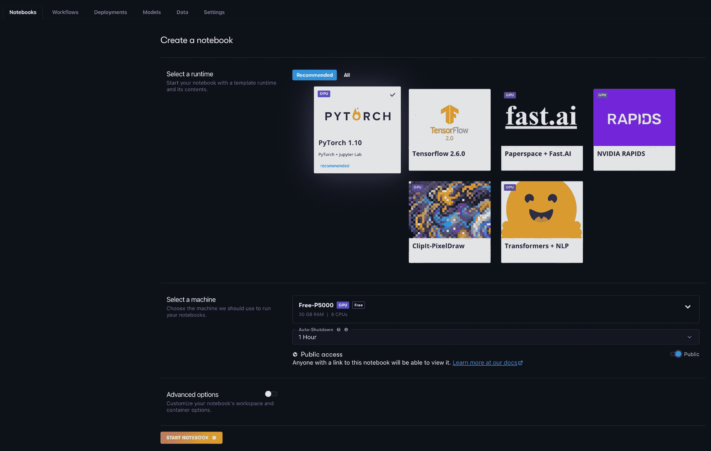

对于这个项目，选择 PyTorch 1.10 运行时，然后在*下选择任意一个 GPU 实例，选择一台机器*。

切换*高级选项*菜单，将工作区 URL 更改为 https://github.com/gradient-ai/Gradient-WandB-Tutorial。这是 GitHub repo，它将包含运行本教程的文件。您的高级选项应该如下图所示。

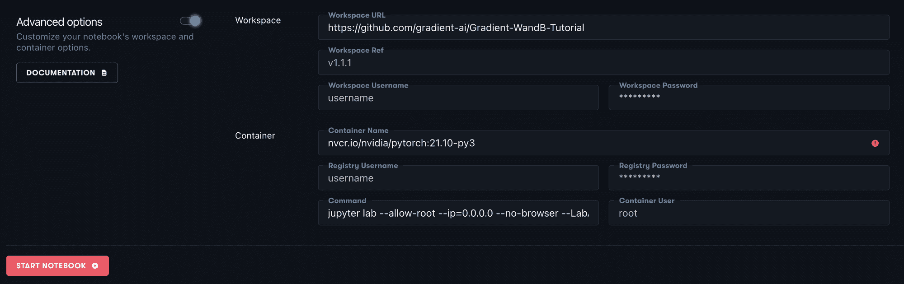

最后，单击启动笔记本按钮，您的笔记本将被创建。等到笔记本运行后再进行下一步。

## 水电安装

下面的代码可以在 Python 笔记本 *train_model_wandb.ipynb* 中找到。

笔记本中的第一步是使用下面的命令将 Weights & Biases Python 库安装到您的环境中。

```py
pip install wandb 
```

要将刚刚安装的包导入到 Python 笔记本中，可以使用:

```py
import wandb 
```

如果通过 Python 笔记本运行 wandb，则必须将 WANDB_NOTEBOOK_NAME 环境变量设置为笔记本的相对路径。下面是如何做到这一点的一个例子。

```py
import os

os.environ["WANDB_NOTEBOOK_NAME"] = "./train_model_wandb.ipynb" 
```

## 注册

安装和设置后，您需要创建一个 Weights & Biases 帐户。你可以在他们位于 https://wandb.ai/site 的网站上这样做。

一旦你创建了一个 W&B 帐户，你将需要获取你的帐户的 API 密钥，以便将你的梯度笔记本与你的重量和偏差帐户相结合。API 密匙可以在 W&B [主页](https://wandb.ai/home)的 Profile → Settings → API 密匙下找到。它应该是一个 40 个字符的字符串。

现在，在您的渐变笔记本中，您可以使用上一步中找到的 W&B API 密钥登录 W&B。

```py
wandb.login(key='your-wandb-api-key') 
```

## 初始化模型运行

登录 W&B 帐户后，您需要在记录任何培训指标前初始化一次跑步。要初始化运行，请使用以下命令。

```py
with wandb.init(project="test-project", config=config, name='ResNet18'):
	# Python code below 
```

关于 wandb.init 函数的更多细节可以在[这里](https://docs.wandb.ai/ref/python/init)找到。

上面的命令将在 Weights and Biases 中创建一个名为“test-project”的项目(如果尚未创建)，并初始化一个运行，该运行将存储您通过 config 对象传递的模型配置。Python 配置对象的示例可能如下所示:

```py
config={
         "epochs": 10,
         "batch_size": 128,
         "lr": 1e-3,
         } 
```

权重和偏差将在表格选项卡下的 W&B 项目仪表板中跟踪该运行和那些配置。下表显示了一个示例，其中型号名称用于标识运行和捕获配置值。

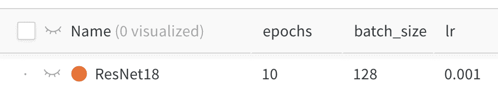

## 原木

在带有 wand.init() 缩进的*中，您将添加 Python 代码，以便在训练期间将特定的模型细节记录到 W & B 中。在流程的不同步骤记录数据将会在您的 W & B 项目工作区中创建图表。根据您在模型运行期间记录的数据类型和频率，W & B 将创建一个特定的图表类型来最好地可视化这些数据。*

在下面的脚本中，目标是在 10 个时期内训练 ResNet18 模型，记录每 50 个批次的训练损失以及每个时期结束时的验证损失和验证准确度。该脚本还记录每个时期的持续时间和平均时期运行时间。

该脚本分为以下三个步骤。第一步是导入所有必要的库和模块。第二步是创建一个用于计算和记录验证指标的验证模型函数。最后一步是运行贯穿模型训练和日志记录过程的训练脚本。

```py
import time
import torch.nn as nn
import torch.optim as optim
import torch

from resnet import resnet18, resnet34
from load_data import load_data 
```

We first import the libraries needed to run the training.

```py
def validate_model(model, valid_dl, loss_func, device):

    # Compute performance of the model on the validation dataset
    model.eval()
    val_loss = 0.
    with torch.inference_mode():
        correct = 0
        for i, (images, labels) in enumerate(valid_dl, 0):
            images, labels = images.to(device), labels.to(device)

            # Forward pass
            outputs = model(images)
            val_loss += loss_func(outputs, labels)*labels.size(0)

            # Compute accuracy and accumulate
            _, predicted = torch.max(outputs.data, 1)
            correct += (predicted == labels).sum().item()

    return val_loss / len(valid_dl.dataset), correct / len(valid_dl.dataset) 
```

Next, we instantiate the validate_model function

```py
model_name = 'ResNet18'

# Initialize W&B run
with wandb.init(project="test-project", config=config, name=model_name):

    # Create Data Loader objects
    trainloader, valloader, testloader = load_data(config)

    # Create ResNet18 Model with 3 channel inputs (colored image) and 10 output classes
    model = resnet18(3, 10)

    # Define loss and optimization functions
    criterion = nn.CrossEntropyLoss()
    optimizer = optim.SGD(model.parameters(), lr=config['lr'], momentum=0.9)

    # Move the model to GPU if accessible 
    device = torch.device("cuda:0" if torch.cuda.is_available() else "cpu")
    model.to(device)

    step = 0
    epoch_durations = []
    for epoch in range(config['epochs']):

        epoch_start_time = time.time()
        batch_checkpoint=50
        running_loss = 0.0
        model.train()

        for i, data in enumerate(trainloader, 0):

						# Move the data to GPU if accessible
            inputs, labels = data[0].to(device), data[1].to(device)

            # Zero the parameter gradients
            optimizer.zero_grad()

            # Forward + Backward + Optimize
            outputs = model(inputs)
            loss = criterion(outputs, labels)
            loss.backward()
            optimizer.step()

            running_loss += loss.item()

            # Log every 50 mini-batches
            if i % batch_checkpoint == batch_checkpoint-1:    # log every 50 mini-batches
                step +=1
                print(f'epoch: {epoch + ((i+1)/len(trainloader)):.2f}')
                wandb.log({"train_loss": running_loss/batch_checkpoint, "epoch": epoch + ((i+1)/len(trainloader))}, step=step)

                print('[%d, %5d] loss: %.3f' %
                    (epoch + 1, i + 1, running_loss / batch_checkpoint))

                running_loss = 0.0

        # Log validation metrics
        val_loss, accuracy = validate_model(model, valloader, criterion, device)
        wandb.log({"val_loss": val_loss, "val_accuracy": accuracy}, step=step)
        print(f"Valid Loss: {val_loss:3f}, accuracy: {accuracy:.2f}")

        # Log epoch duration
        epoch_duration = time.time() - epoch_start_time
        wandb.log({"epoch_runtime (seconds)": epoch_duration}, step=step)

        epoch_durations.append(epoch_duration)

    # Log average epoch duration
    avg_epoch_runtime = sum(epoch_durations) / len(epoch_durations)
    wandb.log({"avg epoch runtime (seconds)": avg_epoch_runtime})

print('Training Finished') 
```

Finally, we create our training loop, and direct it to log the results of the training run in Weights and Biases

上述脚本将在 10 个时期(根据配置确定)内训练模型，并将每 50 个批次和每个时期结束时记录训练指标。在每个时期结束时，也将记录验证损失、验证准确度和时期持续时间。

所有这些细节都将在我们的权重和偏好项目中记录下来。您可以在工作区下的 Weights & bias*测试项目*中找到这一点。下面是一个这样的例子。

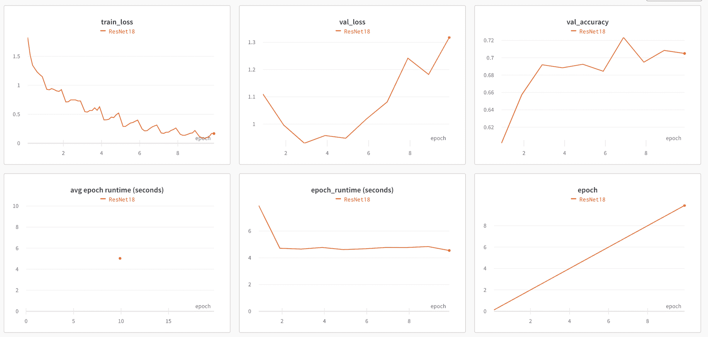

如果您运行相同的脚本，但是使用 ResNet34 模型而不是 ResNet18 模型，将会捕获另一个运行。可以在相同的图表上查看两次运行，以了解它们的比较情况。

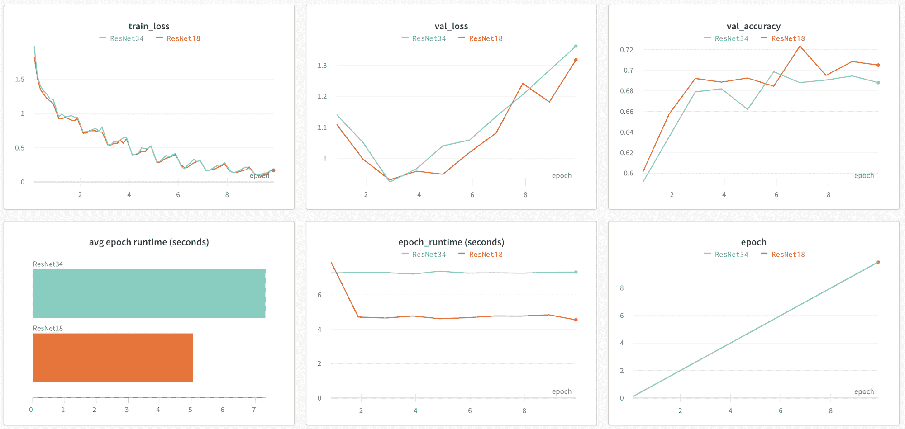

从上面的图表中，我们可以看出每个模型的训练损失非常相似，但是 ResNet18 模型的验证精度更高，平均历元运行时间更低。epoch 运行时是有意义的，因为 ResNet34 模型有更多的层，因此具有更长的训练时间。看起来可能有一些过度拟合，以及列车损失持续下降，但验证损失在第 4 个时期后开始攀升。

## 保存渐变模型

为了充分利用我们的模型培训，我们希望能够做两件额外的事情。首先是将训练好的模型保存为渐变模型工件。其次，我们希望能够将 W&B 模型运行与渐变模型工件联系起来。这是很重要的，这样你就可以把我们上面看到的运行结果链接到一个渐变模型工件，然后你可以在渐变工作流和部署中使用它。有关渐变模型以及如何在工作流和部署中使用它们的信息，请参见渐变[文档](https://docs.paperspace.com/gradient/data/models)。

下面是一个将模型保存为渐变工件的过程，以及我们培训过程中的附加代码，用于在 W&B 运行的注释中记录模型名称。

在保存模型之前，您需要安装渐变 Python SDK。您可以使用下面的命令来完成。

```py
pip install gradient 
```

一旦安装了 Gradient SDK，您将需要创建一个模型客户端来与项目中的模型进行交互。为此，您需要使用渐变 API 键。要生成渐变 API 密钥，请在渐变页面的右上角，选择您的配置文件并单击团队设置。在“团队设置”下，选择“API 密钥”选项卡。要生成 API 密钥，请输入 API 密钥名称(例如 my-api-key ),然后单击添加。这将显示生成一个字母数字字符串，这是您的 API 键。请确保将此密钥保存在安全的地方，因为一旦您离开该页面，您将无法引用它。一旦您生成并复制了您的密钥，您应该能够看到它如下所示。

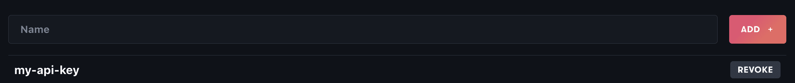

从上面获取 API 密钥，并使用它来创建 ModelsClient，如下所示。

```py
from gradient import ModelsClient

models_client = ModelsClient(api_key='your-gradient-api-key') 
```

在上传功能中，您需要您的项目 ID，它位于项目工作区的左上角。


下面是上传函数，它接收模型配置和模型客户端，并将模型保存为渐变工件，并返回模型名称。

```py
def upload_model(config, model_client, model_dir='models'):

    # Create model directory
    if not os.path.exists(model_dir):
        os.makedirs(model_dir)

    # Save model file
    params = [config['model'], 'epchs', str(config['epochs']), 'bs', str(config['batch_size']), 'lr', str(round(config['lr'], 6))]
    full_model_name = '-'.join(params)
    model_path = os.path.join(model_dir, full_model_name + '.pth')
    torch.save(model.state_dict(), model_path)

    # Upload model as a Gradient artifact
    model_client.upload(path=model_path, name=full_model_name, model_type='Custom', project_id='your-project-id')

    return full_model_name 
```

在培训过程结束时，您可以调用该函数来保存您的模型，并将模型名称记录到您的 W&B 运行中。下面是该功能的一个示例。

```py
# At the end of your training process

# Upload model artifact to Gradient and log model name to W&B
    full_model_name = upload_model(config, model_client)
    wandb.log({"Notes": full_model_name})

print('Training Finished') 
```

现在我们可以在 Models 选项卡下看到保存在渐变项目中的模型。

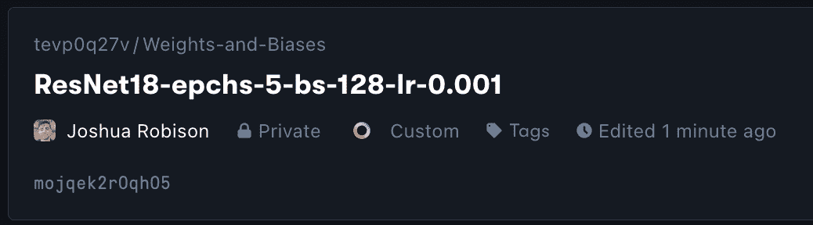

您还可以在表格选项卡中找到的 W&B 运行的注释部分中引用渐变模型工件。

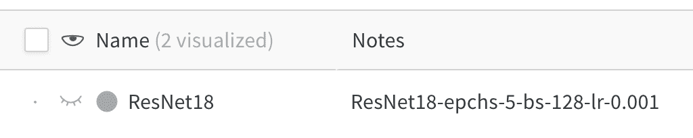

现在，您可以获得运行结果，找到最佳模型，在渐变中找到该模型，并在渐变工作流和部署中使用它！

## 史前古器物

Weights and Biases 的另一个有用的特性是能够创建可以保存到项目中的定制工件。作为一个例子，下面是一个创建 W&B 表的脚本，该表将作为工件存储在*测试项目*中。该表将包括来自测试数据集的图像图片、它们的类标签、模型的预测类以及该预测的详细分数。

首先，您需要初始化一个 W&B 运行并创建一个工件。这可以通过下面的脚本来完成。

```py
with wandb.init(project='test-project'):
    artifact = wandb.Artifact('cifar10_image_predictions', type='predictions') 
```

在 with *wand.init()* 缩进中，创建一个存储上述数据的表。

```py
# Classes of images in CIFAR-10 dataset
classes = ('plane', 'car', 'bird', 'cat',
           'deer', 'dog', 'frog', 'horse', 'ship', 'truck')

# Create Data Loader objects
trainloader, valloader, testloader = load_data(config)

# Create columns for W&B table
columns=['image', 'label', 'prediction']
for digit in range(10):
    columns.append("score_" + classes[digit])

# Create W&B table
pred_table = wandb.Table(columns=columns) 
```

然后，通过训练好的模型运行第一批测试，并获取预测、分数和其他所需的数据。

```py
with torch.no_grad():
    for i, data in enumerate(testloader, 0):

        # Move data to GPU if available 
        inputs, labels = data[0].to(device), data[1].to(device)

        # Calculate model outputs and predictions
        outputs = model(in# Create Data Loader objects
        _, predicted = torch.max(outputs.data, 1)

        # Loop through first batch of images and add data to the table
        for j, image in enumerate(inputs, 0):
            pred_table.add_data(wandb.Image(image), classes[labels[j].item()], classes[predicted[j]], *outputs[j])
        break 
```

最后，将表的数据保存为工件，并将其记录到您的 W&B 项目中

```py
# Log W&B model artifact
artifact.add(pred_table, "cifar10_predictions")
wandb.log_artifact(artifact) 
```

运行上面的脚本之后，您可以通过转到 W&B 项目的工件部分来导航到工件。在 Artifact 部分，点击 Version，Files 选项卡，然后点击保存工件的 JSON 文件。然后，您应该能够查看与下图类似的表格。


## 全胜

Weights & Biases 有一个名为 Sweeps 的超参数调整功能。扫描允许您指定模型配置和训练函数，然后遍历模型参数的不同组合，以确定模型的最佳超参数。我们可以将 Sweeps 与上面显示的 W&B 日志记录功能结合起来，记录所有这些运行的指标，以帮助确定性能最佳的模型。

您需要做的第一件事是创建一个扫描配置对象，它将存储模型的超参数选项。

```py
sweep_config = {
                'method': 'bayes',
                'metric': {'goal': 'minimize', 'name': 'val_loss'},
                'parameters': {
                    'batch_size': {'values': [32, 128]},
                    'epochs': {'value': 5},
                    'lr': {'distribution': 'uniform',
                                      'max': 1e-2,
                                      'min': 1e-4},
                    'model': {'values': ['ResNet18', 'ResNet34']}
                    }
} 
```

从上面的配置中，您可以看到 3 个高级键被定义。第一个是定义扫描如何搜索最佳超参数的方法。在上面的配置中，我们使用贝叶斯搜索。

接下来，是公制键。这将指定扫描试图优化的内容。在这种情况下，目标是最小化验证损失。

最后，配置有参数说明。包含的参数是扫描要搜索的超参数。这些值可以是单个值、一组值或分布。在这种情况下，所有模型运行将在 5 个时期内进行训练，要么是 2 个 ResNet 模型中的一个，具有 32 或 128 的批量大小，并且具有指定分布内的学习率。

更多关于扫掠配置的文档可以在[这里](https://docs.wandb.ai/guides/sweeps/configuration)找到。

一旦指定了扫描配置，您将需要指定用于训练和记录模型的训练函数。下面的函数看起来应该与上面的训练脚本很相似，但是该功能被移到了一个名为 *train* 的函数中。

```py
def train(config = None):

		# Initialize W&B run
    with wandb.init(project='test-project', config=config):
        config = wandb.config

				# Create Data Loader objects
        trainloader, valloader, testloader = load_data(config)

				# Create a ResNet model depending on the configuration parameters
        if config['model']=='ResNet18':
            model = resnet18(3,10)
        else:
            model = resnet34(3,10)

				# Define loss and optimization functions
        criterion = nn.CrossEntropyLoss()
        optimizer = optim.SGD(model.parameters(), lr=config['lr'], momentum=0.9)

				# Move the model to GPU if accessible
        device = torch.device("cuda:0" if torch.cuda.is_available() else "cpu")
        model.to(device)

        step = 0
        batch_checkpoint=50
        epoch_durations = []
        for epoch in range(config['epochs']):

            epoch_start_time = time.time()
            running_loss = 0.0
            model.train()

            for i, data in enumerate(trainloader, 0):

								# Move the data to GPU if accessible
                inputs, labels = data[0].to(device), data[1].to(device)

                # Zero the parameter gradients
                optimizer.zero_grad()

                # Forward + Backward + Optimize
                outputs = model(inputs)
                loss = criterion(outputs, labels)
                loss.backward()
                optimizer.step()

                running_loss += loss.item()

                # log every 50 mini-batches
                if i % batch_checkpoint == batch_checkpoint-1:    # log every 50 mini-batches
                    step +=1
                    print(f'epoch: {epoch + ((i+1)/len(trainloader)):.2f}')
                    wandb.log({"train_loss": running_loss/batch_checkpoint, "epoch": epoch + ((i+1)/len(trainloader))}, step=step)

                    print('[%d, %5d] loss: %.3f' %
                        (epoch + 1, i + 1, running_loss / batch_checkpoint))

                    running_loss = 0.0

            # Log validation metrics
            val_loss, accuracy = validate_model(model, valloader, criterion, device)
            wandb.log({"val_loss": val_loss, "val_accuracy": accuracy}, step=step)
            print(f"Valid Loss: {val_loss:3f}, accuracy: {accuracy:.2f}")

						# Log epoch duration
            epoch_duration = time.time() - epoch_start_time
            wandb.log({"epoch_runtime (seconds)": epoch_duration}, step=step)

            epoch_durations.append(epoch_duration)

				# Log average epoch duration
        avg_epoch_runtime = sum(epoch_durations) / len(epoch_durations)
        wandb.log({"avg epoch runtime (seconds)": avg_epoch_runtime})

    print('Training Finished') 
```

在定义了扫描配置和训练功能之后，您可以通过调用 wandb.agent()来初始化 sweep_id 并开始扫描。

```py
sweep_id = wandb.sweep(sweep_config, project="test-project")

wandb.agent(sweep_id, function=train, count=10) 
```

该扫描将使用扫描配置中指定的超参数值启动 10 次不同的模型运行(使用 count 参数设置),并使用贝叶斯搜索找到超参数的最佳值。这些运行将被保存到扫描下的*测试项目*仪表板中。

一旦扫描完成，您就可以像下面这样比较运行的图表。

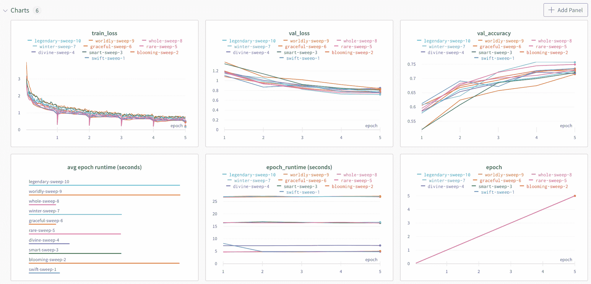

如果放大上图，可以看到 winter-sweep-7 的验证准确性最高。

让我们放大模型运行的细节，看看为这个模型运行设置了什么参数。您可以通过转到“表格”选项卡来完成此操作。

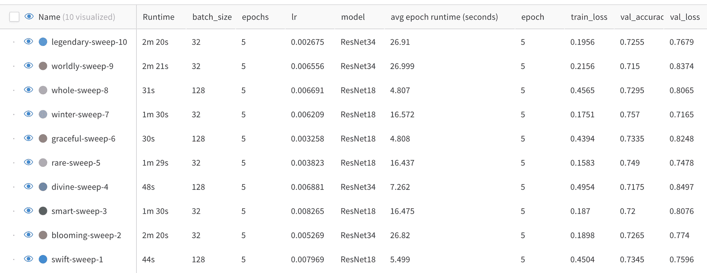

在这个例子中，winter-sweep-7 是用 ResNet18 模型运行的，批量大小为 32，学习率在指定范围的中间。

回到 Sweep 工作区，有一些更有用的图表。下图显示了超参数在验证准确性方面的重要性。学习率是最重要的负相关超参数，意味着学习率越低，验证准确率越高。

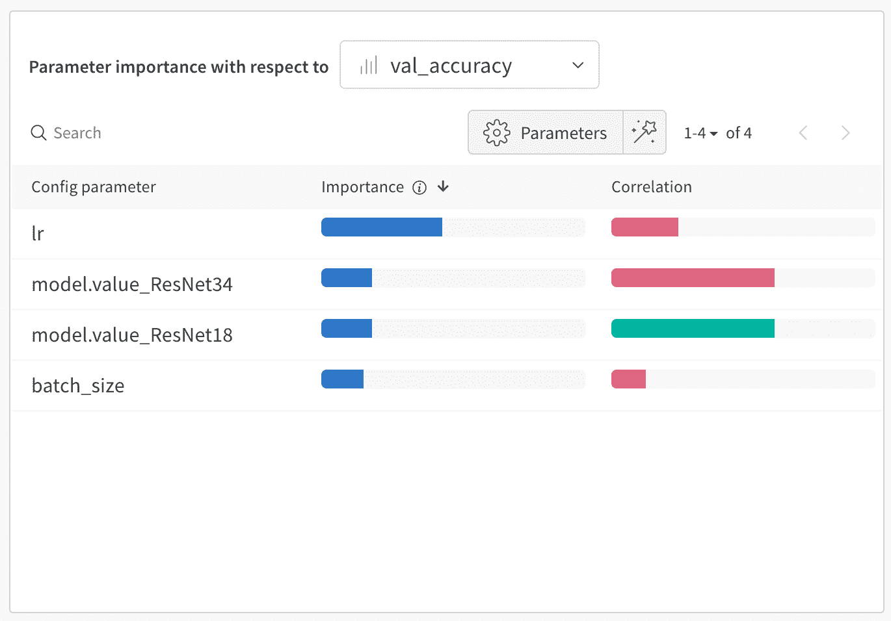

最后要看的图表是后续的模型运行是如何提高性能的。

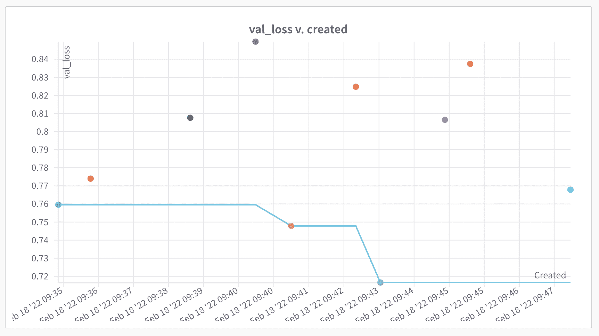

在这个例子中，在模型运行期间，扫描调整了超参数，以改善关于验证损失的模型性能。第 5 次和第 7 次模型运行改善了之前模型运行的验证损失，第 7 次模型运行是 10 次运行中表现最好的。

# 结论

太好了！现在，您应该能够利用权重和偏差为实验跟踪和超参数调整提供的一些功能。然后，您可以将模型工件存储在 Gradient 中，以便能够在 Gradient 工作流和部署中引用它。渐变文档的链接，包括如何存储模型工件、使用工作流以及设置部署可以在[这里](https://docs.paperspace.com/gradient/)找到。

同样，在 Gradient 上运行上述权重和偏差教程所需的笔记本和脚本可以在这里找到[。](https://github.com/gradient-ai/Gradient-WandB-Tutorial)