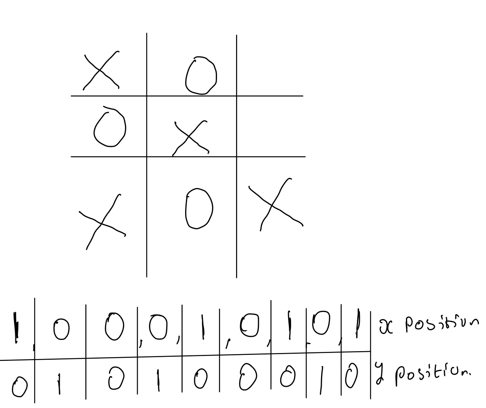
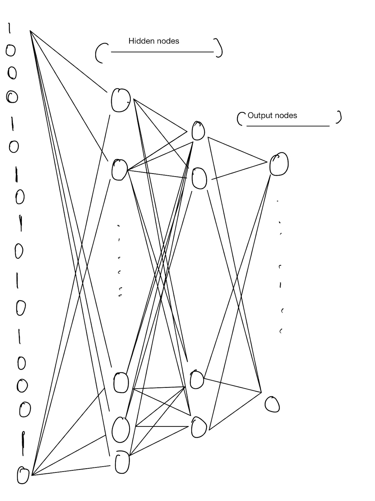

# 用遗传算法开发井字游戏代理:把它们放在一起(第 3 部分)

> 原文：<https://blog.paperspace.com/tic-tac-toe-genetic-algorithm-part-3/>

## 介绍

当我们有正确的数据来训练我们的模型时，建立机器学习模型可能是一个简单的过程。例如，我们需要训练一个模型来预测某个客户是否会流失。如果我们有一个足够好的数据集，我们所要做的就是将这些数据插入到一个模型中，使用一个简单的库，如 Brains.js 或 TensorFlow，并添加一个反向传播算法来优化我们的模型。这样，我们就有了一个模型，它能够获取我们的输入数据，并返回一个优化的预测，预测客户是否会停止购买产品。

但是，如果我们没有好的数据，收集数据超出了我们的能力，怎么办？我们必须定义我们的目标，或者我们认为最佳答案是什么，这就是像遗传算法和强化学习这样的算法发挥作用的地方。在这些范例中，我们能够定义一个目标，我们的模型与它所处的环境相互作用，从它以前的经验中学习，直到它能够解决它定义的任务。

## 系列摘要

到目前为止，我们已经学习了遗传算法的基础知识，它的组成部分，以及它的功能背后的概念，使它能够找到简单和困难问题的最佳解决方案。我们通过比较有多少个字母是正确的来猜测一个短语，并使用那些最接近正确的实例来创建子实例或子代，这些子实例或子代将关于我们的问题空间的信息传递到下一代。你可以在这里查看教程。在[的第二篇文章](https://blog.paperspace.com/tic-tac-toe-genetic-algorithm-part-2/)中，我们能够使用前一篇文章中的知识来优化深度神经网络。我们采用从上一个教程中获得的信息来解决我们的优化问题，添加 2 个传递给它的数字，我们建立了自己的定制神经网络，它能够利用我们的定制来操纵权重和偏差的值，而不是通过像 TensorFlow 这样的已有库来这样做。

### 本文的目标是

在今天的文章中，我们将回顾构建我们的模型将与之交互的环境，对该环境进行更改，并读取其状态。

## 设置我们的播放器

我们需要一个玩家对象能够观察环境并根据环境的状态做出决定。

#### 天真的选手

以下是我们将在本教程中使用的 Player 类的完整代码:

```py
class Player {
 constructor(id, env, play, model,player) {
       this.id = id;
       this.env = env;
       this.play = play; ///x or O
       this.model = model;
       this.position = '';
       this.freeIndexes = 9;
       this.won = false
   }

 getFreeIndexes() {
   const free = [];

   for (let i = 0; i < this.objectGrid.length; i++) {
     const row = this.objectGrid[i];
     for (let j = 0; j < row.length; j++) {
       const column = this.objectGrid[i][j];
       if (column === '-') {
         free.push(`${i}${j}`);
       }
     }
   }

   return free;
 }

 verticalWin() {
   const starts = [0, 1, 2];

   for (let i = 0; i < starts.length; i++) {
     let found = 0;
     for (let j = 0; j < 3; j++) {
       const position = this.objectGrid[j][i];

       if (position === this.play) {
         found++;
       }
     }
     if (found === 3) {
       return true; //// found a row
     }
   }
   return false;
 }

 horizontalWin() {
   const starts = [0, 1, 2];

   for (let i = 0; i < starts.length; i++) {
     let found = 0;
     for (let j = 0; j < 3; j++) {
       const position = this.objectGrid[i][j];

       if (position === this.play) {
         found++;
       }
     }
     if (found === 3) {
       return true; //// found a row
     }
   }
   return false;
 }

 sideWays() {
   let found = 0;

   for (let i = 0; i < this.objectGrid[0].length; i++) {
     const position = this.objectGrid[i][i];

     if (position === this.play) {
       found++;
     }
   }

   if (found === 3) {
     return true; //// found a row
   }

   found = 0;

   for (let i = 0; i < this.objectGrid[0].length; i++) {
     const max = this.objectGrid[0].length;
     const position = this.objectGrid[0 + i][max - i];

     if (position === this.play) {
       found++;
     }
   }

   if (found === 3) {
     return true; //// found a row
   }

   return false; //// fo
 }

 win() {
   //checks if i won
   ///vertical check
   ///horizontal check
   ///sideways
   console.log({ vertival: this.verticalWin() });
   console.log({ horizontalWin: this.horizontalWin() });
   console.log({ sideways: this.sideWays() });

   if (this.verticalWin() ||this.horizontalWin() || this.sideWays()) {
     return true
   }

   return false
 }

 //generate random move
 move() {
   const freeIndexes = this.getFreeIndexes();
   this.freeIndexes = freeIndexes.length;
   if (freeIndexes.length === 0) {
     return this.objectGrid;
   }

   const think = this.think(freeIndexes);

   console.log(think);

   this.objectGrid[think[0]][think[1]] = this.play;

   this.position = `${think[0]}${think[1]}`;
   console.log('changed position to ' + this.position);

  if (this.win()) {
    this.won = true
  }
   return this.objectGrid;
 }

 think(freeIndexes) {
   console.log({ freeIndexes });
   const random = Math.floor(Math.random() * freeIndexes.length);
   const chosen = freeIndexes[random];
   console.log(chosen);
   return [parseInt(chosen[0]), parseInt(chosen[1])];
 }
} 
```

我们天真的玩家能够观察环境，查看空白空间，并随机选择其中一个空间来画 X 或 O。我们天真的玩家没有利用我们的遗传算法模型；它不能学习如何玩游戏，只是选择随机的空白空间来玩。在我们建立了我们的遗传算法之后，我们会给我们的玩家做出更明智选择的能力。

我们的 player 类能够通过调用 win()函数来查看棋盘并宣布他们在一步棋后是否赢了。胜利本质上可以是纵向的、横向的或相邻的。

## 为我们的模型设计

设计解决这个问题的方法可能有点棘手。我们需要弄清楚如何在我们的板上代表 3 个不同的州。这三种状态是:

*   代理占据的空间
*   对手占据的空间
*   空白的空间



如果我们有两个状态，我们可以方便地将其中一个标识为 *1* ，另一个标识为 *0。*但是 three 留给我们两个选择:表示-1 到 1 (-1，0，1)范围内的值，或者长度为 18 的数组。在后一个选项中，索引 0 到 8 可以标记我们的代理选择的位置，索引 9 到 17 可以表示我们的对手占据的位置。让我们尝试本教程的第二个选项。你可以在上面看到这个阵列是如何形成的解释。

我们选择使用 ReLu 作为我们的隐藏层，因为像往常一样，它们的性能优于 sigmoid(这并不奇怪)。

这是我们模型的直观解释。



## 我们遗传算法代码的新版本

对于本文，您需要已经阅读了本系列的第 1 部分和第 2 部分，并确保您理解了基础知识。我们将使用相同的代码模板，并检查代码库中的更改。

### 代码

```py
class GNN {
   constructor(number,) {
       this.population = []
       this.genePool = []
       this.numnber = number
       this.mostFit = { fitness: 0 }
       this.initializePopulation()
       this.elittSize = parseInt(this.numnber * 0.3)
       this.elites = []
       this.soFar = {}
   }

   initializePopulation() {
       for (let i = 0; i < this.numnber; i++) this.population.push({ chromosomes: this.makeIndividual(), fitness: 0 })
   }

   solve() {
       for (var i = 0; i < 200; i++) {
           this.calcFitnessAll()
           this.crossParents()
           this.mutate()
       }
       this.calcFitnessAll()

       var fs = require('fs');
       const sorted = this.population.sort((a, b) => a.fitness - b.fitness).reverse();///sort from smallest to biggest every time i add a new smallest
       sorted.map((elit)=>{
           console.log(elit.fitness)
       })
       const getBeestElite =sorted[0]

       var data = JSON.stringify(getBeestElite);

       fs.writeFile('./config.json', data, function (err) {
           if (err) {
               console.log('There has been an error saving your configuration data.');
               console.log(err.message);
               return;
           }
           console.log('Configuration saved successfully.')
       });

   }

   mutate() {
       this.population.forEach((object) => {
           const shouldIMutateChromosome = Math.random() < 0.3
           if (shouldIMutateChromosome) {

               const layer = object.chromosomes
               for (var j = 0; j < layer.weightsFlat.length; j++) {////going through all the layers
                   const shoulIMutateGene = Math.random() < 0.05
                   if (shoulIMutateGene) {
                       ///mutate the item in the array
                       layer.weightsFlat[j] = (Math.random() * 2) - 1;  //between -1 and 1
                   }
               }
               layer.reconstructWeights()

               ////recontruct the array
           }
       })

   }

   playAGame(player1, player2, Player1StartsFirst) {

       class Env {
           constructor() {
               this.state = [
                   ['-', '-', '-'],
                   ['-', '-', '-'],
                   ['-', '-', '-'],
               ];
               this.id = Math.random()
           }
       }

       ///iniitialiise game environment
       const env = new Env()

       ///iniitialise players and pass in agents
       const playerX = new Player(0, env, 'X', Player1StartsFirst ? player1 : player2);
       const playerO = new Player(1, env, 'O', Player1StartsFirst ? player2 : player1);

       /**
       *
       * @returns @description this function is a reculrsive function that keeps playing until someone wins or a  drraw
       */
       const aSet = () => {
           try {
               playerX.move();

               if (playerX.win()) {
                   return 1////player won
               }

               if (!playerX.getFreeIndexes().length === 0) {
                   ///no free space means its a draw
                   return 1
               }

               playerO.move();

               if (playerO.win()) {
                   return 0////player loss
               }

               if (!playerO.getFreeIndexes().length === 0) {
                   ///no free space means its a draw
                   return 1
               }

               else {
                   return aSet() /////keep playing
               }
           } catch (error) {
               return 0
           }
       }

       return aSet() ///false means it lost the game, we consider win and draw to be acceptable criterias
   }

   calcFitnessAll() {

       this.population.forEach((object) => {

           let totalGames = 0;
           let totalLoss = 0;

           for (let i = 0; i < this.population.length; i++) {
               ///the fitness function is defined as the (totalGamesPlayed -  totalGamesLoss)/totalGamesPlayed
               ///for each player we meet, games are started by this player and the next is started by the next player
               totalGames = totalGames + 2/////we count the  games in advance
               totalLoss = totalLoss + (this.playAGame(object.chromosomes, this.population[i].chromosomes, false) ? 0 : 1)
               totalLoss = totalLoss + (this.playAGame(object.chromosomes, this.population[i].chromosomes, true) ? 0 : 1)
           }
           object.fitness = (totalGames - totalLoss) / totalGames
           let fit = parseInt(object.fitness * 1000)

           for (let i = 0; i < fit; i++) {
               this.genePool.push(object.chromosomes)
           }

           console.log(`total games is ${totalGames} total loss is ${totalLoss} total agents in testrun is ${this.genePool.length}`)

        })

       if (this.genePool.length < this.population.length) {

           ///sort the best
           const newPopulation = this.population.sort((a, b) => a.fitness - b.fitness);///sort from smallest to biggest every time i add a new smallest
           ///get the best
           this.genePool = this.genePool.concat(newPopulation.slice(0, newPopulation.length - this.genePool.length).map((data) => data.chromosomes))
       }

       const getBeestElite = this.elites[this.elites.length - 1]
       ///run test

       console.log(`Best item so far has  fittness as ${getBeestElite.fitness} id ${getBeestElite.chromosomes.id} `)

   }

   amIElite(object) {
       const smallest = this.elites[0]
       if (this.elittSize > this.elites.length) {
           this.elites.push(object)///elites not yet enough
       }
       else if (parseInt(object.fitness) > parseInt(smallest.fitness)) {///check if am bigger than the smallest
           ///bigger than this guy so am going to replace him
           this.elites.shift()
           this.elites.push(object)
       }

       this.elites = this.elites.sort((a, b) => a.fitness - b.fitness);///sort from smallest to biggest every time i add a new smallest
   }

   crossParents() {
       let newPopulation = [];
       const pool = this.genePool

       while (this.population.length - this.elites.length !== newPopulation.length) {
           const parent1 = pool[Math.floor(Math.random() * pool.length)];

           const parent2 = pool[Math.floor(Math.random() * pool.length)];
           const newKid = this.makeIndividual()
           const newKid2 = this.makeIndividual()
           ////select crossSection

           const crossSection = Math.floor(Math.random() * parent1.weightsFlat.length)

           ////kid 1

           const layerParent1 = parent1.weightsFlat.filter(() => true)
           const layerParent2 = parent2.weightsFlat.filter(() => true)

           const layerParent1bias = parent1.weightsFlat.filter(() => true)
           const layerParent2bias = parent2.weightsFlat.filter(() => true)

           const newKidWeights = layerParent1.slice(0, crossSection).concat(layerParent2.slice(crossSection, layerParent2.length))
           const newKid2Weights = layerParent2.slice(0, crossSection).concat(layerParent2.slice(crossSection, layerParent1.length))

           newKid.weightsFlat = newKidWeights
           newKid.reconstructWeights()

           newKid2.weightsFlat = newKid2Weights
           newKid2.reconstructWeights()

           const crossSectionBias = Math.floor(Math.random() * layerParent2bias.length)
           const newKidBias = layerParent1bias.slice(0, crossSectionBias).concat(layerParent2bias.slice(crossSectionBias, layerParent2bias.length))
           const newKidBias2 = layerParent2bias.slice(0, crossSectionBias).concat(layerParent1bias.slice(crossSectionBias, layerParent2bias.length))

           newKid.biasFlat = newKidBias
           newKid.reconstructBias()

           newKid2.biasFlat = newKidBias2
           newKid2.reconstructBias()
           newPopulation.push({ chromosomes: newKid, fitness: 0 })
           newPopulation.push({ chromosomes: newKid2, fitness: 0 })

       }
       const sorted = this.population.sort((a, b) => a.fitness - b.fitness).reverse();///sort from smallest to biggest every time i add a new smallest

       newPopulation = newPopulation.concat(sorted.slice(0,parseInt(this.population.length  * 0.3)))///making sure we pass on elites

       this.population = newPopulation
       this.genePool = []///clear genepool

   }

   makeIndividual() {
       return new NeuralNetwork([18, 15, 15, 9]);
   }
} 
```

现在我们已经看了代码，让我们浏览一下函数，看看我们的代码库中有什么新内容。

#### 适应度函数

我们让代理学习演奏的适应函数非常简单。我们的目标是减少我们失败的次数。如果这是梯度下降，我们的成本函数将是一个方程，它告诉我们我们输了多少次，或者代理人输了多少次游戏。知道了这一点，我们就可以推导出我们的适应度函数，即所玩游戏总数与未输游戏总数之比

```py
(totalGames - totalGamesLost)/totalGames 
```

我们认为平局和胜利现在都是同样令人满意的结果，并试图优化其中任何一个，因为这是最低损失的优化。

为了了解如何适合我们的代理，我们需要实际测试它与对手的对比，没有比我们创建的其他代理更好的对手了。每个代理与它的兄弟竞争，同时扮演第一个和第二个玩家。我们这样做是因为井字游戏玩家可以在游戏中第一个或第二个采取行动。

#### 玩游戏功能

这个功能接受 2 个玩家，并且能够为我们的代理和它的对手模拟整个游戏。我们这样做是为了看看我们的经纪人是否比他的对手更好。我们更热衷于防止我们的代理松散，所以平局是可以的，但我们可以通过给 wins 1 和平局一半(0.5)来优化一场胜利(完成本教程后尝试一下，看看效果如何！).

## 我们如何让代理不在一个被占用的盒子里玩？

我们想给我们的代理的直觉是，它知道它不能玩已经被它或它的对手占据的盒子。为了训练出这种行为，当他们做出这样的举动时，我们就直接宣布游戏失败。

```py
try {
    playerX.move();
} catch (error) {
	return 0
}
```

如果 move 函数能够检查我们选择的游戏是否被占用，它会自动返回一个零(我们基本上也不鼓励这样做)。

## 
完成我们的玩家代理

我们需要对我们的玩家职业做一些改变。目前，它在玩之前不会思考，它只是选择一个可用的随机空间并标记该位置。这是不直观的，也没有传授取胜的策略。我们需要让我们的玩家利用我们传递给它的模型。看看下面的代码。

```py
 //generate random move
   move() {
       const freeIndexes = this.getFreeIndexes();
       this.freeIndexes = freeIndexes.length;

       if (freeIndexes.length === 0) {
           return this.env.state;
       }

       const think = this.think();

       const maxOfArrray = think.max()
       const dic = [[0, 0], [0, 1], [0, 2], [1, 0], [1, 1], [1, 2], [2, 0], [2, 1], [2, 2]]
       const loc = dic[maxOfArrray]
       if (this.env.state[loc[0]][loc[1]] !== '-') {
           ///checks if this agent is trying to play a position thats already played
           throw new Error('Some one home Already')
       }
       this.env.state[loc[0]][loc[1]] = this.play;

       if (this.win()) {
           this.won = true
       }

   }

   think() {
       ///get state of the env
       const state = this.env.state
       ///flatten array
       const flat = state.flat();
       ///encoding data to enter the neuralNet
       const opponnet = this.play === 'X' ? 'O' : 'X'
       const firstHalf = flat.flat().join().replaceAll('-', '0').replaceAll(this.play, 1).replaceAll(opponnet, 0).split(',')
       const secondHalf = flat.flat().join().replaceAll('-', '0').replaceAll(opponnet, 1).replaceAll(this.play, 0).split(',')

       ///now we have two separate arrays showing us what boxes we occupy on the first half and the opponent boxes on the second half
       const together = firstHalf.concat(secondHalf).map((number) => {
           return parseInt(number)///format data to b integer again
       })
       // console.log({ player: this.play, together })

       // console.log(together)
       ///pass data to neurral net
       const prrediction = this.model.predict(together)
       // console.log({
       //     prrediction
       // })
       return prrediction
   } 
```

### 思考功能

我们的思考功能能够通过获取环境状态并创建单个[1 * 18 ]矩阵来利用我们的模型，我们将该矩阵传递给机器学习模型并生成输出(注意:我们的模型使用 softmax 激活功能；我们选择最大值作为玩家标记的位置)。

### 移动功能

运动是从思考功能中得到的。答案被 think 映射到游戏中的一个位置，移动功能可以将玩家的标记放在该位置，从而占据该位置。

## 运行我们的代码

要运行代码，我们需要做的就是调用 solve 函数，您可以按照下面的代码来完成:

```py
const gnn = new GNN(100)
gnn.solve()
```

我们用 100、200 和 1000 之间的不同群体大小测试了代码库，发现群体大小为 100 时代码训练更有效。它优化得非常快，我们能够获得 84%的最高适应度函数。这并不坏，但这意味着我们最好的模型只赢得了 84%的比赛。

下面是一个输出示例:

```py
total games is 400 total loss is 65 total agents in testrun is 96937
total games is 400 total loss is 206 total agents in testrun is 97422
total games is 400 total loss is 66 total agents in testrun is 98257
total games is 400 total loss is 65 total agents in testrun is 99094
total games is 400 total loss is 67 total agents in testrun is 99926
total games is 400 total loss is 100 total agents in testrun is 100676
total games is 400 total loss is 65 total agents in testrun is 101513
total games is 400 total loss is 230 total agents in testrun is 101938
total games is 400 total loss is 66 total agents in testrun is 102773
total games is 400 total loss is 65 total agents in testrun is 103610
total games is 400 total loss is 66 total agents in testrun is 104445
total games is 400 total loss is 66 total agents in testrun is 105280
total games is 400 total loss is 66 total agents in testrun is 106115
total games is 400 total loss is 66 total agents in testrun is 106950
total games is 400 total loss is 78 total agents in testrun is 107755
total games is 400 total loss is 234 total agents in testrun is 108170
total games is 400 total loss is 66 total agents in testrun is 109005
total games is 400 total loss is 276 total agents in testrun is 109315
total games is 400 total loss is 66 total agents in testrun is 110150
total games is 400 total loss is 97 total agents in testrun is 110907
total games is 400 total loss is 81 total agents in testrun is 111704
total games is 400 total loss is 66 total agents in testrun is 112539
total games is 400 total loss is 67 total agents in testrun is 113371
total games is 400 total loss is 66 total agents in testrun is 114206
total games is 400 total loss is 67 total agents in testrun is 115038
total games is 400 total loss is 66 total agents in testrun is 115873
total games is 400 total loss is 66 total agents in testrun is 116708
total games is 400 total loss is 65 total agents in testrun is 117545
total games is 400 total loss is 232 total agents in testrun is 117965
total games is 400 total loss is 400 total agents in testrun is 117965
total games is 400 total loss is 234 total agents in testrun is 118380
total games is 400 total loss is 245 total agents in testrun is 118767
total games is 400 total loss is 66 total agents in testrun is 119602
total games is 400 total loss is 79 total agents in testrun is 120404
total games is 400 total loss is 400 total agents in testrun is 120404
total games is 400 total loss is 66 total agents in testrun is 121239
total games is 400 total loss is 66 total agents in testrun is 122074
total games is 400 total loss is 66 total agents in testrun is 122909
total games is 400 total loss is 66 total agents in testrun is 123744
total games is 400 total loss is 66 total agents in testrun is 124579
total games is 400 total loss is 67 total agents in testrun is 125411
total games is 400 total loss is 67 total agents in testrun is 126243
total games is 400 total loss is 66 total agents in testrun is 127078
total games is 400 total loss is 67 total agents in testrun is 127910
total games is 400 total loss is 66 total agents in testrun is 128745
total games is 400 total loss is 400 total agents in testrun is 128745
total games is 400 total loss is 67 total agents in testrun is 129577
total games is 400 total loss is 67 total agents in testrun is 130409
total games is 400 total loss is 65 total agents in testrun is 131246
total games is 400 total loss is 67 total agents in testrun is 132078
total games is 400 total loss is 234 total agents in testrun is 132493
total games is 400 total loss is 72 total agents in testrun is 133313
total games is 400 total loss is 66 total agents in testrun is 134148
total games is 400 total loss is 67 total agents in testrun is 134980
total games is 400 total loss is 66 total agents in testrun is 135815
total games is 400 total loss is 91 total agents in testrun is 136587
The best item so far has  fitness of 0.8425  id 0.6559877604817235 
```

## 结论

按照这个教程系列，我们能够创建一个机器学习模型，用遗传算法优化其权重值。我们首先通过创造一个与已知短语相匹配的短语来建立对遗传算法如何工作的理解。通过这样做，我们能够理解遗传算法如何找到问题的答案。在第 2 部分中，我们能够更新神经网络的权重。对于本教程，我们最终应用了我们所有的知识，并使用神经网络和遗传算法建立了一个模型来解决我们的井字游戏问题。我们可以将这种方法应用于不同的问题空间，从象棋到破壁机，再到预测股票价格。