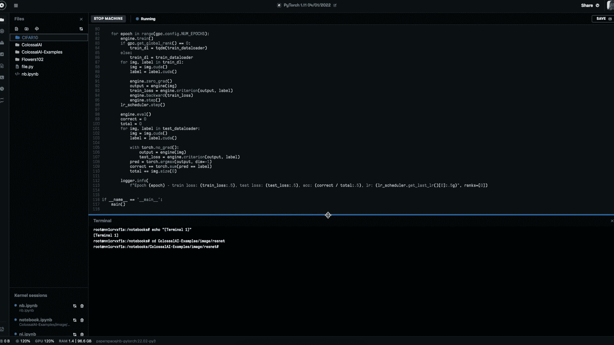

# 使用庞氏人工智能在多 GPU 梯度笔记本上训练深度学习分类器

> 原文：<https://blog.paperspace.com/colossal-ai-resnet-multigpu/>

委婉地说，确定运行分布式多 gpu 深度学习脚本的理想框架可能是一个挑战。有各种各样的选择，如 [DeepSpeed](https://github.com/microsoft/DeepSpeed) 、 [Horovod](https://github.com/horovod/horovod) 或 [Apache Singha](https://singa.apache.org/) ，每一种都有不同的优缺点。许多这些库仍在积极开发和改进中，因此任何超越竞争对手的更好选择都为时过早。因此，选择使用哪个库既需要时间和实践，也需要预知适应库通常不同的方法带来的总体复杂性。

虽然开始可能很难，但是并行和分布式计算库是一个非常强大的工具，其通用性不可低估。处理大数据在计算上非常昂贵，只有在使用深度学习技术时，成本才会增加。特别是，使用大型神经网络架构(如图像生成 GANs)的 DL 任务，在不耗尽内存的情况下，不可能在单个 GPU 上运行。因此，在一台机器上执行许多基线 DL 任务越来越低效。

我们建议您查看的分布式深度学习库之一是来自 HPC-AI Tech 的[庞氏人工智能](https://github.com/hpcaitech/ColossalAI)，该库于 2021 年 10 月由卞等人在“庞氏人工智能:用于大规模并行训练的统一深度学习系统”中首次介绍。庞氏人工智能是“一个统一的并行训练系统，旨在无缝集成不同范式的并行化技术，包括数据并行、流水线并行、多张量并行和序列并行” [(1)](https://arxiv.org/abs/2110.14883) 。庞氏人工智能在简化和促进 PyTorch 深度学习代码适应分布式系统方面做得非常好。

在这篇博文中，我们将看看一个来自[巨型人工智能示例报告](https://github.com/hpcaitech/ColossalAI-examples)的样本演示的改编，该报告在梯度笔记本上运行的 [CIFAR10 数据集](https://www.cs.toronto.edu/~kriz/cifar.html)上训练 ResNet34 分类器。所提供的用于执行分布式培训的方法是高度可修改的，因此读者可以期望能够学习本教程并将相同的思想应用到许多不同的应用程序中。

## 入门指南

转到您选择的团队和项目空间中的[渐变笔记本创建页面](https://console.paperspace.com/)。在那里，从推荐的选项中选择 PyTorch 运行时，然后向下滚动到机器选择部分。如果您有增长计划，您可以访问几个多 gpu 笔记本，包括 A4000 x 2、A6000 x 2、A6000 x 4 和 A100 GPU x 2 实例的选项。如果你不是，不要担心！庞大的人工智能在单 GPU 和多 GPU 环境中都可以工作。因此，免费用户甚至可以在免费的 GPU 笔记本上学习本教程。

我们用的是 A6000 x 2。完成机器选择后，在切换“高级选项”设置之前，滚动到页面底部。将工作区的 URL 设置为相关的 GitHub repo:[https://github.com/hpcaitech/ColossalAI-examples](https://github.com/hpcaitech/ColossalAI-examples)

粘贴完网址后，您可以使用左下角的按钮启动笔记本。这将使你进入跑步笔记本。

一旦进入运行中的笔记本，先去终端(或者在笔记本中使用 line magic)新建一个目录`CIFAR10`。我们以后会需要它。接下来，导航到文件夹`image/resnet`，点击文件 [`run_resnet_cifar10_with_engine.py`](https://github.com/hpcaitech/ColossalAI-Examples/blob/main/image/resnet/run_resnet_cifar10_with_engine.py) 。当我们调用训练循环时，我们将进行一些编辑以使其运行顺畅(稍后)。

## 庞大的人工智能方法论

```py
from pathlib import Path
from colossalai.logging import get_dist_logger
import colossalai
import torch
import os
from colossalai.core import global_context as gpc
from colossalai.utils import get_dataloader
from torchvision import transforms
from colossalai.nn.lr_scheduler import CosineAnnealingLR
from torchvision.datasets import CIFAR10
from torchvision.models import resnet34
from tqdm import tqdm 
```

The imports for the ResNet CIFAR10 training script

现在我们已经在脚本中了，我们可以开始浏览代码了。让我们先走一遍用于训练的每个步骤，然后评估文件中描述的数据集。上面是运行这个脚本的相关导入。在运行下面的代码之前，一定要安装庞 AI 和 Torchvision。您可以通过在终端中运行以下命令来轻松安装它们:`pip install torchvision colossalai`

```py
def main():
    colossalai.launch_from_torch(config='./config.py')

    logger = get_dist_logger()

    # build resnet
    model = resnet34(num_classes=10)
```

从第 15 行开始，我们有了`main()`函数，它运行整个训练和评估代码。我们的函数首先通过从 PyTorch 和`config.py`文件设置的环境变量中读取 rank 和 world size 来为`torch.distributed.launch`创建一个`colossalai.launch`的包装器。该配置通过将`BATCH_SIZE`指定为 128、`NUM_EPOCHS`指定为 2 进行训练，并使用[自动混合训练](https://pytorch.org/blog/accelerating-training-on-nvidia-gpus-with-pytorch-automatic-mixed-precision/)。

然后，在构建 ResNet34 模型之前，我们使用提供的`get_dist_logger()`实例化一个记录器。由于我们将在 CIFAR10 上训练数据集，因此类的数量设置为 10。

```py
 # build dataloaders
    train_dataset = CIFAR10(
        root=Path('~/../CIFAR10/'),
        download=False,
        transform=transforms.Compose(
            [
                transforms.RandomCrop(size=32, padding=4),
                transforms.RandomHorizontalFlip(),
                transforms.ToTensor(),
                transforms.Normalize(mean=[0.4914, 0.4822, 0.4465], std=[
                    0.2023, 0.1994, 0.2010]),
            ]
        )
    )

    test_dataset = CIFAR10(
        root=Path('~/../CIFAR10/'),
        train=False,
        transform=transforms.Compose(
            [
                transforms.ToTensor(),
                transforms.Normalize(mean=[0.4914, 0.4822, 0.4465], std=[
                    0.2023, 0.1994, 0.2010]),
            ]
        )
    )

    train_dataloader = get_dataloader(dataset=train_dataset,
                                      shuffle=True,
                                      batch_size=gpc.config.BATCH_SIZE,
                                      num_workers=1,
                                      pin_memory=True,
                                      )

    test_dataloader = get_dataloader(dataset=test_dataset,
                                     add_sampler=False,
                                     batch_size=gpc.config.BATCH_SIZE,
                                     num_workers=1,
                                     pin_memory=True,
                                     )
```

接下来，我们加载 CIFAR10 的测试和培训部分的数据集。我们选择将 CIFAR10 的`root`变量(以及它的目录位置)更改为`/notebooks`目录，以便于交互。

在每种情况下，我们将图像转换为张量，并对它们进行归一化。提供的平均值和标准偏差是之前根据 [PyTorch CIFAR repo](https://github.com/kuangliu/pytorch-cifar) 计算的。完成后，`get_dataloader`函数实例化我们将在训练循环中使用的数据加载器。图像被混洗，从前面使用的配置文件读取的批量大小是 128。

```py
# build criterion
    criterion = torch.nn.CrossEntropyLoss()

    # optimizer
    optimizer = torch.optim.SGD(model.parameters(), lr=0.1, momentum=0.9, weight_decay=5e-4)

    # lr_scheduler
    lr_scheduler = CosineAnnealingLR(optimizer, total_steps=gpc.config.NUM_EPOCHS)

    engine, train_dataloader, test_dataloader, _ = colossalai.initialize(model,optimizer,criterion,train_dataloader,test_dataloader,)
```

我们将使用`CrossEntropyLoss()`损失函数作为我们的标准，随机梯度下降作为我们的优化器，初始学习率相对较低，为 0.1。然后，我们将实例化我们的 LR_scheduler，以便在余弦调度上适当地衰减每个时期的学习速率。

最后，我们通过使用 ResNet34 模型、随机梯度下降优化器、交叉熵损失标准以及我们的训练和测试数据加载器来初始化庞大的 AI，从而完成设置。这将输出代表我们的模型和相关数据加载器的引擎，所有这些都在庞大的 AI 分发代码中运行。

```py
for epoch in range(gpc.config.NUM_EPOCHS):
    engine.train()
    if gpc.get_global_rank() == 0:
        train_dl = tqdm(train_dataloader)
    else:
        train_dl = train_dataloader
    for img, label in train_dl:
        img = img.cuda()
        label = label.cuda()

        engine.zero_grad()
        output = engine(img)
        train_loss = engine.criterion(output, label)
        engine.backward(train_loss)
        engine.step()
    lr_scheduler.step()

    engine.eval()
    correct = 0
    total = 0
    for img, label in test_dataloader:
        img = img.cuda()
        label = label.cuda()

        with torch.no_grad():
            output = engine(img)
            test_loss = engine.criterion(output, label)
        pred = torch.argmax(output, dim=-1)
        correct += torch.sum(pred == label)
        total += img.size(0)
```

对于训练循环，我们在配置中设置的时期数决定了训练循环将经历的时期数。对于每个时期，我们必须将引擎设置为训练模式。然后，我们将循环设置为显示引擎在该节点上的训练进度，我们可以在它处理混合训练数据时跟踪该进度。对于训练数据加载器中的每个图像和标签，每个图像和标签首先被转换为 CUDA，以便我们可以利用 GPU。

下一步，我们将使用`torch.no_grad()`作为我们的上下文管理器，因为禁用梯度计算对推断是有用的，从这我们可以为图像生成引擎的预测输出。这和它的原始标签一起，可以用来计算`test_loss`。从那里，我们可以使用`argmax`得到我们的预测。最后，我们向正确的张量添加一个反映预测是否等同于标签的布尔值和一个用于准确度计算的总数。

```py
logger.info(
            f"Epoch {epoch} - train loss: {train_loss:.5}, test loss: {test_loss:.5}, acc: {correct / total:.5}, lr: {lr_scheduler.get_last_lr()[0]:.5g}", ranks=[0]) 
```

为了方便起见，在测试数据加载器中的图像结束时，记录器会将时期、列车损失、测试损失、精确度、学习率和等级输出到日志中。然后重复配置文件中设置的历元数，默认值为 2。

现在，我们已经通读了代码，我们可以运行训练循环，并完全理解在引擎盖下发生了什么！

## 运行训练循环



A two epoch training cycle leaves us with a mediocre train loss of 1.8014, test loss of 1.4863, acc of 0.3589, and final learning rate of 0

要运行`run_resnet_cifar10_with_engine.py`脚本，我们需要做的就是在终端中导航到`notebooks/ColossalAI-Examples/image/resnet`并输入以下代码:

`python -m torch.distributed.launch --nproc_per_node <number of GPU nodes you want to use> --master_addr localhost --master_port 29500  run_resnet_cifar10_with_engine.py`

这将在输出准确度和相关损失度量之前，运行您的训练循环预定次数。我选择为两个运行我的，因为我有两个可用的，但这也将在单个 GPU 实例上运行得很好。

## 总结想法

由于我们在这里使用的代码非常通用，因此很容易看到相同的方法如何应用于计算机视觉中的许多不同的深度学习应用，如[视觉转换器](https://github.com/hpcaitech/ColossalAI-Examples/tree/main/image/vision_transformer)，甚至是不同领域的，如用巨型人工智能和 [GPT](https://github.com/hpcaitech/ColossalAI-Examples/tree/main/language/gpt) 进行 NLP。遵循这些脚本中演示的相同工作流，很容易看到庞氏人工智能对 PyTorch 分布式包的原生拥抱如何真正简化了各种深度学习任务适应他们的分布式计算管理系统。

一定要尝试一些其他的例子，或者用渐变笔记本将你自己的个人作品改编成巨大的人工智能！