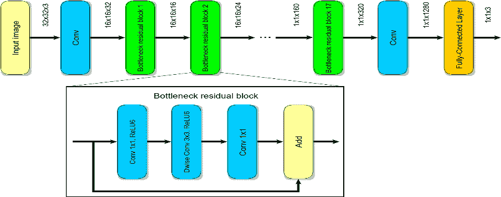

# 迁移学习完全实践指南(下)

> 原文：<https://blog.paperspace.com/transfer-learning-explained-2/>

在本系列的第一部分中，我们介绍了与迁移学习相关的大部分基本理论和概念。我们学习了卷积神经网络，它们如何用于迁移学习，并了解了如何微调这些模型。最后，我们还分析了几种常用的迁移学习模型。如果你对这个概念不熟悉，我强烈建议你在继续本文之前，先看看这个[完整直观的迁移学习指南](https://blog.paperspace.com/complete-guide-to-transfer-learning)。

在这篇文章中，我们将集中在迁移学习的实践方面。我们将用三种不同的模型来涵盖整个人脸识别项目，即 Resnet50、InceptionV3 和 MobileNetV2。随意试验和尝试新的东西，以达到更好的效果。请参考目录，了解文章这一特定部分将涉及的内容。由于这个项目是从头开始构建的，因此最好遵循所有的内容。

您可以从 Gradient Community 笔记本的免费 GPU 上运行本文的完整代码。

### 目录

*   介绍
*   一般提示和建议
*   数据收集
*   数据准备(预处理数据)
*   数据扩充
    1。导入所需的库
    2。设置参数
    3。训练和验证数据的扩充
*   模型和架构构建
    1。分配不同的迁移学习架构
    2。建立各自的模型
*   回调、模型编译和培训
    1。定义各自的回调函数
    2。模型的编译
    3。拟合迁移学习模型
*   模型预测
    1。导入库
    2。做出预测
*   结论

## 介绍

虽然迁移学习模型在现实世界的应用中有大量的用例，但我们将特别关注人脸识别项目。在这个项目的帮助下，我们可以了解几种不同类型的模型将如何工作。

本文的主要目标是让您开始在一个相当流行的示例项目中使用迁移学习模型。由于各种参数、约束、数据和较少的训练次数，每个模型的整体性能可能不如预期的那样完美。然而，这只是一个示例，展示了如何在这些迁移学习模型的帮助下构建类似的架构并执行大量项目，从而在您自己的特定任务中获得更好的结果。

## 一般提示和建议

对于本文的其余部分，需要记住的一些值得注意的提示和建议是，我们总是可以通过进一步的实验来提高模型的质量。这里使用的不同模型，即 ResNet50、InceptionV3 和 MobileNetV2，是为了理解迁移学习项目背后的逻辑而实现的。然而，任何模型都可能比另一个模型更适合一个任务，并且这些模型可能不是每个场景的最佳选择。随着我们探索和构建我们的项目，我们将进一步理解这一点。

多年来，已经开发了几种高级的人脸识别模型。非常鼓励使用各种改进模型的方法，如微调、操纵不同的参数等。也被利用了。即使更改一个很小的参数，或者添加批处理规范化或删除之类的内容，都会对模型性能产生重大影响。

## 数据收集

任何机器学习或深度学习项目的第一步都涉及到将数据整理有序。这项特定人脸识别任务的数据收集主要有两种方式:使用在线数据集，或创建自己的自定义数据集，其中包含一些您自己、您的家人或朋友或您选择的任何其他人的图像。如果使用在线数据集，我建议查看下面的[链接](https://analyticsindiamag.com/10-face-datasets-to-start-facial-recognition-projects/)。所提供的网站有一个链接，链接到用于人脸识别的训练模型的十个最流行的数据集。

在下一个代码块中，我们将利用流行的名为 OpenCV 的计算机视觉库，通过网络摄像头捕捉特定的帧。我们将使用变量目录，该目录将创建一个文件夹，用于存储您选择的所需名称的特定外观。您可以随意编辑这个变量。count 变量用于表示将在目录中捕获的图像总数。标记将从零开始，直到您选择捕捉的图像总数。确保帧读取准确，并从多个不同角度拍摄所需面部的照片，以使其符合训练程序。空格键用于捕捉特定帧，按下 q 按钮退出 cv2 图形窗口。

```py
import cv2
import os

capture = cv2.VideoCapture(0)

directory = "Your_Name/"
path = os.listdir(directory)

count = 0

while True:
    ret, frame = capture.read()
    cv2.imshow('Frame', frame)

    """
    Reference: http://www.asciitable.com/
    We will refer to the ascii table for the particular waitkeys.
    1\. Click a picture when we press space button on the keyboard.
    2\. Quit the program when q is pressed

    """

    key = cv2.waitKey(1)

    if key%256 == 32:
        img_path = directory + str(count) + ".jpeg"
        cv2.imwrite(img_path, frame)
        count += 1

    elif key%256 == 113: 
        break

capture.release()
cv2.destroyAllWindows()
```

通过替换变量目录中的“Your_Name ”,您可以随意为数据集创建多少个新文件夹。出于训练的目的，我选择只创建一对。每个图像将相应地以. jpeg 格式存储，并在各自的目录中增加计数。一旦您对收集和创建的数据量感到满意，我们就可以进入下一步，这将涉及数据集的准备。我们将对数据进行预处理，使其适合迁移学习模型。

## 数据集准备(预处理数据)

在收集数据之后，任何数据科学项目最重要的步骤之一是使数据集更适合特定的任务。此操作在数据集准备阶段执行，也称为数据预处理。对于这个特定的面部识别模型，您使用之前的代码片段或自己的代码片段准备的自定义数据集上的图像大小和形状可能会有所不同。然而，我们将努力确保通过迁移学习模型生成的所有图像大小相同。下面是调整相应目录中所有图像大小的代码片段。

```py
import cv2
import os

directory = "Your_Name/"
path = os.listdir(directory)

for i in path:
    img_path = directory + i
    image = cv2.imread(img_path)
    image = cv2.resize(image, (224, 224))
    cv2.imwrite(img_path, image)
```

上面的代码片段不言自明。我们遍历目录变量中提到的特定目录，并确保特定路径中的每个图像都相应地调整了大小。我已经为图像的高度和宽度选择了 224 像素的大小值。这些值通常更适合迁移学习模型。ImageNet 的原始大小也是 224，224，有三个通道。这三个通道代表红色、绿色和蓝色(RGB 模式)。确保您收集的图像也是这种格式。否则，您将需要添加额外的代码行来将图像从一种格式(比如灰度)转换为另一种格式(在这种情况下是 RGB)。

> 请务必将必要的图像转移到各自的目录中，并将它们分成训练和测试图像。确保将图像分成训练和测试图像的比例分别满足至少 75:25 或 80:20 的比例。我选择手动执行以下步骤，因为我只处理了几个较小的数据集。然而，如果您有一个更大的数据集，那么最好用 scikit-learn 库编写一些代码来相应地拆分数据。

请注意，这些用于数据收集和数据集准备的 Python 片段最好在单独的 Python 文件或 Jupyter 笔记本中运行。不要将它们与即将到来的部分混淆，该部分将作为一个单元运行。从下一节开始直到预测阶段，我们将在一个 Jupyter 笔记本中继续整个模型构建过程。大多数文件都附在这篇文章后面。请随意使用和试验它们。

## 数据扩充

在本文的这一部分，我们将利用数据扩充来提高数据集的质量。数据扩充是一种技术，它使机器学习从业者能够增加用于训练模型的数据集的潜力和整体多样性。整个过程不需要额外收集新的数据元素。利用*裁剪、填充和水平翻转*的方法来获得放大的数据集。在接下来的几个部分中，我们将导入人脸识别项目任务所需的所有基本库和模块。让我们开始实施这些流程。

### 导入所需的库

在接下来的步骤中，我们将导入人脸识别项目所需的所有库。我强烈建议查看我之前的两篇关于 TensorFlow 和 Keras 介绍的文章，以了解关于这些特定主题的更详细的方法。你可以从这个[链接](https://blog.paperspace.com/absolute-guide-to-tensorflow/)查看 TensorFlow 教程，从这个特定的[链接](https://blog.paperspace.com/the-absolute-guide-to-keras/)查看 Keras 文章。在继续下一步之前，请确保您对这些主题有足够的了解，以避免任何困惑。

```py
import keras
import tensorflow as tf
from tensorflow.keras.applications import ResNet50
from tensorflow.keras.applications import InceptionV3
from tensorflow.keras.applications import MobileNetV2
from tensorflow.keras.preprocessing.image import ImageDataGenerator
from tensorflow.keras.layers import Input, Conv2D, MaxPool2D, Dropout, BatchNormalization, Dense, Flatten
from tensorflow.keras.models import Sequential, Model
from tensorflow.keras.regularizers import l2
from tensorflow.keras.optimizers import Adam
import os
```

一旦我们加载了所有需要的库，我们将相应地设置所有不同的参数。让我们继续下一节，了解一些基本参数并设置它们。

### **设置参数**

在下面的代码块中，我们将设置几个变量，以便它们可以在整个项目中用于多种目的，包括增加数据、为各个模型定义图像形状，以及将文件夹和目录分配到特定的目录路径。让我们研究一下执行这个操作的简单代码块。

```py
num_classes = 2

Img_Height = 224
Img_width = 224

batch_size = 128

train_dir = "Images/Train"
test_dir = "Images/Test"
```

我在我的自定义数据中使用了两个目录，这表明我主要有两个类。`num_classes`变量将在稍后创建模型架构时使用，以调用 SoftMax 函数对不同类别进行多类分类。图像高度和宽度是定义的重要参数。最后，提供了到培训和测试目录的路径。您也可以随意包含您认为必要的任何其他参数。

### **增加训练和验证数据**

本文这一部分的最后一步是在图像数据生成器的帮助下实现数据的扩充。我们将在这些变换技术的帮助下创建原始图像的副本，这些技术包括缩放、旋转、缩放等方法。但是，这些操作仅在培训数据生成器上执行。验证数据生成器将只包含重定比例因子。让我们探索下面提供的代码块，以便更清楚地了解和理解。

```py
train_datagen = ImageDataGenerator(rescale=1./255,
                                   rotation_range=30,
                                   shear_range=0.3,
                                   zoom_range=0.3,
                                   width_shift_range=0.4,
                                   height_shift_range=0.4,
                                   horizontal_flip=True,
                                   fill_mode='nearest')

validation_datagen = ImageDataGenerator(rescale=1./255)

train_generator = train_datagen.flow_from_directory(train_dir,
                                                    target_size=(Img_Height, Img_width),
                                                    batch_size=batch_size,
                                                    class_mode='categorical',
                                                    shuffle=True)

validation_generator = validation_datagen.flow_from_directory(test_dir,
                                                              target_size=(Img_Height, Img_width),
                                                              batch_size=batch_size,
                                                              class_mode='categorical',
                                                              shuffle=True)
```

我们将在以后的文章中更详细地讨论这个特定的数据扩充主题。为了这个项目的目的，让我们继续建立模型架构来解决人脸识别的任务。

## 模型和架构构造

现在，我们已经完成了人脸识别项目的所有初始步骤，包括导入所需的库、分配各种参数和增加数据元素，我们将继续前进，并定义我们将用于实施该项目的三个主要体系结构。因为我们已经调用了 Keras 库中的应用程序模块，所以我们可以直接利用我们在导入阶段调用的三个模型。让我们看看下一个代码块，以便更好地理解这一步。

### **分配不同的迁移学习架构**

```py
ResNet_MODEL = ResNet50(input_shape=(Img_width, Img_Height, 3), include_top=False, weights='imagenet')
Inception_MODEL = InceptionV3(input_shape=(Img_width, Img_Height, 3), include_top=False, weights='imagenet')
MobileNet_MODEL = MobileNetV2(input_shape=(Img_width, Img_Height, 3), include_top=False, weights='imagenet')

for layers in ResNet_MODEL.layers: 
    layers.trainable=False

for layers in Inception_MODEL.layers: 
    layers.trainable=False

for layers in MobileNet_MODEL.layers: 
    layers.trainable=False

for layers in MobileNet_MODEL.layers:
    print(layers.trainable)
```

在上面的代码块中，我们将变量初始化为它们各自的模型，即 Resnet50、InceptionV3 和 MobileNetV2 模型。我们将用(224，224，3)的图像形状为以下三个模型中的每一个分配初始参数，并分配与 ImageNet 等价的预训练权重。然而，我们将排除顶层，以便我们可以微调我们的模型，并添加我们自己的自定义层来提高这些体系结构的整体性能。我们遍历三个模型的所有层，将可训练层声明为假。在这个特定的实现中，我将只使用一个展平层、几个密集层和一个最终的密集层，并使用 SoftMax 函数进行多类预测。

### **建立各自的模型**

在接下来的几个代码块中，我们的主要目标是关注功能性 API 模型构建结构，其中我们将利用各自的迁移学习模型。特定的输入变量将具有您选择实施的任何迁移学习模型的相应输出。如前所述，我只使用了一个简单的架构来微调和训练这些模型。但是，我建议查看这个项目的人实现自己的方法，并使用各种层和激活功能以及节点数量进行实验，以便为下面的任务获得最佳结果。

#### 1\. Resnet50


[Image Source](https://www.geeksforgeeks.org/residual-networks-resnet-deep-learning/#:~:text=ResNet%2C%20which%20was%20proposed%20in,the%20concept%20called%20Residual%20Network.)

上图是 Resnet 架构的代表。在下面的代码块中，我们将实现适合 Resnet 体系结构输出的示例代码。

```py
# Input layer
input_layer = ResNet_MODEL.output

# Flatten
flatten = Flatten(data_format='channels_last',name='Flatten')(input_layer)

# Fully Connected layer-1
FC1 = Dense(units=30, activation='relu', 
            kernel_initializer=keras.initializers.glorot_normal(seed=32), 
            name='FC1')(flatten)

# Fully Connected layer-2
FC2 = Dense(units=30, activation='relu', 
            kernel_initializer=keras.initializers.glorot_normal(seed=33),
            name='FC2')(FC1)

# Output layer
Out = Dense(units=num_classes, activation='softmax', 
            kernel_initializer=keras.initializers.glorot_normal(seed=3), 
            name='Output')(FC2)

model1 = Model(inputs=ResNet_MODEL.input,outputs=Out)
```

##### 模型摘要和图

要分析 ResNet 模型的模型图和摘要，请使用下面提供的代码。借助这些模型，你可以相应地分析各种因素。我选择不在这篇文章中包括摘要和情节，因为它们太大了。请随时检查他们自己与代码提供给以下每一个。下面附上的 Jupyter 笔记本也将包含这些概念的完整代码。

```py
model1.summary()
```

模型图的代码如下:

```py
from tensorflow import keras
from keras.utils.vis_utils import plot_model

keras.utils.plot_model(model1, to_file='model1.png', show_layer_names=True)
```

#### 2.InceptionV3


[Image Source](https://paperswithcode.com/method/inception-v3#)

上图是 InceptionV3 架构的代表。在下面的代码块中，我们将实现适合 InceptionV3 架构输出的示例代码。

```py
# Input layer
input_layer = Inception_MODEL.output

# Flatten
flatten = Flatten(data_format='channels_last',name='Flatten')(input_layer)

# Fully Connected layer-1
FC1 = Dense(units=30, activation='relu', 
            kernel_initializer=keras.initializers.glorot_normal(seed=32), 
            name='FC1')(flatten)

# Fully Connected layer-2
FC2 = Dense(units=30, activation='relu', 
            kernel_initializer=keras.initializers.glorot_normal(seed=33),
            name='FC2')(FC1)

# Output layer
Out = Dense(units=num_classes, activation='softmax', 
            kernel_initializer=keras.initializers.glorot_normal(seed=3), 
            name='Output')(FC2)

model2 = Model(inputs=Inception_MODEL.input,outputs=Out)
```

##### 模型摘要和图

要分析 InceptionV3 模型的模型图和摘要，请使用下面提供的代码。借助这些模型，你可以相应地分析各种因素。我选择不在这篇文章中包括摘要和情节，因为它们太大了。请随时检查他们自己与代码提供给以下每一个。下面附上的 Jupyter 笔记本也将包含这些概念的完整代码。

```py
model2.summary()
```

模型图的代码如下:

```py
from tensorflow import keras
from keras.utils.vis_utils import plot_model

keras.utils.plot_model(model2, to_file='model2.png', show_layer_names=True)
```

#### 3.MobileNetV2



[Image Source](https://www.researchgate.net/publication/342856036/figure/fig3/AS:911929400885251@1594432320422/The-architecture-of-the-MobileNetv2-network.ppm)

上图是 MobileNetV2 架构的代表。在下面的代码块中，我们将实现适合 MobileNetV2 架构输出的示例代码。

```py
# Input layer
input_layer = MobileNet_MODEL.output

# Flatten
flatten = Flatten(data_format='channels_last',name='Flatten')(input_layer)

# Fully Connected layer-1
FC1 = Dense(units=30, activation='relu', 
            kernel_initializer=keras.initializers.glorot_normal(seed=32), 
            name='FC1')(flatten)

# Fully Connected layer-2
FC2 = Dense(units=30, activation='relu', 
            kernel_initializer=keras.initializers.glorot_normal(seed=33),
            name='FC2')(FC1)

# Output layer
Out = Dense(units=num_classes, activation='softmax', 
            kernel_initializer=keras.initializers.glorot_normal(seed=3), 
            name='Output')(FC2)

model3 = Model(inputs=MobileNet_MODEL.input,outputs=Out)
```

##### 模型摘要和图

要分析 MobileNetV2 模型的模型图和摘要，请使用下面提供的代码。借助这些模型，你可以相应地分析各种因素。我选择不在这篇文章中包括摘要和情节，因为它们太大了。请随时检查他们自己与代码提供给以下每一个。下面附上的 Jupyter 笔记本也将包含这些概念的完整代码。

```py
model3.summary()
```

模型图的代码如下:

```py
from tensorflow import keras
from keras.utils.vis_utils import plot_model

keras.utils.plot_model(model3, to_file='model3.png', show_layer_names=True)
```

## 回调、模型编译和培训

现在，我们已经完成了所有三个模型的构建，我们将使用这些模型来试验我们的人脸识别项目，让我们继续定义一些可能对我们的任务有用的基本回调。在我的代码片段中，我包含了模型检查点，以分别保存我们计划构建的三个模型的最佳权重。我使用了简化的学习率和张量板可视化回调，但对它们进行了评论，因为我只在三个模型上训练我的模型。因此，我不需要它们的用法。随意运行更多的纪元并相应地进行实验。请参考下面的代码块来定义回调。

### **定义各自的回调**

```py
from tensorflow.keras.callbacks import ModelCheckpoint
from tensorflow.keras.callbacks import ReduceLROnPlateau
from tensorflow.keras.callbacks import TensorBoard

checkpoint1 = ModelCheckpoint("face_rec1.h5", monitor='val_loss', save_best_only=True, mode='auto')

checkpoint2 = ModelCheckpoint("face_rec2.h5", monitor='val_loss', save_best_only=True, mode='auto')

checkpoint3 = ModelCheckpoint("face_rec3.h5", monitor='val_loss', save_best_only=True, mode='auto')

# reduce = ReduceLROnPlateau(monitor='val_loss', factor=0.2, patience=3, min_lr=0.00001, verbose = 1)

# logdir='logsface3'
# tensorboard_Visualization = TensorBoard(log_dir=logdir)
```

### **模型的编译**

现在我们已经定义了所有必要的回调，我们可以继续 Jupyter 笔记本中的最后两个步骤，即编译和拟合迁移学习模型。编译阶段是在执行拟合模型的操作时，用相应的损失函数、最佳优化器和所需的度量来配置三个模型。

```py
model1.compile(loss='categorical_crossentropy',
              optimizer=Adam(lr=0.00001),
              metrics=['accuracy'])

model2.compile(loss='categorical_crossentropy',
              optimizer=Adam(lr=0.00001),
              metrics=['accuracy'])

model3.compile(loss='categorical_crossentropy',
              optimizer=Adam(lr=0.00001),
              metrics=['accuracy'])
```

### **拟合迁移学习模型**

到目前为止，我们已经完成了所有必要的步骤，可以继续对我们各自的模型进行培训。我为每个模型实现了总共三个时期的训练过程。让我们观察输出，并对这些结果的出现得出结论。

#### 1\. ResNet 50

```py
epochs = 3

model1.fit(train_generator, 
           validation_data = validation_generator,
           epochs = epochs,
           callbacks = [checkpoint1])
#            callbacks = [checkpoint, reduce, tensorboard_Visualization])
```

##### 结果

```py
Train for 13 steps, validate for 4 steps
Epoch 1/3
13/13 [==============================] - 23s 2s/step - loss: 0.6726 - accuracy: 0.6498 - val_loss: 0.7583 - val_accuracy: 0.5000
Epoch 2/3
13/13 [==============================] - 16s 1s/step - loss: 0.3736 - accuracy: 0.8396 - val_loss: 0.7940 - val_accuracy: 0.5000
Epoch 3/3
13/13 [==============================] - 16s 1s/step - loss: 0.1984 - accuracy: 0.9332 - val_loss: 0.8568 - val_accuracy: 0.5000 
```

#### 2.InceptionV3

```py
model2.fit(train_generator, 
           validation_data = validation_generator,
           epochs = epochs,
           callbacks = [checkpoint2])
```

##### 结果

```py
Train for 13 steps, validate for 4 steps
Epoch 1/3
13/13 [==============================] - 21s 2s/step - loss: 0.6885 - accuracy: 0.5618 - val_loss: 0.8024 - val_accuracy: 0.4979
Epoch 2/3
13/13 [==============================] - 15s 1s/step - loss: 0.5837 - accuracy: 0.7122 - val_loss: 0.4575 - val_accuracy: 0.8090
Epoch 3/3
13/13 [==============================] - 15s 1s/step - loss: 0.4522 - accuracy: 0.8140 - val_loss: 0.3634 - val_accuracy: 0.8991 
```

#### 3.MobileNetV2

```py
model3.fit(train_generator, 
           validation_data = validation_generator,
           epochs = epochs,
           callbacks = [checkpoint3])
```

##### 结果

```py
Train for 13 steps, validate for 4 steps
Epoch 1/3
13/13 [==============================] - 17s 1s/step - loss: 0.7006 - accuracy: 0.5680 - val_loss: 0.7448 - val_accuracy: 0.5107
Epoch 2/3
13/13 [==============================] - 15s 1s/step - loss: 0.5536 - accuracy: 0.7347 - val_loss: 0.5324 - val_accuracy: 0.6803
Epoch 3/3
13/13 [==============================] - 14s 1s/step - loss: 0.4218 - accuracy: 0.8283 - val_loss: 0.4073 - val_accuracy: 0.7361 
```

从这三个迁移学习模型的拟合和计算中，我们可以观察到一些结果。对于 ResNet 模型，虽然训练精度和损失似乎在不断提高，但验证精度保持不变。出现这种情况的几个原因可能是由于大型架构在较小的数据集上过度拟合。另一个原因是由于微调架构缺乏深度。建议您尝试许多参数和不同的微调架构，以获得更好的结果。与 ResNet50 体系结构相比，inceptionV3 体系结构和 MobileNetV2 获得的结果似乎更好。因此，我们将利用来自 InceptionV3 模型的保存的检查点来执行实时预测任务。其他的改进可以通过运行更多的纪元，改变各种参数和其他特性，添加更多的层，并进行试验。

> 由此我们可以得出的最后结论是，我们已经构建了三种不同类型的性能模型，并且用一种更实用的方法更详细地理解了它们的工作功能。

## 模型预测法

一旦我们构建了模型，并将最佳权重保存为. h5 格式的模型，我们就可以利用这个资源了。我们可以加载通过检查点过程保存的模型，并在网络摄像头的帮助下使用它们进行实时人脸识别。预测阶段是机器学习和深度学习的更重要的方面之一，因为你知道你构建的模型在实时场景中如何工作。让我们导入实时人脸识别项目预测所需的所有库。

### **导入库**

```py
from tensorflow.keras.models import load_model
from tensorflow.keras.preprocessing import image
from tensorflow.keras.preprocessing.image import ImageDataGenerator
from tensorflow.keras.preprocessing.image import img_to_array
import numpy as np 
import cv2
import time
import os
```

### **实时预测**

对于实时预测，我们将加载保存的最佳检查点模型和用于检测面部结构的 Haar cascode _ frontal face _ default . XML 文件。然后我们将使用网络摄像头进行实时人脸识别。如果预测的准确度很高，我们将显示最合适的结果。大多数代码结构都很容易理解，尤其是注释行。如果您认为有必要，可以随意试验各种建模技术或构建更方便的预测设置。

```py
model = load_model("face_rec2.h5")
face_classifier = cv2.CascadeClassifier('haarcascade_frontalface_default.xml')

Capture = cv2.VideoCapture(0)

while True:
    # Capture frame from the Video Recordings.
    ret, frame = Capture.read()

    # Detect the faces using the classifier.
    faces = face_classifier.detectMultiScale(frame,1.3,5)

    if faces is ():
        face = None

    # Create a for loop to draw a face around the detected face.
    for (x,y,w,h) in faces:
        # Syntax: cv2.rectangle(image, start_point, end_point, color, thickness)
        cv2.rectangle(frame, (x,y), (x+w,y+h), (0,255,255), 2)
        face = frame[y:y+h, x:x+w]

    # Check if the face embeddings is of type numpy array.
    if type(face) is np.ndarray:
        # Resize to (224, 224) and convert in to array to make it compatible with our model.
        face = cv2.resize(face,(224,224), interpolation=cv2.INTER_AREA)
        face = img_to_array(face)
        face = np.expand_dims(face, axis=0)

        # Make the Prediction.
        pred1 = model.predict(face)

        prediction = "Unknown"
        pred = np.argmax(pred1)

        # Check if the prediction matches a pre-exsisting model.
        if pred > 0.9:
            prediction = "Your_Name"

        elif pred < 0.9:
            prediction = "Other"

        else:
            prediction = "Unknown"

        label_position = (x, y)
        cv2.putText(frame, prediction, label_position, cv2.FONT_HERSHEY_SIMPLEX,2,(0,255,0),3)

    else:
        cv2.putText(frame, 'Access Denied', (20,60), cv2.FONT_HERSHEY_SIMPLEX,2,(0,255,0),3)

    cv2.imshow('Face Recognition', frame)

    if cv2.waitKey(1) & 0xFF == ord('q'):
            Capture.release()
            cv2.destroyAllWindows()

Capture.release()
cv2.destroyAllWindows()
```

您可以进一步探索项目，并在云环境、raspberry pi 或任何其他类似的嵌入式系统或您的本地桌面上部署该模型。随意探索和构建类似的架构来构建和开发各种任务。

## 结论


Photo by [Aleksander Vlad](https://unsplash.com/@aleksowlade?utm_source=ghost&utm_medium=referral&utm_campaign=api-credit) / [Unsplash](https://unsplash.com/?utm_source=ghost&utm_medium=referral&utm_campaign=api-credit)

在本文中，我们首先介绍了将要讨论的许多内容，然后给出了一些通用的技巧和建议。在初步阶段之后，我们直接投入到项目的开发中，收集和预处理我们的数据以构建不同类型的模型。然后，我们实现了数据的扩充，以创建更多类型的独特模式。在这一步之后，我们继续构建我们各自的模型架构。最后，在编译和拟合模型之前，我们为所需的流程定义了所有必要的回调。然后，我们编写了另一个代码片段，用于实时识别各个人脸，以测试我们收到的结果。

我强烈建议试验和实施其他许多迁移学习的方法，或者构建你自己的定制网络建模系统，以测试结果如何。现在，我们已经涵盖了理解迁移学习网络工作的理论和实践方面，您可以疯狂地计算许多其他类型的任务。借助本文提供的资源，您可以轻松地实现用于执行人脸识别任务的所有三个模型。在未来的文章中，我们将涵盖与深度学习和计算机视觉相关的其他主题，如图像字幕、UNET、CANET 等等。直到那时，然后探索和享受乐趣！