# 部署深度学习模型第 2 部分:在 Paperspace 上托管

> 原文：<https://blog.paperspace.com/deploying-deep-learning-models-part-ii-hosting-on-paperspace/>

[2021 年 12 月 2 日更新:本文包含关于梯度实验的信息。实验现已被弃用，渐变工作流已经取代了它的功能。[请参见工作流程文档了解更多信息](https://docs.paperspace.com/gradient/explore-train-deploy/workflows)。]

Gradient 是一个 Paperspace 产品，它简化了深度学习模型的开发、培训和部署。该平台为机器学习开发者提供了基础设施自动化和软件开发工具包。

要在渐变上创建一个基于 flask 的应用程序，你需要做的就是:

1.  在“requirements.txt”中指定我们的应用程序的依赖项
2.  初始化您的本地 Git 存储库，并将其发布在 Github 上
3.  创建应用程序并将其部署到渐变

本教程假设您已经完成了第 1 部分中概述的步骤。如果你对我们为什么有某些文件或目录感到困惑，请参考[部署深度学习模型第 1 部分:准备模型](https://blog.paperspace.com/deploying-deep-learning-models-flask-web-python/)以供参考。

## 与 Git 集成

首先，创建如下所示的“requirements.txt”文件，指定设置环境所需的库。

```py
Keras==2.2.0
tensorflow==1.8.0
flask
numpy
pandas
Pillow==5.2.0
gunicorn==18.0.0 
```

您需要使用 git 将您的代码推入 Github 存储库。如果你还没有，在 [Github](https://github.com/) 和 [install git](https://git-scm.com/book/en/v2/Getting-Started-Installing-Git) 上注册。

要将代码推送到 Github，创建一个名为“ml-in-prod”的新存储库，并从您的终端执行以下命令。请注意，您应该将第一行中的“用户名”和“回购名称”更改为您自己的名称。

```py
git remote add origin https://github.com/user_name/repo_name.git
git add .
git commit -m "first-commit"
git push origin master 
```

检查你的 Github repo 它应该有我们创建的所有文件。

从“ml-in-prod”存储库中，执行以下命令:

去吧，init

这将初始化 git。

## 部署到渐变

现在，要在 Gradient 上部署您的模型，请执行以下操作。

在 app.py 文件的`app.run()`函数中，主机参数将被设置为 0.0.0.0。换句话说，`app.run()`应该看起来像`app.run(debug=True, port=8000, host='0.0.0.0')`。这表明 flask 服务器“监听”所有接口。

[注册渐变](https://www.paperspace.com/account/signup)(或者配合[渐变社区笔记本](https://gradient.paperspace.com/free-gpu)使用免费的云 GPU)。

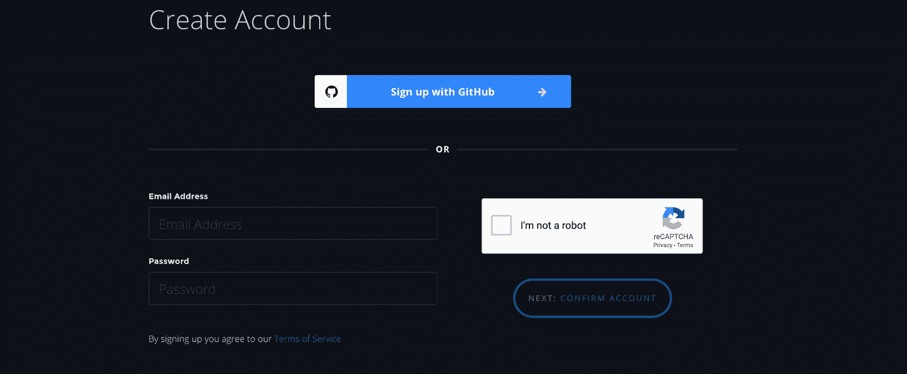

如果您还没有付费帐户，请随意使用免费的渐变社区笔记本，开始使用免费的云 GPU。登录后，导航至左侧导航栏“渐变”下的“项目”。

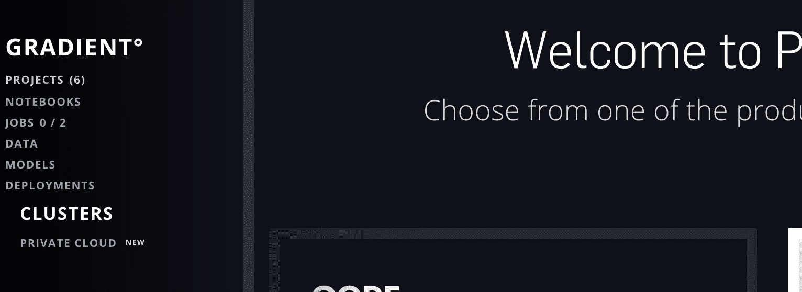

点击“创建项目”

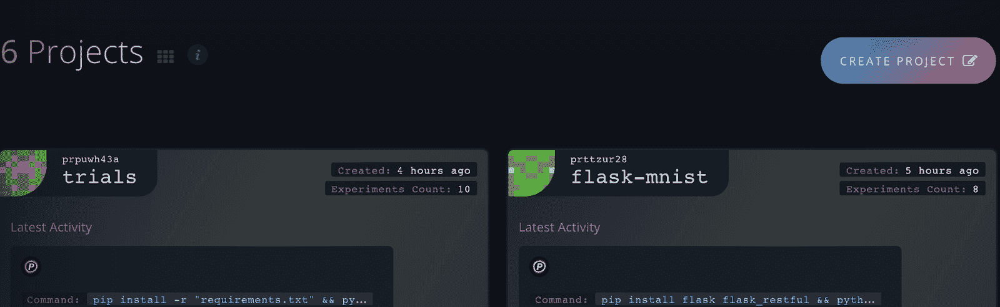

我们将在这里创建一个“独立项目”。有关不同类型项目(独立项目或梯度项目)的更多信息，请参考梯度项目文档。

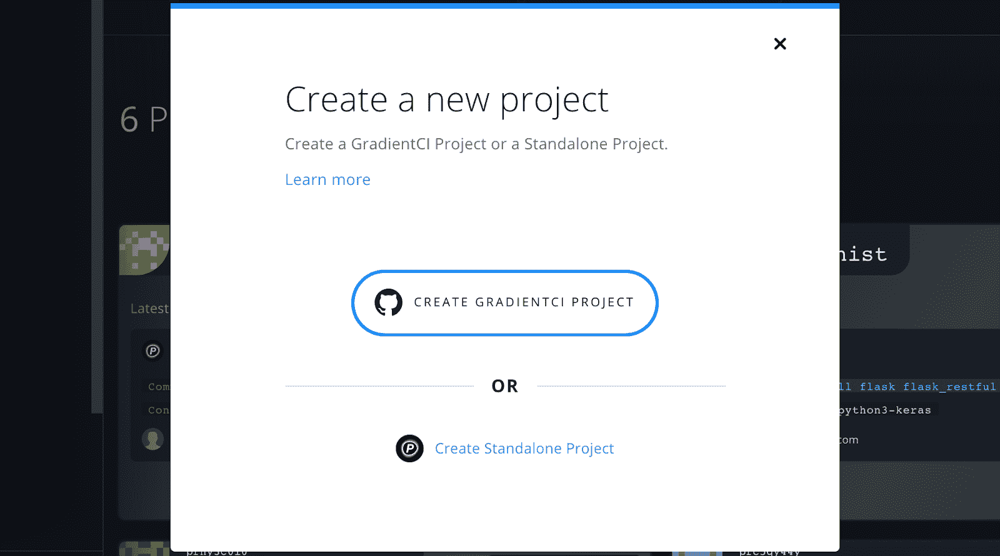

输入项目名称“ml-in-prod”，然后点击“创建项目”

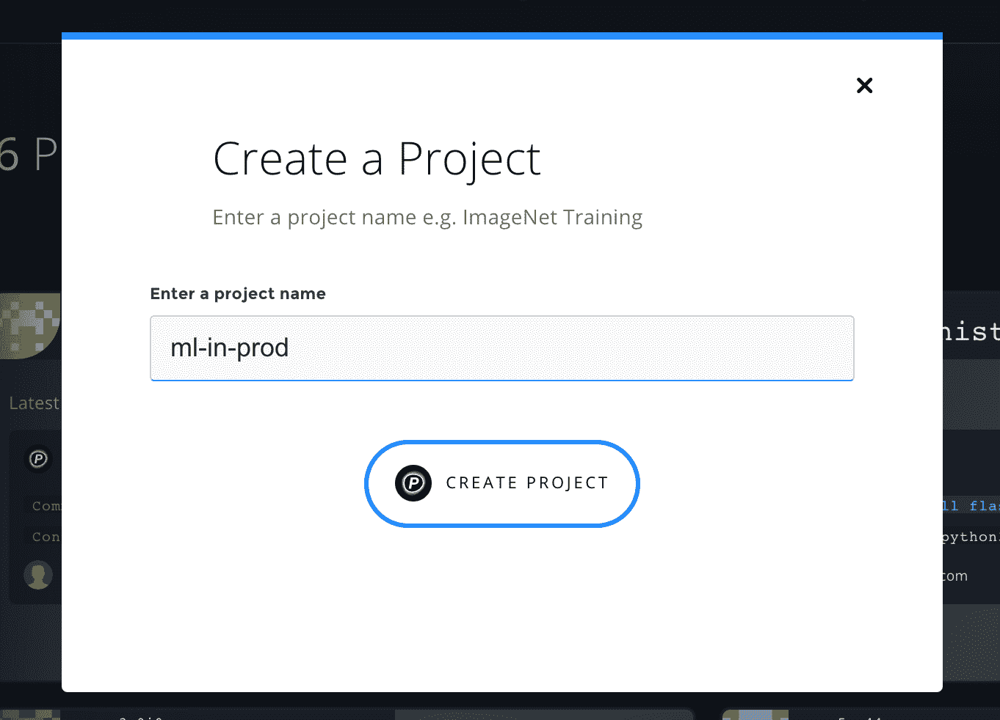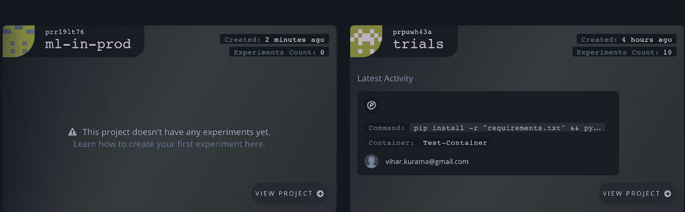

现在点击你新创建的项目。下一页是我们创建实验和作业的地方。

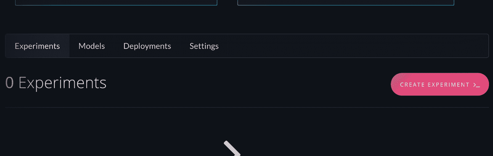

目前，它有 0 个实验。我们现在创建一个。

向下滚动，您将看到以下要填写的字段。

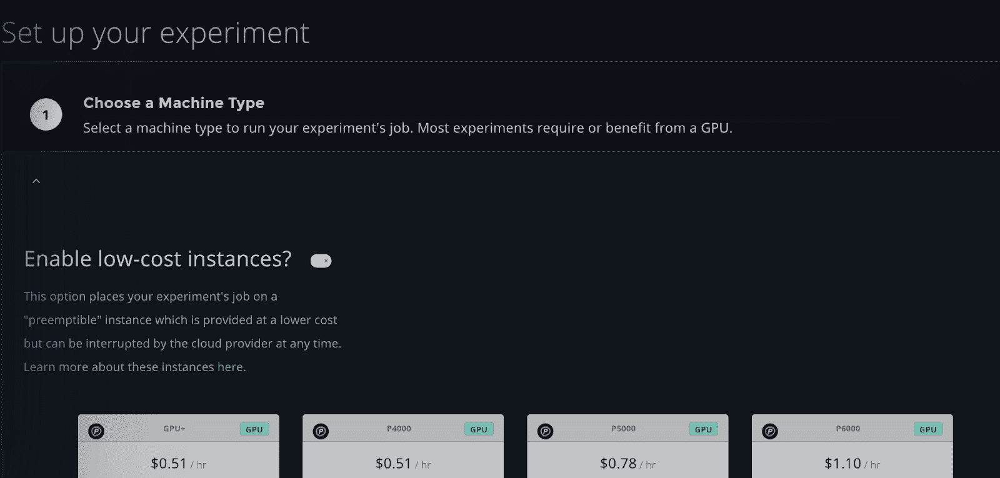

选择机器类型为 P5000。

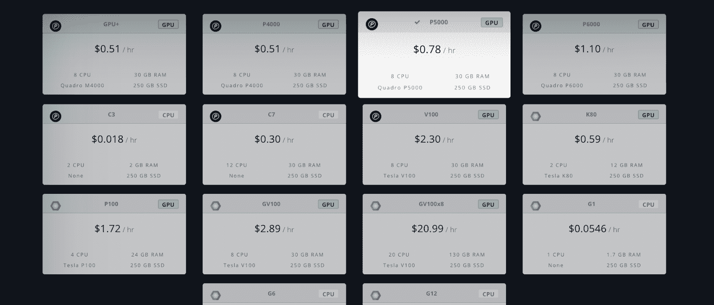

*   再往前，容器是设置整个环境的 docker 图像。除了我们将在后面看到的“requirements.txt ”,这个容器还有助于安装我们额外需要的大多数依赖项。在这个用例中，“测试容器”满足了我们的需求。

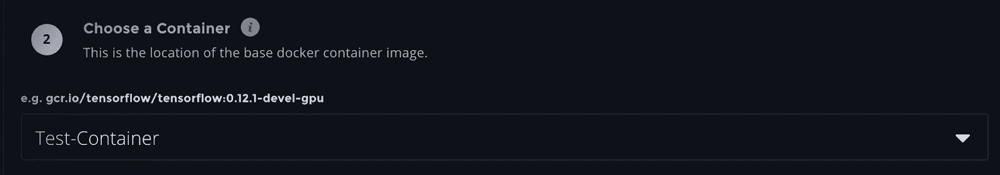

*   工作空间是需要部署的代码。之前，我们将应用程序推送到 Github 上，在这里使用它(在 Github repo 中的克隆/下载按钮中，获取这个 URL)。

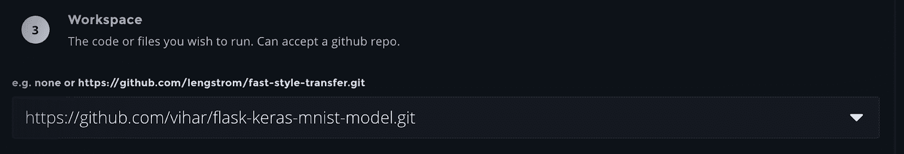

*   接下来是命令，其中我们指定了在执行这个实验时需要运行的命令。

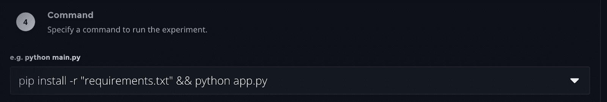

“Requirements.txt”会安装我们考虑的容器映像中可能不存在的所有其他依赖项。pip install-r“requirements . txt”是使用的命令。python app.py 执行我们一直编码的应用。

因为我们以前在应用程序中使用过端口 8000，所以在这里使用相同的端口。

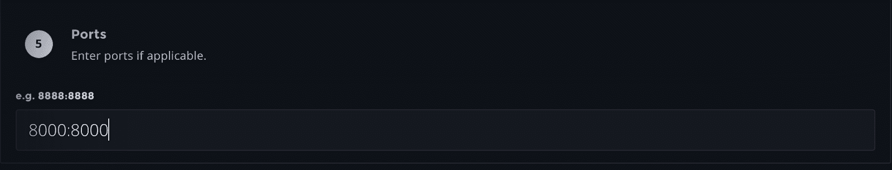

自定义指标可以暂时留空，然后单击“提交实验”。

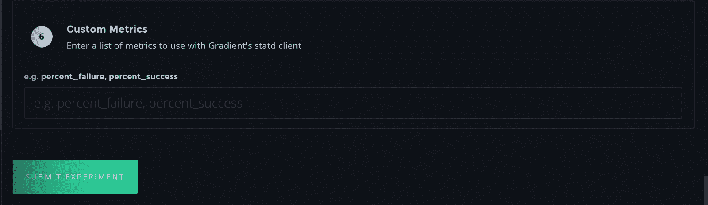

*   显示了运行实验的状态以及我们之前使用的命令和容器。

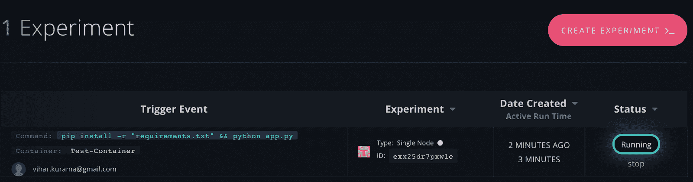

*   单击它会将您导航到作业控制台。

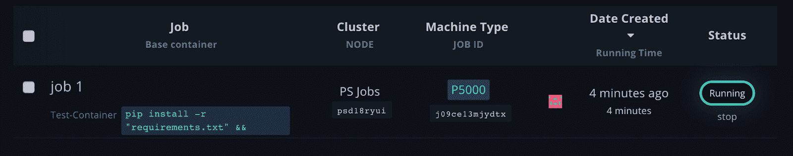

状态栏中的“正在运行”表示代码正在成功执行，没有任何中断。

*   按下它会带您进入工作详细信息。

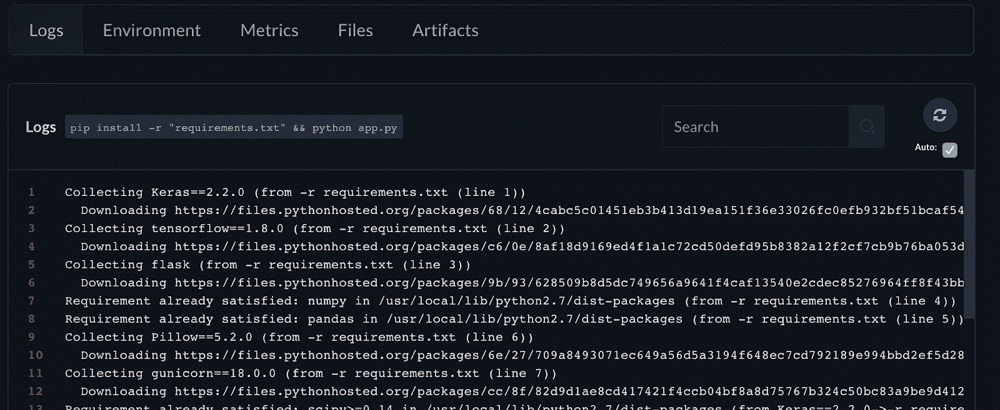

*   在“环境”部分，提到了作业容器的详细信息。

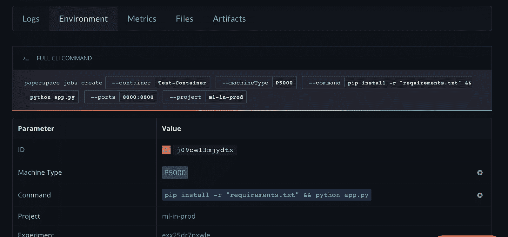

*   向下滚动，其中的 URL 是部署应用程序的位置。

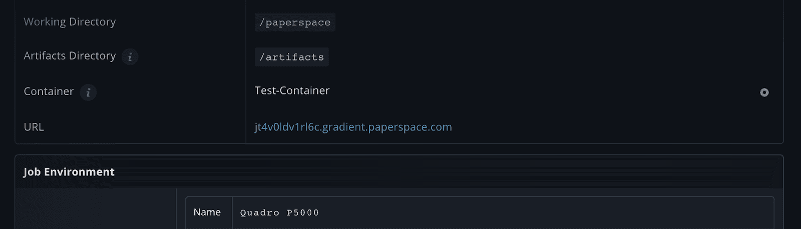

*   复制 URL，将端口号“8000”附加到它后面。

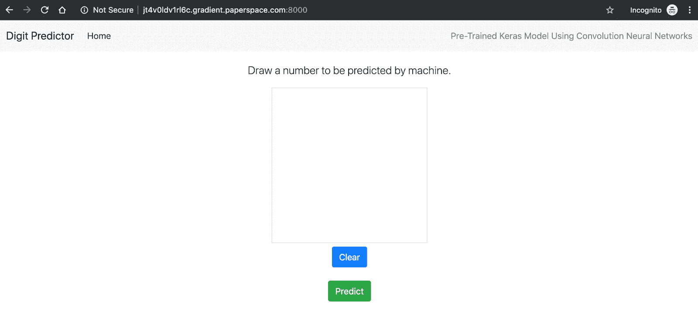

app 来了！在所示的画布上画一个数字，它会为您预测输出。

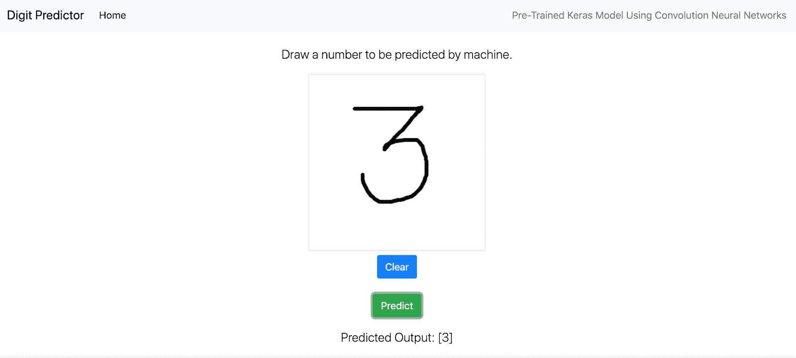