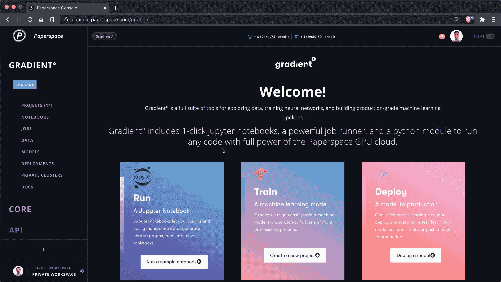

# 新:更好的机密管理在纸张空间梯度中实现

> 原文：<https://blog.paperspace.com/secrets-land-in-paperspace-gradient/>

[2021 年 12 月 2 日更新:本文包含关于梯度实验的信息。实验现已被弃用，渐变工作流已经取代了它的功能。[请参见工作流程文档了解更多信息](https://docs.paperspace.com/gradient/explore-train-deploy/workflows)。]

我们很高兴地宣布 Gradient 中新的**秘密管理**的到来！

Secrets are now available in Gradient Projects!

[Secrets](https://docs.paperspace.com/gradient/secrets/overview) 是一种在团队、集群或项目级别本地范围密钥和凭证的方法——它们现在可用于在私有集群上运行的所有梯度实验！

秘密通常用于存储 API 密钥、S3 凭证、SSH 密钥或运行机器学习工作负载所需的任何其他安全文本。它们尤其适用于需要安全方法来认证项目或实验中使用的外部资源的协作团队。

一旦创建了一个秘密，只需使用语法`secret:<name>`将该秘密作为环境变量注入即可。

可以在渐变控制台中或通过渐变 CLI 创建密码。

有关 CLI 用法的更多信息，请阅读文档！