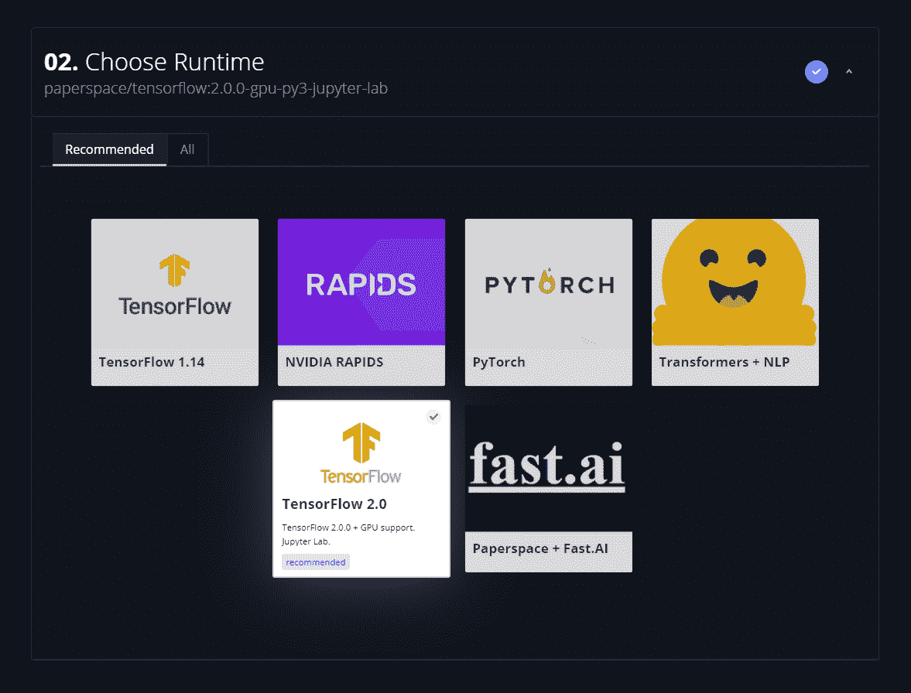

# Paperspace 加入 TensorFlow AI 服务合作伙伴

> 原文：<https://blog.paperspace.com/paperspace-joins-tensorflow-ai-service-partners/>

[2021 年 12 月 2 日更新:本文包含关于梯度实验的信息。实验现已被弃用，渐变工作流已经取代了它的功能。[请参见工作流程文档了解更多信息](https://docs.paperspace.com/gradient/explore-train-deploy/workflows)。]

我们很高兴地宣布，我们已经与 [TensorFlow](https://www.tensorflow.org/) 团队合作，成为官方人工智能服务合作伙伴。作为世界上最受欢迎的开源机器学习框架之一，下载量超过 1 亿次，TensorFlow 宣布了这一合作伙伴关系，旨在通过基于人工智能的系统帮助更多企业解决最具挑战性的业务问题。

作为 TensorFlow 人工智能服务合作伙伴，我们的 [Gradient](https://gradient.paperspace.com) 团队将与 TensorFlow 团队密切合作，帮助更多团队加速他们的 ML 项目。这包括定期分享见解和产品反馈，以及共同努力进行增强和改进，专门解决企业的 ML 需求。

今天，世界上数百万家公司正在投资机器学习，以解决几乎每个行业的问题。TensorFlow 是 Google Brain 团队创建的一个开源项目，是一个非常受欢迎的 ML 框架，支持从训练到模型服务的端到端工作流。TensorFlow 对分布式培训和其他一些高级功能提供了本机支持，这使得该框架在交付生产应用程序时尤其有价值。

TensorFlow 与 Gradient、Paperspace 的 MLOps 平台紧密集成，极大地简化了开发 ML 模型的研究和生产阶段。Gradient 支持任何版本的 TensorFlow 用于[笔记本](https://docs.paperspace.com/gradient/notebooks/about)、[实验](https://docs.paperspace.com/gradient/experiments/about)或[作业](https://docs.paperspace.com/gradient/jobs/about)(部署训练好的模型参见 [TensorFlow Serving](https://gradient.paperspace.com/integrations/tensorflow-serving) )。尽管客户也可以自带自己定制的 TensorFlow 容器，但开箱后会提供一组预建的 TensorFlow 容器。请参见我们的[集成页面](https://gradient.paperspace.com/integrations/tensorflow)，了解 Gradient 中 TensorFlow 支持的更多示例，包括自动模型解析和内置分布式训练功能。

Selecting a TensorFlow container in Gradient

Gradient 客户将 TensorFlow 用于广泛的应用，如计算机视觉、自然语言处理(NLP)、推荐系统、异常检测等。例如， [Spectrum Labs](https://www.spectrumlabsai.com/) 正在使用 Gradient 向[提供有毒聊天检测模型](https://blog.paperspace.com/spectrum-labs-collaborates-with-paperspace-to-boost-nlp-based-toxic-chat-modeling-efforts/)给互联网约会、游戏、市场和社交媒体社区。

我们的 [ML Showcase](https://ml-showcase.paperspace.com/) 、 [blog](https://blog.paperspace.com/) 和 [GitHub repo](https://github.com/Paperspace) 有许多基于 TensorFlow 的入门级和生产就绪样本项目，涵盖了机器学习领域的许多热门领域。

这种合作将开启新的可能性，我们非常高兴正式确定这种关系。

首先，你可以[创建一个免费账户](https://console.paperspace.com/signup?gradient=true)或者[给我们发一封短信](https://info.paperspace.com/contact-sales)。