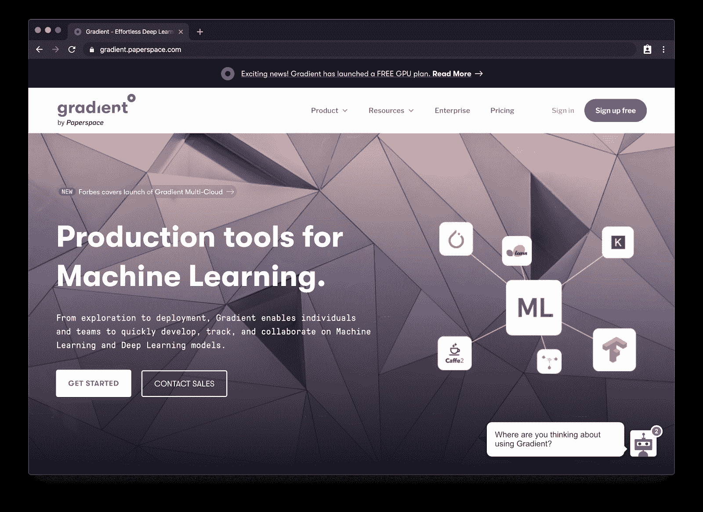
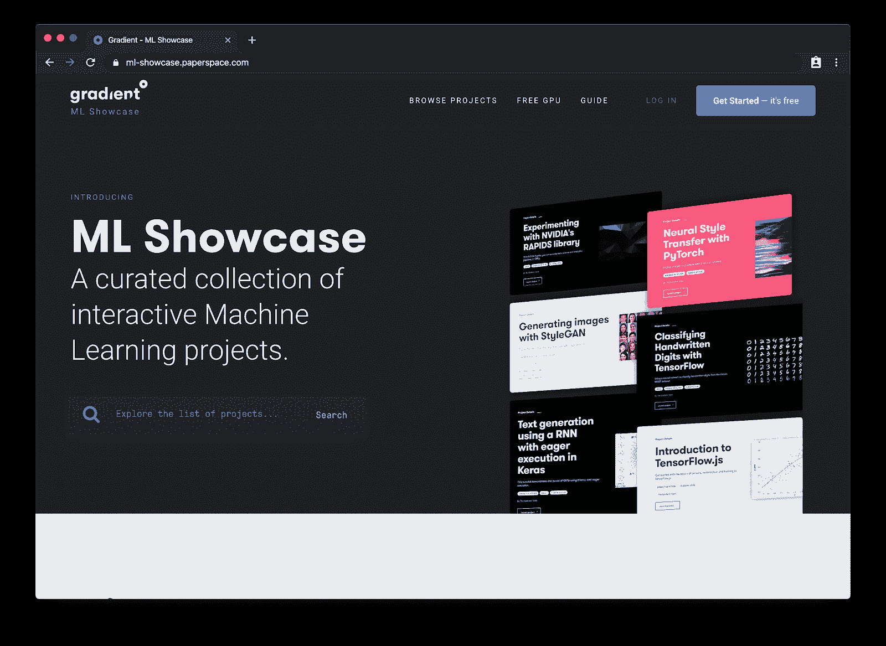
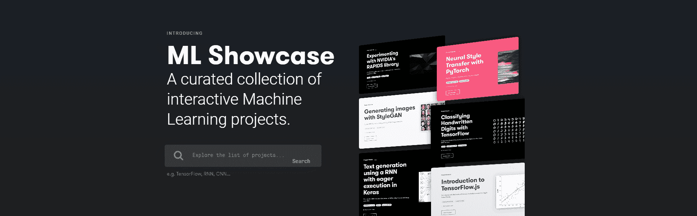
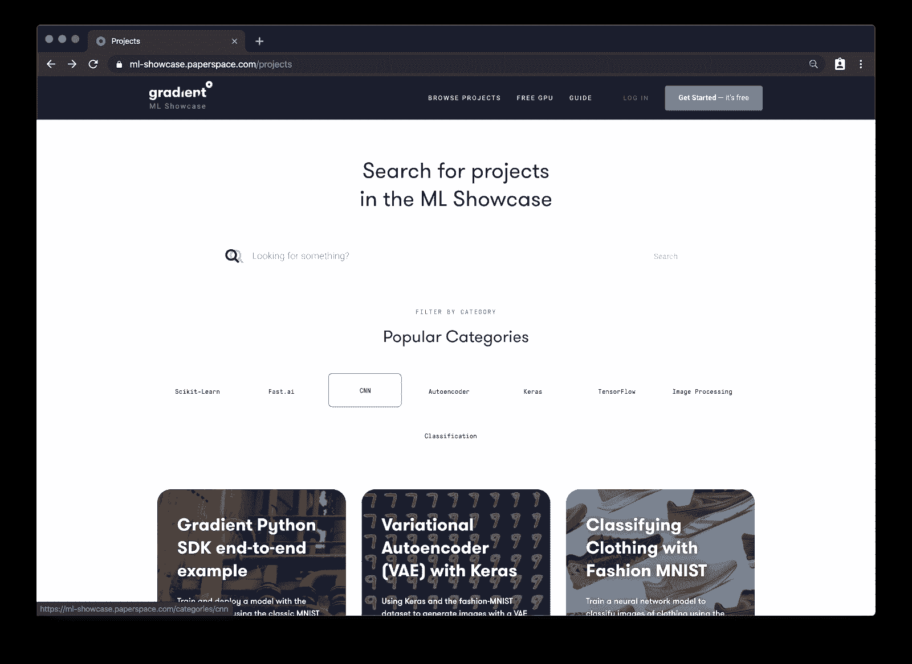
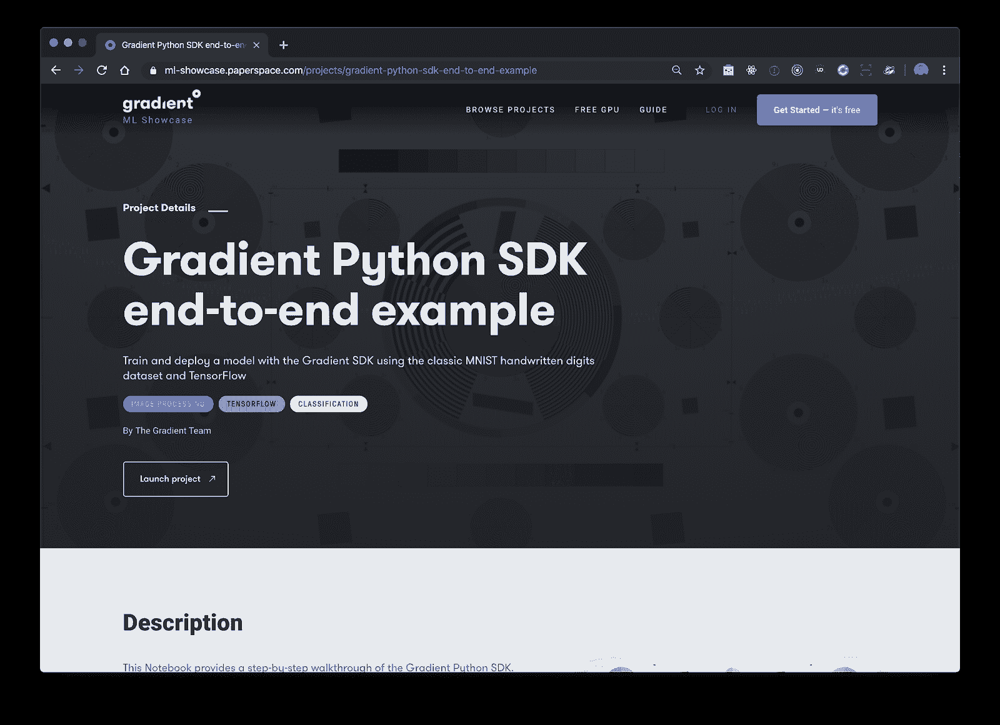
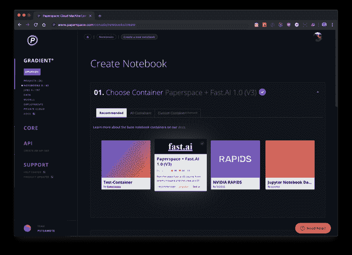
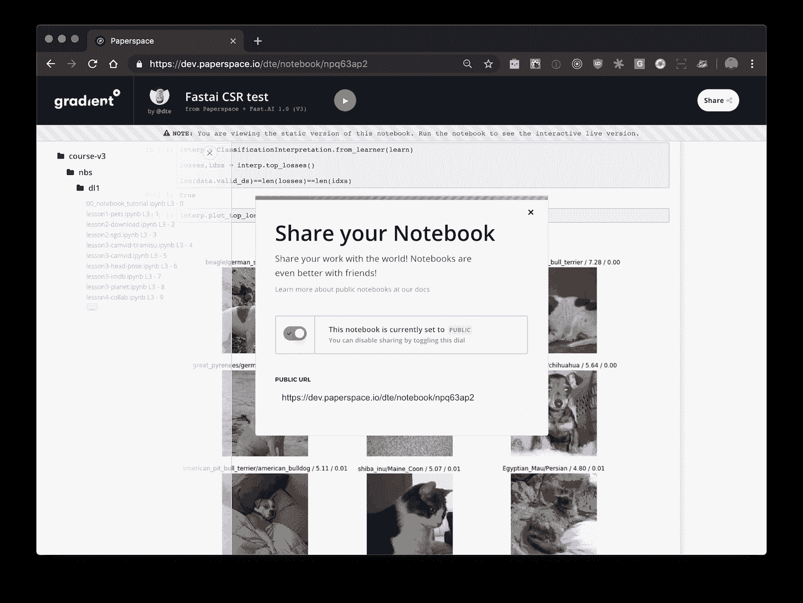

# 介绍渐变社区笔记本:在免费 GPU 上轻松运行 ML 笔记本

> 原文：<https://blog.paperspace.com/paperspace-launches-gradient-community-notebooks/>

无论你是机器学习爱好者、研究人员还是专业人士，设置和管理你的工作环境都可能是一个复杂和令人分心的过程。即使您已经解决了安装和版本兼容性问题，您仍将面临克隆最新模型、与他人共享您的成果以及简单地跟踪您的工作的挑战。更糟糕的是，许多云 GPU 的价格高得惊人。

我们正在通过发布 *[渐变社区笔记本](https://gradient.paperspace.com/free-gpu)* 正面解决这些问题，这是一项基于 Jupyter 笔记本的免费云 GPU 服务，从根本上简化了 ML/AI 开发的过程。现在，任何使用 PyTorch、TensorFlow 和 Keras 等流行深度学习框架的开发人员都可以轻松启动强大的免费 GPU 实例，并在他们的 ML 项目上进行合作。这标志着我们的使命的最新努力，使云 GPU 资源更容易为社区所用。

## 推出免费笔记本

Gradient Community 笔记本是公共的、可共享的 Jupyter 笔记本，运行在免费的云 GPU 和 CPU 上。笔记本可以在任何 DL 或 ML 框架上运行，预先配置为开箱即用。使用你自己的容器或者从大量模板中选择，包括流行的驱动程序和依赖项，比如 CUDA 和 cuDNN。

[Gradient](https://gradient.paperspace.com/) 让您专注于构建模型，而不是排除环境故障。

免费笔记本可用的实例类型包括:

*   空闲 CPU-C4 CPU 实例
*   免费-GPU+ — NVIDIA M4000 GPU
*   免费-P5000 — NVIDIA P5000 GPU

5 GB 的[永久存储](https://docs.paperspace.com/gradient/data/storage#persistent-storage)也是免费的。

## 机器学习展示:现成的 ML 项目

[Gradient - ML ShowcaseA collection of interactive Machine Learning projects curated by Paperspace Gradient.ML Showcase](https://ml-showcase.paperspace.com/)

ML Showcase 是一个现成的、完整的 ML 项目库，可以开箱即用。现在有了免费的 CPU 和 GPU，你可以轻松地选择一个项目，并将其作为自己工作或探索的基础。

您可以根据项目的类型和类别来浏览项目。一旦你找到一个你感兴趣的项目，在 Gradient 中打开它浏览代码。

通过克隆并在免费的 GPU 上运行该项目，让它成为你自己的项目。调整参数，交换数据集，或者将其作为自己工作的基础。

## 如何在跑步中迅速起步

开始使用您的第一台免费 GPU 笔记本电脑非常简单。

1.  [创建免费账户](https://www.paperspace.com/account/signup?gradient=true)
2.  选择您的实例(M4000 或 P5000 云 GPU，或 C4 云 CPU)
3.  启动您自己的笔记本，或者从 ML showcase 或社区获得一个现成的项目

您可以运行无限数量的会话，一次最多可运行 6 个小时。您的笔记本将保持完整版本，并且您可以重新启动您的实例来运行另外 6 个小时，次数不限。

渐变社区笔记本关注的正是这个社区。所有笔记本都设置为公共的，可以由其他社区成员共享和分享。

要了解更多信息[请查看文档](https://docs.paperspace.com/gradient/instances/free-instances)或免费运行自己的笔记本。