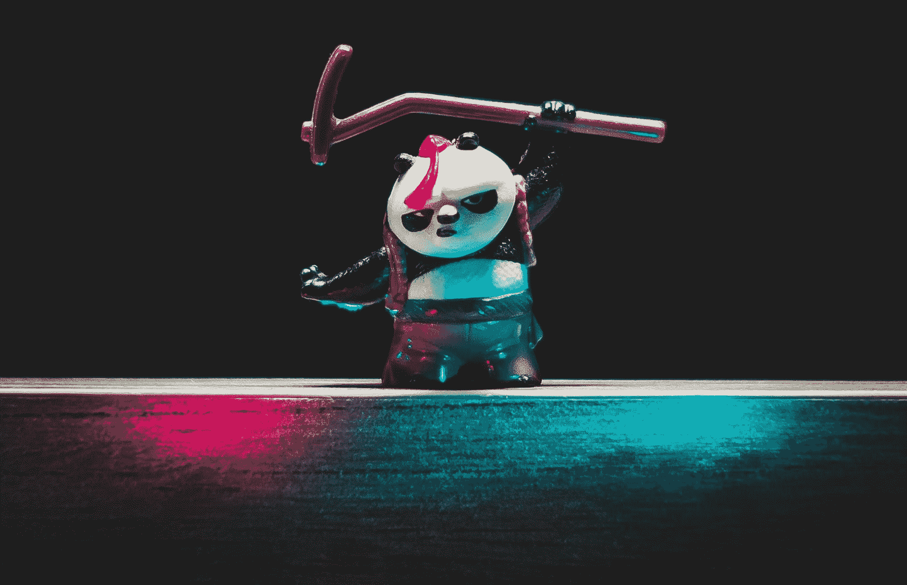
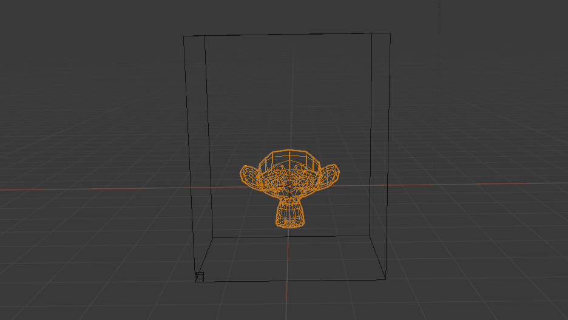
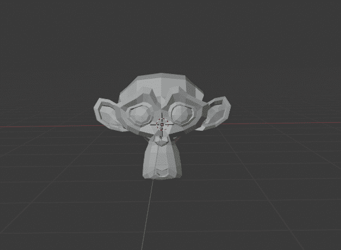
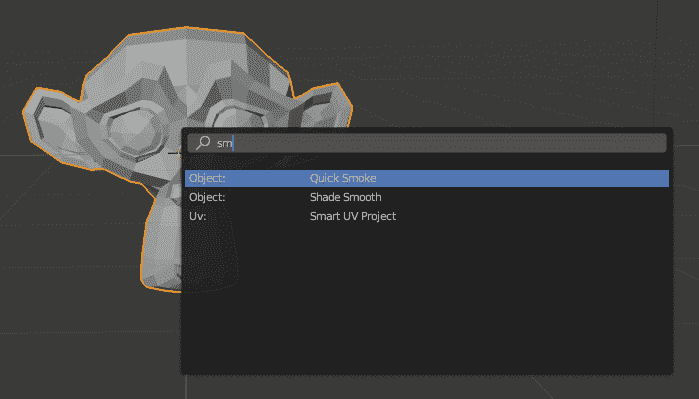
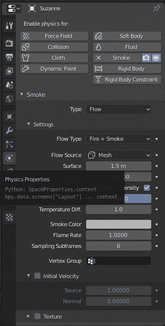
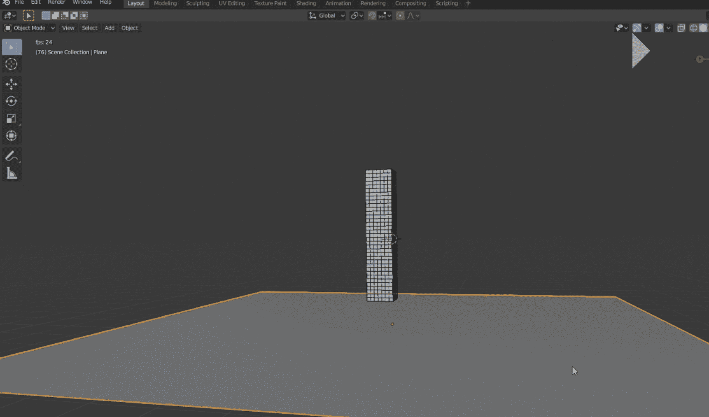
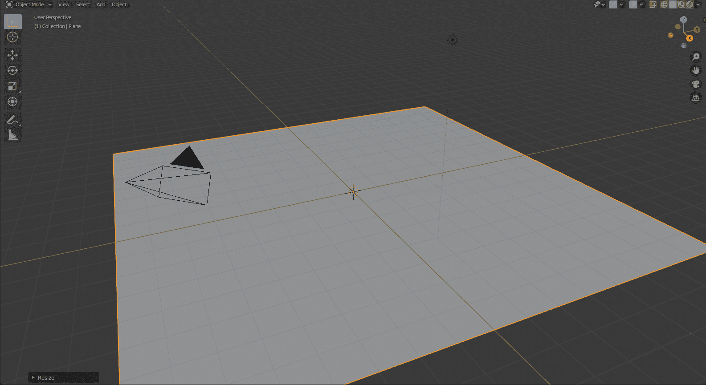
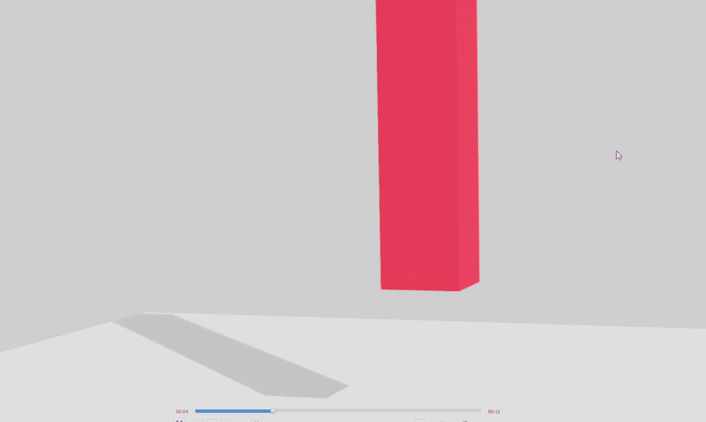
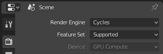
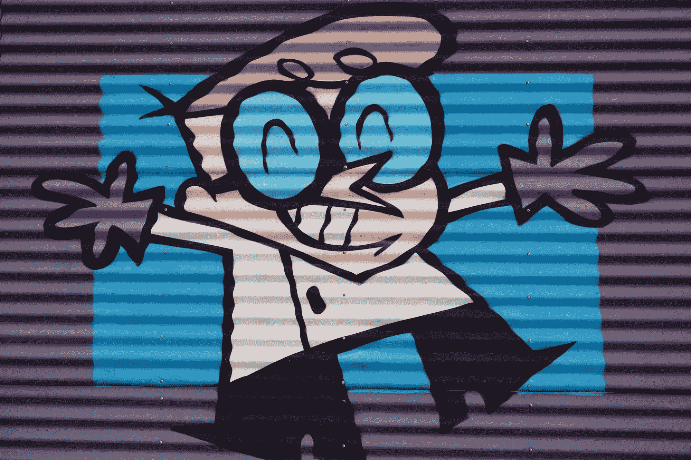

# 三维模型的动画

> 原文：<https://blog.paperspace.com/animation-of-3-d-models/>



Photo by [Mateusz Butkiewicz](https://unsplash.com/@puszkins?utm_source=ghost&utm_medium=referral&utm_campaign=api-credit) / [Unsplash](https://unsplash.com/?utm_source=ghost&utm_medium=referral&utm_campaign=api-credit)

动画是一个非常有趣的概念。大多数人在成长过程中都会看卡通片，甚至今天还有很多人热衷于观看流行的动漫节目。这些动画非常吸引人，因为它们复制了一种卡通但近乎真实的事物运作方式。简单来说，动画可以理解为一种对图像或模型进行处理和操作的方法，以使它们能够执行特定的任务。这些任务可以反映任何特定的动作，比如走路、跑步、坐着、说话等等。

在之前的文章“Blender 中使用 Python 脚本进行 3d 建模的介绍”和“向 3d 模型添加背景图像和纹理的基础”中，我们已经介绍了如何在 Blender 平台环境中操纵和操作 3d 对象、背景细节和纹理的大多数基本方面。建议不熟悉 Blender 的读者查看以前的文章，了解一些您可以利用的最新方法。如果您对如何使用 Blender 及其众多工具有简单的了解，并且正在寻找基本动画入门，请跟随众多内容在有代码和无代码的 3d Blender 空间中执行操作。

在这篇文章中，我们将试图把重点放在与在 Blender 环境的 3d 空间中制作 3d 对象动画相关的大部分重要和基本的方面。我们的主要目标是学习如何仅使用 Blender 提供的元素和众多工具来制作 3d 对象的动画，借助 Blender 中可用的 Python 编程语言编辑器来创建简单的动画，并最终相应地渲染动画。要查看我们将在本文中涉及的众多主题，请查看下面提供的目录。

### 目录:

*   介绍
*   用搅拌机烧猴子动画的例子(无代码)
    1。导入猴子网格
    2。添加快速烟雾动画
    3。添加火和烟动画
*   制作一组立方体的动画。创建底座
    2。编码整个区块设计
    3。添加动画和所需的颜色
*   渲染三维模型的动画
*   结论

## 简介:

Blender 中的动画是您可以使用该平台执行的众多精彩动作之一。可以说，对象的动画或对象所处的整个环境是用户可以执行的最吸引人和最迷人的实体之一。我们的重点将仍然是开发一些模型，并相应地制作动画来实现一些看起来很酷的东西，并最终将它们渲染到我们想要的目录中。

首先，我们将开发一个燃烧的猴子网格在火中被点燃的动画基线项目。我们将理解完成这样的动画的基本方面，以及我们如何操纵众多的工具和项目来获得想要的结果。整个示例非常简单，不需要任何代码就可以执行。几乎任何搅拌机动画初学者应该能够成功地执行这项任务，没有太多的复杂性。

一旦我们完成了燃烧猴子网格的动画，我们将了解如何借助 Python 文本编辑器中可用的 Python 代码和众多 Blender 工具的帮助，构建一个在撞击时破碎的立方体坠落塔。我们将相应地安排这些块，使它们形成一个塔状结构。当塔从远处落下并撞击固体表面时，它会随着所有砖块的破碎而破碎。

我们要看的最后一个概念是如何渲染整个动画。在上一篇关于“向 3d 模型添加背景图像和纹理的基础”的文章中，我们简要地介绍了渲染图像的过程。为了完成动画渲染，该过程通常需要一组连续的图像，这些图像需要相应地进行渲染以获得所需的结果。最好有一个图形处理单元(GPU)用于这个渲染过程。但是，你也可以在 CPU 的帮助下完成特定的基本动画。唯一的问题是渲染过程会消耗更多的时间。让我们从 Blender 的燃烧的猴子动画的例子开始。

* * *

## 用 Blender 烧猴子动画的例子(无代码):



在本文中，我们将学习的第一个项目是 Blender 中一个初学者最简单和最基本的动画之一。我们将了解如何导入一个随机网格(在这种情况下，一个猴子网格)，并设置选定的对象着火。所制作的动画将具有火和烟的逼真触感，您可以在所制作的燃烧的猴子动画上逐帧查看。我们完成这项任务的步骤很简单。我们将导入猴子网格，分配快速烟雾动画，更改一些物质属性，最后查看动画。动画的渲染和更多关于代码的细节将在以后的章节中介绍。

### 导入猴子网格:

如果您对 Blender 有一个基本的了解，或者已经精确地遵循了前两篇文章，那么导入猴子网格的任务现在应该是小菜一碟。在进入 Blender 环境并选择一个新项目时，您会注意到屏幕上放置的默认立方体。有多种方法可以执行从屏幕上移除立方体对象的操作，如前几篇文章中所讨论的。您可以右键单击立方体并选择删除选项，或者选择立方体并按键盘上的删除按钮。

一旦默认的立方体被删除，我们现在可以继续在屏幕上添加猴子网格。通过单击菜单栏中的添加按钮，选择网格图标，然后单击猴子网格的最后一个选项来添加猴子网格。现在，我们可以继续改变整体的三维视图，以更清楚地看到猴子的网格。我们可以通过单击鼠标 3 按钮或利用 Blender 屏幕右上角的 x、y 和 z 轴坐标来执行此操作。



一旦你相应地调整了你的屏幕和设置，你应该能更好地看到你的三维模型，有点类似于上面显示的图像。一旦导入过程完成，你已经根据你的要求调整了屏幕，我们现在可以开始添加快速烟雾动画到选中的猴子网格。

### 添加快速烟雾动画:

我们的下一步是添加快速烟雾对象，它已经在 Blender 环境中预先构建好了。要添加快速烟雾动画，如果你还没有选择猴子网格，点击键盘上的 F3 键。按下 F3 按钮会提示用户一组选项和一个搜索按钮，以便进行所需的选择性搜索。您可以输入 smoke，如下图所示，您会发现第一个选项显示了可供用户选择的快速吸烟选项。选择第一个选项，你现在将有快速烟雾激活。



一旦您激活了快速冒烟功能，您将收到如下所示的图像。该框表示烟雾激活将在其中被触发和播放的帧。可以播放快速烟雾动画，见证猴子喷出烟雾。这个过程既可以通过点击底部菜单栏上的*播放动画*选项来完成，也可以通过简单地按下键盘上的空格键来完成。对于默认情况下提供的给定数量的关键帧，将继续播放以下动画。默认范围通常设置为从*‘1’*开始的关键帧范围，一直到*‘250’*结束的帧范围。


现在，我们已经成功地完成了导入猴子网格和快速烟雾动画，我们现在可以继续完成添加火和烟的组合的最后一步。在下一节中，我们将介绍如何将火和烟动画添加到我们的猴子网格中。

### 添加火和烟动画:

对于文章这一部分的最后一步，我们将完成猴子网格的动画，并确保我们能够点燃它。一旦你选择了猴子网格，确保你在屏幕右侧的属性菜单栏上选择了物理属性。下图显示了为获得所需结果而必须遵循的所有步骤。一旦你点击物理属性，注意烟雾栏下的类型功能，并确保将其设置为流动。“类型”功能有时可能是默认域。



一旦您将烟雾功能的类型选择为*“流量”*，您现在也可以更改流量类型。如果流类型默认设置为*烟雾*，那么您可以在设置面板下将流类型更改为*火+烟雾*。现在所有的设置都按照我们的要求完成了，我们可以观看最终的动画了。本节开头显示的第一个 gif 图像文件是您可以通过播放动画来查看的。

建议初学 Blender 动画的人尝试使用 physics properties 布局中的众多参数和选项进行实验。尝试改变不同的图案，改变各种颜色，并自己更改其他参数，以查看从以下操作中获得的结果类型的变化。

> **注意:**在动画制作过程中，您有时可能会遇到轻微的延迟。确保选择了猴子网格，并相应地设置了属性。如果问题仍然存在，重新启动并重试项目可能是解决以下问题的方法。

现在，我们已经简要地看了如何执行一个用火和烟照亮猴子网格的动画技术，我们现在可以在一些代码的帮助下继续构建另一个简单的打破立方体块的项目。让我们在本文的下一节了解如何执行下面的项目。

* * *

## 制作立方体块的动画:



在下一个项目中，我们将制作一组从远处落到固体网格平面上的砖块的动画。在撞击表面时，这组石块将粉碎成碎片，重力和破碎过程的物理模拟是真实的。为了构建这个项目，我们将利用 Blender 提供的工具和技术以及我们可用的 Python 编码选项，以确保下面的任务变得更容易执行。

为了这个项目的适当建设，我们将遵循一个循序渐进的程序。本文这一部分的三个主要步骤将包括创建基础、对整个积木设计进行编码以及为积木设计添加合适的颜色。在本文的下一节中，我们将关注动画这些破碎块所需的最终渲染步骤。下面这个项目完全是受下面这个[视频](https://www.youtube.com/watch?v=KI0tjZUkb5A)的启发。请随意查看以下视频，了解完整的视频演示和对该项目的理解。

### 创建基础:

在本文的这一部分，我们将重点关注的第一步是为整个项目创建基础。基座的表面将作为固定在所需位置的固体表面。石块在撞击到坚固的基础结构上时会摇晃并破碎成更小的碎片。创建基础结构的第一步是添加网格。但是，在将平面放置在曲面上之前，请确保按照前面提到的步骤之一删除默认立方体。现在，去菜单栏中的添加功能，并选择网格。

点击该平面的选项，将所需的对象放置在搅拌机屏幕上。一旦你把飞机放在搅拌机屏幕上，你会注意到原来的尺寸很小，需要做一些必要的调整。要调整平面的大小并使其变得更大，请确保您选择了该平面，然后单击键盘上的*的*按钮，将平面网格的比例增加到所需的大小。您也可以通过按下键盘上的*【G】*按钮以及特定的*【X】*、*【Y】*或*【Z】*轴来调整平面的定位，以沿着所需的轴抓取平面，并将其放置在最适合您查看项目的位置。



一旦你按照要求完成了基础结构的设置，我们就可以继续给平面网格添加一些刚体属性了。要执行以下操作，请检查 Blender 屏幕右侧的属性布局，并选择物理属性选项。选择“刚体”选项，并将对象类型设置为“被动”。在“碰撞”区域中，将对象的形状从默认选项设定为网格选择。最后，在 sensitivity 选项下，选择 margin 函数，并确保将以下内容从默认注册值设置为零。第一步完成后，保存下面的 Blender 文件可能是个好主意。下一节中的下一步可能需要几分钟来运行所需的生成。

### 对整个区块设计进行编码:

一旦我们建立了基础结构，我们就可以在平面网格上构建立方体块了。这个想法是，当我们开始动画时，这组积木将从初始表面的远处落下，并且在撞击到固定的基座上时，这组积木将相应地一个接一个地粉碎。创建这些模块并分别设计它们可能是一个从头构建的复杂过程。因此，我们将利用 Blender 中提供的 Python 脚本选项来执行以下任务。打开文本编辑器布局，如我们以前的文章中所讨论的。您可以选择给下面的代码片段起一个您想要的名字，但是要确保这个名字以一个“*结尾。py* 标签表示创建的文件是 Python 文件。

在本文的这一部分，我们将学习如何借助 Python 脚本创建块的结构。下面提供了此过程的完整代码片段。让我们了解在这个代码块中执行的许多步骤和操作。首先，我们确保在。bpy 库。我们将默认数字设置为 7，这将代表我们希望在 x、y 和 z 坐标中开始构建块的默认范围。

我们还将相应地设置相应的计数器，以便将每个生成的立方体放置在所需位置的唯一位置。我们还启用了刚体物理学的一些基本内容，在这些内容中，我们可以确保每个立方体块都遵循物理学的基本规则。我们正在利用的一些参数是质量、碰撞形状、摩擦力、线性阻尼、角阻尼和碰撞余量。用户也可以随意试验一些其他参数。

```py
import bpy

number = 7
counter = 0

for a in range(0, number+28):
    counter += 2
    counter2 = 0

    for b in range(0, number):
        counter2 += 2
        counter3 = 0

        for c in range(0, number):
            bpy.ops.mesh.primitive_cube_add(size=2, 
                                            location=(counter3-2, counter2-2, counter-2))
            counter3 += 2

            bpy.ops.rigidbody.object_add()
            bpy.context.object.rigid_body.mass = 20
            bpy.context.object.rigid_body.collision_shape = 'BOX'
            bpy.context.object.rigid_body.friction = 1
            bpy.context.object.rigid_body.use_margin = True
            bpy.context.object.rigid_body.collision_margin = 0
            bpy.context.object.rigid_body.linear_damping = 0.35
            bpy.context.object.rigid_body.angular_damping = 0.6
```

需要注意的是，完整执行下面的代码可能需要相当长的时间。根据安装的 CPU 类型、RAM 和系统类型，在某些情况下，该过程可能需要几分钟到 10-15 分钟。所以，在整个过程执行的时候要有耐心。一旦你有了所有的立方体块，并放置在所需的位置，设置好所有的参数，我们的下一步就是准备动画。

### 添加动画和所需的颜色:

我们将遵循的最后一个步骤是创建动画过程。现在选择我们在本节的第一步中创建的基础。选择底座后，确保它与立方体块有适当的距离。现在访问“属性”布局右侧的场景属性。如果你已经完美地完成了“*创建基础*部分的所有步骤，你应该能够在场景属性部分选择刚体选项。

在此部分，选择设置选项卡，将每秒步数从默认的 *60* 设置为大约 *500* 。在缓存部分，保持模拟的开始为 *1，*，但是将模拟的结束从 250 改为 500。现在，您可以继续烘焙以下内容，为动画做准备。根据您使用的设备类型，下面的步骤可能需要一些时间。一旦烘焙过程完成，我们将添加一个合适的颜色到我们的方块中。

添加合适的纹理的过程类似于我们在上一篇文章中讨论的给你的项目添加背景和纹理的方法。您可以通过点击键盘上的“ *B* ”按钮，或者通过简单准确地选择立方体块的所有所需区域，来框选搅拌机屏幕上可用的所有立方体。选择立方体的所有块后，按住 shift 键并选择其中一个立方体，然后移动到 Blender 平台右侧属性布局中的材料属性。

在这里，你可以随意添加你想要的纹理到模型中。您可以选择从提供的十六进制颜色值中添加自己选择的颜色，也可以选择以前下载或保存在系统中的自定义纹理。一旦你满意地将想要的纹理赋予立方体块，你就可以开始渲染动画了。我选择了默认的红色纹理，如本文下一节的视频所示。

* * *

## 渲染三维模型的动画:



渲染是三维建模最重要的组成部分之一。这是必须遵循的最后步骤之一，以确保生成的最终模型或动画将具有视觉上的愉悦以及整体的高度美学吸引力。渲染过程有助于我们从二维或三维模型中获得真实感或非真实感的图像解释，通常通过高级计算机软件来实现。Blender 就是这样一个软件，它有一个内置的工具来渲染和处理图像，使它们更逼真，更高级。

在模型的图像合成之后接收的最终图像被称为“渲染”图像。通常，GPU 更适合计算渲染过程，因为它需要相当多的计算资源来计算适当的复杂渲染机制。虽然 Blender 的简单项目可以在 CPU 的帮助下完成，但使用 GPU 进行更复杂的计算是理想的。在这一节中，我们将了解如何实现三维模型的渲染过程，主要是在我们之前的动画小立方体块的项目上。

下一步我们将完成的是设置完美的渲染图像的摄像机角度。选择摄像机，点击" *Ctrl* " + " *Numpad 0* "用摄像机查看物体的位置。点击键盘上的“ *N* 按钮，获得额外的对话框选项。在新出现的布局的视图提示中，选中“锁定摄像机以查看”选项。确保相应地调整设置，以使立方体的整个块在相机视图中可视。您还可以简单地播放动画来验证一切是否按计划进行。



最后一步是在 Blender 平台的右侧布局中设置渲染属性。如果您有以下设备，请将渲染引擎更改为 Cycles，并将用于计算的设备从 CPU 更改为 GPU。如果认为需要进行所需的计算，还可以在采样区域中修改渲染和视口。在输出属性布局中设置保存渲染动画图像的目录，最后转到主菜单栏中的渲染和渲染动画选项，开始立方体块的动画过程。根据你的设备质量，经过几个小时的训练，你应该能够制作出一个像样的动画。

* * *

## 结论:



Photo by [Doug Maloney](https://unsplash.com/@dougmaloney?utm_source=ghost&utm_medium=referral&utm_campaign=api-credit) / [Unsplash](https://unsplash.com/?utm_source=ghost&utm_medium=referral&utm_campaign=api-credit)

动画是现代最有趣的领域之一。电视节目、卡通、动画、电影和视频游戏中大量动画的质量每天都在不断提高。所使用的设备类型、运动控制机制和图形工具都在不断更新，以适应现代对逼真动画的期望。随着该领域的蓬勃发展和新动画技术的不断进步，使用 Blender 开始制作三维动画是初学者开始探索各种动作、序列和动画类型的众多方法的好方法。

在本文中，我们简要介绍了 Blender 中的动画和三维模型动画。我们学习了如何在不使用任何代码的情况下，构建一个关于燃烧的猴子的动画的基本项目。然后，我们构建了另一个打破构建块的酷项目，我们在一些 Python 代码和 Blender 中可用的许多实用程序选项的帮助下构建该项目，以执行以下操作。在构建 breaking blocks 项目时，我们进一步了解了动画视频的渲染细节，以及 CPU 和 GPU 在渲染高质量项目时的效用差异。

在下一篇关于掌握三维建模基础的文章中，我们将讨论如何使用 Blender 处理 SMPL 模型。在那之前，我希望你在实验和学习动画、图像处理、3d 建模或任何你喜欢的令人惊奇的概念方面有一段美好的时光！