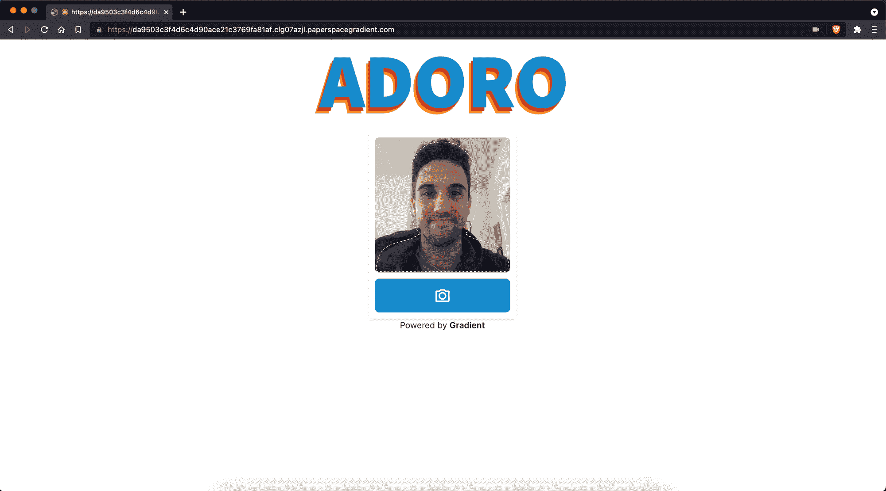
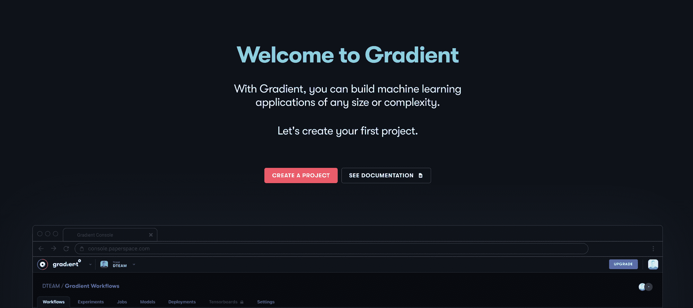
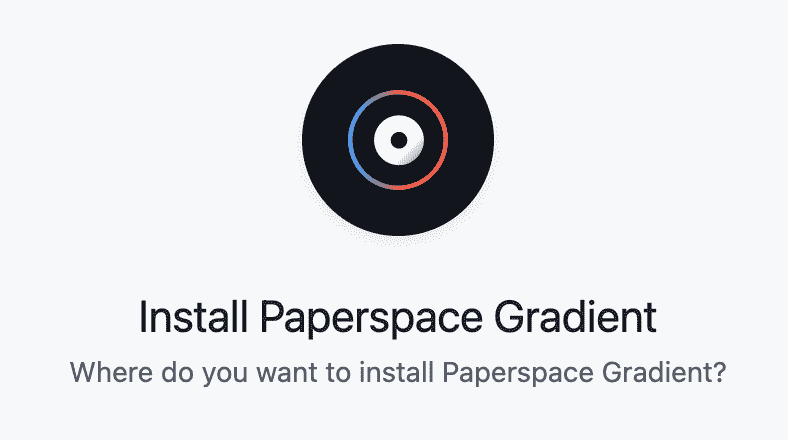
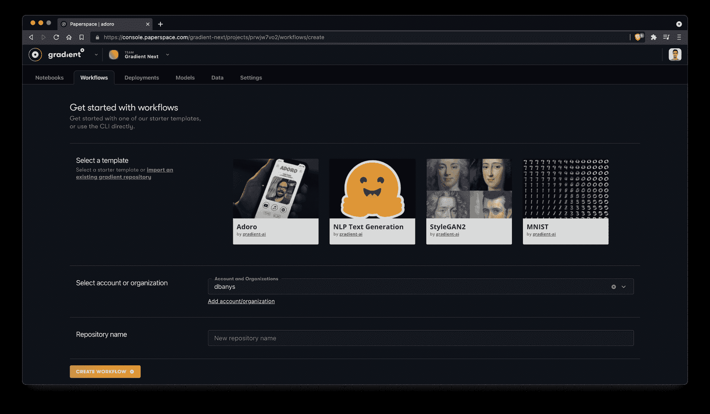
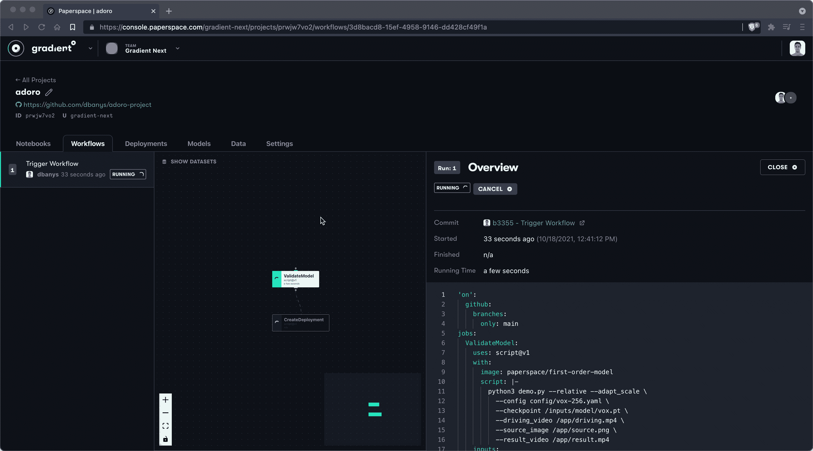
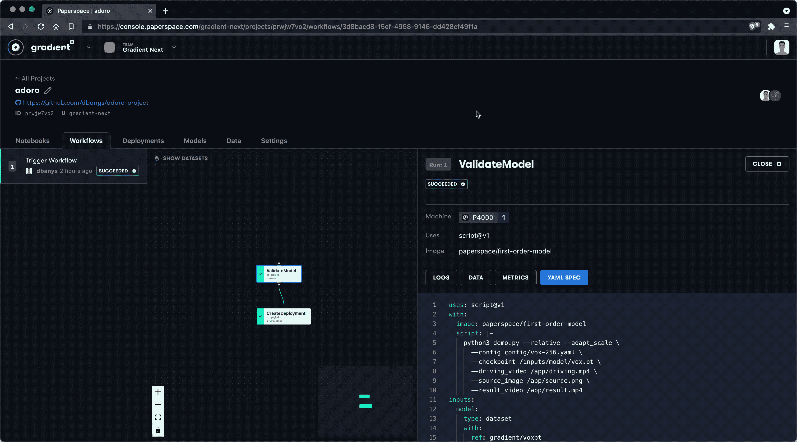
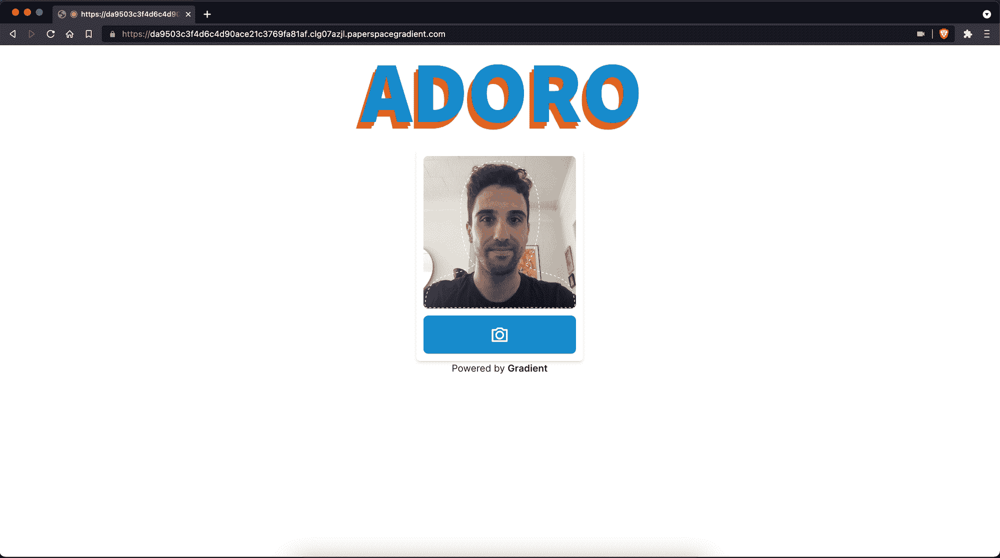

# Adoro:一个 deepfake 应用程序，让你只用自拍就能表演意大利歌剧经典

> 原文：<https://blog.paperspace.com/adoro-deepfake-your-selfie-first-order-motion-model/>

[https://www.youtube.com/embed/S2rz42I230c?feature=oembed](https://www.youtube.com/embed/S2rz42I230c?feature=oembed)

Video walkthrough of this tutorial

我们最近推出了一个新的渐变网站，其特色是一个名为“[用渐变制作任何东西](https://youtu.be/ojPfWlD8E3M)”的新活动

在其中一个短片中，Stewart 询问他是否可以使用渐变来制作一个非常特定的机器学习应用程序——这将让他创建一个他唱意大利歌剧经典的深度假像。

如果你还没看过这个视频，可以看看:

[https://www.youtube.com/embed/jeRInJiPYRc?feature=oembed](https://www.youtube.com/embed/jeRInJiPYRc?feature=oembed)

A new Gradient campaign launched recently called "Make anything with Gradient."

今天，我们将向您展示一个名为 **Adoro** 的渐变新启动工作流，它将帮助您创建自己版本的 deepfake 应用程序——配有一个训练有素的模型，可以将驾驶视频中的运动转换为静态自拍。

我们将部署的应用程序如下所示:



The Adoro web app that we will create with Gradient Workflows will have a simple UI for taking a selfie and submitting that selfie for motion transfer from the driving video.

我们将能够使用该应用程序创建的输出如下所示:

[https://www.youtube.com/embed/tFz1w6PFLoU?feature=oembed](https://www.youtube.com/embed/tFz1w6PFLoU?feature=oembed)

The Adoro app will allow us to generate lip sync videos like this one!

我们开始吧！

## Adoro starter 项目

Adoro 利用一个名为[一阶运动模型的项目制作图像动画](https://papers.nips.cc/paper/2019/hash/31c0b36aef265d9221af80872ceb62f9-Abstract.html)。该模型最初由一组研究人员在 [NeurIPS 2019](https://nips.cc/Conferences/2019) 发布，原始源代码可在 Github [这里](https://github.com/AliaksandrSiarohin/first-order-model)获得。

该工作流将部署一个基本的 web 应用程序，其中包含一个用户界面，用于与一阶运动模型进行交互，以创建新的 deepfaked 视频。

Adoro 模板预装了我们创建的驱动程序视频。司机视频是一个 256 像素 x 256px 像素的视频，一名演员对口型永恒的经典“唐娜 e 移动。”

[https://www.youtube.com/embed/PM-dNrr9ZjQ?feature=oembed](https://www.youtube.com/embed/PM-dNrr9ZjQ?feature=oembed)

The driver video provides the reference for the final output video. The first order model will apply the head and facial movements of the driver video onto the static image that we provide.

我们接下来要做的是创建一个工作流，将动作和音乐从车手视频传输到我们指定的静态自拍图像上。

## 创建一个新项目并连接 Github



If this is your first Gradient Project, you'll be prompted to create a project and give it a name.

我们需要做的第一件事是创建一个新项目来包含我们的 Adoro 工作流。从渐变控制台，创建一个新的项目，并给它一个名字。

接下来，我们将在新项目中创建新的工作流。

在这一点上，如果我们还没有授予 Github 渐变访问权限，我们现在就想这么做。这将允许 Gradient 将 Adoro 工作流写入 Github 中的新存储库。



We will want to grant Gradient access to at least one repo on Github if we haven't already done so.

接下来，我们将选择 Adoro 模板。我们还将选择我们想要写入的 Github 帐户或组织，我们将为我们的 repo 命名。



Create a new Workflow from the Gradient console and select the Adoro template.

我们现在可以创建新的工作流程了！一旦我们选择`Create Workflow`，我们应该能够看到我们的工作流程正在运行。



Once we start the Adoro Workflow we'll be taken to the Workflow view to see the processes running.

Adoro 工作流包含两个任务:`ValidateModel`和`CreateDeployment`。

工作流的 YAML 如下所示:

```py
'on':
  github:
    branches:
      only: main
jobs:
  ValidateModel:
    uses: script@v1
    with:
      image: paperspace/first-order-model
      script: |-
        python3 demo.py --relative --adapt_scale \
          --config config/vox-256.yaml \
          --checkpoint /inputs/model/vox.pt \
          --driving_video /app/driving.mp4 \
          --source_image /app/source.png \
          --result_video /app/result.mp4
    inputs:
      model:
        type: dataset
        with:
          ref: gradient/voxpt
    outputs:
      results:
        type: dataset
        with:
          ref: demo-dataset
    resources:
      instance-type: P4000
  CreateDeployment:
    uses: script@v1
    with:
      image: paperspace/gradient-sdk
      script: >-
        cat > ./deployment.yaml <<EOF

        image: paperspace/adoro-server:1.0.0

        port: 8000

        resources:
          replicas: 1
          instanceType: P4000
        EOF

        apt update > /dev/null

        apt-get install -y jq

        gradient deployments create --name adoro-${RANDOM} --projectId
        ${PROJECT_ID} --spec ./deployment.yaml |awk '{print $3}'>
        ./deployment.id

        echo

        echo "Adoro can be accessed at URL:"

        gradient deployments get --id $(cat ./deployment.id)|jq
        '.deploymentSpecs[0].endpointUrl' -r
    needs:
      - ValidateModel
    resources:
      instance-type: C3
context:
  event:
    github:
      ref: b3355a1c37af89f014709f300dc8b3f335673229
      url: https://github.com/dbanys/adoro-project 
```

让我们分解一下我们正在做的事情。

首先，我们将告诉工作流使用我们正在创建的新回购的主要分支:

```py
'on':
  github:
    branches:
      only: main 
```

接下来，我们将定义一对作业，`ValidateModel`和`CreateDeployment`。在`ValidateModel`中，我们将告诉 Gradient 使用 P4000 GPU [实例类型](https://gradient.run/instances)从名为[paper space/first-order-model](https://hub.docker.com/r/paperspace/first-order-model)的 DockerHub 中提取图像。

```py
jobs:
  ValidateModel:
    uses: script@v1
    with:
      image: paperspace/first-order-model
      script: |-
        python3 demo.py --relative --adapt_scale \
          --config config/vox-256.yaml \
          --checkpoint /inputs/model/vox.pt \
          --driving_video /app/driving.mp4 \
          --source_image /app/source.png \
          --result_video /app/result.mp4
    inputs:
      model:
        type: dataset
        with:
          ref: gradient/voxpt
    outputs:
      results:
        type: dataset
        with:
          ref: demo-dataset
    resources:
      instance-type: P4000 
```

在`ValidateModel`步骤中，我们还为要执行的`demo.py`文件定义了许多变量，包括配置和检查点文件，以及驾驶视频(上面有演员的视频)、源图像(我们的自拍)和输出视频。

接下来，我们定义`CreateDeployment`步骤，该步骤将使用一个 C3 CPU 实例类型来托管一个非常简单的 web 服务器。网络服务器由 docker hub image[paper space/adoro-server](https://hub.docker.com/r/paperspace/adoro-server)定义。

```py
jobs:
  ValidateModel:
    ...
  CreateDeployment:
    uses: script@v1
    with:
      image: paperspace/gradient-sdk
      script: >-
        cat > ./deployment.yaml <<EOF

        image: paperspace/adoro-server:1.0.0

        port: 8000

        resources:
          replicas: 1
          instanceType: P4000
        EOF

        apt update > /dev/null

        apt-get install -y jq

        gradient deployments create --name adoro-${RANDOM} --projectId
        ${PROJECT_ID} --spec ./deployment.yaml |awk '{print $3}'>
        ./deployment.id

        echo

        echo "Adoro can be accessed at URL:"

        gradient deployments get --id $(cat ./deployment.id)|jq
        '.deploymentSpecs[0].endpointUrl' -r
    needs:
      - ValidateModel
    resources:
      instance-type: C3 
```

最后，我们的工作流定义了一个上下文参数。这是指触发这个特定工作流运行的特定 git 提交。

```py
context:
  event:
    github:
      ref: b3355a1c37af89f014709f300dc8b3f335673229
      url: https://github.com/dbanys/adoro-project 
```

一旦我们的工作流运行完毕，让我们来看看日志。



When the Workflow finishes running we should see a web address specified in the logs.

一切看起来都很好！

查看日志，我们可以看到工作流的`CreateDeployment`步骤已经生成了一个公共 URL 来查看我们新的 we 应用程序。日志应该如下所示(注意，您自己的应用程序将有一个不同的 URL):

```py
Adoro can be accessed at URL:
da9503c3f4d6c4d90ace21c3769fa81af.clg07azjl.paperspacegradient.com 
```

这是我们访问 URL 时应该看到的内容:



The Adoro Workflow deploys the Adoro web app to a public web address

从这里开始，我们需要做的就是抓拍一张照片，让应用程序发挥它的魔力！

我们很想看看你的阿多罗！让我们知道你能创造什么！