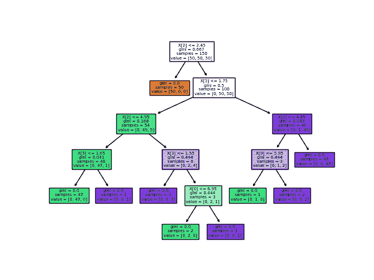
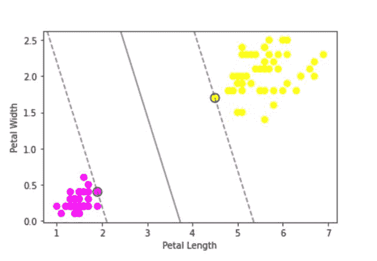
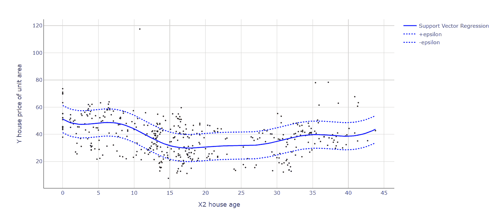
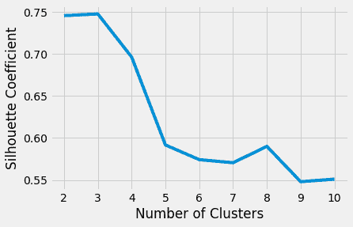
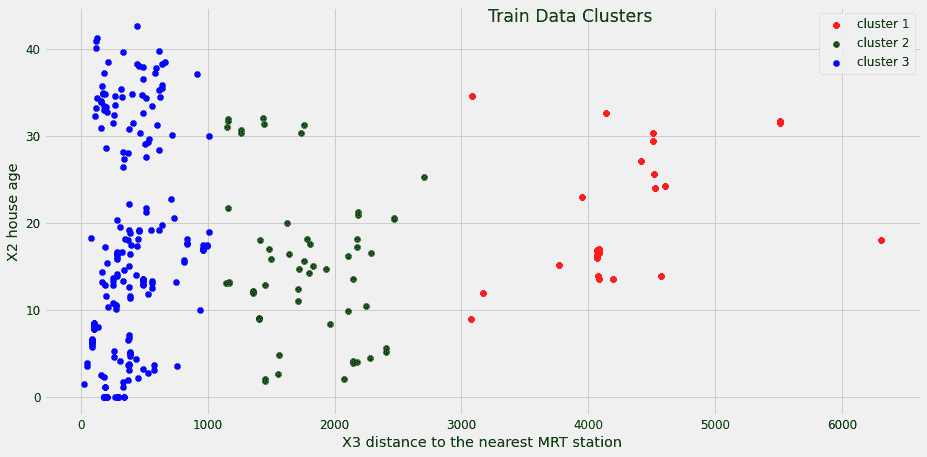
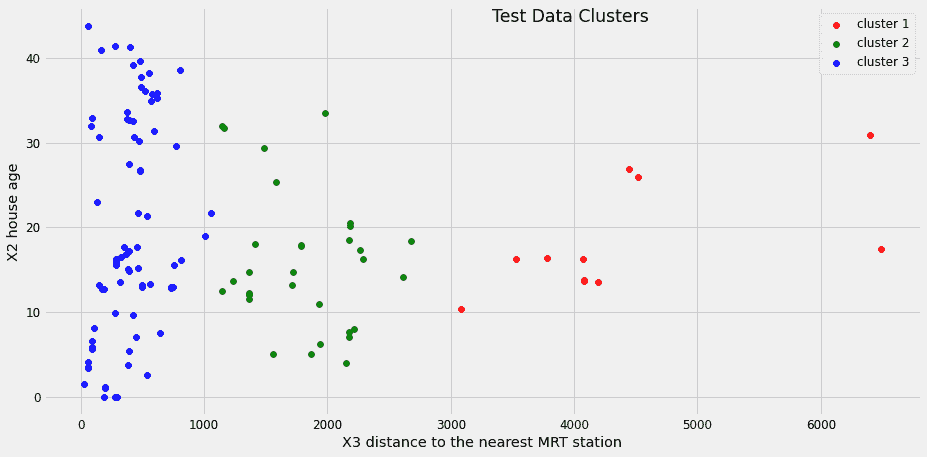
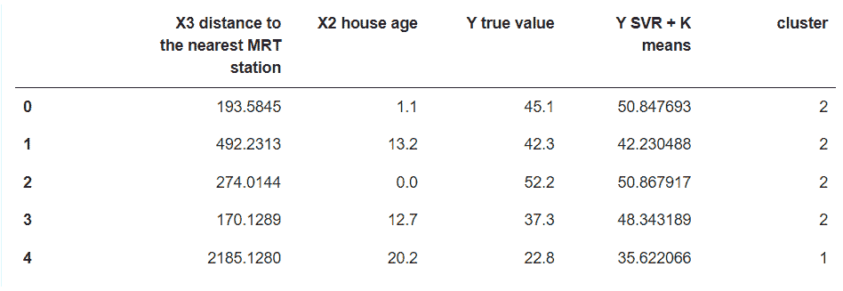

# 用 K-Means 聚类+ SVR 构建 sharp 回归模型

> 原文：<https://blog.paperspace.com/svr-kmeans-clustering-for-regression/>

机器学习算法在架构和用例方面是多样的。我们在机器学习中处理的最常见的问题之一是回归，有时回归分析的复杂性增长到现有算法无法以足够高的精度预测值以部署到生产中的程度。本文深入探讨了回归模型，以及 K-Means 和支持向量回归的组合如何在某些情况下带来一个清晰的回归模型。

### 概观

*   回归
*   线性回归
*   为什么线性回归会失败
*   可供选择的事物
*   支持向量回归
*   k 均值聚类
*   K-Means + SVR 实现
*   结论

## **回归**

一种统计方法，用于使用某些独立变量(X1，X2，..Xn)。简单来说，我们根据影响价值的因素来预测价值。

一个最好的例子就是出租车在线价格。如果我们研究在预测价格中起作用的因素，它们是距离、天气、日子、地区、车辆、燃料价格，等等。很难找到一个等式来提供乘坐的速度，因为这些因素在其中起着巨大的作用。回归通过识别每个特征(我们可以用机器学习术语来称呼它们)的影响程度来拯救我们，并提出一个可以预测乘坐率的模型。现在我们已经了解了回归背后的概念，让我们来看看线性回归。

## **线性回归**


Formula for linear regression

线性回归是网关回归算法，旨在建立一个模型，试图找到自变量(X)和要预测的因变量(Y)之间的线性关系。从视觉的角度来看，我们试图创建一条线，使得与所有其他可能的线相比，点至少离它有距离。线性回归只能处理一个自变量，但是线性回归的扩展，多元回归遵循同样的思路用多个自变量贡献预测 Y. **[详细实现线性回归。](https://madewithml.com/courses/basics/linear-regression/)**


**[Source: Linear Regression Explained A High-Level Overview of Linear Regression Analysis](https://towardsdatascience.com/linear-regression-explained-1b36f97b7572)**

## 为什么线性回归会失败？

尽管线性回归在计算上简单且易于解释，但它也有自己的缺点。只有当数据是线性可分的时候才是优选的。复杂的关系不能这样处理。聚集在一个区域的一组数据点会极大地影响模型，并且可能会出现偏差。现在我们已经理解了什么是回归以及基本的回归是如何工作的，让我们深入研究一些替代方案。

## 决策图表

决策树是这样一种树，其中每个节点代表一个特征，每个分支代表一个决策。结果(回归的数值)由每片叶子表示。决策树能够捕捉特征和目标变量之间的非线性交互。决策树很容易理解和解释。其中一个主要特点是它们在视觉上很直观。他们还能够处理数字和分类特征。



[**Source: scikit-learn Decision Trees**](https://scikit-learn.org/stable/modules/tree.html)

使用决策树的一些缺点是它容易过度适应。即使是数据中很小的变化也会导致不稳定，因为在这个过程中树结构可能会发生剧烈的变化。

## 随机森林回归

随机森林是朝着同一目标工作的多个决策树的组合。用随机选择的替换数据来训练每个树，并且每个分裂限于随机选择的用于分离数据的替换的可变 *k* 特征。

在大多数情况下，这种算法比单一的决策树更有效。有了多棵树，这些变化实际上有助于不带任何偏见地处理新数据。实际上，这允许从非常弱的学习者的集合中创建强的学习者。最终回归值是所有决策树结果的平均值。当试图用所有的树达到更高的性能时，巨大的树会带来某些缺点，比如执行速度慢。它还占据了巨大的内存需求。

## 支持向量回归

既然我们已经研究了大部分的回归算法，那么让我们来研究一下我们在本文中关注的算法。支持向量回归(SVR)是最好的回归算法之一，它专注于处理总体误差，并试图比线性回归等算法更好地避免异常值问题。在我们学习支持向量机之前，我们应该先了解一下什么是支持向量机，因为支持向量机的思想就是从这里产生的。

### 支持向量机

支持向量机的目标是在 N 维向量空间中提出一个超平面，其中 N 是所涉及的特征的数量。这个超平面被期望对我们提供的数据点进行分类。这是一种很好的分类算法，在许多情况下，它比逻辑回归更好，因为超平面使数据点远离，而不是仅仅用一条细线作为边界。这里的想法是将数据点保持在平面的任一侧，落在平面内的数据点是这里的异常值。

核是支持向量机性能背后的主要因素，支持向量机对维度进行降维，从而将其转换为线性方程。它还成功地相对较好地扩展到高维数据。标准特征中两点之间的内积由内核返回。SVM 中有不同类型的核函数。

**高斯核**用于在没有数据先验知识的情况下进行变换。当数据是线性可分时，使用**线性核**。特征空间中的数据训练集中的向量在核中使用的原始变量的多项式上的相似性由**多项式核**表示。这些是一些流行的内核，还有更多可以探索和实验的。让我们看看 SVM 的一个小实现，以及使用著名的[虹膜数据集](https://archive.ics.uci.edu/ml/datasets/iris)的超平面的可视化。

```py
import seaborn as sns
from sklearn.svm import SVC 
import matplotlib.pyplot as plt
import numpy as np

# Creating dataframe to work on
iris = sns.load_dataset("iris")
y = iris.species
X = iris.drop('species',axis=1)
df=iris[(iris['species']!='versicolor')]
df=df.drop(['sepal_length','sepal_width'], axis=1)

# Converting categorical vlaues to numericals
df=df.replace('setosa', 0)
df=df.replace('virginica', 1)

# Defining features and targer
X=df.iloc[:,0:2]
y=df['species']

# Building SVM Model using sklearn
model = SVC(kernel='linear', C=1E10)
model.fit(X, y)

# plotting the hyperplane created and the data points' distribution
ax = plt.gca()
plt.scatter(X.iloc[:, 0], X.iloc[:, 1], c=y, s=50, cmap='spring')
ax.set(xlabel = "Petal Length",
       ylabel = "Petal Width")
xlim = ax.get_xlim()
ylim = ax.get_ylim()

xx = np.linspace(xlim[0], xlim[1], 30)
yy = np.linspace(ylim[0], ylim[1], 30)
YY, XX = np.meshgrid(yy, xx)
xy = np.vstack([XX.ravel(), YY.ravel()]).T
Z = model.decision_function(xy).reshape(XX.shape)

ax.contour(XX, YY, Z, colors='k', levels=[-1, 0, 1], alpha=0.5,
           linestyles=['--', '-', '--'])

ax.scatter(model.support_vectors_[:, 0], model.support_vectors_[:, 1], s=100,
           linewidth=1, facecolors='none', edgecolors='k')
plt.show()
```



Support Vector Machine Visualization showing the different feature spaces for two of the target categorizations for the Iris dataset. 

### 了解 SVR

支持向量回归使用支持向量机背后的相同原理。SVR 还在 N 维向量空间中构建超平面，其中 N 是所涉及的特征的数量。我们的目标不是让数据点远离超平面，而是让数据点在超平面内进行回归。其中一个可调参数是****ε****(ε)，这是我们在特征空间中创建的管的宽度。我们超调的下一个正则化参数是 C，它控制“松弛度”(ξ)，测量到管外点的距离。在开始结合 K-Means 聚类和 SVR 之前，让我们先来看一个简单的 SVR 实现和可视化。这里我们使用来自 Kaggle 的[房地产价格数据集](https://www.kaggle.com/quantbruce/real-estate-price-prediction?select=Real+estate.csv)。

```py
import pandas as pd
import numpy as np
from sklearn.svm import SVR # for building support vector regression model
import plotly.graph_objects as go # for data visualization
import plotly.express as px # for data visualization

# Read data into a dataframe
df = pd.read_csv('Real estate.csv', encoding='utf-8')
X=df['X2 house age'].values.reshape(-1,1)
y=df['Y house price of unit area'].values

# Building SVR Model
model = SVR(kernel='rbf', C=1000, epsilon=1) # set kernel and hyperparameters
svr = model.fit(X, y)

x_range = np.linspace(X.min(), X.max(), 100)
y_svr = model.predict(x_range.reshape(-1, 1))

plt = px.scatter(df, x=df['X2 house age'], y=df['Y house price of unit area'], 
                 opacity=0.8, color_discrete_sequence=['black'])

# Add SVR Hyperplane
plt.add_traces(go.Scatter(x=x_range,
	y=y_svr, name='Support Vector Regression', line=dict(color='blue')))
plt.add_traces(go.Scatter(x=x_range,
	y=y_svr+10, name='+epsilon', line=dict(color='blue', dash='dot')))
plt.add_traces(go.Scatter(x=x_range,
	y=y_svr-10, name='-epsilon', line=dict(color='blue', dash='dot')))

# Set chart background color
plt.update_layout(dict(plot_bgcolor = 'white'))

# Updating axes lines
plt.update_xaxes(showgrid=True, gridwidth=1, gridcolor='lightgrey', 
                 zeroline=True, zerolinewidth=1, zerolinecolor='lightgrey', 
                 showline=True, linewidth=1, linecolor='black')

plt.update_yaxes(showgrid=True, gridwidth=1, gridcolor='lightgrey', 
                 zeroline=True, zerolinewidth=1, zerolinecolor='lightgrey', 
                 showline=True, linewidth=1, linecolor='black')

# Update marker size
plt.update_traces(marker=dict(size=3))

plt.show()
```



Support Vector Regression Visualization

这里我们可以看到，尽管数据点是非线性分布的，但是 SVR 用超平面巧妙地处理了它。与其他回归算法相比，当我们有不止一个特征时，这种影响甚至更加明显。现在我们已经对 SVR 有了一个很好的介绍，让我们来探索 K-Means + SVR 的惊人组合，它可以在正确的回归环境下创造奇迹。

## k 均值聚类

K-Means 聚类是一种流行的用于聚类数据的无监督机器学习算法。对数据点进行聚类的算法如下:

*   首先，我们定义一些集群，这里设它为 K
*   随机选择 K 个数据点作为聚类的质心
*   根据到任一聚类的欧氏距离对数据进行分类
*   通过利用数据点来更新每个聚类中的质心
*   重复从步骤 3 开始的步骤一定次数(超参数:max_iter)

尽管这看起来很简单，但是有很多方法可以优化 K-Means 聚类。这包括正确选择初始化质心的点等等。我们将在下面讨论其中的一个，轮廓系数，它给出了从多少个簇中选择的好主意。

### 实现 K 均值聚类+支持向量回归

我们将使用来自 Kaggle 的相同的[房地产价格数据集](https://www.kaggle.com/quantbruce/real-estate-price-prediction?select=Real+estate.csv)来实现。这里我们的独立变量是“X3 到最近的捷运站的距离”和“X2 房子的年龄”。“单位面积的房价”是我们预测的目标变量。让我们首先将数据点可视化，以定义对集群的需求。

```py
import pandas as pd # for data manipulation
import numpy as np # for data manipulation
import matplotlib.pyplot as plt

# Read data into a dataframe
df = pd.read_csv('Real estate.csv', encoding='utf-8')

# Defining Dependent and Independant variable
X = np.array(df[['X3 distance to the nearest MRT station','X2 house age']])
Y = df['Y house price of unit area'].values

# Plotting the Clusters using matplotlib
plt.rcParams['figure.figsize'] = [14, 7]
plt.rc('font', size=14)

plt.scatter(df['X3 distance to the nearest MRT station'],df['X2 house age'],label="cluster "+ str(i+1))
plt.xlabel("X3 distance to the nearest MRT station")
plt.ylabel("X2 house age")
plt.legend()
plt.show()
```


Distribution of the Real Estate Prices House Ages (years) agains the Distance to the Nearest MRT station

显然，数据点的分布不适合包含它们的超平面。让我们使用 K-均值聚类对它们进行聚类。在我们开始之前，我们可以使用剪影系数来确定我们需要的能够将数据点准确保持在选定数量的聚类中的聚类数量。更好的轮廓系数或分数意味着更好的聚类。它表示集群之间的距离。最高分 1 表示聚类彼此相距很远，也可以清楚地区分，分 0 表示聚类之间的距离不明显，分-1 表示聚类分配不正确。

让我们首先评估数据点的轮廓系数。我们将把数据分成训练和测试，从这里开始向我们的最终目标前进。将对训练数据执行聚类。

```py
from sklearn.model_selection import train_test_split
from sklearn.cluster import KMeans
from sklearn.metrics import silhouette_score
import statistics
from scipy import stats

X_train, X_test, Y_train, Y_test = train_test_split(
 X, Y, test_size=0.30, random_state=42)

silhouette_coefficients = []

kmeans_kwargs= {
    "init":"random",
    "n_init":10,
    "max_iter":300,
    "random_state":42
}

for k in range(2, 11):
    kmeans = KMeans(n_clusters=k, **kmeans_kwargs)
    kmeans.fit(X_train)
    score = silhouette_score(X_train, kmeans.labels_)
    silhouette_coefficients.append(score)

# Plotting graph to choose the best number of clusters
# with the most Silhouette Coefficient score

import matplotlib.pyplot as plt

plt.style.use("fivethirtyeight")
plt.plot(range(2, 11), silhouette_coefficients)
plt.xticks(range(2, 11))
plt.xlabel("Number of Clusters")
plt.ylabel("Silhouette Coefficient")
plt.show()
```



Silhouette Coefficient Scores vs Clusters

我们可以得出结论，使用 3 个集群，我们可以实现更好的集群。让我们继续对训练集数据进行聚类。

```py
from sklearn.cluster import KMeans
import matplotlib.pyplot as plt
import pandas as pd # for data manipulation
import numpy as np # for data manipulation

# Instantiate the model: KMeans from sklearn
kmeans = KMeans(
    init="random",
    n_clusters=3,
    n_init=10,
    max_iter=300,
    random_state=42
)

# Fit to the training data
kmeans.fit(X_train)

train_df = pd.DataFrame(X_train,columns=['X3 distance to the nearest MRT station','X2 house age'])

# Generate out clusters
train_cluster = kmeans.predict(X_train)

# Add the target and predicted clusters to our training DataFrame
train_df.insert(2,'Y house price of unit area',Y_train) 
train_df.insert(3,'cluster',train_cluster) 
n_clusters=3
train_clusters_df = []
for i in range(n_clusters):
    train_clusters_df.append(train_df[train_df['cluster']==i])

colors = ['red','green','blue']
plt.rcParams['figure.figsize'] = [14, 7]
plt.rc('font', size=12)

# Plot X_train again with features labeled by cluster
for i in range(n_clusters):
  subset = []
  for count,row in enumerate(X_train):
      if(train_cluster[count]==i):
        subset.append(row)

  x = [row[0] for row in subset]
  y = [row[1] for row in subset]
  plt.scatter(x,y,c=colors[i],label="cluster "+ str(i+1))
plt.title("Train Data Clusters", x=0.6, y=0.95)
plt.xlabel("X3 distance to the nearest MRT station")
plt.ylabel("X2 house age")
plt.legend()
plt.show()
```



Train Data Clusters visualization

### 为集群构建 SVR

现在，让我们继续为每个集群构建 SVR 模型。我们在这里不关注 SVR 的过度调节。如果需要，可以使用 gridsearch 尝试各种参数值的组合。

```py
import pandas as pd
import numpy as np
from sklearn.svm import SVR

n_clusters=3
cluster_svr = []
model = SVR(kernel='rbf', C=1000, epsilon=1)

for i in range(n_clusters):
    cluster_X = np.array((train_clusters_df[i])[['X3 distance to the nearest MRT station','X2 house age']])
    cluster_Y = (train_clusters_df[i])['Y house price of unit area'].values
    cluster_svr.append(model.fit(cluster_X, cluster_Y))
```

让我们定义一个函数来预测房价(Y ),方法是首先预测聚类，然后预测具有相应 SVR 的值。

```py
def regression_function(arr, kmeans, cluster_svr):
    result = []
    clusters_pred = kmeans.predict(arr)
    for i,data in enumerate(arr):
        result.append(((cluster_svr[clusters_pred[i]]).predict([data]))[0])
    return result,clusters
```

现在，我们已经构建了用于预测的端到端流，并构建了所需的模型，我们可以继续在我们的测试数据上进行尝试。让我们首先使用我们构建的 K 均值聚类来可视化测试数据的聚类，然后使用我们上面编写的函数使用相应的 SVR 来找到 Y 值。

```py
from sklearn.cluster import KMeans
import matplotlib.pyplot as plt

# calculating Y value and cluster
Y_svr_k_means_pred, Y_clusters = regression_function(X_test,
	kmeans, cluster_svr)

colors = ['red','green','blue']
plt.rcParams['figure.figsize'] = [14, 7]
plt.rc('font', size=12)

n_clusters=3

# Apply our model to clustering the remaining test set for validation

for i in range(n_clusters):
  subset = []
  for count,row in enumerate(X_test):
      if(Y_clusters[count]==i):
        subset.append(row)

  x = [row[0] for row in subset]
  y = [row[1] for row in subset]
  plt.scatter(x,y,c=colors[i],label="cluster "+ str(i+1))
plt.title("Test Data Clusters", x=0.6, y=0.95)
plt.xlabel("X3 distance to the nearest MRT station")
plt.ylabel("X2 house age")
plt.legend()
plt.show() 
```



Test data clusters

我们可以清楚地看到，我们已经为测试数据获得了明确的聚类，并且还获得了 Y 值，并且已经存储在 **Y_svr_k_means_pred 中。**让我们将结果和数据与集群一起存储到一个数据框中。

```py
import pandas as pd

result_df = pd.DataFrame(X_test,columns=['X3 distance to the nearest MRT station','X2 house age'])
result_df['Y true value'] =  Y_test
result_df['Y SVR + K means'] = Y_svr_k_means_pred
result_df['cluster'] = Y_clusters
result_df.head()
```



Resulting Data frame's first 5 rows

一些结果非常好，而其他的仍然比线性回归或单独的 SVR 模型所能预测的要好。这只是一个如何处理这类问题的例子，也是 K 均值和 SVR 的例子。这种方法仅在数据点分布不正确且存在集群数据处理范围时表现良好。这是一个只有两个独立变量的例子。如果数量增加，复杂度也会增加，普通算法很难处理这类情况，在这种情况下，尝试这种方法可能会有帮助。

我们这里的方法首先是可视化数据或评估是否有机会进行集群处理。然后对训练数据进行 K- Means 聚类。K-Means 可以使用剪影系数得分进行超调，这将有助于我们为我们的问题获得理想的聚类数。聚类后，我们为每个聚类构建支持向量回归，包括我们构建的所有模型的最终工作流遵循以下思想:首先预测聚类，然后使用该聚类的相应 SVR 模型预测因变量(Y)。

## 结论

回归是机器学习中执行的直接任务之一。尽管如此，要找到合适的算法来构建一个具有足够精度的模型以部署到生产环境中，可能会变得越来越困难。在最终确定一个算法之前，尝试一下大多数算法总是更好的。可能有这样的例子，一个简单的线性回归会创造奇迹，而不是巨大的随机森林回归。对数据及其性质的深刻理解将有助于我们轻松选择算法，可视化也有助于这一过程。本文主要探讨 K-Means 聚类和支持向量回归相结合的可能性。这种方法并不总是适合所有的回归情况，因为它强调聚类的可能性。这种问题的一个很好的例子是土壤湿度预测，因为它可能随季节和许多循环特征而变化，从而产生聚类数据点。K-Means 聚类将我们从对聚类的手动决策中解救出来，并且 SVR 非常好地处理非线性。SVR 和 K-Means 本身都有很多更深入的内容需要探索，包括内核、质心初始化等等，所以我强烈建议您阅读更多相关主题，以获得更好的模型。感谢阅读！