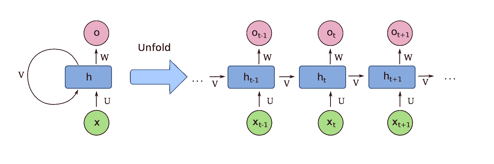
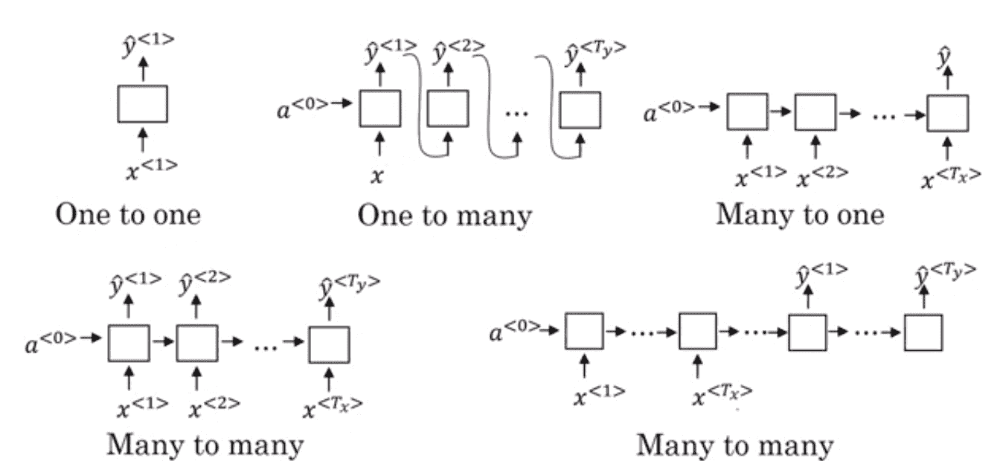
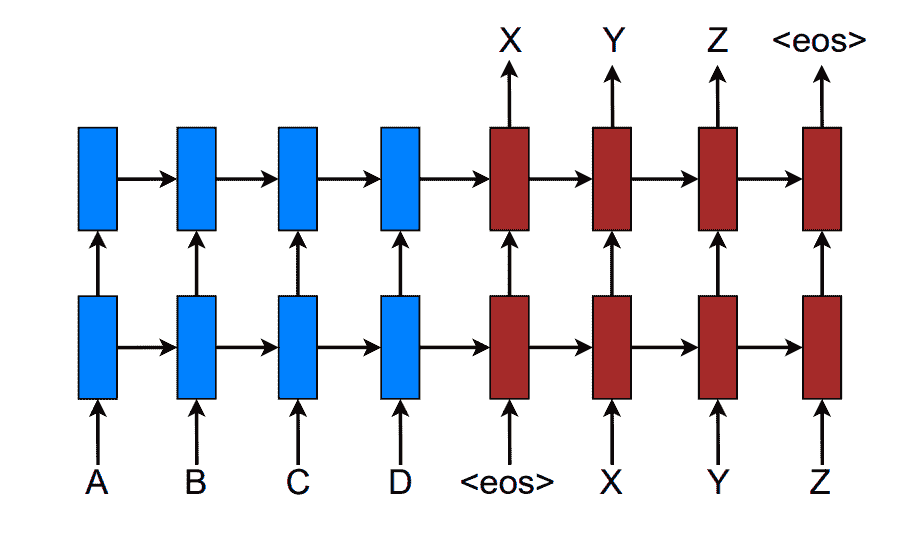
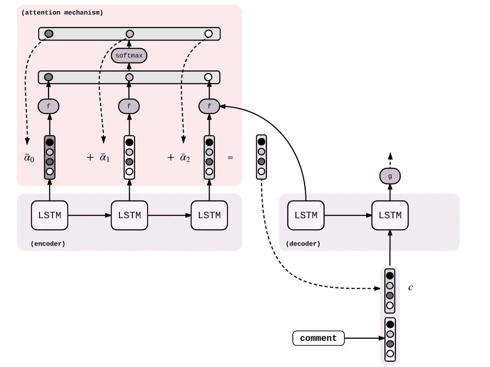
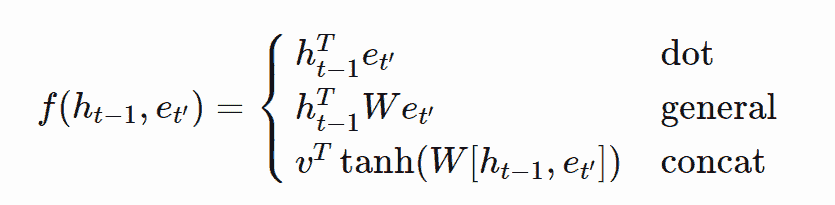

# 具有序列到序列模型和点注意机制的机器翻译

> 原文：<https://blog.paperspace.com/nlp-machine-translation-with-keras/>

自然语言处理是一个重要的研究领域。它被认为是人工智能、语言学和计算机科学的一个子领域。现代人工智能系统通过先进的机器学习、深度学习算法和创新来完成这些 NLP 任务的能力已经导致了越来越多的普及，以及对以下问题实现最佳可能结果的压倒性需求。自然语言处理中的一个流行任务包括找到解决*机器翻译*背后的复杂性的最佳解决方案和方法。

在本文中，我们将学习使用一种流行的深度学习方法(称为序列到序列建模)来处理机器翻译任务的一些基本要求。我们将深入探索 *RNNs* 的概念，以及*编码器-解码器*架构来完成这一特定任务。我们还将研究一些注意力机制，并尝试用最简单的方法解决机器翻译问题，以达到最佳效果。

仅对文章的某些技术部分感兴趣的读者可以使用*目录*来阅读特定主题。然而，为了更简明的理解，最好涵盖所有的概念。

## 简介:

机器翻译是利用人工智能的方法，即深度学习机制(即神经网络架构)，以相对较高的准确性和较低的错误(其他术语中的损失)有效地将一种语言的翻译转换成另一种语言。序列对序列建模是解决机器翻译相关任务的最佳方法之一。这是谷歌翻译用来获得理想结果的早期方法之一。

在本文中，我们将了解一些基本概念，这些概念将帮助我们获得解决机器翻译相关问题的最佳方法背后的强大直觉。首先，我们将讨论一些基本主题，这些主题将作为机器翻译项目的一个强有力的起点。在进入机器翻译模型架构的编码部分之前，我强烈建议读者查看我之前关于 [TensorFlow](https://blog.paperspace.com/absolute-guide-to-tensorflow/) 和 [Keras](https://blog.paperspace.com/the-absolute-guide-to-keras/) 的文章。它们将涵盖接近神经网络架构的编码结构所需的所有信息。

* * *

## 理解递归神经网络；



Image from [Wiki](https://en.wikipedia.org/wiki/Recurrent_neural_network#/media/File:Recurrent_neural_network_unfold.svg)

递归神经网络(RNNs)是一种流行的人工神经网络形式，用于多种任务，如手写识别、语音合成、机器翻译等等。术语循环意味着重复。在 RNN 中，整个神经网络被分成子神经网络，并被馈送到下一组子神经网络。上面显示的图像是一个长序列中递归神经网络的精确表示。

递归神经网络可以捕捉短范围内的相关性，并有可能处理任何长度的信息。构建 RNN 模型体系结构时的 RAM 使用量通常低于其他类型模型(如 n 元模型)中的总 RAM 使用量。权重通过整个递归神经网络组传递。因此，这些网络的计算考虑了所有给定的先前数据。然而，rnn 确实遇到了一个主要问题，因为由于爆炸和消失梯度的问题，它们不能携带长期相关性的相关信息。LSTMs 解决了这个问题，我们稍后将讨论这个问题。

### 培训程序

递归神经网络的训练过程非常简单，通过仔细观察上图就可以理解。与大多数神经网络类似，训练的两个步骤可以分为前向传播和反向传播。在前向传播期间，所产生的单元输出直接等于所使用的函数类型(sigmoid、tanh 或其他类似函数),即权重和输入与先前输出的点积之和。每个时间步长的正向传播阶段的损失函数可计算如下:


递归神经网络的反向传播是在每个相应的时间步长上计算的，而不是在权重上计算的，因为整个子网络形成一个完整的 RNN 网络，并且这些神经网络中的每一个实际上都被分成子网络。每个时间步长上的反向传播损失相对于权重的表示可以计算如下:


### RNN 类型简介



[Image Source](https://iq.opengenus.org/types-of-rnn/)

1.  **一对一(Tx=Ty=1):** 单个输入产生单个输出。通常用于传统的神经网络。
2.  **一对多(Tx=1，Ty > 1):** 给定一个输入，产生多个输出。像音乐生成这样的任务可以利用这样的 RNN。
3.  **多对一(Tx > 1，Ty=1):** 给定多个输入共同产生一个输出。这种 rnn 在情感分析中很有用。
4.  **多对多(相同长度，Tx=Ty):** 在这种 RNN 中，有许多输入产生许多输出，但是输入节点和输出节点的长度是相等的。它们主要用于命名实体识别。
5.  **多对多(长短不一，Tx！=Ty ):** 在这个 RNN 中，有许多输入，产生许多输出，但是输入节点和输出节点的长度不相等。这些类型的 rnn 用于机器翻译的任务。

### 为什么是 LSTMs？

由于爆炸和消失梯度的问题，rnn 在传输长期数据元素方面存在问题。这些问题的解决方案是由**(***)*提供的，这也是一种人工递归神经网络(RNN)架构，用于解决许多复杂的深度学习问题。**

**在今天的机器翻译项目中，我们将利用这些 lstm 构建具有点注意机制的编码器-解码器架构，并展示这些 lstm 如何为解决 rnn 的大多数重复问题奠定基础。如果你想对 LSTMs 背后的理论概念有一个简明的理解，我强烈推荐阅读我的第一部分文章《用时间序列分析预测股票价格》。**

* * *

## **了解编码器-解码器架构:**

**

Image from [Research Paper](https://arxiv.org/pdf/1508.04025.pdf)** 

> **上面的图像显示了一个堆叠递归架构，用于将源序列 A B C D 转换为目标序列 X Y Z。这里，`<eos>`表示一个句子的结束。**

**序列到序列模型通常由编码器和解码器模型组成。编码器和解码器是两个独立的大组件，它们在执行计算时一起工作以产生理想的结果。编码器和解码器模型一起形成序列到序列模型。接收输入序列的过程由编码器完成，解码器具有产生相应目标序列的功能。**

**在编码器中，我们采用与特定向量相关的输入序列。然后，我们通过一堆 LSTMs 运行这个向量序列，并存储最后的隐藏状态。让我们考虑$e$作为最后的隐藏状态编码器表示。对于解码器计算，我们需要在$e$和句子开始标签$wsos$的帮助下计算下一个隐藏状态$h0$。$s0$用于平衡相同大小的向量。然后，我们用 SoftMax 函数计算等价向量概率$p0$。最后，我们计算特定语句的最高概率。**

**$ $ h0 = LSM(e，wsos) $。**

**$$ s0 = g(h0) $$**

**$$ p0 = softmax(s0) $$**

**$$ i0 = argmax(p0) $$**

**对于下一阶段的计算，再次重复这些步骤。下一次计算将利用先前的隐藏状态和权重来计算$h1$。其他步骤基本保持不变。**

**$$ h1 = LSTM(h0，wi1) $$**

**$$ s1 = g(h1) $$**

**$$ p1 = softmax(s1) $$**

**$$ i1 = argmax(p1) $$**

**现在让我们开始理解顺序使用注意力对模型排序的重要性。**

* * *

## **注意力的重要性:**

**

Image From [GitHub](https://guillaumegenthial.github.io/sequence-to-sequence.html)** 

**在使用序列对序列模型时，区分特定任务中的基本组件有时会变得很重要。我将陈述一个计算机视觉和 NLP 任务的例子。对于计算机视觉任务，让我们考虑一幅狗在地上行走的图像。序列对序列模型可以相当容易地识别以下内容。但是在注意力机制的帮助下，我们可以给图像中的基本成分增加更多的权重，这就是狗。类似地，对于 NLP 任务，我们需要更多地关注特定的单词，以便更好地理解上下文。即使在这些情况下，注意力也是有用的。**

**让我们稍微修改一下前面的等式，以增加对我们的结构的关注，并使它适合序列到序列模型架构。修改后的方程如下:**

**$ $ ht = LSTM(ht 1，[wit 1，ct])$$**

**$$st=g(ht)$$**

**$$pt=softmax(st)$$**

**$$it=argmax(pt)$$**

**$ct$是用于在每个解码步骤处理新上下文向量的上下文向量。我们可以计算每个隐藏状态的分数，然后在 SoftMax 函数的帮助下对序列进行归一化。最后，我们计算加权平均值。**

**$ $αt′= f(ht 1，et′)∈R $ $**

**$ $ a =软件最大值(a)$ $ a**

**$ $ CT =∑t′和$**

**注意的类型可以通过考虑功能的选择来分类。在这种情况下，它是$(ht 1，et′)$分量。下面是注意力机制的不同可能性的列表。在机器翻译项目的剩余教程中，我们将使用点注意机制。**

****

**最后，随着我们对一些关键概念的基本理解，我们可以实际实现我们的机器翻译项目。**

* * *

## **使用点注意的序列到序列模型的机器翻译**

**在本文的最后一部分，我们将创建一个完整的工作项目，使用点注意力实现序列到序列模型的机器翻译。借助下面的[链接](https://www.tensorflow.org/tutorials/text/nmt_with_attention)，你可以实现 Bahdanau 注意的结构。然而，我们将使用一种稍微更独特的方法，一步解码器和点注意机制。这种方法将帮助我们更快更好地简化、理解和完成整个项目。让我们从项目的第一步开始:数据集准备。[Jupyter 笔记本和数据集](https://github.com/gradient-ai/Seq-to-Seq-Machine-Translation)将相应提供。**

 **### 数据集准备:

在本文的下一小节中，我们将研究数据集的准备工作。数据预处理是一个相当简单的过程，我们将尝试快速浏览本文的这一部分。机器翻译项目的数据集可以从以下[网站](http://www.manythings.org/anki/)下载。我将利用这个项目的意大利语到英语数据集。我会推荐那些想跟随教程的观众使用相同的数据集。您也可以选择从本文提供的附件中下载数据集。

首先，让我们导入一些我们将用于构建这个项目的基本库。

```py
import tensorflow as tf

import matplotlib.pyplot as plt
import matplotlib.ticker as ticker
from sklearn.model_selection import train_test_split

import unicodedata
import re
import numpy as np
import os
import io
import time
```

一旦完成了所有基本库的导入，清理数据是非常重要的。在接下来的步骤中，我们的主要目标是删除机器翻译任务不需要的任何不必要的信息。下面的代码块用于打开所需的文件并删除无用的数据元素。

```py
file = open("ita.txt", 'r', encoding = "utf8")
raw_data = []

for line in file:
    pos = line.find("CC-BY")
    line = line[:pos-1]

    # Split the data into english and Italian
    eng, ita = line.split('\t')

    # form tuples of the data
    data = eng, ita
    raw_data.append(data)

file.close()

def convert(list): 
    return tuple(list) 

data = convert(raw_data)
```

在下一步中，我们将通过删除冗余空间并将所有内容转换为理想的形式来完成数据集的预处理，以简化机器翻译的过程。我们将通过删除特殊字符并将每个句子填充到最大指定长度来清理句子。最后，我们将在每个句子中添加`<start>`和`<end>`标记。

```py
def unicode_to_ascii(s):
    return ''.join(
        c for c in unicodedata.normalize('NFD', s)
        if unicodedata.category(c) != 'Mn')

def preprocess_sentence(s):
    s = unicode_to_ascii(s.lower())
    s = re.sub(r'([!.?])', r' \1', s)
    s = re.sub(r'[^a-zA-Z.!?]+', r' ', s)
    s = re.sub(r'\s+', r' ', s)

    s = s.strip()
    s = '<start>' +' '+ s +' '+' <end>'
    return s
```

对于机器翻译过程，我们将数据集限制为 30000 个句子。我这样做是为了减少花费的资源数量，以较小的准确性为代价，更快地完成机器翻译的过程。然而，如果你有足够的资源或更多的时间，我建议使用完整的数据集来获得更好的结果。

```py
# Limiting the data and Splitting into seperate lists and add tokens

data = data[:30000]

lang_eng = []
lang_ita = []

raw_data_en, raw_data_ita = list(zip(*data))
raw_data_en, raw_data_ita = list(raw_data_en), list(raw_data_ita)

for i, j in zip(raw_data_en, raw_data_ita):
  preprocessed_data_en = preprocess_sentence(i)
  preprocessed_data_ita = preprocess_sentence(j)
  lang_eng.append(preprocessed_data_en)
  lang_ita.append(preprocessed_data_ita)

def tokenize(lang):
  lang_tokenizer = tf.keras.preprocessing.text.Tokenizer(
      filters='')
  lang_tokenizer.fit_on_texts(lang)

  tensor = lang_tokenizer.texts_to_sequences(lang)

  tensor = tf.keras.preprocessing.sequence.pad_sequences(tensor,
                                                         padding='post')

  return tensor, lang_tokenizer

input_tensor, inp_lang = tokenize(lang_ita)
target_tensor, targ_lang = tokenize(lang_eng)

max_length_targ, max_length_inp = target_tensor.shape[1], input_tensor.shape[1]
```

在下一个代码块中，我们将相应地将数据集分为定型数据和测试数据。分割的比例将是 80:20 的形式。在 30000 个数据元素中，我们将有 24000 个训练元素和它们各自的目标，以及 6000 个测试元素和它们各自的目标预测。最后，我们将把单词映射到一些索引值，作为表示这些值的一种方式。

```py
# Creating training and validation sets using an 80-20 split
input_tensor_train, input_tensor_val, target_tensor_train, target_tensor_val = train_test_split(input_tensor, target_tensor, test_size=0.2)

# Show length
print(len(input_tensor_train), len(target_tensor_train), len(input_tensor_val), len(target_tensor_val))

def convert(lang, tensor):
  for t in tensor:
    if t!=0:
      print ("%d ----> %s" % (t, lang.index_word[t]))

print ("Input Language; index to word mapping")
convert(inp_lang, input_tensor_train[0])
print ()
print ("Target Language; index to word mapping")
convert(targ_lang, target_tensor_train[0])
```

**结果:**

```py
24000 24000 6000 6000
Input Language; index to word mapping
1 ----> <start>
12 ----> la
205 ----> prendero
3 ----> .
2 ----> <end>

Target Language; index to word mapping
1 ----> <start>
4 ----> i
20 ----> ll
43 ----> get
7 ----> it
3 ----> .
2 ----> <end> 
```

然后，我们将继续定义一些参数，这些参数将对训练过程和数据集的整体准备有用。

```py
BUFFER_SIZE = len(input_tensor_train)
BATCH_SIZE = 64
steps_per_epoch = len(input_tensor_train)//BATCH_SIZE

vocab_inp_size = len(inp_lang.word_index)+1
vocab_tar_size = len(targ_lang.word_index)+1

dataset = tf.data.Dataset.from_tensor_slices((input_tensor_train, target_tensor_train)).shuffle(BUFFER_SIZE)
dataset = dataset.batch(BATCH_SIZE, drop_remainder=True)

dataset
```

一旦我们完成了数据预处理步骤，我们就可以继续构建我们的神经网络架构，从编码器结构开始。编码器将包含所需的 LSTMs 结构和嵌入，如前几节讨论的完整神经网络构建。在进入下一个编码部分之前，我强烈建议分别查看一下 [TensorFlow](https://blog.paperspace.com/absolute-guide-to-tensorflow/) 和 [Keras](https://blog.paperspace.com/the-absolute-guide-to-keras/) 的文章，以便对即将到来的代码块进行更多的分析和批判性思考。

### 编码器架构:

从现在开始，我们将为所有模型实现模型子类化方法。我们的编码器架构方法是使用主类编码器。然后，我们将利用几个函数，即 __ *init__ 函数、*初始化状态块和*调用*块*。*在 *init* 块中，我们将定义并初始化所有需要的参数。

在编码器的调用块中，我们定义了一个函数，它接受一个输入序列和编码器的初始状态。输入序列的输入通过嵌入层，最后，嵌入层的输出进入编码器 LSTM。call 函数返回编码器的所有输出，以及隐藏和单元状态的最后时间步长。

初始化状态的最后一个函数用于表示隐藏状态和初始单元状态的初始化，相应地与分配给它的批量大小有关。批量大小为 64 将导致隐藏状态形状*【64，lstm _ units】*和单元状态形状*【64，lstm _ units】*。让我们看看下面的代码块，以便更清楚地了解将要执行的操作。

```py
class Encoder(tf.keras.Model):

    def __init__(self, inp_vocab_size, embedding_size, lstm_size, input_length):
        super(Encoder, self).__init__()

        #Initialize Embedding layer
        #Intialize Encoder LSTM layer

        self.lstm_size = lstm_size
        self.embedding = tf.keras.layers.Embedding(inp_vocab_size, embedding_size)
        self.lstm = tf.keras.layers.LSTM(lstm_size, return_sequences=True, return_state=True)

    def call(self, input_sequence, states):

        embed = self.embedding(input_sequence)
        output, state_h, state_c = self.lstm(embed, initial_state=states)

        return output, state_h, state_c

    def initialize_states(self,batch_size):

        return (tf.zeros([batch_size, self.lstm_size]),
                tf.zeros([batch_size, self.lstm_size]))
```

### 点注意机制:

随着编码器架构的完成，我们将继续研究将在我们的项目中实现的点注意机制。这种注意力方法是最简单的方法之一。然而，如果你愿意的话，你也可以选择借助其他方法来解释你的项目。我还提供了一个示例代码行，它被注释为一般的点注意机制。

为了更直观地理解下面表示的代码块，让我们确定一些基本的特性和特征，以理解正在实现的方法。注意类用于对提供的评分函数进行操作。在这种情况下，我们利用点注意机制。注意类中的第一个函数用于初始化计分函数，并为点注意过程准备调用函数。

在调用函数中，注意机制主要接受当前步骤的两个输入。这两个变量包括解码器的隐藏状态和编码器的所有输出。基于评分函数，在这种情况下，点注意机制，我们将找到解码器和编码器输出的隐藏状态之间的评分或相似性。然后，我们将分数函数与编码器输出相乘，以获得上下文向量。该函数将最终返回上下文向量和注意力权重(即 SoftMax - scores)。

```py
class Attention(tf.keras.layers.Layer):
    def __init__(self,scoring_function, att_units):
        super(Attention, self).__init__()

        self.scoring_function = scoring_function
        self.att_units = att_units

        if self.scoring_function=='dot':
            pass
            # For general, it would be self.wa = tf.keras.layers.Dense(att_units)

    def call(self,decoder_hidden_state,encoder_output):

        if self.scoring_function == 'dot':

            new_state = tf.expand_dims(decoder_hidden_state, -1)
            score = tf.matmul(encoder_output, new_state)
            weights = tf.nn.softmax(score, axis=1)
            context = weights * encoder_output
            context_vector = tf.reduce_sum(context, axis=1)

            return context_vector, weights
```

### 一步解码器:

在这个机器翻译项目的一步解码器中，我们将初始化解码器嵌入层、LSTMs 和任何其他所需的对象。单步解码器以这样的方式被修改，即它将返回必要的权重。让我们通过将其实现过程分解为六个基本步骤来系统地理解一步解码器的过程。这些措施如下:

1.  将 input_to_decoder 传递给嵌入层，然后得到输出(1，1，embedding_dim)。
2.  使用编码器输出和解码器隐藏状态，计算上下文向量。
3.  将上下文向量与步骤 1 的输出连接起来。
4.  将步骤 3 的输出传递给 LSTM/GRU，并获取解码器输出和状态(隐藏和单元状态)。
5.  将解码器输出传递到密集层(vocab 大小)，并将结果存储到输出中。
6.  返回步骤 4 的状态，步骤 5 的输出，步骤 2 的注意力权重。

```py
class One_Step_Decoder(tf.keras.Model):
    def __init__(self, tar_vocab_size, embedding_dim, input_length, dec_units, score_fun, att_units):
        super(One_Step_Decoder, self).__init__()
        # Initialize decoder embedding layer, LSTM and any other objects needed
        self.tar_vocab_size = tar_vocab_size
        self.embedding_dim = embedding_dim
        self.input_length = input_length
        self.dec_units = dec_units
        self.score_fun = score_fun
        self.att_units = att_units
        self.embedding = tf.keras.layers.Embedding(self.tar_vocab_size, self.embedding_dim, 
                                                   input_length=self.input_length)

        self.lstm = tf.keras.layers.LSTM(self.dec_units, return_sequences=True, 
                                         return_state=True)

        self.output_layer = tf.keras.layers.Dense(self.tar_vocab_size)

        self.attention = Attention(self.score_fun, self.att_units)

    def call(self, input_to_decoder, encoder_output, state_h, state_c):

        result = self.embedding(input_to_decoder)

        context_vector, weights = self.attention(state_h, encoder_output)

        concat = tf.concat([tf.expand_dims(context_vector, 1), result], axis=-1)

        decoder_output, hidden_state, cell_state = self.lstm(concat, initial_state=[state_h, state_c])

        final_output = tf.reshape(decoder_output, (-1, decoder_output.shape[2]))
        final_output = self.output_layer(final_output)

        return final_output, hidden_state, cell_state, weights, context_vector
```

### 解码器架构:

解码器架构在即将到来的代码块中构建。该过程包括初始化一个空张量数组，该数组将存储每个时间步的输出。创建一个张量数组，如参考代码块所示，然后继续迭代，直到解码器输入的长度。一旦为 decoder_input 中的每个标记调用了一步解码器，就可以继续将输出存储在张量数组的已定义变量中。最后，确保返回这个张量数组。

```py
class Decoder(tf.keras.Model):
    def __init__(self, out_vocab_size, embedding_dim, output_length, dec_units ,score_fun ,att_units):
        #Intialize necessary variables and create an object from the class onestepdecoder
        super(Decoder, self).__init__()
        self.out_vocab_size = out_vocab_size
        self.embedding_dim = embedding_dim
        self.output_length = output_length
        self.dec_units = dec_units
        self.score_fun = score_fun
        self.att_units = att_units
        self.onestepdecoder = One_Step_Decoder(self.out_vocab_size, self.embedding_dim, self.output_length,
                                               self.dec_units, self.score_fun, self.att_units)

    def call(self, input_to_decoder,encoder_output,decoder_hidden_state,decoder_cell_state):

        all_outputs= tf.TensorArray(tf.float32, size=input_to_decoder.shape[1], name="output_arrays")

        for timestep in range(input_to_decoder.shape[1]):
            output, decoder_hidden_state, decoder_cell_state, weights, context_vector = self.onestepdecoder(
                                                                                    input_to_decoder[:,timestep:timestep+1], 
                                                                                    encoder_output, 
                                                                                    decoder_hidden_state,
                                                                                    decoder_cell_state)

            all_outputs = all_outputs.write(timestep, output)

        all_outputs = tf.transpose(all_outputs.stack(), (1, 0, 2)) 

        return all_outputs
```

### 称编码器解码器架构为:

*encoder_decoder* 类是我们项目的一个附加元素，它简化了整个过程，并将编码器和解码器的元素结合在一起。在这堂课中，我们将定义这一步所需的所有变量。 *init* 块将由编码器和解码器块的初始化组成。*调用*函数用于发送但主要是从所有其他类获取重要信息。

```py
class encoder_decoder(tf.keras.Model):
    def __init__(self, inp_vocab_size, out_vocab_size, embedding_size, lstm_size, 
                 input_length, output_length, dec_units ,score_fun ,att_units, batch_size):

        super(encoder_decoder, self).__init__()

        self.encoder = Encoder(inp_vocab_size, embedding_size, lstm_size, input_length)
        self.decoder = Decoder(out_vocab_size, embedding_size, output_length, 
                               dec_units, score_fun, att_units)

    def call(self, data):

        input_sequence, input_to_decoder = data[0],data[1]
        initial_state = self.encoder.initialize_states(batch_size=64)
        encoder_output, state_h, state_c = self.encoder(input_sequence, initial_state)
        decoder_hidden_state = state_h
        decoder_cell_state = state_c
        decoder_output = self.decoder(input_to_decoder, encoder_output, decoder_hidden_state, decoder_cell_state)

        return decoder_output
```

### 自定义损失函数:

在我们的机器翻译模型的架构构建完成之后，我们需要定义训练模型的过程所需的几个参数。我们将利用 Adam 优化器，并利用损失对象作为稀疏分类交叉熵来计算标签和预测之间的交叉熵损失。下面的代码块简单地展示了如何执行这样的操作。您可以随意尝试其他方法或优化器，看看哪个最适合您的模型。

```py
loss_object = tf.keras.losses.SparseCategoricalCrossentropy(
    from_logits=True, reduction='none')

def loss_function(real, pred):
  mask = tf.math.logical_not(tf.math.equal(real, 0))
  loss_ = loss_object(real, pred)

  mask = tf.cast(mask, dtype=loss_.dtype)
  loss_ *= mask

  return tf.reduce_mean(loss_)

optimizer = tf.keras.optimizers.Adam()
```

### 培训:

接下来的几个代码块将使用点注意处理序列到序列模型的训练的实现。第一个代码块仅包含一些初始化以及后续训练过程的整体计算所需的库调用。由于我的系统上的一些 GPU 限制，我正在利用[纸空间梯度](https://gradient.run)来实现机器翻译项目。从今以后，我使用*！mkdir* 记录创建附加目录的命令。如果您正在 PC 上构建这个模型架构，您可以跳过这一步，或者直接在您的系统中创建一个文件夹/目录。

为了讨论代码块中的更多步骤，我们在 TensorFlow 和 Keras 深度学习框架的帮助下激活回调。检查点是更重要的回调，因为它将使您能够在训练后保存最佳权重，并且您可以导出这个保存的模型以供将来的实例使用。您的预测模型可以使用这个保存的文件进行所需的翻译。我们还定义了一些必要的变量和一些理想的值，以便将它们传递给先前定义的编码器-解码器架构。

```py
!mkdir logs

from tensorflow.keras.callbacks import ModelCheckpoint
from tensorflow.keras.callbacks import TensorBoard

checkpoint = ModelCheckpoint("dot.h5", monitor='val_loss', verbose=1, save_weights_only=True)

logdir='logs'
tensorboard_Visualization = TensorBoard(log_dir=logdir)

input_vocab_size = len(inp_lang.word_index)+1
output_vocab_size = len(targ_lang.word_index)+1

input_len = max_length_inp
output_len = max_length_targ

lstm_size = 128
att_units = 256
dec_units = 128
embedding_size = 300
embedding_dim = 300
score_fun = 'dot'
steps = len(input_tensor)//64
batch_size=64

model = encoder_decoder(input_vocab_size,output_vocab_size,embedding_size,lstm_size,input_len,output_len,dec_units,score_fun,att_units, batch_size)

checkpoint_dir = './training_checkpoints'
checkpoint_prefix = os.path.join(checkpoint_dir, "ckpt")
checkpoint = tf.train.Checkpoint(optimizer=optimizer,
                                 encoder=model.layers[0],
                                 decoder=model.layers[1])
```

下一步，我们将使用教师强制方法对模型架构进行相应的训练。梯度带方法通常用于更容易地训练复杂的结构。我强烈推荐查看我以前关于 TensorFlow 的文章，以便更好地理解这些步骤的功能。为了执行下面的代码块，必须按照前面所述执行数据集准备的所有步骤。举个例子，如果解码器输入是*<开始>Hi How are you*，那么解码器输出应该是*【Hi How are you】结束>*。

```py
@tf.function
def train_step(inp, targ, enc_hidden):
  loss = 0

  with tf.GradientTape() as tape:
    enc_output, enc_hidden,enc_state = model.layers[0](inp, enc_hidden)

    dec_input = tf.expand_dims([targ_lang.word_index['<start>']] * BATCH_SIZE, 1)

    for t in range(1, targ.shape[1]):
      predictions = model.layers[1](dec_input,enc_output,enc_hidden,enc_state)

      loss += loss_function(targ[:, t], predictions)

      dec_input = tf.expand_dims(targ[:, t], 1)

  batch_loss = (loss / int(targ.shape[1]))

  variables = model.layers[0].trainable_variables + model.layers[1].trainable_variables

  gradients = tape.gradient(loss, variables)

  optimizer.apply_gradients(zip(gradients, variables))

  return batch_loss
```

我们将在总共 20 个时期内实施我们的训练程序。您可以按照下面提供的代码块来实现下面的实现。让我们继续来看看在训练机器翻译模型时获得的一些结果。

```py
EPOCHS = 20

for epoch in range(EPOCHS):
  start = time.time()

  enc_hidden = model.layers[0].initialize_states(64)
  total_loss = 0

  for (batch, (inp, targ)) in enumerate(dataset.take(steps_per_epoch)):
    batch_loss = train_step(inp, targ, enc_hidden)
    total_loss += batch_loss

    if batch % 100 == 0:
      print('Epoch {} Batch {} Loss {:.4f}'.format(epoch + 1,
                                                   batch,
                                                   batch_loss.numpy()))

  if (epoch + 1) % 2 == 0:
    checkpoint.save(file_prefix = checkpoint_prefix)

  print('Epoch {} Loss {:.4f}'.format(epoch + 1,
                                      total_loss / steps_per_epoch))
  print('Time taken for 1 epoch {} sec\n'.format(time.time() - start))
```

**结果:**

```py
Epoch 18 Batch 0 Loss 0.2368
Epoch 18 Batch 100 Loss 0.2204
Epoch 18 Batch 200 Loss 0.1832
Epoch 18 Batch 300 Loss 0.1774
Epoch 18 Loss 0.1988
Time taken for 1 epoch 12.785019397735596 sec

Epoch 19 Batch 0 Loss 0.1525
Epoch 19 Batch 100 Loss 0.1972
Epoch 19 Batch 200 Loss 0.1409
Epoch 19 Batch 300 Loss 0.1615
Epoch 19 Loss 0.1663
Time taken for 1 epoch 12.698532104492188 sec

Epoch 20 Batch 0 Loss 0.1523
Epoch 20 Batch 100 Loss 0.1319
Epoch 20 Batch 200 Loss 0.1958
Epoch 20 Batch 300 Loss 0.1000
Epoch 20 Loss 0.1410
Time taken for 1 epoch 12.844841480255127 sec 
```

我们可以观察到，在最后的几个时期，损失从最初的观察值急剧减少。该模型已经过良好的训练，损失逐渐减少，预测的准确性总体上有所提高。如果您有时间、耐心和资源，建议您尝试在整个数据集上实施机器翻译训练程序，以获得更多的历元数。

### 翻译:

我们项目的最后一步是做出必要的预测。翻译过程在预测函数中完成，如下面的代码块所示。主要步骤是获取给定的输入句子，然后使用之前定义的记号化器将句子转换成整数。然后，我们将输入序列传递给编码器，以接收编码器输出、隐藏的最后一个时间步长和前面描述的单元状态。其它步骤，如初始化作为解码器输入的索引和作为一步解码器输入状态的编码器最终状态，也在该步骤中完成。

```py
def predict(input_sentence):

  attention_plot = np.zeros((output_len, input_len))

  input_sentence = preprocess_sentence(input_sentence)

  inputs = [inp_lang.word_index[i] for i in input_sentence.split()]
  inputs = tf.keras.preprocessing.sequence.pad_sequences([inputs],
                                                         maxlen=input_len,
                                                         padding='post')
  inputs = tf.convert_to_tensor(inputs)

  result = ''

  encoder_output,state_h,state_c = model.layers[0](inputs,[tf.zeros((1, lstm_size)),tf.zeros((1, lstm_size))])

  dec_input = tf.expand_dims([targ_lang.word_index['<start>']], 0)

  for t in range(output_len):
   predictions,state_h,state_c,attention_weights,context_vector = model.layers[1].onestepdecoder(dec_input,
                                                                                                 encoder_output,
                                                                                                 state_h,
                                                                                                 state_c)

   attention_weights = tf.reshape(attention_weights, (-1, ))
   attention_plot[t] = attention_weights.numpy()

   predicted_id = tf.argmax(predictions[0]).numpy()

   result += targ_lang.index_word[predicted_id] + ' '

   if targ_lang.index_word[predicted_id] == '<end>':
     return result, input_sentence, attention_plot

   dec_input = tf.expand_dims([predicted_id], 0)

  return result, input_sentence, attention_plot
```

让我们实现一个翻译函数，它将执行预测从意大利语到英语的适当反应的任务。请注意，我没有计算 BLEU 评分图，这也是观众在观察机器翻译模型的工作时可以尝试实现的。下面是机器翻译任务的计算和预测的简单函数。

```py
def translate(sentence):
  result, sent, attention_plot = predict(sentence)

  print('Input: %s' % (sent))
  print('Predicted translation: {}'.format(result))
```

让我们快速测试一下这个函数，看看这个模型是否能产生预期的结果！

```py
translate(u'ciao!')
```

**结果:**

```py
Input: <start> ciao !  <end>
Predicted translation: hello ! <end> 
```

> 我们已经成功地构建了我们的机器翻译模型，借助于序列到序列建模和点注意机制来实现整体低损失和更高的预测准确性。

* * *

## 结论:


Image From [Freepik](https://www.freepik.com/free-vector/modern-cute-chatbot-different-poses-flat-set_13146592.htm#page=1&query=chatbot&position=5)

随着用于执行机器翻译模型的神经网络模型的完整架构构建，我们已经到达了本文的结尾。我们涵盖了基本理解如何从头开始构建机器翻译深度学习模型所需的大多数基本概念。这些主题包括对递归神经网络工作的直观理解、编码器-解码器架构和点注意机制。

最后，我们为机器翻译的任务建立了一个完整的项目，包括完整的代码和理论。更重要的是，我们使用了一种略微独特的单步解码器方法来解决这个问题。数据集和完整的项目将在本文的框架内访问。请随意尝试，并自行分析工作情况。

在接下来的文章中，我们将全面深入地讨论迁移学习等主题，并致力于其他项目，如使用 TensorFlow 进行图像字幕。在那之前，继续探索深度学习和神经网络的世界，继续建立新的项目！**