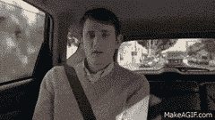
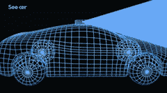
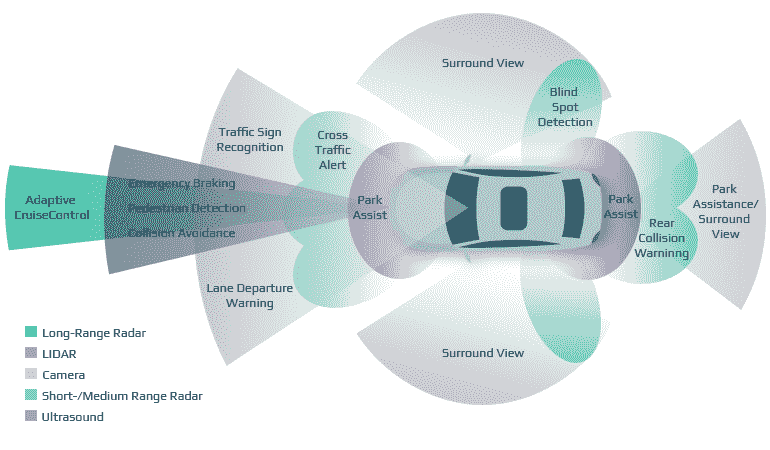
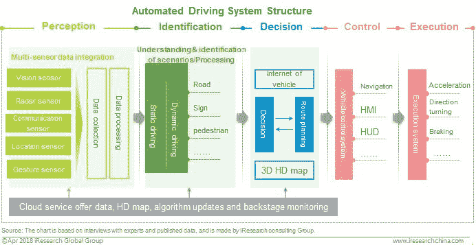
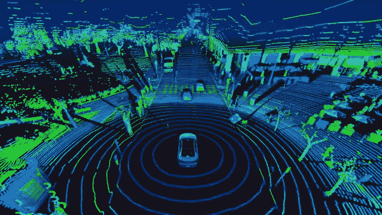
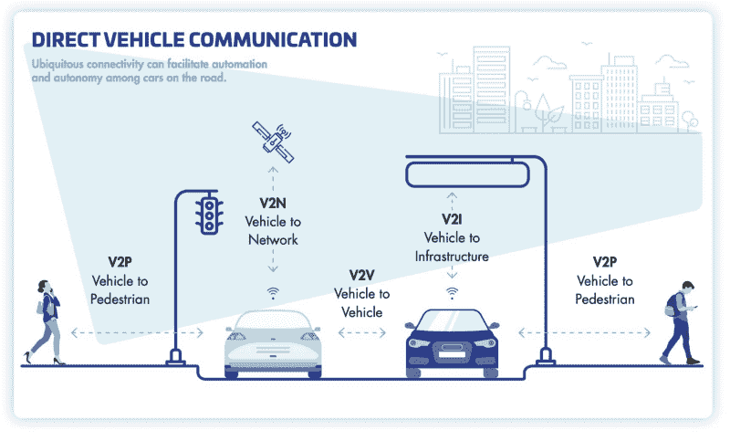
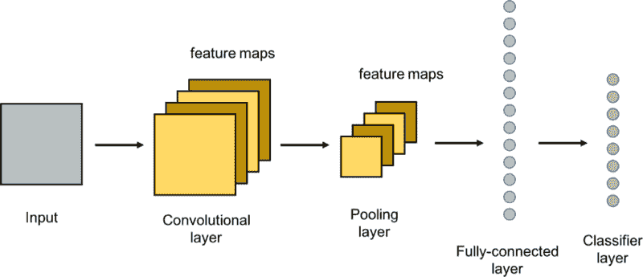
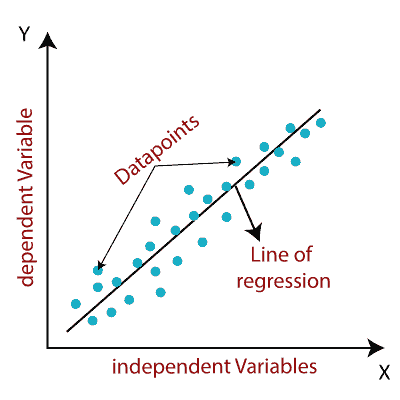
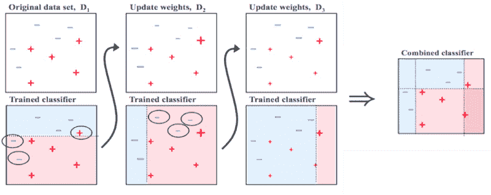
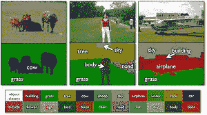

# 自动驾驶汽车理论导论

> 原文：<https://blog.paperspace.com/intro-autonomous-vehicle-theory/>

> “任何足够先进的技术都和魔法没什么区别”~亚瑟·C·克拉克

我记得我被热门电视剧《硅谷》中的一个场景逗乐了，在这个场景中，角色 Jared 被困在一辆自动驾驶汽车中。他的目的地被意外覆盖，汽车试图带他到 Arallon。当他喊道:“汽车先生！车先生！”

自动驾驶汽车从未让我们感到惊讶。虽然我们中的一些人有机会乘坐无人驾驶汽车旅行，但实际上世界上只有一小部分人，大多数人可能不知道无人驾驶汽车是什么，尤其是无人驾驶汽车是如何工作的。本文旨在对此类汽车进行深入介绍。

### 无人驾驶汽车背后的动机

我们距离拥有真正的自动驾驶汽车还有很长的路要走。所谓真正的自动驾驶汽车，我们指的是一辆基本上可以像人类驾驶汽车一样以任何方式驾驶的汽车。这是一件非常难以实现的事情。

主要汽车公司一直试图实现真正的自动驾驶。这一想法背后的主要动机是:

*   更安全的道路
*   生产率增长
*   更经济
*   运动将会更有效率
*   更加环保

致力于这一想法的公司包括但不限于——特斯拉、Pony.ai、Waymo、苹果、起亚现代、福特、奥迪和华为。

### 自动驾驶汽车中使用的基本术语

在我们进入自动驾驶汽车的工作之前，让我们熟悉一下其中使用的常用术语。

#### 1)自治程度

**0 级(无驾驶自动化):**车辆由人类驾驶员手动控制，驾驶员监控周围环境并执行驾驶任务，即加速/减速和转向。集成支持系统，即盲点警告、停车和车道保持辅助系统，属于这一类，因为它们只提供警报，不以任何方式控制车辆。

**1 级(驾驶员辅助):**自动系统辅助转向或加速，但驾驶员会监控道路和车辆参数。自适应巡航控制和自动制动属于这一类

**2 级(部分自动化):**高级驾驶辅助系统(ADAS)可以控制转向和加速。司机依然执行监控任务，随时待命接管车辆。特斯拉 Autopilot 就属于这一类。

**第 3 级(有条件的自动化):**ADAS 被编程为具有环境检测功能，使用来自传感器的输入数据来控制车辆。这种汽车是自动驾驶而不是自主驾驶，可以在特定条件下自动驾驶，但在必要时仍需要人为干预。交通堵塞飞行员就属于这一类。

**第 4 级(高度自动化):**这个级别的自动驾驶车辆具有额外的能力，允许它在 ADAS 出现故障的情况下做出决策。人类乘客必须仍然存在。目前，它们通过地理围栏被限制在特定区域。它旨在用于无人驾驶出租车和公共交通，其中车辆行驶固定路线。

**第 5 级(全自动化):**ADAS 可以在不同的驾驶模式下导航和处理不同种类的驾驶条件，无需人工干预。这些车辆可以去任何地方，甚至没有人类乘客。他们预计不会有任何方向盘或踏板。

#### 2)激光雷达

根据维基百科:

> 激光雷达是一种通过用激光瞄准物体并测量反射光返回接收器的时间来确定距离(可变距离)的方法。

在自动驾驶汽车中，激光雷达是汽车的眼睛。它基本上是一个 360 度旋转摄像机，可以检测到任何种类的障碍。

#### **3)自适应**

无人驾驶汽车的自适应行为意味着它可以根据周围环境设置参数。例如，如果汽车周围的交通流量很大，它会自动减慢速度。

#### **4)自动驾驶仪**

自动驾驶仪是一种无需任何手动控制就能自动控制车辆行驶的系统。它不仅用于自动驾驶汽车，还用于飞机和潜艇。

### 自动驾驶汽车的工作

自动驾驶汽车由三个必不可少的部分组成:车辆、系统硬件和驾驶软件。硬件和软件的完美结合实现了安全驾驶。一系列连续的步骤将前一步骤的输出作为下一步骤的输入。工作流程可以分为五个不同的阶段:

1.  **感知**:要采取的主要行动是从周围环境中收集数据，这是通过不同种类的传感器“看”和“听”来完成的。三个主要的传感器，相机，雷达和激光雷达，作为人类的眼睛和大脑一起工作。然后，车辆处理原始信息，从中获得意义。计算机视觉是通过卷积神经网络来实现的，以从相机馈送中识别对象。

[Image Source](https://www.intellias.com/sensor-fusion-autonomous-cars-helps-avoid-deaths-road/)

2.**识别:**软件然后处理这些输入，绘制路径，并向车辆的“执行器”发送指令，这些执行器控制加速、制动和转向。硬编码规则、避障算法、预测建模和“智能”物体识别(*即*)。知道自行车和摩托车的区别)帮助软件遵守交通规则和穿越障碍。这些系统通过各种接收器(如相机、雷达、激光雷达和导航地图)收集有关车辆、驾驶员和周围环境的数据，然后分析情况，并在驾驶方面做出适当的决策。这表明车辆需要连接到道路上的其他车辆，以及与道路和条件相关的不同类型信息的整体基础设施。车辆及其系统的相互连接程度，以及与其他车辆和多个信息提供者的连接程度变得非常重要。需要分析这些信息，由此产生的步骤将有助于自动驾驶汽车的决策方面。

[Image Source](https://www.cshia.com/139834.html)

### 硬件组件

硬件组件分为三个主要角色，以完成诸如使用传感器进行观察、使用 V2V 技术进行通信以及通过致动器进行移动等任务。

1.  **传感器融合**:传感器可以被认为类似于人的眼睛，使车辆能够吸收周围环境的信息。为了创建高质量的重叠数据模式，不同的传感器收集不同种类的数据，但一起工作以形成一致的观察系统。对于 360 度画面，来自所有传感器的输入以 1 GB/s 的速度合并。使用的包括:相机，激光雷达，雷达。

[Image Source](https://www.gim-international.com/content/article/multibeam-lidar-for-mobile-mapping-systems)

2. **V2X tech** :这些部件类似于人的嘴巴和耳朵。V2X 代表车辆到一切或车辆到 X，涉及从车辆到与其操作相关的任何对象的信息流，反之亦然。它们旨在允许自动驾驶汽车与另一辆汽车或其他连接系统(如交通灯)进行“对话”。根据目的地，它们可以分为:

*   V2I(车辆到基础设施):汽车和安装在道路旁边的设备之间的数据交换，用于向司机传递交通状况和紧急信息。
*   V2N(车联网):基于云服务的网络接入
*   V2V(车对车):车辆之间的数据交换。
*   V2P(车辆对行人):汽车和行人之间的数据交换。

[Image Source](https://www.thalesgroup.com/en/markets/digital-identity-and-security/iot/industries/automotive/use-cases/v2x)

3.**致动器**:这个部分类似于人类肌肉对大脑发出的神经冲动做出反应。致动器由处理器控制执行物理活动，例如制动和转向。

### 自动驾驶汽车中使用的机器学习算法

#### 软件组件

对于所有意图和目的，软件可以被认为是自动驾驶汽车的大脑。简而言之，在现实生活中训练的算法从传感器获取输入数据，并从中获取意义，以做出必要的驾驶决策。绘制出最合适的路径，并将相关指令传送给执行器。

ADAS 中包含的算法必须引导车辆通过自动驾驶的 4 个主要阶段:

*   感知:通过对象检测和分类以及邻域中的必要参数来分析障碍物
*   定位:定义车辆相对于周围区域的位置
*   规划:考虑感知和定位阶段的数据，规划从当前位置到目的地的最佳路径
*   控制:以适当的转向角和加速度值跟踪轨迹。

[Image Source](https://www.thinkautonomous.ai/blog/?p=sensor-fusion)

#### 卷积神经网络(CNN)

CNN 的是第一选择，当谈到特征提取，由于其高精度。其特点在于卷积层，它通过使用滤波器矩阵或内核执行卷积来减少数据。内核通常是 3×3 或 5×5 像素，在输入图像上滑动，并且在矩阵与其所包围的图像的像素值之间获得数学点积。该结果值被分配到特征图中，该特征图表示关于诸如边或角的特征的数据。更深的层将捕捉更复杂和全面的特征，例如物体的形状。CNN 的输出被提供给激活函数，以在数据之间引入非线性关系。ReLU(整流线性单元)是最常用的一种，因为它收敛很快。max-pooling 层用于数据简化，携带有关图像背景和纹理的信息。总的来说，该模型被训练以在不过度拟合的情况下获得最高的精度，然后被应用到真实世界的情况中进行对象检测和分类。

[Image Source](https://www.researchgate.net/figure/A-simple-convolutional-neural-network-CNN-and-its-main-layers_fig1_339008531)

自动驾驶汽车中使用的特定 CNN 有

*   特斯拉的 HydraNet
*   谷歌 Waymo 的司机网
*   英伟达自动驾驶汽车

#### 尺度不变特征变换

这种算法通过图像匹配和识别来解决部分可见物体的问题，通过提取所讨论的物体的区别特征来实现。例如，考虑一个停止标志的八个角。这些特征不会随着旋转、缩放或噪声干扰而改变，因此它们被认为是比例不变的特征。系统记录并存储对象和特征之间的关系。拍摄图像，将提取的特征与数据库中的 SIFT 特征进行比较。相比之下，车辆因此可以识别物体。

#### 模式识别的数据简化算法

通过传感器融合接收的图像包含不必要的和重叠的数据，这些数据必须被过滤掉。为了确定特定对象类的出现，使用重复模式来帮助识别。这些算法通过将线段拟合到拐角，将圆弧拟合到类似弧形的元素，来帮助减少噪声和不重要的数据。这些线段和圆弧最终组合在一起，形成特定对象类特有的可识别特征。

**自动驾驶汽车使用的具体算法有**

*   主成分分析(PCA):降低数据的维度。
*   支持向量机(SVM):优秀的非概率二元线性分类。
*   梯度方向直方图(HOG):非常适合人体检测
*   你只看一次(YOLO):HOG 的一个替代方案，它根据整个图像的上下文来预测每个图像部分。

#### 聚类算法

由于低分辨率或模糊的图像、间歇或稀疏的数据，分类算法可能很难检测到对象，并且可能会完全错过它们。聚类查找数据中存在的内在结构，以便根据最大数量的共同特征对它们进行分类。

自动驾驶汽车中使用的特定聚类算法有:

*   K-means: k 个质心用于定义不同的聚类。数据点被分配到最近的质心。随后，质心移动到聚类中点的平均值。
*   多类神经网络:涉及使用数据中的固有结构将数据组织成具有最大共享特征的分组。

#### 回归学习算法

与奇异博士不同，这些算法试图预测未来的情景。环境中的重复特征被用于算法的优势，以建立给定图像和特定对象在其中的位置之间的关系的统计模型。计算最少两个变量之间的关系，然后使用回归分析在不同尺度上进行比较。它的依赖关系是回归线的形状、因变量的类型和自变量的数量。最初，模型是离线学习的。当模型处于活动状态时，它对图像进行采样以进行快速检测，从而输出对象的位置及其对该位置的确定性。该模型可进一步应用于其他实体，无需额外建模。

自动驾驶汽车中使用的具体算法有

*   随机森林回归
*   贝叶斯回归
*   神经网络回归

[Image Source](https://automateintellect.com/linear-regression/)

#### 决策算法

顾名思义，确定正确的选择是这些算法的全部内容。多个模型被分别训练和组合以给出具有最小误差的包含性预测。该决策考虑了算法在对象的识别、分类和运动预测中的置信度。

**自适应增强(Adaboost)** 是最流行的算法框架之一。它本质上是将一系列在加权数据上训练的弱学习器(低精度)组合成一个集成，以便所涉及的算法相互补充并提高最终性能，从而获得准确的分类器。

[Image Source](https://www.researchgate.net/figure/Training-of-an-AdaBoost-classifier-The-first-classifier-trains-on-unweighted-data-then_fig3_306054843)

让我们使用上面的图表来理解它是如何工作的。在原始未加权数据集中，正数据点用红色叉号表示，负数据点用蓝色减号表示。第一个模型能够正确地分类三个否定点和四个肯定点，但是也错误地分类一个肯定点和两个否定点。这些错误分类的点被赋予较高的权重，并作为输入来建立第二个模型。第二个模型中的决策边界已经转移，以正确地分类先前的错误，但是在该过程中，错误地分类了三个不同的点。权重被更新以给予新的误分类点更高的值，并且该迭代继续，直到满足指定的条件。我们可以看到，所有模型都有一些错误分类的数据点，因此，它们是弱学习器。通过对模型进行加权平均，这些模型覆盖了其他模型的弱点，并且所有的点都被正确分类，这表明最终的集成模型是强学习器。

**TextonBoost** 工作原理相同。它使用 textons:具有相同特征的图像数据簇，因此对滤波器的响应相同。它将外观、形状和上下文结合在一起，将图像视为一个整体，并收集上下文信息以理解其关系。例如，船像素总是被水像素包围。

[Image Source](https://www.microsoft.com/en-us/research/wp-content/uploads/2016/02/ijcv07a.pdf)

### 自动驾驶汽车面临的挑战

自动驾驶汽车自诞生以来已经走过了漫长的道路，但由于涉及的高风险，必须完美地解决技术和安全挑战。在我们能够在道路上看到这些车辆之前，还有一些障碍需要克服。前面的一些障碍是:

1.  **无法理解复杂的社会互动**:人类驾驶并不完美，驾驶员通常依靠来自周围环境的社交能力来导航，如眼神交流和手势。与骑自行车的人和行人的互动主要需要对机器人仍然缺乏的社交线索和微妙之处做出反应。到目前为止，自动化系统需要能够理解环境，以及为什么他们遇到的人会有这样的行为，以便能够对每个怪癖做出反应。
2.  **不适用于所有天气条件**:在恶劣的天气条件下，自动驾驶汽车将难以解释低能见度情况和失去牵引力。传感器被雪、冰覆盖或被大雨遮挡会降低有效性。此外，厚厚的积雪掩盖了标志和车道标志。传感器上的微型雨刷的解决方案工作良好。
3.  **自动驾驶的地图绘制是复杂的**:在任何自动驾驶汽车能够驾驶之前，它必须需要一个预定义地图的组合，这些地图带有分类的障碍物，用作导航路线的参考。随着时间的推移，区域和道路特征会发生变化，需要不断更新。构建和维护这些 3D 地图是一个耗时的过程，并且需要大量资源。完全自动驾驶的汽车也仅限于完全地图化的区域。
4.  **缺乏基础设施**:必须为这些车辆提供合适的驾驶环境，但这并不总是可行的，尤其是在发展中国家。即使相距 10 公里，道路基础设施也可能不同。向智能基础设施(包括物联网系统、交通灯连接和 V2V)的过渡非常缓慢。
5.  **网络安全问题**:联网汽车中的数字安全是最关键的问题之一。车辆连接得越紧密，就越容易找到攻击系统的方法。人们害怕对汽车软件或部件的网络攻击。
6.  事故责任:事故发生时的责任问题仍在争论中。要么是乘客，要么是制造商。错误可能是致命的，并耗费人的生命。

### 自动驾驶汽车的未来

目前，市场上的自动驾驶汽车主要属于 1 级和 2 级，包括特斯拉。经过严格的测试和研究，3 级原型车正慢慢向公众开放，例如本田有限发布的豪华轿车 Legend。自动驾驶汽车的发展已经取得了惊人的进步；然而，研究人员推测，完全自动驾驶汽车还需要几十年才能实现。即使在生产之后，最初，它们也最有可能在工业中被限制使用，以在固定路线上完成自动化任务。

在自动驾驶汽车日益增长的前景中，另一个需要考虑的角度是它们是否会被用于个人用途或用作服务车辆，如出租车、货运或公共交通。通用汽车等传统公司打算在未来向公众零售这些车辆，而 Waymo、AutoX 和特斯拉等新公司打算运营或已经运营 robotaxis。大众汽车(Volkswagen)等其他公司计划以订阅方式租赁这些车辆，客户按小时付费。谷歌的 Waymo 从 2020 年底开始在美国选定的城市中以每周 1000-2000 次的速度运营 4 级 robotaxis。在一个类似的展览中，AutoX 在上海部署了一支由 75 台机器人组成的车队，向公众开放。在大规模采用之前，这些机器人轴的功能中的许多缺陷和问题仍需要纠正，因为机器人在面对复杂情况时仍需努力。

这起事故涉及一辆特斯拉汽车，造成两人死亡，凸显了围绕自动驾驶汽车的安全不确定性。部署的 2 级车辆中的碰撞被推断为人为错误的结果，但汽车制造商有责任建立考虑到人为疏忽和疏忽因素的自主系统。建造 5 级自动驾驶汽车的技术可能比适当的安全和法律法规更容易获得。公众接受是自动驾驶汽车整合的一个重要因素。人类天生对陌生技术带来的变化抱有偏见。至关重要的是，制定公共安全法规时要考虑赢得公众的信任。