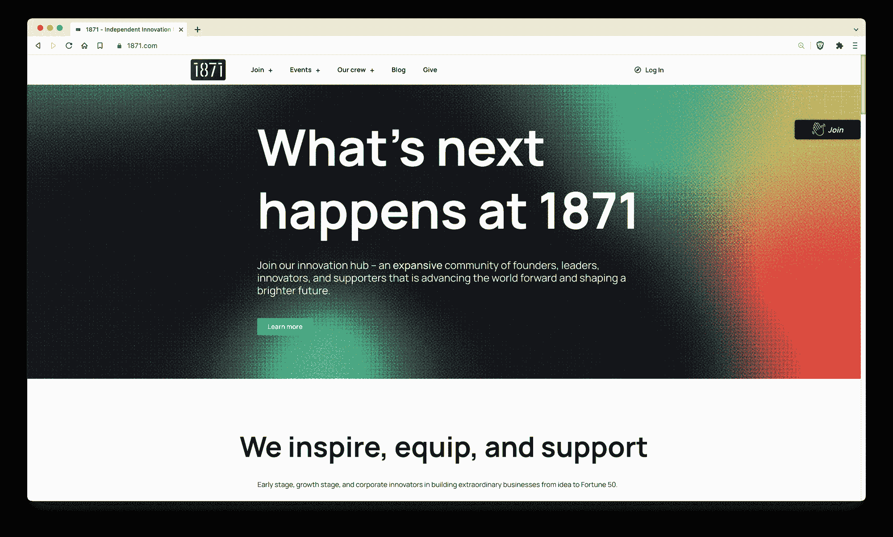
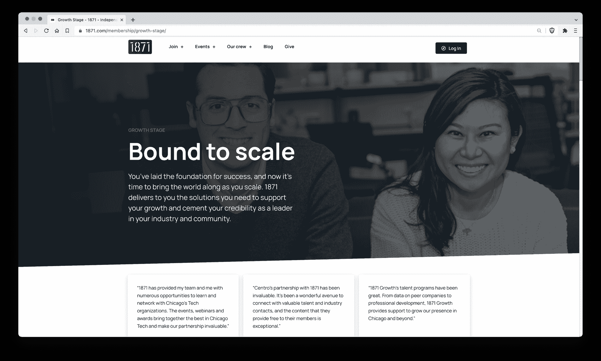

# 芝加哥的一个独立创新中心正在弥合研究和生产机器学习之间的差距

> 原文：<https://blog.paperspace.com/1871-innovation-hub-chicago/>

[1871](https://1871.com/) 是芝加哥的一个非营利创新中心，汇集了在技术前沿建立公司的创始人、创新者和领导者。

我们很高兴能够与 [1871](https://1871.com/) 的常驻人工智能专家和长期合作伙伴 [Alex Castrounis](https://www.whyofai.com/alex-castrounis) 坐在一起，谈论 1871 正在做的一些工作。我们特别感兴趣的是 1871 如何能够在学习机器学习的学生和提供机器学习应用的公司之间建立伙伴关系。

让我们开始吧！

***paper space****:*1871 是芝加哥最大的企业孵化器。你能告诉我们一些关于这个组织的使命吗？

***Castrounis*** : 1871 的存在是为了激励、装备和支持早期、成长期和企业创新者建立非凡的企业，从创意到财富 50 强。一个由创始人、领导者、创新者和支持者组成的庞大社区正在共同推动世界前进，塑造一个更加光明的未来。

1871 is the largest business incubator in Chicago.

***paper space****:*在机器学习和 AI 方面，组织支持什么样的项目或工作？1871 为进入 ML 世界的学生提供了怎样的支持？

*:1871 的独特定位是帮助新兴大学人才和企业之间架起一座桥梁，以解决实际问题，同时在芝加哥发展和留住多样化的技术领先的问题解决人才。*

*特别是在机器学习和人工智能方面，1871 与西北大学和东北伊利诺伊大学合作创建了一个人工智能学生咨询项目，以帮助在芝加哥培养更加多样化和熟练的劳动力，并推动合作伙伴公司的创新。该计划汇集了有才华的学生团队、该领域的专家和希望从事人工智能学习以及应用人工智能和机器学习解决现实世界问题的企业。*

*工作是由来自多所大学的学生组成的团队合作完成的，与传统的实习相反，这些团队更多地以服务提供商-客户式的咨询能力运作。这种模式允许学生直接与来自其他大学和合作公司利益相关方的学生一起工作，同时还发展许多现实世界的软技能和交付相关技能，这些技能在传统实习中通常不会遇到。*

*此外，1871 为学生提供定期编程和支持，帮助他们了解更多的技术世界，并在行业中寻找新的机会，包括为有抱负的程序员举办的[技术挑战](https://1871.com/event/tech-challenge/)、为有抱负的企业家和技术专业人员举办的[实习生&招聘会](https://1871.com/event/intern-job-fair/)和[校园](https://1871.com/event/campus/)。1871 还举办每月虚拟技术讲座，专家们在这里讨论新兴技术的最新进展，过去的话题包括机器学习、无人机等。*

*

“我们提供了 Paperspace Gradient 平台作为开发资源，这使得该计划在时间和成本方面更加高效，同时也使学生能够直接投入到不受限制的开发工作中，而不是花大量时间使用 DevOps 和构建自定义云环境。”

亚历克斯·卡斯特罗尼斯，人工智能专家，1871 年* 

****paper space****:*关于 1871 计划，我们知道的一件事是大学的学生与公司匹配实习——在机器学习的背景下，这是否给了学生一点在应用 ML 工作的机会？让学生了解真实世界的机器学习问题和应用？*

****Castrounis*** :作为计划的一部分，1871 与合作伙伴公司密切合作，提供一份结构良好的问题陈述以及相关的特定领域上下文和资源。给出的问题是公司想要解决的实际问题，并且被特别选择作为人工智能和机器学习解决方案的强有力候选。然后，学生团队在整个项目中进行 AI/ML 研究和动手解决方案开发。*

*这个机会远远超出了在应用 ML 工作的学生。我们让学生团队进行高级人工智能研究，同时直接应用一些最先进的人工智能/人工智能模型和技术来解决问题，包括使用自我监督学习、transformers、LSTMs、XGBoost 和其他高级机器学习技术。*

*在许多情况下，学生已经能够训练和优化在给定问题或任务上表现相对较好的模型，并且已经能够勾画出路线图，为项目群组之外的持续项目开发提供建议。*

****paper space****:*学生需要什么样的资源和工具才能成功？为什么通常很难向学生提供计算机访问？*

****Castrounis*** :拥有“正确的”数据对于几乎任何人工智能/人工智能项目的成功都至关重要。每个群组工作的重要部分都是围绕为下游机器学习训练和建模工作收集和准备数据。*

*除了数据之外，该计划努力做到工具和平台不可知，我们相信使用团队最熟悉的工具和/或最好地完成工作。也许最重要的是，我们希望确保团队不会受到缺乏数据存储或计算相关资源的限制。*

*因此，我们提供了 Paperspace Gradient 平台作为开发资源，这使得该计划在时间和成本方面更加高效，同时也使学生能够直接投入到不受限制的开发工作中，而不是花大量时间使用 DevOps 和构建自定义云环境。*

*由于多种原因，为学生提供计算访问可能会很困难，尤其是当与来自不同大学的协作学生团队合作时，每个大学通常可能会使用不同的工具和内部系统。*

*在某些情况下，学生可能只能通过他们的大学有限地访问大型云提供商服务，尽管此类资源的设置和管理通常非常耗时，需要开发运维相关的专业知识和经验，并且通常超出了计划的范围。*

*

1871 helps early stage and growth stage companies with the resources and expertise they need to succeed.* 

****paper space****:*paper space 参与 1871 年的方式是为学生提供渐变笔记本。学生使用笔记本来深化工作的一些方式是什么？学生是主要在 Jupyter 笔记本上工作，还是在构建自己的开发环境？*

**:渐变平台的笔记本功能已经成为学生团队的一个很好的协作工具。它为基础环境提供了预安装的库和框架，有助于加速开发工作。学生还可以根据给定任务的需要轻松更改计算资源。**

**虽然大多数学生在笔记本上工作，因为它是快速原型和开发的一个很好的工具，但是我们也让学生主要使用在 Jupyter 环境之外执行的 Python 脚本。**

*****paper space****:*关于 1871 生态系统我们还应该知道什么？**

***:作为一个独立的非营利创新中心，我们是美国唯一一家将创始人、领导者、投资者和导师聚集到一个单一、统一的社区的组织。我们提供产品、社区和资源，帮助成员达到新的创造力水平。迄今为止，我们的成员已经筹集了 35 亿美元的风险资本，创造了约 14，500 个工作岗位，850 多家校友公司仍在扩大规模。此外，虽然我们扎根于芝加哥，但我们的业务遍及全球，这意味着会员可以随时随地获得我们的支持和资源。***

******paper space****:*我们的读者参与 1871 的最好方式是什么？有申请流程吗？***

*****Castrounis*** :最好的参与方式是参加每周二举行的[早期信息会议](https://1871.com/event/early-stage-info-session-rolling/)和每月举行的[成长阶段信息会议](https://1871.com/event/growth-stage-info-session/)，我们的团队将讨论你需要了解的关于 1871 的一切，它的好处，以及如何成为会员。**

**欲了解更多信息，请务必登录 [1871 网站](https://1871.com/)。**