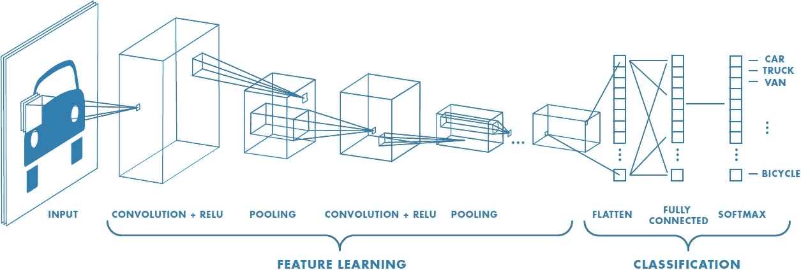
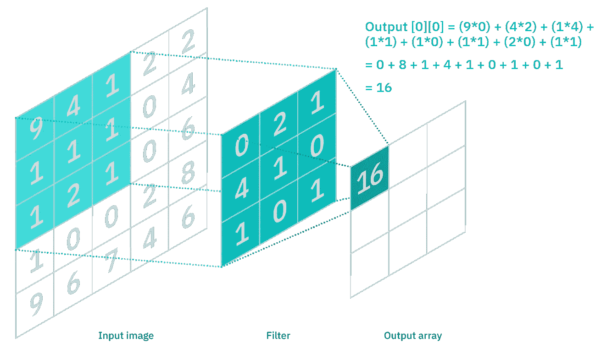
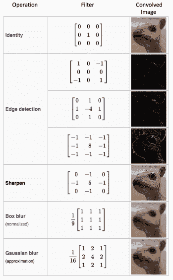
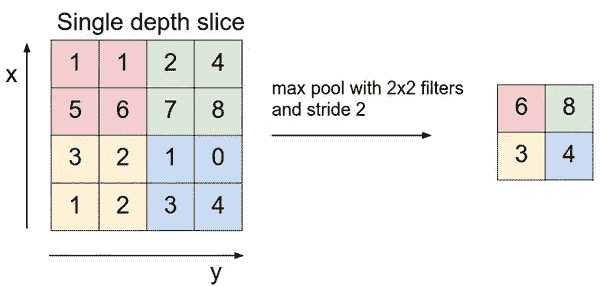
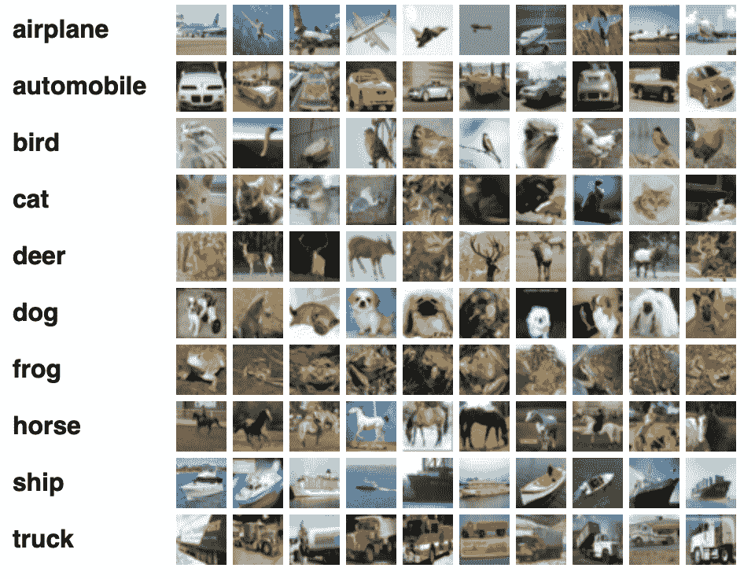
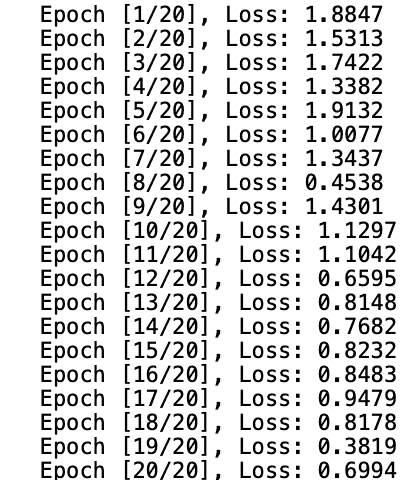
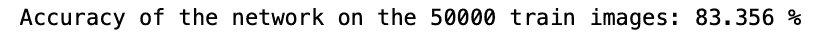

# 用 PyTorch 从头开始编写 CNN

> 原文：<https://blog.paperspace.com/writing-cnns-from-scratch-in-pytorch/>

## 介绍

在本文中，我们将在 PyTorch 中从头开始构建卷积神经网络(CNN ),并在现实世界的数据集上训练和测试它们。

我们将从探索 CNN 是什么以及它们是如何工作的开始。然后我们将研究 PyTorch，并从使用`torchvision`(一个包含各种数据集和与计算机视觉相关的辅助函数的库)加载 CIFAR10 数据集开始。然后我们将从头开始建立和训练我们的 CNN。最后，我们将测试我们的模型。

下面是文章的提纲:

*   介绍
*   卷积神经网络
*   PyTorch
*   数据加载
*   CNN 从零开始
*   设置超参数
*   培养
*   测试

## 卷积神经网络

卷积神经网络(CNN)获取输入图像并将其分类到任何输出类别中。每个图像经过一系列不同的层，主要是卷积层、池层和全连接层。下图总结了一幅图像在 CNN 中的表现:



Source: [https://www.mathworks.com/discovery/convolutional-neural-network-matlab.html](https://www.mathworks.com/discovery/convolutional-neural-network-matlab.html)

### 卷积层

卷积层用于从输入图像中提取特征。它是输入图像和内核(过滤器)之间的数学运算。滤波器通过图像，输出计算如下:



Source: [https://www.ibm.com/cloud/learn/convolutional-neural-networks](https://www.ibm.com/cloud/learn/convolutional-neural-networks)

不同的过滤器用于提取不同种类的特征。下面给出了一些常见的特征:



Source: [https://en.wikipedia.org/wiki/Kernel_(image_processing)](https://en.wikipedia.org/wiki/Kernel_(image_processing))

### 池层

池层用于减小任何图像的大小，同时保持最重要的功能。最常用的池层类型是最大池和平均池，它们分别从给定大小的过滤器(如 2x2、3x3 等)中获取最大值和平均值。

例如，最大池的工作方式如下:



Source: [https://cs231n.github.io/convolutional-networks/](https://cs231n.github.io/convolutional-networks/)

* * *

## PyTorch

PyTorch 是最受欢迎和使用最广泛的深度学习库之一——尤其是在学术研究领域。这是一个开源的机器学习框架，加速了从研究原型到生产部署的过程，我们今天将在本文中使用它来创建我们的第一个 CNN。

* * *

## 数据加载

### 资料组

让我们从加载一些数据开始。我们将使用 [CIFAR-10](https://www.cs.toronto.edu/~kriz/cifar.html) 数据集。该数据集具有 60，000 幅 32px x 32px 的彩色图像(RGB ),属于 10 个不同的类(6000 幅图像/类)。数据集分为 50，000 个训练图像和 10，000 个测试图像。

您可以在下面看到数据集及其类的示例:



Source: [https://www.cs.toronto.edu/~kriz/cifar.html](https://www.cs.toronto.edu/~kriz/cifar.html)

### 导入库

让我们从导入所需的库并定义一些变量开始:

```py
# Load in relevant libraries, and alias where appropriate
import torch
import torch.nn as nn
import torchvision
import torchvision.transforms as transforms

# Define relevant variables for the ML task
batch_size = 64
num_classes = 10
learning_rate = 0.001
num_epochs = 20

# Device will determine whether to run the training on GPU or CPU.
device = torch.device('cuda' if torch.cuda.is_available() else 'cpu') 
```

Importing Libraries

`device`将决定是在 GPU 还是 CPU 上运行训练。

### 数据集加载

为了加载数据集，我们将使用`torchvision`中的内置数据集。它为我们提供了下载数据集和应用任何我们想要的转换的能力。

让我们先看看代码:

```py
# Use transforms.compose method to reformat images for modeling,
# and save to variable all_transforms for later use
all_transforms = transforms.Compose([transforms.Resize((32,32)),
                                     transforms.ToTensor(),
                                     transforms.Normalize(mean=[0.4914, 0.4822, 0.4465],
                                                          std=[0.2023, 0.1994, 0.2010])
                                     ])
# Create Training dataset
train_dataset = torchvision.datasets.CIFAR10(root = './data',
                                             train = True,
                                             transform = all_transforms,
                                             download = True)

# Create Testing dataset
test_dataset = torchvision.datasets.CIFAR10(root = './data',
                                            train = False,
                                            transform = all_transforms,
                                            download=True)

# Instantiate loader objects to facilitate processing
train_loader = torch.utils.data.DataLoader(dataset = train_dataset,
                                           batch_size = batch_size,
                                           shuffle = True)

test_loader = torch.utils.data.DataLoader(dataset = test_dataset,
                                           batch_size = batch_size,
                                           shuffle = True)
```

Loading and Transforming Data

让我们仔细分析这段代码:

*   我们从写一些转换开始。我们调整图像的大小，将其转换为张量，并通过使用输入图像中每个波段的平均值和标准偏差对其进行归一化。你也可以计算这些，但是可以在网上找到。
*   然后，我们加载数据集:训练和测试。我们将 download 设置为 True，以便在尚未下载的情况下下载它。
*   一次将整个数据集加载到 RAM 中不是一个好的做法，这会严重地使您的计算机停机。这就是我们使用数据加载器的原因，它允许您通过批量加载数据来遍历数据集。
*   然后，我们创建两个数据加载器(用于训练/测试),并将批处理大小和 shuffle 设置为 True，这样每个类的图像都包含在一个批处理中。

* * *

## CNN 从零开始

在深入研究代码之前，让我们解释一下如何在 PyTorch 中定义神经网络。

*   首先创建一个新类，它扩展了 PyTorch 的`nn.Module`类。当我们创建神经网络时，这是需要的，因为它为我们提供了一堆有用的方法
*   然后，我们必须定义神经网络的层次。这是在类的`__init__`方法中完成的。我们简单地命名我们的层，然后将它们分配到我们想要的适当的层；例如卷积层、汇集层、全连接层等。
*   最后要做的是在我们的类中定义一个`forward`方法。此方法的目的是定义输入数据通过不同层的顺序

现在，让我们深入代码:

```py
# Creating a CNN class
class ConvNeuralNet(nn.Module):
	#  Determine what layers and their order in CNN object 
    def __init__(self, num_classes):
        super(ConvNeuralNet, self).__init__()
        self.conv_layer1 = nn.Conv2d(in_channels=3, out_channels=32, kernel_size=3)
        self.conv_layer2 = nn.Conv2d(in_channels=32, out_channels=32, kernel_size=3)
        self.max_pool1 = nn.MaxPool2d(kernel_size = 2, stride = 2)

        self.conv_layer3 = nn.Conv2d(in_channels=32, out_channels=64, kernel_size=3)
        self.conv_layer4 = nn.Conv2d(in_channels=64, out_channels=64, kernel_size=3)
        self.max_pool2 = nn.MaxPool2d(kernel_size = 2, stride = 2)

        self.fc1 = nn.Linear(1600, 128)
        self.relu1 = nn.ReLU()
        self.fc2 = nn.Linear(128, num_classes)

    # Progresses data across layers    
    def forward(self, x):
        out = self.conv_layer1(x)
        out = self.conv_layer2(out)
        out = self.max_pool1(out)

        out = self.conv_layer3(out)
        out = self.conv_layer4(out)
        out = self.max_pool2(out)

        out = out.reshape(out.size(0), -1)

        out = self.fc1(out)
        out = self.relu1(out)
        out = self.fc2(out)
        return out
```

CNN

正如我上面解释的，我们首先创建一个继承了`nn.Module`类的类，然后我们分别在`__init__`和`forward`中定义层和它们的执行顺序。

这里需要注意一些事情:

*   `nn.Conv2d`用于定义卷积层数。我们定义它们接收的通道，以及它们应该返回多少以及内核大小。我们从 3 个通道开始，因为我们使用的是 RGB 图像
*   `nn.MaxPool2d`是一个最大池层，只需要内核大小和跨度
*   `nn.Linear`是全连接层，`nn.ReLU`是使用的激活函数
*   在`forward`方法中，我们定义了序列，并且在完全连接的层之前，我们对输出进行整形以匹配完全连接的层的输入

* * *

## 设置超参数

现在让我们为我们的训练目的设置一些超参数。

```py
model = ConvNeuralNet(num_classes)

# Set Loss function with criterion
criterion = nn.CrossEntropyLoss()

# Set optimizer with optimizer
optimizer = torch.optim.SGD(model.parameters(), lr=learning_rate, weight_decay = 0.005, momentum = 0.9)  

total_step = len(train_loader)
```

Hyperparameters

我们首先用类的数量初始化我们的模型。然后我们选择交叉熵和 SGD(随机梯度下降)分别作为我们的损失函数和优化器。这些有不同的选择，但是我发现在实验中这些能产生最大的准确性。我们还定义了变量`total_step`,使不同批次的迭代更加容易。

* * *

## 培养

现在，让我们开始训练模型:

```py
# We use the pre-defined number of epochs to determine how many iterations to train the network on
for epoch in range(num_epochs):
	#Load in the data in batches using the train_loader object
    for i, (images, labels) in enumerate(train_loader):  
        # Move tensors to the configured device
        images = images.to(device)
        labels = labels.to(device)

        # Forward pass
        outputs = model(images)
        loss = criterion(outputs, labels)

        # Backward and optimize
        optimizer.zero_grad()
        loss.backward()
        optimizer.step()

    print('Epoch [{}/{}], Loss: {:.4f}'.format(epoch+1, num_epochs, loss.item())) 
```

Training

这可能是代码中最棘手的部分。让我们看看代码做了什么:

*   我们首先遍历历元数，然后遍历训练数据中的批次
*   我们根据正在使用的设备(即 GPU 或 CPU)来转换图像和标签
*   在正向传递中，我们使用我们的模型进行预测，并根据这些预测和我们的实际标签计算损失
*   接下来，我们进行反向传递，我们实际上更新我们的权重，以改善我们的模型
*   然后，在每次更新之前，我们使用`optimizer.zero_grad()`函数将梯度设置为零
*   然后，我们使用`loss.backward()`函数计算新的梯度
*   最后，我们用`optimizer.step()`函数更新权重

我们可以看到如下输出:



Training Losses

正如我们所看到的，随着越来越多的时代，损失略有减少。这是一个好迹象。但是你可能会注意到它在最后波动，这可能意味着模型过度拟合或者`batch_size`很小。我们将不得不进行测试，以查明发生了什么情况。

* * *

## 测试

现在让我们测试我们的模型。测试的代码与训练没有太大的不同，除了计算梯度，因为我们没有更新任何权重:

```py
with torch.no_grad():
    correct = 0
    total = 0
    for images, labels in train_loader:
        images = images.to(device)
        labels = labels.to(device)
        outputs = model(images)
        _, predicted = torch.max(outputs.data, 1)
        total += labels.size(0)
        correct += (predicted == labels).sum().item()

    print('Accuracy of the network on the {} train images: {} %'.format(50000, 100 * correct / total)) 
```

Testing

我们将代码包装在`torch.no_grad()`中，因为不需要计算任何梯度。然后，我们使用我们的模型预测每一批，并计算它正确预测了多少批。我们得到大约 83%准确率的最终结果:



Accuracy

仅此而已。我们设法在 PyTorch 中从头开始创建了一个卷积神经网络！

* * *

## 结论

我们从学习 CNN 开始——它们有什么样的层以及它们是如何工作的。然后我们介绍了 PyTorch，这是目前最流行的深度学习库之一。我们了解到 PyTorch 如何让我们更容易尝试 CNN。

接下来，我们加载了 CIFAR-10 数据集(一个包含 60，000 幅图像的流行训练数据集)，并对其进行了一些转换。

然后，我们从零开始构建了一个 CNN，并为它定义了一些超参数。最后，我们在 CIFAR10 上训练和测试了我们的模型，并设法在测试集上获得了不错的准确性。