# 音频分析和处理导论:音乐分析

> 原文：<https://blog.paperspace.com/audio-analysis-processing-maching-learning/>

在本系列第一部分的[中，我们探讨了傅里叶变换的理论和实现、短时傅里叶变换、mel 标度、滤波器组、mel 频率倒谱系数以及频谱特征，如频谱质心、频谱带宽和频谱对比度。](https://blog.paperspace.com/introduction-to-audio-analysis-and-synthesis/)

到目前为止，我们还没有尝试去理解任何一种特定的声音。我们采用了一种通用的方法来分析声音，以及任何声音在频域中的表现。在这篇文章中，我们将特别关注音乐。

## 介绍

在上一篇文章中，我们看到了声音是如何在空间中传播的。我们称这些波为纵波，称它们的波动为压缩波和稀疏波。

以吉他为例。在吉他中，这些最终的声波是不同吉他弦振动的结果。所有物体都有一个[自然频率](https://www.physicsclassroom.com/Class/sound/u11l4c.cfm),当被敲击、弹奏或受到其他干扰时，它们会以这个频率振动。

当一个物体被迫以与自然频率共振的方式振动时，这种介质往往会产生我们所说的驻波。[驻波](https://en.wikipedia.org/wiki/Standing_wave)是具有恒定振幅轮廓的波。

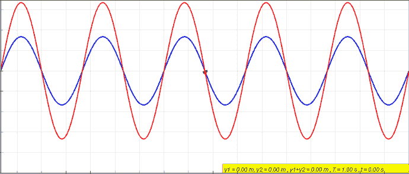

[Standing Waves](https://en.wikipedia.org/wiki/Standing_wave)

X 轴上的峰值总是相同的。零振幅点也是如此。振幅为零的点表示完全没有运动，称为节点。

## 基频和谐波

在介质中产生驻波的频率称为谐波。在非谐波频率下，振动是不规则和不重复的。

任何特定乐器产生的最低频率称为该乐器的基频或一次谐波。基频振动可以表示为具有两个节点的驻波——弦的两端各有一个节点，弦的中心有一个反节点。

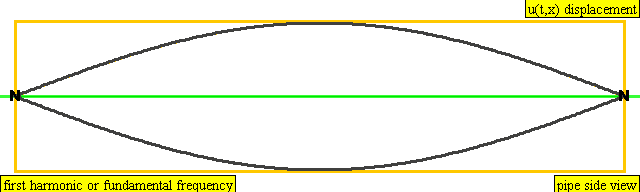

[First Harmonic](https://en.wikipedia.org/wiki/Harmonic)

二次谐波的频率是一次谐波的两倍，而三次谐波的频率是一次谐波的三倍。诸如此类。

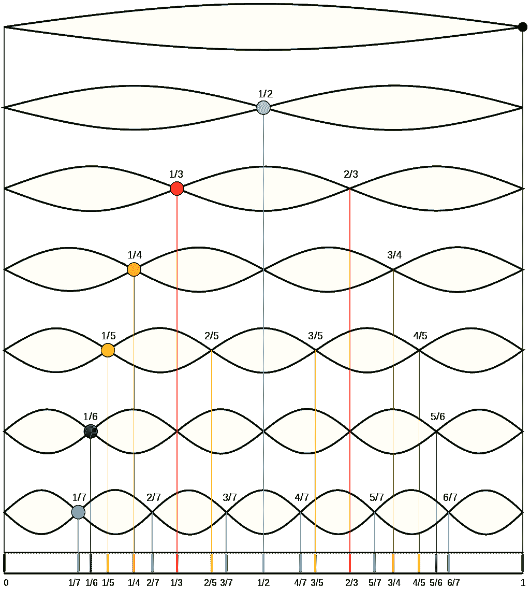

[Harmonics](https://en.wikipedia.org/wiki/Harmonic)

可以在[这里](https://en.wikipedia.org/wiki/Harmonic)找到前四个谐波作为驻波及其纵向对应物的动画形象。

## 音符、八度音阶和频率

某些频率放在一起听起来很悦耳。这样的频率被称为辅音。

在音乐中，音程是衡量不同声音音高差异的一种方式。音乐中的流行音程可以用以下整数比来表示:

1.  齐奏- > 1:1
2.  八度音阶- > 2:1
3.  大调第六- > 5:3
4.  完美的五分之一- > 3:2
5.  完美第四- > 4:3
6.  大三度- > 5:4
7.  小三度- > 6:5

所以你可以说 880 赫兹比 440 赫兹高一个八度。或者，如果 440Hz 是一次谐波，那么 880Hz 是二次谐波。

将两个声音放在一起演奏，可以产生类似[拍](https://en.wikipedia.org/wiki/Beat_(acoustics))的有趣现象。当两种频率略有不同的声音同时播放时，声音的振幅会出现周期性变化，其频率是最初两种频率之间的差异。

$$ f_{beat} = f_{1} - f_{2} $$

在音乐中，频率被分为不同的音高类别。在英语地区，它们由字母表的前 7 个字母表示:A、B、C、D、E、F 和 g。有些人可能也知道这是 Do、re、Mi、Fa、Sol、La 和 Ti，而其他人可能知道这是 Sa、Re、Ga、Ma、Pa、Dha 和 Ni。第八个音符，或八度音，与第一个音符同名，之后该模式再次重复。

今天大多数乐器使用 12 音半音音阶，在对数音阶上将一个八度音阶分成 12 个等间距的部分。每个声部被认为是相隔[半音](https://en.wikipedia.org/wiki/Semitone)——音乐中最小的音程。大多数乐器都被调到平均音阶，中间八度音阶上的音符 A 被调到 440 赫兹。

建立在 c 调基础上的 12 音半音音阶将每个八度音阶中的 12 个音符命名为:c、C♯/D♭、d、D♯/E♭、e、f、F♯/G♭、g、G♯/A♭、a、A♯/B♭和 b

♯发音为升，♭发音为降。升半音意味着高半音，降半音意味着低半音。

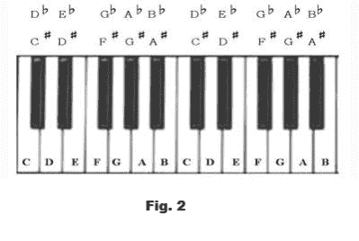

[Chromatic Scale](https://solitaryroad.com/c1060.html)

为了找到中间八度的频率，我们需要找到中间 C 的频率。中间 C 或 C4 的频率是 C5 的一半。

一旦我们有了中间的 C，我们可以创建一个大小为 13 的数组，它在 C4 的 log 和 C5 的 log 之间等距分布。我们还将从数组中移除最后一个元素(在本例中是 C5)。

代码如下所示:

```py
import numpy as np

C5 = 2**np.linspace(np.log2(440), np.log2(880), 13)[3]
freqs = 2**np.linspace(np.log2(C5/2), np.log2(C5), 13)[:-1]
```

产生的频率:

```py
array([261.6255653 , 277.18263098, 293.66476792, 311.12698372,
       329.62755691, 349.22823143, 369.99442271, 391.99543598,
       415.30469758, 440\.        , 466.16376152, 493.88330126])
```

## 色度表示

音高可以分为两个部分:音调高度和色度。

音调高度是八度音程数。例如，中音 C 也被称为 C4。

色度特征，也称为色谱图，提供了一种可视化音乐的强大方法。色度特征与我们刚刚看到的 12 音半音阶中的 7 个音高等级或 12 个音符密切相关。色度表示将任何特定时间声音中存在的所有频率归入 12 个桶中的一个，每个桶表示一个音符。

正如我们所讨论的，比 A 音高一个八度的音仍然是 A 音，即使频率是前一个 A 音的两倍。从 0 到 11 枚举色度特征，C 音符取索引 0，后续索引用高于前一索引的半音填充。

通过用色度滤波器获得 STFT 值的点积并归一化输出，可以将短时傅立叶变换转换成色度表示。

`librosa`可以使用下面的代码片段来可视化过滤器:

```py
chroma_filters = librosa.filters.chroma(sampling_rate, 2048)
fig, ax = plt.subplots(nrows=6, ncols=2, figsize=(12,9))

for i, row in enumerate(ax):
    for j, col in enumerate(row):
        col.plot(chroma_filters[i + j])

plt.show()
```

这些图如下图所示:

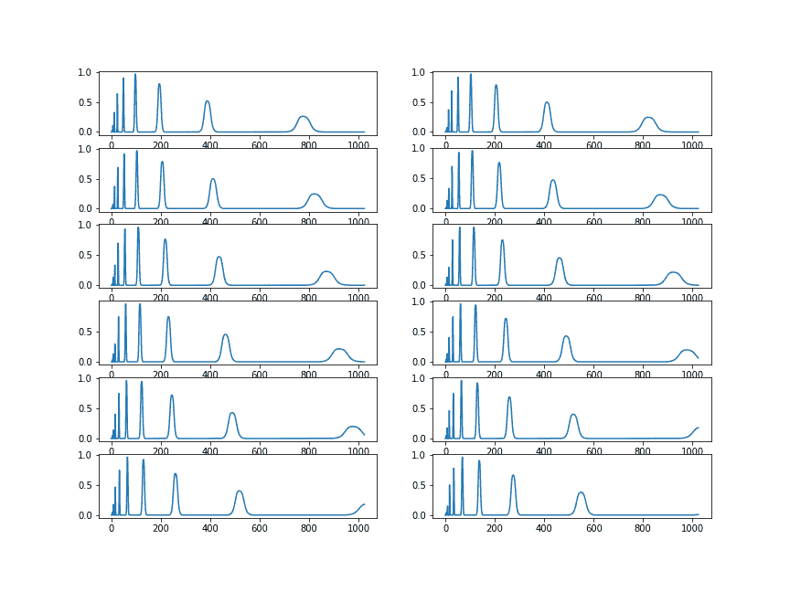

Chroma Filters

我们将使用与本系列第一部分相同的音频样本。

```py
example_name = 'nutcracker' 
audio_path = librosa.ex(example_name)

x, sampling_rate = librosa.load(audio_path, sr=None)
```

您可以使用下面的代码片段通过`librosa`库获得色度表示。

```py
S = librosa.stft(x)**2
chroma = librosa.feature.chroma_stft(S=S, sr=sampling_rate)
fig, ax = plt.subplots(figsize=(15,9))
img = librosa.display.specshow(chroma, y_axis='chroma', 
                               x_axis='time', ax=ax)
fig.colorbar(img, ax=ax)
ax.set(title='Chromagram')
```


Chromagram

## 发病检测

开始检测是指一套方法，允许我们通过声音来定位音符的开始。有几种方法可以做到这一点。它们可以大致分为以下几类:

*   基于能量的方法
*   基于音高的方法
*   基于相位的方法
*   监督学习

### 基于能量的方法

在基于能量的方法中，频谱用于测量时间-频率域中的能量变化。光谱值的一阶差过去曾被用来寻找地震的开始，但并不精确。根据心理声学原理，在较低振幅下可以更好地检测类似的频率变化。相对差分方案有助于我们更好地找到峰值。

例如，频谱 D 可以定义如下:

$ $ d _ { m }(n)= 20log_{10}(|x_m(n)|^{2})-20log_{10}(|x_m(n-1)|^{2})$ $

其中$x_{m}_n)$是输入信号的秘密 stft。

常用的基于能量的检测方法可以归纳如下:

$ $ m = \ frac { 1 } { n } \sum_{m=1}^{n} h(d _ { m }(n))$ $

其中$ H(x) = \frac{x + |x|}{2} $是半波整流器函数，N 是频谱 D 中的频段总数，M 是检测函数。

用移动平均进一步平滑检测函数。应用简单的峰值拾取操作来寻找开始。值超过某个阈值的峰值作为开始返回。

### 基于相位的方法

STFT 可视为带通滤波器，其中$X_m(n)$表示$m^{th} $滤波器的输出。在只有一个稳定的正弦分量通过$m^{th}带通滤波器的情况下，$m^{th}滤波器的输出必须具有恒定或接近恒定的频率。

因此，连续展开相位值之间的差异也必须保持近似恒定。

$ $ \ phi _ { m }(n)-(n-1)\ approx \ phi _ { m }(n-1)-(n-2)$ $

或者

$ $ \ bigtariangleup \ phi _ { m }(n)\ approx \ phi _ { m }(n)-2 \ phi _ { m }(n-1)-(phi _ { m }(n-2)\ approx 0 $ $

在转换过程中，频率不是恒定的。因此＄\ bigtriangleup \ phi _ { m }(n)$往往很高。

### 基于音高的方法

基于音高的方法使用音高特征将声音分成稳态和瞬态部分，使得仅在瞬态部分中发现开始。

在[一个随意的节奏分组](https://link.springer.com/chapter/10.1007/978-3-540-31807-1_6)中，Kristoffer Jensen 提出了一个被称为感知频谱通量的检测函数，其中频带的差异由等响度等值线来衡量。

等响度等高线或[弗莱彻-曼森](https://en.wikipedia.org/wiki/Equal-loudness_contour)曲线是当听者感知到稳定音调的恒定振幅时，声音在频域中的等高线。

$ $ PFS _ { n } = \sum_{m=1}^{n}w(x_{m}(n)^{1/3}-x _ { m }(北 1)^{1/3})$$

$X_{m}$是 STFT 的大小，使用[汉宁窗](https://en.wikipedia.org/wiki/Hann_function)获得。$W$是用于获得更接近人类响度轮廓的值的频率加权，并且功率函数用于模拟强度-响度功率定律。幂函数还减少了随机振幅变化。

### 监督学习

神经网络也被用于检测音频信号中的开始帧。典型的基于神经网络的开始检测管道如下所示:

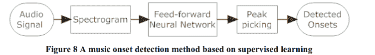

Source: http://eecs.qmul.ac.uk/~josh/documents/2010/Zhou%20Reiss%20-%20Music%20Onset%20Detection%202010.pdf

音频信号首先被转换成它的声谱图。这个声谱图被传递到一个神经网络，该网络试图将每一帧分类为开始或不开始。被分类为开始的那些然后通过像阈值处理那样的峰值拾取操作。

有几种神经网络结构可以用于解决这个问题。最受欢迎的选择是递归网络和卷积神经网络。最近，音频变压器正在成为音乐分类的流行选择。

相同的网络可以重新用于发病检测。 [Miyazaki 等人](http://dcase.community/documents/challenge2020/technical_reports/DCASE2020_Miyazaki_108.pdf)举例来说，使用卷积网络和变压器模块的混合来进行开始检测。

`librosa`在其 API 中具有发作检测功能，可按如下方式使用。

```py
o_env = librosa.onset.onset_strength(x, sr=sampling_rate)
times = librosa.times_like(o_env, sr=sampling_rate)
onset_frames = librosa.onset.onset_detect(onset_envelope=o_env, sr=sampling_rate)

fig, ax = plt.subplots(nrows=2, sharex=True, figsize=(15,9))
librosa.display.specshow(S_dB, x_axis='time', 
                         y_axis='log', ax=ax[0])

ax[0].set(title='Power spectrogram')
ax[0].label_outer()
ax[1].plot(times, o_env, label='Onset strength')
ax[1].vlines(times[onset_frames], 0, o_env.max(), 
             color='r', alpha=0.9,
             linestyle='--', label='Onsets')
ax[1].legend()

plt.savefig('onsets.png')
```

可视化将能够指出通过音频播放新音符的地方的估计位置。

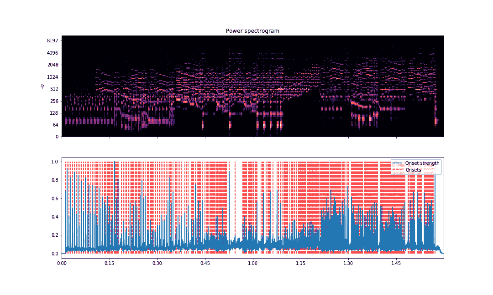

Onset Detection

前五秒的可视化可以这样获得。

```py
o_env = librosa.onset.onset_strength(x, sr=sampling_rate)
total_time = librosa.get_duration(x)
five_sec_mark = int(o_env.shape[0]/total_time*5)
o_env = o_env[:five_sec_mark]
times = librosa.times_like(o_env, sr=sampling_rate)
onset_frames = librosa.onset.onset_detect(onset_envelope=o_env, sr=sampling_rate)

fig, ax = plt.subplots(nrows=2, sharex=True, figsize=(15,9))
librosa.display.specshow(S_dB[:, :five_sec_mark], x_axis='time', 
                         y_axis='log', ax=ax[0])

ax[0].set(title='Power spectrogram')
ax[0].label_outer()
ax[1].plot(times, o_env, label='Onset strength')
ax[1].vlines(times[onset_frames], 0, o_env.max(), 
             color='r', alpha=0.9,
             linestyle='--', label='Onsets')
ax[1].legend()

plt.savefig('onsets-5secs.png')
```

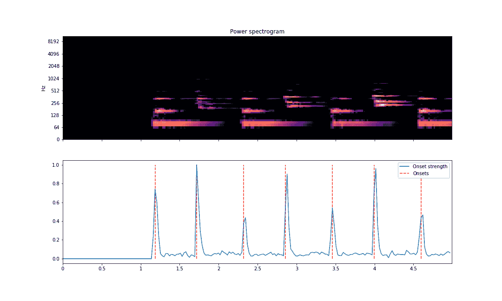

Onset Detection (first five seconds)

正如我们在上面看到的，在发现音符开始的地方，垂直线排列正确。垂直线是相对于幅度曲线绘制的。上面显示的声谱图具有相同的 X 轴，以便直观地比较音符开始。

## 节拍和速度

音乐理论中的一拍是追踪音乐中周期元素的时间单位。你可以把节拍想象成你在听歌时跺跺脚的次数。歌曲的节奏是每分钟的节拍数。在歌曲的过程中，速度可能会改变。

检测节拍和估计歌曲的节奏与开始检测密切相关。通常，检测歌曲的节拍和速度分三步完成:

*   发作检测:基于光谱通量计算发作的位置
*   周期性估计:计算发病位置的周期性模式
*   节拍位置估计:根据开始和周期信息计算节拍的位置

在[音乐信号](https://perso.telecom-paristech.fr/grichard/Publications/ismir04b.pdf)的速度和节拍估计中，作者对谱通量给出了如下定义:

$$ E(m，n) = \sum_{n} h(n - k)G(m，n)$$

其中$h(n)$近似于一个[微分器](https://en.wikipedia.org/wiki/Differentiator)滤波器，并且

$$ G(m，n) = \mathcal{F}\{|X(m，n)|\}$$

其中$X(m，n)$是我们信号的 STFT。

转换$\mathcal{F}$采用信号的 STFT，并使用反双曲正弦函数使其通过低通滤波器和非线性压缩算法。

然后，作者使用中值滤波器来挑选出真正的音符开始，而不是低振幅峰值。

这个检测函数的结果可以被认为是一个脉冲序列，它在音符起音时具有较高的幅度。这可以通过两种方式实现。

### 光谱产品

这里的想法是，强谐波出现在基频的整数倍频率上。

为了找到这个频率，我们计算信号的离散傅立叶变换，并得到其所有值的乘积，从而得到增强的频率。

然后，通过挑选出对应于增强频率值的最大峰值的频率指数，可以容易地获得估计的节奏 T。节奏要求在每分钟 60 到 200 次之间。

### 自相关

寻找音频信号周期性的经典方法是使用自相关。ACF 或自相关函数可以定义为

$ $ r(\ tau)= \ sum _ { k } p(k+\ tau)p(k)$ $

其中$\tau$是滞后值。为了找到估计的节奏，分析$ r(\τ)$的三个最大峰值的滞后。在没有发现多重关系的情况下，最大峰值的滞后被视为拍周期。

为了找到节拍位置，使用谱积或自相关函数创建节奏 T 的人工脉冲序列。然后，我们将其与原始检测函数输出进行互相关。

我们称相关性最大的时间索引为$t_{0}$和第一拍。给定分析窗口中的第二个和后续心跳通过添加心跳周期$\mathcal{T}$

$$t_{i} = t_{i-1} + \mathcal{T}$$

`librosa`允许我们计算静态速度、动态速度，并使用速度图显示 BPM 随时间的变化。

要计算静态速度，请运行以下代码:

```py
onset_env = librosa.onset.onset_strength(x, sr=sampling_rate)
tempo = librosa.beat.tempo(onset_envelope=onset_env, sr=sampling_rate)
print(tempo)
```

您应该得到一个单元素数组作为输出:

```py
array([107.66601562])
```

要获得动态速度:

```py
dtempo = librosa.beat.tempo(onset_envelope=onset_env, sr=sampling_rate,
                            aggregate=None)
print(dtempo)
```

结果是一个数组:

```py
array([112.34714674, 112.34714674, 112.34714674, ..., 107.66601562, 107.66601562, 107.66601562])
```

您也可以使用速度图来可视化动态速度:

```py
fig, ax = plt.subplots(figsize=(15,9))
tg = librosa.feature.tempogram(onset_envelope=onset_env, sr=sampling_rate,
                               hop_length=hop_length)
librosa.display.specshow(tg, x_axis='time', y_axis='tempo', cmap='magma', ax=ax)
ax.plot(librosa.times_like(dtempo), dtempo,
         color='c', linewidth=1.5, label='Tempo estimate (default prior)')
ax.set(title='Dynamic tempo estimation')
ax.legend()
plt.savefig('tempogram.png')
```

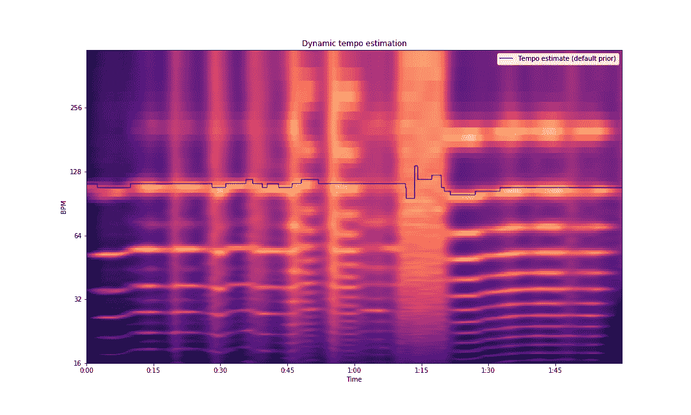

Dynamic Tempo Estimation

## 光谱图分解

声谱图可以提供更多关于声音的信息，这些信息仅仅是关于开始和频率的视觉线索。我们可以用频谱图来区分一首音乐的不同成分。

最常见的一种情况是将和声与打击乐声音分开，例如钢琴、键盘、吉他和长笛与鼓、手鼓等的声音。这可以使用谐波冲击源分离算法或 HPSS 来完成。

### 谐波撞击源分离(HPSS)

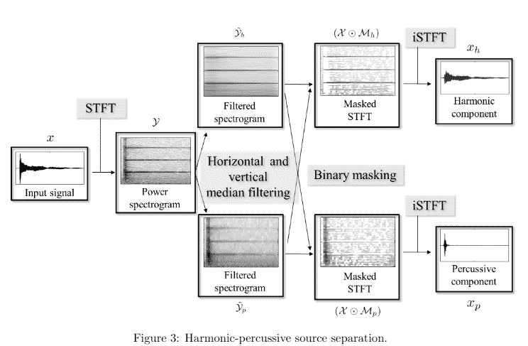

source: https://www.audiolabs-erlangen.de/content/05-fau/professor/00-mueller/02-teaching/2016w_mpa/LabCourse_HPSS.pdf

HPSS 算法有 4 个步骤:

1.  计算声谱图
2.  垂直和水平中值滤波
3.  滤波频谱图的二进制掩蔽
4.  反转掩蔽的频谱图

我们知道，给定一个$N$值的有序列表，如果$N$是奇数，中值就是$((N-1)/2)^{th}$值，否则就是$(N/2)^{th}$和$((N+1)/2)^{th}$项之和。

然后，给定 R_{N×K}$中的矩阵$ B \我们定义谐波和冲击中值滤波器如下:

$ medfilt_{h}(B)(n，k)= median({ B(m l _ { h }，k)，...，B(m+l_{h}，k)} $

$medfilt_{p}(B)(n，k) = median({B(n，k l _ { p })，...，B(n，k+l _ { p })} $

其中$2l_{h} + 1$和$2l_{p} + 1$分别是谐波和冲击滤波器的长度。增强的光谱图计算如下。

$ \phi_{h} = medfilt_{h}(|X(n，k )|^{2})$

$ \phi_{p} = medfilt_{p}(|X(n，k )|^{2})$

其中$X(n，k)$是声音信号的 STFT。

对过滤的光谱图应用二进制掩蔽。对于谐波谱图，如果$ \phi_{h}(n，k)$的值大于或等于$\phi_{p}(n，k)$，则元素$ M_{h}(n，k)$的值为$1$。否则$M_{h}(n，k)$的值为 0。

类似地，对于打击乐声谱图，如果$\phi_{p}(n，k)$的值大于$\phi_{h}(n，k)$的值，则元素$ M_{p}(n，k)$的值是$1$。否则$M_{p}(n，k)$的值为 0。

注意，这个公式意味着对于所有的$n$和$k$，M_{h}(n，k) + M_{p}(n，k) = 1$。为了得到打击乐和和声元素的声谱图，我们在原始 STFT $X$和二进制掩码$M_{p}$和$M_{h}$之间进行元素乘法。

由于我们的二进制屏蔽的定义，在每个时间点的每个频率仓要么被分配给$X_{h}$要么被分配给$X_{p}$。

$$ X_{h} = X \bigodot M_{h} $$

$$ X_{p} = X \bigodot M_{p} $$

一旦你有了这些，你就可以通过应用一个反 STFT 得到信号的打击乐和谐波成分。

`librosa`提供了 HPSS 算法的现成实现。

```py
S = librosa.stft(x)
H, P = librosa.decompose.hpss(S)

fig, ax = plt.subplots(nrows=3, sharex=True, sharey=True)
img = librosa.display.specshow(librosa.amplitude_to_db(np.abs(S), ref=np.max),
                         y_axis='log', x_axis='time', ax=ax[0])
ax[0].set(title='Full power spectrogram')
ax[0].label_outer()
librosa.display.specshow(librosa.amplitude_to_db(np.abs(H), ref=np.max(np.abs(S))),
                         y_axis='log', x_axis='time', ax=ax[1])
ax[1].set(title='Harmonic power spectrogram')
ax[1].label_outer()
librosa.display.specshow(librosa.amplitude_to_db(np.abs(P), ref=np.max(np.abs(S))),
                         y_axis='log', x_axis='time', ax=ax[2])
ax[2].set(title='Percussive power spectrogram')
fig.colorbar(img, ax=ax, format='%+2.0f dB')
```

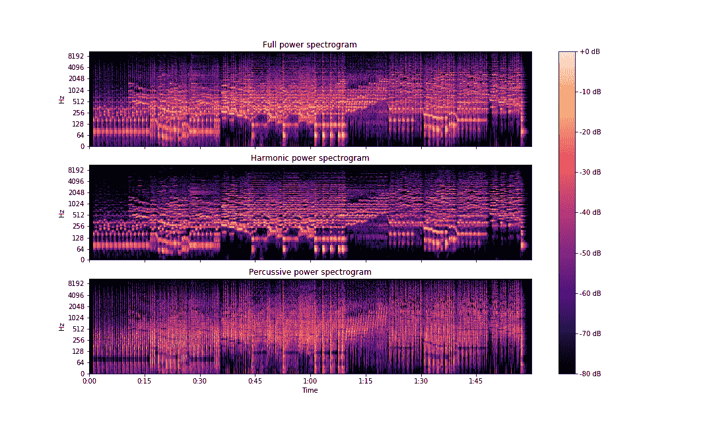

HPSS (segregating percussive and harmonic parts of the sound signal)

您可以获得如下隔离信号:

```py
y_harm = librosa.istft(H)
y_perc = librosa.istft(P)
```

实施还允许将信号分解成三个元素，而不是两个:谐波、冲击和残余。可以通过将 margin 参数的值设置为大于 1 的任何值来实现这一点。

```py
H, P = librosa.decompose.hpss(S, margin=3.0)
R = S - (H + P)
y_harm = librosa.istft(H)
y_perc = librosa.istft(P)
y_res = librosa.istft(R) 
```

## 结论

在本文中，我们探讨了音符、泛音、八度音、色度表示、开始检测方法、节拍、速度图和使用 HPSS 算法的声谱图分解。

在本系列的下一部分，我们将尝试构建一个具有深度学习的文本到语音引擎。正如我们常说的——敬请关注！