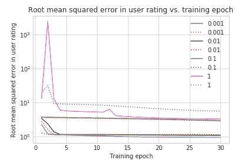
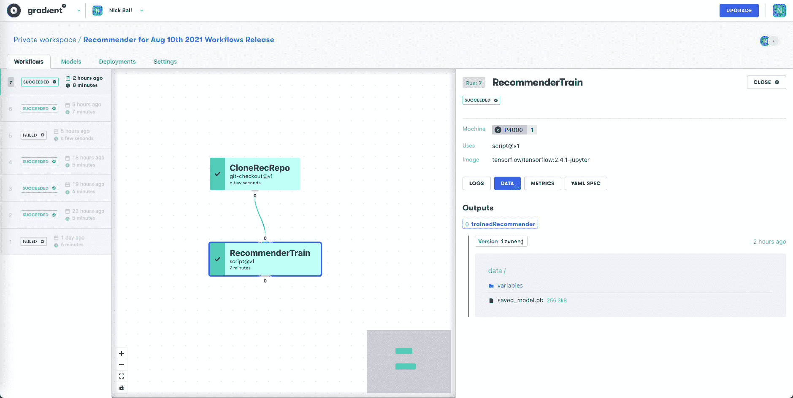

# 具有梯度的端到端推荐系统——第 4 部分:调整模型以获得最佳性能

> 原文：<https://blog.paperspace.com/end-to-end-recommender-system-part-4-tuning-model-best-performance/>

## 第 4 部分介绍

在这个六部分系列的第四部分中，我们将通过调整一些超参数来改进第三部分中模型的结果，并演示如何在梯度工作流中完成训练过程。

### 系列零件

[第 1 部分:提出业务问题](https://blog.paperspace.com/end-to-end-recommender-system-part-1-business-problem/)
[第 2 部分:准备数据](https://blog.paperspace.com/end-to-end-recommender-system-part-2-data-preparation/)
[第 3 部分:构建 TensorFlow 模型](https://blog.paperspace.com/end-to-end-recommender-system-part-3-building-tensorflow-model/)
[**第 4 部分:调整模型以获得最佳性能**](https://blog.paperspace.com/end-to-end-recommender-system-part-4-tuning-model-best-performance/)
[第 5 部分:将模型部署到生产中](https://blog.paperspace.com/end-to-end-recommender-system-part-5-deploying-model-production/)
[第 6 部分:总结、结论和后续步骤](https://blog.paperspace.com/end-to-end-recommender-system-part-6-conclusion-next-steps/)

### 伴随材料

*   本博客系列附带资料的主要位置是位于[https://github.com/gradient-ai/Deep-Learning-Recommender-TF](https://github.com/gradient-ai/Deep-Learning-Recommender-TF)的 GitHub 资源库。
*   其中包含项目的笔记本`deep_learning_recommender_tf.ipynb`，可以在渐变笔记本或 JupyterLab 界面中运行，以及渐变工作流的 3 个文件:`workflow_train_model.py`、`workflow-train-model.yaml`和`workflow-deploy-model.yaml`。
*   回购的目的是能够被使用和遵循，而不必参考博客系列，反之亦然，但它们相互补充。

### 注意

公共集群上的 Gradient 产品和工作流中的模型部署支持目前正处于待定状态，预计将于 2021 年第四季度推出。因此，笔记本`deep_learning_recommender_tf.ipynb`中关于模型部署的第 5 部分已显示，但尚未运行。

* * *

## 渐变调谐

在第 3 部分中，我们展示了如何构建和训练一个基本的推荐模型。现在我们将调整一些超参数来提高它的性能。

虽然调谐可以完全在笔记本上完成，但 Gradient 也允许将超参数调谐作为 Gradient 工作流程的一部分。

梯度工作流的优势在于，我们可以通过 YAML 集成 Git、Docker 容器和运行参数的完整定义，以实现版本化和可重复的实验。

一旦我们有了这种性质的实验，我们就可以使用 Gradient 的现代 MLOps 堆栈(包括 CI/CD、微服务、Kubernetes 等等)将模型部署到生产中。

## 当我们谈论 MLOps 时，我们指的是什么

CI/CD 指的是持续集成——其中代码和其他对象的版本被正确地合并——以及持续部署——其中软件被快速部署并以自动化的方式定期更新。

虽然 CI/CD 在软件开发中已经变得很普遍，但是这个概念需要适应 ML 用例，因为 ML 模型处理变化的数据，因此不能按照相同的参数固定。

Kubernetes 已经成为机器学习团队用来分配计算资源的事实上的容器编排系统，但通常被认为是非工程数据科学家难以配置。

梯度的一个特别优势是，适用于单节点情况的方法可以直接扩展到多节点情况。用户只需在单节点情况下添加适当的额外设置，以指定多节点要求，梯度将处理分布。我们将在第 6 部分的结尾更详细地讨论这些可能性。

## 调谐的实现

在本教程中，我们将使用 TensorFlow 进行一些基本的调优来演示功能。我们将在对数标度上改变学习率，然后放大到对数标度的最佳值附近的线性标度。我们还将为更多的纪元训练模型，并添加 L2 正则化。

当对完整的模型类使用 TensorFlow 子类化 API 时，需要指定的部分内容是如何以及将哪些超参数传递给模型。因为我们的调优相对简单，所以我们将正则项添加到模型代码中，并将时期数和学习速率传递给。编译和。安装台阶。

模型调整循环如下所示:

```py
learning_rates_logarithmic = [0.001, 0.01, 0.1, 1]
epochs = 30
histories_tr = {}
...
for val in learning_rates_logarithmic:
    print('Learning rate = {}'.format(val))
    model_tr = MovielensModelTunedRanking()
    model_tr.compile(optimizer=tf.keras.optimizers.Adagrad(learning_rate=val))
    lr = str(val)
    histories_tr[lr] = model_tr.fit(cached_train, epochs=epochs, validation_data=cached_validation) 
```

为了进行更广泛的调优，可以编写更复杂的循环。也可以使用额外的库，比如 HParams，或者使用 smart-search/AutoML 来搜索比网格搜索更大的空间。

出于本系列的目的，我们的调优很简单。我们可以使用 Matplotlib 绘制其值的单个内联图:



Model tuning for learning rates 0.001 to 1 for the training set (solid lines) and validation set (dotted lines)

对于更复杂的超参数集或其他可视化，Gradient 允许通过 TensorFlow 回调保存较长调优运行的中间阶段。

我们发现 0.1 的学习率是最好的，放大来看，当使用线性网格时，它仍然是最好的。除了学习率，我们还运行了更多时期的模型，结果是预测的均方误差从 1.11 提高到 1.06。

这不是一个巨大的进步，但意义重大。它实现了我们的目的，即展示模型调整，从而改善结果。还有许多其他可以优化的超参数(作者尝试了一些)，但是像改变优化器或层大小和数量这样的简单变化不会产生很大的影响。

从这里的结果改进的最好方法是在一个完整的推荐系统中加入更复杂的架构组件，如 TFRS 系列教程中所示。

获胜的策略是整合交叉特征等概念，并添加我们提到但没有实现的时间序列季节性。

所有这些可能性都只是模型的更长版本，使用我们在此展示的完全通用的 TensorFlow 子类 API 接口——很明显，如果用户需要，它们可以在渐变生态系统中实现和部署。

既然我们已经有了一个经过训练和调整的模型，可以很好地满足我们的目的，下一步就是将它部署到生产中。

## 在工作流中训练最终模型

在上面的例子中，我们从笔记本中进行了调优，结果和版本控制有些特别。

梯度工作流提供了一种更严格的方法，其中数据、模型以及输入和输出的版本对于给定的运行都是固定的。

我们没有在这里重复整个调优过程，我们只是展示了训练最终模型的工作流程。笔记本代码的相关部分在 Python `.py`脚本中重复，工作流在 YAML 文件中指定。

这里的工作流是从笔记本中调用的，使用的是 Gradient SDK，但也可以从命令行调用，而不需要使用笔记本。

许多用户对 YAML 不太熟悉，但 YAML 语法(或类似的东西)是必要的，它将工作流指定到所需的精度水平，使其成为产品级的。

我们在渐变文档中提供了如何使用它(和工作流)的各种示例。特别是，有一个页面[使用了 YAML 的数据科学](https://docs.paperspace.com/gradient/explore-train-deploy/workflows/using-yaml-for-data-science)，它解决了几个可能会出现在从事数据科学的非 YAML 专家面前的问题。

为了训练我们的最终模型，`.py`脚本重复笔记本的数据准备、模型类定义和模型训练部分。用于训练模型的 YAML 文件如下所示:

```py
...

defaults:
  resources:
    instance-type: P4000
  env:
    PAPERSPACE_API_KEY: secret:api_key_recommender

jobs:

...

  CloneRecRepo:
    outputs:
      repoRec:
        type: volume
    uses: git-checkout@v1
    with:
      url: https://github.com/gradient-ai/Deep-Learning-Recommender-TF

...

  RecommenderTrain:
    needs:
      - CloneRecRepo
    inputs:
      repoRec: CloneRecRepo.outputs.repoRec
    env:
      HP_FINAL_EPOCHS: '50'
      HP_FINAL_LR: '0.1'
    outputs:
      trainedRecommender:
        type: dataset
        with:
          ref: recommender
    uses: script@v1
    with:
      script: |-
        cp -R /inputs/repoRec /Deep-Learning-Recommender-TF
        cd /Deep-Learning-Recommender-TF
        python workflow_train_model.py
      image: tensorflow/tensorflow:2.4.1-jupyter 
```

我们可以看到它运行两个任务，`CloneRecRepo`和`RecommenderTrain`。

`CloneRecRepo`获取该项目的 GitHub 资源库的指定版本，这里是当前主分支的默认版本，并将其作为挂载卷输出。

在这种情况下，回购是公共的，因此不需要提供凭证(作为机密存储在 Gradient 中)来克隆它。`uses:`行指定了一个渐变动作，这是一个特殊的过程，比如克隆一个 repo 或者在容器中运行一个命令。渐变动作可以并行运行。

`RecommenderTrain`然后使用挂载卷中的 repo 来训练模型，并将其输出到`trainedRecommender`下的一组版本化文件中。

我们指定需要使用`needs`成功完成`CloneRecRepo`作业。

渐变动作`script@v1`允许运行一组命令，其中主要的是我们的训练脚本`workflow_train_model.py`。该脚本在 Gradient 的 Kubernetes 管理的基础设施上的指定 Docker 容器`tensorflow/tensorflow:2.4.1-jupyter`上运行。

模型超参数(或通常的任何参数)通过`env:`字段作为环境变量传递给脚本。

(对于`RecommenderTrain`作业，输出的语法有点混乱，因为包含模型的文件集在 Gradient 中被称为“数据集”这个名字将来可能会改变。还需要将回购从`/inputs`目录复制到工作目录，因为`/inputs`是只读的。这也是可以改进的，请注意，可能包含大得多的文件的数据集不必复制。)

运行培训时，我们可以在 Gradient 的 GUI 中看到工作流的详细信息:



Recommender model training Workflow in Gradient

工作流作业显示为有向无环图(DAG ),可以查看 YAML、输出和版本。我们的输出是来自`RecommenderTrain`工作的训练模型。

输出模型与我们上面使用笔记本训练的模型相同。

有关 YAML 和工作流程的详细信息，请参见[梯度文档](https://docs.paperspace.com/gradient/explore-train-deploy/workflows)。在 GitHub 项目库中，`.py`和 YAML 文件的名称是`workflow_train_model.py`和`workflow-train-model.yaml`。

## 笔记本与工作流

从笔记本上运行数据科学项目与使用更基于 IDE 的方法和 Python 脚本之间的理想相互作用是数据科学和 MLOps 社区中尚未解决的一个普遍问题。

在不同的阶段使用这两个接口有很好的理由，但是从一个到另一个的转换，通常是从项目的探索阶段到生产阶段，可能涉及到代码的复制或重写。

由于 Paperspace 的产品包含必要的计算硬件，以及笔记本和 IDE 方法，Gradient 现在和将来都有能力支持这两种方法。

## 然后

在[系列的第 5](https://blog.paperspace.com/end-to-end-recommender-system-part-5-deploying-model-production/) 部分- *[将模型部署到生产](https://blog.paperspace.com/end-to-end-recommender-system-part-5-deploying-model-production/)* 中，我们将展示如何使用梯度工作流部署模型，以及它与 TensorFlow 服务的集成。