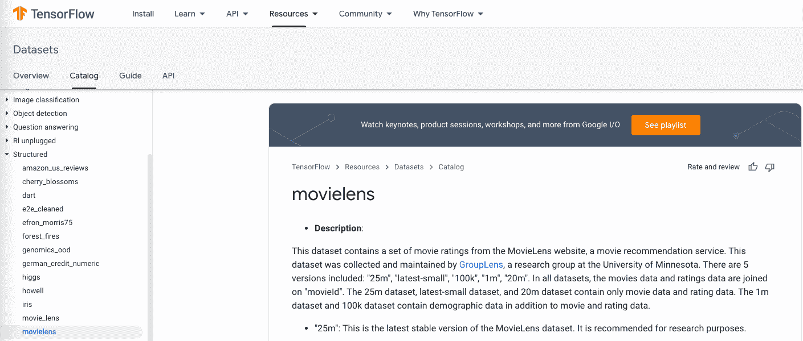

# 具有梯度的端到端推荐系统-第 2 部分:准备数据

> 原文：<https://blog.paperspace.com/end-to-end-recommender-system-part-2-data-preparation/>

## 第 2 部分简介

在六部分系列的第二部分中，我们将展示如何使用 TensorFlow 2 和梯度笔记本从原始数据集到合适的模型训练集。

### 系列零件

[第 1 部分:提出业务问题](https://blog.paperspace.com/end-to-end-recommender-system-part-1-business-problem/)
[**第 2 部分:准备数据**](https://blog.paperspace.com/end-to-end-recommender-system-part-2-data-preparation/)
[第 3 部分:构建张量流模型](https://blog.paperspace.com/end-to-end-recommender-system-part-3-building-tensorflow-model/)
[第 4 部分:调整模型以获得最佳性能](https://blog.paperspace.com/end-to-end-recommender-system-part-4-tuning-model-best-performance/)
[第 5 部分:将模型部署到生产中](https://blog.paperspace.com/end-to-end-recommender-system-part-5-deploying-model-production/)
[第 6 部分:总结、结论和后续步骤](https://blog.paperspace.com/end-to-end-recommender-system-part-6-conclusion-next-steps/)

### 伴随材料

*   本博客系列附带资料的主要位置是位于[https://github.com/gradient-ai/Deep-Learning-Recommender-TF](https://github.com/gradient-ai/Deep-Learning-Recommender-TF)的 GitHub 资源库。
*   其中包含项目的笔记本`deep_learning_recommender_tf.ipynb`，可以在渐变笔记本或 JupyterLab 界面中运行，以及渐变工作流的 3 个文件:`workflow_train_model.py`、`workflow-train-model.yaml`和`workflow-deploy-model.yaml`。
*   回购的目的是能够被使用和遵循，而不必参考博客系列，反之亦然，但它们相互补充。

### 注意

公共集群上的 Gradient 产品和工作流中的模型部署支持目前正处于待定状态，预计将于 2021 年第四季度推出。因此，笔记本`deep_learning_recommender_tf.ipynb`中关于模型部署的第 5 部分已显示，但尚未运行。

* * *

## 数据准备的作用

众所周知，如果数据不足，任何机器学习模型都无法解决问题。这意味着必须正确地准备数据，以适合传递给 ML 模型。

太多的在线内容忽略了数据准备的现实。企业 ML 的一个推荐范例是“做一个试点，而不是一个概念验证”，这意味着建立一些简单的端到端的东西，然后回去完善细节。

因为梯度使得部署模型变得容易，它鼓励我们从一开始就记住模型部署和生产。在数据准备过程中，这意味着发现问题，而这些问题可能要等到以后才会被发现——事实上，我们将在下面看到一个这样的例子。

渐变鼓励实体版本化的工作方式。使用诸如 Git repos、YAML 文件等工具，我们可以抵消数据科学家投身于难以重现的特定操作顺序的自然倾向。

版本化的问题不仅仅是模型和代码，还有数据本身，也很重要。除了小数据，这种版本控制在 Git 中不起作用。在这一系列中，数据仍然相对较少，因此充分考虑这一限制被认为是未来的工作。

## MovieLens 数据集

因此，虽然我们不会以一个 100%典型的业务场景开始这个系列，例如包含数百万个多种格式的非结构化原始文件的 petascale 数据湖，这些文件缺乏模式(甚至没有联系人来解释它们)，但我们确实使用了在 ML 研究中广泛使用的数据。

数据集特别有用，因为它包含了现实世界企业数据集的许多典型特征。



MovieLens dataset used in this blog series

MovieLens 数据集包含有关电影、用户以及用户对电影的评级的信息。对于新用户，我们希望能够推荐他们可能观看和喜欢的新电影。

我们将首先使用检索模型选择候选项，然后使用排名模型预测用户的评分。

预测收视率最高的电影将成为我们的推荐。

初始数据的前几行如下:

```py
{'bucketized_user_age': 45.0,
 'movie_genres': array([7]),
 'movie_id': b'357',
 'movie_title': b"One Flew Over the Cuckoo's Nest (1975)",
 'raw_user_age': 46.0,
 'timestamp': 879024327,
 'user_gender': True,
 'user_id': b'138',
 'user_occupation_label': 4,
 'user_occupation_text': b'doctor',
 'user_rating': 4.0,
 'user_zip_code': b'53211'}
{'bucketized_user_age': 25.0,
 'movie_genres': array([ 4, 14]),
 'movie_id': b'709',
 'movie_title': b'Strictly Ballroom (1992)',
 'raw_user_age': 32.0,
 'timestamp': 875654590,
 'user_gender': True,
 'user_id': b'92',
 'user_occupation_label': 5,
 'user_occupation_text': b'entertainment',
 'user_rating': 2.0,
 'user_zip_code': b'80525'} 
```

我们看到大多数列都是不言自明的，尽管有些不明显。数据被分成电影信息、用户信息和观看电影的结果，例如何时观看、用户评级等。

我们还发现了在准备过程中需要解决的各种数据问题:

*   每一行都是一个字典，所以我们需要提取条目或者正确地访问它们，以便能够做准备。
*   目标列与功能列没有区别。因此，我们必须使用上下文和我们的领域知识来查看目标列是`user_rating`，并且其他列都不是欺骗变量。这里的欺骗变量将是直到用户观看电影之后才可用的信息，因此在推荐用户还没有观看的电影时不能使用该信息。(1)
*   一些数据列被格式化为字节码(例如`b'357'`)，而不是常规的 UTF-8 unicode。如果模型被部署为 REST API，并且数据被转换为 JSON，那么这将会失败。JSON 要求数据是 UTF，最好是 UTF-8。所以我们需要对此做出解释。
*   给定的时间戳不适合 ML。一列唯一或几乎唯一的连续值不会添加模型可以使用的信息。然而，如果我们能够将这些价值具体化为一些重复出现的东西，如一天中的时间、一周中的日子、一年中的季节或假日，它们可能会变得更有价值。
*   由于存在时间戳，并且用户查看习惯会随着时间的推移而改变，因此需要考虑处理时间序列的问题，并且最好将数据拆分为时间上不重叠的定型集、验证集和测试集。不这样做违反了 ML 的假设，即训练集中的行是不相关的，并可能导致虚假的高模型性能或过度拟合。

显然，还有许多其他问题可以问和回答:

*   是否有缺失或其他错误/超出范围的值？
*   流派是什么意思？
*   id 是唯一的吗？它们是否与电影名称一一对应？
*   用户性别`True`是什么？
*   用户 id 是唯一的吗？
*   有哪些职业标签？
*   为什么评级浮动不是整数？
*   所有行都有相同的列数吗？

在一个真实的业务场景中，我们最好与数据发起者讨论这些列的含义，并检查每个人都在同一个页面上。我们还可能使用各种图表、探索性数据分析(EDA)工具，并应用我们所掌握的任何其他领域知识。

在这里的例子中，MovieLens 数据已经是众所周知的了。虽然人们不应该假设这使得它对任务来说是明智的，甚至是一致的，但我们不需要花时间做全面项目中会做的大量数据 EDA。

(1) *关于“信息可用”，这里实际上有一个微妙之处，因为当然，除了* `user_rating` *之外，用户观看电影时的时间戳列事先是不可用的。然而，与评级不同，当进行推荐时“现在”的时间是可用的，因此知道用户更可能在周末晚上观看某些类型的电影可以被使用而不会被欺骗。*

## 准备数据

TensorFlow 有各种帮助数据准备的模块。对于 MovieLens 来说，数据还不够大，不需要 Spark 等其他工具，但当然情况并非总是如此。

在全面的生产推荐系统中，通常需要更多的工具来处理大于内存的数据。随着时间的推移，大型用户群可能会有数十亿行可用。

数据从官方 TensorFlow 数据集存储库的`movielens/`目录加载到 TensorFlow 2 中。Gradient 可以连接到其他数据源，比如亚马逊 S3。

```py
import tensorflow_datasets as tfds
...
ratings_raw = tfds.load('movielens/100k-ratings', split='train') 
```

它们作为 TensorFlow `Prefetch`数据集类型返回。然后，我们可以使用 Python lambda 函数和 TensorFlow 的`.map`来选择将用于构建模型的列。

对于这个系列来说，只有`movie_title`、`timestamp`、`user_id`和`user_rating`。

```py
ratings = ratings_raw.map(lambda x: {
    'movie_title': x['movie_title'],
    'timestamp': x['timestamp'],
    'user_id': x['user_id'],
    'user_rating': x['user_rating']
}) 
```

TensorFlow in-part 与 NumPy 重叠，因此我们可以使用`.concatenate`、`.min`、`.max`、`.batch`和`.as_numpy_iterator`例程来提取时间戳，并创建时间上不重叠的训练、验证和测试集。简单又好看！😀

```py
timestamps = np.concatenate(list(ratings.map(lambda x: x['timestamp']).batch(100)))
max_time = timestamps.max()
...
sixtieth_percentile = min_time + 0.6*(max_time - min_time)
...
train =      ratings.filter(lambda x: x['timestamp'] <= sixtieth_percentile)
validation = ratings.filter(lambda x: x['timestamp'] > sixtieth_percentile and x['timestamp'] <= eightieth_percentile)
test =       ratings.filter(lambda x: x['timestamp'] > eightieth_percentile) 
```

然后，我们在每个集合中混洗数据，因为 ML 模型假设数据是 IID 的(行是独立的且同分布的)。我们需要打乱数据，因为我们的数据似乎最初是按时间排序的。

```py
train = train.shuffle(ntimes_tr)
... 
```

最后，我们获得推荐器模型所需的唯一电影标题和用户 id 的列表。

```py
movie_titles = ratings.batch(1_000_000).map(lambda x: x['movie_title'])
...
unique_movie_titles = np.unique(np.concatenate(list(movie_titles)))
... 
```

笔记本中提到了一些进一步的调整，以使一切都协调工作。这些包括让`.len()`处理应用 lambda 得到的`FilterDataset`类型。这些在笔记本中应该是不言自明的，因为它们基本上相当于弄清楚如何使用 TensorFlow 来完成所需的工作。

还要注意，我们假设使用时间百分比得到的行数大致对应于数据百分比的行数。这是发生在数据准备中的典型假设，不一定通过简单地阅读代码就能得出。(在这种情况下，数字是一致的，如笔记本所示。)

其余的输入数据处理在模型中完成，如第 3 部分所示。

## 然后

在[系列的第三部分](https://blog.paperspace.com/end-to-end-recommender-system-part-3-building-tensorflow-model/)——*[构建 TensorFlow 模型](https://blog.paperspace.com/end-to-end-recommender-system-part-3-building-tensorflow-model/)* 中，我们将使用 TensorFlow 推荐器库构建一个基本的推荐器模型，并在上述准备好的数据上对其进行训练。