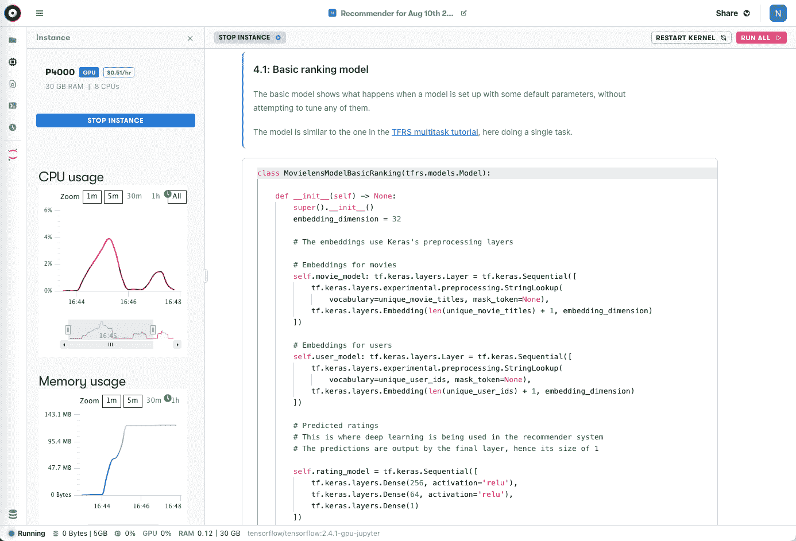

# 具有梯度的端到端推荐系统-第 1 部分:提出一个商业问题

> 原文：<https://blog.paperspace.com/end-to-end-recommender-system-part-1-business-problem/>

## 系列介绍

对于许多组织来说，数据科学家和工程师面临的一个主要问题是如何最好地从实验阶段进入生产阶段。渐变笔记本和渐变工作流在这两方面都提供了功能。

这个博客系列演示了渐变笔记本和工作流作为端到端项目的一部分的使用。在这个过程中，我们将详细解释每个步骤，并且我们将使数据科学家、ML 工程师和其他技术读者能够访问这些材料。

在这六个部分的第一部分中，我们概述了任何企业数据科学分析的最重要部分——提出业务问题。让我们开始吧。

### 系列零件

**[第 1 部分:提出业务问题](https://blog.paperspace.com/end-to-end-recommender-system-part-1-business-problem/)**
[第 2 部分:准备数据](https://blog.paperspace.com/end-to-end-recommender-system-part-2-data-preparation/)
[第 3 部分:构建张量流模型](https://blog.paperspace.com/end-to-end-recommender-system-part-3-building-tensorflow-model/)
[第 4 部分:调整模型以获得最佳性能](https://blog.paperspace.com/end-to-end-recommender-system-part-4-tuning-model-best-performance/)
[第 5 部分:将模型部署到生产中](https://blog.paperspace.com/end-to-end-recommender-system-part-5-deploying-model-production/)
[第 6 部分:总结、结论和后续步骤](https://blog.paperspace.com/end-to-end-recommender-system-part-6-conclusion-next-steps/)

### 伴随材料

*   本博客系列附带资料的主要位置是位于[https://github.com/gradient-ai/Deep-Learning-Recommender-TF](https://github.com/gradient-ai/Deep-Learning-Recommender-TF)的 GitHub 资源库
*   其中包含项目的笔记本`deep_learning_recommender_tf.ipynb`，可以在渐变笔记本或 JupyterLab 界面中运行，以及渐变工作流的 3 个文件:`workflow_train_model.py`、`workflow-train-model.yaml`和`workflow-deploy-model.yaml`。
*   回购的目的是能够被使用和遵循，而不必参考博客系列，反之亦然，但它们相互补充。

### 注意

公共集群上的 Gradient 产品和工作流中的模型部署支持目前正处于待定状态，预计将于 2021 年第四季度推出。因此，笔记本`deep_learning_recommender_tf.ipynb`中关于模型部署的第 5 部分已显示，但尚未运行。

* * *

## 第 1 部分简介

推荐系统的输出现在是网络世界的一个普遍特征。我们很多人都很熟悉亚马逊这样的网站如何鼓励你购买额外的商品来补充你购物车中的商品，或者 YouTube 如何建议你在去其他地方之前再看一个视频。

我们也很熟悉它们不太好用的时候。例如，如果你从亚马逊购买了一套艾伦扳手，亚马逊可能会在一段时间内继续向你展示艾伦扳手，尽管你刚刚购买了一套。或者，如果你在公路旅行中预订了一家酒店，你可能仍然会收到几周后你离开的那个城镇的报价。像这样的例子可能有一些统计学上的有效性，因为你比一个随机的用户对这些项目更感兴趣，但是它们并没有捕捉到人类会有的经验常识。

因此，尽管推荐系统已经变得越来越好，但仍然有改进的空间，以捕捉用户想要的全部复杂性。在少数顶级科技公司之外尤其如此，这些公司的团队往往缺少数据科学家和工程师。

对于许多企业来说，向技术堆栈中添加一个性能良好的推荐模型有可能大幅提高收入。

在这个由 6 部分组成的博客系列中，我们旨在展示深度学习如何改善推荐器的结果，以及 Paperspace Gradient 如何使构建这样的系统变得更容易。

特别是，我们将关注构建这样一个推荐器的整个生命周期——从编写笔记本和训练模型的实验阶段，到部署模型和实现商业价值的生产阶段。

### 系列集锦

1.  演示一个现实世界风格的机器学习的例子
2.  将端到端数据流与梯度笔记本电脑和工作流程相结合
3.  使用基于 Gradient 与 Git 集成的现代数据科学方法
4.  使用 TensorFlow 2 和 TensorFlow 推荐器(TFRS)来训练包括深度学习的推荐器模型
5.  使用反映真实项目变量和现实的训练数据
6.  使用完整的 TensorFlow 子类化 API 构建自定义模型
7.  显示改善结果的工作超参数调整
8.  使用梯度部署及其 TensorFlow 服务集成的部署模型
9.  包括一个独立的工作 Jupyter 笔记本和 Git 存储库
10.  让它与广泛的受众相关，包括 ML 工程师、数据科学家以及介于两者之间的人

* * *

## 理解业务问题

正如人们常说但并不总是实践的那样，数据科学应该从要解决的业务问题开始。

在流程的每一步都有太多可能的方法(数据、特征工程、算法、性能指标等)。)在头脑中没有特定标准的情况下探索。

“构建一个更好的分类器”(或者本例中的推荐器)并不是一个商业问题，这也是事实。这是解决方案的一部分。业务问题需要以描述业务直接价值的术语给出。

下面是根据《用数据思考》一书[所做的演讲中的一个例子:](https://www.google.com/books/edition/Thinking_with_Data/A4ieAgAAQBAJ?hl=en&gbpv=0)

> **不是业务问题范围:**我们将使用 R 来创建逻辑回归，以预测谁将停止使用该产品。

> **业务问题范围:**上下文=公司有订阅模式。首席执行官想知道我们能否锁定那些可能放弃交易的用户。需求=想要了解谁提前下班，以便我们可以干预。Vision =预测模型，使用行为数据来预测谁将退出，足够快速地识别他们以发挥作用。Outcome =软件团队将在每天运行的批处理过程中实现该模型，自动发出要约。计算精度和召回使用举行的用户，发送每周电子邮件。

范围比这更长并不罕见——关键是要用可测量的术语来理解结果。

对于这个项目，我们的业务问题如下:

> 证明 Paperspace 渐变笔记本和工作流可用于解决真实的机器学习问题。通过展示从原始数据到生产部署的端到端解决方案来做到这一点。进一步表明所演示的内容可以构建成一个完整的企业级系统。在这种情况下，该模型是一个推荐系统，其结果通过利用经过调整的深度学习组件来改进。

现在让我们继续谈论推荐系统！我们将特别讨论经典方法所体现的思想，以及当加入深度学习时它们是如何变化的。然后，我们将看到梯度如何有助于将这些方法带入生活。

## 经典推荐系统

给任何不是深度学习的机器学习(ML)方法贴上“经典”的标签，都可能会产生误导。

事实上，梯度增强决策树等“经典”方法可以像深度学习一样解决任意复杂的非线性问题——对于许多商业问题来说，这些方法更合适，因为它们保留了人类可读的数据特征，减少了计算密集型的训练时间。

因此，这里的“经典”指的是利用(或许同样被低估的)经典统计方法的方法，而不是经过训练的 ML 模型。这些形成了 ML 模型可以改进的基线。

以下是推荐器模型试图实现的一个常见任务:

> 向用户呈现相似用户已经喜欢的建议的新项目

一个常见的设置是使用一个**检索**模型和一个**排名**模型。在这种设置中，检索模型从完整的库存中选择一组候选项目进行推荐，然后排名模型细化选择并在较小的数据集上对推荐进行排序。

建议中的经典统计部分是使用[协同过滤](https://en.wikipedia.org/wiki/Collaborative_filtering)，其中我们有:

*   用户的偏好，或者是明确的，如评级，或者是隐含的，如观看或购买
*   衡量每个用户之间的距离，以找到与他们最相似的用户
*   向用户推荐与他们相似的用户喜欢的项目

这些方法有效，但准确性有限，因为它们没有使用数据集中可用的所有信息，例如，距离只能用矩阵或低维张量表示，如用户-用户(相似评级)或物品-物品(购买的相似物品)。

即使将人口统计等用户特征添加到计算中(上下文感知)，那些不直接转化为距离上的明显差异的特征(如特征交互)也不一定会被捕获。

## 深度学习的添加

在复杂的非线性映射代表问题的最佳解决方案的领域中，ML 能够改进经典统计，同样地，ML 也能够改进推荐器。

向推荐者添加 ML 可以:

*   更多要捕捉的特征
*   使用更多类型的特征，例如多列用户或项目信息，而不仅仅是距离
*   这些特征的非线性组合被模型发现
*   为每个用户提供更精细、更个性化的推荐
*   缓解如何处理新用户或项目的“冷启动”问题

在这个系列中，我们重点关注向推荐器排名模型添加一些深度学习层，该模型改进了对用户喜欢推荐项目程度的预测。

当前的艺术状态由像脸书的深度学习推荐模型( [DLRM](https://towardsdatascience.com/modern-recommender-systems-a0c727609aa8) )这样的设置来代表。这是一种协同过滤和深度学习的混合方法，它学习较低阶的功能交互，但将较高阶的功能交互限制在那些增加性能而不会增加太多计算资源成本的功能交互。

虽然我们没有构建一个如此复杂的系统，但我们的目标是展示 Gradient 为构建这样的生产系统所提供的功能基础。

## 梯度实施

在本系列的下一部分中，我们将开始使用 TensorFlow 2 和 [TensorFlow 推荐器](https://www.tensorflow.org/recommenders)库在 Paperspace Gradient 中实现该模型。然后，我们将使用 TensorFlow 服务的 Gradient 集成来部署模型。

我们将展示渐变笔记本的使用，包括如何进行数据准备和模型训练，然后演示如何创建一个生产设置，在渐变工作流中执行模型训练和部署。

Screenshot showing part of the Gradient Notebook for this blog series

## 然后

在[系列的第 2 部分](https://blog.paperspace.com/end-to-end-recommender-system-part-2-data-preparation/)-*[准备数据](https://blog.paperspace.com/end-to-end-recommender-system-part-2-data-preparation/)* 中，我们将展示如何使用 TensorFlow 2 和 Gradient 笔记本从原始数据集到合适的模型训练集。