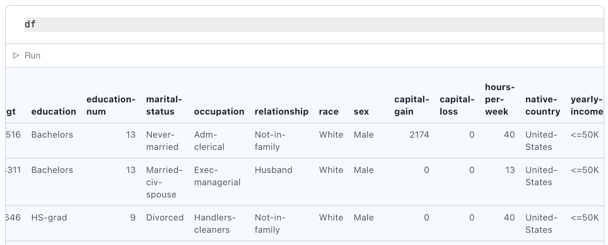
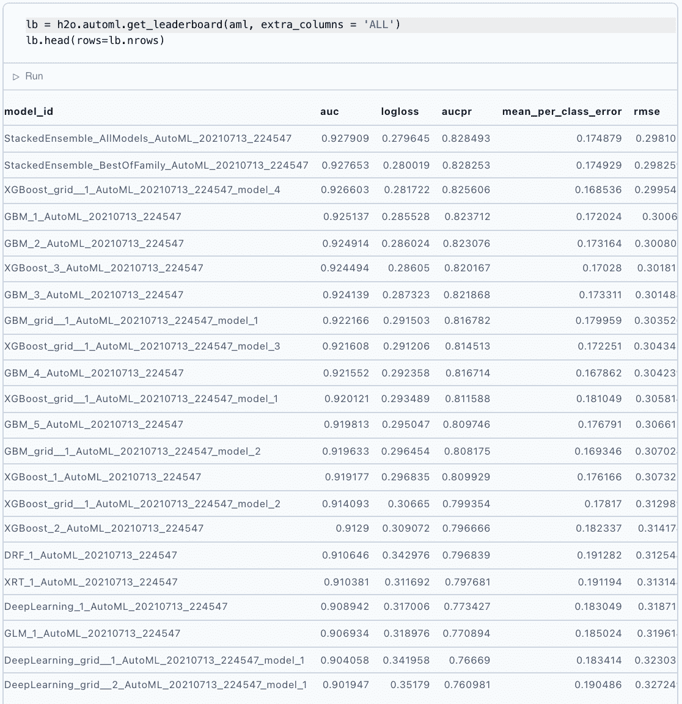
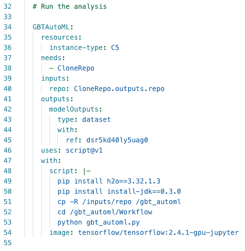
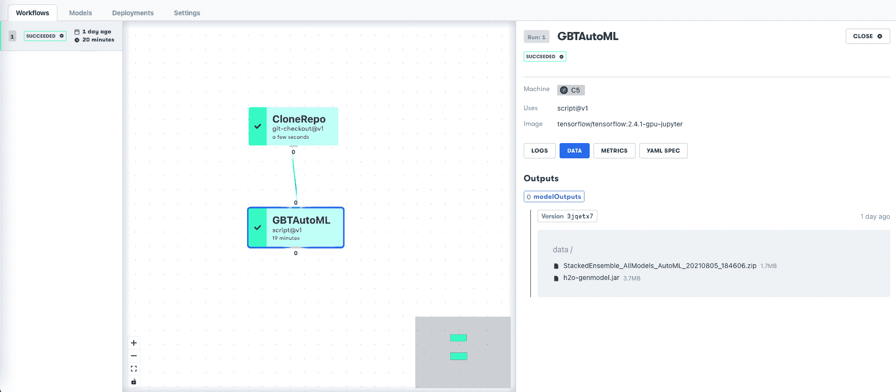
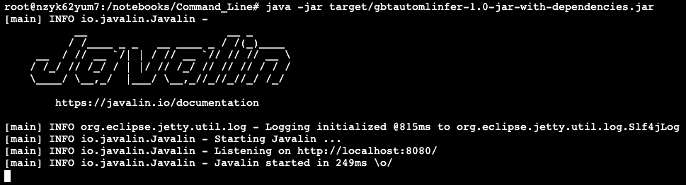
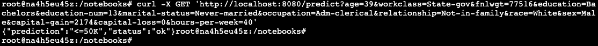

# 梯度增强树和自动建模

> 原文：<https://blog.paperspace.com/gradient-boosted-trees-automl-h2o/>

尽管深度学习很受欢迎，但许多 AI 团队都有最好用深度学习以外的方法解决的问题。这可能是因为可解释性、真实世界数据的鲁棒性、法规要求、可用的计算能力或时间、批准的软件、可用的专业知识或任何数量的其他原因。

在这个项目中(以及伴随的 [GitHub 库](https://github.com/gradient-ai/Gradient-Boosted-Trees-and-AutoML))，我们将利用[梯度增强决策树](https://docs.paperspace.com/machine-learning/wiki/gradient-boosting) (GBTs)来训练一个模型，然后将该模型部署到生产中。与其应用深度学习技术，我们将会看到许多 ML 问题可以用一个调整良好的 GBT 来解决。

我们为这个项目选择的软件是一个最先进的开源库，叫做 [H2O](https://h2o.ai) 。它包括 GBT 模型、 [XGBoost](https://github.com/dmlc/xgboost) 模型和[集合方法](https://docs.paperspace.com/machine-learning/wiki/machine-learning-models-explained#algorithms)的高级功能，例如通过 [AutoML](https://docs.h2o.ai/h2o/latest-stable/h2o-docs/automl.html) 超参数调整进行叠加。

一旦模型被训练，我们将展示如何使用 [Gradient](https://gradient.paperspace.com/) 将其作为 REST API 端点部署到生产中，并向其发送推断数据。

在附带的 GitHub repo 中，我们还将展示如何在项目的探索阶段使用[渐变笔记本](https://gradient.paperspace.com/notebooks)，以及在生产阶段使用[渐变工作流程](https://gradient.paperspace.com/machine-learning-pipelines)。

我们开始吧！

## 内容

*   数据和模型
*   渐变笔记本
*   渐变工作流
*   模型部署
*   结论
*   后续步骤

## 伴随材料

*   ML 展示区
*   GitHub 知识库

## 数据和模型

我们这个项目的目的是在梯度上展示端到端的[经典机器学习](https://docs.paperspace.com/machine-learning/wiki/machine-learning-models-explained#classical-machine-learning)(而不是深度学习)。

因为我们想要解决一个典型的商业问题，非常适合像 GBT 这样的方法，所以我们想要混合数据类型的表格数据，而不是文本或计算机视觉数据。

因此，我们将使用著名的 [UCI 人口普查收入数据集](https://archive.ics.uci.edu/ml/datasets/census+income)。下面显示了一个典型的数据片段。我们的目标将是执行二元分类来预测一个人的收入是低还是高。这些分别标记为`<=50K`和`>50K`。



UCI census income dataset used for model training

我们看到数据集由混合数据类型的人口统计信息列组成:数字、分类、零等。幸运的是，对于这种类型的数据，决策树往往是健壮的，我们不需要准备步骤，如标准化或一次性编码。

分析的其他细节在下面的章节中给出。

## 渐变笔记本

我们在梯度笔记本中的目标是从最初的原始数据集到准备部署的已保存模型。

H2O 作为 Java 服务器运行，所以我们将从笔记本单元初始化它:

```py
import h2o
h2o.init() 
```

在更大的规模上，这允许它在计算集群以及单台机器上运行。

由于我们的数据很小，我们可以使用导入方法将它们作为 CSV 导入到 H2O 的数据框中(类似于熊猫):

```py
df = h2o.import_file(path = "income.csv") 
```

由于梯度笔记本允许任意 Python 代码，其他探索性数据分析和准备可以添加到这里。我们暂时不考虑这一点，因为这不是我们关注的焦点，而且这个模型正在正确地运行。

数据被分成特征列`x`和标签列`y`，并被分成用于训练、验证和测试的非重叠随机子样本。然后，他们会接受模特培训。

我们将使用 H2O 的 AutoML:

```py
from h2o.automl import H2OAutoML
aml = H2OAutoML(max_models=20, seed=1)
aml.train(x=x, y=y, training_frame=train) 
```

尽管 AutoML 很简单，但它适用于许多问题，包括高级用户的使用。这是因为它搜索了广泛的模型和超参数——相当于甚至超过了专家的搜索范围。

AutoML 的梦想是，它可以生成一个模型，在手工调整模型所需时间的一小部分内提供足够的商业价值。

然而，AutoML 并不能解决所有问题。特别是，许多真实的业务问题都有可能得不到支持的业务逻辑条件或异常指标。

因此，这里需要注意的重要一点是，完全的手动调优(以及任何其他需要的任意代码)可以用与这个项目在 Gradient 上相同的方式来完成。要手动调整模型，我们只需用手动调整方法(如`H2OGradientBoostingEstimator`)替换 AutoML 位。

AutoML 探索的一些模型包括:

*   常规 GBT(也称为 GBM 或梯度推进机)
*   具有超参数值网格的 XGBoost 模型
*   深度学习模型
*   随机森林
*   模型的堆叠集合(堆叠=将模型输出输入下一个模型输入)

有点令人惊讶的是，我们实际上在这里包括了深度学习技术！然而，这个项目的重点是经典 ML，所以这是我们坚持的。

最适合该数据集的模型是堆叠集合。这是许多场景的常见结果，在这些场景中，经过良好调整的 GBT 从模型集合中受益。虽然集合可以提高准确性，但它也会增加计算时间并降低可解释性——因此它最终只在某些情况下有用。

一旦训练完成，大量的信息就会显露出来。例如，模型“排行榜”显示了各种模型的表现:



H2O AutoML model leaderboard

还提供模型指标:


Some model metrics from the AutoML run

这里我们使用了二元分类的默认度量:曲线下面积，或 AUC。这是由真阳性率对假阳性率的图包围的区域。最可能的值是 1，这里我们在验证集上得到大约 0.92，所以模型表现得很好。

我们还可能从完整的排行榜中看到，深度学习任务花费的时间是其他方法的 20 倍以上，并且表现更差。这不一定是一个公平的比较，因为它没有被广泛地探索，然而我们看到，对于解决问题的快速分析，经典的 ML 在这种情况下是足够的。

H2O 记录了大量关于模型的信息，包括度量标准。Gradient 能够在实验和生产过程中记录这些指标。指标可以按原样使用，也可以经过后期处理成为具有更大商业价值的东西，比如预期收入。

在训练之后，我们可以在看不见的测试数据上测量模型的性能，以通常的方式检查其泛化能力。

最后，我们可以保存该模型，以便将其部署到生产环境中。`get_genmodel`参数输出模型部署所需的`h2o-genmodel.jar` Java 依赖项。

```py
modelfile = model.download_mojo(path="/storage", get_genmodel_jar=True) 
```

在 Gradient 目前的开发状态下，它可以与 TensorFlow 或 ONNX 集成模型生产。因此，我们直接使用 Java 来部署模型(参见下面的模型部署)。我们认为这是值得展示的，因为(1)端到端数据科学应该包括部署到生产中,( 2)这种方法适用于任何梯度 H2O 模型，它包含了人们希望用经典 ML 解决业务问题的大部分内容。

## 渐变工作流

Gradient 的两个主要组件是笔记本和工作流。

笔记本电脑旨在帮助您快速启动和运行数据探索、模型实验以及访问 GPU 等硬件加速器。

工作流旨在使用现代 MLOps 原则(如 Git、Kubernetes、微服务和 YAML)将项目投入生产。用户不需要 DevOps 专业知识就可以使用 Gradient 作为编排平台。

在这个项目中，我们展示了如何在笔记本和工作流程中完成上述分析。

有一条蟒蛇。包含工作流规范的 YAML 文件调用的 py 脚本。这给出了步骤的完整版本化描述，Python 和 YAML 可以在不损害任何特定 IDE 或环境的情况下开发。

工作流 YAML 规范如下所示:



Part of the Gradient Workflow YAML specification

工作流是通过从命令行调用以下类型的命令来运行的:

```py
gradient workflows run \
  --id         abc123de-f567-ghi8-90jk-l123mno456pq \
  --path       ./Workflow/gbt_automl.yaml \
  --apiKey     ab12cd34ef56gh78ij90kl12mn34op 
```

API 也可以存储在您的配置中，而不是被提供。将来，GUI 和 SDK 将支持工作流调用。完成后，工作流和输出数据集在 GUI 中可见:



Gradient Workflow to run AutoML model training

工作流被表示为有向非循环图(DAG)。虽然这个例子很简单，但是扩展步骤也很简单，例如添加一个单独的数据准备工作、多个模型等等。

我们还可以查看工作流中的其他信息，例如以前的运行和版本化的输出数据集。

工作流的输出与笔记本的输出相同——一个训练有素的模型，随时可以部署！

## 模型部署

Gradient 的目标之一是使模型部署尽可能容易，即使存在硬件加速。

虽然深度学习模型与 TensorFlow 有相当广泛的集成，但目前 H2O 经典 ML 模型是使用 Java 部署的。然而，由于上面提到的原因(端到端数据科学，H2O/Java 非常普遍)，这是有价值的，并且随着项目的发展，Gradient 的集成将在未来增加。

这个设置是基于 Spikelab 的这个[博客条目](https://medium.com/spikelab/building-a-machine-learning-application-using-h2o-ai-67ce3681df9c)中的例子，做了一些修改。

笔记本和/或工作流项目部分在 MOJO 中输出 H2O 模型(模型对象，优化)。MOJO 是[保存模型的首选格式](https://docs.h2o.ai/h2o/latest-stable/h2o-docs/productionizing.html),因为它是可移植的，并且比 POJO(普通旧 Java 对象)更通用。

该模型命名如下:

`StackedEnsemble_AllModels_AutoML_20210621_203855.zip`

并且有一个单独关联的 Java 依赖:`h2o-genmodel.jar`。

我们使用简单的 web 框架 [Javalin](https://javalin.io/) 用 Maven 构建一个 Java 项目，其中包含模型(`Model.java`)和一个将模型设置为 REST 端点的应用(`App.java`)。

我们使用渐变容器中的命令行创建项目，而不是使用 IntelliJ 或 Eclipse 之类的 IDE GUI。我们也使用 3.32.1.3 H2O 的稍新版本。

Java 代码从在线回归示例修改为我们的二元分类示例。这就是为什么我们改变了被调用的类和数据类型。我们已经将 H2O 的 artifactID 从`h2o-genmodel`更改为`h2o-genmodel-ext-xgboost`以适应 XGBoost 型号。推理数据包含分类和数字数据类型。

如何部署的细节在 GitHub repo 项目中，但是在 Gradient 上的终端中，部署是通过 Java 启动的，并监听一个端口:



H2O model deployed to REST endpoint

推断数据可以通过 curl 发送。这里，我们提交来自收入数据集的一行数据，模型返回其响应，即该行的预测标签。



Deployed model correct response to inference data

在这种情况下，该人被预测为处于较低收入阶层，`<=50K`。

显然，这不是全面的企业生产部署，但让我们看看我们在这里做什么。我们在 REST 端点上有一个模型，推理数据被发送给它，模型返回响应。

Gradient 拥有扩展这一功能并与其他工具(如模型监控)集成的基础设施。

## 结论

我们已经表明，Gradient 能够支持深度学习所代表的领域子集之外的高级机器学习(ML)模型。正如我们所发现的，哪种方法是最好的——深度学习还是经典的 ML——完全取决于具体情况。

这是我们所做的:

*   我们使用著名的开源 ML 库 H2O 来训练梯度增强决策树和其他模型
*   我们使用其 AutoML 自动化机器学习功能来搜索大量模型超参数组合和附加设置，例如通过堆叠进行模型组装
*   我们通过 Java 将结果模型作为 REST 端点部署到生产中

我们使用了以下工具:

*   我们使用梯度笔记本，它对应于数据科学项目的探索或实验阶段
*   我们使用了一个梯度工作流，它对应于一个更大的项目，需要更严格和生产级的实践

然后，我们通过命令行在 Gradient 上部署。

## 后续步骤

笔记本、工作流和部署中显示的端到端设置可以适用于各种业务问题和其他应用程序。

以下是我们在本教程中提到的一些资源:

*   [项目 GitHub 库](https://github.com/gradient-ai/Gradient-Boosted-Trees-and-AutoML)
*   [项目展示区](https://ml-showcase.paperspace.com/projects/gradient-boosted-trees-and-automl)
*   [纸空间梯度](https://gradient.paperspace.com/)
*   [梯度文件](https://docs.paperspace.com/gradient/)
*   [联系销售](https://info.paperspace.com/contact-sales)

这里有一些额外的链接供进一步阅读:

*   [H2O](https://h2o.ai) 开源 ML 库
*   H2O 汽车
*   [H2O MOJO](https://docs.h2o.ai/h2o/latest-stable/h2o-docs/productionizing.html) 车型格式
*   [Javalin](https://javalin.io/) web 框架
*   [Spikelab 博客条目](https://medium.com/spikelab/building-a-machine-learning-application-using-h2o-ai-67ce3681df9c)Java H2O 部署示例
*   [UCI 人口普查收入](https://archive.ics.uci.edu/ml/datasets/census+income)数据集

感谢您的关注！如果您有任何问题或意见，请通过[联系](https://twitter.com/hellopaperspace)告诉我们！