# 用车道检测模型理解霍夫变换

> 原文：<https://blog.paperspace.com/understanding-hough-transform-lane-detection/>

霍夫变换技术是一种神奇的工具，可以用来定位图像中的形状。它通常用于检测圆、椭圆和直线，以获得图像的精确位置或几何理解。霍夫变换识别形状的能力使其成为自动驾驶汽车检测车道线的理想工具。

当试图理解自动驾驶汽车如何工作时，车道检测是基本概念之一。在本文中，我们将构建一个程序，可以识别图片或视频中的车道线，并了解霍夫变换如何在实现这项任务中发挥巨大作用。霍夫变换几乎是在感兴趣区域中检测直线的最后一步。因为知道我们如何到达那个阶段也很重要，所以在我们经历每一步时要有耐心。

### 目录

1.  项目设置
2.  加载和显示图像
3.  Canny 边缘检测:灰度化，降噪，Canny 方法
4.  隔离感兴趣区域(ROI)
5.  霍夫变换技术
6.  实现霍夫变换
7.  检测视频中的车道
8.  最后的想法

### 项目设置

当人类驾驶汽车时，我们用眼睛看到车道。但由于汽车不能做到这一点，我们使用计算机视觉让它“看到”车道线。我们将使用 OpenCV 来读取和显示图像中的一系列像素。

为了开始，

*   安装[这张图片](https://github.com/Nigama-oss/Lane-Detection/blob/master/lane.jpg?raw=true)并以 JPEG 文件的形式保存在一个文件夹中。
*   打开一个 IDE 并在同一文件夹中创建一个 python 文件。我们把它命名为`lanes.py`
*   使用命令- `pip install opencv-contrib-python`从终端安装 openCV

### 加载并显示图像

openCV 库有一个名为`cv2.imread()`的函数，它从我们的文件中加载图像，并将其作为多维 NumPy 数组返回。

```py
import cv2
image = cv2.imread('lane.jpg') 
```

NumPy 数组表示图像中每个像素的相对强度。

我们现在有了数组形式的图像数据。下一步是用一个名为`imshow()`的函数渲染我们的图像。这需要两个参数——第一个是显示我们图像的窗口的名称，第二个是我们想要显示的图像。

```py
import cv2

image = cv2.imread('lane.jpg')
cv2.imshow('result', image)
cv2.waitKey(0)
```

`waitKey()`功能允许我们在指定的毫秒数内显示图像。这里的“0”表示无限显示图像的功能，直到我们按下键盘上的任何键。

打开终端，用`python lanes.py`运行程序，你会看到屏幕上显示的图像。

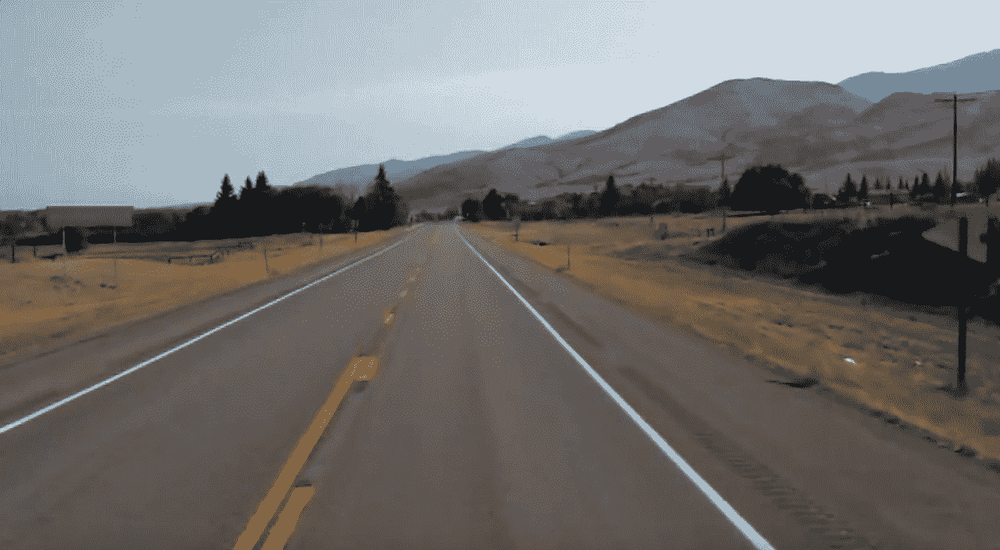

### Canny 边缘检测

在这一节中，我们将讨论 canny 边缘检测，这是一种我们将用来编写检测图像边缘的程序的技术。因此，我们试图找到图像中强度和颜色发生急剧变化的区域。

请记住，图像可以作为矩阵(像素阵列)来读取，这一点很重要。像素包含图像中某个位置的光强度。每个像素的亮度由从 0 到 255 排列的数值表示。0 值表示无强度(黑色)，255 表示最大强度(白色)。

注意:梯度是一系列像素亮度变化的量度。强梯度表示剧烈的变化，而小梯度表示轻微的变化。

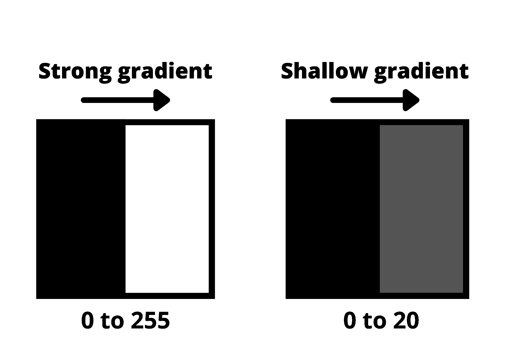

梯度的增强有助于我们识别图像中的边缘。边缘由相邻像素的亮度值的差异来定义。每当你看到强度的急剧变化或亮度的快速变化时，在渐变图像中就会有相应的亮像素。通过追踪这些像素，我们获得了边缘。

现在，我们将应用这种直觉来检测图像的边缘。这个过程包括三个步骤。

### 步骤 1:灰度调整

将我们的图像转换为灰度的原因是为了便于处理。与具有三个以上值的彩色图像相比，灰度图像只有一个像素强度值(0 或 1)。这将使灰度图像在单一通道中工作，这将比三通道彩色图像更容易和更快地进行处理。

为了在代码中实现这一点，我们将在 NumPy 的帮助下复制之前创建的图像数组。

```py
image = cv2.imread('lane.jpg')
lane_image = np.copy(image) #creating copy of the image
```

重要的是创建一个`image`变量的**副本**，而不是设置新变量等于图像。这样做将确保`lane_image`中所做的更改不会影响`image`。

现在，我们借助 openCV 库中的`cvtColor`函数将图像转换成灰度。

```py
gray = cv2.cvtColor(lane_image, cv2.COLOR_RGB2GRAY) #converting to gray-scale
```

标志`COLOR_RGB2GRAY`作为第二个参数传递，帮助将 RGB 颜色转换为灰度图像。

为了输出这个转换，我们需要在结果窗口中传递`gray`。

```py
import cv2
import numpy as np

image = cv2.imread('lane.jpg')
lane_image = np.copy(image)
gray = cv2.cvtColor(lane_image, cv2.COLOR_RGB2GRAY) 

cv2.imshow('result', gray) #to output gray-scale image
cv2.waitKey(0)
```

如果我们运行这个程序，得到的图像应该如下所示。

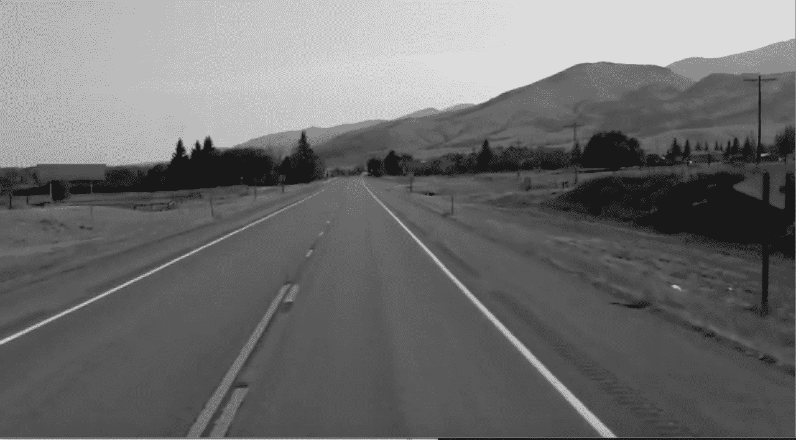

### 第二步:减少噪音和平滑

尽可能多地识别图像中的边缘非常重要。但是，我们还必须过滤任何图像噪声，这些噪声会产生伪边缘，并最终影响边缘检测。这种降噪和图像平滑将通过一种叫做**高斯模糊的过滤器来完成。**

请记住，图像存储为离散像素的集合。灰度图像中的每个像素由描述像素亮度的单个数字表示。为了平滑图像，我们需要用像素周围像素亮度的平均值来修改像素的值。

平均像素以减少噪声将通过内核来完成。这个正态分布数字的内核窗口贯穿我们的整个图像，并将每个像素值设置为等于其相邻像素的加权平均值，从而平滑我们的图像。

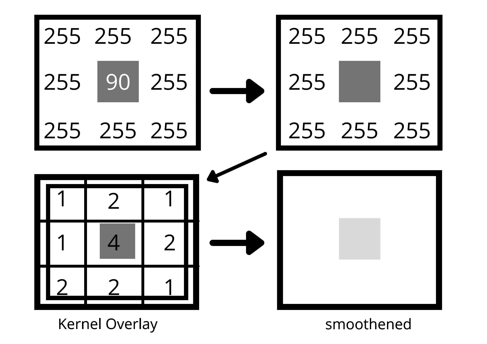

为了用代码表示这个卷积，我们在灰度图像上应用了`cv2.GaussianBlur()`函数。

```py
blur = cv2.GaussianBlur(gray, (5, 5), 0)
```

这里，我们在图像上应用了一个 5 * 5 的内核窗口。内核的大小取决于具体情况，但在大多数情况下，5*5 的窗口是理想的。我们将变量`blur`传递给`imshow()`以获得输出。因此，获得高斯模糊图像的最终代码如下所示:

```py
import cv2
import numpy as np

image = cv2.imread('lane.jpg')
lane_image = np.copy(image)
gray = cv2.cvtColor(lane_image, cv2.COLOR_RGB2GRAY) 
blur = cv2.GaussianBlur(gray, (5, 5), 0)

cv2.imshow('result', blur) #to output gaussian image.
cv2.waitKey(0)
```

结果是通过卷积具有减少的噪声的高斯值的核而获得的模糊图像。

*注意:这是理解高斯模糊的可选步骤。当我们在下一步执行 canny 边缘检测时，它会自动为我们执行。*

### 第三步:精明的方法

为了理解这个概念，你必须回忆起图像也可以用 2D 坐标空间- X & Y 来表示

x 对应于图像的宽度(列数), Y 对应于图像的高度(行数)。宽度和高度的乘积给出了一幅图像的像素总数。这告诉我们，我们不仅可以将图像表示为数组，还可以表示为 X 和 Y 的连续函数，即: ***f(x，y)* 。**

由于 *f(x，y)* 是一个数学函数，我们可以执行运算来确定图像中像素亮度的快速变化。canny 方法会给出函数在 x 和 y 方向的导数。我们可以用这个导数来测量相邻像素的亮度变化。

导数的小变化对应于强度的小变化，反之亦然。

通过计算所有方向的导数，我们得到图像的梯度。在我们的代码中调用`cv2.Canny()`函数为我们执行所有这些动作。

```py
cv2.Canny(image, low_threshold, high_threshold)
```

该函数将最强的梯度追踪为一系列白色像素。两个参数`low_threshold`和`high_threshold`允许我们隔离遵循最强梯度的相邻像素。如果梯度大于上限阈值，则它被识别为边缘像素。如果低于下限，就会被拒绝。阈值之间的梯度仅在连接到强边缘时才被接受。

对于我们的例子，我们将采用 1:3 的高低阈值比率。这次我们输出的是清晰的图像，而不是模糊的图像。

```py
canny = cv2.Canny(blur, 50, 150) #to obtain edges of the image
cv2.imshow('result', Canny)
cv2.waitKey(0) 
```

生成的图像如下所示:

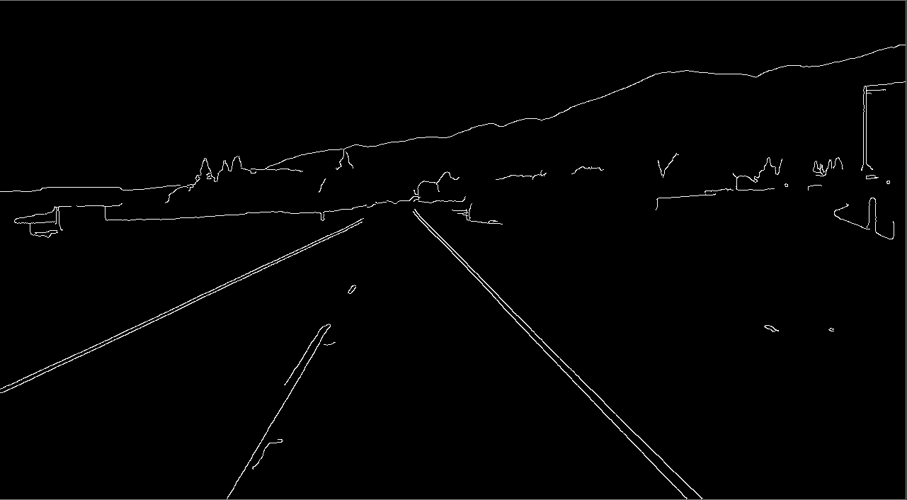

### 隔离感兴趣区域(ROI)

在我们教我们的模型检测之前，我们必须指定感兴趣的区域来检测车道线。

在这种情况下，让我们把感兴趣的区域作为道路的右侧，如图所示。

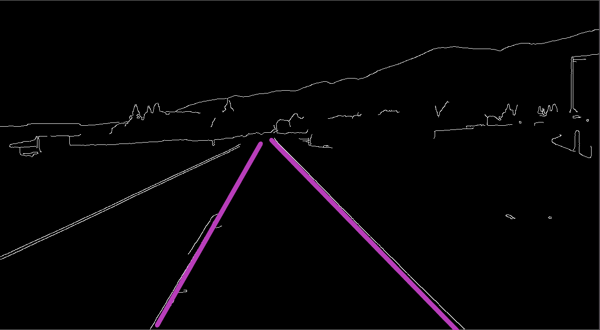

由于我们的代码中有很多变量和函数，现在是时候通过定义一个函数来包装一切了。

```py
import cv2
import numpy as np

def canny(image):
    gray = cv2.cvtColor(image, cv2.COLOR_RGB2GRAY)
    blur = cv2.GaussianBlur(gray,(5, 5), 0)
    canny = cv2.Canny(blur, 50, 150)
    return canny

image = cv2.imread('lane.jpg')
lane_image = np.copy(image)
canny = cv2.Canny(lane_image) 
cv2.imshow('result', canny)
cv2.waitKey(0)
```

为了阐明我们感兴趣区域的确切位置，我们使用 **matplotlib** 库来定位坐标并隔离该区域。

```py
import cv2
import numpy as np
import matplotlib.pyplot as plt

def canny(image):
    gray = cv2.cvtColor(image, cv2.COLOR_RGB2GRAY)
    blur = cv2.GaussianBlur(gray,(5, 5), 0)
    canny = cv2.Canny(blur, 50, 150)
    return canny

image = cv2.imread('lane.jpg')
lane_image = np.copy(image)
canny = cv2.Canny(lane_image) 
plt.imshow(canny)
plt.show()
```

运行这个程序会得到一个图像，其中 X 和 Y 坐标对应于我们感兴趣的区域。

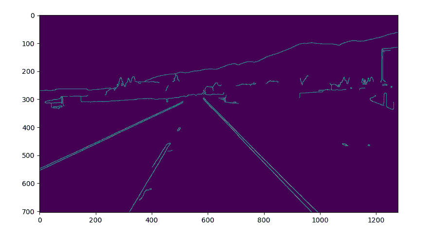

现在我们已经有了 ROI 所需的测量值，我们将生成一个图像来掩盖其他所有的东西。我们得到的图像是一个带有原始图像中指定顶点的多边形的遮罩。

```py
def region_of_interest(image):
    height = image.shape[0]
    polygons = np.array([
    [(200, height), (1100, height), (550, 250)]
    ])
    mask = np.zeros_like(image)
    cv2.fillPoly(mask, polygons, 255)
    return mask

 ...

cv2.imshow('result', region_of_interest(canny)) #changing it to show ROI instead of canny image.

...
```

上面的代码非常简单明了。它返回我们视野的封闭区域，这个区域是三角形的。

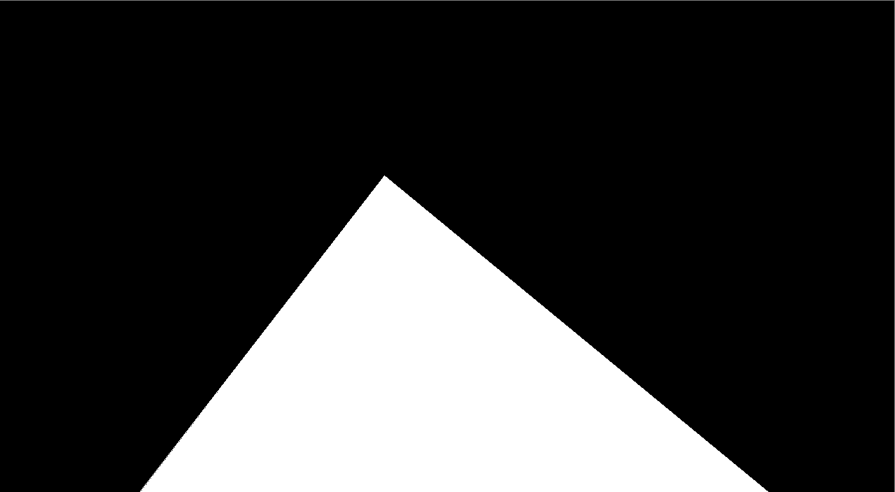

这个图像很重要，因为它代表了我们感兴趣的区域，具有很强的梯度差异。三角形区域中的像素亮度值为 255，而图像的其余部分为零。由于此图像与我们的原始图像具有相同的测量值，因此它可以用来轻松地从我们之前生成的 canny 图像中提取线条。

我们可以通过利用 OpenCV 的`cv2.bitwise_and()`函数来实现这一点，该函数计算两幅图像的**逐位&** ，以仅显示由遮罩的多边形轮廓跟踪的 ROI。关于使用`bitwise_and`的更多信息，请参考 [openCV 文档](https://docs.opencv.org/master/d0/d86/tutorial_py_image_arithmetics.html)。

```py
def region_of_interest(image):
    height = image.shape[0]
    polygons = np.array([
    [(200, height), (1100, height), (550, 250)]
    ])
    mask = np.zeros_like(image)
    cv2.fillPoly(mask, polygons, 255)
	masked_image = cv2.bitwise_and(image, mask)
    return masked_image

...

cropped_image = region_of_interest(canny)
cv2.imshow('result', cropped_image)

...
```

您应该会看到如下所示的输出-

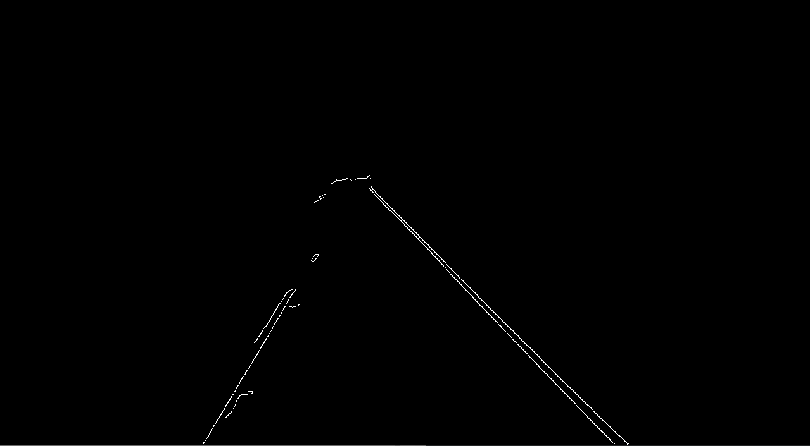

这个过程的最后一步是使用**霍夫变换**来检测我们感兴趣的孤立区域中的直线。

### 霍夫变换技术

我们现在拥有的图片只是一系列像素，我们无法直接找到几何表示来了解斜率和截距。

由于图像从来都不是完美的，我们不能遍历像素来寻找斜率和截距，因为这是一项非常困难的任务。这就是可以使用霍夫变换的地方。它帮助我们找出突出的线条，并连接图像中不相交的边缘点。

我们通过比较正常的 X-Y 坐标空间和**霍夫空间** (M-C 空间)来理解这个概念。

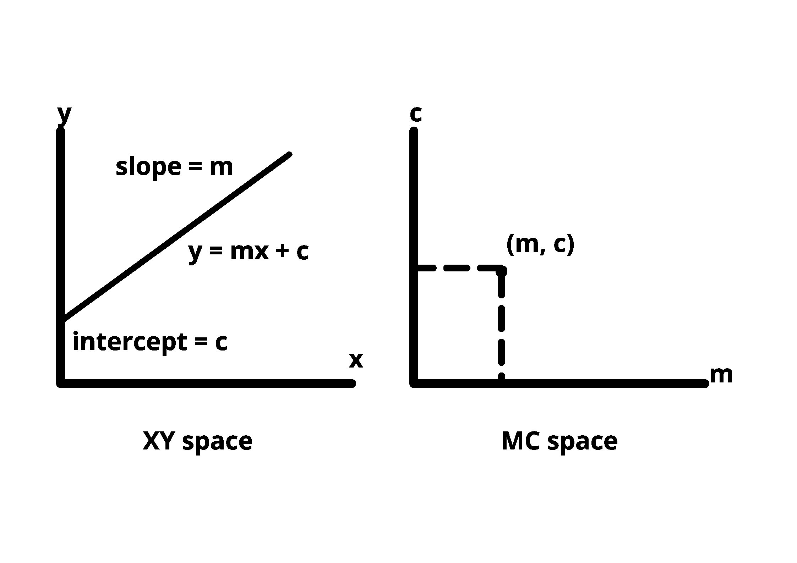

XY 平面上的一个点可以有任意多条线穿过。同样的道理，如果我们在同一个 XY 平面上取一条线，许多点都通过这条线。

为了识别图片中的线条，我们必须将每个边缘像素想象为坐标空间中的一个点，我们将把该点转换为霍夫空间中的一条线。

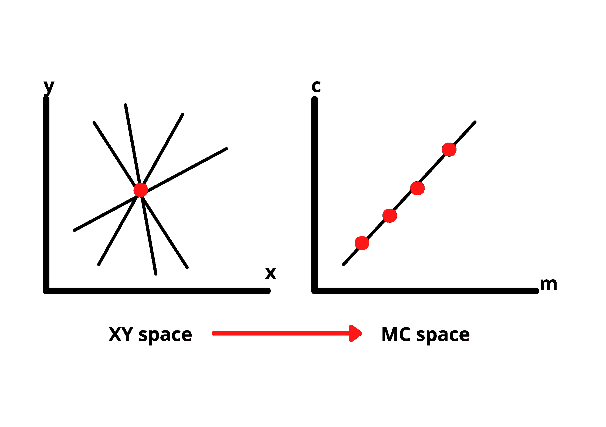

我们需要找到两条或更多条表示它们在霍夫空间中相交的对应点(在 XY 平面上)的线来检测这些线。这样我们就知道这两点属于同一条线。

从一系列点中寻找可能的线的想法就是我们如何在我们的梯度图像中找到线。但是，模型也需要线条的参数来识别它们。

为了获得这些参数，我们首先将霍夫空间分成一个包含小方块的网格，如图所示。对应于具有最多交点的正方形的 **c** 和 **m** 的值将用于绘制最佳拟合线。

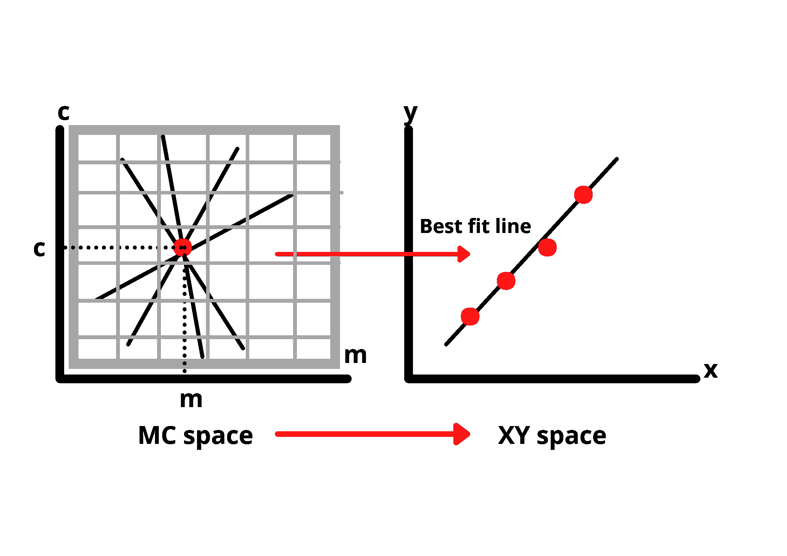

这种方法适用于有坡度的线。但是，如果我们处理的是一条直线，斜率将永远是无穷大，我们无法精确地计算这个值。所以，我们在方法上做了一点小小的改变。

我们不是将我们的线方程表示为 ***y = mx + c*** ，而是在极坐标系中表示，即；*ρ= xcosθ+ysinθ。*

*   *ρ =垂直于* *原点的距离。*
*   *θ= x 轴法线的倾斜角。*

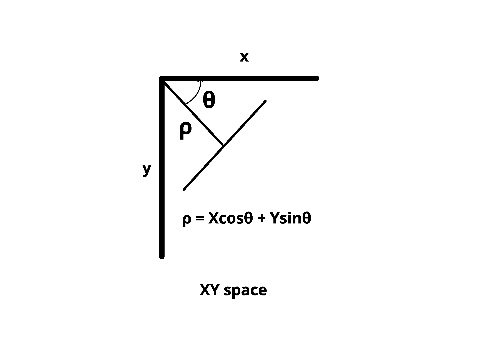

通过在极坐标中表示直线，我们在霍夫空间中得到正弦曲线而不是直线。对于通过我们点的线的 *ρ* 和 *θ* 的所有不同值，确定该曲线。如果我们有更多的点，他们在我们的霍夫空间创造更多的曲线。与前一种情况类似，将采用与相交最多的曲线相对应的值来创建最佳拟合线。

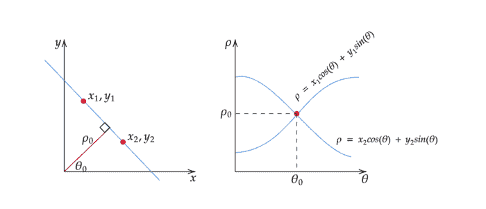

[image source](https://towardsdatascience.com/lines-detection-with-hough-transform-84020b3b1549)

### 实现霍夫变换

既然我们终于有了识别图像中线条的技术，让我们在代码中实现它。幸运的是，openCV 已经有一个名为`cv2.HoughLinesP()`的函数可以用来为我们完成这项任务。

```py
lines = cv2.HoughLinesP(cropped_image, 2, np.pi/180, 100, np.array([]), minLineLength=40, maxLineGap=5)
```

第一个参数是之前生成的裁剪图像，它是孤立车道线的渐变图像。第二个和第三个参数指定了**霍夫累加器数组**的分辨率(为识别大多数交叉点而创建的网格)。第四个参数是确定检测一行所需的最小投票数所需的阈值。

在真实图像中显示这些线条之前，让我们定义几个函数来表示它们。我们将定义 3 个函数来优化和显示车道线。

*   **display_lines:** 我们定义这个函数，用与原始图像相似的度量在黑色图像上标记线条，然后将其融合到我们的彩色图像中。

```py
def display_lines(image, lines):
    line_image = np.zeros_like(image)
    if lines is not None:
        for x1, y1, x2, y2 in lines:
            cv2.line(line_image, (x1, y1), (x2, y2), (255, 0, 0), 10)
    return line_image
```

我们利用`cv2.addWeight()`来组合线图像和彩色图像。

```py
line_image = display_lines(lane_image, averaged_lines)

combo_image = cv2.addWeighted(lane_image, 0.8, line_image, 1, 1)
```

*   **make_coordinates:** 这将为我们指定坐标，以便标记斜率和 y 轴截距。

```py
def make_coordinates(image, line_parameters):
    slope, intercept = line_parameters
    y1 = image.shape[0]
    y2 = int(y1*(3/5))
    x1 = int((y1 - intercept)/slope)
    x2 = int((y2 - intercept)/slope)
    return np.array([x1, y1, x2, y2])
```

*   **average_slope_intercept:** 我们首先声明两个空列表- `left_fit`和`right_fit`，它们将分别包含左边平均线的坐标和右边线的坐标。

```py
def average_slope_intercept(image, lines):
    left_fit = []
    right_fit = []
    for line in lines:
        x1, y1, x2, y2 = line.reshape(4)
        parameters = np.polyfit((x1, x2), (y1, y2), 1)
        slope = parameters[0]
        intercept = parameters[1]
        if slope < 0:
            left_fit.append((slope, intercept))
        else:
            right_fit.append((slope, intercept))
    left_fit_average = np.average(left_fit, axis=0)
    right_fit_average = np.average(right_fit, axis=0)
    left_line = make_coordinates(image, left_fit_average)
    right_line = make_coordinates(image, right_fit_average)
    return np.array([left_line, right_line])
```

`np.polyfit()`将为我们提供拟合我们的点的直线参数，并返回一个描述斜率和 y 截距的系数向量。

最后，我们展示了完全检测到车道线的`combo_image()`。

```py
cv2.imshow('result', combo_image)
```

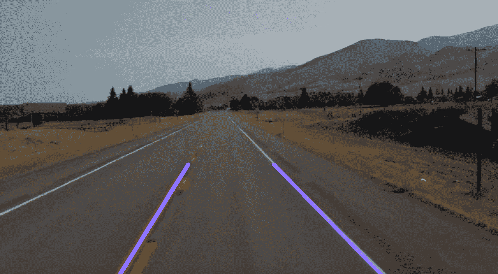

### 检测视频中的车道

遵循相同的过程来检测视频中的车道。OpenCV 的 **VideoCapture** 对象使这变得很容易。该对象允许您逐帧读取并执行所需的操作。

一旦你下载了这个[视频](https://github.com/Nigama-oss/Lane-Detection/blob/master/test2.mp4?raw=true)，将它移动到你当前工作的项目文件夹中。

我们为视频设置了一个视频捕获对象，并应用我们已经实现的算法来检测视频中的线条，而不是静态图像。

```py
cap = cv2.VideoCapture('test2.mp4')
while(cap.isOpened()):
    _, frame = cap.read()
    canny_image = canny(frame)
    cropped_image = region_of_interest(canny_image)
    lines = cv2.HoughLinesP(cropped_image, 2, np.pi/180, 100, np.array([]), minLineLength=40, maxLineGap=5)
    averaged_lines = average_slope_intercept(frame, lines)
    line_image = display_lines(frame, averaged_lines)
    combo_image = cv2.addWeighted(frame, 0.8, line_image, 1, 1)
    cv2.imshow('result',combo_image)
    if cv2.waitKey(1) == ord('q'):
        break
cap.release()
cv2.destroyAllWindows()
```

*注意:在尝试实现上述功能时，最好注释掉与静态图像相关的代码，稍后再使用* *。*

```py
#image = cv2.imread('lane.jpg')
#lane_image = np.copy(image)

#canny_image = canny(lane_image)
#cropped_image = region_of_interest(canny_image)
#lines = cv2.HoughLinesP(cropped_image, 2, np.pi/180, 100, np.array([]), minLineLength=40, maxLineGap=5)
#averaged_lines = average_slope_intercept(lane_image, lines)
#line_image = display_lines(lane_image, averaged_lines)

#combo_image = cv2.addWeighted(lane_image, 0.8, line_image, 1, 1)

#cv2.imshow('result',combo_image)
#cv2.waitKey(0)
```

如果一切顺利，您将在视频中看到相同的车道线。

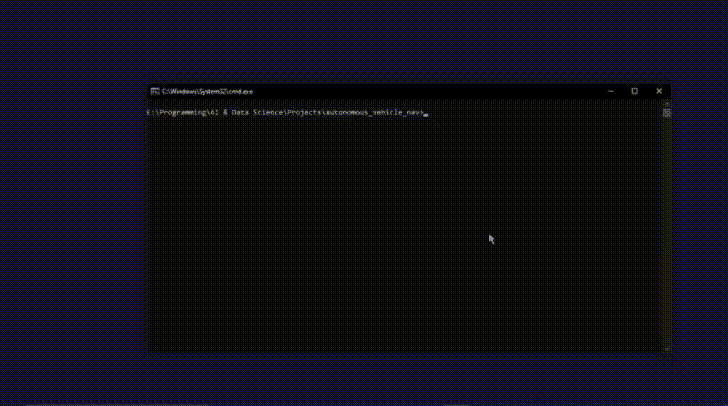

这有很多解释，在某些时候混淆是很正常的。所以，这就是你完成后在`lanes.py`上的整个代码应该看起来的样子。

```py
import cv2
import numpy as np

def make_coordinates(image, line_parameters):
    slope, intercept = line_parameters
    y1 = image.shape[0]
    y2 = int(y1*(3/5))
    x1 = int((y1 - intercept)/slope)
    x2 = int((y2 - intercept)/slope)
    return np.array([x1, y1, x2, y2])

def average_slope_intercept(image, lines):
    left_fit = []
    right_fit = []
    for line in lines:
        x1, y1, x2, y2 = line.reshape(4)
        parameters = np.polyfit((x1, x2), (y1, y2), 1)
        slope = parameters[0]
        intercept = parameters[1]
        if slope < 0:
            left_fit.append((slope, intercept))
        else:
            right_fit.append((slope, intercept))
    left_fit_average = np.average(left_fit, axis=0)
    right_fit_average = np.average(right_fit, axis=0)
    left_line = make_coordinates(image, left_fit_average)
    right_line = make_coordinates(image, right_fit_average)
    return np.array([left_line, right_line])

def canny(image):
    gray = cv2.cvtColor(image, cv2.COLOR_RGB2GRAY)
    blur = cv2.GaussianBlur(gray,(5, 5), 0)
    canny = cv2.Canny(blur, 50, 150)
    return canny

def display_lines(image, lines):
    line_image = np.zeros_like(image)
    if lines is not None:
        for x1, y1, x2, y2 in lines:
            cv2.line(line_image, (x1, y1), (x2, y2), (255, 0, 0), 10)
    return line_image

def region_of_interest(image):
    height = image.shape[0]
    polygons = np.array([
    [(200, height), (1100, height), (550, 250)]
    ])
    mask = np.zeros_like(image)
    cv2.fillPoly(mask, polygons, 255)
    masked_image = cv2.bitwise_and(image, mask)
    return masked_image

#image = cv2.imread('lane.jpg')
#lane_image = np.copy(image)

#canny_image = canny(lane_image)
#cropped_image = region_of_interest(canny_image)
#lines = cv2.HoughLinesP(cropped_image, 2, np.pi/180, 100, np.array([]), minLineLength=40, maxLineGap=5)
#averaged_lines = average_slope_intercept(lane_image, lines)
#line_image = display_lines(lane_image, averaged_lines)

#combo_image = cv2.addWeighted(lane_image, 0.8, line_image, 1, 1)

#cv2.imshow('result',combo_image)
#cv2.waitKey(0)

cap = cv2.VideoCapture('test2.mp4')
while(cap.isOpened()):
    _, frame = cap.read()
    canny_image = canny(frame)
    cropped_image = region_of_interest(canny_image)
    lines = cv2.HoughLinesP(cropped_image, 2, np.pi/180, 100, np.array([]), minLineLength=40, maxLineGap=5)
    averaged_lines = average_slope_intercept(frame, lines)
    line_image = display_lines(frame, averaged_lines)
    combo_image = cv2.addWeighted(frame, 0.8, line_image, 1, 1)
    cv2.imshow('result',combo_image)
    if cv2.waitKey(1) == ord('q'):
        break
cap.release()
cv2.destroyAllWindows()
```

### 最后的想法

这是车道检测模型的一个简单例子。你可以进一步推进这个项目，使算法适应实时视频数据，并在汽车移动时检测车道线。

恭喜你走到这一步！希望本教程对您有所帮助，并探索与此概念相关的更多领域。