# 理解 GauGAN 第 1 部分:揭开 Nvidia 的风景画 GANs

> 原文：<https://blog.paperspace.com/nvidia-gaugan-introduction/>

2019 年在 CVPR 提交的最有趣的论文之一是英伟达的 *[语义图像合成与空间自适应归一化](https://nvlabs.github.io/SPADE/)。*这是他们的新算法 GauGAN 的特色，它可以有效地将涂鸦变成现实。这项技术已经在工作了一段时间，从 Nvidia 在 2017 年首次推出 [Pix2PixHD](https://github.com/NVIDIA/pix2pixHD) 和 2018 年推出 [Vid2Vid](https://github.com/NVIDIA/vid2vid) 开始。最后，2019 年给了我们印象深刻的 GauGAN 的加入。看看 Nvidia 为 2020 年准备了什么会很有趣。

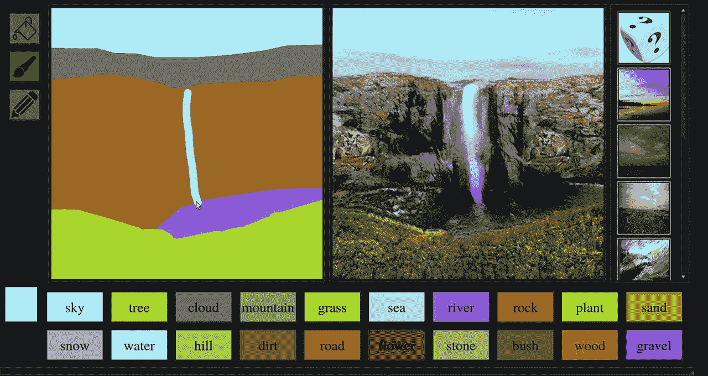

*GauGAN can turn doodles into lifelike images. This image, courtesy of* [*Nvidia*](https://blogs.nvidia.com/blog/2019/03/18/gaugan-photorealistic-landscapes-nvidia-research/)*, demonstrates how GauGAN can produce realistic versions of different elements such as "road," "tree," etc.*

在本文中，我们将看到 GauGAN 算法如何在粒度级别上工作。我们还将深入了解为什么 Nvidia 在这些算法的使用上投资如此之大。

我还想指出，在这篇文章中，我将主要关注 GauGAN，并避免在这篇文章中过于深入 Pix2PixHD。这两种算法都生成图像，并且有很多共同点，GauGAN 是最近开发的。因此，我将把重点放在 GauGAN 上，只在出现与 GauGAN 显著不同的特性时才提到 Pix2PixHD，主要是为了避免重复。

这是四部分系列的第一部分。我们还将介绍:

*   [定制数据集训练](https://blog.paperspace.com/gaugan-training-on-custom-datasets/)
*   [高根评估技术](https://blog.paperspace.com/gaugan-evaluation-techniques/)
*   [调试培训&决定 GauGAN 是否适合你](https://blog.paperspace.com/debugging-gaugan-training-and-business-considerations/)

你也可以在 [ML Showcase](https://ml-showcase.paperspace.com/projects/gaugan) 上查看 GauGAN，并在免费的 GPU 上运行模型。

我们开始吧！

## 条件 gan

gan 通常用于生成数据。你通常提供一个噪声输入，网络将利用它产生一个相关的输出。这种 GAN 非常有用，因为除了随机噪声之外，它不需要任何东西来产生数据，任何数字软件都可以产生随机噪声。

另一方面，有条件的 gan 通常采用特定的输入来确定要生成的数据(换句话说，生成的数据是以我们提供的输入为条件的)。例如，在 GauGAN 中，输入是语义分割图，GAN 根据输入图像生成真实图像，如下例所示。

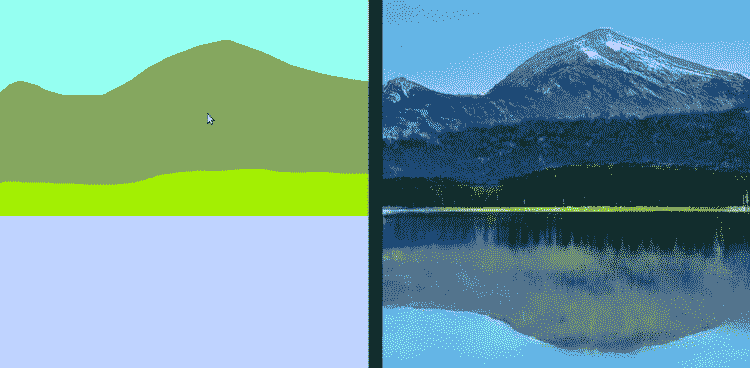

*GauGAN takes a Semantic Segmentation Map (left) as input and produces a photo-realistic image as the output (right). Image Credits: Nvidia*

类似地，其他条件生成网络可以创建:

1.  以前一帧为条件的视频帧。
2.  以平面地图图像为条件的地形地图图像。
3.  以文本描述为条件的图像。

还有更多。

## 高根建筑

像任何其他生成性对抗网络一样，GauGAN 包含一个鉴别器和一个生成器。具体到 GauGAN，Nvidia 引入了一种新的标准化技术，称为[空间自适应标准化](https://arxiv.org/abs/1903.07291)，或通过使用特殊的铲块进行铲标准化。此外，GauGAN 具有一个用于多模态合成的编码器(如果这没有意义，不要担心，我们将在后面讨论)。

发电机的输入包括:

1.  一个一键编码的语义分割图
2.  边缘贴图(可选)
3.  编码的特征向量(可选)

第一个是必需的，而第二个和第三个输入是可选的。无论使用哪一组输入，它们在发送到生成器之前都会进行深度连接。

语义分割图基本上是一次性编码的，因此我们对每个类别都有一个一次性编码的图。这些地图然后被深度连接。

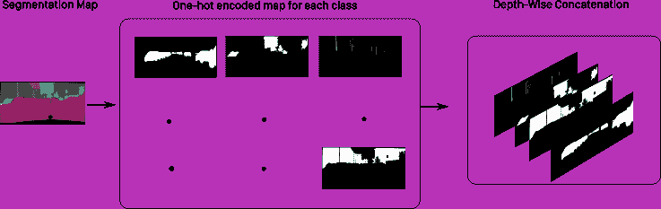

Diagram illustrating how semantic maps are one-hot encoded before being sent to the generator in GauGAN

只有当图像中的对象具有实例 id 时，边缘图才是可能的。在分段标签中，我们只关心对象的类别。如果两辆汽车重叠，那么*汽车*标签将是由两辆重叠汽车组成的斑点。当两个对象重叠时，这可能会混淆算法并导致其性能下降。

为了克服这个问题，在 Pix2PixHD 中引入了语义标签映射的使用。这是一个 0-1 二进制映射，其中除了四个相邻像素不属于同一个实例的像素之外，每个像素都是零。

通过将用作风格指南的图像传递通过编码器来产生编码的特征向量。

## 发电机

GauGAN 的生成器是一个由 SPADE 块组成的全卷积解码器。SPADE 代表空间自适应归一化块。当我们完成架构的高级概述后，我们将详细讨论这个组件。

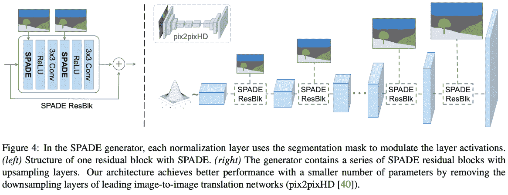

*GauGAN Generator. A miniature version of the Pix2PixHD generator has been shown for comparison. Pix2PixHD has convolutional layers, residual blocks and transpose convolutions in that order. Source:* [*https://arxiv.org/pdf/1903.07291.pdf*](https://arxiv.org/pdf/1903.07291.pdf)

GauGAN 生成器和 Pix2PixHD 的架构有很大的不同。

首先，不涉及下采样。缩减像素采样层构建语义信息。相反，作者选择直接提供语义分割图作为每个 SPADE 块(对应于网络中的不同级别)的输入。

第二，与 Pix2PixHD 不同，上采样是通过最近邻调整大小来执行的，而不是通过使用转置卷积层。转置卷积层失去了很多支持，因为它们容易在图像中产生棋盘状伪像。从业者已经开始转向不可学习的上采样，然后是卷积层。作者只是跟随了这一趋势。

### **铲归一化层**

在论文中，作者认为*无条件规范化*会导致语义信息的丢失。这种形式的规范化包括批量规范化和实例规范化。

深度学习中的规范化通常包括三个步骤:

1.  计算相关统计数据(如平均值和标准偏差)。
2.  通过减去平均值并将该数字除以标准偏差来标准化输入。
3.  通过使用可学习的参数$ \gamma，\beta $对输入$ y = \gamma x + \beta $进行重新缩放

批次定额和实例定额在步骤 1 中有所不同，即如何计算统计数据。在批处理规范中，我们计算图像批处理的统计数据。在实例规范中，我们计算每个图像。

这里有一个例子可以帮助你发挥想象力。

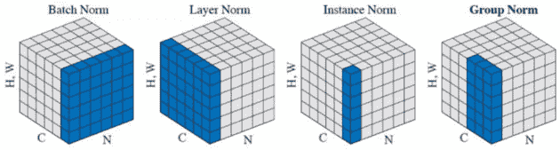

*In batch normalization, the statistics are computed over feature maps across all batches. In instance normalization, the statistics are computed over feature maps across a single image.*

然而，在 SPADE 中，我们以这样的方式修改批范数(注意，我们仍然跨每个特征图计算小批的统计)，即我们学习特征图中每个像素的不同参数集，而不是学习每个通道的单个参数集。我们直接通过增加批范数参数的数量来达到像素的数量。

#### **铲形发生器模块**

作者介绍了一个 SPADE 生成器模块，这是一个小的残差卷积网络，它产生两个特征映射:一个对应于逐像素的＄\ beta ＄,另一个对应于逐像素的＄\ gamma＄。这些图的每个像素代表用于重新缩放特征图中相应像素的值的参数。

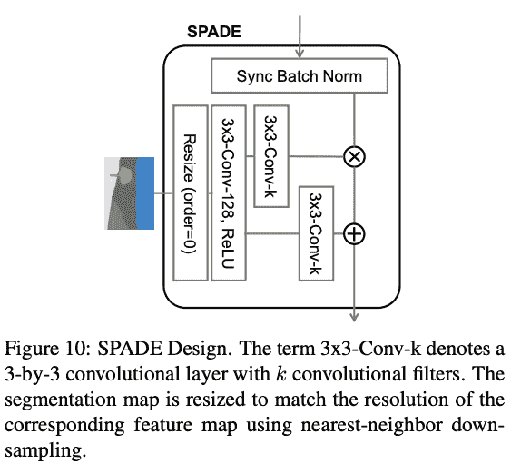

*Design of a SPADE Unit. Note, this describes the **SPADE** unit in the **SPADEResBlk** demonstrated in the diagram above.*

上图可能会让一些读者感到困惑。我们有一个叫做 Batch Norm 的模块，它只执行统计数据的计算。SPADE 中统计量的计算类似于批量定额。稍后进行重新缩放。

在多 GPU 系统上如何实现规范化的上下文中，同步规范化被称为同步规范化。通常，如果您的批处理大小为 32，并且您有 8 个 GPU，`PyTorch's nn.BatchNorm2d` layer 将跨每个 GPU 分别计算 4 个批处理的统计数据，并更新参数。在同步批处理规范中，统计数据是在全部 32 幅图像上计算的。当每个 GPU 的批处理大小很小时，比如 1 或 2，同步规范化很有用。小批量计算统计数据可能会产生非常嘈杂的估计值，导致训练紧张。

作为 out of the SPADE 模块获得的特征映射被逐元素相乘并添加到归一化的输入映射中。

虽然没有在本文的图表中显示，但每个卷积层都遵循谱范数。首先，频谱范数限制了卷积滤波器的 Lipschitz 常数。关于谱范数的讨论超出了本文的范围。我已经给出了一篇讨论谱范数的文章的链接。

这是描述高根的方程式。

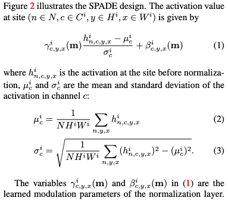

#### SPADE 为什么有用？

第一个原因是 GauGAN 的输入是一个语义图，它被进一步一次性编码。

这意味着 GAN 必须采用统一值的区域，精确地说是 1，并产生具有不同值的像素，以便它们看起来像真实的物体。与特征图中每个通道的单组批范数参数相比，为每个像素设置不同组的批范数参数有助于更好地处理这项任务。

作者还声称 SPADE 导致更多的**区别性**语义信息。为了支持他们的观点，他们拍摄了两幅图像，这两幅图像都只有一个标签，一幅是天空，另一幅是草地。虽然我发现下面的推理很弱，但为了明智地涵盖这篇论文，我还是要指出来。

作者给出了一个例子来支持他们的说法，他们拍摄了两张图像，只包含一个标签。一个是天空，一个是草地。对这两个图像应用卷积会产生不同的值，但值是一致的。作者接着指出，应用实例范数将把两个不同值但一致的特征映射变成一个只含零点的同值特征映射。这导致语义信息的丢失。

然后，他们继续展示 SPADE 和 Instance Norm 的输出如何在一个包含完全相同标签的语义图中有所不同。

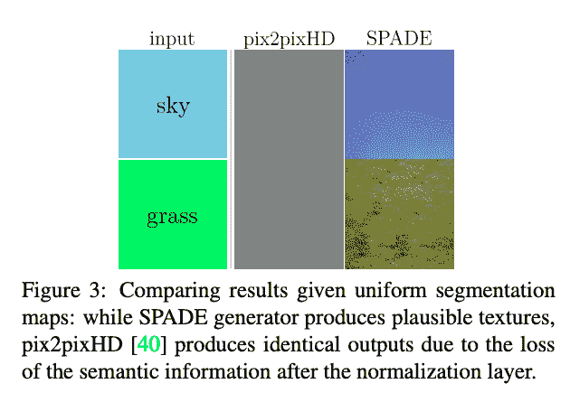

然而，这似乎不像是苹果之间的比较。首先，作者声称标准化的结果是信息被抽取。然而，黑桃和实例规范中的标准化步骤是相同的。它们不同的地方是重新缩放步骤。

第二，在 Pix2PixHD 中，实例范数层的参数是不可学习的，实例范数仅仅是执行归一化($ \ gamma $设置为 1，$\beta$设置为 0)。然而，在 GauGAN，SPADE 有可学习的参数。

第三，比较批量规范和 SPADE 是比实例规范和 SPADE 更好的比较。这是因为实例 Norm 的有效批处理大小为 1，而 SPADE 和 Batch Norm 都可以利用更大的批处理大小(更大的批处理大小导致更少的噪声统计估计)。

## 鉴别器

通常，鉴别器是一个分类器网络，末端是完全连接的层，根据鉴别器对图像的逼真程度，产生 0 到 1 之间的单一输出。

多尺度 PatchGAN 鉴别器是一个完全卷积的神经网络。它输出一个特征图，然后对其进行平均，以获得图像的“逼真度*”*得分。完全卷积有助于 GAN 工艺尺寸不变。

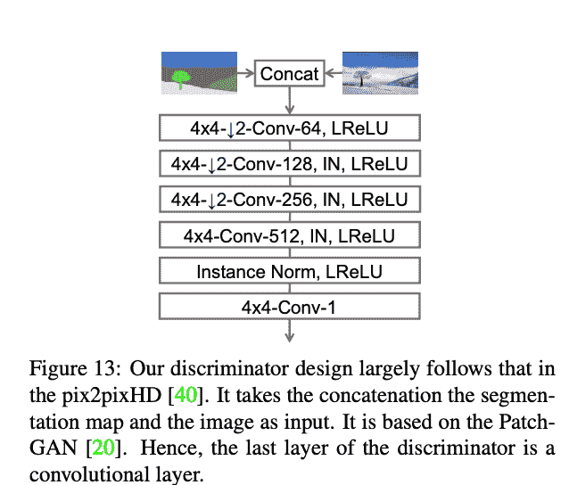

文章认为鉴别器和发生器一样使用谱范数。然而，看一下实现就知道使用了实例规范。这也反映在图表中。

## 编码器

与普通的 GANs 不同，GauGAN 不采用随机噪声向量，而只采用语义图。这意味着给定一个单一的输入语义图，输出总是确定的。这违背了图像合成的精神，因为生成不同输出的能力是非常重要的。仅重构输入的 GAN 与单位函数一样好。我们进行合成以生成超出我们训练数据的数据，而不仅仅是使用神经网络来重建它。

为此，作者设计了一种编码器。编码器主要获取一幅图像，将图像编码成两个向量。这两个向量用作正态高斯分布的均值和标准差。然后，从该分布中采样一个随机向量，然后与输入语义图一起连接，作为生成器的输入。

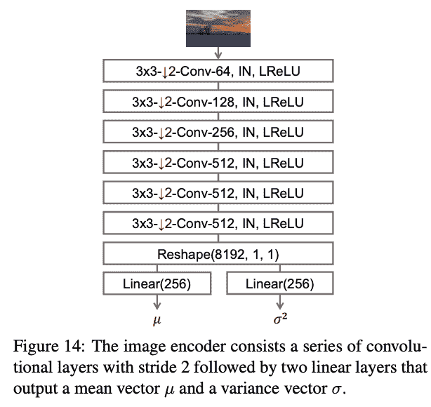

当我们对不同的向量进行采样时，合成结果也随之多样化。

## 风格引导的图像合成

在推断时，该编码器可以用作要生成的图像的样式指南。我们通过编码器传递要用作样式向导的图像。然后，生成的随机向量与输入语义图连接。

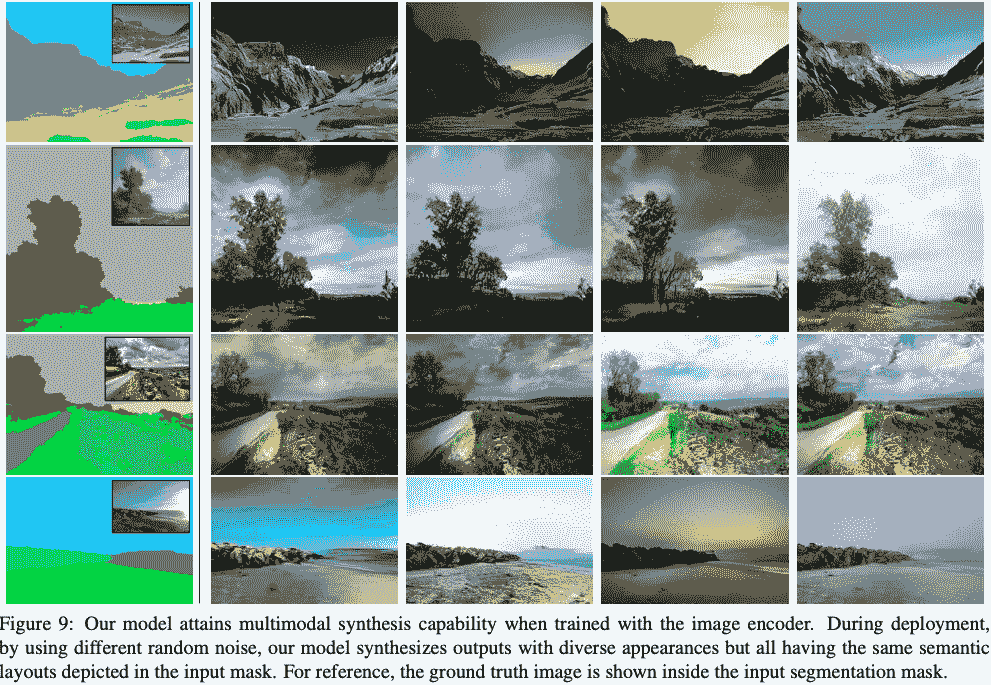

当我们从分布(其平均值和标准偏差由编码器预测)中采样不同的值时，我们将能够探索数据的不同模式。例如，每个随机向量将产生具有相同语义布局但不同模态特征(如颜色、亮度等)的图像。

## 损失函数和训练

GauGAN 的损失函数由以下损失项组成。当我们经过的时候，我会逐一检查。

### **多尺度对抗性损失**

GauGAN 合并了一个铰链损耗，这也见于 SAGAN 和 Geometric GAN 等论文。下面是损失函数

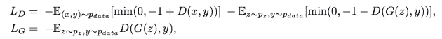

给定生成器生成的图像，我们创建一个图像金字塔，将生成的图像调整到多个比例。然后，我们使用每个尺度的鉴别器计算真实度得分，并反向传播损失。

### 特征匹配损失

这种损失促使 GAN 产生不仅能够欺骗发生器的图像，而且所产生的图像还应该具有与真实图像相同的统计特性。为了实现这一点，我们惩罚真实图像的鉴别器特征图和伪图像的鉴别器特征图之间的 L1 距离。

为生成的图像的所有尺度计算特征匹配损失。

$$ L_{FM} (G，D_k) = \mathop{\mathbb{E}} {}_{s，x } \:\sum_{i=1}^{t} \frac{1}{n_{i}}[||d^{(i)}_{k}{(s,x)}-d^{(i)}_{k}{(s,g(s))}||_1]$ $

这里$k$代表我们使用的图像比例。我们使用来自鉴别器的$T$特征图，并且$N_i$是每个特征图的归一化常数，使得每对特征图之间的 L1 差具有相同的比例，尽管每个特征图中的滤波器数量不同。

### VGG 损失

这种损失与上述损失类似，唯一的区别是，我们不是使用鉴别器来计算特征图，而是使用在 Imagenet 上预先训练的 VGG-19 来计算真实和伪造图像的特征图。然后我们惩罚这些地图之间的 L1 距离。

$$L_{VGG} (G，D_k) = \mathop{\mathbb{E}}_{s，x } \:\sum_{i=1}^{5} \frac{1}{2^i}[||vgg{(x,m_{i})}-vgg(g(s)，m _ I)| | _ 1]$ $ $ $其中\: VGG(x，m)\:is \:the \:feature \:map \:m \:of \:vgg 19 \:when \:x \:is \:the \:input。\ \ \ \ and \:M = \ { " relu 1 \ _ 1 "、" relu2\_1 "、" relu3\_1 "、" relu4\_1 "、" relu5\_1"\} $$

### **编码器损耗**

作者对编码器使用 KL 发散损失
$ $ L _ { KLD } = D _ { KL }(q(z | x)| | p(z))$ $

在上面的 loss 中，$q(z|x)$被称为变分分布，根据给定的实像$x$我们从中抽取出随机向量$z$而$p(z)$是标准的高斯分布

请注意，虽然我们可以在推断过程中使用样式图像，但分割图的基础事实在训练过程中充当我们的样式图像。这是有意义的，因为地面真相的风格和我们试图合成的图像是一样的。

你可以把上面的损失函数看作是自动编码器损失变化的正则化损失项。对于编码器，GauGAN 表现为一种变化的自动编码器，GauGAN 扮演解码器的角色。

对于熟悉变分自动编码器的本笔记，KL 发散损失项充当编码器的正则项。这种损失不利于我们的编码器预测的分布和零均值高斯分布之间的 KL 散度。

如果没有这种损失，编码器可能会通过为我们数据集中的每个训练示例分配不同的随机向量来作弊，而不是实际学习捕获我们数据形态的分布。如果你对这个解释不清楚，我推荐你阅读更多关于可变自动编码器的内容，我在下面提供了链接。

## **结论**

所以，这就结束了我们对 GauGAN 架构及其目标函数的讨论。

在下一部分中，我们将讨论 GauGAN 是如何训练的，以及它与竞争对手的算法相比表现如何，尤其是它的前身 Pix2PixHD。在那之前，你可以查看 GauGAN 的网络演示，它允许你使用一个类似绘画的应用程序创建随机的风景。

## 了解 GauGAN 系列

*   ***第一部分:解开英伟达的风景画甘斯***
*   [第二部分:定制数据集培训](https://blog.paperspace.com/gaugan-training-on-custom-datasets/)
*   [第 3 部分:模型评估技术](https://blog.paperspace.com/gaugan-evaluation-techniques/)
*   [第四部分:调试培训&决定 GauGAN 是否适合你](https://blog.paperspace.com/debugging-gaugan-training-and-business-considerations/)

## 进一步阅读

1.  [批量定额](https://blog.paperspace.com/busting-the-myths-about-batch-normalization/)
2.  [VAE](https://towardsdatascience.com/intuitively-understanding-variational-autoencoders-1bfe67eb5daf)
3.  [高根演示](http://nvidia-research-mingyuliu.com/gaugan)
4.  [FID](https://medium.com/@jonathan_hui/gan-how-to-measure-gan-performance-64b988c47732)
5.  [光谱范数](https://christiancosgrove.com/blog/2018/01/04/spectral-normalization-explained.html)