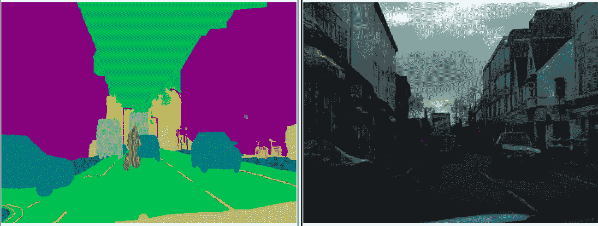
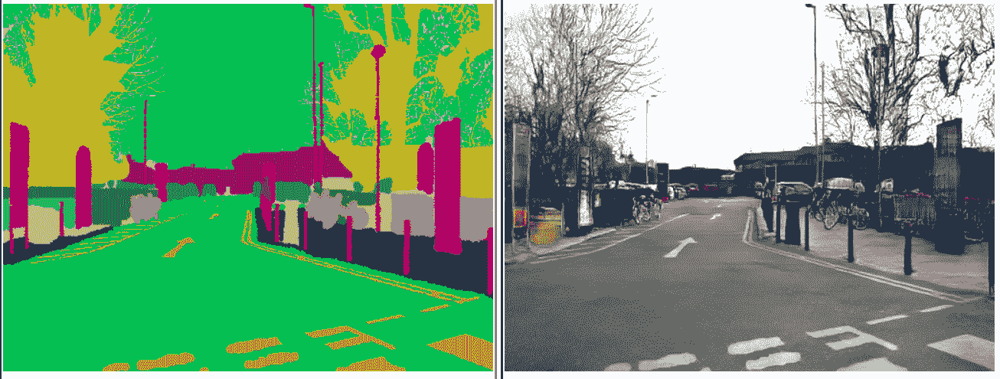
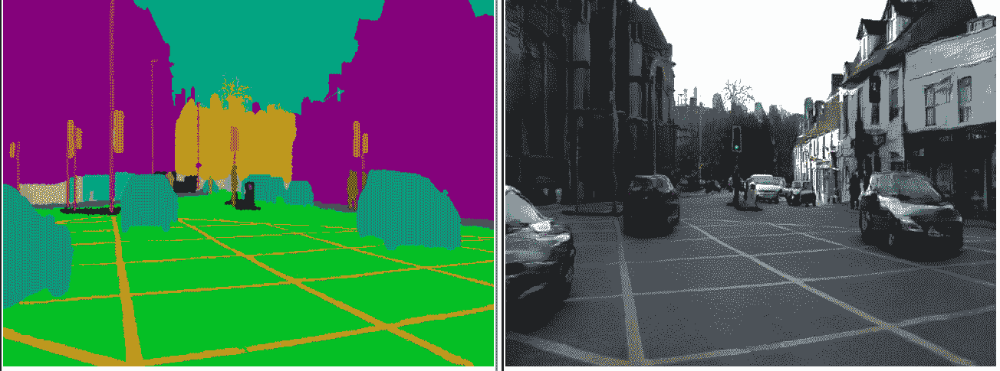
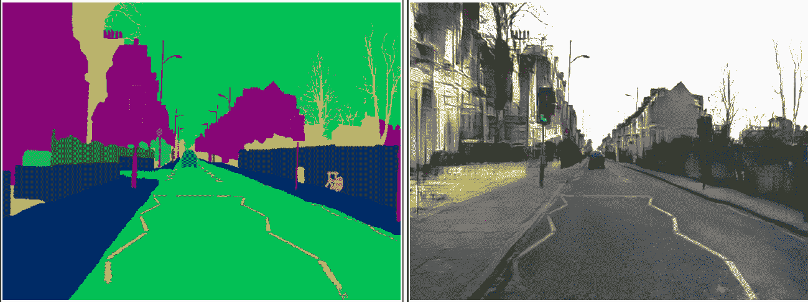
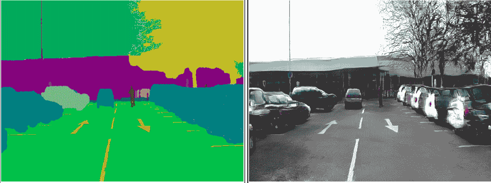
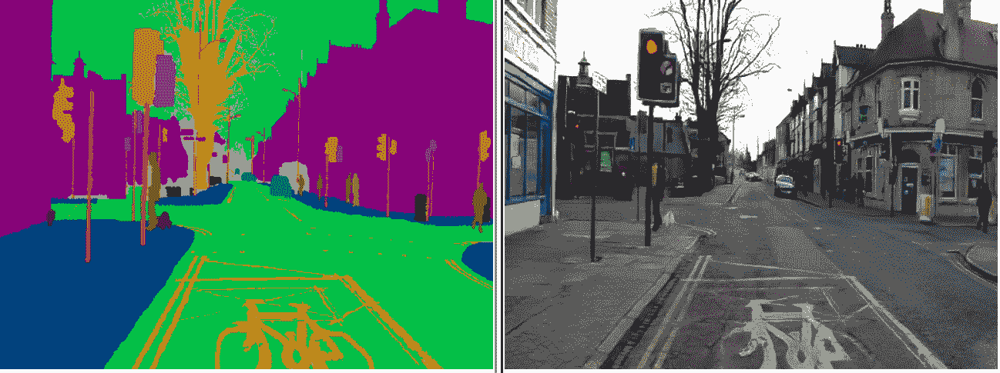
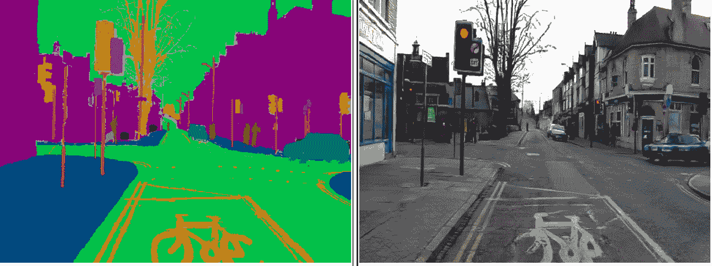

# 理解 GauGAN 第 2 部分:定制数据集培训

> 原文：<https://blog.paperspace.com/gaugan-training-on-custom-datasets/>

在第一部分中，我们介绍了 GauGAN 的基本组件以及它所使用的损失函数。在这一部分中，我们将讨论培训细节，并了解如何在您自己的自定义数据集上设置培训。

第一部分对于理解训练过程如何工作是必要的，但是如果您对训练细节不感兴趣，而只想在您自己的数据上实现 GauGAN，可以直接跳到标题为定制训练的部分。在第 3 部分中，我们将讨论[模型评估技术](https://blog.paperspace.com/gaugan-evaluation-techniques/)，我们将通过查看如何[调试培训并决定 GauGAN 是否适合您](https://blog.paperspace.com/debugging-gaugan-training-and-business-considerations/)来结束这个系列。

您还可以在 [ML Showcase](https://ml-showcase.paperspace.com/projects/gaugan) 上跟随本教程中的代码，并在免费的 GPU 上运行模型。

在我们开始之前，另一件需要注意的重要事情是，Nvidia 的开源实现在许多方面与官方文件中报道的不同。这是可以理解的，因为这本书出版已经快一年了。只要有可能，我会尽力指出这些不同之处。

## 培训详情

### 预处理步骤

GauGAN 仅使用一种大小和纵横比的图像进行训练。这意味着，一旦经过训练，GauGAN 只能保证在与训练时相同大小的图像上工作得最好。如果推断过程中使用的图像太小或太大，预计输出会大大降低。

有多种方法可用于调整图像大小或将其裁剪为 GauGAN 要求的大小。

### 重量初始化

作者报告了使用 *Glorot* 初始化，而该实现使用卷积层的默认 PyTorch 初始化，即明凯统一初始化。

### 学习率政策

当然，被训练的时期的数量将取决于所使用的数据集和被训练的数据类型的复杂性。默认学习率设置为 0.0002。

该实现还利用了 ****[两种时标更新规则学习策略](https://papers.nips.cc/paper/7240-gans-trained-by-a-two-time-scale-update-rule-converge-to-a-local-nash-equilibrium.pdf)**** 。在这里，我们为生成器和鉴别器选择不同的学习速率。通常，发生器的学习速率保持低于鉴别器，以便允许发生器通过缓慢学习来更好地执行，从而导致更稳定的学习。

对于总周期数的前半部分，训练学习率选项`lr`保持为初始值不变。鉴别器和发生器都用这个学习率来训练。

在后半部分，学习率选项`lr`线性衰减到零，在每个时期被更新。对于每次更新，鉴频器学习率设置为`lr * 2`，而发电机学习率设置为`lr / 2`。

### 批量

批量大小通常取决于您想要合成的图像有多大。GauGAN 可能需要大量的 GPU 资源才能很好地工作。在批量大小为 1 的大小为 768 x 576 的图像上训练实现中提供的默认 GauGAN 需要大约 12 GB 的 GPU 内存。Nvidia 开源实施的自述文件中写道:

> **要重现论文中报告的结果，你需要一台配有 8 个 V100 GPUs 的 NVIDIA DGX1 机器**

这相当于 128 GB 的内存。呀！

### 【计算机】优化程序

Adam 优化器用于生成器和鉴别器。$\beta_1$和$\beta_2$分别设置为 0.5 和 0.999。

## 定制培训

### 试运转

在这一部分中，我们将了解如何使用自定义数据集来设置培训。我们首先从 GitHub 获取 GauGAN 并安装所有必要的依赖项。‌

```py
git clone https://github.com/NVlabs/SPADE.git
cd SPADE/
pip install -r requirements.txt 
```

如果你没有 pip，你可以手动在文件`requirements.txt`中查找软件包，并通过 conda 安装。

然后，你必须安装同步批量定额。‌

```py
cd models/networks/
git clone https://github.com/vacancy/Synchronized-BatchNorm-PyTorch
cp -rf Synchronized-BatchNorm-PyTorch/sync_batchnorm .
cd ../../
```

一旦完成，让我们试一试。从抓取预先训练好的模型开始。目前，Nvidia 为 COCO-stuff、Cityscapes 和 ADE20K 数据集提供预训练模型。

首先，从这个 google drive [链接](https://drive.google.com/file/d/12gvlTbMvUcJewQlSEaZdeb2CdOB-b8kQ/view?usp=sharing)下载模型。创建一个名为`checkpoints`的文件夹，并将下载的文件放入其中。然后拉开拉链。‌

```py
cd checkpoints
tar xvf checkpoints.tar.gz
cd ../
```

现在，您可以为这三个数据集运行模型，但让我们为 COCO-stuff 运行模型。因为我们刚刚克隆的 github repo 已经有了一些来自 COCO stuff 数据集的样本文件，这将节省我们一些时间。

确保你在`SPADE`文件夹中并运行:‌

```py
python test.py --name coco_pretrained --dataset_mode coco --dataroot datasets/coco_stuff 
```

现在，如果您使用的是 PyTorch 版本> 1.1，代码可能会抛出以下错误并可能会停止。‌

```py
Traceback (most recent call last):
  File "test.py", line 36, in <module>
    generated = model(data_i, mode='inference')
  File "/home/ayoosh/miniconda3/lib/python3.7/site-packages/torch/nn/modules/module.py", line 541, in __call__
    result = self.forward(*input, **kwargs)
  File "/home/ayoosh/work/SPADE/models/pix2pix_model.py", line 43, in forward
    input_semantics, real_image = self.preprocess_input(data)
  File "/home/ayoosh/work/SPADE/models/pix2pix_model.py", line 130, in preprocess_input
    instance_edge_map = self.get_edges(inst_map)
  File "/home/ayoosh/work/SPADE/models/pix2pix_model.py", line 243, in get_edges
    edge[:, :, :, 1:] = edge[:, :, :, 1:] | (t[:, :, :, 1:] != t[:, :, :, :-1])
RuntimeError: Expected object of scalar type Byte but got scalar type Bool for argument #2 'other' in call to _th_or 
```

这是因为 PyTorch 1.1+中引入了`bool`数据类型。简单的解决方案是转到文件`models/pix2pix_model.py`中的函数`get_edges`，做一个简单的修改。

在函数的第一行后添加行`edge = edge.bool`。总而言之，你的函数`get_edges`应该是这样的:‌

```py
def get_edges(self, t):
    edge = self.ByteTensor(t.size()).zero_()
    edge = edge.bool()
    edge[:, :, :, 1:] = edge[:, :, :, 1:] | (t[:, :, :, 1:] != t[:, :, :, :-1])
    edge[:, :, :, :-1] = edge[:, :, :, :-1] | (t[:, :, :, 1:] != t[:, :, :, :-1])
    edge[:, :, 1:, :] = edge[:, :, 1:, :] | (t[:, :, 1:, :] != t[:, :, :-1, :])
    edge[:, :, :-1, :] = edge[:, :, :-1, :] | (t[:, :, 1:, :] != t[:, :, :-1, :])
    return edge.float()
```

现在，您的代码应该运行了，您可以通过在浏览器中打开文件`results/coco_pretrained/test_latest/index.html`来找到结果。

### 设置您的数据

您首先需要以 GauGAN 的实现可以读取的方式设置您的训练数据。

本质上，你将需要语义分割图，以及它们相应的真实图像来开始。或者，您也可以使用实例分段映射，这可能会提高您的性能。

出于演示目的，我们使用 CamVid 数据集。让我们从创建存储数据集的文件夹开始。‌

```py
mkdir -p datasets/CamVid 
cd datasets/CamVid 
```

然后我们下载数据集。‌

```py
wget -c http://web4.cs.ucl.ac.uk/staff/g.brostow/MotionSegRecData/files/701_StillsRaw_full.zip
unzip 701_StillsRaw_full.zip 
```

然后，获取注释。‌

```py
wget -c http://web4.cs.ucl.ac.uk/staff/g.brostow/MotionSegRecData/data/LabeledApproved_full.zip
mkdir LabeledApproved_full 
cd LabeledApproved_full 
unzip ../LabeledApproved_full.zip
cd ..
```

GauGAN 要求语义分割图是具有一个通道的图像，其中每个像素代表其所属语义类别的索引。如果你的语义分割图是 RGB 或者多边形格式，那么你需要把它们转换成上面提到的格式。您还需要确保类索引是从 0 到`n-1`的连续整数，其中`n`是类的数量。

CamVid 数据集具有 RGB 格式的语义分割图。让我们把它们转换成 GauGAN 要求的格式。

我们首先创建一个文件夹来存储我们的新注释。假设您在目录`datasets/CamVid`中，运行‌

```py
mkdir GauGAN_Annotations 
```

然后，在`CamVid`文件夹中创建一个名为`convert_annotations.py`的 python 脚本。‌

```py
touch convert_annotations.py 
```

我们还需要 CamVid 数据集中每个标签对应的颜色列表。‌

```py
wget http://mi.eng.cam.ac.uk/research/projects/VideoRec/CamVid/data/label_colors.txt
```

### 准备语义分割图

我们现在将使用代码填充脚本`convert_annotations.py`来进行转换。首先进口必要的东西。‌

```py
import numpy as np
import os 
import cv2
from copy import deepcopy
from tqdm import tqdm 
```

然后，我们编写一个函数，将文本文件中的标签提取到一个 numpy 数组中。‌

```py
with open("label_colors.txt", "r") as file:
    label_colors = file.read().split("\n")[:-1]
    label_colors = [x.split("\t") for x in label_colors]
    colors = [x[0] for x in label_colors]
    colors = [x.split(" ") for x in colors]

for i,color in enumerate(colors):
    colors[i] = [int(x) for x in color]

colors = np.array(colors)
```

获取要处理的注释文件的地址。‌

```py
annotations_dir = "LabeledApproved_full"
annotations_files = os.listdir(annotations_dir)
annotations_files = [os.path.join(os.path.realpath("."), annotations_dir, x) for x in annotations_files]
```

现在，我们在一个循环中遍历这些文件。然后，我们在该循环中嵌套一个循环，该循环遍历每个标签类，检查哪些像素属于该标签类(通过检查 RGB 值)，并为它们分配一个类索引。‌

```py
for annotation in tqdm(annotations_files):
    # for each file
    img = cv2.imread(annotation)[:,:,::-1]

    h,w, _ = img.shape

    modified_annotation = np.zeros((h,w))

    for i,color in enumerate(colors):
    	# for each class color, i is the index value
        color = color.reshape(1,1,-1)
        mask = (color == img)

        r = mask[:,:,0]
        g = mask[:,:,1]
        b = mask[:,:,2]

        mask = np.logical_and(r,g)

        mask = np.logical_and(mask, b).astype(np.int64)

        mask *= i

        modified_annotation += mask

    save_path = annotation.replace(annotations_dir, "GauGAN_Annotations")
    cv2.imwrite(save_path, modified_annotation)
```

检查您的`GauGAN_annotations`文件夹以查看转换后的 SegMaps。你可以在这里获得整个脚本

### 准备实例分段图

使用实例映射是可选的。然而，如果你使用它们，你需要用一个通道将它们转换成图像，其中属于每个实例的每个像素必须有不同的值。与语义分割图不同，实例索引不必是 0 到`n-1`范围内的整数。每个实例有一个不同的任意整数就可以了。

这是因为负责创建边缘图的代码(参考上一篇文章阅读边缘图)只关注像素之间的差异。因此，如果您的三个实例编码为{0，1，2}或{34，45，50}，这并不重要。您还可以省略背景对象的实例，并将值设置为背景索引，比如 0。

通常，任何实例分段算法(如 Mask RCNN)或注释工具都会给每个实例不同的 id，而不是颜色，这样您的工作会更容易。例如，Cityscapes 遵循的惯例是`{class_index}000{instance_id}`。例如，一辆汽车的几个实例将被标记为`120001`和`120002`，其中 12 是汽车类别的索引，1 和 2 是汽车的实例。

当您有许多相同类的重叠对象时，实例 id 非常有用。如果没有实例，我尝试使用语义标签本身作为实例。它实际上不起作用。

### 对数据集进行分区

有两种方法可以对数据集进行分区。

1.  首先对数据集进行分区，并在每个分区上分别运行预处理脚本。
2.  做好预处理后再做分区。

在我们的例子中，我们执行步骤 2。为了简单起见，我只在训练集和测试集之间划分数据。您也可以创建一个验证集。

首先，让我们创建四个文件夹来存放我们的零件。确保你从‌运行这段代码

```py
mkdir train_img train_label test_img test_label
```

注意，如果您也使用实例映射，那么您也需要创建`train_inst`和`test_inst`。

现在，创建一个包含分区代码的文件。‌

```py
touch partition_data.py 
```

现在让我们在这个文件中编写分区代码。首先，导入所需的库。‌

```py
import os 
from shutil import copy
import random 
from tqdm import tqdm 
```

‌Then，我们创建一个属于训练集和测试集的文件列表。‌

```py
partition_percentage = 90 
annotations_dir = 'GauGAN_Annotations'
annotations_files = os.listdir(annotations_dir)
annotations_files = [os.path.join(os.path.realpath("."), annotations_dir, x) for x in annotations_files]

train_labels = random.sample(annotations_files, int(partition_percentage / 100 * len(annotations_files)))
test_labels   = [x for x in annotations_files if x not in train_labels]

train_images = [x.replace(annotations_dir, '701_StillsRaw_full').replace("_L", "") for x in train_labels]
test_images  = [x.replace(annotations_dir, '701_StillsRaw_full').replace("_L", "") for x in test_labels] 
```

这里，我们使用 80-20%的分割百分比进行训练测试分割。现在，我们使用 python 的`shutil`包将文件复制到它们各自的文件夹中。‌

```py
for file in tqdm(train_labels):
    src = file
    dst = file.replace(annotations_dir, 'train_label').replace("_L", "")
    copy(src, dst)

for file in tqdm(test_labels):
    src = file
    dst = file.replace(annotations_dir, 'test_label').replace("_L", "")
    copy(src, dst)

for file in tqdm(train_images):
    src = file
    dst = file.replace('701_StillsRaw_full', 'train_img')
    copy(src, dst)

for file in tqdm(test_images):
    src = file
    dst = file.replace('701_StillsRaw_full', 'test_img')
    copy(src, dst) 
```

你可以在这里获得整个脚本

我们完了。现在开始训练模型吧。

### 训练模型

在我们开始培训之前，让我先回顾一下一些兼容性问题。TensorBoard 日志记录代码不适用于 TF 2.0，因为最新版本对 TensorBoard 和 Summary 语法进行了重大更改。您还需要确保您的 scipy 版本< = 1.2.0。如果您使用 PIL 7.0，也可能会遇到一些问题，因此使用 6.1.0 可能会更好。

```py
pip install tensorflow==1.15.0
pip install scipy==1.2.0
pip install pillow==6.1.0
```

为了训练模型，我们转到主文件夹`SPADE`并运行下面的命令。‌

```py
python train.py --name CamVid --dataset_mode custom --no_instance --label_nc 32 --preprocess_mode scale_width --label_dir datasets/CamVid/train_label --image_dir datasets/CamVid/train_img/ --load_size 512 --aspect_ratio 1.3333 --crop_size 512 --ngf 48 --ndf 48 --batchSize 1 --niter 50 --niter_decay 50 --tf_log 
```

这将开始训练。让我们了解每个参数的含义。

*   `name`无论您在此处给出什么名称，都会在`checkpoints`目录(`checkpoints/name`)中创建一个同名文件夹。该文件夹将包含您保存的重量、TensorBoard 日志和中级训练结果。(可以通过`checkpoints/name/web/index.html`看到)
*   这可以设置为 COCO-Stuff、Cityscapes、ADE20K 或 custom。在我们的例子中，它被设置为 custom。该模式允许我们使用`image_dir`和`label_dir`标志定义用于训练的图像和标签目录。
*   您需要设置数据集中的类的数量，在 CamVid 中是 32。
*   这基本上定义了我们如何将我们的图像调整到网络可以接受的大小。我选择了`scale_width`，这意味着宽度缩放到由参数`load_size`定义的值，同时保持纵横比不变(意味着高度变化)。您也可以选择简单的选项，如`resize`(非等距地调整大小为(`loadsize`、`loadsize`)、`crop`(从图像中裁剪一部分大小(`crop_size`、`crop_size`)和`none`(将高度和宽度调整为最接近 32 的倍数)。这些也可以结合使用。例如`scale_width_crop`，它会将图像的宽度缩放到`load_size`，然后对`crop_size`进行裁剪。管理该功能的代码可在`data/base_dataset.py`的`get_transform`功能中找到。
*   `aspect_ratio`基本上就是图像的长宽比。GauGAN 的代码很奇怪，因为`crop_size`总是被用来最终调整图像的大小，即使在`preprocess`方法中没有使用`crop`选项。因此，无论是否使用`crop`，您都必须设置`crop_size`。这可以在文件`models/networks/generator.py`中的`SPADEGenerator`类的`compute_latent_vector_size`方法中找到。‌

```py
 def compute_latent_vector_size(self, opt):
        if opt.num_upsampling_layers == 'normal':
            num_up_layers = 5
        elif opt.num_upsampling_layers == 'more':
            num_up_layers = 6
        elif opt.num_upsampling_layers == 'most':
            num_up_layers = 7
        else:
            raise ValueError('opt.num_upsampling_layers [%s] not recognized' %
                             opt.num_upsampling_layers)

        sw = opt.crop_size // (2**num_up_layers)

        sh = round(sw / opt.aspect_ratio)

        return sw, sh
```

正如您在第 16 行中看到的，输入的高度`sh`是通过将宽度缩放到`crop_size`并保持纵横比`aspect_ratio`来计算的。所以，我用`load_size`加载图像，用同样的值`crop_size`进行上述操作。以上也意味着你的长宽比是固定的。您将不得不修改这段代码，使其以任意的纵横比运行。

*   `ngf`和`ndf`。基本上分别是发生器和鉴别器的第一层中的卷积滤波器。后续层中的过滤器数量是这些数量的函数。因此，这些数字是对网络容量的一种衡量。
*   `batchSize`。嗯，名字很明显。不是吗？
*   `niter`和`niter_decay`。对于`niter`时代，你的学习率将保持不变，而对于`niter_decay`选项，你的学习率将线性衰减到零。所以从技术上来说，你是在为`niter + niter_decay`时代训练。
*   `tf_log`。使用这个代码可以在`checkpoints/name/logs`中记录你的损失和中间结果

### 在多个 GPU 上训练您的模型

如果你有多个 GPU，你可以通过使用`gpu_ids`标志来使用多个 GPU 训练。‌

```py
python train.py --name CamVid --gpu_ids 0,1 --batch_size 2 --dataset_mode custom --no_instance --label_nc 32 --preprocess_mode scale_width --label_dir datasets/CamVid/train_label --image_dir datasets/CamVid/train_img/
```

你需要确保`batch_size`是你将要使用的 GPU 数量的倍数，否则，代码会抛出错误。这是因为批处理需要跨 GPU 划分。

### 恢复训练

如果您的训练被中断，您可以使用`--continue_training`标志恢复训练。在由标志`--save_latest_freq`定义的每固定数量的循环迭代之后，模型检查点被更新。`continue_train`将从最新的关卡恢复训练。

除了最新的检查点，学习到的重量每隔固定数量的时期存储一次，频率由`--save_epoch_frequency`定义。默认情况下，这个数字是 10，如果您想从这些时期中的任何一个开始，而不是从最近的一个开始，您可以使用组合`--continue_training --which_epoch 20`从比如说第 20 个时期开始恢复训练。

### 运行推理

训练完成后，您可以使用以下命令运行推理。‌

```py
python test.py --name CamVid --dataset_mode custom --no_instance --label_nc 32 --preprocess_mode scale_width --label_dir datasets/CamVid/test_label --image_dir datasets/CamVid/test_img/ --load_size 512 --aspect_ratio 1.3333 --crop_size 512 --ngf 48
```

注意我们是如何将数据目录更改为`test_img`和`test_label`的。结果将保存在`results/CamVid/test_latest`文件夹中。

CamVid 数据集严重缺乏多样性。首先，因为它太小了。其次，因为它是由视频流中的帧组成的，这意味着许多帧是相关的。对于车辆静止的帧来说尤其如此，这意味着背景也将是静止的。由于这些原因，即使是一个好的参数选择也会导致平庸的结果。

让我们看看一些结果，从像样的预测开始。



这里有一些不好的例子。



每当我们的车辆停在一个信号，我们往往会得到许多类似的帧，因为车辆一次又一次地看到相同的东西。这导致网络过度适应，尤其是当我们的数据集如此之小时。



我们看到过拟合太差，网络甚至已经记住了红绿灯的颜色；总是红灯。

## 结论

在第 3 部分和第 4 部分中，我们将更多地讨论在有效训练 GauGAN 时对数据的考虑，以及为什么 CamVid 是一个糟糕的选择。在下一篇文章中，我们将特别介绍 GauGAN 与其他类似算法相比表现如何，以及如何使用 FID 分数来评估其性能。

## 了解 GauGAN 系列

*   [第一部分:解开 Nvidia 的风景画 GANs](https://blog.paperspace.com/nvidia-gaugan-introduction/)
*   ***第二部分:自定义数据集训练***
*   [第 3 部分:模型评估技术](https://blog.paperspace.com/gaugan-evaluation-techniques/)
*   [第四部分:调试培训&决定 GauGAN 是否适合你](https://blog.paperspace.com/debugging-gaugan-training-and-business-considerations/)