# 理解 GauGAN 第 4 部分:调试培训&决定 GauGAN 是否适合你

> 原文：<https://blog.paperspace.com/debugging-gaugan-training-and-business-considerations/>

嘿，伙计们，欢迎来到我们高根系列的第四部分。在前三篇文章中，我们讨论了以下主题:

1.  [高根的架构和损失](https://blog.paperspace.com/nvidia-gaugan-introduction/)
2.  [如何设置自定义培训](https://blog.paperspace.com/gaugan-training-on-custom-datasets/)(以 CamVid 数据集为例)
3.  了解[评估 GauGAN](https://blog.paperspace.com/gaugan-evaluation-techniques) 的不同方式，评估指标出现的问题，以及 GauGAN 与其他算法的比较

在这一部分，我们将讨论如果你的结果不好，你能做什么。我们还将讨论您是否可以将 GauGAN 用于您在生产中需要的东西。

在这篇文章中，我将从我称之为**甘急救包开始。**这将涵盖万一你的结果不好时该怎么做的基本提示和技巧。然而，如果这些问题仍然没有解决，那么也许你需要后退一步，重新考虑 GauGAN 是否是你的正确选择。即使理论上有可能用 GauGAN 来解决你正在尝试解决的问题，但这可能需要一个巨大的数据集或非常高的计算预算，这将把成本增加到可能不值得投资的水平。

因此，在本文的后半部分，我将讨论 GauGAN 从商业角度来看是否有意义。尽管 GANs 令人兴奋，但它们仍处于非常初级的发展阶段。GauGAN 自称是语义图像生成的最先进技术，但它仍然无法达到可以商业化或运输的产品所需的行为类型。

所以，让我们开始吧！

## 甘急救包

所以，你在数据集上训练，结果看起来非常糟糕。你是做什么的？你是合身还是合身？

### GauGAN 的损耗曲线

一般来说，GAN 训练曲线比它们的判别表兄弟(如对象检测或图像分类)更难解释。这是因为即使是训练有素的模型，损失率也会收敛到一个恒定值的范围内，并在这些值之间保持振荡。例如，这是一个训练有素的 DCGAN 模型的鉴频器和发生器的损耗图，这是一个非常有效的 GAN。

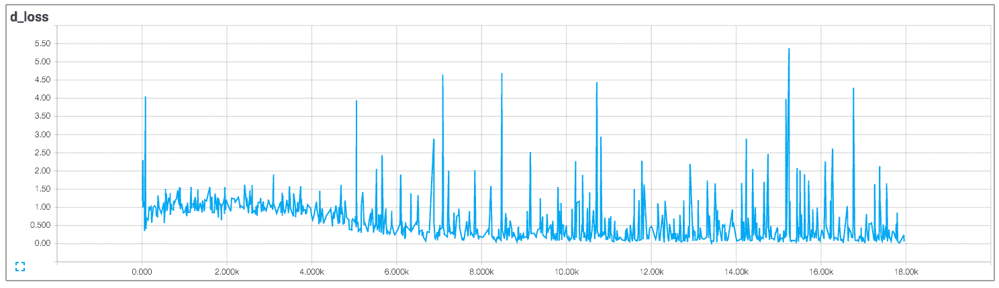

Discriminator Loss

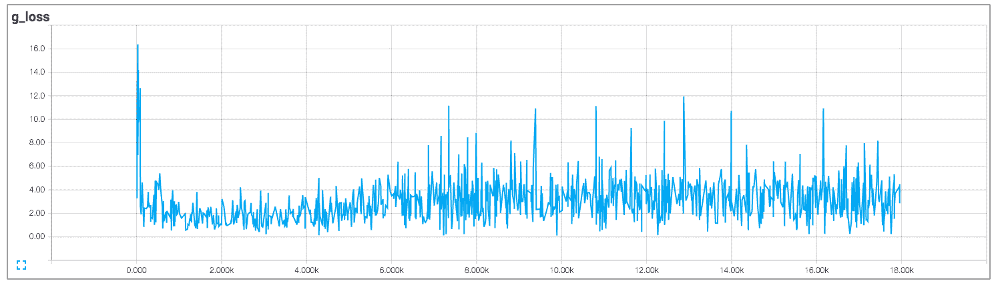

如果您在训练对象检测模型时看到这样的结果，您肯定可以说训练已经饱和，模型已经停止学习。然而，在甘被训练的例子中，学习一直在进行。

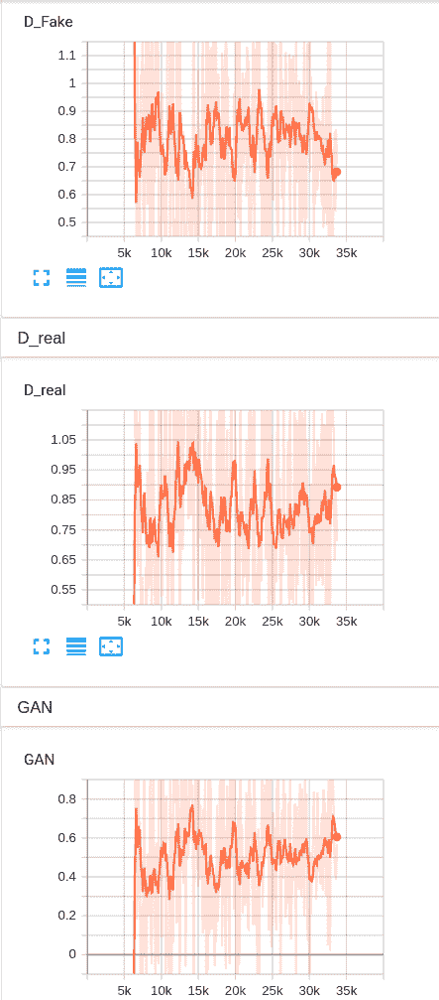

Training curves from Tensorboard for GauGAN trained on Camvid

为什么甘人会这样？这是因为与只有一个神经网络在学习(并试图减少损失)的*正常*深度学习算法不同，GANs 有两个神经网络相互竞争。对于数学倾向，两个模型被同时训练以找到两人非合作博弈的[纳什均衡](https://en.wikipedia.org/wiki/Nash_equilibrium)。然而，每个模型独立更新其成本，而不考虑游戏中的其他玩家。同时更新两个模型的梯度不能保证收敛。

如果上面的线对你没有任何意义，请理解这一点:如果鉴频器的损耗下降，那么发电机的损耗必然上升，反之亦然。两者的饱和损耗意味着两者实际上是相互竞争的。如果做不到这一点，我们的培训就无法进行。

如果鉴别器完全抽取了发生器，你的发生器什么也学不到。然而，如果发生相反的情况，生成器可以产生任何乱码，鉴别器将无法将其识别为*假的*。鉴别器通常被表示为发生器的对手，但实际上，发生器只从鉴别器反向传播的梯度中学习。换句话说，鉴别器为生成器提供监督，并告诉它“*嘿，生成器，这还不够真实。利用这些梯度，更好地工作”。*

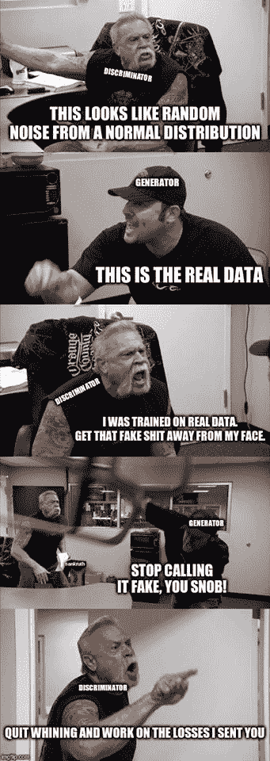

因此，发生器和鉴别器之间的不平衡是我们需要经常使用 gan 解决的问题。

### 鉴别器和发生器之间的不平衡

当我们谈到鉴频器和发电机之间的不平衡时，最有可能的是我们要处理鉴频器超过发电机的问题。如果鉴别器失败，那么生成器可以自由地产生任意随机图像，而不会受到惩罚，因此生成器也将失败。

那么，你如何确定你的鉴别器压制了发电机？首先，鉴频器损耗几乎为零，而发电机损耗将会很高。直观检查您的训练结果也可能会显示您的发生器产生的主要是噪声，而不是真实的图像。还应该检查鉴别器的分类精度；如果鉴别器精度在相当长的一段时间内超过 80-85%,则可能出现这种不平衡。

### 如何恢复平衡

有几件事你可以试着克服这个问题。考虑按顺序执行以下操作:

*   第一步也是非常直观的一步是通过增加发生器中的过滤器数量(`--ngf`)和层数(`--n_downsample_layers`)的值来使发生器更强大。
*   降低发电机的学习率。这可能有助于它更好地学习，因为它可以更彻底地探索损失面，而不是四处射击。你也可以将一个较慢的学习速率和比鉴别器更多的更新步骤结合起来。例如，考虑在每次更新鉴别器时更新生成器两次。
*   对真实图像使用软标签。虽然在训练的开始，当计算鉴别器损耗时，真实图像的标签被设置为 1，但是尝试用 0.9(或者可能是 0.7 和 1.2 之间的随机数)来表示它们。这到底为什么有效？据观察，对于硬标签(1)，鉴别器可能变得过于自信，并最终仅依赖于特征的子集来对示例进行分类。这可能导致生成器只关注那些特征来欺骗鉴别器，从而导致训练崩溃。
*   在鉴别器中使用光谱归一化。GauGAN 的代码 repo 默认情况下对生成器和鉴别器都使用谱范数。
*   在将真实数据和生成的数据发送到鉴别器之前，向它们添加噪声。有什么帮助？这很有帮助，因为人们经常观察到，尽管数据分布是高维的，但却存在于低维流形上，这使得鉴别器很容易找到一个超平面，将真实数据与虚假数据完美分离。如果这一行对你来说没有意义，不要担心。这只是意味着噪声阻止了鉴频器完全压制发电机。
*   最后，如果您发现您的生成器已经停止改进，尝试使用`--ndf`标志使鉴别器更强大。有时发电机停止学习是因为监督不够好。

### 在 GauGAN 的其他损失

除了主要的对抗性损失，GauGAN 还使用了特征匹配损失和感知损失。(我没有带 KL 发散损失训练)。

这是稳定训练中每次损失的样子。

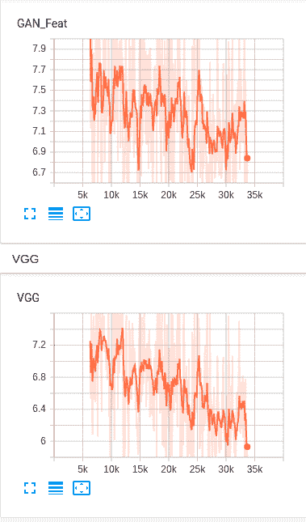

From top to bottom: curves for feature matching loss and perceptual loss.

我希望你对逐渐减少的感知损失(VGG 损失)保持一点警惕。VGG 损失在训练集上正在减少，但您可能也希望在测试集/验证集上看到它。由于对抗性损失在训练期间稳定，梯度下降倾向于通过减少感知损失来减少净损失。你必须小心，以防这导致过度拟合，并相应地通过重新调整它来减少它对损失项的贡献。

不幸的是，GauGAN 的代码没有提供设置砝码刻度的选项，必须通过修改代码来实现。这可以通过在文件`pix2pix_trainer.py`中摆弄函数`run_generator_one_step`和`run_discriminator_one_step`中定义的代码来完成。

```py
 def run_generator_one_step(self, data):
        self.optimizer_G.zero_grad()
        g_losses, generated = self.pix2pix_model(data, mode='generator')
        g_loss = sum(g_losses.values()).mean()
        g_loss.backward()
        self.optimizer_G.step()
        self.g_losses = g_losses
        self.generated = generated
```

Code to modify scales for Generator Losses

第 4 行返回的对象`g_loss`是由关键字`GAN`(甘损失)`GAN_Feat`(特征匹配损失)`VGG` (VGG 损失)组成的字典。将这些值乘以数字来缩放它们。例如，假设我想将 VGG 损失缩放 2。所以，我的函数应该是这样的:

```py
def run_generator_one_step(self, data):
        self.optimizer_G.zero_grad()
        g_losses, generated = self.pix2pix_model(data, mode='generator')
        # scale modification
        g_losses['VGG'] *= 2
        g_loss = sum(g_losses.values()).mean()
        g_loss.backward()
        self.optimizer_G.step()
        self.g_losses = g_losses
        self.generated = generated
```

Modified code to scale VGG Loss

```py
 def run_discriminator_one_step(self, data):
        self.optimizer_D.zero_grad()
        d_losses = self.pix2pix_model(data, mode='discriminator')
        d_loss = sum(d_losses.values()).mean()
        d_loss.backward()
        self.optimizer_D.step()
        self.d_losses = d_losses
```

Code to modify scales for Discriminator Losses

类似地，第 3 行返回的对象`d_losses`包含关键字`D_real`和`D_fake`，分别用于真实和虚假图像的鉴别器损失。

### 批量

批量越大，结果应该越好，因为小批量通常会对数据分布的统计数据提供非常嘈杂的估计。作者使用 128 的批量大小，这需要一个八 GPU 机器，每个 GPU 具有 16 GB VRAM。因此，训练 GauGAN 可能相当昂贵。

如果您正在为您的业务使用 GauGAN，或者如果您缺少资源，也许现在不是使用 GauGAN 的最佳时机。在下一节中，我将介绍如何决定是否应该重新考虑使用 GauGAN 的决定——尤其是从商业角度。

## GauGAN 适合你吗？

这是这篇文章的要点。GauGAN 适合你吗？在 MathWorks 工作时，我学到了很多关于实现 DL 算法的商业方面的东西。就这些而言，GauGAN 的要求相当高，原因如下。

### 你的问题应该是适当的困难

我这么说是什么意思？你首先要考虑的是，GauGAN 有它的局限性。这项技术在很大程度上仍处于萌芽阶段。高根擅长综合各种事物的纹理细节。只要边界不在同一个类的对象之间，它们通常都处理得很好。虽然实例分割贴图在这种情况下有所帮助，但两个相似类别的重叠对象通常会变形为一个扭曲的对象。

Nvidia 在他们的 GauGAN 演示中使用了 Flickr landscapes 数据集。风景主要由纹理组成，例如山、天空、大海等的纹理。

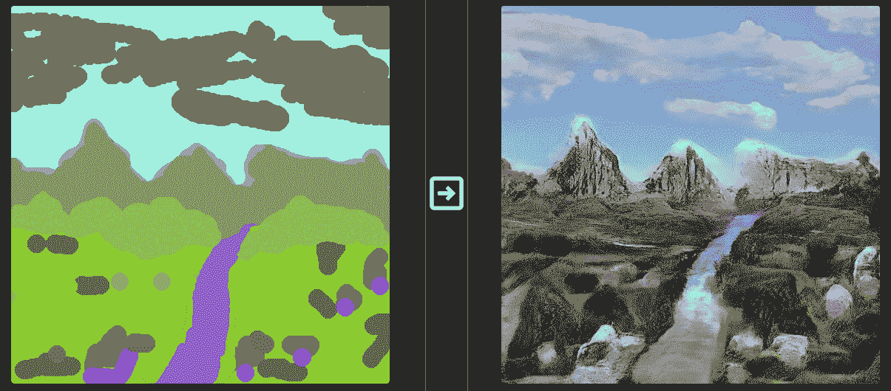

然而，GauGAN 可能难以应对密集的交通场景，这需要它在一个小区域内创建具有大量空间细节的对象。以下图中的汽车为例。

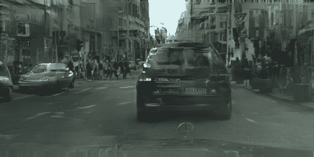

GauGAN messes up details of a car

与纹理填充不同，纹理填充具有相当大的随机性，对象的结构组件需要以更受约束的方式进行渲染。虽然 GauGAN 在这些空间细节稀疏并且分布在图像的大面积上时可以表现得很好(就像只有一个人体图形要在相机前渲染)，但当这些对象应该有许多细节限制在图像的一小部分时(就像一群各种姿势的行人)，它可能会产生模糊的对象。

因此，如果你的问题有稀疏的结构细节(如单个人像或特写汽车照片)或纹理细节(如风景或微观细菌污渍)，请使用 GauGAN。否则，您可能希望等待技术改进。

### 你需要计算资源

高根需要大量资源。我的意思是很多。批量大小可以决定你训练的成败，更大的批量需要你有大内存的 GPU。当然，这也取决于你的图像大小和问题的复杂程度。

如果您正在处理大小为 128 x 128 的细菌污渍图像，您可以轻松地在 24 GB GPU 系统中安装足够大的一批图像。但是，如果您正在处理 1024 x 768 比例的图像，请准备好支付大量资源。使用它的默认参数，您将需要大约 16 GB 的内存来容纳一个示例。

您可以尝试使用双线性上采样后期生成来增加图像的大小。或者，如果您觉得您的任务并不太难，尝试减少生成器和鉴别器中的滤波器数量，看看您是否可以在性能上稍有损失。

此外，由于批量较小，获得正确的模型可能需要较长的训练时间。众所周知，GANs 很难工作，可能需要大量的实验才能正常工作。如果您的任务与已经提供的预训练模型中的一个任务相匹配，那么您应该感到幸运，因为相同的超参数集可能会起作用。

因此，时间是你需要注意的另一个资源，特别是如果你的问题不同于预先训练的模型所提供的任务。

### 你需要正确的数据

如果您已经阅读了这个系列，您将会意识到我已经使用 CamVid 数据集进行了演示。我选择它有几个原因。这是一个足够小的数据集，只有 700 张图片可以训练，所以你可以很快得到结果。第二，你可能已经注意到了，结果可能相当糟糕。CamVid 数据集几乎所有的事情都会出错，这几乎让我想起了墨菲定律。

这是 CamVid 的最佳结果之一。

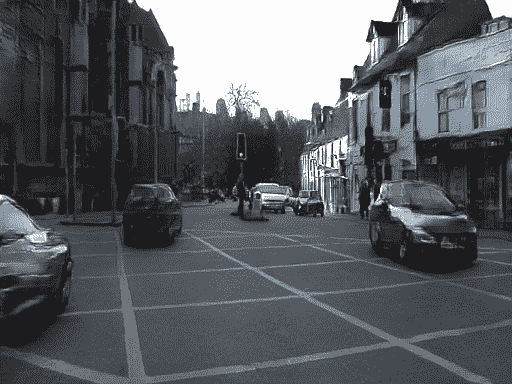

这是最糟糕的一个。是的，很糟糕。

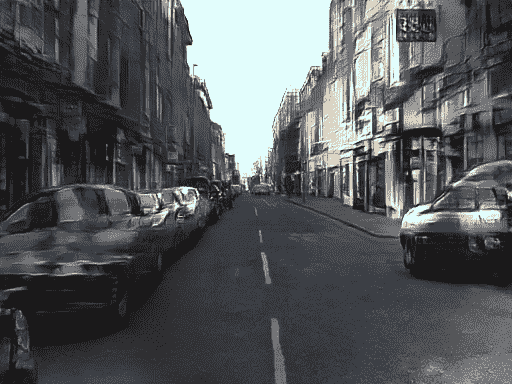

因此，当您考虑为您的问题获取数据时，请确保它不像 CamVid 一样，原因如下。

数据集太小了。 GauGAN 和任何深度学习网络一样，需要大量的数据。对于像交通场景这样的复杂场景，训练集的一个好数字应该是大约 5000-10000 个示例。相比之下，我训练的 CamVid 有 630。咩。我处理过城市风景(3000 张图片)和英特尔印度驾驶数据集(7000 张图片)。训练性能随着数据量的增加而提高。

达到一个好的解决方案所需的数据量也会随着手头任务的复杂性而变化。对于细菌污渍，你只需要 2000 个例子。甚至像 Cityscapes 这样的数据集也比印度驾驶数据集简单得多，印度驾驶数据集包含更多类型的车辆、位置(如未铺设道路的小巷)和更多类型的表面(如道路旁边的泥泞表面)。

预训练模型是判断您需要多少数据的最佳选择。通过查看提供了预训练模型的数据集来评估任务的复杂性，并相应地推断任务所需的数据量。

不够多样化。cam vid 的问题是，它没有像城市风景那样的多样化图像，而是一个数据集，只包含剑桥四次行驶的后续帧。这意味着后续帧之间的差异非常小，或者它们高度相关。例如，考虑这三个连续的帧:

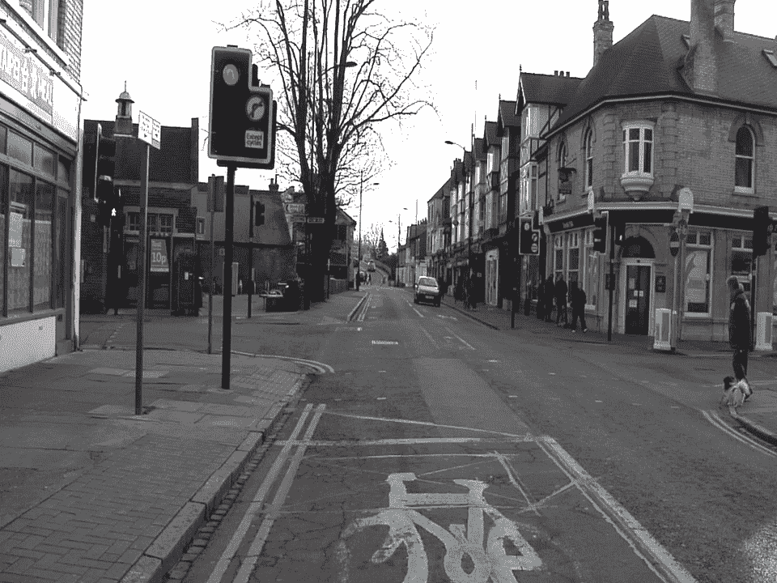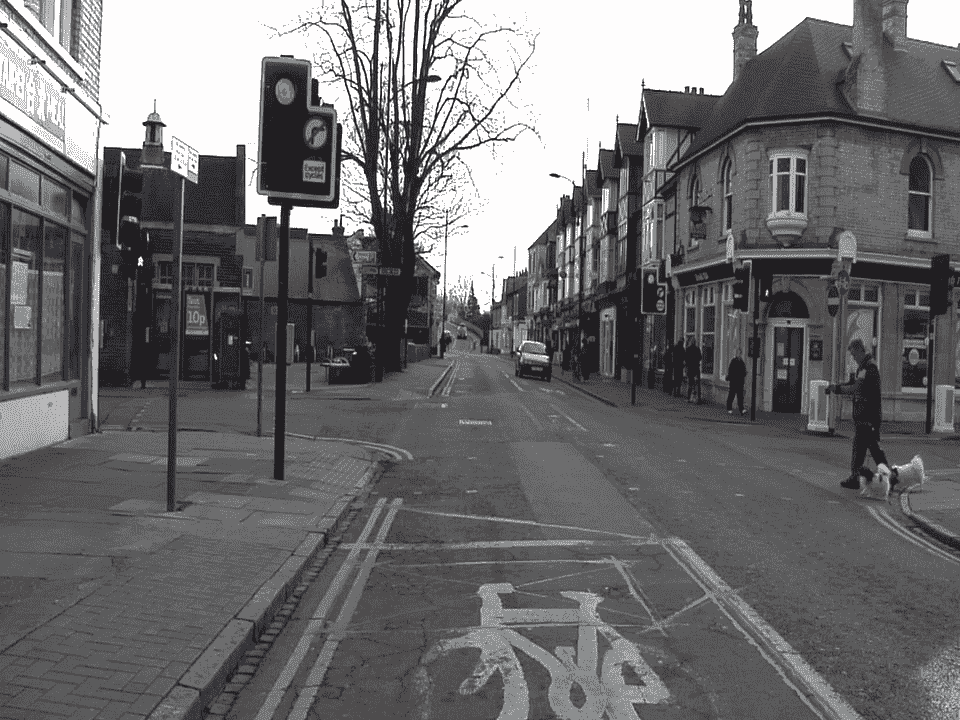

在最坏的情况下，车辆是静止的，你有几乎完全相同的框架。

这给了我们一个欺骗性的想法，我们有大约 640 幅图像，而事实是这些帧中有许多重复的信息，这是令人窒息的 GauGAN。

有些模式比其他模式更常见。当我说你的数据应该多样化时，我的意思是它应该涵盖你的对象可能出现的所有可能的方式。不平衡可能会导致高根在更稀疏的方向上表现不佳。例如，在数据集中，汽车大多是从后面和前面看到的，而从侧面看到汽车的情况非常少见。这导致算法试图将侧面方向的汽车绘制成前/后方向的汽车。例如:

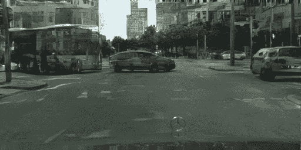

GauGAN struggling to paint side views of a car

**训练集和测试集过于相似。**来自连续视频场景的随机采样帧可以让您的测试集与训练集非常相似，并给你一个看似良好的性能。例如，考虑从 CamVid 数据中随机抽样来创建您的测试集。

考虑你在上面看到的三个框架。假设第二帧被采样到我们的测试集中。由于第二帧与第一帧和第三帧非常相似，因此该算法将对其执行良好。我们的学习算法是过度拟合的，尽管在训练结果中并不明显。

在 CamVid 中，更好的衡量标准是在三种驾驶场景下进行训练，并在第四种场景下进行测试。不幸的是，这也不能很好地工作，因为我们的数据集太小了。

## 结论

我们的 GauGAN 系列到此结束。这个系列的目的是让你了解最新的 GAN 技术，告诉你它的问题以及如何解决它们。被与 GauGAN 相关的另一个问题所困扰？用它产生了一些很酷的结果？还是解决了我们上面提到的一个公开的问题？请随意点击评论区。在那之前，这里有一些资源可以让你进一步了解 GANS。

1.  [训练 GANs 的改进技术](https://papers.nips.cc/paper/6125-improved-techniques-for-training-gans)
2.  [如何训练阿甘？让 GANs 发挥作用的技巧和诀窍](https://github.com/soumith/ganhacks)
3.  [一年训练 GANs 的 10 个教训](https://towardsdatascience.com/10-lessons-i-learned-training-generative-adversarial-networks-gans-for-a-year-c9071159628)

## 了解 GauGAN 系列

*   [第一部分:解开 Nvidia 的风景画 GANs](https://blog.paperspace.com/nvidia-gaugan-introduction/)
*   [第二部分:定制数据集培训](https://blog.paperspace.com/gaugan-training-on-custom-datasets/)
*   [第 3 部分:模型评估技术](https://blog.paperspace.com/gaugan-evaluation-techniques/)
*   ***第四部分:调试培训&决定 GauGAN 是否适合你***