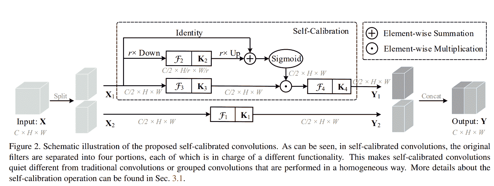
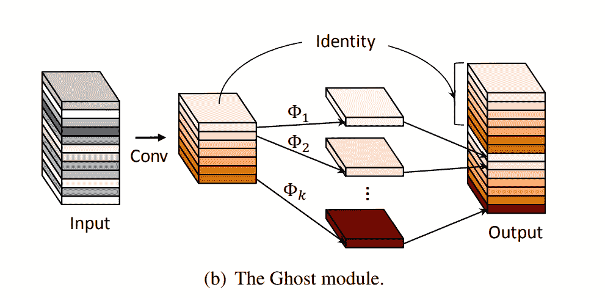
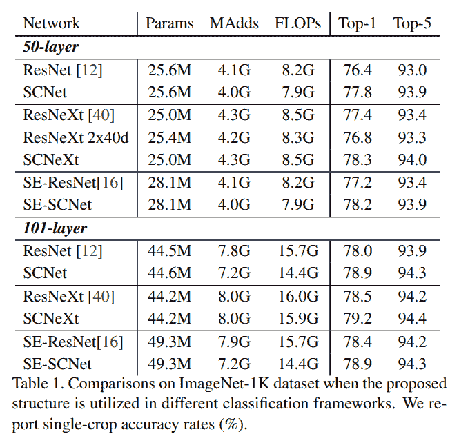
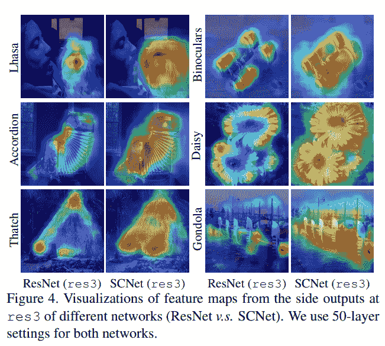
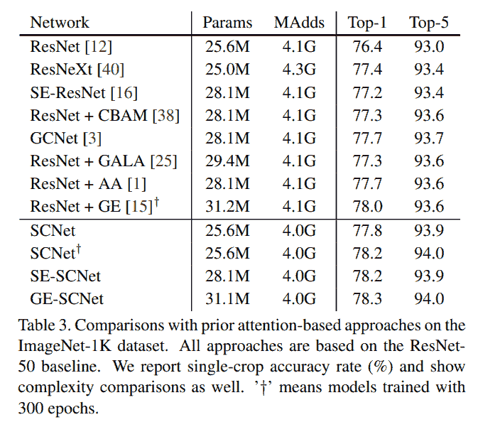
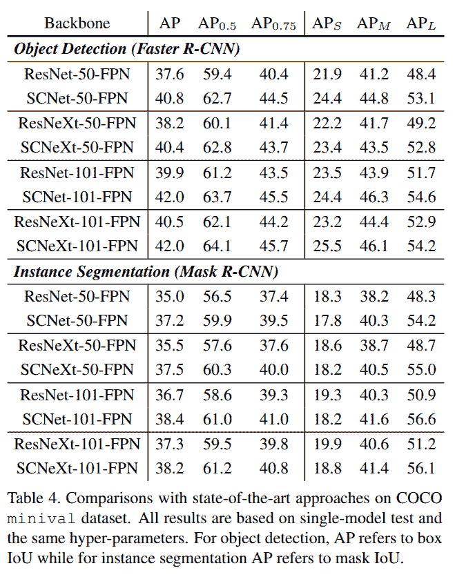

# SCNet (CVPR 2020)

> 原文：<https://blog.paperspace.com/scnet-cvpr-2020/>

虽然近年来计算机视觉中的注意力方法受到了相当多的关注，但它们被严格限制在这些方法集成到普通卷积神经网络(CNN)的方式上。大多数情况下，这些方法被用作插件模块，可以插入不同类型的 CNN 的结构中。然而，在这篇博客文章中，我们将看看 2020 的一篇论文，题为[用自校准卷积改进卷积网络](http://mftp.mmcheng.net/Papers/20cvprSCNet.pdf)，作者刘。et。艾尔。提出了一种新形式的卷积运算，称为自校准卷积(SC-Conv ),它具有与注意机制非常相似的自校准特性。

首先，我们将看看这篇论文背后的动机，然后与 GhostNet (CVPR 2020)进行一些微妙的比较。然后，我们将对 SC-Conv 的结构进行研究，并提供 PyTorch 代码，然后以结果和一些批评意见结束帖子。

### 目录

1.  动机
2.  自校准卷积
3.  密码
4.  结果
5.  结论
6.  参考

## 摘要

> 细胞神经网络的最新进展主要致力于设计更复杂的结构来增强其表征学习能力。在本文中，我们考虑在不调整模型结构的情况下，改进细胞神经网络的基本卷积特征变换过程。为此，我们提出了一种新颖的自校准卷积，通过内部通信显式扩展每个卷积层的视野，从而丰富输出特征。特别是，与使用小核(例如，3 × 3)融合空间和通道信息的标准卷积不同，我们的自校准卷积通过一种新颖的自校准操作，自适应地围绕每个空间位置建立长程空间和通道间相关性。因此，它可以通过明确地结合更丰富的信息来帮助 CNN 生成更具区分性的表示。我们的自校准卷积设计简单而通用，可以很容易地应用于增强标准卷积层，而不会引入额外的参数和复杂性。大量实验表明，当将我们的自校准卷积应用于不同的主干时，基线模型可以在各种视觉任务中得到显著改善，包括图像识别、对象检测、实例分割和关键点检测，而无需改变网络架构。我们希望这项工作可以为未来的研究提供一个有前途的方法来设计新的卷积特征变换，以改善卷积网络。

## 动机

虽然大多数研究方向都是人工设计架构或组件，如注意机制或非局部块，以丰富经典卷积神经网络的特征表示，但这是次优的，并且非常迭代。

> 在本文中，我们没有设计复杂的网络架构来加强特征表示，而是引入自校准卷积作为一种有效的方法，通过增加每层的基本卷积变换来帮助卷积网络学习区分表示。类似于分组卷积，它将特定层的卷积滤波器分成多个部分，但是不均匀地，每个部分内的滤波器以不同的方式被利用。具体来说，自校准卷积首先通过下采样将输入转换为低维嵌入，而不是在原始空间中均匀地对输入执行所有卷积。由一个滤波器部分变换的低维嵌入被用来校准另一部分内的滤波器的卷积变换。受益于这种异构卷积和滤波器间通信，每个空间位置的感受野可以被有效地扩大。

> 作为标准卷积的增强版本，我们的自校准卷积有两个优点。首先，它使每个空间位置能够自适应地编码来自长距离区域的信息上下文，打破了在小区域(例如，3× 3)内卷积运算的传统。这使得由我们的自校准卷积产生的特征表示更具鉴别性。第二，所提出的自校准卷积是通用的，并且可以容易地应用于标准卷积层，而不引入任何参数和复杂度开销或者改变超参数。

## 自校准卷积



上面的示意图展示了自校准回旋(SC-Conv)的结构设计。乍一看，该结构似乎是鬼卷积(CVPR 2020)和常规注意机制的交叉。在深入了解 SCConv 之前，让我们快速浏览一下 GhostNet。

### [幽灵网(CVPR 2020)](https://openaccess.thecvf.com/content_CVPR_2020/papers/Han_GhostNet_More_Features_From_Cheap_Operations_CVPR_2020_paper.pdf)



GhostNet 在 CVPR 2020 上发表，通过用 ghost 层取代标准卷积层，提供了一种降低大型卷积神经网络的参数和计算复杂性的简单方法。对于给定的输入$X \in \mathbb{R}^{C \ast H \ast W}$和预期的输出$ \ tilde { x } \ in \mathbb{r}^{\hat{c} \ ast h \ ast w } $，ghost layer 首先使用标准卷积生成$\frac{\hat{C}}{2}$通道。然后，剩余的$\frac{\hat{C}}{2}$通道通过使第一组通道通过深度方向卷积核来生成，该卷积核基本上将参数复杂度降低了近一半。为了更深入地了解 GhostNet，请阅读我在同一个[这里](https://blog.paperspace.com/ghostnet-cvpr-2020/)的帖子。

好的，现在回到 SC Conv，在 SC conv 有两个不同的分支，一个是身份分支，类似于固有残差分支，而另一个分支负责自校准。给定一个输入张量$X \in \mathbb{R}^{C \ast H \ast W}$和一个相同形状的期望输出张量$\hat{X}$，该张量首先被分成每个$\frac{C}{2}$通道的两个集合，第一个分支简单地对其中一个集合应用 2D 卷积运算。在第二个分支中，集合通过三个并行操作。第一个操作是简单的信道保持 2D 卷积，而在第二个操作中，空间维度以因子$r$下采样，然后对其应用 2D 卷积，其输出随后以因子$r$上采样以保持相同的形状。最后一个操作是一个单位函数，它按元素添加到来自第二个操作的上采样特征映射中。合成张量通过 sigmoid 激活，然后与从第一个张量获得的张量按元素相乘。最后，这个张量通过另一个保持 2D 卷积的通道。然后，将来自两个分支的两个张量连接起来，形成完整的集合。

## 密码

```py
import torch
import torch.nn as nn
import torch.nn.functional as F

class SCConv(nn.Module):
    def __init__(self, inplanes, planes, stride, padding, dilation, groups, pooling_r, norm_layer):
        super(SCConv, self).__init__()
        self.k2 = nn.Sequential(
                    nn.AvgPool2d(kernel_size=pooling_r, stride=pooling_r), 
                    nn.Conv2d(inplanes, planes, kernel_size=3, stride=1,
                                padding=padding, dilation=dilation,
                                groups=groups, bias=False),
                    norm_layer(planes),
                    )
        self.k3 = nn.Sequential(
                    nn.Conv2d(inplanes, planes, kernel_size=3, stride=1,
                                padding=padding, dilation=dilation,
                                groups=groups, bias=False),
                    norm_layer(planes),
                    )
        self.k4 = nn.Sequential(
                    nn.Conv2d(inplanes, planes, kernel_size=3, stride=stride,
                                padding=padding, dilation=dilation,
                                groups=groups, bias=False),
                    norm_layer(planes),
                    )

    def forward(self, x):
        identity = x

        out = torch.sigmoid(torch.add(identity, F.interpolate(self.k2(x), identity.size()[2:]))) # sigmoid(identity + k2)
        out = torch.mul(self.k3(x), out) # k3 * sigmoid(identity + k2)
        out = self.k4(out) # k4

        return out
```

您需要下载 ImageNet 数据集来训练 SCNet。你可以按照这里的说明[下载。下载后，您可以在上面 paperspace gradient 中链接的 jupyter 环境中使用以下命令训练 ImageNet。](https://github.com/LandskapeAI/imagenet)

```py
usage: train_imagenet.py  [-h] [-j N] [--epochs N] [--start-epoch N] [-b N]
                          [--lr LR] [--momentum M] [--weight-decay W] [--print-freq N]
                          [--resume PATH] [-e] [--pretrained] [--world-size WORLD_SIZE]
                          [--rank RANK] [--dist-url DIST_URL]
                          [--dist-backend DIST_BACKEND] [--seed SEED] [--gpu GPU]
                          [--multiprocessing-distributed]
                          DIR

PyTorch ImageNet Training

positional arguments:
  DIR                   path to dataset

optional arguments:
  -h, --help            show this help message and exit
  -j N, --workers N     number of data loading workers (default: 4)
  --epochs N            number of total epochs to run
  --start-epoch N       manual epoch number (useful on restarts)
  -b N, --batch-size N  mini-batch size (default: 256), this is the total
                        batch size of all GPUs on the current node when using
                        Data Parallel or Distributed Data Parallel
  --lr LR, --learning-rate LR
                        initial learning rate
  --momentum M          momentum
  --weight-decay W, --wd W
                        weight decay (default: 1e-4)
  --print-freq N, -p N  print frequency (default: 10)
  --resume PATH         path to latest checkpoint (default: none)
  -e, --evaluate        evaluate model on validation set
  --pretrained          use pre-trained model
  --world-size WORLD_SIZE
                        number of nodes for distributed training
  --rank RANK           node rank for distributed training
  --dist-url DIST_URL   url used to set up distributed training
  --dist-backend DIST_BACKEND
                        distributed backend
  --seed SEED           seed for initializing training.
  --gpu GPU             GPU id to use.
  --multiprocessing-distributed
                        Use multi-processing distributed training to launch N
                        processes per node, which has N GPUs. This is the
                        fastest way to use PyTorch for either single node or
                        multi node data parallel training
```

注意:您需要一个[权重&偏差](https://wandb.ai/site)账户来启用 WandB 仪表板日志。

## 结果

以下是论文中展示的一些 SCNets 结果:



## 结论

SCNet 提供了一种在卷积神经网络中嵌入注意机制的新方法。与作为附加模块应用的传统注意机制不同，SCConv 可以用来取代传统的卷积层。尽管这种方法在参数/ FLOPs 方面很便宜，并提供了很好的性能提升，但唯一的问题是操作数量的增加导致了运行时间的增加。

## 参考

1.  [用自校准卷积改进卷积网络](http://mftp.mmcheng.net/Papers/20cvprSCNet.pdf)
2.  [SCConv 官方 GitHub 资源库](https://github.com/MCG-NKU/SCNet)