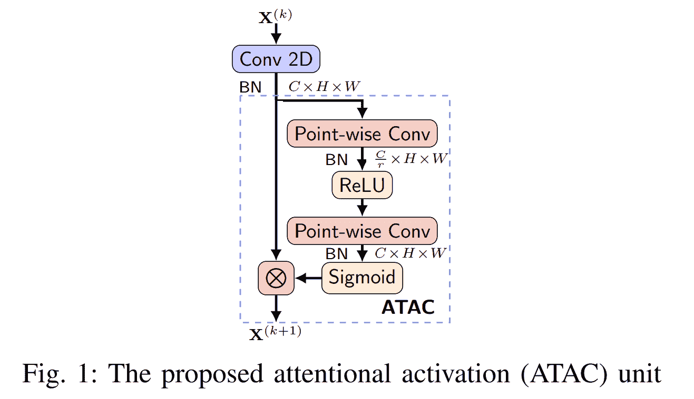
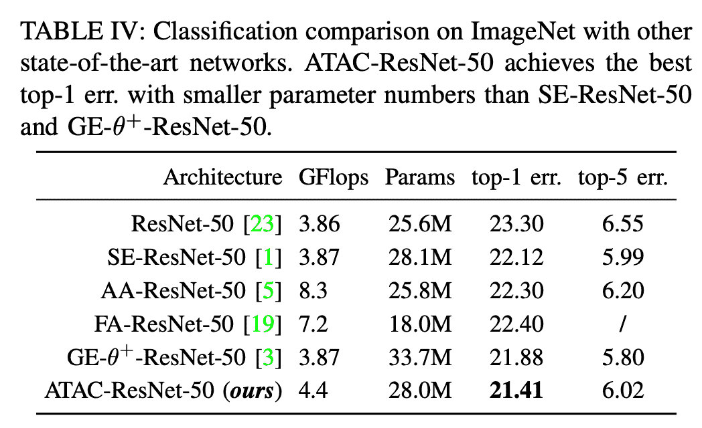
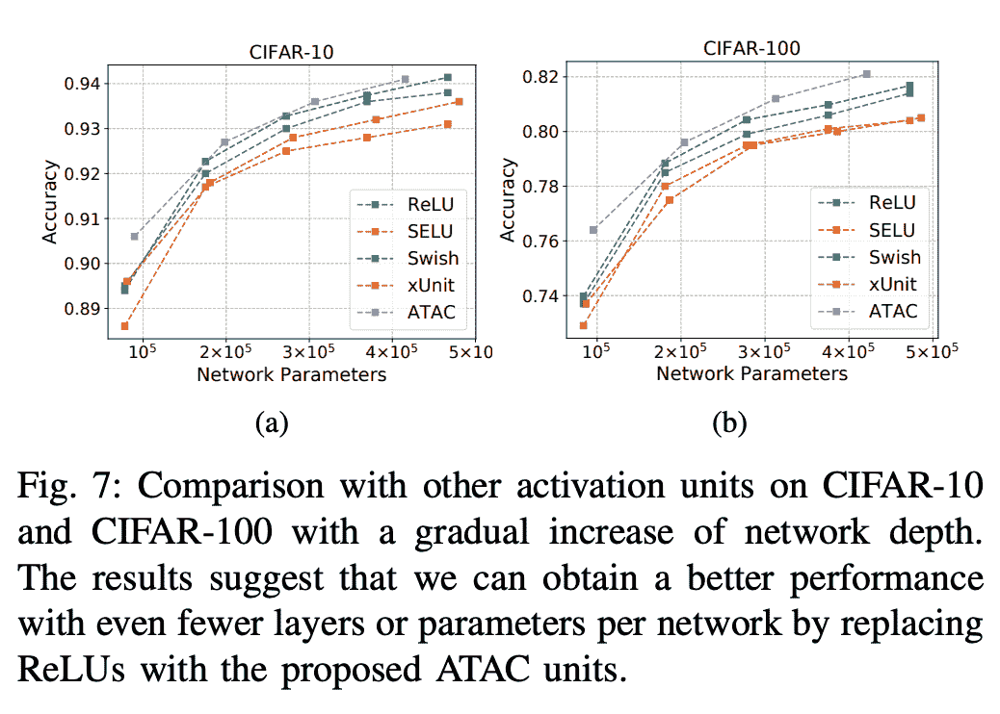

# 作为激活的注意

> 原文：<https://blog.paperspace.com/attention-as-activation/>

在新激活功能的研究和配方方面，激活功能已经有了大规模的复苏。其中一些方法在公式背后有不同的动机或直觉。虽然有些依赖于神经架构搜索(NAS)来找到基于性能和计算预算约束的最佳激活函数(如 Swish)，但其他人则专注于改善信息传播和对深度神经网络的损失场景施加平滑属性的更多理论基础(如 Mish)，有些人还主要专注于单独的性能(如漏斗激活)，而少数其他人则主要针对特定的利基领域设计，如超分辨率或图像重建(如 SIREN 和 XUnit)。然而，与激活功能同步，特别是在计算机视觉(CV)领域中，注意机制已经经历了显著的上升，不同的方法试图实现在某种程度上相同的目标，即改善中间特征图中的特征表示。然而，与激活功能相比，注意力在许多方面仍然是一个独立的实体，而从理论上讲，它们可以相互推广。在这篇博文中，我们来看看戴的一篇题为《作为激活的注意》的论文。et。艾尔。，它试图通过本质上将注意力与激活结合起来，并将其集成到标准的深度卷积神经网络架构中，来揭开骰子的未知面。

接下来，我们将首先看看在这篇名为“注意力激活(ATAC)”的论文中提出的方法背后的激励基础，然后深入分析 ATAC 的结构及其与压缩-激发网络的相似性，最后，通过提供代码和浏览论文中的结果来结束本文。

### 目录

1.  动机
2.  ATAC
3.  密码
4.  结果
5.  结论
6.  参考

## 摘要

> 激活功能和注意机制通常被视为具有不同的目的，并以不同的方式进化。然而，这两个概念都可以被公式化为非线性选通函数。受其相似性的启发，我们提出了一种称为注意激活(ATAC)单元的新型激活单元，作为激活功能和注意机制的统一。特别地，我们提出了用于同时非线性激活和元素式特征细化的局部通道注意模块，其局部聚集点式跨通道特征上下文。通过在卷积网络中用这样的 ATAC 单元代替众所周知的整流线性单元，我们可以构造出全注意力网络，它在具有适度数量的附加参数的情况下表现得明显更好。我们使用几个具有不同网络深度的主机网络对 ATAC 设备进行了详细的烧蚀研究，以经验验证设备的有效性和效率。此外，我们在 CIFAR-10、CIFAR-100 和 ImageNet 数据集上将 ATAC 单元的性能与现有的激活功能以及其他注意机制进行了比较。我们的实验结果表明，在给定相当数量的参数的情况下，用所提出的 ATAC 单元构建的网络通常产生优于其竞争对手的性能增益。

## 动机

近来，注意机制已经成为计算机视觉领域中的一个重要研究领域，并且对推动不同任务中的艺术状态做出了显著贡献。虽然激活函数也仍然是一个热门的研究领域，但对于 ReLU(长期默认激活函数)的吸引力已经压倒了许多具有强大理论背景的新激活函数，这些函数已被提出来克服 ReLU。然而，注意机制和激活功能都有相互归纳的能力。作者提出了一个非常有趣的观点，其本质上是说，虽然注意机制旨在捕捉长范围的依赖性，但激活函数严重依赖于本地上下文，并且通常是简单的逐点门控机制，因此不一定改进由该架构中的先前卷积层构建的特征表示。

> 在这项工作中，我们提出了注意激活(ATAC)单元来解决上述缺点，它描绘了一个新的动态和上下文感知的激活功能。我们的一个重要观察结果是，注意机制和激活函数的概念都可以用非线性自适应门控函数来表达。更准确地说，激活单元是非情境感知的注意模块，而注意机制可以被视为情境感知的激活功能。除了引入非线性，我们的 ATAC 单元还支持网络进行分层上下文感知特性优化:

> 1)ATAC 单元不同于 ReLUs 的标准布局，并且提供了在非线性门控功能的相同框架下统一激活功能和注意机制的概念的通用方法。

> 2)为了同时满足激活功能的局部性和注意机制的上下文聚合，我们提出了一个局部通道注意模块，它聚合了逐点的跨通道特征上下文信息。

> 3)ATAC 单元使构建全注意力网络成为可能，该网络在具有适度数量的附加参数的情况下表现得明显更好。

## ATAC



乍一看，ATAC 本质上看起来是一个挤压-激励网络。你做这个假设是完全正确的。它实际上是一个挤压和激励模块，在开始时有一个小的调整，没有全局平均池，并用作卷积层模块中 ReLU 激活函数的替代。所以不多说了，让我们来看看它的结构。因此，对于给定的输入张量$X \in \mathbb{R}^{C \ast H \ast W}$来说，它是先前卷积和批量归一化层的输出，首先，通过使用逐点($1 \ast 1$)卷积，张量沿着信道维度以预定义的缩减比率$r$缩减，这导致张量$ { x } \ in \mathbb{r}^{\frac{c}{r} \ ast h \ ast w } $的结果。随后是标准化(批量规范)层和 ReLU 激活。最后，然后使用逐点卷积沿着通道维度将张量向上采样回原始张量的形状，逐点卷积输出\mathbb{R}^{C 中的张量$\tilde{X}。然后，在将该张量按元素乘以实际输入$X$之前，对其应用 sigmoid 激活。

*注意:为了更清楚地了解挤压和激发网络，请浏览我在同一篇博客上的文章，可以在[这里](https://blog.paperspace.com/channel-attention-squeeze-and-excitation-networks/)找到。*

## 密码

以下代码片段提供了用于 ATAC 激活模块的 PyTorch 代码和 MXNet 代码，该模块可用于替换 ReLU 或深度卷积神经网络架构中使用的任何其他标准激活函数。

### MXNet 实现:

```py
from __future__ import division
from mxnet.gluon.block import HybridBlock
from mxnet.gluon import nn

class ChaATAC(HybridBlock):
    def __init__(self, channels, r, useReLU, useGlobal):
        super(ChaATAC, self).__init__()
        self.channels = channels
        self.inter_channels = int(channels // r)
        with self.name_scope():
            self.module = nn.HybridSequential(prefix='module')
            if useGlobal:
                self.module.add(nn.GlobalAvgPool2D())
            self.module.add(nn.Conv2D(self.inter_channels, kernel_size=1, strides=1, padding=0,
                                      use_bias=False))
            self.module.add(nn.BatchNorm())
            if useReLU:
                self.module.add(nn.Activation('relu'))
            self.module.add(nn.Conv2D(self.channels, kernel_size=1, strides=1, padding=0,
                                      use_bias=False))
            self.module.add(nn.BatchNorm())
            self.module.add(nn.Activation('sigmoid'))

    def hybrid_forward(self, F, x):

        wei = self.module(x)
        x = F.broadcast_mul(x, wei)

        return x
```

### PyTorch 实现:

```py
import torch
import torch.nn as nn
import torch.nn.functional as F

class ATAC(nn.Module):
    def __init__(self, channels, r, useReLU):
        super(ATAC, self).__init__()
        self.relu = useReLU
        if self.relu is True:
        	self.act = nn.ReLU()
        self.channels = channels
        self.inter_channels = int(channels // r)
        self.conv = nn.Conv2d(channels, inter_channels, 1,1,0)
        self.bn = nn.BatchNorm2d(inter_channels)
        self.conv2 = nn.Conv2d(inter_channels, channels, 1,1,0)
        self.bn2 = nn.BatchNorm2d(channels)

    def forward(self, x):
		out1 = self.bn(self.conv(x))
        if self.relu is True:
        	out1 = self.act(out1)
        out2 = self.bn2(self.conv2(out1))
        return x * torch.sigmoid(out2)
```

要在 CIFAR 数据集上运行配有 ATAC 激活功能单元(例如 ResNet-18)的 ResNet 模型，请在 Paperspace Gradient 的 jupyter 环境中使用以下命令，本文开头提供了该命令的链接。

**CIFAR-10**

```py
python train_cifar_full.py --project ATAC --name atac --version 2 --arch 1
```

**CIFAR-100**

```py
python train_cifar100_full.py --project ATAC --name atac --version 2 --arch 1
```

注意:您需要一个[权重&偏差](https://wandb.ai/site)账户来启用 WandB 仪表板日志。

## 结果



## 结论

考虑到这篇论文的新颖性更多的是应用 ATAC 的方式，而不是结构本身的设计，公平地说，它确实为我们如何解释注意力并将其与激活区分开来开辟了一些新的途径。然而，这里的主要缺点是触发器和参数的增加。总的方法在计算上非常昂贵，并且不适合在预算有限的情况下进行训练。

## 参考

1.  [注意力被激活](https://arxiv.org/pdf/2007.07729.pdf)
2.  [ATAC 官方 GitHub 资源库](https://github.com/YimianDai/open-atac)