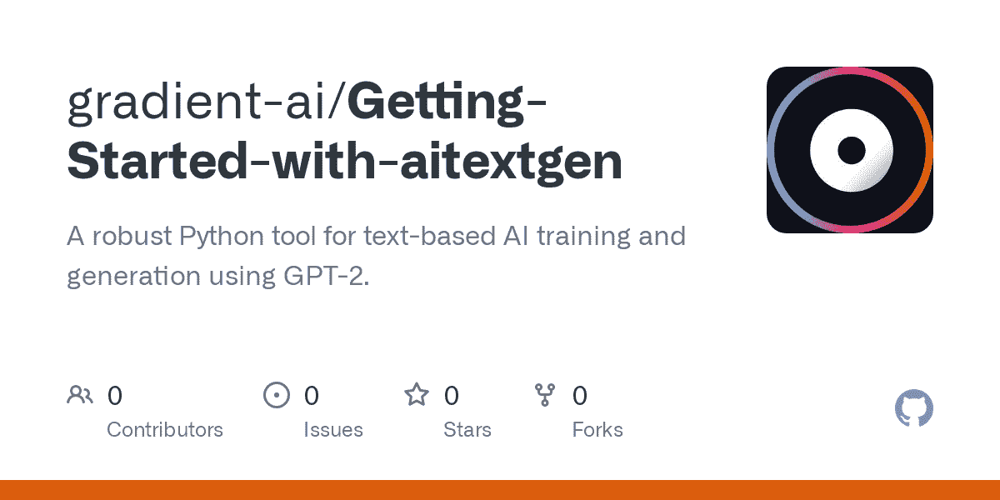
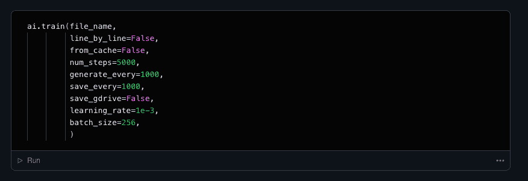
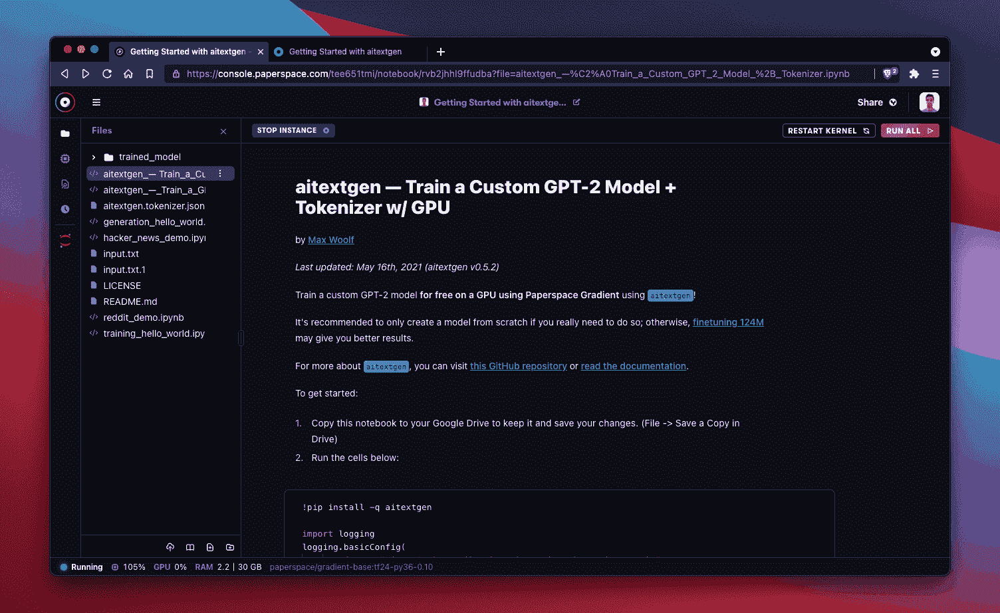

# 新的 ML Showcase 条目:aitextgen 入门

> 原文：<https://blog.paperspace.com/aitextgen-jupyter-notebook-getting-started/>

今天，我们将为 aitextgen 介绍一个新的 ML 展示项目，这是一个使用 GPT-2 和 GPT-3/GPT Neo 训练和生成文本的 python 库。

在这个 ML Showcase 条目中，我们将训练一个模型根据我们输入的莎士比亚文本样本生成文本。这个 ML Showcase 条目是一个笔记本集合，从[原始回购](https://github.com/minimaxir/aitextgen)派生而来，并适应于 Paperspace 渐变笔记本。

一般来说，生成的文本将开始时相对不连贯，并将随着每个训练时期而变得清晰。仅仅经过 15 分钟的训练，效果就非常好！

aitextgen 与 Paperspace 提供的每一款 GPU 兼容——包括[免费 GPU](https://gradient.paperspace.com/free-gpu) 实例！当您运行这个项目时，您可以随时使用渐变 IDE 中的实例选择器切换到不同的 CPU 或 GPU 实例。

现在让我们开始吧！

## 在渐变笔记本中运行 aitextgen

我们需要做的第一件事是将 aitextgen 笔记本复制到我们的梯度控制台。

但是在你做任何事情之前，如果你还没有的话，你首先需要在 Paperspace 上创建一个免费帐户。一个免费的帐户可以让你每次运行一个免费的 CPU 或者免费的 GPU 实例。(此处列出了[的全部限制。)](https://gradient.paperspace.com/pricing)

接下来，我们需要从 ML Showcase 条目中派生出 aitextgen 笔记本，链接如下:

[Getting Started with aitextgenPerform text-based AI training and generation using OpenAI’s GPT-2 and EleutherAI’s GPT Neo/GPT-3 architecture.ML ShowcaseThe Gradient Team](https://ml-showcase.paperspace.com/projects/aitextgen-demo-free-gpu)

选择`Launch Project`后，您将被带到笔记本的只读副本，然后您可以通过选择`Run`进行分叉。

*注意:如果您尚未登录或尚未注册 Paperspace，您将需要创建一个帐户。*

To get started, launch the aitextgen project from ML Showcase and then select `Run` to fork a new version into your Paperspace account

或者，如果您想在运行回购之前先了解一下它，您可以在此处查看您将要运行的笔记本:

[gradient-ai/Getting-Started-with-aitextgenA robust Python tool for text-based AI training and generation using GPT-2\. - gradient-ai/Getting-Started-with-aitextgenGitHubgradient-ai](https://github.com/gradient-ai/Getting-Started-with-aitextgen)

## 用 aitextgen 开始训练

一旦您分叉了笔记本，您将看到 ML Showcase 条目中包含六个独立的 ipynb 文件:

*   训练一个定制的 GPT-2 模型+带 GPU 的令牌化器
*   使用 GPU 训练 GPT-2(或 GPT Neo)文本生成模型
*   世代你好世界
*   培训 Hello World
*   黑客新闻演示
*   Reddit 演示

每个笔记本都是独立的，大部分都是不言自明的。配置选项以内联方式给出。您可能会首先调整配置选项，对像`num_steps`这样的选项使用较小的值，以便首先了解在您的实例上运行一个进程需要多长时间。您可以随时扩展！

Configuration for things like training is simple within the notebooks themselves

## 关于存储的一个说明

默认情况下，当您运行`!wget`将数据集上传到您的笔记本时，或者当您开始生成工件的训练运行时，笔记本将保存到位于`/notebooks`的笔记本文件目录的顶层。

如果您想将数据保存到另一个位置，您需要通过更改工作目录在笔记本中指定。

## 终端和其他功能

如果您在探索这个项目时需要终端访问或访问 JupyterLab，请随意按下位于左侧栏的 Jupyter 按钮。从这里你可以打开一个终端，上传文件夹中的数据，等等！

Swap to Jupyter by selecting the Jupyter button in the left sidebar

## 后续步骤

现在你已经在梯度上运行 aitextgen 了，下一步是什么？

*   [探索](https://ml-showcase.paperspace.com/)更多 ML 展示项目
*   [向 aitextgen 库的公共分支提交](https://github.com/gradient-ai/Getting-Started-with-aitextgen)pull 请求
*   [编写](https://blog.paperspace.com/write-for-paperspace/)更好的教程，与 Paperspace 社区分享
*   [让我们知道](https://twitter.com/hellopaperspace)你接下来想看什么教程！