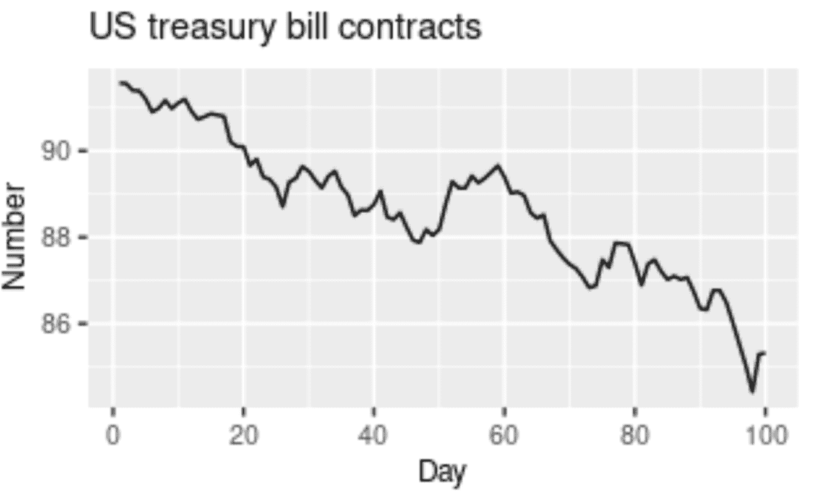
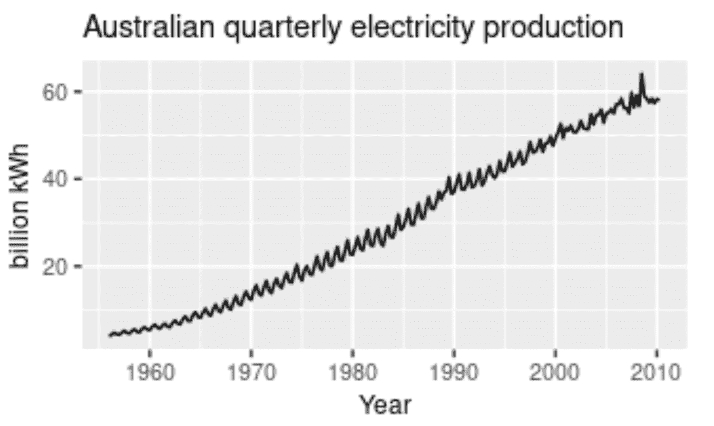
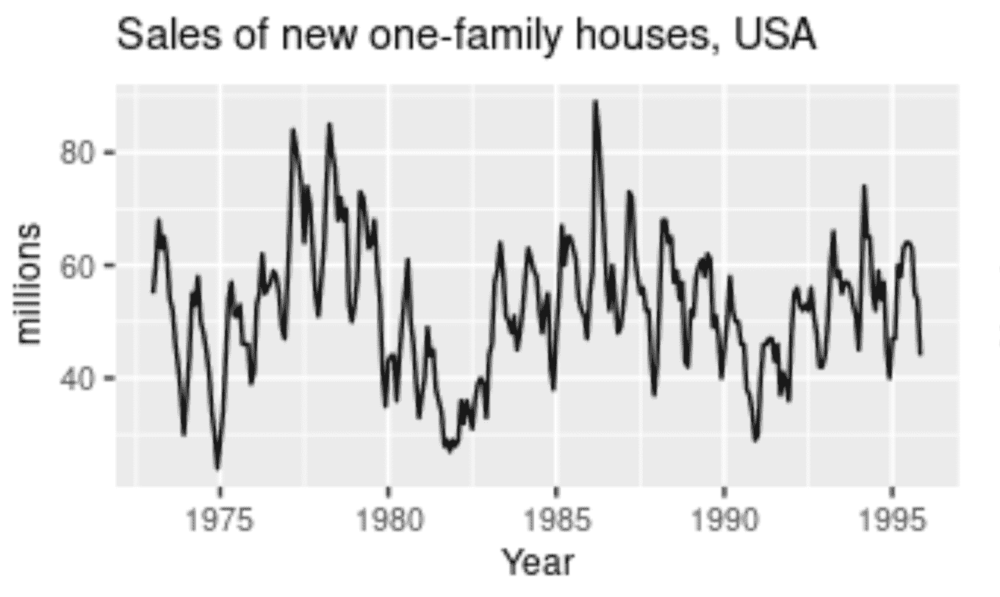
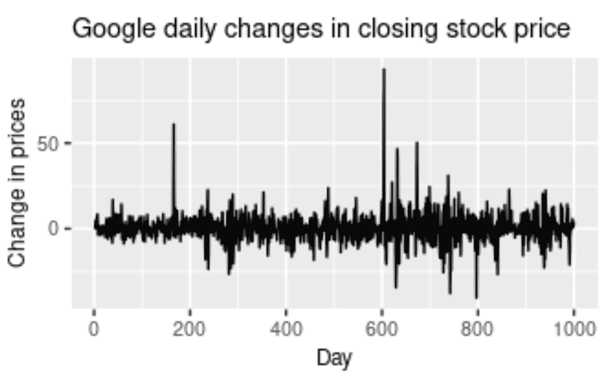
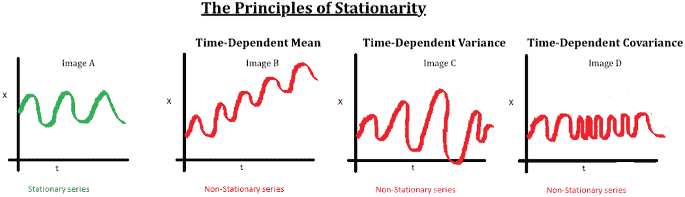
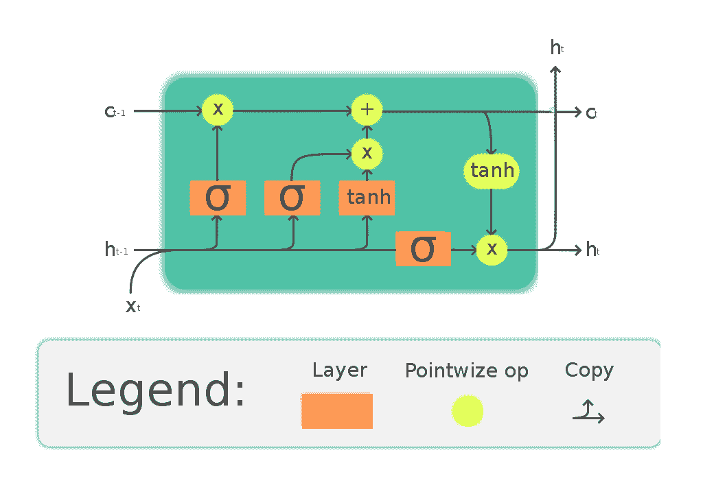
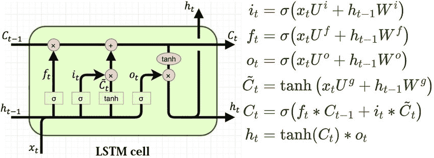
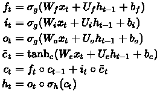
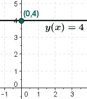
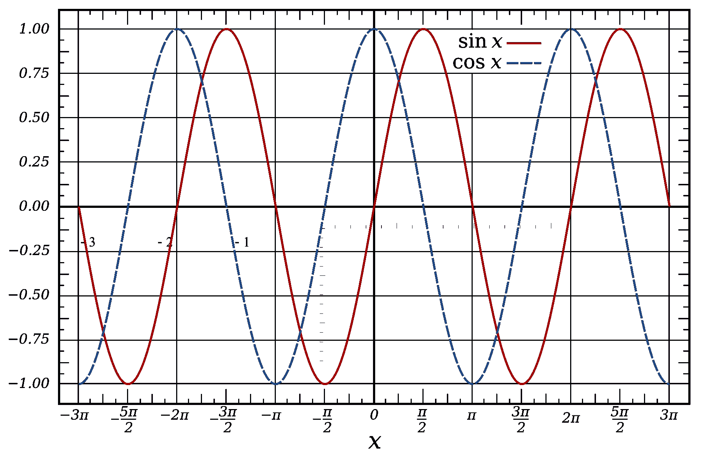

# 利用深度学习进行股票价格预测(上)

> 原文：<https://blog.paperspace.com/forecasting-stock-prices-using-deep-learning/>

在本文关于使用深度学习进行股价预测的第一部分中，我们将掌握理解使用机器学习和深度学习模型进行预测和时间序列分析的基本方面所需的大多数主题。时间序列分析(或预测)正在成为现代机器学习算法中最受欢迎的用例之一。为了理解时间序列分析中的不同类型的模式，并确定现实的未来预测，我们的机器学习或深度学习模型需要进行适当的训练。

在本文中，我们的主要目标仍然是理解解决时间序列分析和预测相关问题的所有基本工具和核心概念。在本系列的第二部分也是最后一部分，我们将介绍一个完整而直观的例子，说明如何从头开始构建自己的股票市场价格预测模型(即堆叠 LSTM 模型)。现在，让我们看一下目录，以设定您对第 1 部分的期望。

### 目录

*   介绍
*   为什么我们需要时间序列分析？
*   时间序列分析的基本要素
    1。趋势
    2。季节性
    3。不规则性
    4。循环的
*   了解平稳和非平稳序列
*   详细了解 LSTMs
*   何时不使用时间序列分析
*   结论

## 介绍

世界上发生的大多数自然事件都涉及到一定量的时间序列预测。时间序列预测的主要对象是一个变量，即 ***时间*** 。时间序列数据分析对于提取有意义的统计数据和其他重要特征是有用的。

时间序列分析包括以固定的时间间隔对一组观察值或数据点进行连续绘图。通过研究以前的结果及其随时间的进展，我们可以在这些研究观察的帮助下做出未来的预测。

解决时间序列分析相关问题的方法有其独特之处。大多数机器学习问题利用具有某些要预测的结果的数据集，例如类别标签。这种说法意味着大多数机器学习任务通常利用自变量和因变量来计算特定问题。

这个过程包括机器学习算法分析数据集(比如$X$)并使用预测($Y$)来形成评估和解决问题陈述的方法。大多数受监督的机器学习算法都以这种方式执行。但是，时间序列分析是独特的，因为它只有一个变量: ***时间*** 。我们将在本文的下一部分更深入地探讨如何用深度学习解决股票市场价格预测任务。目前，我们的主要目标是理解完成这项任务所需的术语和重要概念。让我们开始吧！

## 为什么我们需要时间序列分析？


Image By Author

时间间隔内数据点的有序序列构成了时间序列分析的基本要素。时间序列分析在现实世界中有着广泛的应用。因此，时间序列的研究对于理解，或者至少对于获得关于你在不久的将来可以预期什么的基本知识是有意义的。除了我们将在这些文章的下一部分中构建的股票市场价格预测模型之外，时间序列分析还应用于经济预测、销售预测、预算分析、过程和质量控制、天气模式检测、库存和效用研究、人口普查分析等许多领域。

理解数据元素以前的行为模式至关重要。考虑一个商业或经济预测的例子。当你可以从以前的模式中提取有用的信息时，你就可以相应地规划未来。通常情况下，借助于时间序列分析和预测做出的预测会产生良好的结果。这些将帮助用户计划和评估当前的成就。

## 时间序列分析的基本组成部分

时间序列分析就是收集以前的数据来研究各种趋势的模式。通过对这些时间序列预测模式进行详细分析，我们可以在我们的建设性深度学习模型的帮助下确定未来的结果。虽然有其他方法来确定未来趋势的现实结果，但深度学习模型是一种出色的方法，可以获得每个概念的一些最佳预测。

现在让我们关注时间序列预测的组成部分，即趋势、季节性、周期性和不规则性。时间序列分析的这四个组成部分指的是它们的图形表示中的变化类型。让我们分别来看一下这些概念，并借助一些现实的例子来获得更多的直觉。

### 趋势



[Image Source](https://otexts.com/fpp2/tspatterns.html)

时间序列预测中的趋势被定义为在一段较长的时间内数据的持续增加或减少。在不同的时间点，数据点和元素可能会有轻微的波动，但总体变化和变化方向在较长的时间内保持不变。当一个趋势从长时间的持续上涨到长时间的持续下跌，这通常被称为“改变方向”趋势。

有几个术语用来定义我们在时间序列预测中处理的趋势类型。在很长一段时间内轻微或适度上升的趋势可以称为上升趋势，而在很长一段时间内轻微或适度下降的趋势称为下降趋势。如果趋势遵循逐渐增加或逐渐减少的一致模式，并且在图形的整体模式中没有太大影响，则该趋势可以被称为水平或静止趋势。上图所示的图形表示在很长一段时间内有一个向下的轨迹。因此，此图显示了下降趋势的代表，也称为下降趋势。

让我们考虑一个例子来更好地理解趋势的概念。像亚马逊、苹果、微软、特斯拉和类似的科技巨头这样的成功公司有一个合理的股价上升曲线。我们已经知道，我们可以将股票价格的上升确定为上升趋势。虽然成功的公司有上升趋势，但一些在股市表现不佳的公司的股价有下降趋势。那些在固定时间间隔内盈利和亏损都相当可观的中性利润率的公司被定义为水平或稳定趋势。

### 季节性



[Image Source](https://otexts.com/fpp2/tspatterns.html)

受季节性频率变化影响的模式称为季节性模式。时间序列分析的这一组成部分可以根据时间戳的不同而不同，如季度、月或半年。然而，需要注意的重要一点是，这些波动通常发生在一年之内。每当频率是固定的和已知的，并且也是及时发生的，通常在一年内，时间序列分析的这个组成部分被称为季节性。

考虑一个现实的例子，想想某些季节性水果的销售。像西瓜这样的水果在夏季销售会增加，而在冬季，西瓜的销售会逐渐减少。同样，像苹果这样的季节性水果在冬季比其他季节有更高的销量。冰淇淋和嫩椰子是在夏季销售额增加而在其他季节销售额下降的食品的其他例子。除了食品之外，像 4 月这样的时期或月份可能会有较高的投资份额，并经历股票的下跌，直到 6 个月后的 10 月份，在 10 月份出现峰值上涨。这种模式也可以看作是一种季节性。

### 周期性



[Image Source](https://otexts.com/fpp2/tspatterns.html)

当一个模式表现出混合频率的上升和下降，并且图形表示具有在一段时间内随机出现的波峰和波谷时，它被称为循环分量。这些事件通常持续至少一年。难以预测的某些公司的股票价格通常具有循环模式，即在某个时期股价上涨，而在其他时期利润较低。对于我们的深度学习模型来说，循环趋势是最难预测的。上面的图表显示了二十年间房屋销售的周期性行为。

周期性行为模式的一个很好的现实例子是当一个人决定投资他们自己的初创企业。在初创企业的建立和发展过程中，每个企业都会经历一个循环阶段。这些周期性波动经常发生在商业周期中。通常，创业阶段会包括投资阶段，这会对我们的价格产生轻微的负面影响。接下来的阶段可能包括你的营销和盈利阶段，在这个阶段你开始从你成功的创业中赚取利润。在这里，你会感受到图形曲线的增加。然而，你最终也会经历一个贬值阶段。这些将显示较少的利润，直到你不断改进和投资。这个过程再次开始循环阶段，持续几年的时间。冲洗并重复。

### 不规则



[Image Source](https://otexts.com/fpp2/tspatterns.html)

不规则性是一个几乎不可能用深度学习模型进行准确预测的组件。不规则性或随机变化(顾名思义)涉及一种异常或非典型的模式，在这种模式下，很难推断出数据元素相对于时间的出现次数。上面是谷歌股票价格以不规则和随机模式快速变化的图形表示；这很难读。尽管存在信息和数据模式，但这种表示的建模过程将很难破解。该模型的主要目标是根据以前的结果预测未来的可能性。因此，不规则模式的模型稍微难以构建。

为了给不规则模式提供一个现实的例子，让我们来分析一下世界的现状，许多商业和其他行业都受到了大规模的影响。全球疫情是任何人都无法预测的不规则活动的一个很好的例子。这些由于自然灾害或现象而发生的干扰将影响交易价格、股票价格图表、公司和企业。你构建的模型不可能发现这些情景悲剧的发生。因此，不规则模式是时间序列预测的一个有趣的组成部分来分析和研究。

## 了解平稳和非平稳序列



[Image Source](https://beingdatum.com/time-series-forecasting/)

本文中我们将遇到的时间序列分析的另一个重要方面是平稳性的概念。当我们有一定数量的数据点或元素，并且所有这些数据点的均值和方差随时间保持不变时，那么我们称之为平稳序列。但是，如果这些元素随时间变化，我们称之为非平稳序列。大多数预测任务，包括股票市场价格或加密货币图表，都是非平稳的。不幸的是，由非平稳模式获得的结果是无效的。因此，它们需要被转换成固定模式。

下一篇文章中股票市场价格预测的整个数据准备过程将通过代码片段进行解释。在这里，我们将讨论其他几个重要的话题。将非平稳序列转化为平稳序列的几种方法有*差分*和*变换*。差分包括从高到低的顺序减去两个连续的数据点，而变换包括变换或发散序列。通常，对数转换用于此过程。有关此主题的更多信息，请参考上面图像来源中提供的链接。

为了测试 Python 中的平稳性，使用的两种主要方法包括*滚动统计*和*ADCF 测试*。滚动统计更多的是一种可视化技术，包括绘制移动平均值或移动方差，以检查它是否随时间变化。*扩展的迪基-富勒检验(ADCF)* 用于给出各种有助于识别平稳性的值。这些测试结果包括一些统计数据和临界值。它们用于验证平稳性。

现在让我们开始详细理解用于时间序列分析的 LSTMs 的概念。

## 详细了解 LSTMs



Image from [Wiki](https://commons.wikimedia.org/wiki/File:The_LSTM_Cell.svg)

递归神经网络，也称为 RNNs，是一类允许以前的输出用作输入，同时具有隐藏状态的神经网络。关于 RNNs 的更深入的细节将在以后的文章中讨论。这里的主要焦点和目标仍然是研究和获得对 LSTM 建筑更好的直觉。由于梯度爆炸和消失的可能性，rnn 在传输长期数据元素方面存在问题。这些问题的解决方案是由**(****【LSTM】****)**模型提供的，这也是一种递归神经网络(RNN)架构，用于解决许多复杂的深度学习问题。LSTMs 对于我们使用深度学习进行股票价格预测的任务特别有用。**

**具有有效的存储单元机制的 LSTM 体系结构对于解决复杂问题和以更高的准确度做出全面有效的预测是非常有用的。LSTMs 学习什么时候忘记，什么时候记住提供给他们的信息。LSTM 结构的基本解剖可以分为三个主要步骤。第一阶段是包含要重新收集的基本和初始数据的单元状态。第二阶段是隐藏状态，主要由三个门组成:遗忘门、输入门和输出门。我们将很快讨论这些门。最后，我们有一个循环阶段，在每个时间步结束时重新连接数据元素进行计算。**

**一旦所有的状态都被更新，一个时间步就完成了。让我们来探讨一下门的概念，并解读它们各自的用途。**

1.  ****遗忘门:**lstm 中最重要的门之一，利用 sigmoid 函数来选择保留或丢弃哪些值。接近 1 的值通常被保留，而接近 0 的值被忽略。**
2.  ****输入门:**输入门用于决定向 LSTM 单元添加什么。它利用了 sigmoid 和 tanh 函数。双曲正切函数将值压缩在-1 和 1 之间，以防止任一频谱上的值变得过大。**
3.  ****输出门:**输出门决定下一个隐藏状态的组件。它也是整个 LSTM 结构的整体汇编。**

**下面是一个堆栈 LSTM 结构的简单代码表示，将在本系列的下一部分中用于计算目的。代码块是在顺序模型架构的帮助下，用 TensorFlow 深度学习框架编写的。**

```py
**`model.add(LSTM(100,return_sequences=True,input_shape=(100,1)))
model.add(LSTM(100,return_sequences=True))
model.add(LSTM(100))`**
```

**LSTMs 的数学计算可以有多种解释。下图是 LSTMs 数学计算的两种方法。有时偏置函数会被忽略，如第二幅图所示。然而，我们不会涵盖第一张图片的复杂细节。您可以从 image source 中提供链接查看更多关于该表示的信息。考虑到第一幅 LSTM 图像的数学方程对于计算来说相当精确。**

**

[Image Source](https://www.researchgate.net/figure/Structure-of-the-LSTM-cell-and-equations-that-describe-the-gates-of-an-LSTM-cell_fig5_329362532)** **

[Image Source](https://en.wikipedia.org/wiki/Long_short-term_memory)** 

**其中:**

**$ x(t)$:LSTM 单元的输入向量
$ f(t)$忘记门的激活向量
$ I(t)$输入/更新门的激活向量
$ o(t)$输出门的激活向量
$ h(t)$隐藏状态向量，也称为 lstm 单元的输出向量
$c̃(t)$:单元输入激活向量
$ c(t)$单元状态向量
$ w $，$U**

**关于长期短期记忆的进一步信息和探索(***【LSTM】****)，*我强烈推荐阅读几篇广泛涉及这一概念的文章。我的两个主要建议是查看维基百科的官方文档，其中包含了学习 LSTMs 的大部分理论信息。为了更直观地理解，您应该查看的第二个链接是这里的。现在让我们来了解一些情况，在这些情况下，使用时间序列分析可能是不必要的，甚至是有害的。**

## **何时不使用时间序列分析**

**从本文的前几节可以明显看出，时间序列预测是当今世界的宝贵财富。时间序列分析的应用非常广泛，在我们的日常生活中有各种各样的用例。尽管有这些事实，但在某些情况下，如果不利用预测，你会过得更好。下面是两个这样的场景。**

### **这些值在分析模式中是恒定的**

**

Image from [Wiki](https://upload.wikimedia.org/wikipedia/commons/d/d3/Wiki_constant_function_175_200.png)** 

**当这些值不变时，应用时间序列预测的全部意义就变得无用了。无论外部变量如何变化，你总是有一个固定不变的值。因此，这种情况不需要时间序列分析的参与。上面的图形表示是一个常数图的例子，其中无论其他约束是什么，值都保持固定在 4。考虑一个现实生活中的例子，你可以假设任何特定巧克力的成本在很长一段时间内保持不变。**

### **分析模式中可用的值是函数的形式**

**

Image from [Wiki](https://upload.wikimedia.org/wikipedia/commons/thumb/d/d2/Sine_and_Cosine.svg/1920px-Sine_and_Cosine.svg.png)** 

**类似于前面讨论的点，当有一个固定函数具有每个期望时间点的所需值时，那么整个时间序列预测点就无效了。当时间序列分析以函数的形式出现时，这种模式的数学计算可以用计算器来完成。考虑一些这样的例子，上图显示了正弦和余弦波的表示。任何形式为$Y(x) = X$的函数计算起来都很简单，我们不需要深度学习就能做到。**

## **结论**

**在本文中，我们已经涵盖了处理时间序列预测相关问题的大部分基本要求。涵盖的最重要的主题是长短期记忆(LSTM)。LSTM 将用于我们在下一个教程中构建的股票价格预测项目。**

**在我们的下一篇文章中，我们将致力于使用深度学习进行股票市场价格预测的项目，即 stacked LSTMs。我们将准备数据集，可视化数据点，并构建我们的模型结构。请随意查看我以前的几篇文章，并从下面提供的链接中直观地了解深度学习框架，如 TensorFlow 和 Keras。我们将需要这些库来完成我们的项目。**

**[The Absolute Guide to TensorFlow | Paperspace BlogTensorFlow is one of the most popular deep learning libraries of the modern era.Developed by Google and released in 2015, TensorFlow is considered to be one ofthe best platforms for researching, developing, and deploying machine learningmodels. The core structure of TensorFlow is developed with …Paperspace BlogBharath K](https://blog.paperspace.com/absolute-guide-to-tensorflow/)****[The Absolute Guide to Keras | Paperspace BlogIn this article, we will dive deeper into the world of TensorFlow and Keras. Ifyou haven’t already, I would highly recommend first checking out my previousarticle, The Absolute Guide to TensorFlow [/absolute-guide-to-tensorflow]. Itwill help you to better understand the various concepts that we w…Paperspace BlogBharath K](https://blog.paperspace.com/the-absolute-guide-to-keras/)**

**强烈建议您查看这些库的指南，因为它们将在我们的文章系列的第二部分中被广泛使用。下一部分将包含完整的演练。在此之前，加强你的基础知识，为下一篇文章做好准备！**