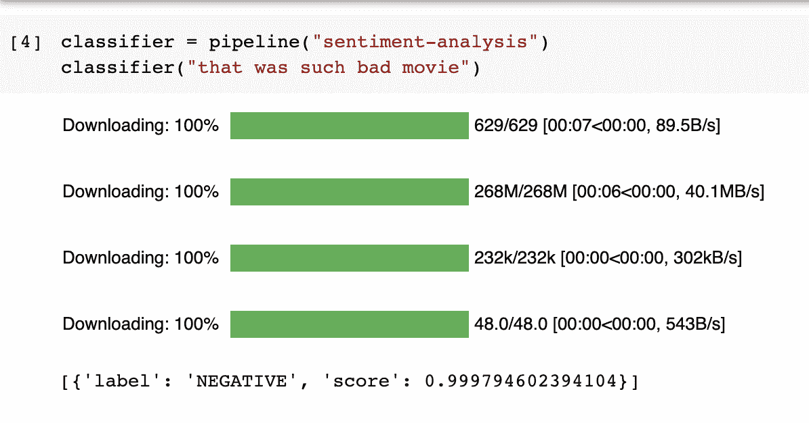
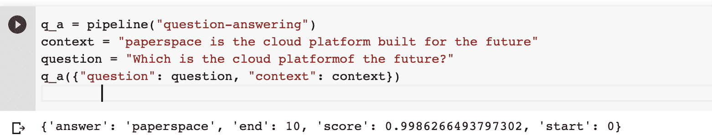
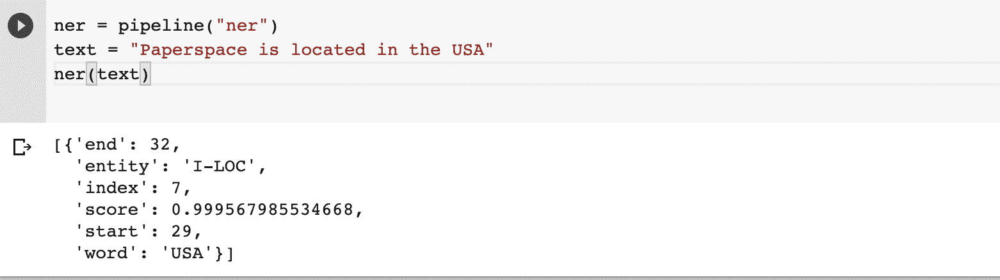
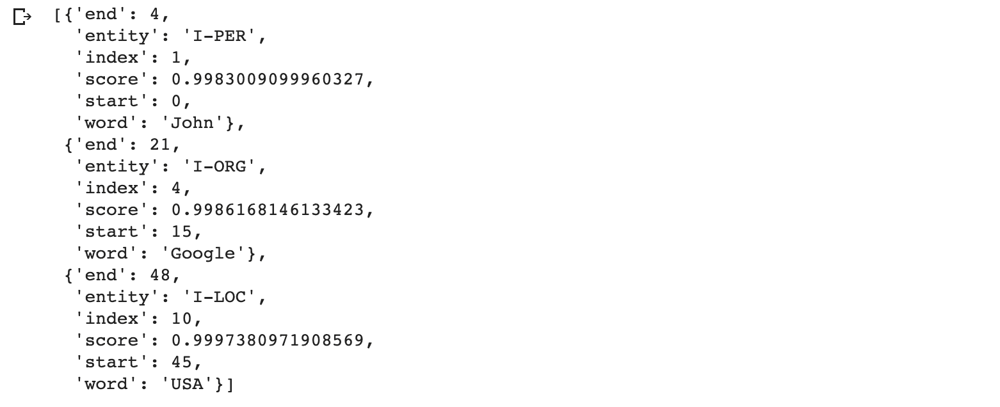
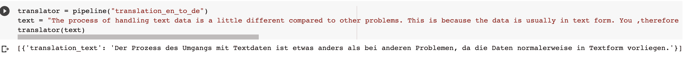
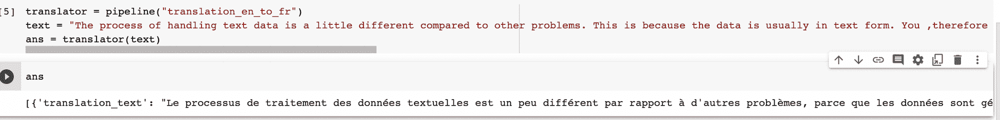
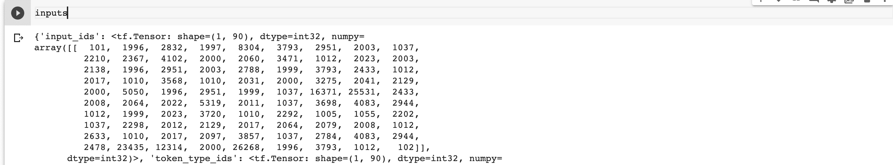
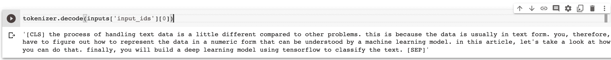
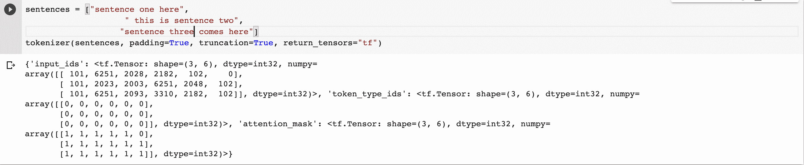

# 拥抱人脸的自然语言处理

> 原文：<https://blog.paperspace.com/natural-language-processing-with-huggingface/>

处理文本数据需要在数据预处理阶段投入相当多的时间。之后，你将需要花更多的时间来建立和训练自然语言处理模型。有了[抱脸](https://github.com/huggingface)，这些都不用做了。

感谢拥抱脸的变形金刚库，你可以马上开始解决 NLP 问题。该软件包提供了预先训练的模型，可用于许多自然语言处理任务。变形金刚还支持 100 多种语言。它还提供了用您的数据微调模型的能力。该库提供了与 PyTorch 和 TensorFlow 的无缝集成，使您能够在它们之间轻松切换。

在这篇文章中，我们将看看你如何使用拥抱脸包:

*   情感分析
*   问答
*   命名实体识别
*   摘要
*   翻译
*   标记化

## 情感分析

在情感分析中，目标是确定文本是负面的还是正面的。Transformers 库提供了一个可以应用于任何文本数据的`pipeline`。`pipeline`包含预训练模型以及在模型训练阶段完成的预处理。因此，您不需要执行任何文本预处理。

让我们从导入`pipeline`模块开始。

```py
from transformers import pipeline
```

下一步是用情感分析预训练模型实例化`pipeline`。这将下载并缓存情绪分析模型。在未来的请求中，将使用缓存模型。其他模型的工作方式相似。最后一步是使用模型来评估某些文本的极性。

```py
classifier = pipeline("sentiment-analysis")
classifier("that was such bad movie")
```



该模型还返回标签的置信度得分。变形金刚套装中的大多数其他模型也返回一个置信度得分。

## 问答

变形金刚包也可以用于问答系统。这需要一个语境和一个问题。先从下载问答模式开始。

```py
q_a = pipeline("question-answering") 
```

下一步是定义一个上下文和一个问题。

```py
context = "paperspace is the cloud platform built for the future"
question = "Which is the cloud platform of the future?"
```

最后一步是将问题和上下文传递给问答模型。

```py
q_a({"question": question, "context": context}) 
```

该模型将返回答案及其在所提供的上下文中的开始和结束位置。



## 命名实体识别

命名实体识别包括提取和定位句子中的命名实体。这些实体包括人名、组织、位置等。让我们从下载命名实体识别模型开始。

```py
ner = pipeline("ner") 
```

接下来，传入一个文本，模型将提取实体。

```py
text = "Paperspace is located in the USA"
ner(text)
```



该模型还可以检测一个句子中的多个实体。它返回每个已识别实体的终点和置信度得分。

```py
ner = pipeline("ner")
text = "John works for Google that is located in the USA"
ner(text)
```



## 摘要

给定一大段文本，摘要模型可以用来摘要该文本。

```py
summarizer = pipeline("summarization") 
```

该模型需要:

*   要汇总的文本
*   摘要的最大长度
*   摘要的最小长度

```py
article = "The process of handling text data is a little different compared to other problems. This is because the data is usually in text form. You ,therefore, have to figure out how to represent the data in a numeric form that can be understood by a machine learning model. In this article, let's take a look at how you can do that. Finally, you will build a deep learning model using TensorFlow to classify the text."
summarizer(article, max_length=30, min_length=30)
```


## 翻译

当你有一个针对不同语言人群的产品时，翻译是一项非常重要的任务。例如，您可以使用 Transformers 包将英语翻译成德语，将英语翻译成法语。先说后者。

```py
translator = pipeline("translation_en_to_fr") 
```

下载完模型后，下一步就是传递要翻译的文本。

```py
text = "The process of handling text data is a little different compared to other problems. This is because the data is usually in text form. You ,therefore, have to figure out how to represent the data in a numeric form that can be understood by a machine learning model. In this article, let's take a look at how you can do that. Finally, you will build a deep learning model using TensorFlow to classify the text."
translator(text)
```



英语到德语的翻译可以以类似的方式完成。

```py
translator = pipeline("translation_en_to_fr")
text = "The process of handling text data is a little different compared to other problems. This is because the data is usually in text form. You ,therefore, have to figure out how to represent the data in a numeric form that can be understood by a machine learning model. In this article, let's take a look at how you can do that. Finally, you will build a deep learning model using TensorFlow to classify the text."
translator(text)
```



## 标记化

除了在 NLP 任务中使用拥抱脸，你还可以用它来处理文本数据。TensorFlow 和 PyTorch 都支持该处理。拥抱脸的标记器完成了文本任务所需的所有预处理。分词器可以应用于单个文本或一系列句子。

让我们看看如何在 TensorFlow 中实现这一点。第一步是导入标记器。

```py
from transformers import AutoTokenizer
text = "The process of handling text data is a little different compared to other problems. This is because the data is usually in text form. You ,therefore, have to figure out how to represent the data in a numeric form that can be understood by a machine learning model. In this article, let's take a look at how you can do that. Finally, you will build a deep learning model using TensorFlow to classify the text." 
```

下一步是从预先训练的模型词汇表中实例化标记器。

```py
tokenizer = AutoTokenizer.from_pretrained("bert-base-uncased") 
```

然后，您可以在文本上使用这个标记器。如果你想退回 PyTorch tensors 而不是 TensorFlow 的 pass `return_tensors="pt"`。

```py
inputs = tokenizer(text, return_tensors="tf") 
```



还可以使用`decode`函数将标记化的句子转换成其原始形式。

```py
tokenizer.decode(inputs['input_ids'][0])
```



拥抱脸也允许填充句子，使它们长度相同。这是通过传递填充和截断参数来实现的。句子将被截断到模型可以接受的最大值。

```py
sentences = ["sentence one here",
                    " this is sentence two",
                   "sentence three comes here"]
tokenizer(sentences, padding=True, truncation=True, return_tensors="tf")
```



## 最后的想法

在本文中，您已经看到了使用拥抱脸进行各种自然语言处理任务有多快。您还看到了 Transformer 模型在各种 NLP 任务上实现了高精度。您还可以根据自定义数据训练模型。拥抱脸平台可以用来搜索新的模式，以及分享你的。

复制这个[笔记本](https://colab.research.google.com/drive/1qcVLTLVu7CulnLWfU4wzp3eo-Ht7b79i?usp=sharing)就可以马上开始玩库了。