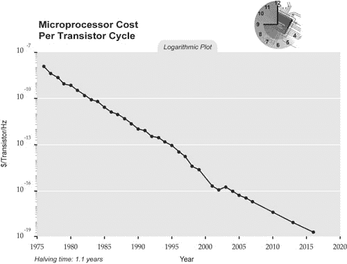
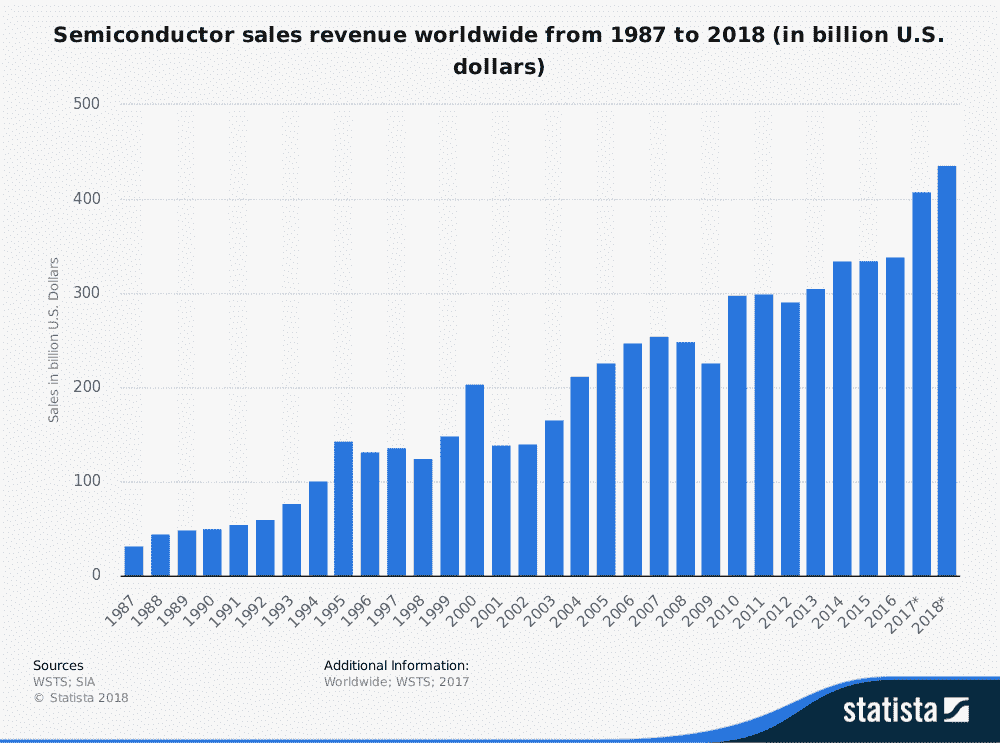
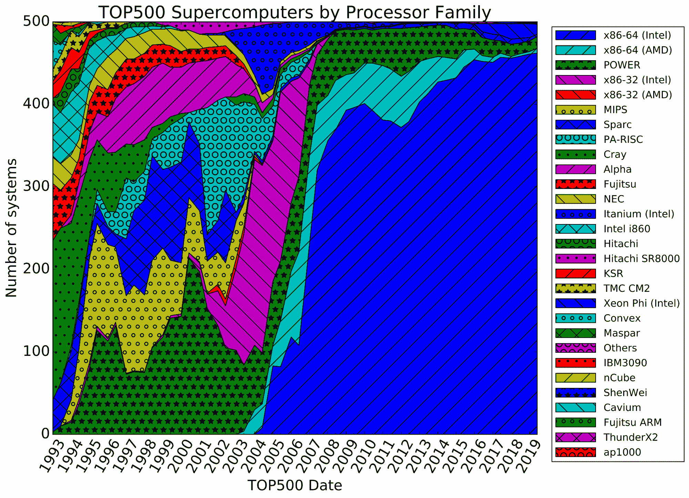
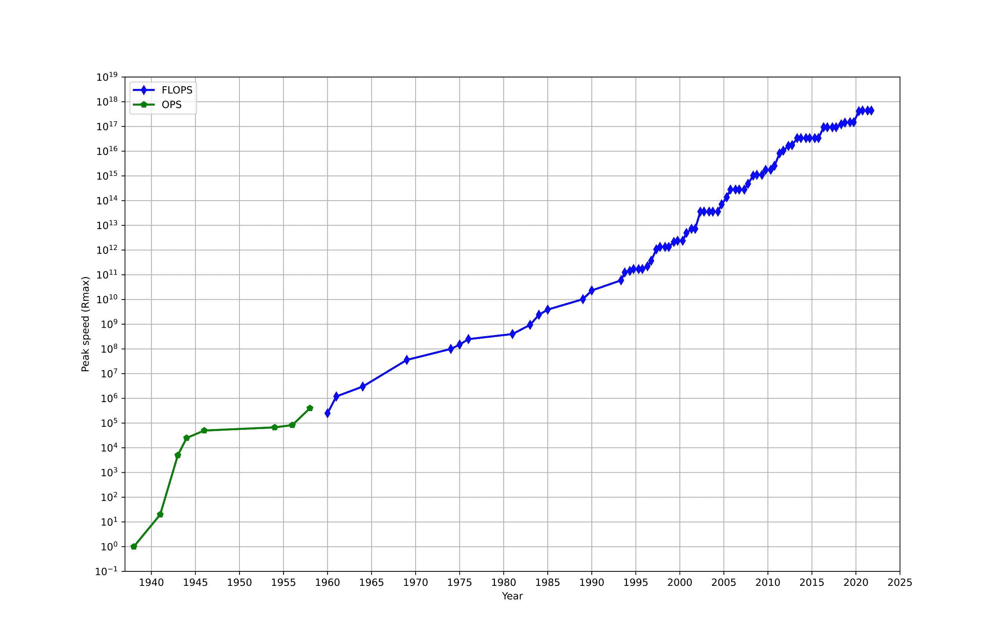
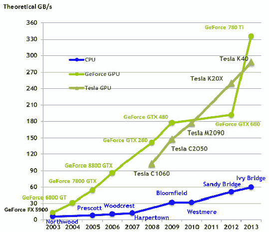
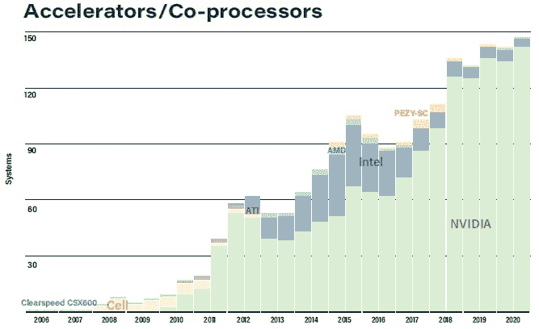
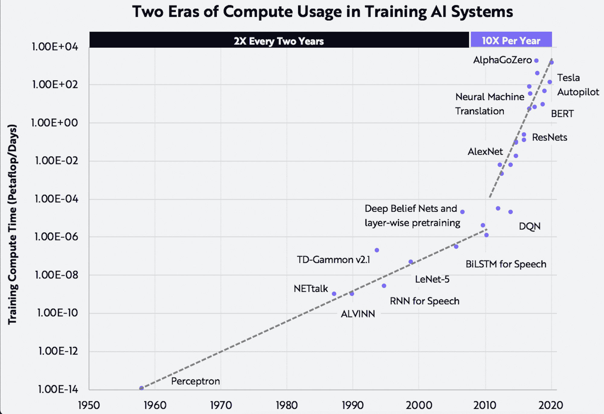
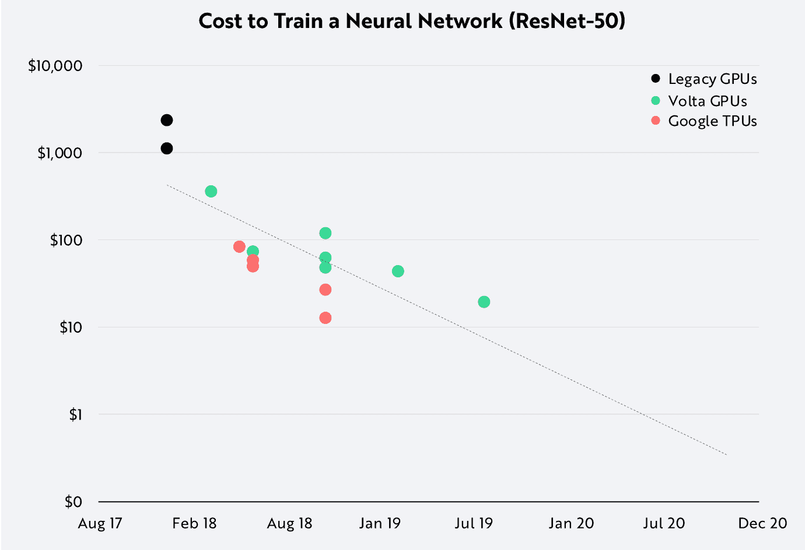

# 关于基于 ARM 的深度学习架构，超级计算的历史可以教给我们什么？

> 原文：<https://blog.paperspace.com/hpc-supercomputing-deep-learning-history-arm/>

NVIDIA [最近发布了](https://www.anandtech.com/show/16610/nvidia-unveils-grace-a-highperformance-arm-server-cpu-for-use-in-ai-systems)Grace——一款新的基于 ARM 的 CPU 芯片，针对神经网络工作负载进行了优化。

这让我们不禁想知道 Grace 是否标志着 64 位 x86 体系结构在高性能计算(HPC)领域长达 15 年以上的主导地位开始终结？对于我们这些构建深度学习应用的人来说，这可能意味着什么？我们会很快将代码移植到 ARM 上吗？

我们希望通过了解 HPC 的一些历史来解决 NVIDIA 的声明引发的这些和其他问题。希望我们可以先了解一点我们是如何走到这一步的，然后这对深度学习的未来可能意味着什么。

## 超级计算早期

超级计算有着悠久而迷人的历史——从 20 世纪 60 年代最初的 IBM、CDC 和 Cray 机器，它们以每秒 10^6 浮点运算数来衡量性能，到今天的机器，它们计划在 2021 年底突破每秒 10^18 浮点运算数的障碍。

超级计算也是一种观赏性运动。每年有两次[500 强](https://top500.org/lists/top500/list/2020/11/)榜单在[两次](https://www.isc-hpc.com/)和[最大的](https://sc21.supercomputing.org/)超级计算会议期间发布——争夺榜单榜首的竞争非常激烈。自 1993 年以来，500 强榜单一直在持续发布，这对所有参与者来说都是一件大事——从托管这些集群的站点到组成这些集群的组件制造商，再到使用这些集群的科学界(和国家)。

同样值得注意的是，Top 500 仅限于发布 *public* 的集群。虽然不是这篇博客的主题，但超级计算也有很长的保密历史——从艾伦·图灵[在 20 世纪 40 年代破解德国海军之谜](https://en.wikipedia.org/wiki/Cryptanalysis_of_the_Enigma)到[高级模拟和计算程序](https://en.wikipedia.org/wiki/Advanced_Simulation_and_Computing_Program)，该程序至今仍负责维护美国的核储备。

但那是以后的事了。我们今天想要了解的是，我们在超级计算架构方面已经取得了哪些进展，我们将走向何方——特别是当它与日益并行化的机器学习和深度学习应用相关时。

## 向量处理器的时代

The 80 MHz Cray-1 was so highly anticipated by the time it was released in 1975 that a bidding war broke out between two US national labs to secure Unit #001\. ([Source](https://en.wikipedia.org/wiki/Cray-1))

在 [1966](https://en.wikipedia.org/wiki/Vector_processor#Supercomputers) ，[控制数据公司](https://en.wikipedia.org/wiki/Control_Data_Corporation) (CDC)和[德州仪器](https://en.wikipedia.org/wiki/Texas_Instruments) (TI)都向市场推出了利用向量处理的机器。从此，早期的超级计算被向量处理器或阵列处理器机器所统治。在 20 世纪 70 年代中期之前，大型机制造商 CDC 和国际商用机器公司(IBM)一直占据主导地位，直到克雷(CDC 的一个分支)接过了接力棒。

国家研究委员会的一份报告解释了向量架构的早期优势:

> Cray-1 支持向量体系结构，在这种体系结构中，浮点数的向量可以从内存加载到向量寄存器中，并在算术单元中以流水线方式进行处理，其速度远远高于标量操作数。向量处理成为超级计算的基石。

1976 年，当著名的 Cray-1 在洛斯阿拉莫斯国家实验室发射时，Cray 已经在制造效率惊人的向量处理机了。CDC、Cray 和其他人开创的体系结构在 20 世纪 90 年代一直保持主导地位。

今天这个事实特别值得注意，因为在这些早期 Cray 机器的技术架构和现代基于 GPU 的机器的并行计算架构之间有一些现代的相似之处。

## 个人电脑改变游戏

当早期的超级计算先驱们忙于建造单处理器机器时，英特尔在 1971 年生产了 T2 第一个商用微处理器。到 20 世纪 80 年代初，这项技术已经足够成熟——也就是说可以大规模生产了——个人电脑革命开始成形。

大约在 1984 年，当麦金塔电脑第一次引起 T2 全国的关注时，个人电脑进入了主流。事后看来，我们可以看到苹果和其他早期的个人电脑组装商正乘着微处理器成本大幅下降的东风。

Microprocessors have been getting cheaper for decades. ([Source](http://www.singularity.com/charts/page62.html))

到 20 世纪 90 年代，Cray 和其他继续生产单处理器机器的传统超级计算制造商将无法跟上商用 CPU 架构提供的性价比。

要理解其中的原因，看看微处理器市场增长的速度有多快是有帮助的:

Semiconductor sales with few exceptions have been increasing for decades. ([Source](https://brandongaille.com/25-microprocessor-industry-statistics-and-trends/))

在此期间，微处理器的成本直线下降。到 1995 年，克雷破产了。约翰·马科夫在当时为《纽约时报》写道:

> 但在 20 世纪 90 年代，廉价而强大的微处理器芯片的出现给计算世界带来了变革，极大地削弱了价值数百万美元的“大铁”系统，而这正是克雷的标志。此外，冷战的结束意味着政府采购机器的预算下降，这些机器曾经是美国武器实验室的支柱，也是“星球大战”战略防御计划的核心。

旧的“大铁”系统被商品风格的微处理器架构取代——这一事实自 Cray(第一个)消亡以来塑造了过去 25 年的计算。

## 力量

下图显示了自 20 世纪 90 年代初该榜单发布以来，Top500 超级计算机所使用的处理器/架构。如果我们一直向左看，我们可以看到克雷最近几年的统治地位。

Top500 supercomputers have had a large number of dominant architectures through the years. ([Source](https://en.wikipedia.org/wiki/TOP500))

不久之后，我们看到太阳微系统公司的 [SPARC](https://en.wikipedia.org/wiki/SPARC) 和 DEC 公司的[阿尔法](https://en.wikipedia.org/wiki/DEC_Alpha)的出现。就像 IBM 的 POWER 一样，这些 RISC 架构在 20 世纪 80 年代早期受到了 [Berkeley RISC](https://en.wikipedia.org/wiki/Berkeley_RISC) (由 ARPA 资助)工作的严重影响。

RISC 项目(以及同时期斯坦福大学的 MIPS 项目)着手了解如何创造一个更简单的 CPU。其概念是以这样一种方式限制处理器的指令集，即它仍然能够执行大多数频繁执行的计算，同时降低复杂性。

20 世纪 90 年代初，我们也开始看到大规模并行系统。到 1993 年，[英特尔 Paragon](https://en.wikipedia.org/wiki/Intel_Paragon) 可以支持 1000 多个英特尔处理器。富士通的[数字风洞](https://en.wikipedia.org/wiki/Numerical_Wind_Tunnel)于 1994 年与 QTY 166 矢量处理器一起发货。到 1995 年，Cray 也开始用其 [T3E](https://en.wikipedia.org/wiki/Cray_T3E) 系统运送大规模并行系统。

大约在同一时间，我们看到 IBM 在 1990 年左右推向市场的 POWER(后来演变成 PowerPC)的出现。

POWER 最终会将 HPC 的市场权力让给 x86，但这要等到 x86 64 位真正起飞之后。在那之前，权力是一种过渡手段。在有限的时间内，性能优于 16 位和 32 位 x86，但在 2004-2005 年左右，64 位 x86(首先是 AMD，然后是 Intel)开始占据前 500 位。

随着并行性的出现(以及很快 64 位架构的出现)，新架构将很快取代旧架构。

## x86 取而代之，行业永不回头

尚不清楚行业*决定*转向 x86 架构的确切时间，但几年前发生的一个重要事件似乎已经推动了这一进程 IBM 在 20 世纪 80 年代初为其个人电脑选择了[英特尔 8088](https://en.wikipedia.org/wiki/Intel_8088) 。

英特尔的 x86 架构并不一定比我们刚刚了解到的基于 RISC 的 PowerPC 架构等替代产品更好，但也许英特尔只是在满足蓬勃发展的市场需求方面做得更好。

英特尔接着在 1985 年发布了第一款 32 位 x86 芯片，到 21 世纪初，英特尔和 AMD 都成功地批量生产了低成本的 64 位 x86 处理器。

到 2005 年中期，80%以上的 500 强超级计算机都采用 x86-64。

然后，在没有太多警告的情况下，到 2005 年[免费午餐结束了](http://www.gotw.ca/publications/concurrency-ddj.htm)——CPU 时钟速度不再像几十年前那样增长。我们实际上可以看到这种现象，在 2005 年之前的几年中，峰值速度一直处于平稳状态。

Top supercomputer speeds occasionally plateau for periods of time over 60 years. ([Source](https://en.wikipedia.org/wiki/Supercomputer))

现在，我们突然看到多核矢量指令集芯片需要回到菜单上。旨在渲染图形的大规模并行芯片的设计者——比如英伟达的人——肯定会注意到这一点。

## 加速器的兴起

早在 2003 年，与 CPU 上的顺序处理相比，甚至与多核 CPU 相比，GPU 上的多核并行处理就开始显示出巨大的潜力。

With CPUs plateauing leading into the mid-2000s, NVIDIA GPU processors began to show promise. ([Source](https://www.researchgate.net/figure/GPU-vs-CPU-Performance_fig2_270222593))

NVIDIA 认识到了 CPU 的瓶颈，并希望为 GPU 带来除渲染图形之外的另一个用例，[在 2007 年发布了 CUDA](https://dl.acm.org/doi/10.1145/1296907.1296909) ，以帮助开发人员在 GPU 上运行通用计算任务。

值得注意的是，加速器的兴起是超级计算的一种回归。就架构而言，大规模并行 GPU 加速系统的设计更接近 Cray，而不是 x86。

GPU 加速的回报比任何人合理预测的都要高。近二十年来，高性能计算领域一直由 x86 CPU 架构主导，现在它的重心已经大规模转移到 GPU 加速器上。

Machines in the Top500 using accelerators since 2006\. ([Source](https://www.nextplatform.com/2020/11/16/the-many-facets-of-hybrid-supercomputing-as-exascale-dawns/))

截至 2020 年，500 强中有 146 家正在使用英伟达 GPU 加速卡——包括最近前 10 名的[个系统。](https://top500.org/lists/top500/list/2020/11/)

NVIDIA 在加速卡领域并非没有挑战。看到 CPU 到矢量加速器过渡的机会，英特尔在 2011 年发布了[骑士渡口/骑士角](https://en.wikipedia.org/wiki/Xeon_Phi)架构(后来被称为至强融核)，这是一款基于 x86 的众核处理器，但具有不同的线程模型和额外的 SIMD 通道(AVX 系列指令)。

尽管承诺简单(无需重写代码即可在 x86 上运行)，但不幸的是，英特尔似乎没有准备好与 NVIDIA 的 CUDA 部署和爆炸式社区竞争，或者在竞争中失败。

## 武器经济学

从今天的 500 强来看，并不明显的是，尽管 x86 几乎和 Linux 一样在列表中占据主导地位(这是一个完美的 500/500)，但 x86 体系结构本身对于现代 HPC 来说并不完全是必要的。

在 GPU 加速器时代，CPU 在 HPC 环境中完成的大部分工作只是简单地向 GPU 馈送数据。没有真正的高度架构依赖性。今天，CPU 方面的最大限制是内存和 PCI-e 带宽。(这就是为什么像 [NVLink](https://en.wikipedia.org/wiki/NVLink) 这样的解决方案似乎有助于 NVIDIA 大幅提高 CPU 性能。)

正如 POWER/PowerPC 曾经是 HPC 的默认选择，早期的多核 AMD 处理器曾经是新 HPC 系统的首选一样，今天看来 ARM 有可能取代基于英特尔的 x86，成为世界上最快的集群的主导架构。

去年被 NVIDIA 以 400 亿美元收购的 ARM 最初是受 20 世纪 80 年代 RISC 的启发。该公司成立于 1990 年，使用的架构[与英特尔的 x86 架构](https://www.androidauthority.com/arm-vs-x86-key-differences-explained-568718/#:~:text=Arm%20is%20RISC%20(Reduced%20Instruction,(Complex%20Instruction%20Set%20Computing).&text=This%20is%20a%20key%20difference,%2C%20instruction%20set%2C%20and%20hardware.)大不相同。他们的工作导致了[Acorn Achimedes](https://en.wikipedia.org/wiki/Acorn_Archimedes)——第一台基于 RISC 的个人电脑。

ARM 芯片因其极低的功耗和高效率而备受青睐。它们也正处于生产热潮之中——很像上世纪 90 年代个人电脑革命之初的微处理器。正如一位作者所说:

> 基于 Arm 的产品显然无处不在。任何“智能”设备都可能包含 Arm 技术。作为最受欢迎的微处理器架构，Arm 报告称，其硅合作伙伴在 2020 年第四季度出货了创纪录的 67 亿片基于 Arm 的芯片，超过了其他流行的 CPU 指令集架构的总和...虽然 Arm 一直是几乎所有智能手机的首选 CPU，但 Nvidia-Arm 的收购将对更广泛的计算行业产生惊人的影响。

ARM 的成本下降如此之快也就不足为奇了——当个人电脑首次压低 x86 价格时，我们看到了同样的推动作用。ARM 支持的不仅仅是智能手机。也是像物联网传感器，MacBooks，数据中心服务器之类的东西！

因此，得知 500 强中排名第一的计算机是位于日本神户的富士通公司生产的基于 ARM 的 Fugaku 就不足为奇了。

Fugaku 拥有 158，976 个 A64FX 处理器(顺便说一下，这些处理器取代了旧的 SPARC 处理器)，并将继续成为地球上最快的公共计算机，直到 2021 年底。

## 这对深度学习意味着什么

由于架构、成本和效率的原因，我们可能会看到高性能计算从 x86 到 ARM 的全行业过渡，这种过渡可能会渗透到深度学习计算中。

尽管作为计算的一个子集，HPC 历史悠久，但它是深度学习的优秀领导者。从张量核也有利于传统 HPC 应用的意义上来说，这些应用非常相似。

训练深度学习模型的计算需求每年都在以天文数字的速度增长:

Deep learning compute time over the years ([Source](https://ark-invest.com/articles/analyst-research/ai-training/))

同时，计算成本也在降低。

How much does it cost to train ResNet-50? ([Source](https://ark-invest.com/articles/analyst-research/ai-training/))

这是自 CDC 和 IBM 大型机时代以来计算的相同自然循环:计算需求增加，而单位计算成本降低。

深度学习成本正在快速降低。一位分析师写道:

> 根据其成本下降的速度，人工智能处于非常早期的阶段。在摩尔定律的第一个十年，晶体管数量每年翻一番——或者说是其后几十年变化速度的两倍。我们在人工智能训练和人工智能推理方面看到的 10-100 倍的成本下降表明，人工智能在其发展中处于萌芽状态，或许未来几十年将会缓慢但持续地增长。

ARM 代表了一条令人兴奋的道路，可以满足深度学习对计算的贪得无厌的胃口。产量已经到位——每季度大约 70 亿个 ARM 单元。许可模式也已到位，允许供应商扩展，以提供与加速卡的深度集成。世界顶级超级计算机已经展示了基于 ARM 架构的可能性。

那么，期待很快看到深度学习库移植到 ARM 上合理吗？

可能性看起来很大。如果有一件事是确定的——如果它真的发生了，它会比我们预期的要早得多。