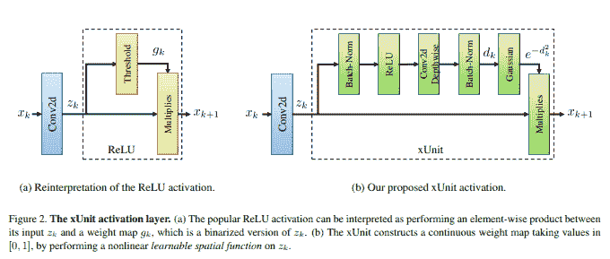
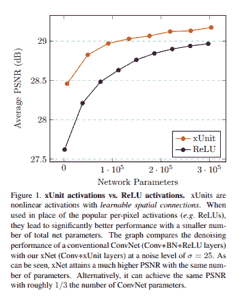
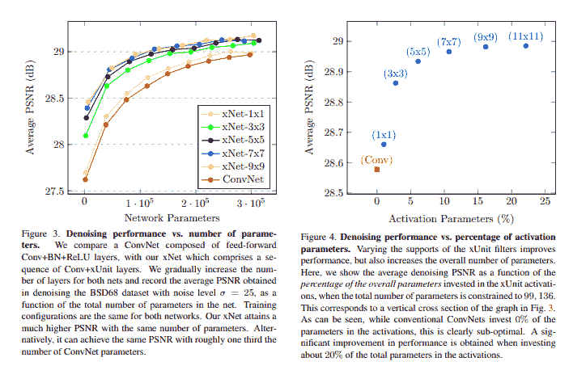
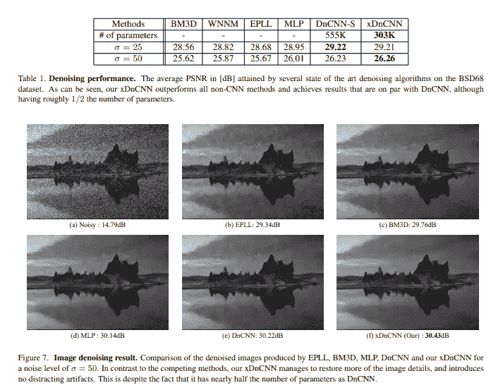
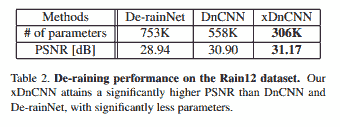
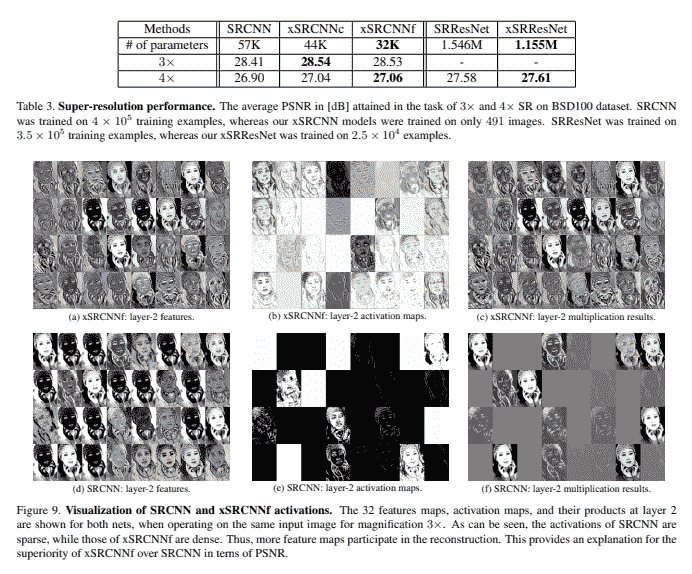
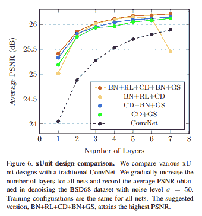
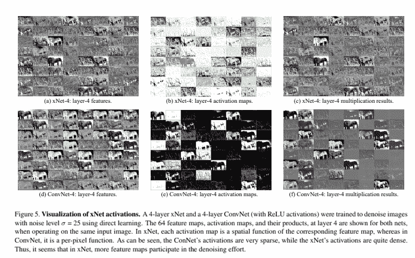

# 用于图像去噪的 xUnit 空间激活函数

> 原文：<https://blog.paperspace.com/xunit-spatial-activation/>

在现代深度学习领域，激活函数一直是研究和讨论的主要领域。迄今为止，已经提出了各种各样的新功能，这些功能似乎在深度学习的不同领域，特别是计算机视觉中工作得非常好。然而， **xUnit** 为设计满足特定任务的激活单元提供了一个新的视角，例如图像恢复和图像去噪。具体来说，在这篇文章中，我们将深入了解 Kligvasser 等人的 CVPR 2018 年论文。艾尔。，标题为“ [xUnit:学习高效图像恢复的空间激活函数](https://openaccess.thecvf.com/content_cvpr_2018/papers/Kligvasser_xUnit_Learning_a_CVPR_2018_paper.pdf)”。该论文围绕引入一种新的层块(或者说是一个堆栈)来取代常用的 ReLU 激活函数，以提高图像恢复和去噪领域的性能。

首先，我们将看看 xUnit 背后的动机，然后深入分析它的结构，随后是论文中展示的结果及其 PyTorch 代码。

### 目录

1.  动机
2.  xUnit
3.  密码
4.  结果
5.  结论
6.  参考

## 摘要

> 近年来，深度神经网络在许多低级视觉任务中取得了前所未有的性能。然而，最先进的结果通常是通过非常深的网络实现的，这些网络可以达到几十层，具有数千万个参数。为了使 DNNs 能够在资源有限的平台上实现，有必要削弱性能和效率之间的权衡。本文提出了一种新的激活单元，特别适用于图像恢复问题。与广泛使用的每像素激活单元(如 ReLUs 和 sigmoids)相比，我们的单元实现了一个具有空间连接的可学习的非线性功能。这使得网络能够捕捉更复杂的特征，从而需要更少的层数来达到相同的性能。我们通过使用最先进的网络进行去噪、去训练和超分辨率的实验来说明我们的单元的有效性，这些已经被认为是非常小的。通过我们的方法，我们能够进一步将这些模型减少近 50%，而不会导致任何性能下降。

## 动机

在对深度神经网络中的架构组件的多年研究中，激活函数一直是活跃讨论的领域。ReLU 是迄今为止最成功的激活函数，主要用于计算机视觉领域的所有任务。这背后的原因本质上是 ReLU 的简单和高效，它允许激活单元尽可能地轻便和简单。除了激活函数之外，几个缩放因子已经成为在深度卷积神经网络(CNN)的性能方面推动最先进技术的探索中的重要组成部分。在这篇论文中，作者研究了使激活单元更有效，而不是增加网络的深度。他们通过引入一种新的激活机制来实现这一点，这种机制被称为 **xUnit** 、**T3，这是一个具有空间和可学习连接的层。xUnit 计算一个连续值权重图，作为其输入的软门。**

这篇论文的美妙之处在于，由于新颖的 xUnit 激活单元是一个具有代表性能力的可学习层堆栈，因此作者可以从预定义的 SOTA 轻量级 CNN 模型中删除层，并在保持相同性能的同时使它们便宜近 50%。

## xUnit



上图显示了 xUnit 激活单元的结构设计。如前所述，xUnit 是不同可学习层的堆叠，而不是传统 ReLU 激活功能的直接替代。xUnit 层由以下几层组成(按顺序排列):

1.  批量标准化
2.  热卢
3.  Conv 2D 深度方向
4.  批量标准化
5.  高斯的

正如这里看到的，ReLU 仍然保留在 xUnit 中，但是它被嵌入到由其他可学习层组成的管道中。xUnit 中存在的高斯层与图像去噪更相关，因为它在抽象级别上起作用，如高斯模糊过滤器。当 xUnit 需要用于图像分类或分割等其他任务时，可以消除这种情况，但是，可以假设高斯滤波器在鲁棒性和抗锯齿方面也具有良好的效果。

## 密码

以下片段是 xUnits 的三个变种的结构定义，分别是*香草 xUnit* 、*苗条 xUnit、*和*稠密 xUnit* ，如论文的[官方 github 库所定义:](https://github.com/kligvasser/xUnit)

```py
import torch.nn as nn

class xUnit(nn.Module):
    def __init__(self, num_features=64, kernel_size=7, batch_norm=False):
        super(xUnit, self).__init__()
        # xUnit
        self.features = nn.Sequential(
            nn.BatchNorm2d(num_features=num_features) if batch_norm else Identity(),
            nn.ReLU(),
            nn.Conv2d(in_channels=num_features, out_channels=num_features, kernel_size=kernel_size, padding=(kernel_size // 2), groups=num_features),
            nn.BatchNorm2d(num_features=num_features) if batch_norm else Identity(),
            nn.Sigmoid()
        )

    def forward(self, x):
        a = self.features(x)
        r = x * a
        return r

class xUnitS(nn.Module):
    def __init__(self, num_features=64, kernel_size=7, batch_norm=False):
        super(xUnitS, self).__init__()
        # slim xUnit
        self.features = nn.Sequential(
            nn.Conv2d(in_channels=num_features, out_channels=num_features, kernel_size=kernel_size, padding=(kernel_size // 2), groups=num_features),
            nn.BatchNorm2d(num_features=num_features) if batch_norm else Identity(),
            nn.Sigmoid()
        )

    def forward(self, x):
        a = self.features(x)
        r = x * a
        return r

class xUnitD(nn.Module):
    def __init__(self, num_features=64, kernel_size=7, batch_norm=False):
        super(xUnitD, self).__init__()
        # dense xUnit
        self.features = nn.Sequential(
            nn.Conv2d(in_channels=num_features, out_channels=num_features, kernel_size=1, padding=0),
            nn.BatchNorm2d(num_features=num_features) if batch_norm else Identity(),
            nn.ReLU(),
            nn.Conv2d(in_channels=num_features, out_channels=num_features, kernel_size=kernel_size, padding=(kernel_size // 2), groups=num_features),
            nn.BatchNorm2d(num_features=num_features) if batch_norm else Identity(),
            nn.Sigmoid()
        )

    def forward(self, x):
        a = self.features(x)
        r = x * a
        return r
```

## 结果

虽然本文的结果主要集中在超分辨率和图像去噪领域，但人们可以使用 xUnits 来取代其深度神经网络架构中的传统标准 ReLU 激活单元，并观察到稳定的性能改善，但代价是增加了计算要求。下面显示的结果强调了本文中展示的 xUnits 的效率和功能。

### xUnits 效率分析



### 图像去噪



### 通过伪影去除的图像重建



### 超分辨率



### 基于设计和激活图可视化的消融研究



## 结论

xUnits 是图像重建任务的传统激活函数的可靠替代品，但是它们缺乏明确的身份，有点像自然激活函数池中的冒名顶替者，因为它们不是天然的非线性函数，而是深度神经网络中常用的不同层和组件的顺序堆栈。xUnits 也增加了大量的计算量，但是对于 xUnit 所能获得的性能提升来说，这种额外的计算开销是否合理，这取决于用户。

## 参考

1.  [xUnit:学习有效图像恢复的空间激活函数](https://openaccess.thecvf.com/content_cvpr_2018/papers/Kligvasser_xUnit_Learning_a_CVPR_2018_paper.pdf)
2.  [xUnit 官方 github 资源库](https://github.com/kligvasser/xUnit)