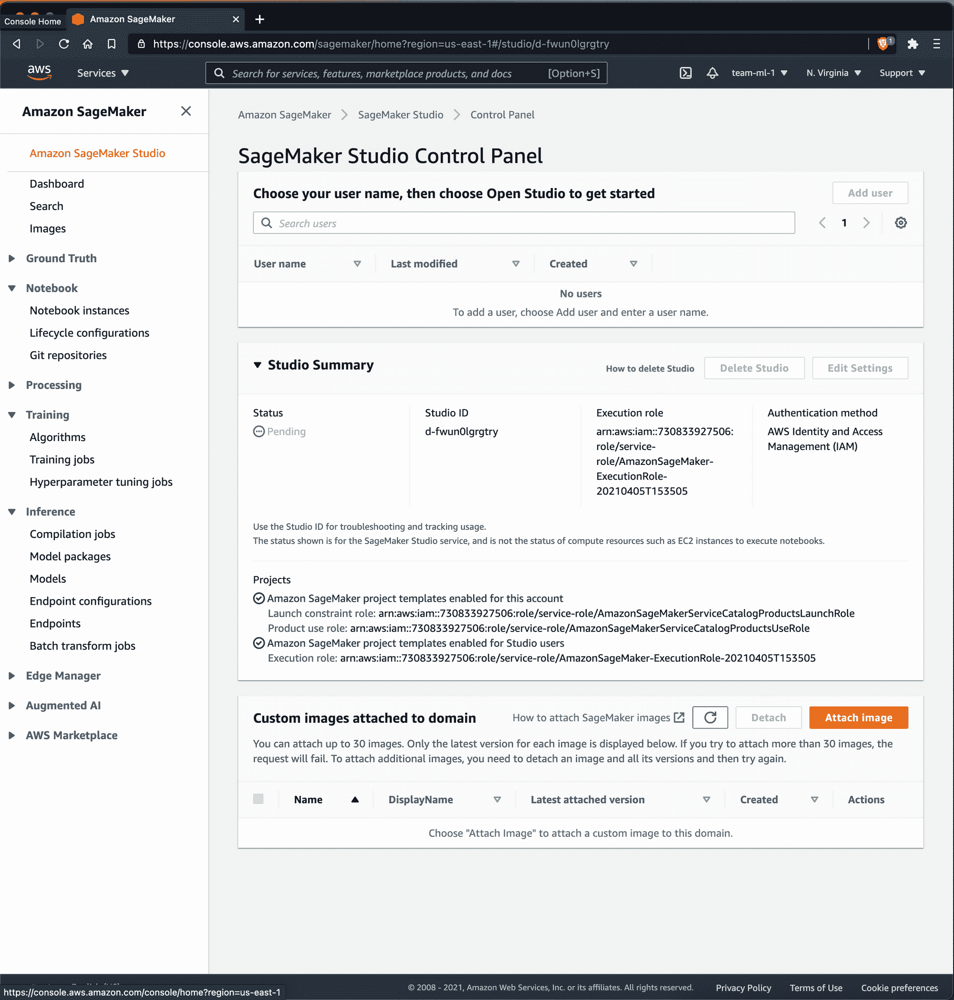
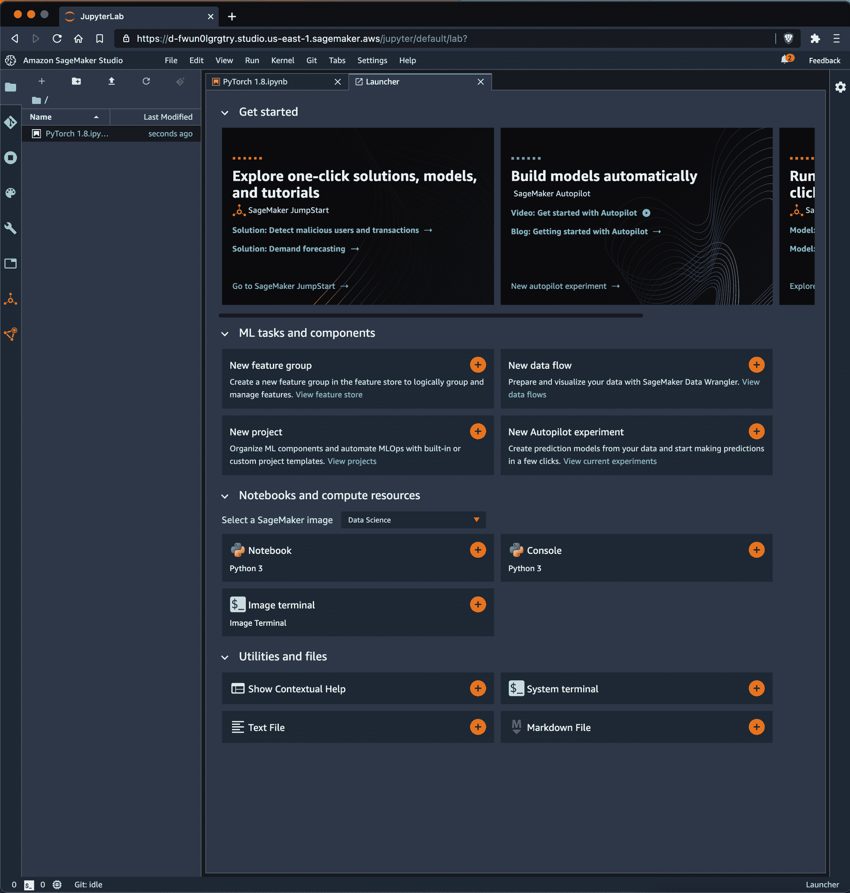
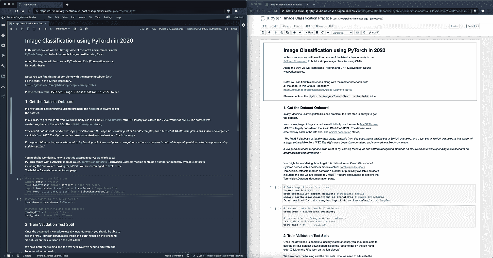
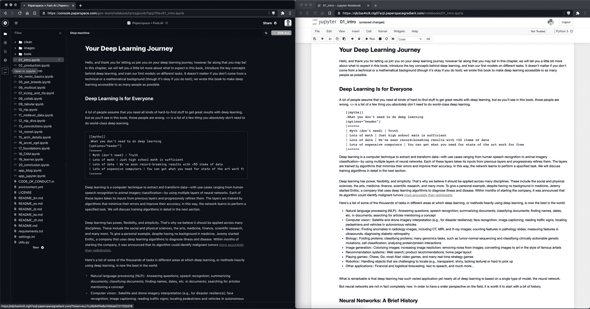
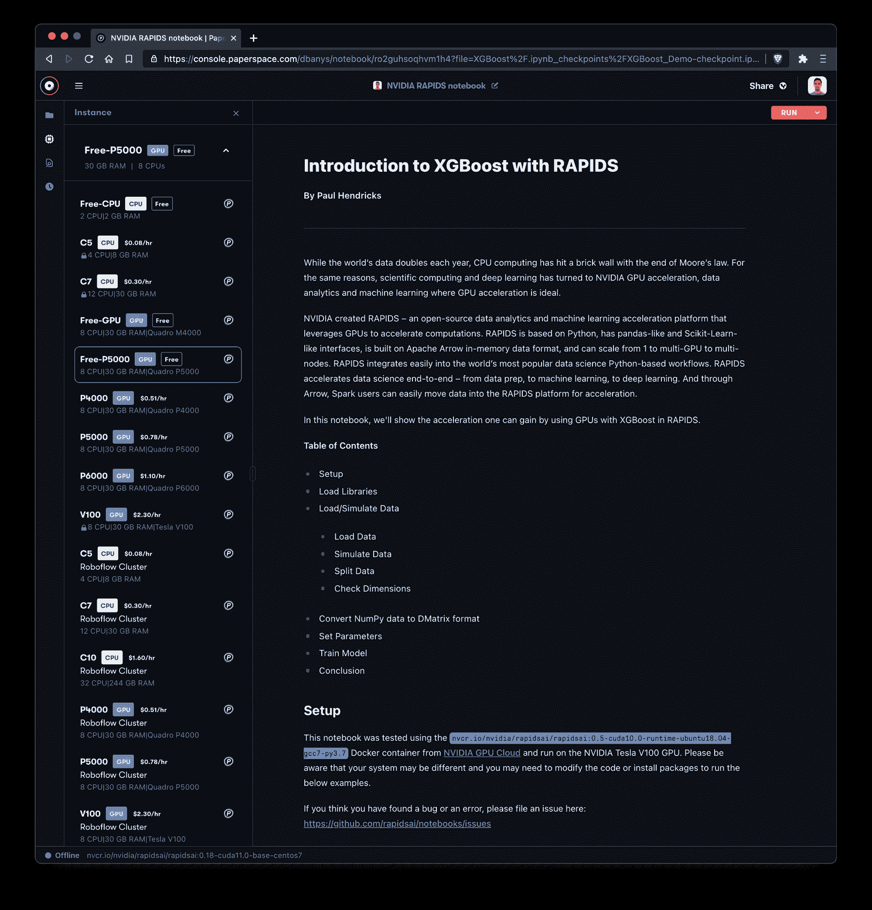

# 比较:SageMaker Studio 笔记本和 Paperspace 渐变笔记本

> 原文：<https://blog.paperspace.com/sagemaker-studio-notebooks-alternative-comparison/>

亚马逊 [SageMaker](https://aws.amazon.com/sagemaker/studio/) 是一个基于云的机器学习平台，与谷歌的 AI 平台和微软的 Azure 机器学习工作室竞争。

The AWS SageMaker Studio console

作为 SageMaker Studio 的一部分，AWS 提供了可以在 Jupyter 或 JupyterLab 中启动的笔记本，而无需公共资源。

一个区别是 SageMaker Studio 笔记本不同于常规的 SageMaker 笔记本实例。文档中描述的差异[是 SageMaker Studio 笔记本的启动速度快 5-10 倍，可以通过 link 共享，并很好地集成到 SageMaker studio 的其他部分，在那里它们可以利用共享存储和其他资源。](https://docs.aws.amazon.com/sagemaker/latest/dg/notebooks-comparison.html)

让我们看看 SageMaker Studio 笔记本的优缺点，然后看看它们与 Paperspace 渐变笔记本的对比。

# TL；博士；医生

SageMaker Studio 笔记本是对旧 SageMaker 笔记本的重大改进。Studio 简化了访问控制和共享(允许您授权 SSO 访问笔记本资源)，并提供了一种通过 SageMaker Studio 为用户创建共享数据资源的方法。

也就是说，来自 Paperspace 的 Gradient 笔记本电脑提供了几乎相同的生产级(就笔记本电脑可以说是生产级)可靠性，但在协作、实例选择、计量定价简单性等方面更易于使用。

SageMaker Studio 笔记本电脑最适合那些已经购买了 SageMaker 并且对笔记本电脑供应和访问有公司要求的用户。渐变笔记本更适合希望完成快速探索和协作并尽快启动和运行的团队。

# pagemaker studio 笔记本简介

亚马逊在 2017 年推出了 SageMaker，为需要完全托管环境来完成机器学习任务的机器学习工程师提供一站式商店。

SageMaker Studio Notebook Launcher

SageMaker Studio 是 SageMaker 的一部分，专注于构建和训练 ML 模型。正如[文档](https://docs.aws.amazon.com/sagemaker/latest/dg/studio.html)所描述的，SageMaker Studio 用于在 Jupyter 笔记本上建立和训练模型，部署和建模它们的预测，然后跟踪和调试 ML 实验。

AWS 对 SageMaker Studio 笔记本电脑进行了如下描述:

> 下一代 SageMaker 笔记本电脑包括 AWS 单点登录(AWS SSO)集成、快速启动时间和单击共享。

SageMaker 可惜没有宣传的那么简单。第一次开始非常困难——无论是在提供资源还是添加合作者方面。

我们建议，如果您确实在探索 SageMaker Studio 笔记本，请确保您的 AWS 权限足够大，可以创建您不可避免地需要的所有资源！

# 特征比较

让我们来看看这两家笔记本电脑提供商的一些共同特点。对于新用户来说，最引人注目的比较点是 SageMaker 只需要一张信用卡和一个 AWS 实例就可以启动一个笔记本。

与此同时，Gradient 将允许您使用自由层 CPU 和 GPU 实例，无需信用卡即可开始使用。

由于可以选择拥有公共(只读)笔记本以及可能被分叉的笔记本，因此*在 Gradient 上与其他用户共享*笔记本也更加简单。

|  | aws pagemaker studio 笔记本 | 图纸空间渐变笔记本 |
| --- | --- | --- |
| **成本** | 为实例付费 | 免费的 CPU 和 GPU 笔记本电脑 |
| **资源** | 任何 AWS 实例 | 任何图纸空间实例 |
| **从零要求开始** | 信用卡，GPU 批准 | 免费的 CPU 和 GPU，无需信用卡或批准 |
| **启动时间** | 计算需要几分钟来初始化 | 计算需要几秒钟来初始化 |
| **自动关机** | 不 | 是 |
| **Jupyter 笔记本选项** | 是 | 是 |
| **JupyterLab Option** | 是 | 是 |
| **从容器构建** | 是 | 是 |

# IDE vs JupyterLab

需要注意的一点是，AWS SageMaker Studio 笔记本和 Gradient 笔记本都有两种笔记本查看选项:笔记本的自定义 IDE 版本以及传统的 JupyterLab 笔记本选项。

这里我们有 SageMaker 选项:

[Left] SageMaker Studio Notebook custom IDE, [Right] Same notebook but viewed in the traditional JupyterLab IDE

这里我们有渐变选项:

[Left] Gradient Notebooks custom IDE, [Right] Same notebook but viewed in the traditional JupyterLab IDE

这是值得注意的，因为许多基于云的笔记本电脑不提供这两个选项！例如——Google Colab 和 Kaggle 内核因不允许完全访问 JupyterLab 而臭名昭著。

这两款产品都将在您需要时实现完整的 JupyterLab 体验，这太棒了——您永远不知道何时会需要访问 JupyterLab 的一些不常用功能！

# 成本比较

AWS 计量计费是出了名的复杂。SageMaker Studio 笔记本没有什么不同！

同时，在选择可用实例(包括自由实例)时，Gradient 提供了更多的易用性，这在任何 Gradient 笔记本的侧面板实例选择器中都是可能的。

此外，Gradient 还通过简单的自动关闭计时器、当(未使用的)实例运行一段时间后的电子邮件通知以及控制台中提供的简单计量账单发票来帮助您管理成本。

Gradient offers a large number of instances in the instance selector accessible from any notebook

让我们来看一些实例定价:

| 实例类型 | 图纸空间渐变笔记本 | 实例类型 | aws pagemaker studio 笔记本 |
| --- | --- | --- | --- |
| 免费(M4000) | 每小时 0.00 美元 | ml . p 3.2x 大 | 每小时 3.82 美元 |
| 免费(P5000) | 每小时 0.00 美元 | ml.p3.8xlarge | 14.688 美元/小时 |
| P4000* | 每小时 0.51 美元 | ml . p 3.16 x 大号 | 28.152 美元/小时 |
| P5000* | 每小时 0.78 美元 | ml.g4dn.xlarge | 0.7364 美元/小时 |
| P6000* | 每小时 1.10 美元 | ml.g4dn.2xlarge | 1.0528 美元/小时 |
| V100* | 每小时 2.30 美元 | ml.g4dn.4xlarge | 1.6856 美元/小时 |
| P5000 x4* | 每小时 3.12 美元 | ml.g4dn.8xlarge | 每小时 3.0464 美元 |
| P6000 x4* | 每小时 4.40 美元 | ml.g4dn.12xlarge | 5.4768 美元/小时 |
| - | - | ml.g4dn.16xlarge | 6.0928 美元/小时 |

Paperspace 的付费实例需要订阅计划，而 SageMaker 机器学习笔记本不需要订阅。梯度订购层级如下:

| 梯度订阅类型 | 费用 | 细节 |
| --- | --- | --- |
| 自由的 | 0 美元/月 | -仅免费实例
-笔记本是公共的
-限制 1 台并发笔记本
-每次会话最多限制 12 小时
- 5GB 永久存储 |
| G1(个人) | 8 美元/月 | -免费和付费实例
-私人笔记本
-限制 5 个并发笔记本
-无限会话长度
- 200GB 永久存储 |
| G2(个人) | 24 美元/月 | -免费和付费实例
-私人笔记本
-限制 10 个并发笔记本
-无限会话长度
- 1TB 永久存储 |
| T1(团队) | 12 美元/用户/月 | -免费和付费实例
-私有笔记本
-限制 10 个并发笔记本
-无限会话长度
- 500GB 持久存储
-私有团队协作
-私有托管集群 |
| T2(团队) | 49 美元/用户/月 | -免费和付费实例
-私有笔记本
-限制 50 个并发笔记本
-无限会话长度
- 1TB 持久存储
-私有团队协作
-私有托管集群 |

虽然 Gradient 需要订阅层(和信用卡)来启用付费实例，但您始终可以免费使用免费层 CPU 和 GPU 笔记本电脑。

与此同时，AWS 只需要信用卡授权来探索产品！

# 入门指南

### 使用 AWS SageMaker Studio 设置 Jupyter 笔记本

*   如果需要，创建一个 AWS 帐户
*   输入个人信息并同意条款
*   通过输入信用卡信息激活帐户
*   导航到 AWS 控制台
*   选择 pagemaker 产品
*   从 SageMaker Studio 控制面板创建一个新的 SageMaker Studio 工作区
*   加载 SageMaker Studio 后，从 SageMaker Studio 小程序中启动一个新的笔记本

### 在图纸空间渐变中设置 Jupyter 笔记本

若要开始使用渐变笔记本:

*   创建一个 Paperspace 帐户([链接](https://console.paperspace.com/signup))
*   导航到渐变>笔记本，并选择创建笔记本
*   输入笔记本的名称、运行时(可选)，并选择一个实例
*   如果你选择了一个自由的 CPU 或自由的 GPU 实例，选择开始笔记本，就是这样！(付费实例需要信用卡。)
*   *注意:Paperspace 提供对自由层 CPU 和 GPU 支持的笔记本电脑的无限制使用*

# 启动时间

任何云提供商都需要一些时间来启动 CPU 或 GPU 实例。AWS SageMaker Studio 需要很长时间进行配置，可能需要 5 分钟左右，而 Paperspace 大约需要 30 秒。请注意，相对于 SageMaker 上提供的普通笔记本实例，AWS 最近减少了 SageMaker Studio 笔记本的启动时间。

# 支持

众所周知，很难获得 AWS 的支持。与此同时，Paperspace 拥有一支出色的支持团队，提供基于票证的支持，平均响应时间为几个小时。

# 结论

您或您的公司很可能已经在使用 AWS 生态系统中的资源。不幸的是，这并没有让在 AWS SageMaker 上开始使用笔记本变得更加容易。

您仍然需要为您和您的队友创建一个 SageMaker Studio 工作区。您需要通过 IAM 提供实例以供您的笔记本使用，并且您需要为您希望能够访问您正在创建的笔记本资源的任何人创建 IAM 角色。

也就是说，一旦你在 AWS SageMaker Studio 中设置了笔记本，这肯定是对 AWS 旧笔记本功能的改进，它主要只是 JupyterLab 的托管版本。现在，您可以从 AWS(如 S3)连接其他资源，这很有用，尽管在我们的测试中，我们无法正确集成。

如果您重视易用性而不是企业级访问控制和资源管理，那么 Paperspace Gradient 是一个不错的选择。Gradient 将帮助您和您的团队在各种资源上设置和运行——比 AWS 快得多，但代价是配置选项更少。

这是在一般情况下使用 AWS 产品时的一个常见问题——因此，请确保了解风险和好处，并做出最适合您团队当前需求的选择！