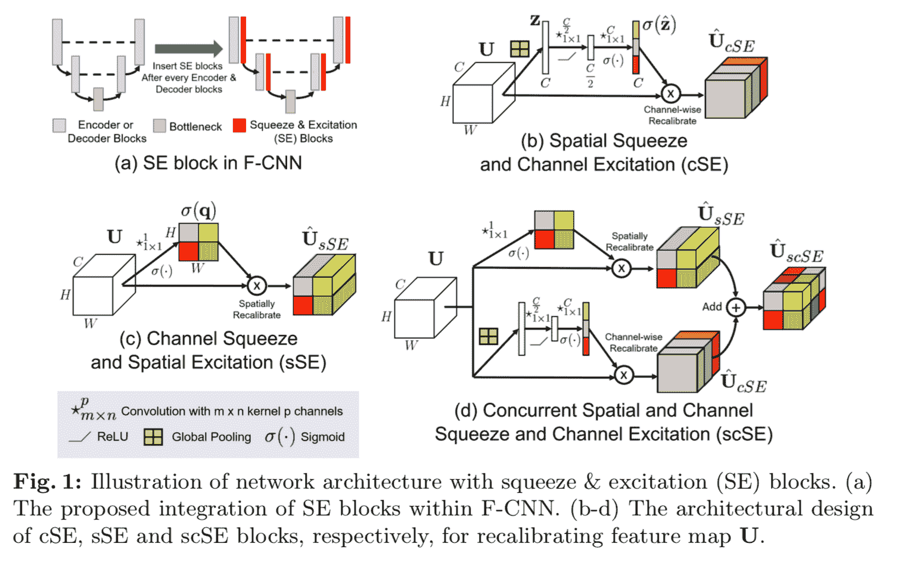
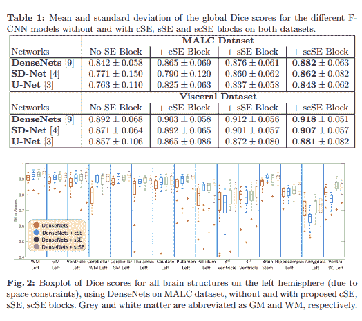
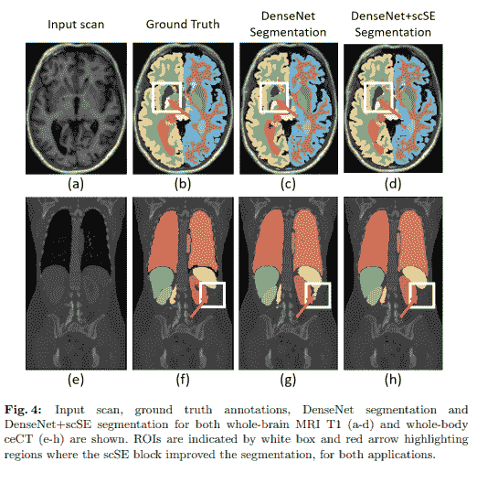

# 并行空间和信道挤压与激发(scSE)网络

> 原文：<https://blog.paperspace.com/scse-nets/>

从一开始，挤压和激励网络就是计算机视觉中应用注意力机制的重要方法。然而，它们确实有某些缺点，这些缺点已经被其他研究人员以某种形式不断地解决了。在这篇文章中，我们将谈论 Roy 等人接受的一篇这样的论文。艾尔。题目为“ [**全卷积网络中并发空间和信道压缩&激励**](https://arxiv.org/abs/1803.02579) ”。该论文围绕将空间注意力分支引入挤压和激发模块，该模块类似于卷积块注意力模块(CBAM)，然而，在聚集通道和空间注意力的方式上略有不同。

事不宜迟，让我们深入研究 scSE 的动机，然后分析该模块的结构设计，最后通过研究观察到的结果及其 PyTorch 代码进行总结。

### 目录

1.  动机
2.  scSE 模块
3.  密码
4.  结果
5.  结论
6.  参考

## 摘要

> 全卷积神经网络(F-CNNs)已经为大量应用建立了图像分割的最新技术。F-CNN 的架构创新主要集中在改善空间编码或网络连接以帮助梯度流。在本文中，我们探索了另一个自适应地重新校准特征图的方向，以增强有意义的特征，同时抑制弱的特征。我们从最近提出的挤压和激发(SE)模块中获得灵感，用于图像分类的特征图的通道重新校准。为此，我们介绍了用于图像分割的 SE 模块的三种变体，(I)空间压缩和通道方式激发(cSE)，(ii)通道方式压缩和空间激发(sSE)以及(iii)并行空间和通道压缩和激发(scSE)。我们将这些 se 模块有效地整合到三种不同的先进 F-CNN(dense Net、SD-Net、U-Net)中，并观察到所有架构的性能持续改善，同时对模型复杂性的影响最小。对两个具有挑战性的应用进行评估:MRI 扫描上的全脑分割和全身对比增强 CT 扫描上的器官分割。

## 动机

挤压和激励模块已经在计算机视觉领域发挥了作用。一种配备挤压和激励模块的深度卷积神经网络架构在 ImageNet 数据集上的 ILSVRC 2017 分类竞赛中获得了第一名，为进一步加强探索更多渠道注意力模块变体奠定了基础。一般来说，在关注场景中更重要的物体的范围内，挤压和激发模块或通道注意力背后的直觉在某种程度上继承了人类的视觉认知能力。在这篇论文中，作者受到启发，利用全卷积神经网络(F-CNNs)的压缩和激励模块的高性能进行图像分类和图像分割，主要是在医学图像分割领域。由于医学图像分割也需要对空间域的关注，作者通过包括并行空间关注块来扩展 SE 的结构设计(其被表示为 *cSE* ，其中 *c* 代表“通道”，因为 SE 是通道专用激励算子)。

作为挤压和激发通道描述符成功的必然结果，作者首先提出了 se 模块的替代版本，它沿通道“挤压”并在空间上“激发”，称为 ***空间 SE(sSE)****。随后，作者引入了一种传统 SE 和 sSE 块的混合，称为**并发空间和通道 SE 块(scSE)** ，它们“沿着通道和空间分别重新校准特征图，然后组合输出”。目标是基本上最大限度地将信息传播到注意机制中，以便焦点可以同时处于像素级和通道级。虽然 scSE 块在本文中主要是针对全卷积神经网络(CNN ),如 UNets 和 DenseNets 介绍的，但是该方法可以应用/插入到传统的基于 CNN 的架构中，如残差网络。该论文还深入研究了这些基于 se 的块在医学图像分割的情况下的作用，这是提供空间每像素级关注的主要动机，因为在医学图像分割的情况下，由于数据的通常格式，每像素信息与通道级信息相比极其重要。dicom)。*

## *scSE 模块*

**

*这里有三个组件需要分析，如上面摘自论文的图表所示:*

*   *空间压缩和通道激发(cSE)*
*   *通道挤压和空间激发(sSE)*
*   *并行空间和信道挤压和信道激发(scSE)*

### *空间压缩和通道激发(cSE)*

*本质上，这表示传统的挤压和激励模块。SE 模块由 3 个模块组成，即挤压模块、激励模块和缩放模块。让我们假设此 *cSE* 块的输入是\mathbb{R}^{N 中的四维特征映射张量$ \ textbf { x } \其中$N \ast C \ast H \ast W$表示批量大小、通道数和空间维度(分别为各个特征映射/通道的高度和宽度)，然后，*挤压模块*将$ \ textbf { x } \减少到\mathbb{R}^{N 中的$ \ tilde { \ textbf { x } } \ 1 这样做是为了确保与在全尺寸输入张量$\textbf{X}$上计算注意力权重相比，计算复杂度显著降低。此外，$\tilde{\textbf{X}}$作为输入被传递到*激励模块*，该模块将这个简化的张量传递通过多层感知器(MLP)瓶颈。这将输出合成张量$\hat{\tilde{\textbf{X}}}$与$\tilde{\textbf{X}}$的维数相同。最后，*缩放模块*将 sigmoid 激活单元应用于该张量$\hat{\tilde{\textbf{X}}}$然后该张量按元素乘以原始输入张量$\textbf{X}$。*

*为了更详细地理解挤压和激励网络的功能，请阅读我们关于 SENets 的[详细文章。](https://blog.paperspace.com/channel-attention-squeeze-and-excitation-networks/)*

### *通道挤压和空间激发(sSE)*

*与 *cSE* 、 *sSE* 互补，本质上是一种与它的对应物相反的东西，它在空间维度上减少特征张量，在通道维度上激发。与之相反，sSE 挤压通道，在空间维度上激发。类似于 cSE，我们假设这个 cSE 块的输入是一个 4 维特征映射张量$ \ textbf { x } \ in \mathbb{r}^{n \ ast c \ ast h \ ast w } $。首先，输入张量$\textbf{X}$通过将$C$通道减少到 1 的 2D 逐点卷积核被减少到\mathbb{R}^{N 中的$\tilde{\textbf{X}}。最后，该压缩张量$\tilde{\textbf{X}}$通过 sigmoid 激活单元，然后与原始输入张量$\textbf{X}$逐元素相乘。*

### *并行空间和信道挤压和信道激发(scSE)*

*简单来说， *scSE* 是之前讨论的 *cSE* 和 *sSE* 区块的合并。首先，类似于 cSE 和 sSE，让我们假设这个 cSE 块的输入是一个 4 维特征映射张量$ \ textbf { x } \ in \mathbb{r}^{n \ ast c \ ast h \ ast w } $。这个张量$\textbf{X}$并行通过 cSE 和 sSE 块。然后将两个结果输出逐元素相加，以提供最终输出。然而，有一些扩展，研究人员和用户都发现，计算两个张量上的元素最大值也是一种理想的策略，而不是进行元素求和，并且与作者在论文中描述的原始 scSE 变体相比，提供了有竞争力和可比较的结果。*

## *密码*

*下面的片段提供了用于 scSE、cSE 和 sSE 块的 PyTorch 代码，这些代码可以很容易地插入到计算机视觉领域中的任何传统卷积神经网络架构的块中。*

```py
*`import torch
import torch.nn as nn
import torch.nn.functional as F

class ChannelSELayer(nn.Module):
    """
    Re-implementation of Squeeze-and-Excitation (SE) block described in:
        *Hu et al., Squeeze-and-Excitation Networks, arXiv:1709.01507*
    """

    def __init__(self, num_channels, reduction_ratio=2):
        """
        :param num_channels: No of input channels
        :param reduction_ratio: By how much should the num_channels should be reduced
        """
        super(ChannelSELayer, self).__init__()
        num_channels_reduced = num_channels // reduction_ratio
        self.reduction_ratio = reduction_ratio
        self.fc1 = nn.Linear(num_channels, num_channels_reduced, bias=True)
        self.fc2 = nn.Linear(num_channels_reduced, num_channels, bias=True)
        self.relu = nn.ReLU()
        self.sigmoid = nn.Sigmoid()

    def forward(self, input_tensor):
        """
        :param input_tensor: X, shape = (batch_size, num_channels, H, W)
        :return: output tensor
        """
        batch_size, num_channels, H, W = input_tensor.size()
        # Average along each channel
        squeeze_tensor = input_tensor.view(batch_size, num_channels, -1).mean(dim=2)

        # channel excitation
        fc_out_1 = self.relu(self.fc1(squeeze_tensor))
        fc_out_2 = self.sigmoid(self.fc2(fc_out_1))

        a, b = squeeze_tensor.size()
        output_tensor = torch.mul(input_tensor, fc_out_2.view(a, b, 1, 1))
        return output_tensor

class SpatialSELayer(nn.Module):
    """
    Re-implementation of SE block -- squeezing spatially and exciting channel-wise described in:
        *Roy et al., Concurrent Spatial and Channel Squeeze & Excitation in Fully Convolutional Networks, MICCAI 2018*
    """

    def __init__(self, num_channels):
        """
        :param num_channels: No of input channels
        """
        super(SpatialSELayer, self).__init__()
        self.conv = nn.Conv2d(num_channels, 1, 1)
        self.sigmoid = nn.Sigmoid()

    def forward(self, input_tensor, weights=None):
        """
        :param weights: weights for few shot learning
        :param input_tensor: X, shape = (batch_size, num_channels, H, W)
        :return: output_tensor
        """
        # spatial squeeze
        batch_size, channel, a, b = input_tensor.size()

        if weights is not None:
            weights = torch.mean(weights, dim=0)
            weights = weights.view(1, channel, 1, 1)
            out = F.conv2d(input_tensor, weights)
        else:
            out = self.conv(input_tensor)
        squeeze_tensor = self.sigmoid(out)

        # spatial excitation
        squeeze_tensor = squeeze_tensor.view(batch_size, 1, a, b)
        output_tensor = torch.mul(input_tensor, squeeze_tensor)
        return output_tensor

class ChannelSpatialSELayer(nn.Module):
    """
    Re-implementation of concurrent spatial and channel squeeze & excitation:
        *Roy et al., Concurrent Spatial and Channel Squeeze & Excitation in Fully Convolutional Networks, MICCAI 2018, arXiv:1803.02579*
    """

    def __init__(self, num_channels, reduction_ratio=2):
        """
        :param num_channels: No of input channels
        :param reduction_ratio: By how much should the num_channels should be reduced
        """
        super(ChannelSpatialSELayer, self).__init__()
        self.cSE = ChannelSELayer(num_channels, reduction_ratio)
        self.sSE = SpatialSELayer(num_channels)

    def forward(self, input_tensor):
        """
        :param input_tensor: X, shape = (batch_size, num_channels, H, W)
        :return: output_tensor
        """
        #output_tensor = torch.max(self.cSE(input_tensor), self.sSE(input_tensor))
        output_tensor = self.cSE(input_tensor) + self.sSE(input_tensor)
        return output_tensor`*
```

## *结果*

*本文中提供的以下结果展示了在用于医学图像分割的 MALC 和内脏数据集上的不同 F-CNN 架构(如 U-Net、SD-Net 和 DenseNets)中使用的 scSE 块的功效。*

****

## *结论*

*scSE 模块是第一个成功展示在 F-CNNs 模型中应用通道方式和每像素注意力算子的重要性和益处的方法。展示的结果是有希望的，但是，由于应用了 sSE 分支，计算量相当大。然而，这归结于用户在自己的数据集上尝试，以了解与增加的计算开销相比，该块在精度提升方面的实际效率。*

## *参考*

1.  *[全卷积网络中并发的空间和信道“压缩&激励](https://arxiv.org/pdf/1803.02579.pdf)*
2.  *[SCS 码](https://github.com/ai-med/squeeze_and_excitation/blob/master/squeeze_and_excitation/squeeze_and_excitation.py)*
3.  *[引导注意力和挤压激励网络(SENet)，Paperspace 博客](https://blog.paperspace.com/channel-attention-squeeze-and-excitation-networks/)*