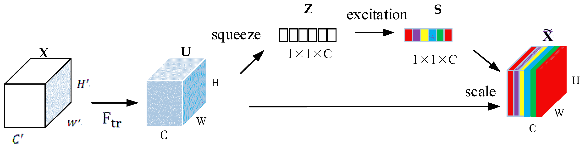
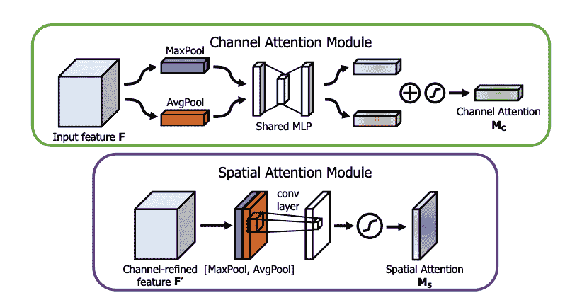
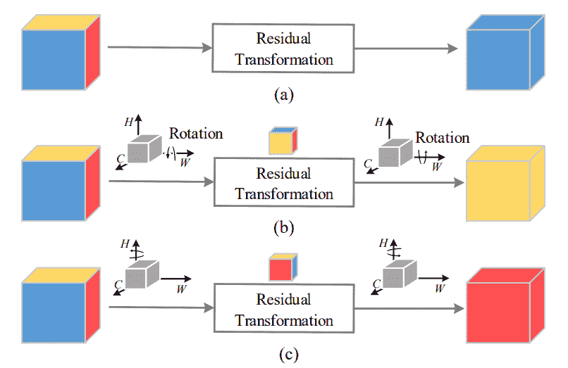
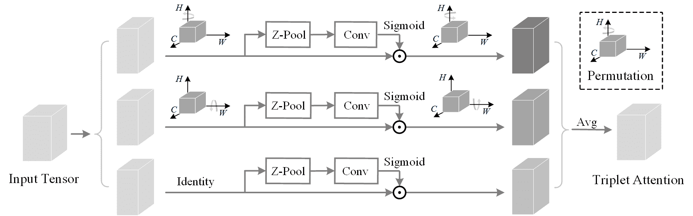
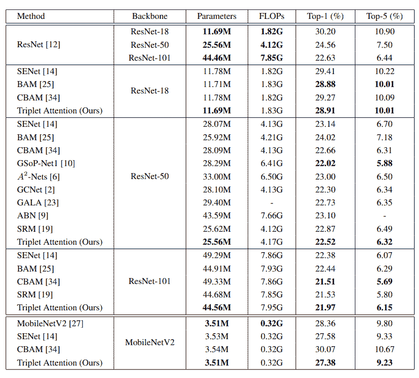
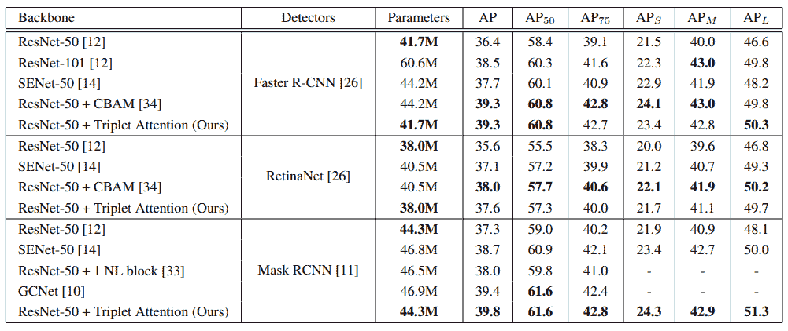
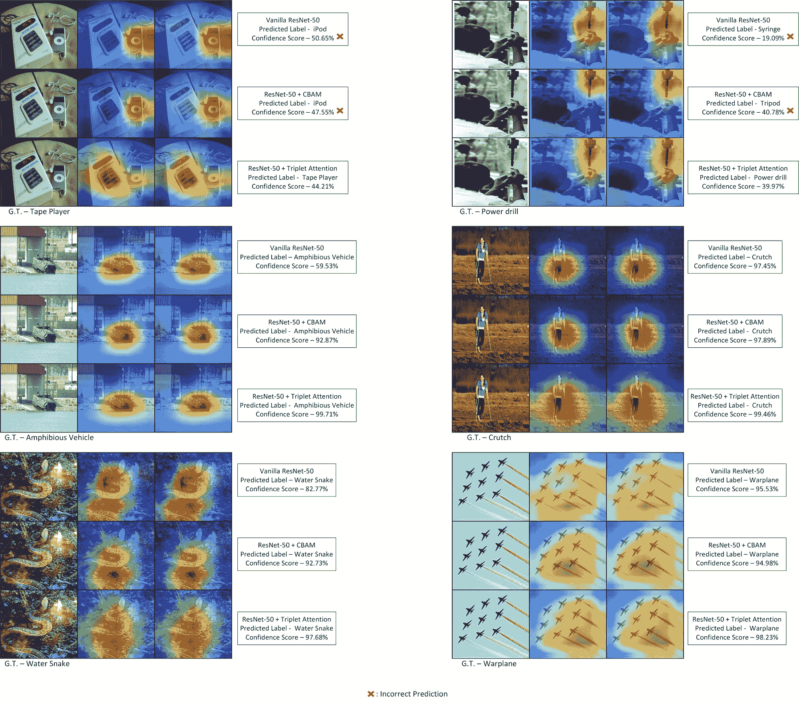

# 三重注意解释(WACV 2021)

> 原文：<https://blog.paperspace.com/triplet-attention-wacv-2021/>

在计算机视觉领域，注意力机制已经成为一个家喻户晓的名字。无论是生成建模、图像分类、对象检测还是任何下游视觉任务，结合定制的或通用的注意机制对于为手边的任务制定成功的处方已经变得势在必行。

最近注意力机制的新颖设计是基于基本的[挤压和激发模块](https://arxiv.org/abs/1709.01507)。其中包括[全球上下文网络](https://arxiv.org/abs/1904.11492)、[卷积块关注模块](http://openaccess.thecvf.com/content_ECCV_2018/html/Sanghyun_Woo_Convolutional_Block_Attention_ECCV_2018_paper.html)、[瓶颈关注模块](http://bmvc2018.org/contents/papers/0092.pdf)、[高效信道关注](https://arxiv.org/abs/1910.03151)等等。

在本文中，我们将介绍一种主要受 CBAM 启发的通道和空间注意力的新结构形式，称为[三联注意力](https://arxiv.org/abs/2010.03045)(在 WACV 2021 上接受)。在讨论三联注意力背后的基本直觉之前，我们将首先对 CBAM 的通道和空间注意力做一个快速的概述。此外，我们将查看本文中给出的结果，并提供模块的 PyTorch 代码，然后通过触及一些缺点来结束我们的讨论。

## 目录

*   抽象概述
*   通道和空间注意
    1.  很晚了
    2.  CBAM
*   当前注意机制的缺点
*   跨维度交互作用
*   三重注意
*   PyTorch Code
*   结果
    1.  图像分类
    2.  MS-COCO 上的目标检测
    3.  grabcad
*   缺点
*   参考

## 抽象概述

> 我们的三元组注意力模块旨在捕捉跨维度交互，因此与上述方法相比，能够以合理的可忽略的计算开销提供显著的性能增益，在上述方法中，它们都没有考虑到跨维度交互，同时允许某种形式的维度减少，这对于捕捉跨通道交互是不必要的。

## 通道和空间注意

> 注意:这是非常可取的，通过我的计算机视觉注意机制系列的其他职位，为这个主题有一个良好的基础。链接[此处](https://blog.paperspace.com/author/diganta/)。


注意力机制是一个简单而直观的想法，来源于人类的视觉感知。表征学习背后的基本思想是从输入中发现或提取区别特征，该区别特征将特定对象与不同类型或类别的对象区分开来。在人类视觉感知水平上，这可以与人类确定唯一描述特定对象的特征相关联。例如，眼睛、鼻子、嘴唇和耳朵是描述性特征，表明聚焦的对象是人脸。

在计算机视觉中使用的深度神经网络中，注意机制通常涉及通道或空间注意(或两者兼有)。简而言之，通道注意本质上用于在张量中加权每个特征图/通道，而空间注意通过加权单个特征图中的每个像素来提供每个特征图级别的上下文。让我们来看看这种形式的注意机制的两个突出的例子。

### 很晚了



[挤压和激励网络](https://blog.paperspace.com/channel-attention-squeeze-and-excitation-networks/) (SENets)有一个通道注意机制，该机制主要由三部分组成:挤压模块、激励模块和缩放模块。

挤压块负责使用全局平均池(GAP)将输入特征映射$(C \乘以 H \乘以 W)$减少到单个像素，同时保持通道数量不变$(C \乘以 1 \乘以 1)$。然后，*压缩的*张量被传递到激励块，这是一个多层感知器(MLP)瓶颈，负责学习通道注意力权重。最后，这些奇异权重通过 sigmoid 激活，然后按元素乘以非调制输入张量中的相应通道。

### CBAM



卷积块注意模块(CBAM)从 SENet 和 [SCA-CNN](https://arxiv.org/abs/1611.05594) 中获得灵感，提出了一种新颖有效的注意机制，该机制连续(按此顺序)结合了通道和空间注意的思想。CBAM 的频道关注模块与 SENet 的相同。唯一的警告是，它不仅通过 GAP 分解输入张量，还通过 GMP(全局最大池)进行同样的操作，并在通过共享 MLP 瓶颈之前聚合两者。类似地，在空间注意模块中，它将输入张量分解为两个通道，这两个通道是所有特征图的最大汇集和平均汇集特征表示。这个双通道张量通过卷积层，卷积层将其简化为单通道。因此，该单通道张量在与来自通道注意模块的输出张量的每个通道按元素相乘之前通过 sigmoid 激活。

## 当前注意机制的缺点

尽管这些注意力机制展示了令人难以置信的性能提升，但它们并非没有缺陷。这些包括(但不限于)以下内容:

1.  **降维** -大多数频道关注机制涉及一种 MLP 瓶颈状结构，用于控制该结构的参数复杂性，但反过来也会导致显著的信息丢失。
2.  **缺乏空间注意**——许多新颖的注意机制被提出来，忽略了拥有空间注意机制的需要和优点，只配备了通道注意机制，从而降低了整个注意机制的整体效能和表达能力。
3.  **空间和通道注意之间不相交** -通常，采用专用空间注意模块和通道注意模块的注意机制使它们保持分离和不相交，因此不允许两个模块之间的交互，这不是最佳的。
4.  **缺乏跨渠道互动** -许多关注机制在计算关注权重时不强调允许渠道与其他渠道互动，从而减少了信息传播。
5.  **效率** -大多数注意力机制以模型参数和触发器的形式增加了大量的额外计算，导致更大和更慢的架构。

## 跨维度交互作用



为了解决上述缺点，三重注意力提出了一种新颖且直观的计算注意力权重的方法，称为**跨维度交互**。跨维度交互是一个简单的想法，允许模块计算每个维度相对于其他维度的注意力权重，即$ C \乘以 W$ 、$ C \乘以 H$、以及$ H \乘以 W$。这基本上允许它在单个模块中计算空间和通道注意力。通过简单地置换输入张量维度来实现跨维度交互，然后进行简单的残差变换来生成注意力权重。因此，这允许注意力机制对输入张量中的每个维度形成强依赖性，这反过来对于在特征图上的注意力区域上提供更紧密的界限是至关重要的。让我们来理解三联注意力是如何实现跨维度互动的。

# 三重注意



顾名思义，三联注意力是一个三分支结构，其中每个分支负责计算和应用输入张量的三个维度中的两个维度的注意力权重。顶部的两个分支计算针对两个空间维度中的每一个维度的通道注意力权重，而底部的分支负责计算与 [CBAM](https://blog.paperspace.com/attention-mechanisms-in-computer-vision-cbam/) 中呈现的相同的简单空间注意力。

在上面的两个分支中，输入张量首先被旋转以改变维度，之后它经历第零个池(Z-Pool)操作符，该操作符通过连接该维度上张量的平均池化和最大池化特征将第零个维度减少到两个。该结果张量进一步通过单个空间卷积层，这将零维进一步减少到一维，之后该输出通过 sigmoid 激活。然后，最终输出按元素与置换输入相乘，然后旋转回原始维度(与输入的维度相同)。在对所有三个分支完成这一操作后，通过简单的平均将三个结果张量聚合，这形成了三重注意力的输出。

因此，三重注意结合了跨维度交互，这消除了大多数注意机制结构中普遍存在的信息瓶颈和维度减少。随后，由于三重注意机制不包含 MLP 结构，而是包含三个卷积层，因此该模块的参数复杂度非常低，如下表所示。

| 注意机制 | 因素 | 开销(ResNet-50) |
| --- | --- | --- |
| 如果 | 2C² /r | 2.514 米 |
| CBAM | 2C² /r + 2k² | 2.532 米 |
| 嘣 | C/r(3C + 2k² C/r + 1) | 0.358 米 |
| 车底距地高(Ground Clearance) | 2C² /r + C | 2.548 米 |
| 三重注意 | 6k² | 0.0048 米 |

## PyTorch Code

```py
import torch
import math
import torch.nn as nn
import torch.nn.functional as F

class BasicConv(nn.Module):
    def __init__(self, in_planes, out_planes, kernel_size, stride=1, padding=0, dilation=1, groups=1, relu=True, bn=True, bias=False):
        super(BasicConv, self).__init__()
        self.out_channels = out_planes
        self.conv = nn.Conv2d(in_planes, out_planes, kernel_size=kernel_size, stride=stride, padding=padding, dilation=dilation, groups=groups, bias=bias)
        self.bn = nn.BatchNorm2d(out_planes,eps=1e-5, momentum=0.01, affine=True) if bn else None
        self.relu = nn.ReLU() if relu else None

    def forward(self, x):
        x = self.conv(x)
        if self.bn is not None:
            x = self.bn(x)
        if self.relu is not None:
            x = self.relu(x)
        return x

class ZPool(nn.Module):
    def forward(self, x):
        return torch.cat( (torch.max(x,1)[0].unsqueeze(1), torch.mean(x,1).unsqueeze(1)), dim=1 )

class AttentionGate(nn.Module):
    def __init__(self):
        super(AttentionGate, self).__init__()
        kernel_size = 7
        self.compress = ZPool()
        self.conv = BasicConv(2, 1, kernel_size, stride=1, padding=(kernel_size-1) // 2, relu=False)
    def forward(self, x):
        x_compress = self.compress(x)
        x_out = self.conv(x_compress)
        scale = torch.sigmoid_(x_out) 
        return x * scale

class TripletAttention(nn.Module):
    def __init__(self, no_spatial=False):
        super(TripletAttention, self).__init__()
        self.cw = AttentionGate()
        self.hc = AttentionGate()
        self.no_spatial=no_spatial
        if not no_spatial:
            self.hw = AttentionGate()
    def forward(self, x):
        x_perm1 = x.permute(0,2,1,3).contiguous()
        x_out1 = self.cw(x_perm1)
        x_out11 = x_out1.permute(0,2,1,3).contiguous()
        x_perm2 = x.permute(0,3,2,1).contiguous()
        x_out2 = self.hc(x_perm2)
        x_out21 = x_out2.permute(0,3,2,1).contiguous()
        if not self.no_spatial:
            x_out = self.hw(x)
            x_out = 1/3 * (x_out + x_out11 + x_out21)
        else:
            x_out = 1/2 * (x_out11 + x_out21)
        return x_out
```

## 结果

### 图像分类



### MS-COCO 上的目标检测



### grabcad



如上所示，三重注意机制可以在不同和困难的任务上提供非常可观的结果，如 MS-COCO 上的 ImageNet 分类和对象检测，同时在参数复杂性方面非常轻量级。更重要的是，它在 GradCAM 和 GradCAM++图上提供了更好、更紧密的 ROI 界限，这对注意力机制的可解释性极其重要。由于跨维度的相互作用，三重注意可以发现更小范围的精细对象。

## 缺点

1.  尽管该论文介绍了一种极其轻量和高效的注意机制，但由此导致的 FLOPs 增加仍然很高。
2.  通过简单平均来聚集三重注意力的三个分支中的每一个分支的注意力权重的方式可能是次优的，并且可以被显著地改进。

## 参考

1.  [旋转出席:卷积三联体注意模块](https://arxiv.org/abs/2010.03045)
2.  [正式实施三联关注](https://github.com/LandskapeAI/triplet-attention)
3.  [挤压和激励网络](https://arxiv.org/abs/1709.01507)
4.  [GCNet:非局域网络与压缩激发网络相遇并超越](https://arxiv.org/abs/1904.11492)
5.  [CBAM:卷积块注意模块](https://openaccess.thecvf.com/content_ECCV_2018/html/Sanghyun_Woo_Convolutional_Block_Attention_ECCV_2018_paper.html)
6.  [BAM:瓶颈关注模块](http://bmvc2018.org/contents/papers/0092.pdf)
7.  [ECA-Net:深度卷积神经网络的高效信道关注](https://arxiv.org/abs/1910.03151)