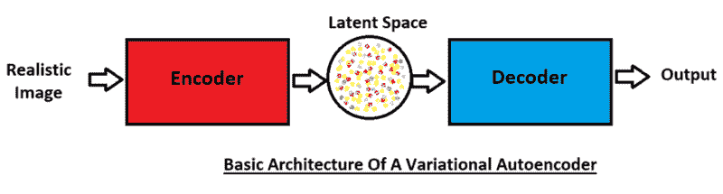
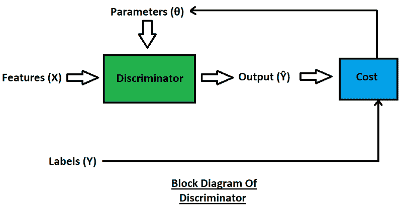
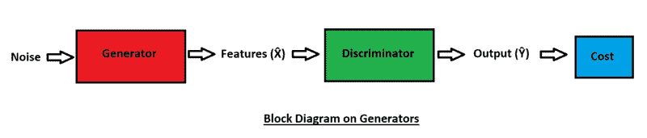
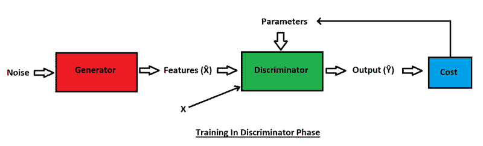
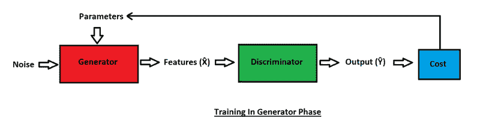

# 生成对抗网络(GANs)完全指南

> 原文：<https://blog.paperspace.com/complete-guide-to-gans/>

机器学习、深度学习和神经网络方面的技术进步和发展已经引领了一个革命性的时代。创建和复制照片、文本、图像和图片仅仅基于一些例子，对一些人来说可能是令人震惊的，对另一些人来说可能是不可思议的。

我们现在正处于一个技术如此先进的阶段，深度学习和神经网络甚至可以从零开始生成逼真的人脸。生成的人脸不属于任何人，无论是活着的还是死去的，然而它们却惊人地逼真。

对于这些成就，我们必须感谢一个特殊的深度学习网络，即生成对抗网络(GAN)，这是本文的主题。让我们简要浏览一下目录，以理解我们将涉及的主要主题。

### 目录

*   甘斯简介
*   理解生成模型和判别模型
*   生成模型的类型
    1。变分自动编码器(VAE)2。生成对抗网络
*   鉴别器
*   发电机
*   对培训的深入理解
*   应用程序
*   结论

## 甘斯简介

生成对抗网络(GANs)是由 Ian Goodfellow 和他的队友在 2014 年开发的。GANs 是一种独特的深度神经网络，可以生成与训练数据相似的新数据。GANs 有两个主要模块，它们相互竞争产生有远见的创作。在本文中，我们将详细了解 gan 是如何工作的。

称为*发生器*和*鉴别器*的两个模块之间竞争的更复杂的细节，将在本文后面的章节中进一步讨论。首先，让我们了解一下在科技公司中，生成性对抗网络(GANs)看到的各种现实生活中的用例，强调它们在今天的相关性。

Adobe 将 GANs 用于下一代 Photoshop。Google 利用 GANs 的能力来生成文本和图像。IBM 有效地使用 GANs 进行数据扩充。Snapchat 将它们用于高效的图像过滤器，迪士尼用于超高分辨率。天然气水合物具有多种用途，在当今的世界市场上具有许多优势，其需求在未来几年只会增加。

在本文中，我们的主要目的是直观地理解生成敌对网络的概念。除了覆盖 GANs 的理论方面，我们还将考虑 PyTorch 代码用于每个生成器和鉴别器模型的构建。

## 理解生成模型和判别模型

机器学习和深度学习中的判别模型起到了分类器的作用。它们通常用于区分两个类别或一组标签。这类任务的几个例子包括区分狗和猫，区分各种狗的品种，或分类各种水果(如苹果、葡萄、橙子等)。).

另一方面，生成模型的工作方式不同于它们的判别模型。在生成模型中，您考虑随机样本(通常是噪声)并从该噪声生成新的真实图像。举个例子，一个生成模型可以从真实的狗的图像中学习，然后创建自己的假的——然而是真实的——狗的图像。有两种主要类型的生成模型，我们将在下一节中进一步讨论。

## 生成模型的类型

### 可变自动编码器



Image By Author

有两种主要类型的生成模型，即变分自动编码器和生成对抗网络。虽然我们在本文中的主要焦点仍然是 GANs，但是我们也将在这一节中简要地理解变分自动编码器的工作。

变型自动编码器还利用编码器和解码器，它们通常是独立的神经网络。如上面的框图所示，一个真实的图像通过编码器。编码器的主要功能是在潜在空间中以矢量的形式表示这些真实的图像。

解码器接受这些解释并产生真实图像的副本。最初，产生的图像质量可能很低，但是一旦解码器完全起作用，编码器就可以完全被忽略。可以在潜在空间中引入一些随机噪声样本，并且解码器将生成逼真的图像。

### 生成对抗网络


Image By Author

这就把我们带到了本文的主要焦点:GANs。首先，让我们对 GANs 有一个直观的了解，并准确理解这些深度学习算法是如何工作的。

GAN 中的生成器和鉴别器相互竞争(因此有术语“对抗性”)。生成器就像一个小偷，其目的是复制和产生真实的数据来欺骗鉴别者；生成器想要绕过它将执行的大量检查。另一方面，鉴别器的作用是充当警察，捕捉生成器出售的人工生成的数据。鉴别器试图捕捉异常并检测由发生器产生的假图像。

换句话说，发生器接受一个嘈杂的输入，并试图从中产生逼真的图像。尽管一开始它非常失败，但它慢慢学会了如何制造更有说服力的赝品。鉴别器块然后试图确定哪些图像是真实的，哪些是伪造的。因此，这些模型相互竞争，直到达到“完美”的程度。

当生成器开始生成多个高质量、逼真的图像并绕过鉴别器的测试阶段时，就达到了完美的程度。一旦图像成功逼真，鉴别器就不能区分真实图像和伪造图像。此后，您可以单独使用生成器，并且不再需要鉴别器。

因为我们已经知道了 GANs 主要由这两个构件组成，即生成器和鉴别器，现在让我们在接下来的章节中更详细地了解它们。总之，这两个模块是独立的神经网络:

*   “生成器”是学习生成看起来逼真的假图像(或数据点)的神经网络，当输入到鉴别器网络时，可以作为真实图像传递。
*   “鉴别器”是区分真实和虚假图像(或任何类型的数据)的神经网络。鉴别器在生成器的学习过程中起着重要的作用。

## 鉴别器



Image By Author

鉴别器的作用是区分真假图像。鉴别器基本上充当分类器。

例如，让我们考虑一个分类器，它的作用是识别一个图像是否是一只狗(分类本质上是:“狗”和“不是狗”)。分类器会给我们一个介于 0 和 1 之间的值，表示它对图像是一只狗的置信度。该值越接近 1，图像是狗的概率越高，而接近 0 的值表示相反。

比如:$P(Y|X) = 0.90$。

$P(Y|X)$格式表示条件概率，其中标签$Y$的预测是在给定特征$X$的情况下做出的。以上示例中的概率 0.90 美元表示分类器 90%确信图像包含狗。可以将类似的模式应用于鉴别器，以确定(或分类)图像是真的还是假的。

继续分析鉴频器的框图，我们可以简单地确定其工作背后的方法。要素($X$)通过鉴别器传递，鉴别器充当分类器，尝试对所提供的要素进行成功预测。鉴别器预测用于计算总成本的结果($ŷ$)。

计算成本的过程非常简单，因为我们通过考虑预测产量(在这种情况下为$ŷ$)和实际结果值或标签(y 美元)来确定成本值(或相应的损失)。在成功计算成本函数之后，我们可以更新鉴别器的相应参数。当我们讨论鉴别器的训练时，我们将讨论这些阶段的确切工作。

让我们看看 PyTorch 中的一些鉴别器代码。这段代码只是一个基本的例子，可以根据用户的选择进行修改。代码参考摘自本课程关于构建基本 GANs 的[。我强烈推荐给对自己构建 GANs 感兴趣的读者。](https://www.coursera.org/learn/build-basic-generative-adversarial-networks-gans?)

```py
def get_discriminator_block(input_dim, output_dim):
    '''
    Discriminator Block
    Function for returning a neural network of the discriminator given input and output dimensions.
    Parameters:
        input_dim: the dimension of the input vector, a scalar
        output_dim: the dimension of the output vector, a scalar
    Returns:
        a discriminator neural network layer, with a linear transformation 
          followed by an nn.LeakyReLU activation with negative slope of 0.2 
          (https://pytorch.org/docs/master/generated/torch.nn.LeakyReLU.html)

    '''

    return nn.Sequential(
        nn.Linear(input_dim, output_dim),
        nn.LeakyReLU(0.2)
    )
class Discriminator(nn.Module):
    '''
    Discriminator Class
    Values:
        im_dim: the dimension of the images, fitted for the dataset used, a scalar
            (MNIST images are 28x28 = 784 so that is your default)
        hidden_dim: the inner dimension, a scalar

    '''

    def __init__(self, im_dim=784, hidden_dim=128):
        super(Discriminator, self).__init__()
        self.disc = nn.Sequential(
            get_discriminator_block(im_dim, hidden_dim * 4),
            get_discriminator_block(hidden_dim * 4, hidden_dim * 2),
            get_discriminator_block(hidden_dim * 2, hidden_dim),
            nn.Linear(hidden_dim, 1)
        )
def forward(self, image):
        '''
        Function for completing a forward pass of the discriminator: Given an image tensor, 
        returns a 1-dimension tensor representing fake/real.
        Parameters:
            image: a flattened image tensor with dimension (im_dim)

        '''
        return self.disc(image)

    def get_disc(self):
        '''
        Returns:
            the sequential model
        '''
        return self.disc
```

## 发电机



Image By Author

发生器的作用是创建看起来如此逼真的假图像，以至于鉴别器无法区分真图像和假图像。最初，由于随机噪声变量的引入，并且由于生成器不知道要生成什么，生成器在生成真实图像的工作上非常失败。随着时间的推移，在其参数更新后，它可以慢慢地学习模式，以绕过鉴别器。

从上图所示的框图中，我们可以观察到噪声是通过生成器神经网络传递的，它试图产生一个逼真的输出示例。生成的输出由以下生成的图像的一组特征$\hat{X}$组成。

这些特征被馈送到鉴别器，鉴别器预测或分类由发生器产生的当前图像的真假程度。生成器希望输出($ŷ$)接近真实图像的 1 美元(这里，$ŷ$指的是鉴别器做出的预测)。使用实际输出和鉴别器分类器输出之间的差异，我们可以计算成本，其中$1$用于真实图像，而$0$用于虚假图像。

计算的成本函数用于更新参数和改进模型。一旦可以实现生成高质量真实图像的模型，就可以保存模型的参数。您可以通过加载并利用这个保存的模型来生成各种输出。每当引入新的噪声向量时，生成器将为训练数据生成更新的图像。

让我们看看 PyTorch 中的一些生成器代码。这些只是示例代码块，可以根据用户的选择进行修改。代码参考摘自本课程关于构建基本 GANs 的[。我强烈推荐给对学习如何自己构建 gan 感兴趣的读者。](https://www.coursera.org/learn/build-basic-generative-adversarial-networks-gans?)

```py
def get_generator_block(input_dim, output_dim):
    '''
    Function for returning a block of the generator's neural network
    given input and output dimensions.
    Parameters:
        input_dim: the dimension of the input vector, a scalar
        output_dim: the dimension of the output vector, a scalar
    Returns:
        a generator neural network layer, with a linear transformation 
          followed by a batch normalization and then a relu activation

    '''

    return nn.Sequential(
        nn.Linear(input_dim, output_dim),
        nn.BatchNorm1d(output_dim),
        nn.ReLU(inplace=True),
    )
class Generator(nn.Module):
    '''
    Generator Class
    Values:
        z_dim: the dimension of the noise vector, a scalar
        im_dim: the dimension of the images, fitted for the dataset used, a scalar
          (MNIST images are 28 x 28 = 784 so that is your default)
        hidden_dim: the inner dimension, a scalar

    '''

    def __init__(self, z_dim=10, im_dim=784, hidden_dim=128):
        super(Generator, self).__init__()
        # Build the neural network
        self.gen = nn.Sequential(
            get_generator_block(z_dim, hidden_dim),
            get_generator_block(hidden_dim, hidden_dim * 2),
            get_generator_block(hidden_dim * 2, hidden_dim * 4),
            get_generator_block(hidden_dim * 4, hidden_dim * 8),
            nn.Linear(hidden_dim * 8, im_dim),
            nn.Sigmoid()
        )

    def forward(self, noise):
        '''
        Function for completing a forward pass of the generator: Given a noise tensor, 
        returns generated images.
        Parameters:
            noise: a noise tensor with dimensions (n_samples, z_dim)
        '''
        return self.gen(noise)

    def get_gen(self):
        '''
        Returns:
            the sequential model
        '''
        return self.gen
```

## 对培训的深入理解


Image By Author

上面的框图代表了完整的培训结构。在本节的后面，我们将分别关注鉴别器和生成器的训练阶段。然而，现在我们将分析整体结构，并更详细地讨论二元交叉熵(BCE)函数，这将是本文剩余部分的一个基本方面。

二元交叉熵(BCE)对于训练 GANs 非常有用。该函数的主要用途是用于预测真实或虚假数据的分类任务。让我们看看 BCE 的总成本函数，并通过将其分解为两部分来进一步分析。总和($σ$)的范围是从$1$到$m$。在求和符号之后和加法符号之前考虑左边项的计算。右侧包括加法符号之后的所有术语。

#### 价值函数

$$ J(Θ) = -1/m * Σ [y(i) logh(x(i), Θ) + (1 - y(i))  log(1 - h(x(i), Θ))] $$

#### 另类观点

```py
J(Θ) = -1/m * Σ [y(i) logh(x(i), Θ) + (1-y(i)) log(1-h(x(i),Θ))] 
```

在哪里，

*   **$-1/m *σ$**代表整批的平均损失。等式开头的负号用于符号化，并始终确保计算的成本大于或等于零。我们的主要目标是降低成本函数以产生更好的结果。
*   **$h$** 是所做预测的表示。
*   **$y(i)$** 表示计算的标签。$y(0)$可以代表伪图像，而$y(1)$可以代表真实图像。
*   **$x(i)$** 是被计算的特征。
*   **$θ$**是需要计算的参数的表示。

**LHS:** $ y(i) logh(x(i)，θ)$

当标签的值为 1 时，即当$y(i)$的值为实数(在我们的例子中为$1$)时，预测的左侧最相关。当$y(i)$的值为零时，标签和对数函数的乘积的输出将始终为零。然而，当输出标签的值为 1 时，会出现两种情况。现在让我们分别分析这两种情况。

当日志中的组件产生一个好的预测时，我们会收到一个从$0$到$1$的正值(通常是一个像$0.99$这样的高值)。因此，由于 log 函数，最终输出为$0$。与$y(i)$值相乘后的值也是$0$。因此，我们可以确定，对于一个好的预测，左侧产生的结果是$0$。

在错误预测的第二种情况下，即当日志中的组件导致错误预测时，我们会收到一个接近$0$的值。因此，由于对数函数，最终输入接近负无穷大。$y(i)$与对数函数的乘积也产生一个很大的负值。因此，我们可以确定，对于一个不好的预测，左侧产生一个高负数(无穷大)的结果。

**RHS:**$(1—y(I))log(1—h(x(I)，θ))$

与左侧类似，当标签的值为零时，即当$y(i)$的值为假时(在我们的例子中为$0$)，预测的右侧最相关。当$y(i)$的值为 1 时，标签和对数函数的乘积的输出将总是为 0。然而，当输出标签的值为零时，会出现两种情况。现在让我们分别分析这两种情况。

当日志中的组件产生一个好的预测时，我们会收到一个从$0$到$1$的正值(通常是一个像$0.01$这样的低值)。因此，由于 log 函数，最终输出为$0$。与$(1-y(i))$值相乘后的值也是$0$。因此，对于一个好的预测，我们可以确定右边产生的结果是 0 美元。

在错误预测的第二种情况下，即当日志中的组件导致错误预测时，我们会收到一个接近$0$的值。由于对数函数，最终输入接近负无穷大。$(1-y(i))$值与 log 函数的乘积也会产生一个很大的负值。因此，我们可以确定，对于一个不好的预测，右边产生一个高负数(无穷大)。

简单地总结一下这些概念，当做出正确的预测时，我们会得到 0 美元的值，而错误的预测会给出负值(通常为负无穷大)，但是等式中的$-1/m$部分总是会将这些负值变为正值。

### 鉴频器相位



Image By Author

上面的框图是生成性对抗网络的鉴别器阶段的训练的表示。通常，鉴别器的参数最初被更新，然后我们进入生成器。我们可以注意到，一个随机噪声样本通过了发生器模块。由于生成器最初不知道要产生的实际值或输出，所以我们会收到一些垃圾值，这些垃圾值被称为生成器的特性$\hat{X}$。

在下一步中，生成器$\hat{X}$的功能和实际功能$X$都通过鉴别器。最初，生成器生成的特征与实际特征相比表现糟糕。鉴别器在训练程序的开始阶段表现也很差。因此，必须相应地更新鉴别器的参数。

将发生器的特性与实际特性进行比较后，鉴频器模块会产生输出$ŷ$。如前所述，鉴别器的作用类似于分类器。还有另一个比较步骤，我们再次从鉴频器接收输出，并将其与实际输出进行比较，以计算总成本函数。最后，相应地更新鉴别器的参数。

> **注意:**需要特别注意的是，在鉴频器的训练阶段，只更新鉴频器的参数。在此阶段，发电机的参数保持不变。

换句话说，真实图像和虚假图像都通过 GAN 的鉴别器来计算输出预测，而无需判断哪些图像是真实的或虚假的。预测输出与预测类别的二进制交叉熵(BCE)标签进行比较(*真实*或*虚假*——通常，$1$用于表示真实图像，而$0$表示虚假图像)。最后，在所有这些步骤的计算之后，可以相应地更新鉴别器的参数。

### 发电机相位



Image By Author

上图代表了发电机阶段的培训。我们可以注意到，在这个阶段，一些噪声被提供给发生器，但是对发生器的参数进行了等效的更新。考虑到从鉴别器接收的反馈，相应地更新参数。在这里，我们还可以注意到，只有特性$\hat{X}$用于评估，而实际的特性$X$没有。

生成器只对真实图像进行计算。没有假图像被传递给生成器。计算后的成本函数被评估，并且发生器的参数被更新。在这个训练阶段，只有发生器的参数被相应地更新，而鉴别器的参数被忽略。

当 BCE 值等于 real(或$1$)时，只有在那时才更新生成的参数。发生器和鉴别器都是一次训练一个，它们都是交替训练的。生成器从获得的反馈中学习它的分类是对还是错。

鉴别器和生成器模型应该一起改进。从训练开始，他们就应该保持相似的技能水平。你不会想要一个学习太快的高级鉴别器，因为它在区分真假方面变得好得多，而生成器永远无法学习得足够快，以产生令人信服的假图像。当生成器以更快的速度被训练时，会发生类似的情况，因为这时鉴别器在其任务中失败，并且允许任何随机图像被生成。因此，确保以一致的速度训练发生器和鉴别器至关重要。

## 氮化镓的应用

1.  通过开发基于 GANs 的应用程序(例如 [FaceApp](https://blog.paperspace.com/use-cyclegan-age-conversion-keras-python/) )让自己或他人看起来更年轻或更老
2.  生成从未存在过的人的真实图片。
3.  创作新颖独特的音乐。
4.  将低分辨率图像和视频转换为高分辨率。
5.  如果缺少数据，为医学扫描和图像创建 X 射线的副本。
6.  素描和艺术草图。
7.  来自普通图像的动画 gif。

这些敌对网络有无数更多的应用，它们的受欢迎程度目前正在上升，这将导致许多更壮观的应用到来。思考和推测 GANs 将发现或创造的未来创新是令人兴奋的。


Photo by [Brigitta Schneiter](https://unsplash.com/@brisch27?utm_source=medium&utm_medium=referral) on [Unsplash](https://unsplash.com?utm_source=medium&utm_medium=referral)

## 结论

在这篇文章中，我们的主要目标是获得对生成性敌对网络(GANs)如何工作的直观理解。GANs 是现代深度学习时代的一个非凡壮举。它们提供了一种独特的方法来创建和生成图像和文本等数据，还可以执行自然图像合成、数据扩充等功能。

让我们快速回顾一下本文中讨论的众多主题。我们做了一个简短的介绍，并了解了对 gan 的实际期望，包括它们在工业中的应用。然后，我们开始理解不同类型的建模，包括判别模型和生成模型。之后，我们重点讨论了两种主要的生成模型，即变分自动编码器和生成对抗网络。

我们分别详细讨论了鉴别器和生成器模块。我们确定了它们在生成新数据中各自的角色和目的。他们本质上扮演了小偷和警察的角色，其中生成器试图创建完美的(尽管是假的)模型，而鉴别器试图区分和分类真实和虚假的数据。我们还查看了使用 PyTorch 实现它们的示例，以便对它们的机制有一个简要的了解。

然后，我们独立理解了发生器和鉴别器的深入培训过程。我们了解了它们各自的参数是如何等效更新的，从而使发生器和鉴别器都达到平衡。他们需要以这样一种方式进行训练，使他们相互制衡，我们需要确保他们都能平等地提高。最后，我们总结了 gan 在现实世界中的各种应用，并发现了它们对我们日常生活的影响。

在 GANs 系列的下一部分，我们将了解更多不同类型的 GANs，并深入研究一类特殊的 GANs，称为深度卷积生成对抗网络(DCGANs)。在那之前，享受练习和学习的乐趣吧！