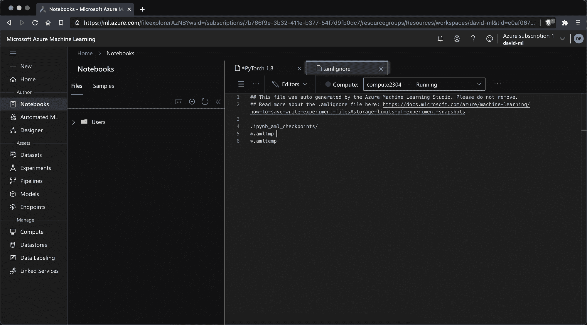
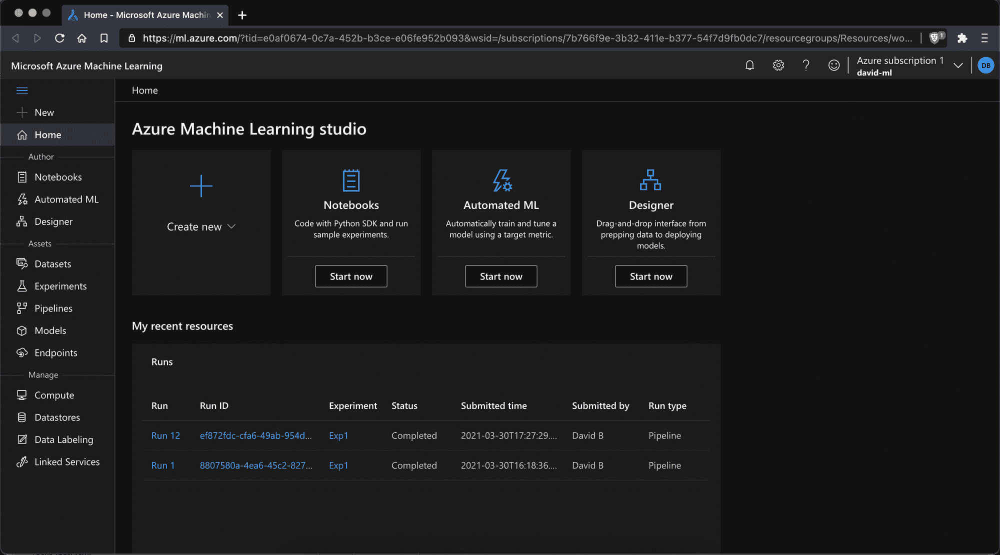
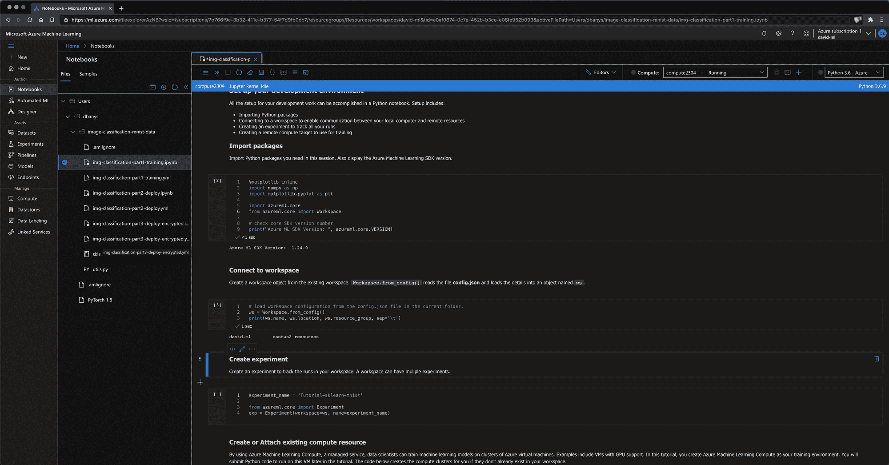
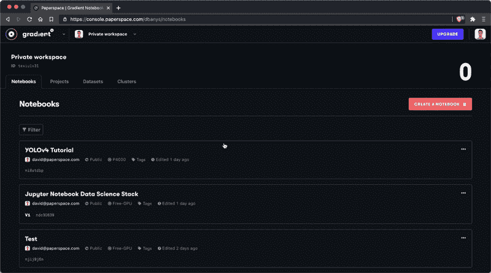
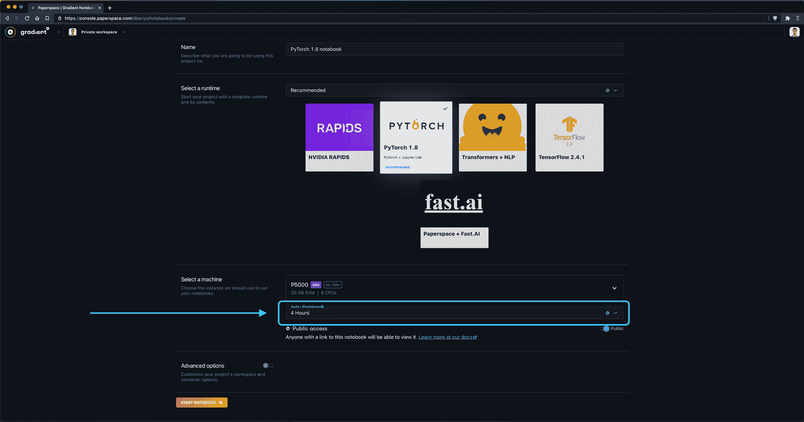
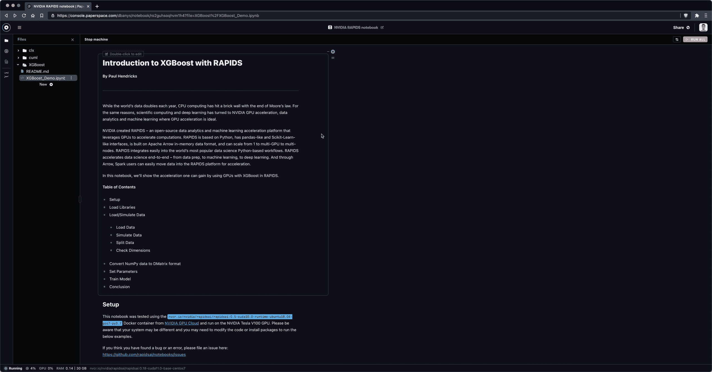

# 对比:Azure ML 笔记本和渐变笔记本

> 原文：<https://blog.paperspace.com/azure-machine-learning-jupyter-notebooks-comparison-alternative/>

[Azure Machine Learning](https://docs.microsoft.com/en-us/azure/machine-learning/overview-what-is-machine-learning-studio) 是一套机器学习工具，帮助数据科学家和 ML 工程师完成机器学习任务。

Enterprise Jupyter notebooks are referred to as "Azure Machine Learning Studio Notebooks" within Microsoft Azure

今天我们来看一下 [Azure 笔记本](https://docs.microsoft.com/en-us/azure/notebooks/quickstart-export-jupyter-notebook-project#use-notebooks-with-azure-machine-learning)，这是 Azure 机器学习工具集中的一款产品，它可以让你在 Azure 虚拟机或共享 Azure 集群上运行企业级 Jupyter 笔记本。

在这篇博文中，我们将回顾 Azure 笔记本的优缺点，并将 Azure 笔记本与 Paperspace 的渐变笔记本进行比较。

我们开始吧！

# Azure 笔记本简介

微软提供全栈机器学习平台的努力被称为 Azure Machine Learning。像谷歌云的[人工智能平台](https://cloud.google.com/ai-platform)和 AWS 的 [SageMaker](https://aws.amazon.com/sagemaker/) 一样，Azure 机器学习是公共云提供商之一为企业机器学习团队组装一套工具的努力。

笔记本是 Azure 作为其机器学习产品的一部分提供的原语之一，还有拖放式设计器和自动化机器学习 UI。

此外，Azure 还提供 MLOps 软件来生产 ML 实验和部署。这类似于梯度产品的其余部分，稍后将进行比较。

Azure Machine Learning Studio is divided between notebooks (covered in this article) and products called Automated ML and Designer which will be covered at a later date.

像其他公共云提供商的 ML 工具一样，Azure Machine Learning 面向企业用户，并为一个通常难以团队管理的领域(Jupyter 笔记本)带来了速度和协作的信息。

或者如 Azure 机器学习营销页面所说:

> 企业级机器学习服务，用于更快地构建和部署模型

# TL；博士；医生

对 Azure 笔记本产品的最大批评是，尽管它确实是托管 JupyterLab 笔记本的全功能实现，但快速启动并运行、预先计算将向您收取的费用、添加合作者以及在需要时通过文档或客户支持获得帮助都非常困难。

因此，Azure 机器学习笔记本电脑与其他公共云提供商提供的笔记本电脑处于类似的利基市场——如果你已经在生态系统中，并且需要一系列企业功能(例如基于角色的访问控制),这很好，但如果你使用笔记本电脑来探索假设，并且需要一个地方立即开始，这就不太好了。

总的来说，Azure 笔记本最适合那些想要利用微软 200 美元入门积分的人，或者那些已经扎根于 Azure 计算生态系统并需要关于合规性、SLA 的企业功能的人，或者那些在资源分配和供应方面发号施令的 IT 部门。

同时，Paperspace Gradient 笔记本最适合那些希望运行免费 CPU 和 GPU 实例而无需大量启动时间或麻烦的人，那些希望直接从预建容器启动笔记本的人，以及那些希望在模型研发的探索阶段获得更多自由的人。

# 特征比较

从 Azure ML 笔记本上运行 Jupyter 和 JupyterLab 都是可能的。还有一个基本的只读 IDE，允许您查看但不能写入笔记本。

Azure ML Notebooks IDE

|  | 微软 Azure 笔记本电脑 | 图纸空间渐变笔记本 |
| --- | --- | --- |
| **成本** | 面向新用户的 200 美元免费 Azure 信用点数 | 免费的 CPU 和 GPU 笔记本电脑 |
| **资源** | 任何 Azure 实例 | 任何图纸空间实例 |
| **从零要求开始** | 信用卡，GPU 批准 | 免费的 CPU 和 GPU，无需信用卡或批准 |
| **启动时间** | 计算需要几分钟来初始化 | 计算需要几秒钟来初始化 |
| **自动关机** | 否(截至 2020 年 2 月正在开发) | 是 |
| **Jupyter 笔记本选项** | 是 | 是 |
| **JupyterLab Option** | 是 | 是 |
| **从容器构建** | 是 | 是 |

# 成本比较

Azure 新客户目前在创建账户并输入信用卡信息后，可以获得 200 美元的 Azure 机器学习信用。信用可用于创建计算实例。

计算实例的现货价格概述如下:

| 实例类型 | 图纸空间渐变笔记本 | 实例类型 | 微软 Azure 笔记本电脑 |
| --- | --- | --- | --- |
| 免费(M4000) | 每小时 0.00 美元 | M60 | 每小时 1.14 美元 |
| 免费(P5000) | 每小时 0.00 美元 | M60 x2 | 每小时 2.40 美元 |
| P4000* | 每小时 0.51 美元 | M60 x4 | 每小时 4.81 美元 |
| P5000* | 每小时 0.78 美元 | K80 | 每小时 0.90 美元 |
| P6000* | 每小时 1.10 美元 | K80 x2 | 每小时 1.80 美元 |
| V100* | 每小时 2.30 美元 | K80 x 4 | 每小时 3.60 美元 |
| P5000 x4* | 每小时 3.12 美元 | V100 | 每小时 3.06 美元 |
| P6000 x4* | 每小时 4.40 美元 | V100 x2 | 每小时 6.12 美元 |
| - | - | V100 x4 | 每小时 13.46 美元 |

*虽然 Paperspace 提供免费 GPU，无需订阅，但 Paperspace 的付费实例需要一个计划。梯度订购层级如下:

| 梯度订阅类型 | 费用 | 细节 |
| --- | --- | --- |
| 自由的 | 0 美元/月 | -仅免费实例
-笔记本是公共的
-限制 1 台并发笔记本
-每次会话最多限制 12 小时
- 5GB 永久存储 |
| G1(个人) | 8 美元/月 | -免费和付费实例
-私人笔记本
-限制 5 个并发笔记本
-无限会话长度
- 200GB 永久存储 |
| G2(个人) | 24 美元/月 | -免费和付费实例
-私人笔记本
-限制 10 个并发笔记本
-无限会话长度
- 1TB 永久存储 |
| T1(团队) | 12 美元/用户/月 | -免费和付费实例
-私有笔记本
-限制 10 个并发笔记本
-无限会话长度
- 500GB 持久存储
-私有团队协作
-私有托管集群 |
| T2(团队) | 49 美元/用户/月 | -免费和付费实例
-私有笔记本
-限制 50 个并发笔记本
-无限会话长度
- 1TB 持久存储
-私有团队协作
-私有托管集群 |

# 入门指南

## 在 Azure 中设置 Jupyter 笔记本

Azure 笔记本入门需要很多步骤:

*   创建一个 Azure 帐户([链接](https://azure.microsoft.com/en-us/free/))
*   创建帐户后，请访问 Azure 门户([链接](https://portal.azure.com/#home))
*   导航到机器学习服务([链接](https://portal.azure.com/#blade/HubsExtension/BrowseResourceBlade/resourceType/Microsoft.MachineLearningServices%2Fworkspaces))
*   创建一个新的机器学习工作区，并指定订阅层、资源组和您可能需要的任何其他值，如容器注册表
*   一旦部署了新的工作空间，请访问资源并选择 Launch Studio
*   在 studio 视图中，从侧栏作者>笔记本>创建中选择
*   创建文件后，您需要选择“计算”>“新计算”,以便创建运行笔记本的实例。GPU 实例要求您从 Azure 请求额外配额。
*   *注意:Azure 目前为新账户提供 200 美元的信用点数*

## 在图纸空间渐变中设置 Jupyter 笔记本

若要开始使用渐变笔记本:

*   创建一个 Paperspace 帐户([链接](https://console.paperspace.com/signup))
*   导航到渐变>笔记本，并选择创建笔记本
*   输入笔记本的名称、运行时(可选)，并选择一个实例
*   如果你选择了一个自由的 CPU 或自由的 GPU 实例，选择开始笔记本，就是这样！(付费实例需要信用卡。)
*   *注意:Paperspace 提供对自由层 CPU 和 GPU 支持的笔记本电脑的无限制使用*

## 启动时间

You can create a new notebook with a GPU-backed instance in well under a minute on Gradient.

任何云提供商都需要一些时间来启动 CPU 或 GPU 实例。Azure Machine Learning 大约需要 3 分钟来创建您的第一个资源，而 Paperspace 大约需要 30 秒。

如果你想使用 GPU 支持的笔记本，Azure 要求你提交额外资源类型的资源请求。Gradient 对免费 CPU 或 GPU 没有此要求，但对付费层资源有此要求。

## 认知开销

由于企业焦点，在 Azure 中获得“地形”自然比在 Gradient 中更困难。如果您需要严格的 RBAC 或合规措施，这很好，但如果您试图立即在笔记本上开始探索，这就不太好了。

## 自动关机

当您创建渐变记事本时，您总是指定自动关闭时间间隔。这可以防止成本超支，并让您放心，因为您不会为您不经常使用的笔记本电脑付费。

Auto-shutdown interval is mandatory in Gradient when creating a notebook – and saves you money!

## JupyterLab

Azure 和 Gradient 都会给你一个完整版的 JupyterLab 来运行你的笔记本。这对这两种产品都是有利的，因为一些云笔记本提供商(如 Google Colab)给你的功能集要有限得多。

You can always initiate a full instance of JupyterLab from any Gradient Notebook by selecting the JupyterLab button in the left sidebar.

## 添加卡片

Azure 机器学习需要信用卡才能使用该产品。梯度只需要一个付费实例的信用卡。自由渐变实例始终包括至少一个 GPU 选项(通常是 NVIDIA M4000 或 P5000)。

## 排队单元

在我们的测试中，Azure notebook cells 在评估之前经常要排队很长一段时间。同时，渐变笔记本实例是不可抢占的。

# 结论

总的来说，Azure Machine Learning 和 Paperspace Gradient 都以原生 IDE 和 JupyterLab 格式提供 CPU 和 GPU 支持的云笔记本。

对于那些已经在 Azure 生态系统中的人来说，将计算和计算积分应用于驱动基于 Azure 的笔记本可能是有意义的。

对于其他人来说，Paperspace Gradient 提供了一个合适的替代方案，具有较低的复杂性和启动开销。