# 用 Cython 提升 Python 脚本

> 原文：<https://blog.paperspace.com/boosting-python-scripts-cython/>

Python 可能是当今最流行的编程语言之一，但它肯定不是最高效的。特别是在机器学习领域，从业者为了 Python 提供的易用性牺牲了效率。

这并不意味着你不能用其他方法加快速度。Cython 是一种显著减少 Python 脚本计算时间的简单方法，而不会牺牲使用 Python 轻松实现的功能。

本教程将向您介绍如何使用 Cython 来加速 Python 脚本。我们将看到一个简单但计算量很大的任务:为创建一个*循环，该循环遍历包含 10 亿个数字的 Python 列表，并对它们求和。由于在资源有限的设备上运行代码时，时间尤其重要，我们将通过考虑如何在 Raspberry Pi (RPi)上的 Cython 中实现 Python 代码来考虑这个问题。Cython 显著提高了计算速度。把它想象成树懒和猎豹的比较。*

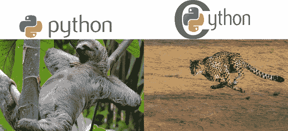

Sloth image from [IndiaToday](https://www.indiatoday.in/education-today/gk-current-affairs/story/slowest-animals-261003-2015-09-03) | Cheetah image from [Pixabay](https://pixabay.com/photos/cheetah-africa-namibia-cat-run-2859581)

本教程涵盖的部分如下:

*   Python、CPython 和 Cython
*   简化 Python 代码
*   为循环发出一个
*   *将 C 数据类型赋给变量*
*   *Cython 在树莓派中的应用*

*让我们开始吧。*

# *Python 和 CPython*

*许多人没有意识到这样一个事实，即像 Python 这样的语言实际上是用其他语言实现的。比如 Python 的 C 实现叫做 **CPython** 。注意不是 **Cython** 。关于 Python 不同实现的更多信息，你可以阅读[这篇文章](https://www.toptal.com/python/why-are-there-so-many-pythons)。*

*Python 的默认和最流行的实现是 CPython。使用它有一个重要的优点。c 是一种编译语言，它的代码被转换成机器代码，由中央处理器(CPU)直接执行。现在你可能会想，如果 C 是一种编译语言，那是不是意味着 Python 也是？*

*C (CPython)中的 Python 实现不是 100%编译的，也不是 100%解释的。在运行 Python 脚本的过程中，既有编译也有解释。为了说明这一点，让我们来看看运行 Python 脚本的步骤:*

1.  *使用 CPython 编译源代码以生成字节码*
2.  *在 CPython 解释器中解释字节码*
3.  *在 CPython 虚拟机中运行 CPython 解释器的输出*

*当 CPython 编译源代码(.py 文件)来生成 CPython 字节码(.pyc 文件)。CPython 字节码(。pyc 文件)然后使用 CPython 解释器进行解释，输出在 CPython 虚拟机上运行。根据上面的步骤，运行 Python 脚本的过程包括编译和解释。*

*CPython 编译器只生成一次字节码，但是每次代码运行时都会调用解释器。通常字节码的解释要花很多时间。如果使用解释器会降低执行速度，为什么还要使用它呢？最大的原因是它有助于 Python 跨平台。因为字节码运行在 CPU 之上的 CPython 虚拟机中，所以它独立于运行它的机器。因此，字节码可以在不同的机器上运行而不发生变化。*

*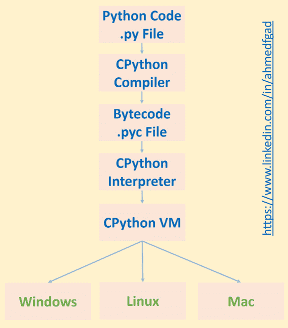*

*如果没有使用解释器，那么 CPython 编译器将生成直接在 CPU 中运行的机器码。因为不同的平台有不同的指令，所以代码不会跨平台。*

*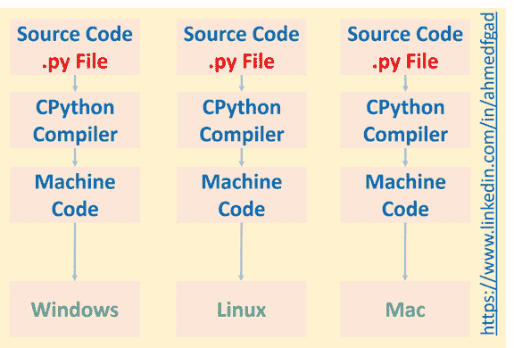*

*总之，使用编译器加快了这个过程，但是解释器使代码跨平台。所以，Python 比 C 慢的一个原因是使用了解释器。记住编译器只运行一次，但是每次代码执行时解释器都会运行。*

*Python 比 C 慢得多，但许多程序员仍然喜欢它，因为它更容易使用。Python 对程序员隐藏了许多细节，这有助于防止令人沮丧的调试。例如，因为 Python 是一种动态类型的语言，你不必在你的代码中显式地指定每个变量的类型——Python 会自动推导出它。相反，对于静态类型的语言(如 C、C++或 Java ),您必须指定变量的类型，如下所示。*

```py
*`int x = 10
string s = "Hello"`*
```

*将它与下面的 Python 实现进行比较。动态类型化使编码更容易，但是增加了机器寻找合适的数据类型的负担。这使得该过程更慢。*

```py
*`x = 10
s = "Hello"`*
```

*一般来说，像 Python 这样的“高级”语言对开发者来说更容易使用。然而，当代码运行时，它需要被转换成低级指令。这种转换需要更多的时间，这是为了易于使用而牺牲的。*

*如果时间是一个重要的因素，那么你需要使用低级指令。因此，您可以使用 CPython 编写代码，而不是使用 Python(这是一种接口)来键入代码，CPython 是用 C 实现的 Python 的后端。但是，如果您这样做，您会觉得您是在用 C 而不是 Python 编程。*

*CPython 要复杂得多。在 CPython 中，一切都是用 C 实现的。在编码中，没有办法逃避 C 的复杂性。这就是为什么许多开发者选择 Cython 而不是 T1 的原因。但是 Cython 和 CPython 有什么不同呢？*

# *Cython 与众不同*

*根据 [Cython 文档](https://cython.readthedocs.io/en/latest/src/tutorial/cython_tutorial.html)，Cython 是 C 数据类型的 Python。来自 [Cython tutorial 2009 论文](http://conference.scipy.org/proceedings/SciPy2009/paper_1)的另一个定义阐明:*

> *Cython 是一种基于 Python 的编程语言，具有额外的语法来提供静态类型声明。这既利用了 Python 的优势，又能达到 c 语言的速度。*

*根据上面的定义，Cython 是一种让你拥有两个世界的最好的语言——速度和易用性。您仍然可以用 Python 编写常规代码，但是为了在运行时加快速度，Cython 允许您用 c 语言替换 Python 代码的某些部分。因此，您最终会将两种语言混合在一个文件中。请注意，您可以想象 Python 中的一切在 Cython 中都是有效的，但有一些限制。有关限制的更多信息，您可以访问[本页](https://cython.readthedocs.io/en/latest/src/userguide/limitations.html#cython-limitations)。*

*常规 Python 文件的扩展名为. py，但 Cython 文件的扩展名为。改为 pyx 扩展名。相同的 Python 代码可以编写在。pyx 文件，但是这些文件也允许您使用 Cython 代码。请注意，与直接运行 Python 代码相比，仅将 Python 代码放入. pyx 文件中可能会加快速度，但不如声明变量类型时快。因此，本教程的重点不仅仅是在。pyx 文件，但也进行编辑，这将使它运行得更快。通过这样做，我们给编程增加了一点难度，但是这样做节省了很多时间。如果你有 C 语言编程的经验，那么对你来说会更容易。*

# *简化 Python 代码*

*要将 Python 转换成 Cython，首先需要用**创建一个文件。pyx** 分机而不是**。py** 分机。在这个文件中，你可以从编写常规的 Python 代码开始(注意，Cython 接受的 Python 代码有一些限制，在 [Cython 文档](https://cython.readthedocs.io/en/latest/src/userguide/limitations.html#cython-limitations)中已经阐明)。*

*在继续之前，请确保安装了 Cython。您可以使用以下命令来完成此操作。*

```py
*`pip install cython`*
```

*来生成。pyd/。所以我们需要首先构建 Cython 文件。的。pyd/。所以 file 表示稍后要导入的模块。为了构建 Cython 文件，将使用 setup.py 文件。创建这个文件，并将下面的代码放入其中。我们将使用 distutils.core.setup()函数来调用 Cython。Build.cythonize()函数，该函数将。pyx 文件。这个函数接受你想要同步的文件的路径。这里我假设 setup.py 文件与 test_cython.pyx 文件放在同一个位置。*

```py
*`import distutils.core
import Cython.Build
distutils.core.setup(
    ext_modules = Cython.Build.cythonize("test_cython.pyx"))`*
```

*为了构建 Cython 文件，在命令提示符下发出下面的命令。命令提示符的当前目录应该与 setup.py 文件的目录相同。*

```py
*`python setup.py build_ext --inplace`*
```

*该命令完成后，两个文件将被放在。pyx 文件。第一个有。c 扩展名，而另一个文件将具有该扩展名。pyd(或类似的，基于使用的操作系统)。为了使用生成的文件，只需导入 test_cython 模块，就会直接出现“Hello Cython”消息，如下所示。*

*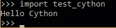*

*我们现在已经成功地将 Python 代码细胞化了。下一节将讨论如何创建一个. pyx 文件，并在其中创建循环。*

# *将“for”循环变成 Cythonizing*

*现在让我们优化我们前面提到的任务:一个 *for* 循环，它遍历一百万个数字并对它们求和。让我们从查看循环迭代的效率开始。导入时间模块是为了估计执行需要多长时间。*

```py
*`import time
t1 = time.time()

for k in range(1000000):
    pass

t2 = time.time()
t = t2-t1
print("%.20f" % t)`*
```

*在. pyx 文件中，3 次运行的平均时间是 0.0281 秒。代码运行在配备酷睿 i7-6500U CPU @ 2.5 GHz 和 16 GB DDR3 RAM 的机器上。*

*将它与运行一个普通 Python 文件所需的时间进行比较，后者的平均值为 0.0411 秒。这意味着仅在迭代方面，Cython 就比 Python 快 1.46 倍，尽管我们不需要修改循环的*来让它以 C 速度执行。**

*现在让我们添加求和任务。为此，我们将使用 range()函数。*

```py
*`import time
t1 = time.time()

total = 0
for k in range(1000000):
    total = total + k
print "Total =", total

t2 = time.time()
t = t2-t1
print("%.100f" % t)`*
```

*请注意，这两个脚本返回相同的值，即 499999500000。在 Python 中，平均运行时间为 0.1183 秒(三次试验之间)。在 Cython 中，它的速度快了 1.35 倍，平均为 0.0875 秒。*

*让我们看另一个例子，循环从 0 开始遍历 10 亿个数字。*

```py
*`import time
t1 = time.time()

total = 0
for k in range(1000000000):
    total = total + k
print "Total =", total

t2 = time.time()
t = t2-t1
print("%.20f" % t)`*
```

*Cython 脚本完成了将近 85 秒(1.4 分钟)，而 Python 脚本完成了将近 115 秒(1.9 分钟)。在这两种情况下，时间都太长了。如果在如此琐碎的任务上持续超过一分钟，那么使用 Cython 的好处是什么？注意这是我们的错，不是 Cython 的。*

*如前所述，在 Cython 中编写 Python 代码。pyx 脚本是一个改进，但是它并没有大幅减少执行时间。我们必须在 Cython 脚本中编辑 Python 代码。首先要关注的是明确定义所用变量的数据类型。*

# *将 C 数据类型赋给变量*

*根据前面的代码，使用了 5 个变量: *total，k，t1，t2* ，*T3， *t* 。所有这些变量的数据类型都是由代码隐式推导出来的，因此需要更多的时间。为了节省推断它们的数据类型的时间，让我们从 C 语言中指定它们的数据类型。**

**total* 变量的类型是**无符号长整型**。它是一个整数，因为所有数字的总和是一个整数，它是无符号的，因为总和将是正数。但是为什么是**龙**龙呢？因为所有数字的和非常大，所以添加 **long long** 来将变量大小增加到最大可能大小。*

*为变量 *k* 定义的类型是 **int** ，为剩余的三个变量 *t1* 、 *t2* 和 *t* 赋值 **float** 类型。*

```py
*`import time

cdef unsigned long long int total
cdef int k
cdef float t1, t2, t

t1 = time.time()

for k in range(1000000000):
    total = total + k
print "Total =", total

t2 = time.time()
t = t2-t1
print("%.100f" % t)`*
```

*注意，最后一个 print 语句中定义的精度被设置为 100，所有这些数字都是零(见下图)。这就是我们使用 Cython 所能期待的。Python 需要 1.9 分钟以上，而 Cython 根本不需要时间。我甚至不能说速度比 Python 快 1000 或 100000；我尝试了不同精度的打印时间，仍然没有数字出现。*

*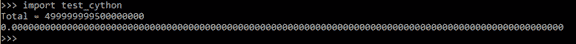*

*请注意，您还可以创建一个整数变量来保存传递给 range()函数的值。这将进一步提高性能。下面列出了新代码，其中的值存储在整数变量 *maxval* 中。*

```py
*`import time

cdef unsigned long long int maxval
cdef unsigned long long int total
cdef int k
cdef float t1, t2, t

maxval=1000000000

t1=time.time()

for k in range(maxval):
    total = total + k
print "Total =", total

t2=time.time()
t = t2-t1
print("%.100f" % t)`*
```

*既然我们已经看到了如何通过使用 Cython 来提高 Python 脚本的性能，那么让我们将其应用到 Raspberry Pi (RPi)中。*

# *从 PC 访问 Raspberry Pi*

*如果这是你第一次使用你的 Raspberry Pi，那么你的 PC 和 RPi 都需要通过网络连接。为此，您可以将它们连接到一台交换机，在该交换机中，DHCP(动态主机配置协议)处于活动状态，以便自动为它们分配 IP 地址。成功创建网络后，您可以根据分配给它的 IPv4 地址访问 RPi。您如何知道分配给您的 RPi 的 IPv4 地址是什么？别担心，你可以简单地使用一个 IP 扫描工具。在本教程中，我将使用一个名为[高级 IP 扫描器](https://www.advanced-ip-scanner.com)的免费应用程序。*

*应用程序的界面如下所示。它接受要搜索的 IPv4 地址范围，并返回活动设备的信息。*

*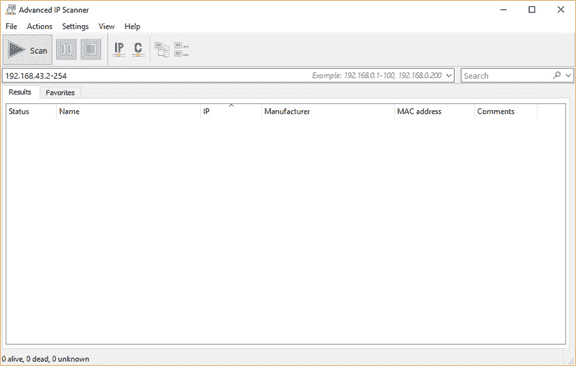*

*您需要输入本地网络中的 IPv4 地址范围。如果您不知道范围，只需在 Windows 中发出 ipconfig 命令(或在 Linux 中发出 ifconfig)即可知道您的 PC IPv4 地址(如下图所示)。在我的例子中，分配给我的 PC 的 Wi-Fi 适配器的 IPv4 地址是 192.168.43.177，子网掩码是 255.255.255.0。这意味着网络中的 IPv4 地址范围是从 192.168.43.1 到 192.168.43.255。如图所示，IPv4 地址 192.168.43.1 被分配给网关。请注意，范围内的最后一个 IPv4 地址 192.168.43.255 是为广播消息保留的。因此，搜索范围应该从 192.168.43.2 开始，到 192.168.43.254 结束。*

*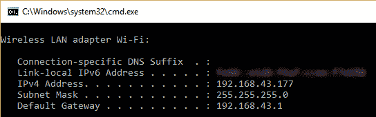*

*根据下图所示的扫描结果，分配给 RPi 的 IPv4 地址是 192.168.43.63。此 IPv4 地址可用于创建安全外壳(SSH)会话。*

*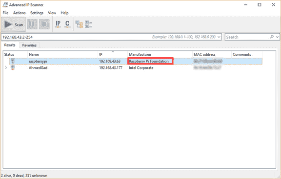*

*为了建立 SSH 会话，我将使用一个名为 [MobaXterm](https://mobaxterm.mobatek.net) 的免费软件。应用程序的界面如下。*

*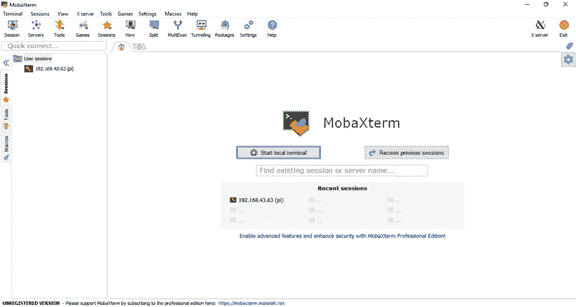*

*为了创建一个 SSH 会话，只需点击左上角的**会话**按钮。将出现一个新窗口，如下所示。*

*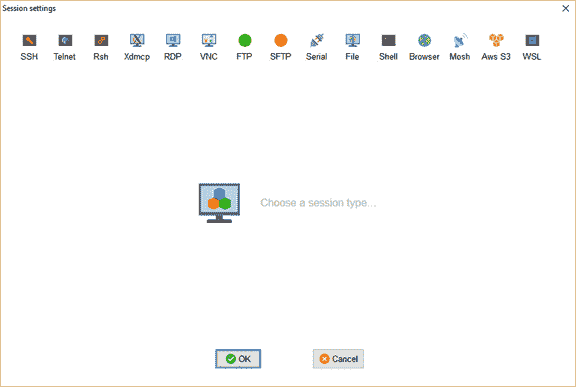*

*在该窗口中，单击左上角的 SSH 按钮，打开如下所示的窗口。只需输入 RPi 的 IPv4 地址和用户名(默认为 Pi)，然后单击 OK 启动会话。*

*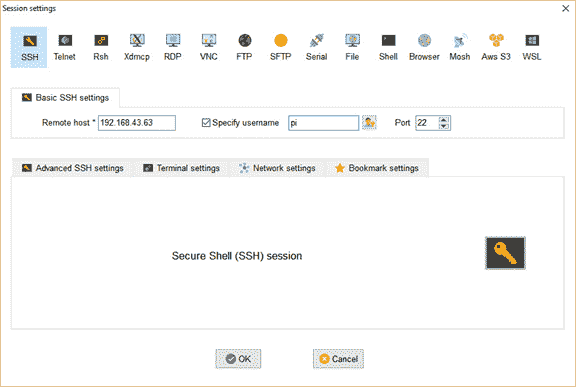*

*单击 OK 按钮后，会出现一个新窗口，要求输入密码。默认密码是 raspberrypi。登录后，将出现下一个窗口。左侧的窗格有助于轻松导航 RPi 的目录。还有一个用于输入命令的命令行。*

**

# *将 Cython 与树莓 Pi 一起使用*

*创建一个新文件，并将其扩展名设置为。pyx 来编写最后一个例子的代码。左侧窗格的栏中有用于创建新文件和目录的选项。您可以使用“新建文件”图标使事情变得更加简单，如下图所示。我在 RPi 的根目录下创建了一个名为 test_cython.pyx 的文件。*

*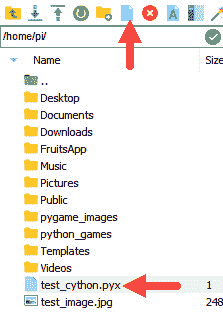*

*只需双击文件打开它，粘贴代码，并保存它。之后，我们可以创建 **setup.py** 文件，这与我们之前讨论的完全相同。接下来，我们必须发出以下命令来构建 Cython 脚本。*

```py
*`python3 setup.py build_ext --inplace`*
```

*该命令成功完成后，您可以根据下图找到左侧窗格中列出的输出文件。注意，要导入的模块的扩展现在是。因此，由于我们不再使用 Windows。*

*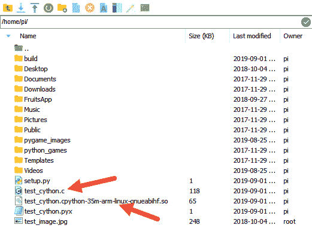*

*现在让我们激活 Python 并导入模块，如下所示。这里也实现了在 PC 上实现的相同结果；消耗的时间基本为零。*

*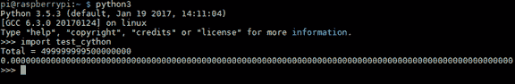*

# *结论*

*本教程讨论了如何使用 Cython 来减少执行 Python 脚本的计算时间。我们看了使用一个 *for* 循环对一个包含 10 亿个数字的 Python 列表中的所有元素求和的例子，并比较了声明变量类型和不声明变量类型的执行时间。虽然这在纯 Python 中运行需要将近两分钟，但使用 Cython 声明的静态变量运行基本上不需要时间。*

*在下一篇教程中，我们将用 NumPy 数组替换这个 Python 列表，并看看如何使用 Cython 优化 NumPy 数组处理。然后，我们将看看如何将更高级的 Python 脚本(如遗传算法)进行 cythonize。这是轻松提高机器学习项目效率的好方法。*