# 深度卷积神经网络的有效通道注意

> 原文：<https://blog.paperspace.com/attention-mechanisms-in-computer-vision-ecanet/>

基于[挤压和激励网络](https://blog.paperspace.com/channel-attention-squeeze-and-excitation-networks) (SENet)和通道注意力的重要性，在本文中，我们将讨论在 CVPR 2020 上发表的 [*ECA-Net:深度卷积神经网络*](https://arxiv.org/abs/1910.03151) 的高效通道注意力。该论文重申了有效通道注意的重要性，并提出了一种新方法，该方法是对流行的挤压和激励网络的 ***更便宜的*** 和 ***更好的***(CVPR，TPAMI 2018)。

本文由四个部分组成。首先，我们将深入研究论文的基础，理解跨渠道互动的重要性(CCI)。然后我们将讨论 ECA-Net 的设计结构，看看该设计如何消除 SENet 的某些缺点。之后，我们将看看论文报告的结果，最后讨论模型的一些缺点。

你可以在坡度上免费运行 ECA-Net 和 SENet [。](https://ml-showcase.paperspace.com/projects/attention-mechanisms-in-computer-vision)

## 目录

*   本地信息对邻居信息对全球信息
*   跨渠道互动(CCI)
*   非洲经委会网络
*   自适应邻域大小
*   密码
*   基准
*   缺点
*   参考

## 局部、邻域和全局信息之间的权衡


在我们深入研究本文之前，让我们首先了解本地信息、邻居信息和全局信息的上下文重要性。这些将作为跨渠道互动的基本灵感和理由，这是本文提出的高效渠道注意力(ECA-Net)结构的基础。

想象一下通过(假设功能强大的)窥视孔、望远镜和肉眼来研究宇宙。这三个选项各有不同的优点和缺点，但在某些情况下，与其他选项相比，一个选项的优点超过了它的缺点。让我们更详细地讨论一下。

### 望远镜

通过望远镜研究太空(基本上是开放的、无遮挡的天空)是非常有益的，因为它提供了对遥远天体的增强视图。让我们以土星为例。借助于高倍望远镜，人们可以生动而细致地观察土星环。然而，在这种情况下，视场主要只包含环；土星本身被限制在背景中。这可以认为是显示了**本地信息**；你的视角局限在一个有限的局部空间内，尽管你能清晰地感知到信息的细节，但却无法涵盖更大的背景。因此，局部信息的优势在于它更加关注细节，尽管它无法捕捉更大范围内的上下文关系，而这对于从整体上感知场景是很重要的。把它想象成静物画和风景画的区别。前者专注于一个事物(或视图)的细微局部细节，而后者则缩小以显示更大的场景，同时牺牲许多更小的细节。

### 窥视孔

现在想象通过一个(假设强大的)窥视孔研究土星。除了聚焦在光环上，你会看到土星和它的光环一起出现在视野中。虽然你无法观察到光环的细节，但你可以完整地看到这颗行星。所以你牺牲了感知光环细节的奢侈来观察土星的天体结构。这将被定义为**邻域信息**，其中土星和它的环是彼此的邻居，一起形成局部上下文关系。注意:这个邻域不提供场景的全局上下文，只提供嵌入在更大场景中的小区域的上下文。

### 肉眼

最后，想象一下花一点时间看看明亮的夜空，用你的肉眼找到土星。假设你能看到土星是一个小的，圆的，发光的球体。现在你可能对宇宙的广阔范围有了更好的了解，土星在宇宙中有多小，以及它相对于许多其他可见星座的位置。这是**全局信息**。在这种情况下，为了更好地了解整个背景，您甚至牺牲了更多的细节。例如，现在您可以在整个场景中绘制对象之间的不同关系。

另一种思考方式是区分显微图像、正常比例图像和全景图像。微观图像将包括微小的细节，正常比例的图像将提供局部背景，而全景图像将显示完整的场景。

记住这一点，让我们回顾一下跨渠道互动。

## 跨渠道互动(CCI)

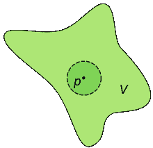

回想一下，卷积神经网络由具有不同数量的可学习滤波器的卷积层组成，这些滤波器对应于相应层的输出张量中的通道数量。这些张量是 4 维的，具有形状( *B* 、 *C* 、 *H* 、 *W* )，其中 *B* 表示批量大小， *C* 表示通道的数量(或该张量中特征图的总数，因此也与相应卷积层中滤波器的总数相关)，而 *H* 和 *W* 表示每个特征的高度和宽度

假设架构内任意卷积层的给定张量的所有信道都存在于有限有界空间 *v* 内，如上图所示。本文的背景是提供渠道关注，其目的是以比[挤压和激励网络](https://blog.paperspace.com/channel-attention-squeeze-and-excitation-networks/)(SENet；这是渠道关注领域的一篇基础论文)。让我们假设全局空间 *v* 内的一个小邻域，并将其表示为 *p* 。这个邻域包含整个通道集的有限子集。这构成了跨渠道互动的基础。

回想一下，在 SENet 中有三个模块定义了 SE-block 的结构，包括:( *i* )挤压模块、( *ii* )激励模块和( *iii* )缩放模块。挤压模块负责将每个特征图的空间维度减少到单个像素，或者基本上是如上所示的全局空间 *v* 中的单位点。此外，激励模块通过包含压缩比为 *r* 的压缩隐藏层的全连接多层感知器(FF-MLP)瓶颈来映射整个全局空间 *v* 。这种压缩就是*降维*步骤。这不是最佳的。理想情况下，人们希望将每个通道映射到自身，从而获得每个通道之间的全局依赖性和关系，然而，这在计算上将非常昂贵，这就是为什么存在由缩减率 *r* 控制的通道压缩。下面是挤压-激励模块的激励模块中维数减少的可视化。

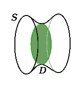

挤压-激励网络确实结合了跨通道相互作用(CCI)，这实质上意味着通道没有被加权，并且通道注意力不是以孤立的方式为每个通道学习的。相反，每个通道的权重是相对于其他通道学习的。然而，在 SE-block 中，这种 CCI 也由于维数减少(DR)而被稀释，由于复杂性限制，维数减少是次优的。因此，为了解决这一问题，ECA-Net 通过使用第一个图中表示为 *p* 的部分中所示的局部邻域问题，合并了没有任何 DR 的 CCI。因此，ECA-Net 获得每个张量的自适应局部邻域大小，并计算该邻域 *p* 内每个通道相对于该邻域 *p* 内每个其他通道的关注度。我们稍后将看到他们的方法如何防止维数减少(DR ),并且比压缩和激发块更便宜。

## 非洲经委会网络

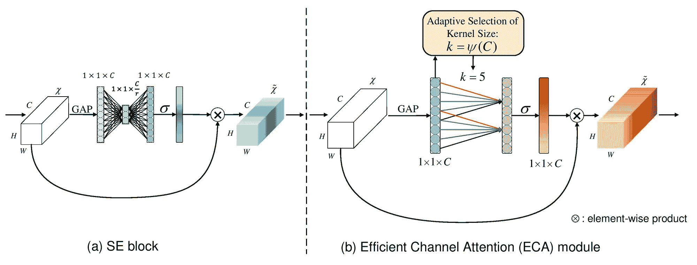

基于我们对降维(DR)和跨通道交互(CCI)的理解，现在让我们来剖析 ECA-Net 的结构。在下一节中，我们将以更加数学化的方式重新审视跨渠道互动和全球信息依赖的重要性。

如上图所示，ECA-Net 的结构与 SE-Net 非常相似。让我们来分解一下前者的各个组成部分。ECA-Net 获取输入张量，该输入张量是卷积层的输出，并且是四维形状( *B* 、 *C* 、 *H* 、 *W* )，其中 *B* 表示批量大小， *C* 表示该张量中的通道数量或特征图总数，最后， *H* 和 *W* 表示每个特征图的空间维度 ECA 块的输出也是相同形状的 4-D 张量。ECA-block 也由 3 个模块组成，包括:

1.  全局特征描述符
2.  自适应邻域交互
3.  广播缩放

让我们分别来看看它们:

### 全局特征描述符

如在“挤压-激励网络”中所讨论的，为了解决使注意力学习机制自适应并依赖于每个通道本身的计算复杂性，并且由于每个通道都具有 *H* x *W* 像素，这构成了总共 *C* x *H* x *W* 信息空间，我们使用全局特征描述符来将每个特征图减少到单个像素，从而将空间减少到仅仅 *C* x 1 x 1。这极大地降低了复杂度，并且能够捕获每个通道的编码全局信息，从而同时使得通道注意力自适应且廉价。挤压-激励(se)和有效通道注意(ECA)都使用相同的全局特征描述符(在 SE 块中称为挤压模块),它是全局平均池(GAP)。GAP 获取输入张量，并通过获取该特征图中所有像素的平均值，将每个特征图缩减为单个像素。

### 自适应邻域交互

如前一节所述，我们通过简要描述跨渠道交互(CCI)为本文奠定了基础。因此，在张量通过 GAP 并被减少到每个特征图的单个像素空间之后，它然后受到自适应核的支配，该自适应核在该空间上滑动，其中描述邻域大小的核大小保持自适应。更详细地说，一旦我们有了来自 GAP 的 *C* x 1 x 1 张量或*C*-长度向量，它就经受一维跨越卷积，其核大小( *k* )自适应于全局信道空间( *C* )，并由以下公式确定:

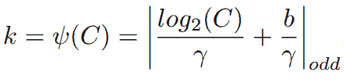

因此，基本上 *k* 提供了局部邻域空间的大小，该空间将用于捕捉跨通道交互，同时映射每个通道的注意力权重。上式中， *b* 和 *γ* 是预定义的超参数，分别设置为 1 和 2。这个函数 *ψ* ( *C* )本质上近似最接近的奇数，作为基于公式的 1D 卷积的核大小。让我们理解公式背后的基本原理:

根据对卷积神经网络架构中普遍采用的分组卷积的理解，在信道数 *C* 和滤波器核大小 *k* 之间存在抽象映射*φ*。这种映射可以表示为:*C*=*φ*(*k*)。因此，最简单的关系映射将是线性函数的映射，其可以表示为*φ*(*k*)=*γ***k*+*b*，然而这将增加严重的限制，并且可能不是精确的映射。自从现代神经网络设计开始以来，通道通常被设置为 2 的不同幂。这背后的原因是，内存硬件中的大多数总线都是基于 2 的幂，因此在寻址机制中不会浪费任何位。因此，拥有数量级为 2 的幂的信道可以最大化性能和资源利用率。这条 [twitter 帖子](https://twitter.com/DigantaMisra1/status/1283089569450127360?s=20)包含了更多相关讨论。因此，基于此，作者引入了非线性映射，其可以被定义为:

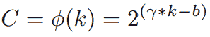

求解上述等式中的 *k* 将得到上述的 *ψ* ( *C* )。因此，较大的通道空间将具有较大的邻域大小，反之亦然。

总的来说，按照函数 *ψ* ( *C* )，对接收到的 post GAP 的*C*x1×1 张量进行由自适应于信道总数的非线性映射定义的核大小为 k 的跨越 1D 卷积。注意:这是一个尺寸深度保持卷积，所以输出张量中的通道总数与输入通道总数一样，都在 1D 卷积之后- *C* 。因此，这通过设计消除了在挤压和激励模块中普遍存在的维数减少(DR)问题。

### 广播缩放

从 1D 卷积接收到形状为 *C* x 1 x 1 的加权张量后，它简单地通过一个 sigmoid 激活层，该激活层在 0 到 1 的范围内设定每个通道权重的阈值。该频道注意力向量然后被广播到输入张量大小( *C* x *H* x *W* )，然后逐元素地与它相乘。

因此，概括地说，在 ECA-block 中，输入张量首先通过穿过全局平均池层被分解为信道向量，随后通过具有自适应核大小的 1D 卷积，然后在被广播之前穿过 sigmoid 并与输入张量逐元素相乘。因此，与挤压和激励相比，ECA-Net 非常便宜，因为添加的参数总数仅为 *k* 。

让我们将 ECA-Net 与其他注意机制在属性和计算复杂性开销方面进行比较:

| 注意机制 | 速度三角形定位法(dead reckoning) | CCI | 参数开销 | 高效的 |
| --- | --- | --- | --- | --- |
| 如果 | 是 | 是 | 2*C*T2 2/*r* | 不 |
| CBAM | 是 | 是 | 2*C*T2 2/*r*+2*k*² | 不 |
| 嘣 | 是 | 是 | *C*/*r*(3*C*+2*C*²/*r*+1) | 没有(但是块集成策略使其开销很低) |
| 车底距地高(Ground Clearance) | 是 | 是 | 2*C*T2 2/*r*+*C* | 不 |
| 葛θt0— | 不 | 不 | - | 是 |
| 葛θ | 不 | 不 | - | 不 |
| 葛θt0 ++ | 是 | 是 | - | 不 |
| *一张* 二张-球网 | 是 | 是 | - | 不 |
| GSoP-网络 | 是 | 是 | - | 不 |
|  |  |  |  |  |
| 生态网 | 不 | 是 | *k* = 3 | 是 |

注意:博士=否和 CCI =是是最佳和理想的。 **C** 代表通道总数， **r** 代表减速比。参数开销是针对每个关注块的。

尽管 ECA-block 中的内核大小是由自适应函数 *ψ* ( *C* )定义的，但作者在所有实验中都将内核大小 *k* 固定为 3。这背后的原因尚不清楚，当 GitHub 用户在本期[的官方代码库中提出这一问题时，作者也没有准确地解决这一问题。](https://github.com/BangguWu/ECANet/issues/24)

## 自适应邻域大小

如前一节所述，我们强调跨渠道互动(CCI)是高效渠道注意力(ECA)模块的基本概念。在这一节中，我们将了解作者是如何得出 CCI 是重要的这一结论的，以及这一结论背后的数学理解。

让我们回顾一下，在挤压和激励模块的情况下，我们有一个完全连接的多层感知器(FC-MLP)，其中有一个输入层，隐藏层和输出层。输入层有 *C* 神经元，隐含层有 *C* / *r* 神经元，输出层有 *C* 神经元。这涉及维度缩减(DR ),因为缩减比率 *r* 使得通道之间的关系映射是间接的，因此是非最优的。因此，为了进行研究，作者首先构建了三种不同的不涉及降维的压缩-激发模块。将这三个变体分别命名为:( *i* ) SE-Var1、( *ii* ) SE-Var2、( *iii* ) SE-Var3。

SE-Var1 不包含参数开销，本质上是计算输入向量的全局平均池(GAP ),然后在广播之前将其通过 sigmoid 激活，并按元素将其与输入张量相乘。在等式形式中，这可以表示为:σ(y)其中 y 是间隙(输入),σ是 Sigmoid 激活。

SE-Var2 本质上是一对一连接的网络，因此每个通道包含一个权重，并且不包含跨通道交互。因此，参数开销是输入张量中的通道总数 *C* 。在等式形式中，这可以表示为:σ(w≥y)其中 w 是由 y 表示的间隙向量中每个通道的权重。

SE-Var3 是渠道关注的圣杯，这里有全局跨渠道互动，没有降维。本质上，这包含一个完全连接的无瓶颈减少网络来构建频道关注权重。在等式形式中，这可以表示为:σ(Wy)其中 W 是完整的 *C* x *C* 权重矩阵。然而，尽管这是最佳方法，但是这增加了巨大的参数(准确地说是 CxC 更多的参数)和计算复杂性开销。

本质上，SE-Var2 是完整 C×C 矩阵的对角矩阵，SE-Var2 和 SE-Var3 的两个权重矩阵可以用以下矩阵形式表示:

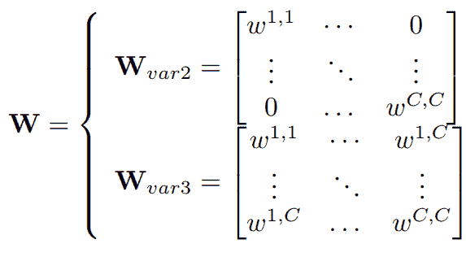

基于这三种不同的变型，作者设计了 ECA 块的构造，其中权重矩阵被约束到比整个 *C* 信道更小的邻域大小。因此，基于 CCI 的重要性，作者将该约束定义为 *G* ，并且可以用矩阵形式表示为:

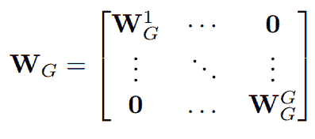

这里，信道被分成 *G* 组，其中每组包含 *C* / *G* 信道，然后它们在该组 *G* 内构造阿瑟-瓦尔 2 对角权重矩阵。因此，这里的参数开销是 *G* ，它在形式上也表示为 *k* ，如前面章节中所讨论的，其中 *G* 的大小由自适应函数 *ψ* ( *C* )定义。并且这些 G 权重在 1D 卷积的所有步幅上被共享，因此在数学上可以表示为:σ(C1Dk(y))

作者进行了消融研究，以观察每个 SE 变体的性能，并将其与 ECA-block 的性能进行比较，如下表所示，ECA-block 的性能最好，参数开销最少。作者还证实了通道注意的重要性，因为 SE-Var1 获得的增量性能不包含可学习的参数。

| 方法 | 注意力 | 参数开销 | 最高精度 | 前 5 名准确度 |
| --- | --- | --- | --- | --- |
| 香草 | 不适用的 | Zero | Seventy-five point two | Ninety-two point two five |
|  |  |  |  |  |
| 如果 | σ(f{W1，W2}(y)) | 2 × C² /r | Seventy-six point seven one | Ninety-three point three eight |
|  |  |  |  |  |
| 参见-Var1 | σ(y) | **0** | Seventy-six | Ninety-two point nine |
| SE-Var2 型机器人 | S7-1200 可编程控制器 | C | Seventy-seven point zero seven | Ninety-three point three one |
| SE-Var3 型机器人 | σ(你们) | C² | Seventy-seven point four two | Ninety-three point six four |
|  |  |  |  |  |
| 经济合作总属 | σ(C1Dk(y)) | k = 3 | **77.43** | **93.65** |

## 密码

现在，我们来看看 PyTorch 和 Tensorflow 中 ECA-block 的片段:

### PyTorch

```py
### Import necessary dependencies
import torch
from torch import nn

class ECA(nn.Module):
    """Constructs a ECA module.
    Args:
        channel: Number of channels of the input feature map
    """

    def __init__(self, channel, k_size=3):
        super(ECA, self).__init__()
        self.avg_pool = nn.AdaptiveAvgPool2d(1)
        self.conv = nn.Conv1d(1, 1, kernel_size=k_size, padding=(k_size - 1) // 2, bias=False) 

    def forward(self, x):
        # feature descriptor on the global spatial information
        y = self.avg_pool(x)

        # Two different branches of ECA module
        y = self.conv(y.squeeze(-1).transpose(-1, -2)).transpose(-1, -2).unsqueeze(-1)

        # Multi-scale information fusion
        y = torch.sigmoid(y)

        return x * y.expand_as(x)
```

### TensorFlow

```py
### Import necessary packages 
import tensorflow as tf

def ECA(self, x): 
    k_size = 3 
    squeeze = tf.reduce_mean(x,[2,3],keep_dims=False)
    squeeze = tf.expand_dims(squeeze, axis=1)
    attn = tf.layers.Conv1D(filters=1,
    kernel_size=k_size,
    padding='same',
    kernel_initializer=conv_kernel_initializer(),
    use_bias=False,
    data_format=self._data_format)(squeeze)

    attn = tf.expand_dims(tf.transpose(attn, [0, 2, 1]), 3)
    attn = tf.math.sigmoid(attn)
    scale = x * attn
    return x * attn
```

如前所述，作者没有使用由 *ψ* ( *C* )定义的自适应内核大小，而是将其设置为默认值 3。虽然作者在他们的论文中显示了下图，表明他们的结果是基于自适应的内核大小而不是默认值 3，但是，内核大小 3 将导致最低的参数开销。

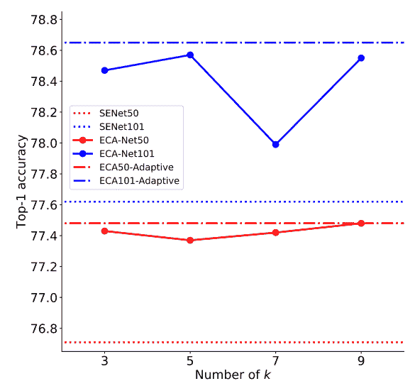

此外，根据论文，作者提供了 ECA-block 的 PyTorch 代码片段，其中包含用于计算内核大小的自适应函数 *ψ* ( *C* ):

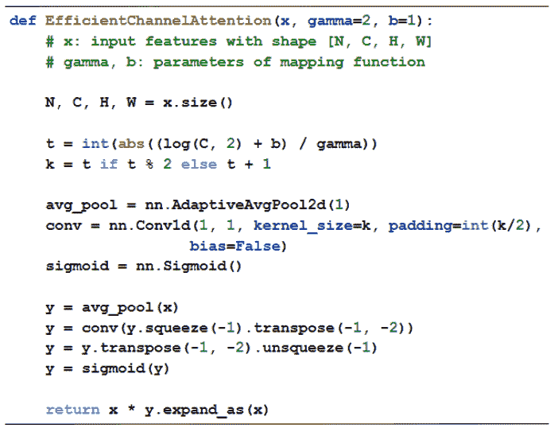

## 基准

在这里，我们将浏览作者在不同任务中为 ECA-Net 演示的结果，从 ImageNet-1k 分类、MS-COCO 上的对象检测和 MS-COCO 上的实例分割开始。作者还提供了额外的比较指标，如推理和训练 FPS(每秒帧数)，与深度卷积神经网络中普遍使用的其他标准注意机制相比，它巩固了 ECA 块注意的效率。

### ImageNet-1k

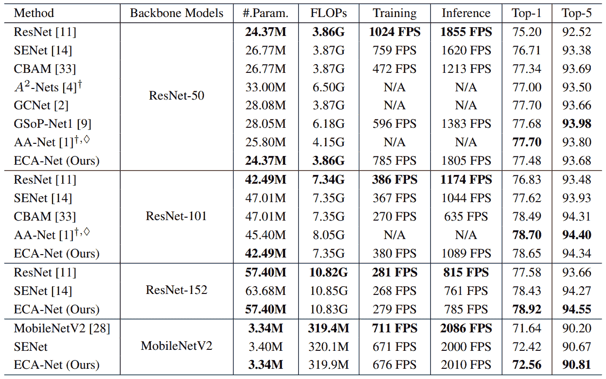

**ECA-Net 与其他先进(SOTA)模型的比较:**

作者将他们的 ECA-Net 模型与其他类似的复杂性模型进行比较，以展示 ECA-Net 的效率，如下表所示:

| CNN 模型 | 因素 | 拖鞋 | 最高精度 | 前 5 名准确度 |
| --- | --- | --- | --- | --- |
| ResNet-200 | 74.45 米 | 14.10 克 | Seventy-eight point two | Ninety-four |
| 盗梦空间-第三版 | 25.90 米 | 5.36 克 | Seventy-seven point four five | Ninety-three point five six |
| ResNeXt-101 | 46.66 米 | 7.53 克 | Seventy-eight point eight | Ninety-four point four |
| DenseNet-264 (k=32) | 31.79 米 | 5.52 克 | Seventy-seven point eight five | Ninety-three point seven eight |
| DenseNet-161 (k=48) | 27.35 米 | 7.34 克 | Seventy-seven point six five | Ninety-three point eight |
|  |  |  |  |  |
| 非洲经委会网络 50 | 24.37 米 | **3.86 克** | **77.48** | **93.68** |
| ECA-Net101 | 42.49 米 | **7.35 克** | 78.65 | **94.34** |

### MS-COCO 上的目标检测

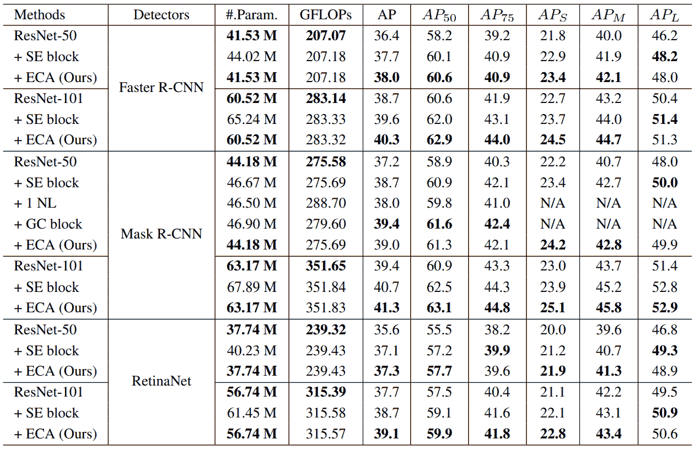

### MS-COCO 上的实例分割

| 方法 | 美国联合通讯社(Associated Press) | AP[50] | 美联社[75] | 美联社[S] | 米 | AP[L] |
| --- | --- | --- | --- | --- | --- | --- |
| ResNet-50 | Thirty-four point one | Fifty-five point five | Thirty-six point two | Sixteen point one | Thirty-six point seven | Fifty |
| + SE block | Thirty-five point four | Fifty-seven point four | Thirty-seven point eight | Seventeen point one | Thirty-eight point six | Fifty-one point eight |
| + 1 NL | Thirty-four point seven | Fifty-six point seven | Thirty-six point six | 不适用的 | 不适用的 | 不适用的 |
| + GC 模块 | **35.7** | **58.4** | Thirty-seven point six | 不适用的 | 不适用的 | 不适用的 |
| + ECA(熊) | Thirty-five point six | Fifty-eight point one | **37.7** | **17.6** | **39.0** | **51.8** |
|  |  |  |  |  |  |  |
| ResNet-101 | Thirty-five point nine | Fifty-seven point seven | Thirty-eight point four | Sixteen point eight | Thirty-nine point one | Fifty-three point six |
| + SE block | Thirty-six point eight | Fifty-nine point three | Thirty-nine point two | Seventeen point two | Forty point three | Fifty-three point six |
| + ECA(熊) | **37.4** | **59.9** | **39.8** | **18.1** | **41.1** | **54.1** |

*注意——作者在本实验中使用了屏蔽 R-CNN*

尽管 GC 块的性能优于 ECA 块，但是，就计算复杂度而言，GC 比 ECA 昂贵得多，这证明了 ECA 的性能。

## 缺点

虽然这些论文提出了一种比挤压和激励更便宜、更有效的计算渠道注意力的方法，但它也有其不足之处:

1.  与每个通道注意力变体一样，ECA-Net 也受到中间张量的困扰，这些中间张量以( *C* x *H* x *W* )的形式传播到输入的完整形状，从而导致内存使用量增加。
2.  与每一个独立的通道注意力变体一样，该块不提供任何形式的每像素/像素方式的注意力或本质上的空间注意力，这本身是很重要的。
3.  作者没有提供自适应核大小函数 *ψ* ( *C* )背后清晰的直觉，尤其是 *γ* 和 *b* 默认值背后的原因。作者也没有阐明将内核大小设置为缺省值 3 而不是使用自适应函数。

## 参考

1.  ECA-Net:深度卷积神经网络的有效通道关注，CVPR 2020。
2.  ECA-Net 的官方 Github 存储库。
3.  [挤压和激励网络，CVPR 和 TPAMI 2018。](https://arxiv.org/abs/1709.01507)