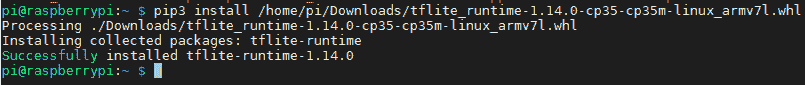
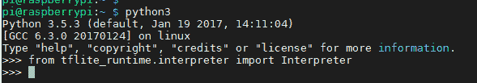

# 如何在 Raspberry Pi 上运行 TensorFlow Lite 模型

> 原文：<https://blog.paperspace.com/tensorflow-lite-raspberry-pi/>

使用 TensorFlow 创建的深度学习模型需要高处理能力来执行推理。幸运的是，TensorFlow 有一个精简版，称为 TensorFlow Lite(简称 TFLite)，它允许这种模型在功能有限的设备上运行。推理在不到一秒的时间内完成。

在本教程中，我们将准备 Raspberry Pi (RPi)来运行一个用于分类图像的 TFLite 模型。之后，MobileNet 模型的 TFLite 版本将被下载并用于在设备上进行预测。

本教程涵盖的部分如下:

*   从 PC 访问 Raspberry Pi
*   在 RPi 中准备 TFLite
*   下载 MobileNet
*   对单个图像进行分类

让我们开始吧。

# 从 PC 访问 Raspberry Pi

您有多种方法可以访问 Raspberry Pi。无论您使用哪种方式，本节的目标都是能够访问 RPi 的终端，以便输入命令来帮助它为 TFLite 做准备。让我们讨论其中的一些方法。

一种方法是通过 HDMI 端口将 RPi 连接到显示器，并插入鼠标和键盘，将 RPi 用作普通 PC。RPi 成功启动后，您可以访问它的 GUI 并打开它的终端来输入命令，比如安装或下载某些东西。不幸的是，当你购买新的 RPi 时，这种方法可能不起作用，因为需要更改一些设置以允许使用 HDMI 端口。

使用专用显示器和外围设备访问 RPi 成本很高，除非您有自己的 PC/笔记本电脑来执行此操作。当使用您自己的 PC 来控制 RPi 时，您首先需要将 RPi 的以太网端口连接到交换机中的端口。交换机必须支持 DHCP(动态主机配置协议),以便自动为 RPi 提供 IP 地址。将 IP 地址分配给 RPi 后，您可以使用 IP 扫描工具从连接到同一台交换机的 PC 上找到 RPi 以太网接口的 IP 地址。获得 RPi 的 IP 地址后，您可以从您的 PC 上打开一个 SSH 会话，在该会话中您可以访问 RPi 终端。你可以在本教程中找到关于这个过程的更多细节。

使用上述方法，每次需要访问 RPi 时，都必须将其连接到交换机。为了方便起见，我们可以使用无线接口。将 RPi 连接到交换机端口后，您可以通过在无线网络上配置其无线接口，使 RPi 的未来访问更加容易。例如，这个网络可以是使用智能手机创建的热点。网络配置完成后，您以后可能不需要使用交换机。您只需将您的电脑连接到同一个无线网络。IP 扫描工具可以告诉您 RPi 中无线接口的 IP 地址。之后，您可以打开一个 SSH 会话，在该会话中可以访问 RPi 终端。

无论您使用何种方式访问 RPi，您都应该能够根据下图访问终端。此时，您可以在终端中发出命令来准备 TFLite。我们将在下一节讨论这一点。


# 在 RPi 中准备 TFLite

本教程假设您已经将 TensorFlow 模型转换为 TensorFlow Lite 模型。如果没有，还有大量 TensorFlow Lite 模型可供下载。我们将使用精简版的 **MobileNet** 。

TensorFlow Lite 是 TensorFlow 的一部分。通过安装 TensorFlow 库，您也将安装 Lite 版本。在安装 TensorFlow 之前，只需考虑您的项目所需的模块。在本教程中，我们只需要运行一个 TFLite 模型来对图像进行分类，仅此而已。基于此，我们不需要在 TensorFlow 中安装所有东西；只有与我们的任务相关的部分。

为了使用 TFLite 模式进行预测，TensorFlow 中唯一需要的类是由`tensorflow.lite.python.interpreter.Interpreter`访问的`Interpreter`类。因此，我们可以只安装这个类，而不是在 TensorFlow 中安装所有东西。这可以节省我们的存储空间，避免保存未使用的文件。那么，我们如何从 TensorFlow 得到这个类呢？

有一个名为`tflite_runtime`的包只包含了`Interpreter`类。可以通过`tflite_runtime.interpreter.Interpreter`访问。要安装`tflite_runtime`包，只需下载适用于 RPi 上运行的 Python 版本的 Python wheel。以下是基于 Python 版本的车轮文件的下载链接(例如 [Python 3.5](https://dl.google.com/coral/python/tflite_runtime-1.14.0-cp35-cp35m-linux_armv7l.whl) 或 [Python 3.7](https://dl.google.com/coral/python/tflite_runtime-1.14.0-cp37-cp37m-linux_armv7l.whl) )。

在我的 RPi 中，*。whl* 文件下载到这个路径:*/home/pi/Downloads/TF lite _ runtime-1 . 14 . 0-cp35-cp35m-Linux _ arm v7l . whl*。然后我使用`pip3 install`，如下图所示，来安装它。请注意，您需要使用`pip3`，因为只有`pip`会引用 Python 2。

```py
pip3 install /home/pi/Downloads/tflite_runtime-1.14.0-cp35-cp35m-linux_armv7l.whl
```

下图显示软件包安装成功。



在成功安装了`tflite_runtime`之后，您可以通过根据下一行导入`Interpreter`类来检查一切是否正常工作:

```py
from tflite_runtime.interpreter import Interpreter
```

下图显示一切运行正常。



要知道安装`tflite_runtime`并不意味着安装了 TFLite 中的所有东西，这一点很重要。只有`Interpreter`类可用，它基于现有的 TFLite 模型进行预测。如果您需要 TFLite 的更多功能，那么您需要安装完整的 TensorFlow 包。

在安装了`tflite_runtime`并使您的 RPi 准备好进行预测之后，下一步是使 TFLite 模型在 RPi 存储中可用(也就是说，通过下载)。下一节讨论下载 MobileNet 的 TFLite 版本。

# 下载 MobileNet

MobileNet 已经被转换成了 TFLite 版本，可以在这里下载[。它是一个压缩文件，不仅包含 TFLite 模型，还包含模型预测的类标签。解压缩该文件后，其内容如下:](https://storage.googleapis.com/download.tensorflow.org/models/tflite/mobilenet_v1_1.0_224_quant_and_labels.zip)

1.  mobile net _ v1 _ 1.0 _ 224 _ how . tft lite
2.  labels _ mobile net _ quat _ v1 _ 224 . txt

MobileNet 有两个版本，每个版本都支持不同形状的输入图像。这里我们将使用版本 1，它接受形状的图像(224，224)。最后，模型被量化，这是减少模型大小和减少预测延迟的一个步骤。

我在 RPi 中创建了一个名为 *TFLite_MobileNet* 的新文件夹来存放这两个项目，如下所示。

```py
/home/pi/TFLite_MobileNet
	mobilenet_v1_1.0_224_quant.tflite
	labels_mobilenet_quant_v1_224.txt
	test.jpg
```

我还包含了一个样本图像，test.jpg(如下所示)，用于输入模型进行分类。


"test.jpg"

现在我们已经准备好了所有需要的文件，在下一节中，我们将看到如何将这个图像提供给模型来预测它的类标签。

# 对单个图像进行分类

下面列出了加载 TFLite 模型和对图像进行分类所需的代码。我们从加载所需的库开始。然后在`model_path`和`labels`变量中准备模型和类标签的路径。然后模型路径被提供给`Interpreter`类构造函数来加载它。加载的模型在`interpreter`变量中返回。

```py
from tflite_runtime.interpreter import Interpreter 
from PIL import Image
import numpy as np
import time

data_folder = "/home/pi/TFLite_MobileNet/"

model_path = data_folder + "mobilenet_v1_1.0_224_quant.tflite"
label_path = data_folder + "labels_mobilenet_quant_v1_224.txt"

interpreter = Interpreter(model_path)
print("Model Loaded Successfully.")

interpreter.allocate_tensors()
_, height, width, _ = interpreter.get_input_details()[0]['shape']
print("Image Shape (", width, ",", height, ")")

# Load an image to be classified.
image = Image.open(data_folder + "test.jpg").convert('RGB').resize((width, height))

# Classify the image.
time1 = time.time()
label_id, prob = classify_image(interpreter, image)
time2 = time.time()
classification_time = np.round(time2-time1, 3)
print("Classificaiton Time =", classification_time, "seconds.")

# Read class labels.
labels = load_labels(label_path)

# Return the classification label of the image.
classification_label = labels[label_id]
print("Image Label is :", classification_label, ", with Accuracy :", np.round(prob*100, 2), "%.")
```

模型加载后，调用`allocate_tensors()`方法为输入和输出张量分配内存。内存分配后，调用`get_input_details()`方法返回一些关于输入张量的信息。这包括输入图像的宽度和高度。我们为什么要返回这些信息？记住，加载的模型接受形状的图像(224，224)。如果一个不同大小的图像被输入到模型中，我们将会得到一个错误。通过了解模型接受的图像的宽度和高度，我们可以相应地调整输入的大小，这样一切都会正常工作。

返回输入张量的宽度和高度后，使用 PIL 读取测试图像，返回的图像大小设置为等于模型接受的图像大小。

现在我们已经准备好了模型和图像。接下来，我们将使用下面实现的`classify_image()`函数对图像进行分类。在其中，模型的输入张量根据`set_input_tensor()`函数被设置为等于测试图像。下一步是使用`invoke()`函数运行模型并传播输入以获得输出。返回的输出是类索引，以及它的概率。

```py
def classify_image(interpreter, image, top_k=1):
  tensor_index = interpreter.get_input_details()[0]['index']
  input_tensor = interpreter.tensor(tensor_index)()[0]
  input_tensor[:, :] = image

  interpreter.invoke()
  output_details = interpreter.get_output_details()[0]
  output = np.squeeze(interpreter.get_tensor(output_details['index']))

  scale, zero_point = output_details['quantization']
  output = scale * (output - zero_point)

  ordered = np.argpartition(-output, top_k)
  return [(i, output[i]) for i in ordered[:top_k]][0]
```

返回分类概率后，使用下面实现的`load_labels()`函数从文本文件中加载分类标签。它接受文本文件路径并返回一个带有类标签的列表。图像被分类到的类别的索引用于返回相关的类别标签。最后，打印这个标签。

```py
def load_labels(path): # Read the labels from the text file as a Python list.
  with open(path, 'r') as f:
    return [line.strip() for i, line in enumerate(f.readlines())]
```

下面列出了完整的代码。

```py
from tflite_runtime.interpreter import Interpreter 
from PIL import Image
import numpy as np
import time

def load_labels(path): # Read the labels from the text file as a Python list.
  with open(path, 'r') as f:
    return [line.strip() for i, line in enumerate(f.readlines())]

def set_input_tensor(interpreter, image):
  tensor_index = interpreter.get_input_details()[0]['index']
  input_tensor = interpreter.tensor(tensor_index)()[0]
  input_tensor[:, :] = image

def classify_image(interpreter, image, top_k=1):
  set_input_tensor(interpreter, image)

  interpreter.invoke()
  output_details = interpreter.get_output_details()[0]
  output = np.squeeze(interpreter.get_tensor(output_details['index']))

  scale, zero_point = output_details['quantization']
  output = scale * (output - zero_point)

  ordered = np.argpartition(-output, 1)
  return [(i, output[i]) for i in ordered[:top_k]][0]

data_folder = "/home/pi/TFLite_MobileNet/"

model_path = data_folder + "mobilenet_v1_1.0_224_quant.tflite"
label_path = data_folder + "labels_mobilenet_quant_v1_224.txt"

interpreter = Interpreter(model_path)
print("Model Loaded Successfully.")

interpreter.allocate_tensors()
_, height, width, _ = interpreter.get_input_details()[0]['shape']
print("Image Shape (", width, ",", height, ")")

# Load an image to be classified.
image = Image.open(data_folder + "test.jpg").convert('RGB').resize((width, height))

# Classify the image.
time1 = time.time()
label_id, prob = classify_image(interpreter, image)
time2 = time.time()
classification_time = np.round(time2-time1, 3)
print("Classificaiton Time =", classification_time, "seconds.")

# Read class labels.
labels = load_labels(label_path)

# Return the classification label of the image.
classification_label = labels[label_id]
print("Image Label is :", classification_label, ", with Accuracy :", np.round(prob*100, 2), "%.")
```

打印消息的输出如下所示。

```py
Model Loaded Successfully.
Image Shape ( 224 , 224 )
Classificaiton Time = 0.345 seconds.
Image Label is : Egyptian cat , with Accuracy : 53.12 %.
```

这就是在 RPi 上使用 TFLite 对图像进行分类所需要知道的一切。

# 结论

本教程展示了如何在 Raspberry Pi 上使用 TensorFlow Lite。我们查看了对单个图像进行分类的样例用例。没有必要安装完整的 TensorFlow 包；只是使用了`tflite_runtime`，它支持`Interpreter` 类。MobileNet 模型是预先训练好的，并且已经转换为 TFLite 模型，用于进行预测。