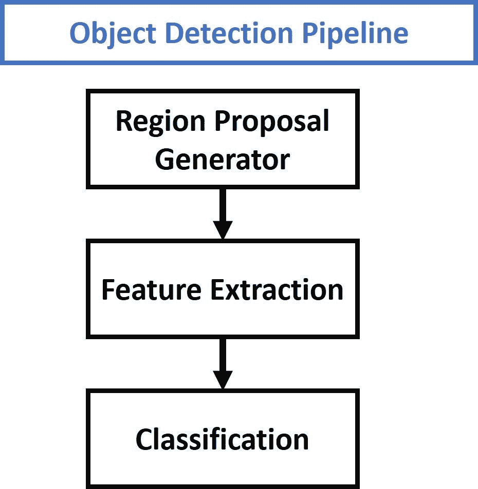
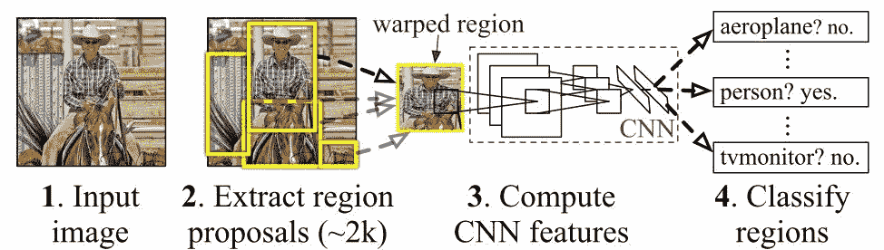
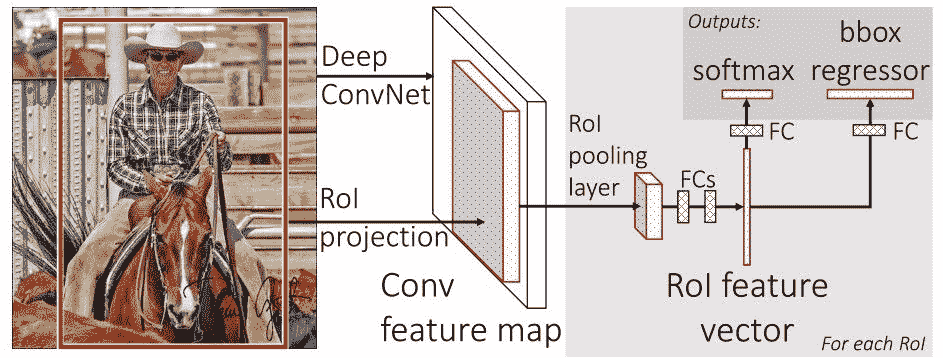
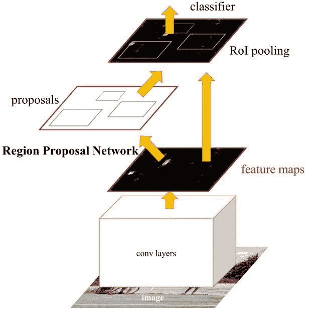
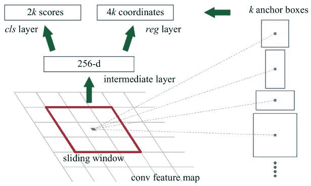
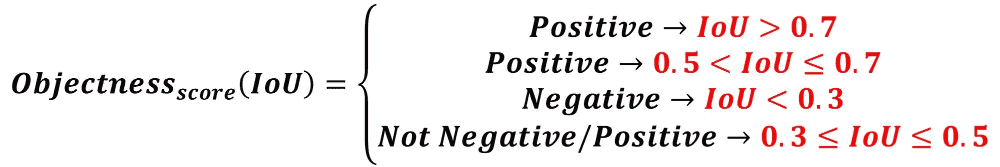
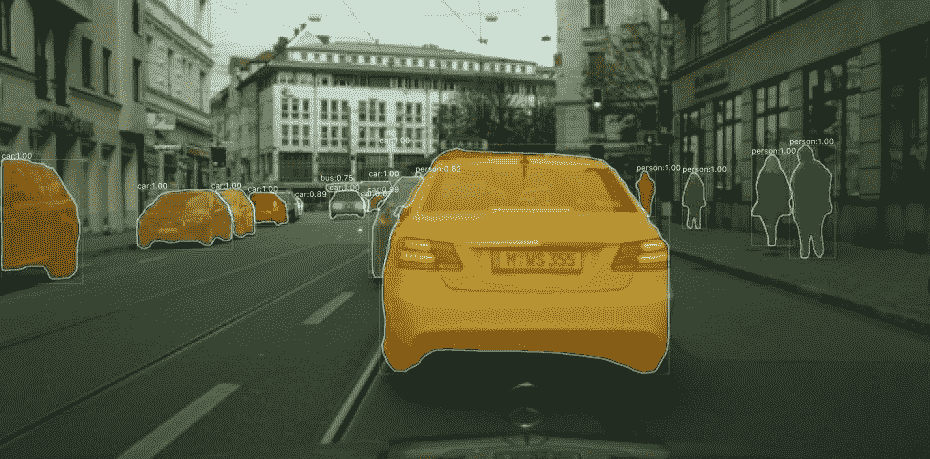

# 更快的 R-CNN 解释为对象检测任务

> 原文：<https://blog.paperspace.com/faster-r-cnn-explained-object-detection/>

这篇文章对微软的一组研究人员开发的更快的 R-CNN 模型进行了评论。更快的 R-CNN 是用于对象检测的深度卷积网络，在用户看来是单个端到端的统一网络。该网络可以准确快速地预测不同物体的位置。为了真正理解更快的 R-CNN，我们还必须快速概述一下它的发展网络，即 R-CNN 和快速 R-CNN。

本文从快速回顾基于区域的 CNN ( **R-CNN** )开始，这是使用预训练的 CNN 建立提取特征的对象检测模型的第一次尝试。接下来，**快速 R-CNN** 快速回顾，比 **R-CNN** 更快但不幸的是忽略了地区提案是如何产生的。这一问题随后由**更快的 R-CNN** 解决，它构建了一个区域提议网络，可以生成区域提议，这些提议被馈送到检测模型(快速 R-CNN)以检查对象。

这篇文章的大纲如下:

*   对象检测管道概述
*   R-CNN 评论
*   快速 R-CNN 概述
*   更快的 R-CNN
*   主要贡献
*   区域提案网络
*   锚
*   客观性分数
*   RPN 和快速 R-CNN 之间的特征共享
*   训练更快的 R-CNN
*   交替训练
*   近似联合训练
*   非近似联合训练
*   缺点
*   屏蔽 R-CNN
*   结论
*   参考

文中提到的论文可以免费下载。在本文末尾的**参考文献**部分可以找到这些论文的引文和下载链接。

让我们开始吧。

## **物体检测流水线概述**

传统的物体检测技术遵循下图中给出的 3 个主要步骤。第一步是提出几个区域提案。这些区域建议是其中可能有对象的候选者。这些区域的数量通常为数千个，例如 2000 个或更多。生成区域建议的一些算法的例子是选择性搜索和边缘框。

从每个区域提议中，使用各种图像描述符(例如，像梯度方向直方图(HOG ))来提取固定长度的特征向量。这个特征向量对于物体检测器的成功是至关重要的。向量应该充分地描述一个对象，即使它由于某种变换而变化，如缩放或平移。



然后，使用特征向量将每个区域提议分配给背景类或对象类之一。随着类数量的增加，构建一个能够区分所有这些对象的模型的复杂性也在增加。用于对区域提议进行分类的一个流行模型是支持向量机(SVM)。

这个快速概述足以理解基于区域的卷积神经网络(R-CNN)的基础。

## **R-CNN 快速概览**

2014 年，加州大学伯克利分校的一组研究人员开发了一种深度卷积网络，称为 R-CNN(基于区域的卷积神经网络的简称)$[1]$可以检测图像中 80 种不同类型的对象。

与上图所示的对象检测技术的通用管道相比，R-CNN $[1]$的主要贡献只是基于卷积神经网络(CNN)提取特征。除此之外，一切都类似于通用对象检测管道。下图显示了 R-CNN 模型的工作原理。



R-CNN 由 3 个主要模块组成:

1.  第一个模块使用**选择性搜索**算法生成 2000 个区域建议。
2.  在被调整大小到固定的预定义大小之后，第二模块从每个区域提议中提取长度为 4096 的特征向量。
3.  第三模块使用预训练的 SVM 算法将区域提议分类到背景或对象类别之一。

R-CNN 模式有一些缺点:

*   它是一个多阶段模型，每个阶段都是一个独立的组件。因此，它不能进行端到端的培训。
*   它将从预先训练的 CNN 提取的特征缓存在磁盘上，以便稍后训练支持向量机。这需要数百千兆字节的存储空间。
*   R-CNN 依赖于选择性搜索算法来生成区域提议，这需要大量时间。此外，该算法不能针对检测问题进行定制。
*   每个区域提议被独立地馈送给 CNN 用于特征提取。这使得实时运行 R-CNN 变得不可能。

作为 R-CNN 模型的扩展，快速 R-CNN 模型被提出$[2]$以克服一些限制。下一节将简要介绍快速 R-CNN。

## **快速 R-CNN 快速概述**

Fast R-CNN $[2]$是一个物体探测器，由脸书人工智能研究员、前微软研究员 [Ross Girshick](https://github.com/rbgirshick) 单独开发。快速 R-CNN 克服了 R-CNN 的几个问题。顾名思义，快速 R-CNN 相对于 R-CNN 的一个优势就是速度快。

以下是$[2]中主要贡献的总结:

1.  提出了一个名为 **ROI Pooling** 的新层，它从同一图像的所有提议(即 ROI)中提取等长特征向量。
2.  与具有多个阶段(区域提议生成、特征提取和使用 SVM 的分类)的 R-CNN 相比，更快的 R-CNN 建立了只有单个阶段的网络。
3.  更快的 R-CNN 跨所有提议(即 ROI)共享计算(即卷积层计算),而不是为每个提议单独进行计算。这是通过使用新的 **ROI Pooling** 层来实现的，这使得快速 R-CNN 比 R-CNN 更快。
4.  快速 R-CNN 不缓存提取的特征，因此与需要数百千兆字节的 R-CNN 相比，不需要这么多的磁盘存储。
5.  快速 R-CNN 比 R-CNN 更准确。

快速 R-CNN 的一般架构如下所示。与 R-CNN 中的 3 个阶段相比，该模型由单个阶段组成。它只接受一个图像作为输入，并返回检测到的对象的类别概率和边界框。



来自最后一个卷积层的特征图被馈送到 ROI 汇集层。原因是从每个区域提议中提取固定长度的特征向量。下面的 GIF 显示了 ROI Pooling 层是如何工作的。

简而言之，ROI Pooling 层的工作原理是将每个区域提案分成一个单元格网格。max pooling 运算应用于网格中的每个单元格，以返回单个值。来自所有单元的所有值代表特征向量。如果网格大小为 2 **×** 2，则特征向量长度为 4。

有关 ROI Pooling 层的更多信息，请查看本文。


[Source](https://deepsense.ai/region-of-interest-pooling-explained)

使用 ROI 池提取的特征向量然后被传递到一些 FC 层。最后一个 FC 层的输出被分成两个分支:

1.  **Softmax 层**预测班级分数
2.  **FC 层**预测被检测物体的包围盒

在 R-CNN 中，每个区域提议独立于其他区域提议被馈送到模型。这意味着如果单个区域需要 *S* 秒来处理，那么 *N* 个区域需要`S*N`秒。快速 R-CNN 比 R-CNN 更快，因为它跨多个提议共享计算。

R-CNN $[1]$从每幅图像中采样单个 ROI，而快速 R-CNN $[2]$从同一幅图像中采样多个 ROI。例如，R-CNN 从 128 个不同的图像中选择一批 128 个区域。因此，总处理时间为`128*S`秒。

对于更快的 R-CNN，这一批 128 个区域可以仅从 2 个图像中选择(每个图像 64 个区域)。当从同一图像中对区域进行采样时，它们的卷积层计算是共享的，这减少了时间。所以，处理时间下降到`2*S`。然而，从同一图像中采样多个区域会降低性能，因为所有区域都是相关的。

尽管快速 R-CNN 模型具有优点，但是存在严重的缺点，因为它依赖于耗时的选择性搜索算法来生成区域提议。选择性搜索方法不能在特定对象检测任务上定制。因此，检测数据集中的所有目标对象可能不够准确。

在下一节中，将介绍更快的 R-CNN $[3]$。更快的 R-CNN 建立了一个生成地区建议的网络。

## **更快的 R-CNN**

更快的 R-CNN $[3]$是快速 R-CNN $[2]$的扩展。顾名思义，更快的 R-CNN 比快速 R-CNN 更快，这要归功于区域提议网络(RPN)。

### **主要贡献**

本文的主要贡献是$[3]$:

1.  提议**区域提议网络(RPN)** 这是一个完全卷积的网络，可生成各种规模和纵横比的提议。RPN 使用**神经网络的术语**来告诉目标检测(快速 R-CNN)在哪里寻找。
2.  本文引入了**锚框**的概念，而不是使用**图像金字塔**(即图像的多个实例，但比例不同)或**过滤器金字塔**(即大小不同的多个过滤器)。锚定框是具有特定比例和纵横比的参考框。对于多个参考锚定框，单个区域存在多个比例和纵横比。这可以被认为是参考锚盒的**金字塔。然后将每个区域映射到每个参考锚定框，从而检测不同比例和纵横比的对象。**
3.  卷积计算由 RPN 和快速 R-CNN 共享。这减少了计算时间。

更快的 R-CNN 的架构如下图所示。它由两个模块组成:

1.  **RPN** :用于生成区域建议。
2.  **快速 R-CNN** :用于检测建议区域内的物体。

RPN 模块负责生成区域提案。它应用了神经网络中注意力的概念，因此它引导快速 R-CNN 检测模块在图像中的何处寻找物体。



请注意卷积层(例如计算)是如何在 RPN 和快速 R-CNN 模块之间共享的。

更快的 R-CNN 工作方式如下:

*   RPN 生成区域建议。
*   对于图像中的所有区域提议，使用 ROI 池层$[2]$，从每个区域提取固定长度的特征向量。
*   然后使用快速 R-CNN 对提取的特征向量进行分类。
*   除了它们的包围盒之外，还返回检测到的对象的类别分数。

### **地区提案网络**

R-CNN 和快速 R-CNN 模型依赖于选择性搜索算法来生成区域提议。每一个提议都被送到预先训练好的 CNN 进行分类。本文提出了一种可以产生区域建议的网络，称为区域建议网络(RPN)。这有一些优点:

1.  现在使用可以根据检测任务来训练和定制的网络来生成区域提议。
2.  因为建议是使用网络生成的，所以可以对其进行端到端的训练，以根据检测任务进行定制。因此，与一般的方法如**选择性搜索**和**边缘框**相比，它产生了更好的区域建议。
3.  RPN 使用快速 R-CNN 检测网络中使用的相同卷积层来处理图像。因此，与选择性搜索等算法相比，RPN 不需要额外的时间来产生建议。
4.  由于共享相同的卷积层，RPN 和快速 R-CNN 可以合并/统一到单个网络中。因此，训练只进行一次。

RPN 处理从与快速 R-CNN 共享的最后一个卷积层返回的输出特征图。下图显示了这一点。基于大小为`nxn`的矩形窗口，滑动窗口穿过特征图。对于每个窗口，生成几个候选区域提议。这些提案不是最终提案，因为它们将根据“客观性得分”进行筛选(如下所述)。

### **锚**

根据下图，最后一个共享卷积层的特征图通过一个大小为`nxn`的矩形滑动窗口，其中`n=3`为 VGG-16 网。对于每个窗口，`K`区域的建议被生成。每个方案都根据一个称为**锚盒**的参考盒进行参数化。锚箱的两个参数是:

1.  规模
2.  长宽比

通常，有 3 个比例和 3 个纵横比，因此总共有`K=9`个锚盒。但是`K`可能不同于 9。换句话说，`K`区域是从每个区域提议中产生的，其中每个`K`区域在比例或纵横比上有所不同。下图显示了一些锚点变体。



使用参考锚(即锚盒)，使用单一比例的单一图像，同时能够提供比例不变的对象检测器，因为锚存在于不同的比例。这避免了使用多个图像或过滤器。多尺度锚是在 RPN 和快速 R-CNN 检测网络中共享特征的关键。

对于每个`nxn`区域提议，提取特征向量(对于 ZF 网长度为 256，对于 VGG-16 网长度为 512)。该向量然后被馈送到两个兄弟全连接层:

1.  第一个 FC 层被命名为`cls`，并且代表一个二元分类器，该二元分类器为每个区域提议(即，该区域是否包含对象，或者是背景的一部分)生成**对象性得分**。
2.  第二个 FC 层被命名为`reg`，它返回一个定义区域边界框的四维向量。

第一 FC 层(即二元分类器)具有 2 个输出。第一个用于将该区域分类为背景，第二个用于将该区域分类为对象。下一节讨论如何将客观性分数分配给每个锚点，以及如何使用它来产生分类标签。

### **客观分数**

`cls`层为每个区域提议输出 2 个元素的向量。如果第一个元素为 1，第二个元素为 0，则区域建议被分类为背景。如果第二个元素为 1，第一个元素为 0，则该区域表示一个对象。

为了训练 RPN，基于**交集-并集(IoU)** 给每个锚点一个正的或负的客观分数。

IoU 是锚盒和地面实况盒之间的相交区域与两个盒的联合区域的**之比。IoU 范围为 0.0 至 1.0。无交集时，借据为 0.0。随着两个盒子越来越靠近，IoU 会增加，直到达到 1.0(当两个盒子 100%相同时)。**

接下来的 4 个条件使用 IoU 来确定是否将正的或负的**客观性分数**分配给锚点:

1.  与任何地面实况框具有高于 **0.7** 的 IoU 重叠的锚被给予正对象标签。
2.  如果没有 IoU 重叠高于 **0.7** 的锚点，则使用地面实况框为 IoU 重叠最高的锚点分配一个正标签。
3.  当所有地面实况框的 IoU 重叠小于 **0.3** 时，负的**客观性分数**被分配给**非正的**锚。负的客观性分数意味着锚被分类为背景。
4.  既不积极也不消极的锚对训练目标没有贡献。

第一次看论文的时候被第二个和第三个条件搞糊涂了。所以，还是多澄清一下吧。

假设有 3 个区域提案与 3 个锚相关联，下面列出了它们的 IoU 分数和 3 个实际情况框。因为有一个 IoU 分数为 0.9(高于 0.7)的锚点，所以它被赋予该基本事实框的正客观性分数，而所有其他框为负。

```py
0.9, 0.55, 0.1
```

以下是主播分类的结果:

```py
positive, negative, negative
```

第二个条件意味着，当没有锚点的 IoU 重叠分数高于 **0.7** 时，则搜索具有最高 IoU 的锚点，并为其分配正的客观分数。预计最大借据得分小于或等于 0.7，但令人困惑的是，论文没有提到借据得分的最小值。

预计最小值应该是 **0.5** 。因此，如果锚盒的 IoU 分数大于 **0.5** 但小于或等于 **0.7** ，则为其分配一个正的客观性分数。

假设下面列出了某主播的 IoU 评分。因为最高的 IoU 分数是第二个，值为 0.55，所以落在第二个条件下。因此，它被赋予一个正的客观性分数。

```py
0.2, 0.55, 0.1
```

以下是主播分类的结果:

```py
negative, positive, negative
```

第三个条件指定当具有所有基本事实框的锚的 IoU 分数小于 0.3 时，则该锚被分配负的客观性分数。对于接下来的 IoU 分数，由于所有的 IoU 分数都小于 0.3，锚被给予 3 种情况的负分数。

```py
0.2, 0.25, 0.1
```

以下是主播分类的结果:

```py
negative, negative, negative
```

根据第四个条件，当一个锚的 IoU 得分大于或等于 0.3 但小于或等于 0.5 时，它既不被分类为正面也不被分类为负面。这个锚不用于训练分类器。

对于以下 IoU 分数，锚不会被分配任何标签，因为所有分数都在 0.3 和 0.5 之间(包括 0.3 和 0.5)。

```py
0.4, 0.43, 0.45
```

下一个等式总结了 4 个条件。



注意，第一个条件(`0.7 < IoU`)通常足以将锚标记为阳性(即，包含对象)，但是作者更喜欢提及第二个条件(`0.5 < IoU <= 0.7`)，用于不存在 IoU 为 0.7 的区域的罕见情况。

### **RPN 和 Fast R-CNN 之间的功能共享**

快速 R-CNN 架构中的两个模块，即 RPN 和快速 R-CNN，是独立的网络。他们每个人都可以单独训练。相反，对于更快的 R-CNN，可以建立一个统一的网络，其中 RPN 和快速 R-CNN 同时被训练。

核心思想是 RPN 和快速 R-CNN 共享相同的卷积层。这些层只存在一次，但是在两个网络中使用。可以称之为**图层共享**或者**特征共享**。请记住，锚＄[ 3]＄使得在更快的 R-CNN 中的两个模块之间共享特性/层成为可能。

### **训练更快的 R-CNN**

快速 R-CNN 论文$[3]$提到了在共享卷积层的同时训练 RPN 和快速 R-CNN 的 3 种不同方法:

1.  交替训练
2.  近似联合训练
3.  非近似联合训练

#### **交替训练**

第一种方法被称为**交替训练**，其中 RPN 首先被训练以生成区域提议。共享卷积层的权重基于 ImageNet 上预先训练的模型进行初始化。RPN 的其他权重是随机初始化的。

在 RPN 产生区域提议的盒子之后，RPN 和共享卷积层的权重都被调整。

RPN 生成的建议用于训练快速 R-CNN 模块。在这种情况下，共享卷积层的权重由 RPN 用调整后的权重初始化。其他快速 R-CNN 权重是随机初始化的。当快速 R-CNN 被训练时，快速 R-CNN 和共享层的权重都被调整。共享层中调整的权重再次用于训练 RPN，并且重复该过程。

根据$[3]$, **交替训练**是训练两个模块的首选方式，并应用于所有实验。

#### **近似联合训练**

第二种方法称为**近似联合训练**，其中 RPN 和 Fast R-CNN 都被视为单个网络，而不是 2 个独立的模块。在这种情况下，区域提案由区域方案网络产生。

在不更新 RPN 和共享层的权重的情况下，建议被直接馈送到快速 R-CNN，该 CNN 检测物体的位置。只有在快速 R-CNN 产生其输出之后，快速 R-CNN 中的权重才被调整。

因为在生成区域提议之后，RPN 和共享层的权重没有被更新，所以相对于区域提议的权重梯度被忽略。与第一种方法相比，这降低了该方法的准确性(即使结果很接近)。另一方面，训练时间减少约 25-50%。

#### **非近似联合训练**

在**近似联合训练**方法中，使用 **RoI 扭曲**层，以允许计算相对于提议的边界框的权重梯度。

### **弊端**

更快的 R-CNN 的一个缺点是，在训练 RPN 时，小批量(大小为 256)中的所有锚都是从单个图像中提取的。因为来自单个图像的所有样本可能是相关的(即，它们的特征是相似的)，所以网络可能需要很多时间才能达到收敛。

## **屏蔽 R-CNN**

作为对更快的 R-CNN $[3]$的扩展，Mask R-CNN 模型包括另一个分支，它为每个检测到的对象返回一个遮罩。



## **结论**

本文回顾了一种用于对象检测的深度卷积神经网络，称为快速 R-CNN，它可以准确地检测和分类图像中的对象。

本文首先回顾了任何对象检测模型的一般步骤。然后，它快速回顾了 R-CNN 和快速 R-CNN 模型如何工作，以便了解快速 R-CNN 正在克服的挑战。

更快的 R-CNN 是端到端训练的单级模型。它使用了一种新颖的区域建议网络(RPN)来生成区域建议，与传统的算法(如选择性搜索)相比，它节省了时间。它使用 ROI 池层从每个区域提议中提取固定长度的特征向量。

我们看到的快速 R-CNN 的一个缺点是，对于 RPN，小批量中的所有锚都是从单个图像中提取的。因为来自单个图像的所有样本可能是相关的(即，它们的特征是相似的)，所以网络可能需要很多时间才能达到收敛。

也就是说，更快的 R-CNN 是最先进的对象检测模型。屏蔽 R-CNN 从那时起就在更快的 R-CNN 的基础上构建，以返回每个检测到的对象的对象屏蔽。

## **参考文献**

1.  Girshick，Ross 等人，“用于精确对象检测和语义分割的丰富特征层次”*IEEE 计算机视觉和模式识别会议论文集*。2014.
2.  罗斯·吉斯克。"快速 r-cnn "*IEEE 计算机视觉国际会议论文集*。2015.
3.  任，，等.〈快速 r-cnn:面向区域提议网络的实时目标检测.〉*神经信息处理系统的进展*。2015.
4.  何，，等《美国有线电视新闻网》*IEEE 计算机视觉国际会议论文集*。2017.